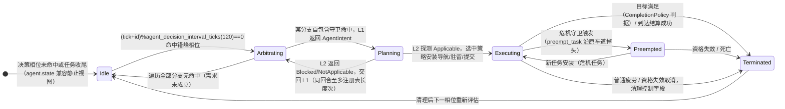
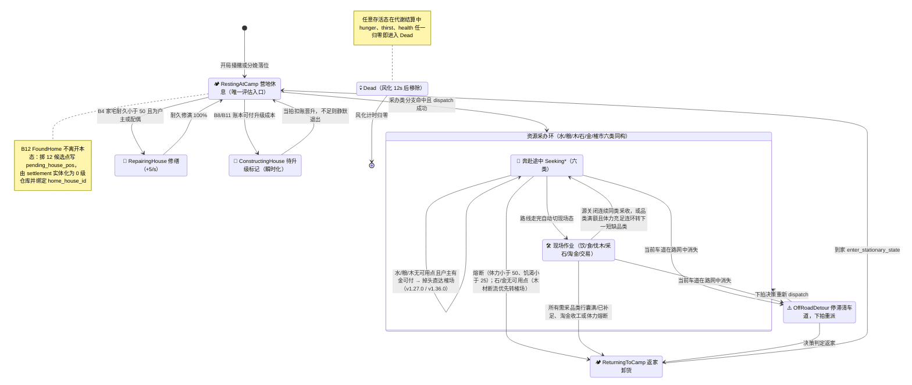
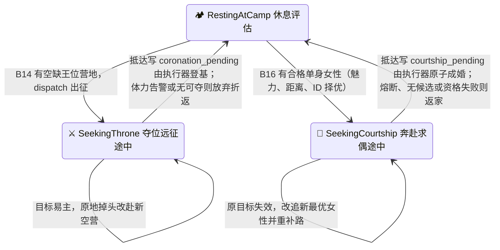

# 11. 🧠 马斯洛需求层次与行动状态机 (Motivation AI)

> **模块索引**：[← 返回 ../README.md 全景索引](../README.md) · 主要源码：`crates/sim_core/src/spatial/decisions/`（模块地图见局部 AGENTS）· 行为设计判据见 [`../design/06-agent-behavior-design.md`](../design/06-agent-behavior-design.md)

---

## 状态机

> 注：本文 `### 行动状态机总图` 的图 A/图 B 已给出 `PrimitiveActionState` 行为态与社会的状态机；本节点补充其**未单独抽出的决策仲裁与持续任务生命周期状态机**（L1/L2/L3 分层），由错峰决策节拍推进，描述一个持续任务从待命到终止的回路。



| 状态 | 含义 | 进入条件 | 退出条件 |
| :--- | :--- | :--- | :--- |
| Idle 待命 | 无活动持续任务 | 决策未命中/收尾 | 命中错峰相位进入仲裁 |
| Arbitrating 仲裁中 | L1 按配置顺序迭代分支，首个命中返回 | 错峰相位命中 | 命中出意图或全未命中 |
| Planning 规划中 | L2 只读探测候选可行性 | L1 返回意图 | Applicable 安装或 Blocked 交回 |
| Executing 执行中 | L3 导航/驻留/提交，世界物理结算 | L2 Applicable | 满足/抢占/取消 |
| Preempted 抢占中 | 危机打断，沿原车道掉头保全行囊 | 抢占矩阵命中 | 新任务安装或资格失效 |
| Terminated 终止 | 目标满足/失败/死亡取消，清理控制字段 | 上述退出条件 | 转入 Idle 重新评估 |

**不变量**（违反即出 bug）：
- 决策确定性：不消耗 WorldRng；错峰相位 `(tick+id)%120==0` 全员均摊，L1/L2/L3 在原入口运行，原语不新增第二套物理步进。
- `ActiveTask` 为持续任务单一真相源；`agent.state` 降至只读投影，死亡/胎儿生命周期优先于任务投影，到达/离路/结算结果不延迟到下一相位才同步。
- 中途掉头必须经 `turn_around_and_route_to` 保持坐标连续严禁瞬移；已结算效果不可回滚，已提交 pending 不随任务切换撤销。

## 1. 模块定位

部落民的层次化动机决策引擎，基于马斯洛需求层次驱动行为状态机。低层级需求绝对优先阻断高层任务，决策执行保持确定性（立宅选址按固定顺序消费共享 RNG），决策节拍错峰均摊以保证帧率均匀。

## 2. 意图-策略-原语三层架构与生命周期收口 (M19)

M19 架构实现了意图仲裁 (L1)、策略规划 (L2) 与原语执行 (L3) 的分层解耦：
- `agent.active_task: Option<ActiveTask>` 作为进行中持续任务的单一真相源，由 `transition.rs` 统一管理安装、推进与退出；
- `agent.state` 降级为向后兼容的只读投影视图，与 `ActiveTask` 保持强一致；
- L1 持续任务仲裁（`arbitrate_sustained_task`）、瞬发通道（`arbitrate_instant_needs`）与连续采收候选仲裁（`arbitrate_continuous_harvest_candidate`）职责清晰解耦；
- L2 策略派发（`dispatch_task`）与节拍策略推进（`step_in_progress_task`）收口执行链路；
- 存档结构 `SAVE_FORMAT_VERSION = 6`，完整持久化 `ActiveTask`；版本 6 对应 16 条活动 Branch。
- ★ **M19.4a 表现层透视**：`AgentSnapshot` 扩充 `active_task: Option<ActiveTaskSnapshot>`（四处同步：snapshot.rs / world_snapshot.rs / snapshot_bin/encode.rs / snapshot-bin.js），前端 Inspector 呈现「🧠 决策行动中枢」三栏看板（🎯 意图 / 🧭 策略 / ⚡ 原语）与瞬发待结微光 Pill（`coronation_pending` / `courtship_pending` / `raise_child_pending` / `pending_bids` / `pending_house_pos`）。
- ★ **M19.4b 分级任务抢占**（`preemption.rs`）：按当前任务与抢占意图裁决中断；积累财富、建材采收和争取王位分别受不同生存与安全危机约束，抢占沿原车道连续掉头并保全行囊。
- ★ **M19.4c 禀赋与家资个性化**：力量调节重体力采收装载速率与轻体力偏好；智力权衡「路途耗时 vs 榷场现货牌价」并偏好低磨损通衢；家户金币 ≥ `market_wealthy_family_gold` 的户主 80% 几率赴市现货采买、免于亲自挖矿伐木，平民家户则亲力亲为。
- ★ **M19.4d 多品类预排采收行程**：`Agent3D::harvest_queue: [Option<BranchId>; 4]` 定长预排队列 + `plan_harvest_itinerary` 最近邻贪心（TSP 启发式）链路优化；出发即排最多 4 站「顺路多品类」行程，现场采满一站后消费队列转下一站，候选项失效自动跳过并回退 `branch_order` 兜底；`ActiveTaskSnapshot::itinerary`（如 `💧备水 → 🌲备木 → 🍒备粮`）透传至 Inspector。
- 领域词汇、只读观察接口与 FSM 转换契约详见 [./12-m19-architecture.md](./12-m19-architecture.md) 与 [./02-core-systems-fsm.md](./02-core-systems-fsm.md)。

## 3. 核心机制

### 3.1 6 层需求层次

```
⓪ 瞬间行为 (竞购住宅 / 在宅改善 / 近距求偶 / 在宅生育)
⑤ 自我实现 (积累财富)
④ 尊重需求 (改善住宅 / 发展储备 / 争取王位)
③ 归属与爱 (求偶成家 / 生育后代)
② 安全需求 (基本储备 / 建立家宅 / 修缮住宅)
① 生理需求 (饮水解渴 / 进食充饥 / 恢复体力)
```

默认策展顺序先处理个人生存，再处理家庭保障、关系与发展。建立家宅属于安全需求；争取王位属于尊重需求，不再压过饮水、进食与恢复体力。

> ⚡ **⓪ 瞬间行为通道**：每拍先检查 b8 在宅改善、b16 近距求偶、b17 竞购住宅和 b18 在宅生育。异地改善、求偶和生育仍生成持续任务；需求层级与能否立即提交分别表达。

> 👑 **争取王位**：b14 属尊重需求。成年男性在存在符合房籍约束的空缺王位时前往最近目标；抵达后写加冕提交，由世界执行器二次校验并结算。

### 3.2 核心决策原则

**原则 1：体力 50% 以下才寻求休息**
- 体力 ≥ 50% 时全力响应外出采收、建房、修缮或高层任务。
- 仅当体力 < 50% 时，休养进入生理需求队列，引导归巢恢复至 100%。

**原则 2：低层级绝对优先**
- 仓库水/粮/过冬木柴低于 50% 时优先搬运填满，比盖房更优先。
- 房屋耐久 < 50% 时产生修缮欲望，开工后一路修缮至 100%。
- 区分「储备资金」（`StockGold`，冷却 45s）与「积累财富」（`GoldWealth`，冷却 180s）；淘金是当前共用策略，显示以活动任务来源为准。

**原则 3：私有施密特触发器 + 连续采收 + 断流重路由 + 断流直达榷场 + 单趟多品类连续采收**
详见根 AGENTS.md §4.2。要点：
- 每个 Agent 维护 `poi_seekability` 私有锁存（开启 ≥50% / 关闭 <10%，v1.26.9 起开启阈值由 30% 提升至 50%）。
- 采收现场未满时自动前往下一处自身触发器已开放的同类 POI 继续采收。
- ★ v1.35.0 单趟多品类连续采收：现场采收某品类完成（行囊装满、家宅补足或该源断流）后，若族人拥有私宅且体力 ≥ `decision_work_stamina_threshold`（默认 50%），由马斯洛引擎按当前编排顺序依次检索家宅短缺的其他品类（`b5/b6/b7/b9/b10`，分支内置行囊余量自检），有短缺且背包有余量则直接派发前往下一处 POI 继续采收，实现单趟出门连续多品类满载回宅；无短缺或体力不足时平滑返家。
- 途中发现目标触发器关闭时，通过 `turn_around_and_route_to` 原地掉头平滑重路由，绝不瞬移。
- ★ v1.27.0 / v1.36.0 / v1.46.13 断流直达榷场：**水/粮/木**采集链路中断（目标触发器关闭且无任何同类可用 POI）时，若为家户户主、可用金币（家户账本 + 随身黄金）≥ `market_min_family_gold` 且体力 ≥ 阈值，可直接原地掉头赴最近榷场交易——市场支付支持家户账本**远程结算**与随身黄金协同；石/金采集不享受该兜底。在现场若资金不足或无成交项即刻返家，杜绝卡死在榷场。

**原则 4：执行中生理熔断**
- 外出任何高层任务途中，饥渴 < 25.0 或体力 < 50.0 时立即中断并降级折返。

**原则 5：★ v1.47.0 / v1.47.1 衰弱（风烛残年）行为约束**
- 健康值 `health` 随 `agentHealthDecayPerSec` 单调递减且**永不回复**，归零即寿终正寝；
  `health < agentFrailHealthThreshold`（默认 **2.0**）进入「衰弱」状态（默认配置下约为生命最后 200 模拟秒）。
- **不再响应储备需求**：`b5 储水 / b6 储粮 / b7 储木 / b9 储石 / b10 储金 / b13 积累财富` 六条分支对衰弱者一律不触发
  （★ v1.47.1 起 b13 淘金也纳入守卫）；
  多品类预排行程（`plan_harvest_itinerary`）因此自动为空，在手任务收尾后即返家，不再为家户囤货。
  （`b4 修缮`、`b8 改善住宅` 等不属于储备需求，不受此约束。）
- **饮食优先在家解决**：衰弱者产生饮水/进食需求时，若拥有私宅且家户账本该品类余额
  ≥ `decisionHomeMealMinStock`（默认 **1.0**），则显示 `Physiological·HomeMeal` 并返家，
  由在宅进食链路（`ecology/home.rs::rest_at_camp`）从家户账本取用；余额不足才按原逻辑外出就源。
  抢占链路（`preemption.rs::preempt_critical_survival`）对在途衰弱者同样优先掉头返家，绝不瞬移。
- ★ v1.47.1 触发缺口修复：`B1QuenchThirst` / `B2SateHunger` 分支条件对衰弱者追加
  `is_frail && can_home_meal` 或条件——野外断流且市场不可购时，「家户账本余额充足」本身即成为
  需求命中依据（原实现 B1/B2 因 `can_procure_resource` 前置不命中，衰弱者即使家户有余粮也不会被派发返家）。

### 3.3 行动状态机总图（`PrimitiveActionState` · 20 态）

> 状态集权威定义在 `agent.rs::PrimitiveActionState`（共 20 态）；转移由 `evaluate.rs::decide` 按状态分发、`agent.rs::advance_to_next_lane` 在路线走完时自动切换、世界执行器（scheduler / housing_system）完成登基/成婚/升级等物理结算。移动唯一由 `current_lane_id.is_some()` 驱动，移动态→静止态必须走 `enter_stationary_state()`（根 AGENTS.md §4.16）。

**图 A · 主行为环（18 态：休息 / 六类采办 12 态 / 返家 / 建造 / 修缮 / 越野 / 死亡）**。六类采办同构：奔赴态 = `SeekingWater/Food/Wood/Stone/Gold/Market`，现场态 = `DrinkingAtWater/ForagingFood/GatheringWood/MiningStone/MiningGold/BuyingAtMarket`。



**图 B · 社会行为链（新增 2 态 `SeekingThrone` / `SeekingCourtship`，休息态与图 A 共用；均由休息态评估发起、结算后回到休息态）**



### 3.4 错峰决策节拍
- 每个引擎 tick = 1/60 游戏小时，agent 每 120 tick（2.0 游戏小时）决策一次。
- 错峰相位：`(tick_counter + agent.id) % 120 == 0`，全员相位均摊错开。
- `world.tick()` 内部顺序：POI 再生 → 代谢/繁衍 → POI 交互(装卸) → 房屋系统 → 道路衰减 → 运动 → 决策及提交结算 → 账本 → 清理。卸货发生在决策之前，决策读取卸货后的家户账本和本 tick 运动后的位置。
- 详见根 AGENTS.md §4.3。

### 3.5 分支评估顺序（数据驱动，v1.3.6 起）
- 16 条活动分支抽为 `branches.rs` 注册表；b11 合并入 b8「改善住宅」，b15 下沉为水粮木资源意图的采购策略。
  每条分支是**自包含条件函数**，
  因此任意排列都语义安全。
- `arbitrate_sustained_task` 不再硬编码优先级，而是**按配置顺序迭代注册表，首个命中即返回**。
- **Rust 层无顺序**：`decision_eval_order` / `decision_eval_levels` 默认空（未注入）时按 `BranchId::ALL`
  声明序中性兜底；策展优先级权威默认值在 `frontend/js/config.decision-order.js`，
  启动时合并进 `SIM_CONFIG` 经 `applyConfig` 注入；用户调整保存到 `flowaccord.decision-order.v3`，旧 v2 顺序按 ID 自动迁移。
- ★ v1.19.0 生产策展序将 `b16`（男性求偶成婚）提升至 `b5/b6/b7/b9/b10`（收集资源入家户账本）之前：避免单身男性被安全/备料分支长期占满决策、求偶极少触发导致人口无法自我更替；决策序唯一真相源仍为 `config.decision-order.js`。

### 3.6 decisions 子模块（9 个）
| 文件 | 职责 |
| :--- | :--- |
| `mod.rs` | 决策子模块入口与重新导出 |
| `branches.rs` | 16 条活动分支注册表：`BranchId`、自包含条件、顺序解析与层级覆盖 |
| `needs.rs` | 需求定义（MaslowLevel/NeedKind）、节点池、家宅缺口计算、`state_need_label_with_agent` 层级覆盖 |
| `evaluate.rs` | Decisioner 结构体、decide/arbitrate_sustained_task（数据驱动）/dispatch_task + ★ v1.29.0 ⓪瞬间层 evaluate_instant_needs/apply_instant_need |
| `routing.rs` | 导航/寻路/原地掉头/返家/POI 触发器可用性 |
| `seeking.rs` | 途中熔断与平滑重路由（含 `decide_seeking_throne` 夺位远征与 `decide_seeking_courtship` 奔赴求偶途中状态机）；★ v1.27.0 `try_route_to_market`（水/粮断流时户主直接改道榷场） |
| `market.rs` | 采购策略：判断水粮木能否采购、在采集与采购间选策，并处理市场途中与现场阶段 |
| `harvest.rs` | 现场采收判定 + 仓储满额查询；★ v1.27.0 水/粮目标关闭时优先转 `try_route_to_market` 再折返 |
| `scheduler.rs` | tick_decisions 调度 + ★M4 登基物理执行器 `execute_pending_coronations` + ★求偶结婚执行器 `execute_pending_courtships` / build_decision_context |

## 4. 关键不变量
- 所有决策为确定性执行，无概率掷骰（v0.9.44 起全部收敛）。
- 决策节拍默认 120 tick；`simulation_dt` 固定为 1/60，不得修改。
- 共享 RNG 按 agents 顺序依次消费，新增任何随机消耗必须保持确定性。
- 中途掉头必须通过 `turn_around_and_route_to` 保持坐标连续性，严禁闪现瞬移。
- ★ M4 夺位远征由决策分支 `B14SeekThrone` 在马斯洛引擎内驱动（生理层最高档），不消耗 `WorldRng`；登基由世界物理执行器 `execute_pending_coronations` 完成，夺位者登基/放弃后恢复正常决策。
- ★ v1.16.0 结婚由决策分支 `B16Courtship` 在马斯洛引擎内驱动（第三层：归属与爱），仅成年单身男性发起，以「魅力 libido 最高优先 → 距离最近 → ID 升序」选定单身女性目标；成婚由世界物理执行器 `execute_pending_courtships` 完成原子登记与女方转入男方家户。

## 5. 与其他模块接口
- `frontend/js/decision-viz*.js` + `config.decision-order.js`：决策引擎可视化视图拖动卡片/分界线 → ★ v1.27.0 起保存到浏览器 localStorage（★ v1.29.0 起键 `flowaccord.decision-order.v2`，旧键 v1 启动时自动迁移 0→6）→ `rustWorld.applyConfig()` 热注入本模块 `decision_eval_order`（顺序+层级覆盖）。
- `agent.rs`：读取生理指标与行囊状态，写入 agent.state（含 `SeekingThrone`）与路径。
- `ecology/`：采收与卸货的物理执行。
- `housing_system/`：FoundHome/BuildHouse/RepairHouse 的物理执行。
- `graph.rs`：A\* 寻路与路径规划。
- `ledger/region.rs`：登基/迁籍读写 `region_registry`（`set_king` 旧王入档 `history_kings`）；夺位远征目标营地记录在 `agent.expedition_target_camp`。
- `world.rs`：tick_decisions 调度，错峰相位控制。

## 6. 调参入口
决策阈值、施密特触发器、淘金冷却、立宅门槛、体力作业门槛等见 [./05-config-reference.md](./05-config-reference.md) 第 5 分区。


---

# 附篇 · 技术选型理由（为什么这样实现）

> 上篇回答「机制是什么」，本篇回答「**技术选型**为什么这么定」——错峰节拍、私有施密特触发器、加权 A\*。
> **产品设计判据**（为什么是严优先级马斯洛而非效用打分、为什么系统不能替居民派活、从求生到传承的闭环）
> 已抽出至 [`../design/06-agent-behavior-design.md`](../design/06-agent-behavior-design.md)，本篇不再重复。

> **分析对象**：`FlowAndAccord` 中部落民 (Agent) 的全部 AI 决策逻辑
> **源码位置**：`crates/sim_core/src/spatial/decisions/`（模块地图见 `decisions/AGENTS.md`）
> **本文定位**：**实现选型的深度解析**；「机制是什么」见本文件上篇。
> **版本**：v1.3.2

---

## 1. 核心结论

当前 Agent 的"AI"是**纯确定性规则系统**——层次化动机有限状态机 (FSM) + 加权 A* 寻路 + 踩踏拓路涌现 (Stigmergy) + 生理/家庭/房屋生命周期闭环。**不包含任何 LLM / 神经网络 / 学习成分**（[历史架构愿景](../../archive/10-architecture.md)中的 LLM 认知层尚未实现）。

Rust 内核 `crates/sim_core` 是唯一真实仿真实现，通过 `node tools/test-wasm.js` 同种子逐字节一致性验证；前端 `frontend/js/` 仅为表现与交互层，不存在独立 JS 移植版仿真逻辑。

---

## 2. 为什么是马斯洛层次化 FSM

### 2.1 设计选择：严格优先级的 6 层马斯洛

`needs.rs` 定义了 `MaslowLevel`（★ v1.29.0 起 6 层，低→高绝对优先）与 17 种 `NeedKind`：

| 层级 | 需求种类 | 设计意图 |
| :--- | :--- | :--- |
| ⓪ 瞬间行为 | `BidHouse` / `Courtship`(近距) / `RaiseChild`(在宅) | ★ v1.29.0 新增：条件满足即刻执行（只写决心，不移动、不消耗资源），命中后同一 tick 继续评估后续分支 |
| ① 生理 | `QuenchThirst` / `SateHunger` / `Rest` / `FoundHome` | 生存底线——饥渴/体力告急时压倒一切；末档为无家男性自立门户 |
| ② 安全 | `RepairHouse` / `StockWater` / `StockFood` / `StockWood` | 家宅储备——仓库填满优先于盖房升级 |
| ③ 归属 | `BuildHouse`(0级) | 成家立业——0级仓库仓满后施工升级成家 |
| ④ 尊重 | `BuildHouse`(1-4级) / `StockStone` / `StockGold`(45s冷却) | 建材储备与房屋升级 |
| ⑤ 自我实现 | `GoldWealth`(180s冷却) | 4 级大庄园竣工后的娱乐淘金 |

> ⚠️ **★ v1.47.0 / v1.47.1 衰弱守卫**：健康值 < `agentFrailHealthThreshold`（默认 2.0）的衰弱族人
> **不再响应上表全部储备/淘金需求**（`StockWater` / `StockFood` / `StockWood` / `StockStone` / `StockGold` / `GoldWealth`，
> ★ v1.47.1 起含 b13 淘金），饮食优先返家从家户账本解决（`Physiological·HomeMeal`），不再为家户囤货；
> 详见 [./11-decision-engine.md](./11-decision-engine.md) 决策原则 5 与 `decisions/AGENTS.md` §4.14。

> ⚔️ **★ M4 夺位远征（v1.9.0 起决策引擎驱动，生理层最高档）**：第 14 条决策分支 `B14SeekThrone` 在马斯洛引擎内评估——在世成年男性、非现任国王、且存在空缺王位营地（有房者仅夺自家房屋所在营地、无房可夺任意）时，决策器自主选定最近可夺位营地写入 `expedition_target_camp` 并 `dispatch` 为 `SeekingThrone` 冲向目标；抵达且王位仍空缺写 `coronation_pending`，由世界 `execute_pending_coronations` 校验后登基。设计理由：王位空悬属社会结构级事件，夺位作为生理层最高档需求压倒解渴/觅食/休息（看结果不看开头——王位=资源分配权=生存）（见 [./07-ledger-and-polity.md](./07-ledger-and-polity.md) §M4）。

### 2.2 为什么不用效用最大化或行为树

**产品侧判据**（生存底线不可逾越、玩家看得懂、涌现优先于剧本）已抽出至
[`../design/06-agent-behavior-design.md`](../design/06-agent-behavior-design.md) §2，本文不重复。

**实现侧只补一句**：马斯洛严格优先级用**序数而非基数**表达——低层未满足时高层完全不被考虑，
因此不需要为每个需求构造可比的分数字段，层级边界即 `MaslowLevel` 的声明顺序本身。

---

## 3. 为什么是错峰决策，而非全员同拍

`scheduler.rs::tick_decisions()` 每 tick 被调用，但每个 agent 仅在 `(tick_counter + agent.id) % 120 == 0` 相位上决策（120 tick = 2 游戏小时）。三个理由：
1. **性能均摊**：20+ agent 同时决策会导致单 tick 耗时尖峰（A* 寻路是主要开销）；错峰后每 tick 仅约 1/120 agent 决策，帧率稳定；
2. **避免共振**：全员同拍会导致"同步出发→同步到达→同步争抢同一 POI"；错峰让行为自然分散；
3. **确定性保持**：相位由 `(tick_counter + agent.id) % 120` 确定性计算，不消耗 `WorldRng`。

---

## 4. 为什么是 Agent 私有 POI 施密特触发器，而非全局共享阈值

### 4.1 设计选择：每个 agent 维护自己的 `poi_seekability`

`agent.rs::observe_poi_stock_with_config()` 在每个 agent 的决策相位更新私有触发器：
- **开启**：POI 库存升至 ≥ `config.decisionPoiSeekMinStockRatio`（0.50）；
- **关闭**：已开放点仅在跌破 < `config.decisionPoiAbandonStockRatio`（0.10）时关闭；
- **中间带**（10%~50%）：保持该 agent 的前态。

`routing.rs::available_nodes()` 和 `seeking.rs` 的路由/重路由只读取 agent 私有触发器结论，相同 POI 可被不同 agent 判为不同可用性。

### 4.2 为什么不用全局阈值

全局共享阈值会导致**雷鸣群集（Thundering Herd）**：POI 库存刚回到 30%，所有 agent 同时判定"可用"一窝蜂涌向同一点；到达后迅速采空，所有人同时放弃，形成"去→采空→走→再生→去"的振荡循环。

私有施密特触发器让每个 agent 有自己的"开放/关闭"记忆：agent A 在 35% 时开放了某 POI，即使回落到 20%（中间带）仍认为可用继续前往；agent B 从未开放过该 POI，在 20% 时仍认为不可用而选择其他点。结果是 agent 自然分散到不同 POI，避免共振，且每个 agent 的行为具有**时间一致性**（不因库存微小波动反复切换目标）。

### 4.3 中途熔断与平滑掉头

`seeking.rs` 在赶往 POI 途中检测自身对目标的触发器关闭（跌破 <10%）时：若自身仍有其他已开放同类 POI → 通过 `turn_around_and_route_to` **原地掉头**（反向进度 `rev_len - distance_along_curve`）平滑重规划赶往就近可用 POI；仅在自身无可用品或体力告警时才折返回家。

**原地掉头而非直接设新路径**：直接设新路径会导致 agent 从当前坐标"闪现"到新车道起点，破坏坐标连续性。原地掉头在当前车道反向推进，位置连续无瞬移。

---

## 5. 为什么是加权 A*，而非 Dijkstra 或贪心

### 5.1 设计选择：`graph.rs::find_path_3d_with_preference()`

```
边代价 = (curve.length / effective_speed) + grade_penalty × hidden_modifier
```

- `effective_speed = speed_limit × (0.50 + 0.333 × wear)`——道路踩踏度直接进入代价，形成"走好路"的涌现偏好；
- `grade_penalty = Δz × 1.5`（上坡惩罚）；
- `hidden_modifier`：潜行偏好暗道 ×0.4 / 普通市民避暗道 ×2.5；
- 启发式：欧氏距离 / 80（admissible，保证最短路性质）。

### 5.2 为什么 A* 而非 Dijkstra，以及踩踏度为何进入代价

Dijkstra 不使用启发式，会探索大量无关节点；A* 的欧氏距离启发式（admissible，不高估实际代价）将搜索聚焦在目标方向附近，数百节点路网中毫秒级返回最优路径。

踩踏度进入代价是**踏路成道（Stigmergy）正反馈**的关键：agent 走路 → `wear += 0.1`（允许溢出至 10.0，>5.0 作为耐久缓冲且无额外速度增益） → 道路速度提升 → 寻路代价下降 → 更多 agent 选择这条路 → wear 进一步提升；闲置道路则自然衰减。结果是路网中自然形成"主干道"和"偏僻小径"，无需系统手动规划道路等级。

---

## 6. 与愿景的差距（内核与快照层）

「为什么是 Agent 自主决策而非系统扫描指挥」「生命周期闭环：从求生到传承」以及**玩法侧**的愿景差距
（决策架构 / 寻路 / 社会），已抽出至
[`../design/06-agent-behavior-design.md`](../design/06-agent-behavior-design.md) §3、§6、§7。

本节点只保留**内核与快照层**的技术差距：

| 维度 | 当前实现 | 愿景 |
| :--- | :--- | :--- |
| 内核 | Rust 结构体数组（`Vec<Agent3D>`） | ECS（hecs/bevy_ecs）+ 确定性 Command Queue |
| 快照 | JSON 序列化 | 零拷贝双缓冲共享内存 + Hermite 插值 |

> 完整愿景与动机见 [`../../archive/10-architecture.md`](../../archive/10-architecture.md)（历史归档，仅追溯）。
