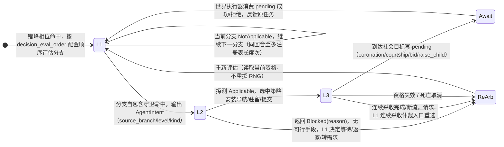
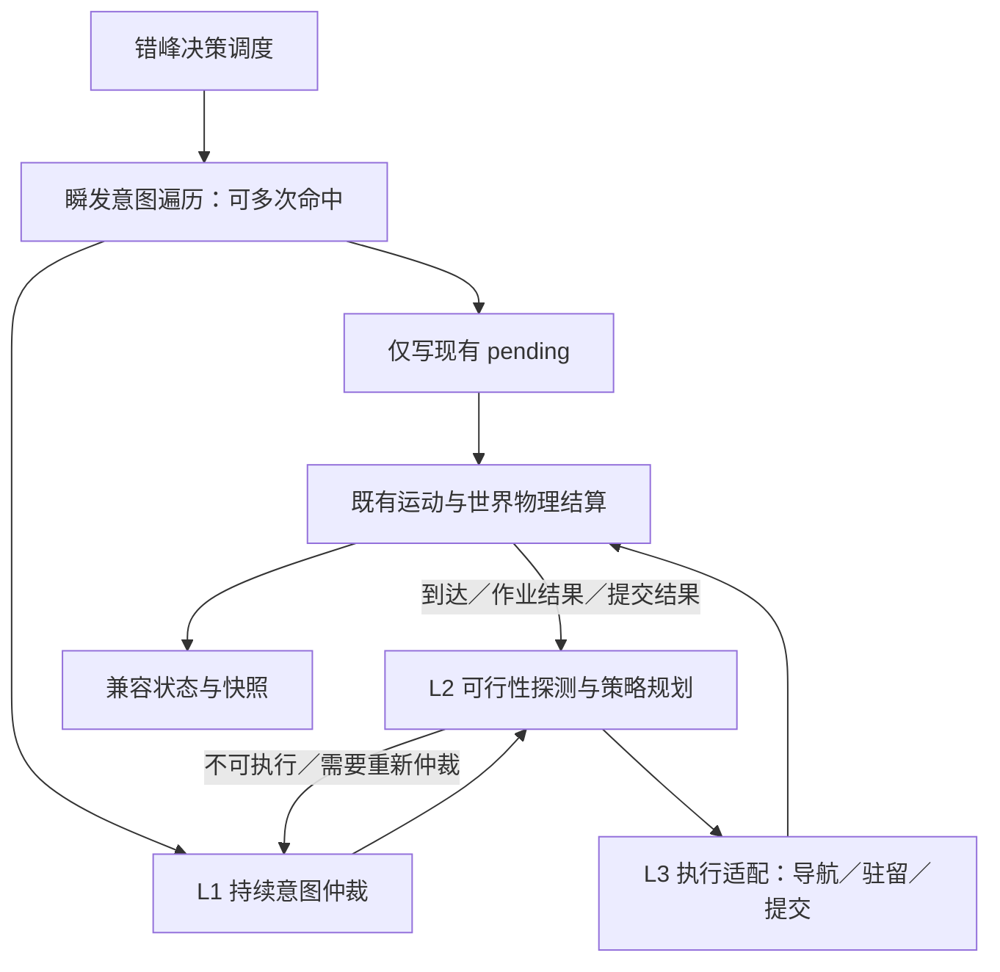

# 12. M19 决策架构：意图—策略—原语三层解耦

> **状态**：全阶段已落地（M19.0~M19.3 于 v1.46.8；M19.4a~d 于 v1.46.9~v1.46.10）。
> **本文构成**：由原 `19-plan-*.md`（规划与范围）、`19-1-spec-*.md`（技术规格·权威定义）、`current/26-intent-observation.md`（意图类型与只读观察）三篇内聚而成，消除同一架构的多头描述。
> **关联**：[决策引擎](./11-decision-engine.md)（机制与马斯洛层） · [核心系统状态机全景](./02-core-systems-fsm.md) · [决策局部规则](../../../crates/sim_core/src/spatial/decisions/AGENTS.md)

---

# 部落民 AI 决策架构重构规划：意图与执行策略解耦（M19）

> **状态**：**全阶段落地完成**（M19.0～M19.3 基础解耦重构于 v1.46.8 落地；M19.4a～M19.4d 独立增强于 v1.46.9～v1.46.10 落地）。
>
> **源码与落地版本**：v1.46.10。本文规定架构边界、实施范围与增强全景；[技术规格书](./12-m19-architecture.md) 是类型、分支映射、阶段时序和验收条件的详细权威定义。
>
> **核心成果**：成功将需求仲裁（L1）、策略选择（L2）与执行适配（L3）三层解耦，以 `ActiveTask` 控制器为持续任务单一真相源；在此解耦架构之上，全面落地了 Inspector 决策行动中枢三栏看板、分级任务抢占与平滑改道、先天禀赋与家资个性化选策、多品类采收候选预排队列与 TSP 行程优化，100% 保持确定性、错峰决策与系统吞吐量。

相关入口：[决策现状](./11-decision-engine.md)、[核心 FSM](./02-core-systems-fsm.md)、[决策局部规则](../../../crates/sim_core/src/spatial/decisions/AGENTS.md)、[性能验证指南](./25-benchmarking.md)。

## 状态机

本状态机刻画 **M19 三层解耦下单个持续意图的分层递交流与重仲裁生命周期**，由 `transition.rs` 统一管理安装/推进/退出；`agent.state` 仅作为兼容只读投影。



| 状态 | 含义 | 进入条件 | 退出条件 |
| :--- | :--- | :--- | :--- |
| L1 意图仲裁 | 按配置顺序迭代分支，首个命中返回 | 错峰相位命中 | 命中出意图或全未命中 |
| L2 策略探测 | 只读探测候选可行性，选中后才允许副作用 | L1 命中出意图 | Applicable 进 L3 或 Blocked 交回 |
| L3 原语执行 | 导航/驻留/提交，接入既有运动与世界结算 | L2 Applicable | 写 pending / 连续采收 / 取消 |
| Await 待结算 | 写 pending 等世界执行器原子结算 | 到达社会目标 | 执行器消费成功/拒绝反馈 |
| ReArb 回 L1 重仲裁 | 失败/连续采收/资格失效交回 L1 | 上述退出条件 | 重新评估（不重掷 RNG） |

**不变量**（违反即出 bug）：
- L1 不依赖路网算法、不选择具体 POI、也不消费 RNG；只读探测不得调用共享 RNG 或改变缓存；候选选中前不得扣款/写 pending/安装路线。
- `ActiveTask` 打包三层控制字段，仅 `transition.rs` 可修改；路线/位置不重复保存，`state` 为只读投影；存档完整保存任务/阶段/原语/未消费结果，读档不重新规划或掷点。
- 瞬发通道不占持续任务槽位、不改运动状态、不扣资源、不消费 RNG，继续检查后续瞬发分支再处理持续任务。

## 1. 问题与范围

当前 `Need { level, kind, target_state }` 同时描述需求与动作，`seeking.rs`、`harvest.rs`、`market.rs` 分别处理选点、断流、返航和需求标签，修改一种兜底规则常需要检查多个入口。拆分的价值是让这些规则有明确的所有者和反馈接口，而不是删除所有跨模块调用。

现有连续采收再次调用分支评估，承担了根据最新生理、家户储备及配置顺序重新选择任务的职责；瞬发前置遍历承担了“多个瞬发与一个持续行动并行”的职责。两者都必须保留语义，只调整接口和组织方式。立宅 RNG 目前在 `fulfill_resting_need` 内消费，并非分支条件函数直接掷点。

### 1.1 M19 基础重构范围

- 保留 b1～b18 的稳定 ID、条件守卫、层级覆盖、配置顺序、选择规则与冷却语义。
- 集中同一意图内部的选点、策略失败和重路由处理。
- 显式区分瞬发提交、持续任务、物理动作和结算反馈。
- 分阶段收口状态写入，覆盖运动、生态、房屋、生命周期、存档和快照消费者。
- 记录现有行为基线，证明迁移未改变资源流、RNG 消费和行动时点。

### 1.2 独立行为增强（已于 M19.4 全量落地）

在 M19.0～M19.3 基础等价重构完成并经严格差分门禁封板后，原先规划的独立行为增强已按“四个独立维度”作为 **M19.4** 全量落地，并经专门的测试矩阵独立验收：

1. **M19.4a 表现层透视 (v1.46.9)**：Inspector 呈现「🧠 决策行动中枢」三栏透视看板（🎯 意图 / 🧭 策略 / ⚡ 原语）与 ⓪ 瞬发待结微光 Pill，决策动机透明可解释；
2. **M19.4b 仲裁增强 (v1.46.9)**：分级任务抢占矩阵（`preemption.rs`），支持危机生理、暴雪断柴、危房修缮对常规任务的平滑中断与沿原车道连续掉头；
3. **M19.4c 策略增强 (v1.46.9)**：力量调节重体力装载速率与轻体力修缮偏好、智力权衡路途耗时与现货牌价、富户与平民家资阶层分化选策；
4. **M19.4d 规划增强 (v1.46.10)**：定长 4 站多品类采收候选预排队列（`harvest_queue`）与最近邻贪心 TSP 行程优化，实现单趟顺路多品类连续满载回宅。

各增强项均拥有独立验收脚本，在保持底层确定性与存读档兼容的前提下明确放飞差异化行为。

## 2. 三层架构与并行瞬发通道



| 层级 | 拥有的决策 | 不拥有的决策 |
|---|---|---|
| L1 意图仲裁 | 需求是否成立、完成条件、顺序与层级、是否保持或取消当前目标、允许的抢占、失败后下一需求 | 具体 POI、路线、移动积分、资源扣账 |
| L2 策略规划 | 合法目标与可行性、同一目标的实现方式、阶段推进、同意图内重选与策略替代 | 越过 L1 新增返家任务、忽略分支守卫、直接改变资源或亲属关系 |
| L3 执行适配 | 安装导航命令、沿原车道改道、进入驻留、写 pending、转述物理结果 | 需求排序、世界资源结算、系统扫描后派发任务 |
| 世界系统 | 代谢、移动、真实采收与卸货、升级修缮、婚姻与政体等结算、生命周期 | 替 Agent 决定新的任务 |

L1 不依赖路网算法、不选择具体 POI，但可以读取由只读查询提供的“是否存在合法候选”“是否满足近距瞬发条件”等语义事实。近距求偶和在宅育儿的资格仍属于分支自包含守卫。不能为了层间纯度删除条件或让不可执行的高优先级意图永久阻塞其他需求。

瞬发通道不占用持续任务槽位，也不替换活动原语。命中后只写决心/pending，不改运动状态、不扣资源、不消费 RNG，继续检查后续瞬发分支，再执行持续任务决策。最终物理结算可改变婚姻、住宅或行动状态；这种变化来自既有结算规则，必须回写控制状态，不能与“提交不打断”混为一谈。

## 3. 持续任务生命周期

### 3.1 需求成立不等于策略可执行

L1 按配置顺序评估分支。L2 只读探测候选返回可执行、当前受阻或不适用；候选未选中前不得消费 RNG、扣款、写 pending 或安装路线。同一仲裁回合内每个分支最多尝试一次，尝试数受注册表长度限制，避免 L1/L2 无限互调。

基础重构保留原来的仲裁入口与状态保持规则，不把所有状态改为每个决策相位全量抢占。某个旧入口原本会继续分支遍历，新的不可执行反馈也继续；原本会等待、重新寻路或返家，则由 L1 的兼容政策产生相同结果。更积极的全局抢占或自动重试属于后续增强。

### 3.2 目标、策略、动作分别终止

- **动作完成**：例如到达 POI，只结束导航原语，尚未满足解渴或补货意图。
- **策略阶段完成**：例如背包装满，转入后续仲裁或返家卸货，不能当成家庭储备已达标。
- **目标满足**：由最新生理值、家户触发器、房屋/婚姻/政体事实等类型化条件判断。
- **策略失败**：同意图内可重选目标或备选手段；没有可行策略时交回 L1。
- **任务取消**：死亡、失去资格或 L1 允许的抢占。清理本任务控制字段，不删除已携带资源，不撤销已完成的账本结算。

补货可能需要多趟；不能为了“达成意图”无条件锁住 Agent 直到家户余额补满。保持原有返家、卸货与再次评估行为，任务关闭后需求仍可能再次成立。基础阶段不引入暂停任务栈；再次执行时用最新世界事实重建方案。

### 3.3 生存优先级与失败边界

普通体力不足是 L2 向 L1 提供的事实，不是统一切换为休息的命令。临界口渴/饥饿仍受既有求生守卫保护。市场准入仍检查户主身份、家户账本金余额、体力及资源品类；失败原因不豁免这些条件。

| 情形 | L2 的权限 | 需要 L1 决定的事项 |
|---|---|---|
| 单点 POI 关闭 | 在本人的触发器开放集合内重选同类点 | 无合法手段时是否等待、返家或转其他需求 |
| 水/粮/木同类点全部关闭 | 按既有资格尝试市场策略 | 市场不可达/不准入后的目标选择 |
| 石/金断流 | 按既有规则报告受阻，保留淘金用途与冷却 | 不得自行新增市场兜底 |
| 求偶/夺位目标失效 | 在原分支全部资格约束内重选 | 无目标时结束任务及下一行动 |
| 体力告警 | 报告当前策略不能继续的原因 | 结合临界求生守卫和既有入口决定下一任务 |

有房者夺位仍受自家营地限制，求偶仍使用现有合法候选与选择规则；不能用泛化的“全图最优”替代。

## 4. 连续采收

基础阶段保留动态连续采收，不引入 `Batch` 意图或预排队列。L2 在采收完成/断流的原时点请求 L1 的“连续采收仲裁入口”；该入口仍按配置顺序检查现有允许分支，包括当前源码中已有的 b1/b2 生存分支。

每次转换必须重新检查私宅有效性、家户补货触发器、自身生理、各品类独立行囊容量、POI 私有可用性与体力。金币保留无限容量、单趟采集目标和两类冷却的区别。回到家门只表示抵达，卸货仍按速率逐 tick 入家户账本。

> **★ M19.4d 规划增强落地（v1.46.10）**：
> 在保留 L1 动态连续采收仲裁的基础上，已正式引入定长 4 站预排队列 `Agent3D::harvest_queue: [Option<BranchId>; 4]`（零堆分配、`#[serde(default)]` 兼容读旧档）与 `harvest.rs::plan_harvest_itinerary` 最近邻贪心 TSP 启发式链路优化。
> 出发时规划最优顺路站点，采满现场转站优先消费预排队列，候选失效自动跳过并回退 `branch_order` 兜底。
> 预排行程微光条透传至 Inspector，全套行为由 `tools/test-itinerary.js` 验证通过。

## 5. 状态所有权与运行时频率

### 5.1 渐进迁移

`PrimitiveActionState` 当前被代谢、运动到达、POI 交互、房屋结算和快照共同读写，不是单纯 UI 字段。因此不在 M19.1 新增三个字段后就每 tick 覆盖 `state`。

1. **迁移期**：现有状态、路线、pending 为执行真相源；新控制记录只观察和验证，不反向驱动物理。影子路径不得调用有副作用的规划器。
2. **接管期**：逐条迁移任务，每条任务及其世界写入点全部接入同一个转换接口后才接管，旧实现只服务未迁移任务，不能双驱动。
3. **完成期**：控制器是持续任务真相源；位置/车道仍归运动系统、pending 与结算仍归世界系统。`state` 为执行兼容视图，由转换接口在实际事件时同步。投影只读、不调用导航、不清车道、不消费 RNG。

死亡和胎儿生命周期优先于任务投影；返家阶段必须投影为返家；到达/离路/结算结果不能等到下一个 120 tick 相位才同步。具体映射与合法组合见规格书。

### 5.2 决策与物理结算分频

- 决策相位使用 `agent_decision_interval_ticks`（当前默认 120），不得改 `simulationDt`。
- L1/L2 在原错峰决策入口运行；每 tick 的运动、代谢、装卸、交易、房屋结算维持既有频率。
- 原语适配不新增第二套物理步进，也不把结算移进 `decisions/`。
- 到达事件在原运动阶段更新执行视图；阶段事件反馈不能提前触发下一轮需求选择或多消耗一次 RNG。
- 写 pending 不代表当场成功，消费时必须重查资格；成功/失败结果与对应请求关联，避免重复消费。

**已识别的文档与源码差异**：根 AGENTS §4.3 的概括顺序将决策写在道路衰减/运动之前，而审查基准 `world_tick.rs::tick()` 实际先道路衰减、运动，后决策。M19 不借此调整管线；实施 M19.0 时先核实并同步现状说明，再冻结具体阶段基线。源码逐阶段清单和 pending 时点见规格 §5。

## 6. 外部契约、存档和可观测性

基础重构保持 WASM 导出签名、FABS 字段布局及枚举码位；这不自动等于新旧运行结果逐字节一致。状态/目标/需求标签及派生统计必须做行为差分，快照生产与解码的同构性另由快照门禁证明。

旧应用版本存档仍明确拒绝。新增持久化控制状态时按项目规则升级存档结构版本；不能用 `serde(default)` 默默恢复一个未知的进行中任务。新版本必须完整保存任务、策略阶段、活动原语、未消费结果及既有路线/pending/RNG/触发器，读档不能重新规划或重新掷点。当前源码 `SAVE_FORMAT_VERSION` 为 4，实施时重新核实，不采用历史说明中的 3。

Inspector 三栏属于后续展示增强；基础阶段保留 `current_need` 的来源分支和标签规则，包括瞬发标签被常规标签覆盖的原时序。新增可见字段时完成快照结构、生产者、二进制编码、JS 解码与映射全链路同步。

## 7. 里程碑与退出条件

| 阶段 | 交付 | 退出条件 | 状态 |
|---|---|---|---|
| **M19.0 基线与契约冻结** | 所有状态/pending 读写者、现有时序、分支资格/失败路径清单；修正现状文档漂移 | 固定 seed/config/tick 的差分样本、RNG 与性能基线可复现（见 `tools/baseline-m19-observation.json`） | ✅ **已完成** (v1.46.8，87,631 TPS 基线与 239 项断言已冻结) |
| **M19.1 类型与观察适配** | 引入规格中的领域类型及只读执行视图，保留旧驱动 | 不新增任务选择或 RNG 消费；观察结果与现状逐项一致；零内存分配；门禁 `test-m19-differential.js` 全通 | ✅ **已完成** (v1.46.8，`crates/sim_core/src/spatial/decisions/{intent,strategy,primitive,observation}.rs`) |
| **M19.2 策略与执行收口** | 先资源链，再社会/房屋链；逐条移交写入权 | 每条链路的状态、物理结算、到达、失败与读档门禁通过；无双驱动 | ✅ **已完成** (v1.46.8，`ActiveTask` 控制器、`transition.rs`、`projection.rs`、SAVE_FORMAT_VERSION 5) |
| **M19.3 仲裁独立** | L1 统一持续任务入口、瞬发旁路与连续采收接口，清理迁移代码 | 全部 18 分支及重排/覆盖语义保持；全套验收通过；更新模块地图与局部 AGENTS | ✅ **已完成** (v1.46.8，L1 仲裁/瞬发/连续采收解耦，L2 策略与 L3 原语派发，全门禁通过) |
| **M19.4 独立增强** | 系统落地表现层看板、分级任务抢占、禀赋与财富个性化、多品类采收预排队列与行程优化 | 独立验证矩阵全通：M19.4a 表现层透视 (v1.46.9)、M19.4b 抢占矩阵 (v1.46.9)、M19.4c 禀赋与财富个性化 (v1.46.9)、M19.4d 预排队列与 TSP 行程优化 (v1.46.10) | ✅ **已完成** (v1.46.9 ~ v1.46.10，`test-preemption` / `test-personalization` / `test-itinerary` 矩阵 100% 通过) |

## 8. 验收原则

[规格 §8](./12-m19-architecture.md#8-验收矩阵) 为唯一详细验收清单。

- 分别证明同版本确定性、新旧行为等价、快照同构、同版本存读档连续性，不能互相替代。
- 基础重构保留 RNG 消费顺序与既有候选并列规则；不能一律改成“距离 + ID”后仍宣称等价。
- 导航成功才安装新任务执行状态；车道上重定向沿现有车道连续处理，节点/现场出发正常 dispatch，无车道时不强制 U-turn。
- 固定枚举只约束新增控制对象不使用动态派发；不承诺现有上下文、路线和 pending 集合全部零分配。
- 内存大小用目标平台布局实测，性能以同机器同配置的配对基线判断，不采用跨机器绝对 TPS 或未经测量的缓存驻留结论。
- 临时差分脚本/断言按项目规则验证后删除，不新增持久化单元测试。

---

## 9. M19.4 独立增强落地全景（v1.46.9 ~ v1.46.10）

在 M19.0～M19.3 完成三层解耦并以 `ActiveTask` 控制器为单一真相源收口后，M19.4 独立增强按四大维度系统落地，彻底打破了传统单体决策的黑盒与刻板行为。

### 9.1 表现层透视：决策行动中枢三栏看板与动机可解释性 (M19.4a, v1.46.9)
- **三栏看板布局**：在 Inspector 角色卡片顶部重构「🧠 决策行动中枢」自适应卡片：
  - **🎯 意图 (Intent)**：来源分支（b1～b18）、马斯洛需求层级（⓪瞬发～④自我实现）、完成判据（`PantryFull` / `ResourceSatiated` / `DurabilityRestored` 等）；
  - **🧭 策略 (Strategy)**：策略模式（野外采收 / 榷场采买 / 房屋修缮 / 归宿休养等）、目标实体（POI / 私宅 / 营地）、在途推进阶段（`Outbound` / `OnsiteWork` / `Inbound` / `Settling`）；
  - **⚡ 原语 (Primitive)**：当前底层动作（沿路导航 / 现场驻留 / 提交结算）、当前所在车道 ID 与距离目标米数。
- **⓪ 瞬发高亮微光 Pill**：当发生加冕结算（`coronation_pending`）、门前受孕（`raise_child_pending`）、就近求偶（`courtship_pending`）、房屋竞拍（`pending_bids`）或立宅选址（`pending_house_pos`）时，以动态微光胶囊呈现在中枢顶栏。
- **快照全链路同构 (M4)**：`AgentSnapshot` 扩充 `active_task: Option<ActiveTaskSnapshot>`，经 `snapshot.rs`、`world_snapshot.rs`、`snapshot_bin/encode.rs`（小端紧凑字节与驻留表 intern）、`snapshot-bin.js` 与 `rustworld.js` 严格四处同步，零性能衰退。

### 9.2 仲裁增强：分级任务抢占机制 (M19.4b, v1.46.9)
- **抢占矩阵 (Preemption Matrix)**：在 `crates/sim_core/src/spatial/decisions/preemption.rs` 建立分级裁决规则，消除旧体系“非临界不可打断”的死板行为：
  - **娱乐淘金 (`GoldWealth`)**：可被任何生理需求（饱食/饮水/休养）、安全补料、私宅修缮与远征登基立即抢占；
  - **建材采收 (`StockStone` / `StockWood`)**：可被临界饥渴、冬季暴雪断柴（木材 < 10）与危房耐久告警（耐久 < 20%）紧急抢占；
  - **远征登基 (`SeekThrone`)**：仅受濒死饥渴危象抢占；
  - **施工修缮 (`ConstructUpgrade` / `RepairHouse`)**：受求生与王位空缺加冕抢占（施工进度在房屋实体冻结保全，不回滚）。
- **平滑改道与行囊保全**：抢占时由 `transition::preempt_task` 统一调度，沿原车道连续反向掉头（U-turn），严禁瞬间瞬移；保全已有采获行囊，平滑过渡至新目标。
- **验收工具**：`node tools/test-preemption.js`（5/5 场景全通：淘金被饥渴打断、伐木被断柴打断、修缮被登基打断、原车道掉头连续性、长程确定性一致）。

### 9.3 策略增强：先天禀赋与家资个性化选策 (M19.4c, v1.46.9)
- **力量 (Strength) 驱动**：
  - 高力量族人（力量 ≥ 110）：野外重体力采收与伐木采石装载速率提升 +25%（见 `ecology/`）；
  - 低力量族人（力量 ≤ 90）：装载速率惩罚 -15%，倾向轻体力活动与家政留守（房屋耐久低于 90% 即主动修缮，常规族人为 80%）。
- **智力 (Intelligence) 驱动**：
  - 高智力族人（智力 ≥ 110）：具备市场牌价感知能力，综合权衡「路途耗时 vs 榷场现货牌价」，野外过远或市场更近时直接赴榷场交易；
  - 寻路偏好高等级成熟通衢主干道，主动规避低限速泥泞小径。
- **家户财富阶层分化 (Household Capital)**：
  - **豪绅家户**（家户金币 ≥ `market_wealthy_family_gold` 默认 200）：户主面临家庭物资缺口时，80% 几率直接赴榷场现货采购，免于亲自采矿伐木；
  - **平民家户**（金币不足）：保持自力更生，亲赴荒野开采。
- **验收工具**：`node tools/test-personalization.js`（5/5 场景全通：力量装载速率加成、低力量家政早修、智力商贸权衡、豪绅市场代采、长程数值稳定性）。

### 9.4 规划增强：多品类采收候选预排队列与行程优化 (M19.4d, v1.46.10)
- **定长 4 站预排队列**：`Agent3D` 新增 `pub harvest_queue: [Option<BranchId>; 4]`（零堆分配、`#[serde(default)]` 向后兼容读旧档），提供 `pop_harvest_queue()`（FIFO 平移）与 `clear_harvest_queue()`。
- **TSP 最近邻链路优化器**：`harvest.rs::plan_harvest_itinerary` 基于当前位置，检索家户短缺品类（水/粮/木/石/金），通过最近邻贪心算法（Nearest Neighbor TSP Heuristic）计算总路程最短的 1~4 站顺路链路（如 `💧备水 → 🌲备木 → 🍒备粮`）。
- **执行与容错生命周期**：
  - 连续采收 `try_continue_harvesting` 改为优先消费队列，逐站由 `arbitrate_continuous_harvest_candidate` 重验资格；
  - 候选项失效（如中途断流或家人已采满）时自动跳过并尝试下一站，队列耗尽回退 `branch_order` 兜底；
  - 任务抢占、回宅卸货、体力耗尽（< 15%）与死亡时规范清空队列，防止跨任务串味。
- **可观测性透传**：`ActiveTaskSnapshot` 新增 `itinerary` 字段，同步下发并在 Inspector 呈现 `🗺️ 预排行程` 微光条。
- **验收工具**：`node tools/test-itinerary.js`（5/5 场景全通：链路生成、TSP 最近邻排序、满载转站、体力告警安全折返、多种子长程重放逐字节一致）。

---

# 部落民 AI 决策架构重构技术规格（M19）

> **状态**：**全阶段落地完成**（M19.0～M19.3 基础解耦与 M19.4a～M19.4d 独立增强已全量落地）。
>
> **源码与落地版本**：v1.46.10；范围与里程碑见[总体规划](./12-m19-architecture.md)。本文是类型、控制协议、分支映射、时序及验收的详细权威定义。
>
> **落地概况**：三层解耦与 `ActiveTask` 控制器已成为持续任务单一真相源；Inspector 三栏看板、分级抢占矩阵、禀赋家资个性化选策、多品类预排队列与行程优化已全量上线并通过测试矩阵验收。

## 1. 模块组织与依赖边界

预期组织如下；不预先承诺文件数量、350 行上限或总行数。遵守项目单文件 800 行规范，按实际职责拆分，并为新增复杂目录维护局部 AGENTS。

```text
crates/sim_core/src/spatial/decisions/
├── mod.rs
├── AGENTS.md
├── context.rs              # 借用世界数据、资格事实查询；不复制完整世界
├── scheduler.rs            # 保留既有错峰与 pending 消费顺序
├── transition.rs           # 统一安装/结束任务及物理事件同步
├── projection.rs           # 执行状态到旧枚举/标签的纯视图
├── intent/
│   ├── mod.rs
│   ├── kinds.rs            # Intent、完成条件、来源分支
│   ├── branches.rs         # b1～b18 稳定注册表与自包含守卫
│   ├── evaluator.rs        # 持续仲裁、保持/取消/抢占政策
│   └── instantaneous.rs    # 多次瞬发，不占持续任务槽位
├── strategy/
│   ├── mod.rs
│   ├── kinds.rs            # 策略阶段、可行性与结果
│   ├── selector.rs         # 只读探测，选中后才允许规划副作用
│   ├── resource.rs         # 采收/交易/卸货；向 L1 请求连续采收仲裁
│   ├── social.rs           # 求偶/夺位的合法目标和重选
│   ├── housing.rs          # 立宅/升级/修缮的执行计划
│   └── fallback.rs         # 同意图内替代手段；失败交回 L1
└── primitive/
    ├── mod.rs
    ├── kinds.rs            # 导航、驻留、提交描述与物理结果
    ├── navigation.rs       # 复用 dispatch/车道连续重路由
    └── adapter.rs          # 接入既有交互与 pending，不实现第二套结算
```

`ecology/`、`housing_system/`、`world_tick.rs` 和账本系统继续拥有物理结算。`primitive/adapter.rs` 只安装或解释执行意图，不新增 `tick_onsite()` 再次装袋、扣账、施工。类型提取先于目录搬迁；一次迁移一条行为链，避免纯搬文件与行为变化混在一起。

## 2. 领域类型与数据所有权

以下为结构草案，省略导入和 serde 派生。正式实现必须使用实际 ID 类型，并为持久化字段实现序列化。含 `f32/Vec3` 的类型只派生可用的 `PartialEq`，不能盲目派生 `Eq`；不得将草案的内存大小作为 ABI 保证。

### 2.1 持续意图

```rust
pub struct AgentIntent {
    pub source_branch: BranchId,
    pub level: MaslowLevel,
    pub kind: IntentKind,
    pub completion: CompletionPolicy,
}

pub enum SurvivalResource { Water, Food }
pub enum GoldPurpose { BuildingReserve, Wealth }

pub enum IntentKind {
    SatisfySurvival(SurvivalResource),
    StockHousehold(ResourceKind),       // 水/粮/木/石，金由下列用途区分
    AcquireGold(GoldPurpose),
    EmergencySupply,                   // b15：水/粮/木急迫补给，非新资源种类
    RestAndRecover,
    RepairHome,
    UpgradeHome { target_tier: HouseTier },
    FoundNewHome,
    SeekCourtship,
    ClaimThrone,
    RaiseChild,
}

pub enum CompletionPolicy {
    SurvivalSatisfied(SurvivalResource),
    HouseholdStockSatisfied(ResourceKind),
    GoldTripFinished(GoldPurpose),
    EmergencySupplyFinished,
    RecoveryFinished,
    HomeRepaired,
    HomeAtTier(HouseTier),
    HomeFounded,
    MarriageRegistered,
    CoronationRegistered,
    ChildcareSettled,
}
```

完成策略是类型化判据，不保存一个通用 `satisfy_threshold`：

| 判据 | 权威输入与含义 |
|---|---|
| SurvivalSatisfied | 当前饥渴值与 `agent_self_satisfied_threshold`；不代表同行补货也完成 |
| HouseholdStockSatisfied | 当前有效私宅、家户关系与家户补货触发器；保留 ON/OFF 滞回，不改成只比较一次余额 |
| GoldTripFinished | 用途对应的既有单趟目标、结束守卫与冷却；备金和娱乐不可合并 |
| EmergencySupplyFinished | 既有市场多品类完成规则；资金见底是执行结束原因，不伪称已满足需求 |
| RecoveryFinished / HomeRepaired | 使用现有休息退出/修缮退出守卫，不引入“必须恢复到 100% 才允许其他需求” |
| HomeAtTier / HomeFounded | 校验绑定的房屋 ID、归属和结算结果，不能只看某栋房屋达到等级 |
| MarriageRegistered / CoronationRegistered / ChildcareSettled | 世界执行器的结果及关系事实；pending 写入不算成功 |

数值从当前 SimConfig 读取，沿用配置热注入语义，不把 45、100 或 200 写进新层。`source_branch` 用于稳定配置映射、标签、资格重验和用途冷却。`level` 不是单独的排序算法，不能取代配置顺序或现有动态层级覆盖。

目标满足、策略结束和本次任务关闭分别记录：返家卸完一袋可能只结束一次补货行程，L1 可以重新仲裁，不能把余额不足误报为目标满足，也不能锁定多趟补货阻塞其他需求。

### 2.2 持续策略与原语

```rust
pub struct ActiveTask {
    pub intent: AgentIntent,
    pub strategy: ExecutionStrategy,
    pub primitive: ActionPrimitive,
}

pub enum ExecutionStrategy {
    WildHarvest { pool: NodePool, poi: Option<PoiId>, stage: ResourceStage },
    MarketTrade { market: PoiId, stage: ResourceStage },
    ReturnToResidence { destination: ResidenceTarget, stage: ReturnStage },
    Courtship { female: AgentId, stage: CommitStage },
    ClaimThrone { camp: u32, stage: CommitStage },
    Childcare { house: u32, stage: CommitStage },
    FoundHome { site: Vec3, route_target: NodeId, stage: CommitStage },
    UpgradeHome { house: u32, target_tier: HouseTier, stage: HomeStage },
    RepairHome { house: u32, stage: HomeStage },
}

pub enum ResourceStage { Outbound, OnSite, Returning, Unloading }
pub enum ReturnStage { Travelling, Recovering }
pub enum CommitStage { Travelling, Ready, AwaitingSettlement }
pub enum HomeStage { Returning, Working }
pub enum ResidenceTarget { House(u32), Camp(NodeId) }

pub enum ActionPrimitive {
    Navigate { target: NodeId, arrival: ArrivalKind },
    Hold(HoldKind),
    AwaitSettlement,
}
pub enum ArrivalKind { ResourceSite, Residence, SocialTarget, FoundSite }
pub enum HoldKind { ResourceSite(PoiId), Residence, Repair, Upgrade, OffRoad }
```

`MarketTrade` 保留当前一次交易可购买水/粮/木的行为，不因触发的是水需求就偷偷改成单品采购。基础阶段不新增 `HomeDirectConsume` 策略；在宅吃喝继续由生态结算，L1 读取其已更新结果。修缮/升级的目标有效性、到宅要求依照现有执行入口，不擅自新增移动或等待。

策略中的目标实体 ID 是真相源，节点是规划解析结果；目标移动/换主/消失时重新验证，不能只保存节点。无私宅返航可以指向营地。立宅候选点和路网目标必须分开，不能把候选点替换为最近节点坐标。

`ActiveTask` 打包三层控制字段，避免 `intent=None` 而 `strategy=Some` 等独立 Option 组合。阶段与原语仍须遵守 §6 的合法组合表，仅 `transition.rs` 可修改；路线和位置不在任务中重复保存。

### 2.3 瞬发和既有 pending

瞬发提交采用独立接口 `submit_instant(branch, request)`，不作为 `ExecutionStrategy::InstantCommit`，不覆盖 `ActiveTask`。请求类型沿用三类事实：求偶目标 ID、竞拍候选、育儿意图。竞拍候选继续使用既有集合及稳定顺序，不用一个固定三元素队列截断房屋候选。

保留 `courtship_pending`、`pending_bid_house_ids`、`raise_child_pending` 等既有字段作为待结算真相源，禁止再复制到第二个待决队列。持续求偶/夺位/育儿等也向对应既有 pending 提交；需要等结算的持续任务进入 `AwaitingSettlement`。相同任务不得重复提交，提交前沿用 pending 与冷却幂等守卫。

每个请求的成功/拒绝结果必须关联原目标与原请求；基础迁移可由既有 pending 消费分支直接通知转换接口，无需新增全局事件总线。如果未来使用缓冲结果，必须保存关联标识，定义覆盖/消费规则并入档，不能用一个“最后结果”覆盖多个瞬发结果。

### 2.4 单一真相源

| 数据 | 所有者 | 其他模块如何使用 |
|---|---|---|
| 持续任务与意图 | 完成迁移后的控制器；迁移前见 §6 | 通过转换接口修改，其他模块只读 |
| 位置、车道、路线与进度 | 既有运动系统 | 规划器发命令，不复制第二条路线 |
| 资源、健康、家庭关系和私宅 | 生态/代谢/账本/房屋系统 | L1/L2 只读事实，执行器按原规则结算 |
| pending | 原字段及原物理执行器 | 提交接口幂等写入，消费时反馈 |
| POI/家户触发器 | Agent 原锁存状态 | 原时点刷新，策略只读结论 |
| `state`、`current_need` | 完成迁移后的执行兼容视图 | 保留旧枚举和标签语义，禁止其他模块自由覆写 |

## 3. 仲裁、失败与取消协议

### 3.1 可行性与有界仲裁

只读候选探测返回：

- `Applicable`：存在合法实现机会；选中后才进入实际规划和派发。
- `NotApplicable`：分支或目标资格不成立。
- `Blocked(reason)`：需求成立，但本回合缺少可用手段。

失败原因至少区分目标 POI 关闭、无同类可用点、无合法社会目标、路径不可达、资金不足、体力限制、私宅/家户资格失效、提交被拒绝。POI 库存关闭与路径不可达不能混为一谈。

每次仲裁用本地定长分支位图限制已尝试集合，最多尝试注册表长度次；同一策略替代链每种候选手段最多尝试一次。不能把失败立即递归送回同一分支。跨相位默认不新增持久化“禁选”标志或退避冷却，保持原行为。

基础重构保留现有状态对应的仲裁域：休息时常规分支遍历；寻路时原途中处理；采收结束时原连续采收允许集合。不能扩大成“任何状态每相位都选全局最高需求”。`Blocked` 继续、等待或关闭任务的处理要对照旧入口逐项迁移，差分不一致须解释并移出等价重构。

只读探测不得调用共享 RNG 或改变缓存语义；已有随机选点在最终选中策略的原调用时点执行。探测不等于保证 dispatch 成功，派发失败仍走原入口失败路径，不能提前安装新状态。

### 3.2 瞬发遍历

1. 只对在世非胎儿、命中错峰相位的 Agent 执行，先刷新原有观测/锁存，再按现有瞬发入口遍历。
2. 沿用 `is_instant()` 白名单、分支自包含近距/在宅守卫及 `level_override_for`。非瞬发分支不能被配置强制为瞬发。
3. 每次命中仅写既有 pending 并继续；不得移动、扣账、改持续任务或消费 RNG。
4. 随后处理持续任务；常规评估遇已处理瞬发结论跳过，不重复提交。层级覆盖降为常规的 b17 仍复用提交接口，不制造持续竞拍占位任务。
5. 标签遵守旧逻辑：有常规标签则覆盖瞬发标签，无常规标签时保留本拍瞬发标签。

### 3.3 保持、抢占、取消与失败替代

| 结果 | 持续任务处理 |
|---|---|
| 正常进行 | 保留当前目标和已选路线，不每相位重新挑最近点 |
| 原语到达 | 在原物理时点推进执行阶段，需求是否完成仍按原决策时点判断 |
| 同意图手段失败 | 在原允许的时点重选合法目标/市场；不改变来源分支与意图用途 |
| 无可行手段 | L2 报告，L1 按兼容政策决定等待、结束或返家；L2 不越权创建新意图 |
| 普通疲劳 | 继续使用原临界饥渴保护，不通过通用阈值强行中断求生 |
| 资格失效或既有允许的抢占 | L1 取消任务；清理任务自己的目标/未提交控制状态；不删除行囊或其他瞬发 pending |
| 世界结算成功/拒绝 | 保留原消费时点与顺序，反馈对应任务；不在反馈回调里启动额外一轮需求评估 |
| 死亡/胎儿状态 | 生命周期优先，停止行动并同步兼容视图；旧控制记录不能投影回存活动作 |

已经提交的 pending 不凭任务切换任意撤销，保留原执行器的资格重验与清理规则；已结算效果不可回滚。无私宅/家宅换主的返航目标须重验，不能继续卸入旧家户。基础阶段不保存暂停任务栈；重新选择时读取当前资格。

## 4. b1～b18 映射与语义保留

本表不替代现有分支的全部条件函数；M19.0 必须逐分支登记原条件、失败出口及配置覆盖行为，不能按表中摘要重写守卫。表中状态表示兼容状态，不意味着所有状态都物理静止。

| ID | 持续意图或瞬发提交 | 策略/执行方式 | 必须保留的语义 |
|---|---|---|---|
| b1 | SatisfySurvival(Water) | WildHarvest，既有断流资格下 MarketTrade | 自饮与同程补货可并存；临界口渴保护；无房不装袋 |
| b2 | SatisfySurvival(Food) | WildHarvest，既有断流资格下 MarketTrade | 同上，按饥饿守卫；在宅吃喝仍归生态系统 |
| b3 | RestAndRecover | 原休息/返航执行语义 | 不引入必须满体力退出或强制多走一趟返家 |
| b4 | RepairHome | RepairHome，原修缮执行器 | 原触发/停止门槛、资格与地点条件，不复制结算 |
| b5 | StockHousehold(Water) | WildHarvest / 既有市场兜底 | 家户触发器、独立水行囊与卸货速率 |
| b6 | StockHousehold(Food) | WildHarvest / 既有市场兜底 | 家户触发器、独立粮行囊与卸货速率 |
| b7 | StockHousehold(Wood) | WildHarvest / 既有市场兜底 | 水粮木才有断流市场资格；无房守卫 |
| b8 | UpgradeHome(Tier1) | UpgradeHome：原返宅/Working | 水粮材料门槛；到宅后原房屋系统瞬时扣账晋级，无新增工时 |
| b9 | StockHousehold(Stone) | WildHarvest | 不新增石料市场兜底 |
| b10 | AcquireGold(BuildingReserve) | WildHarvest(Gold) | 备金资格、家户触发器、单趟目标及备金冷却 |
| b11 | UpgradeHome(NextTier) | UpgradeHome：原返宅/Working | 原固定成本矩阵、归属、到宅门槛、瞬时结算与威望 |
| b12 | FoundNewHome | FoundHome：选址、导航、原实体化 | 选定后才按原序消费 RNG；保留 pending 候选点、路线完成守卫及既有实体化定位例外 |
| b13 | AcquireGold(Wealth) | WildHarvest(Gold) | 4 级庄园资格、娱乐用途及独立冷却；不造 LuxuryGold 资源 |
| b14 | ClaimThrone | ClaimThrone：导航、登基提交 | 有房仅自家营地，无房合法营地集合；保留原并列选择与重定向规则 |
| b15 | EmergencySupply | MarketTrade | 户主/金币/体力/短缺条件，既有多品类采购；不造 Emergency 资源 |
| b16 | SeekCourtship 或瞬发求偶 | Courtship 或独立 pending 提交 | 原合法女性筛选/择偶排序；近距瞬发、远距持续；不抢占其他瞬发 |
| b17 | 独立竞拍提交 | 原候选集合与出价执行器 | 多房候选、冷却、无 RNG；层级覆盖不能变成持久占位任务 |
| b18 | RaiseChild 或瞬发育儿 | Childcare 或独立 pending 提交 | 自宅等级、夫妻位置、身体和冷却；远距路径保留原提前写 pending 的时点 |

连续采收请求沿用当前 `try_continue_harvesting` 的允许集合 b1/b2/b5/b6/b7/b9/b10，按配置顺序动态检查，且保留其私宅和体力前置条件。资源阶段结束后不直接从队列派新任务；由 L1 输出下一个意图，再由 L2 规划。黄金的途中和现场冷却设置也必须一起迁移。

## 5. Tick 时序与提交消费

### 5.1 基准源码时序

以下记录 `world_tick.rs::tick()` / `tick_subphase()` 的实际调用顺序。根 AGENTS §4.3 的概括顺序存在漂移，按总体规划 M19.0 先核实并修正文档；本方案不授权改动管线。

| 子阶段 | 当前职责 | M19 的接入点 |
|---|---|---|
| 0 | tick 计数、四季/POI 再生 | 不变 |
| 1 | 代谢、繁衍、育儿 pending 消费、胎儿协调/继承 | 生命周期与提交结果同步；不调度新的 L1/L2 |
| 2 | POI 交互、自饮、采收、交易、回家卸货 | 原速率原顺序；记录执行事实，不额外选任务 |
| 3 | 房屋系统、升级/修缮等结算 | 只消费已表达的行动，保持瞬时升级 |
| 4 | 道路衰减 | 不变 |
| 5 | 运动与到达 | 在原到达时点更新原语/阶段/兼容状态 |
| 6 | POI 观测、错峰决策、决策后的物理提交结算 | 瞬发旁路 → 原状态对应的持续仲裁/策略步骤；保持 Agent 遍历序 |
| 7 | 家户/宗族/政体等账本 | 既有实体变化通过转换接口失效任务事实，不指派行动 |
| 8 | 清理 | 生命周期清理，不启动新任务 |

只有命中 `(tick + id) % config.agent_decision_interval_ticks == 0` 的在世非胎儿 Agent 运行决策，当前默认间隔 120。原语执行对应的运动/物理结算每 tick 继续运行。不能将到达投影拖到下一决策相位，也不能在到达回调多运行一次仲裁。

### 5.2 Pending 与结算时点

| 意图/行动 | 提交时点 | 消费时点与结果 |
|---|---|---|
| 登基、求偶、竞拍 | 原瞬发或持续任务决策入口 | 子阶段 6 决策后；维持登基 → 求偶 → 竞拍标杆衰减 → 竞拍 → 立宅实体化的现有次序 |
| 立宅 | 选址和派发成功时写原候选点 | 子阶段 6 的实体化入口，沿用原路线完成等条件；不是选址后立即成功 |
| 育儿 | 原近距/在宅瞬发入口或远距育儿入口 | 子阶段 1 消费，因此子阶段 6 新写 pending 最早在后续 tick 消费；保留当前未到宅时的等待/清理规则 |
| 升级/修缮 | 原任务派发或驻留转换 | 原房屋阶段读取执行状态结算；不新增第二份 pending 或人工延迟 |

执行器在消费时重新校验目标、资格、资源和冲突，沿用既有仲裁顺序。提交失败/目标已被抢先占用不能伪造成功；结果只反馈原任务，常规需求重新选择仍发生在原调度入口。

## 6. 状态迁移、投影与导航契约

### 6.1 写入权移交

M19.0 搜索并分类所有 `state` 写入、`enter_stationary_state`、路线到达、死亡、房产/婚姻/政体变化和 pending 消费点，范围包括 `agent.rs`、`decisions/`、`ecology/`、`housing_system/`、`world_tick.rs`、`ledger/`、初始化/出生及存档。不能只改 `decisions/`。

- M19.1：旧字段权威，新记录为只读观察；不得每 tick 用观察值覆盖旧状态，不影子运行会消费 RNG 的选址或派发。
- M19.2：按行为链启用新控制，迁移开关仅作临时开发机制；一次安装新任务成功后该链不再经过旧状态机驱动。所有物理结果入口同步新控制记录。
- M19.3：删除临时开关/双模型。任务修改只走 `transition.rs`；兼容 `state` 在动作安装、到达、提交消费和生命周期事件时立即同步，快照读取无副作用。

### 6.2 合法组合与兼容视图

| 执行事实 | 允许的阶段/原语 | 兼容 `PrimitiveActionState` |
|---|---|---|
| 死亡 | 无可行动任务，生命周期终态 | Dead，任何投影都不能覆盖 |
| 胎儿 | 无自主任务 | 保留既有胎儿序列化/展示约定 |
| 野外前往资源点 | Outbound + Navigate | 按资源 SeekingWater/Food/Wood/Stone/Gold |
| 野外已到资源点 | OnSite + Hold(ResourceSite) | DrinkingAtWater/ForagingFood/GatheringWood/MiningStone/MiningGold |
| 市场前往/交易 | Outbound + Navigate / OnSite + Hold(ResourceSite) | SeekingMarket / BuyingAtMarket |
| 采收或市场返航 | Returning + Navigate | ReturningToCamp，不再按采收资源映射 Seeking* |
| 到宅卸货 | Unloading + Hold(Residence) | RestingAtCamp；尚未把“抵达”当“卸完” |
| 普通返航/驻留休息 | Travelling + Navigate / Recovering + Hold(Residence) | ReturningToCamp / RestingAtCamp |
| 求偶/夺位 | 原导航、已到达待决策、待结算阶段 | 保留 SeekingCourtship/SeekingThrone 到原结算转换时点 |
| 育儿 | 原返宅或驻留待结算阶段 | 保留 RaiseChild 的原投影，不能默认休息 |
| 升级 | Returning + Navigate / Working + Hold(Upgrade) | 两者沿用原 ConstructingHouse；是否移动由车道决定 |
| 修缮 | 原合法驻留作业状态 | RepairingHouse |
| 立宅 | 原立宅导航/候选实体化等待 | 保留原 RestingAtCamp 兼容值，不能据该值擅自停止导航 |
| 路线失效 | Hold(OffRoad)，保留任务失败上下文 | OffRoadDetour；按原决策入口恢复 |
| 仅瞬发提交 | 原持续任务/原语保持 | 不改变行动视图；实际消费的状态变化另同步 |

映射必须穷尽现有枚举和合法组合，不允许 `_ => RestingAtCamp` 掩盖遗漏。实施时按基线逐状态验证；合法但不常见的移动/状态组合不能被“清理”掉。

### 6.3 导航的提交与失败

- 新路线成功后才安装相应任务/阶段/状态；失败不得留下新策略配旧路线的半更新状态。原有失败副作用如需保留，应显式列入兼容政策。
- 在车道上重定向，复用原车道连续掉头/重路由逻辑；已在节点或现场、没有活动车道时正常 dispatch，不要求所有切换无条件 U-turn。
- 导航方向调整属于 L3 的实现细节，不作为可独立长期保存的 `UturnTo` 任务类型；存档保留实际车道方向和路线进度。
- 进入真正静止执行态走 `enter_stationary_state()` 清车道、速度与路线进度；纯投影不能执行该动作。
- 到达判定沿用 `current_lane_id.is_none()` 及原地点条件，不用 `route.is_empty()`。
- 不新增瞬移。立宅实体化设置候选点位置是根 AGENTS §4.16 已有例外，基线须单独标记，不能借重构扩大适用范围。

## 7. 快照、存档与性能

### 7.1 外部契约

基础重构保留 WASM 签名、FABS 布局/码位、现有 `current_need`、目标字段和派生统计。`state` 相同不代表远征统计、需求标签等其他字段也相同，须完整比较。三栏 UI 延后；若新增字段，同步 `snapshot.rs`、`world_snapshot.rs`、`snapshot_bin/encode.rs`、`snapshot-bin.js`、`rustworld.js` 及消费方。JSON 调试真值接口仍仅供既有快照对照测试使用。

### 7.2 持久化与恢复

当前源码格式版本为 4。首次将新的必要任务字段纳入存档时，按项目规则提升 `SAVE_FORMAT_VERSION` 并同步前端；版本号以实施时源码为准，不预先在文档写死目标版本。应用版本按统一升版器更新并同步 WASM 双副本，旧应用版本存档仍拒绝加载。

必须保存：ActiveTask（含用途、目标、阶段、原语）、所有无法从世界事实唯一重建且会影响下一步的结果、既有 pending、路线/车道进度、RNG、私有触发器和冷却。派生兼容视图可以重建，但只能从完整控制状态纯计算，不能重新选目标、重新消费 RNG、重复出价或重放已结算提交。

恢复时校验控制字段组合、目标关联与 pending 一致性。目标因世界演化已失效是合法待处理状态，保留到原决策相位处理；结构损坏、非法枚举组合或关联不一致明确报错。不得用 `serde(default)` 把未知途中状态静默变成空闲。同版本中途恢复必须与不中断运行连续一致。

### 7.3 内存与性能预算

新增控制对象采用定长结构/枚举，不引入 `Box<dyn Strategy>`、按 Agent 每相位分配的策略列表或不受限队列。既有上下文、路径和竞拍集合存在分配，不能把“新控制对象不分配”写成全引擎零分配。

M19.0 在 native 和 wasm32 分别记录 `size_of`、`align_of`、`Option<ActiveTask>` 及 Agent 总大小，用实测增量乘以人口计算内存；不预写 16/32/64 字节，也不凭总大小承诺缓存驻留或零带宽影响。

性能验收统一采用配对相对基线：同机器、同工具链、release、同 seed/config/tick/快照频率，预热后至少 3 次，比较中位数；Phase 6 决策耗时与全内核每 tick 耗时增长均不超过 **5%**。若噪声跨越阈值，增加配对样本并调查，不以单次测量放行。记录初始规模和满载存档场景；TPS 作为报告指标，不设跨机器 95,000 TPS 门槛。候选探测引入的重复扫描也计入成本。

## 8. 验收矩阵

| 验证维度 | 方法与必须覆盖的场景 | 判定 |
|---|---|---|
| 同版本确定性 | `node tools/test-determinism.js`；多种子、分批/子阶段、快照无副作用、存读档、人口规模 | 现有矩阵全部通过 |
| 长程稳定 | `node tools/test-wasm.js` | 无越界/NaN，确定性与长程检查通过 |
| 新旧行为等价 | M19.0 保存旧 WASM 与配置；临时驱动新旧独立实例，逐检查点比较解码快照与共享领域状态、账本流水、RNG 状态 | 只归一化显式版本元信息及新增内部表示；禁止忽略位置、标签、资源、冷却和 RNG 差异；首个差异即定位 |
| 快照同构 | `node tools/snapshot-check.js` + `test-wasm.js` | 快照链路静态核对 + 确定性回归；不冒称证明新旧版本等价 |
| 瞬发并行 | 寻水途中出价；同相位多个瞬发；b16/b18 近距与远距；b17 层级覆盖 | 提交不替换行动；全部合法 pending 可产生，消费顺序保持 |
| 生存与可行性 | 临界饥渴且低体力；高优先级无合法目标；无路可达；单点/全图断流；市场不准入 | 保留临界求生守卫；仲裁有界；按原入口处理失败 |
| 多品类与搬运 | 配偶途中补足库存；采收时新生存需求；各袋独立满载；金币用途冷却；途中失宅 | 动态仲裁、真实卸货、无多买/多采/冷却串用 |
| 社会/房屋 | 求偶目标变动、王位抢先占用、有房营地限制、近宅升级材料不足、立宅选址 RNG | 资格与结算时点保持，提交拒绝可反馈，无系统派任务 |
| 状态同步与导航 | 车道中改道、节点派发、返家到达、离路、死亡、立宅定位例外 | 状态/路线/任务组合合法，原到达时点同步；使用 `node tools/diagnose.js --check all` 辅助诊断 |
| 同版本中途存读档 | 去 POI、在现场、返家、部分卸货、立宅途中、育儿/登基等待结算、目标已失效 | 读档后与连续运行一致，不重新规划或重复提交 |
| 顺序/覆盖/热配置 | b1～b18 重排、合法/非法层级覆盖、途中热注入 | 守卫自包含，使用现有生效时点，不新增固定优先级 |
| 性能/内存 | §7.3 配对基线和布局测量 | 记录实测，满足相对预算，新增控制分配受控 |
| 工程一致性 | `cargo test --lib`、release WASM 构建及双副本、版本/配置/前端/文档门禁 | 对应工具通过，更新影响矩阵与已落地机制文档 |

差分样本与特殊状态可通过临时脚本/调试断言构造；按根 AGENTS §4.10 验证后删除，不提交持久化单元测试。既有六套确定性矩阵只证明当前实现自洽，新旧对照必须保留独立基线，不能拿同一新 WASM 跑两次代替。

基础重构不要求新旧存档互相加载，也不因应用版本变化把行为差分全跳过。只有上述契约与已迁移链路的门禁通过后才移交下一条链路；目录重组完成本身不构成验收。

---

# 26. 意图类型与只读执行观察（M19.1）

> [返回现状索引](../README.md) · 源码：`crates/sim_core/src/spatial/decisions/{intent,strategy,primitive,observation}.rs`
>
> 本模块只提供领域类型与观察 API。行动仍由既有 `Decisioner`、运动和世界结算执行，尚未启用新的任务控制器。

## 1. 两个观察入口

| API | 输入 | 输出 | 不做什么 |
|---|---|---|---|
| `Need::observe_intent(source_branch, home_tier)` | 已产生并应用层级覆盖的 Need、实际来源分支、该次评估时的私宅等级 | `Result<IntentObservation, IntentObservationError>` | 不重新 evaluate、不读路网/账本、不掷点、不推测来源 |
| `Agent3D::observe_execution()` | 当前 Agent 的不可变借用 | `ExecutionObservation<'_>` | 不改变 state、路线、pending、标签、RNG 或触发器；不缓存、不分配 |

前者是分支结果适配，后者是执行事实观察。旧 `state/current_need` 未可靠保存原始意图：水粮状态可由求生或补货触发，市场可能是途中兜底，返航也丢失前一策略。因此执行观察不伪造 `AgentIntent/ActiveTask`，不把标签作为 source_branch。

### 1.1 分支结果

`IntentObservation::Sustained(AgentIntent)` 保存实际分支、有效层级、意图和类型化完成策略。`Submission` 单独表达求偶、竞拍、育儿提交，不占持续任务槽位；b17 即使被层级覆盖降为常规仍为 Submission。b16/b18 根据**已经应用覆盖的 Need.level**区分提交与持续目标，观察器不重新判断距离。

升级转换必须提供当前家宅等级：b8 只接受 0 级；b11 接受 0～3 级（原 b11 同样可能触发 0→1）；4 级、缺失等级、来源分支与 NeedKind 不匹配、非瞬发分支产出瞬发层均明确返回错误。错误只供调用方诊断，不驱动返家或其他行动。

完成策略仅是判据类型，阈值仍归 SimConfig 与分支守卫；「储备资金」和「积累财富」以 `GoldPurpose` 区分，淘金只是当前执行策略。b11 已合并到 b8「改善住宅」，b15 已下沉为水粮木资源意图的采购策略。

### 1.2 执行事实

`ExecutionObservation` 包含生命周期、动作类别、运动事实、全部 pending、家宅/目标 ID 和借用的标签。竞拍候选与路线使用借用切片，数量不截断。生命周期与原运动字段分别保留：死亡/胎儿不能因残留车道被观察器描述成可自主行动，也不会为整理观察结果而清掉真实字段。

`ActivityObservation::from_legacy` / `legacy_state` 对全部 21 个旧枚举穷尽匹配、无休息兜底。资源动作区分前往与现场，返航独立表示；`RestingAtCamp` 只表示旧动作值，不能据此断言已卸完或正站在家门。立宅沿路移动时也可能保持该值，必须同时读取 `motion.lane` 与 pending。

## 2. 领域词汇与存储边界

- `intent.rs`：AgentIntent、IntentKind、CompletionPolicy、GoldPurpose、SubmissionKind 及结果适配。
- `strategy.rs`：ActiveTask、ExecutionStrategy、阶段、可行性和失败原因；只有数据类型，没有 Selector/Planner。
- `primitive.rs`：ActionPrimitive、ArrivalKind、HoldKind；只有描述，没有第二套物理执行器。
- `observation.rs`：不可变执行观察与旧枚举的无损视图。

M19.1 阶段按需读取，不在 tick 中反复影子规划。M19.2/M19.3 已正式将 `ActiveTask` 控制器挂载至 `Agent3D`，作为进行中持续任务单一真相源，并通过 `transition.rs` 统一管理生命周期与兼容视图同步；存档格式版本 `SAVE_FORMAT_VERSION` 升至 5，完整持久化持续任务，读档零重新规划、零重新掷点。

当前决策系统平铺于 `crates/sim_core/src/spatial/decisions/`（共 15 个 Rust 文件），L1 的 16 条活动意图分支、瞬发通道与连续采收候选仲裁完成解耦；L2 在水粮木意图下选择野外采集或采购，L3 原语派发收口。

## 3. 使用与验证边界

调用方有原 Need 和 source_branch 时可观察意图；只有 Agent 时调用执行观察，不能补造缺失来源。活动控制器已接管全部持续任务，`agent.state` 为纯兼容视图。各阶段事件（到达、断流重路由、离路绕行、死亡、完成、取消）均通过 `transition.rs` 统一同步。

新增旧枚举时同步 ActivityObservation 的两个穷尽匹配；新增 NeedKind/BranchId 时同步分支结果适配。调整真实执行行为时仍必须检查原状态写入者，而不是只更新观察映射。

机器可读结果见 [基线报告](../../../tools/baseline-m19-observation.json)。临时验证脚本按项目规定删除；既有 WASM、确定性、快照、配置及前端门禁继续使用。
