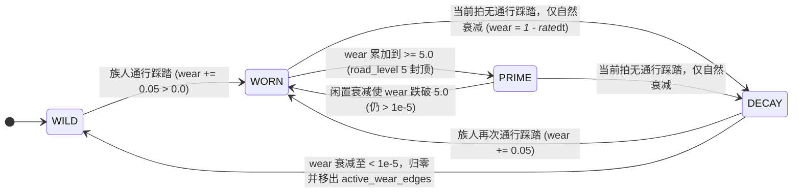

# 14. 地形、空间拓扑与路网（`geo` + `spatial`）

## R0 T2 河道表示迁移（v1.53.0）

T2 主河现由生成期 `RiverCenterline` 参数化折线表示（弧长累计、线性弧长采样、精确点到线段距离与符号横距），河道影响带不再使用 `|x-center(y)|`。三回环中心线由独立 `hydro_rng` 相位确定性派生；河岸/河阶、水面轮廓、浅滩授权端点及取水点均沿中心线法向或弧长落位。中心线在地图边缘保留直线入/出图段，并在至少覆盖最大河半宽的内侧余量后平滑渐入渐出蜿蜒，避免法向轮廓顶点越界。浅滩端点从解析岸线起沿法向按栅格步长向外检查，直到其映射到非水格，避免急弯的邻近河段或栅格取整使端点落水。`RiverCenterline::meander_windows()` 提供 R0-4 牛轭湖前置的曲折率、弯颈宽度与摆幅候选窗口诊断；没有合格窗口只表示未来子特征不注入，不拒绝基础世界。该中心线不进入存档；边缘形态修复使生成器版本从 16 推进至 17；v1.58 冲积扇沟槽合并与浅滩端点陆格寻址使版本再推进至 19；v1.59 河谷子特征改为水线净空 + 最远点散布，版本推进至 20，旧地形存档按既有版本门禁拒绝。

> **层级**：下层 · 世界与物理层。
> **本文构成**：原 `current/01-spatial-network.md` + 原 `../../plan/tech/06-terrain-templates.md` 第二部分「支撑所有地图模板的共用技术基座」（已落地契约）。模板库与未来蓝图见 [06 地图模板规划](../../plan/tech/06-terrain-templates.md)。


> **模块索引**：[← 返回 ../README.md 全景索引](../README.md) · 主要源码：`crates/sim_core/src/geo/terrain.rs`、`geo/biome.rs`、`geo/query.rs`、`crates/sim_core/src/spatial/graph.rs`、`curve.rs`、`vec3.rs`

---

## 状态机

单条车道（`LaneEdge`）从荒野到极品大道、再随闲置衰减回归荒野的磨损（`wear`）生命周期。



| 状态 | 含义 | 进入条件 | 退出条件 |
| :--- | :--- | :--- | :--- |
| WILD | 荒野车道：未踩踏、未入活跃磨损集，速度 0.50× | wear 归零（初始或衰减 < 1e-5） | 族人通行使 wear > 0 |
| WORN | 踩踏累积态：入 `active_wear_edges`，速度随量化等级 0.50×~2.20× | wear 自 0 进入，或衰减跌破 5.0 | wear >= 5.0，或当前拍无通行 |
| PRIME | 极品大道满额封顶态：速度 2.20×，`wear` 缓冲至 10.0 | wear 累加至 >= 5.0 | 闲置衰减使 wear < 5.0，或当前拍无通行 |
| DECAY | 闲置自然衰减态：仍在 active 扫描集，`wear` 下降 | 当前拍无通行踩踏仅衰减 | 族人再通行，或 wear < 1e-5 归零 |

**不变量**（违反即出 bug）：
- 衰减为比例模型（`wear *= 1 - rate*dt`，每小时 0.5%），高等级道路退化更慢，不得改为线性衰减。
- `wear < 1e-5` 必须归零并移出 `active_wear_edges`，否则活跃集合含零磨损边导致每拍无谓扫描。
- 路径缓存失效仅由衰减（成本只增）或踩踏跃迁（三角不等式）定向触发，不得全图击穿。

## 模块定位

连续 3D 地形上的贝塞尔曲线拓扑路网系统，为部落民提供 A\* 寻路导航，并通过踩踏-衰减机制涌现出自发道路网络。地形与路网是所有空间行为的物理基底。

## 核心机制

### 连续 3D 地形与 T0/T1 静态地貌
- `TerrainMap` 以固定网格和 seed 确定性生成高程、坡度、自然土地适宜性与地表类别；当前默认按 `terrainProfile` 在 8 张已收口 profile（T1 山口 / T2 河谷 / 草原 / 半坡林地 / 台地 / 冲积扇 / 盆地 / 湖畔盆地）间按种子确定性轮换（★ v1.50.68 砍需求起 random 候选池 8 路，各 ~12.5%；原 9 路中的 `river_valley_settlement_v1` 已删除；`flat_baseline` 诊断基线永不入列）。
- `GeoCell` 已提供 `SurfaceKind`（普通干地、软地、浅水、深水、河岸、河阶、裸岩面）、水体关联字段和 `NO_BUILD`/`NO_WALK` 等事实标志。T1 当前只实际生成干地、软地和裸岩面，水体相关枚举为 T2 预留。
- T1 profile 由局部 RNG 派生主脊与山口鞍部的连续起伏地貌（v1.47.7 起不再生成台地/高台，也不输出 `Ridge`/`Saddle`/`Terrace` 特征折线）；水系特征（河岸/浅滩/泉谷）仍由 T2 profile 输出，前端只消费这些内核事实进行绘制；草原 profile 包含泉溪低洼地形（见 §9.7）。
- `geo/query.rs` 提供统一只读地表查询：`sample_cell`、`validate_footprint`、稳定 `TerrainFailure` 和步行成本；房屋实体化已使用完整占地坡度/地表校验。
- `TerrainMap::validate_curve` 对贝塞尔路线进行按长度自适应采样并检查走廊两侧地表；当前已提供 T0 校验原语，后续路网生成器接入后再替换现有全图直线铺路。
- 地形生成器版本为 `5`（mac v1.50.41 TB-01 多尺度噪声与支脊、master v1.50.40 草原 profile 分支各自递增，合并后取 5；此前 v1.50.17 T1-R 主脊通行力修复为 4、v1.47.7 为 3），profile 通过存档门禁校验；旧路网不会与不匹配的新地貌静默组合。

### 贝塞尔曲线 3D 路网 (`LaneGraph3D`)
- 节点与双向三次贝塞尔曲线车道构成拓扑网络，曲线定义见 `curve.rs`。
- **A\* 启发式寻路**：综合几何欧氏距离、地形爬坡能耗惩罚、道路等级速度加成与隐秘偏好。

### 踏路成道与自然衰减（Stigmergy）
- 族人通行时累加踩踏耐久（`wear += 0.05`，上限溢出允许至 10.0，超过 5.0 无额外速度增益），往返双向共同加固。
- 移动速度随踩踏等级从 0.50×（荒野）提升至 2.20×（5 级极品大道满额封顶，超过 5.0 充当耐久缓冲储备）。
- 闲置道路按比例自然衰减（每小时 0.5%，`wear * (1 - rate*dt)`），回归荒野。
- **★ v1.42.1 稀疏活跃磨损边集合 (M2 优化)**：`LaneGraph3D` 内部维护确定性有序集合 `active_wear_edges: BTreeSet<EdgeIndex>`。仅当车道产生通行踩踏（`wear > 0.0`）时纳入扫描，每拍衰减阶段仅迭代该活跃子集（开销从 3.07µs 降至 0.40µs，耗时压降 87%），衰减至 `< 1e-5` 时自动归零并移出集合，存读档自动按 `wear > 0.0` 重建，实现 100% 确定性与零多余计算。

### 5 阶恒定线宽与专属色彩
道路升级保持恒宽（`2.0 * zoom`），纯通过色彩区分等级：

| 等级 | 名称 | 色彩 |
| :--- | :--- | :--- |
| 1 | 泥土细道 | 浅褐色虚线 |
| 2 | 夯土小道 | 琥珀暖橙色实线 |
| 3 | 硬质石道 | 灿烂明黄色 |
| 4 | 精修通衢 | 清爽冰蓝色 |
| 5 | 帝国大道 | 尊贵紫金色 |

### 道路悬浮信息卡
鼠标悬浮路网时实时展示道路名称、踩踏耐久百分比、移动速度加成倍率、通行加固值与闲置衰减速率。

### 地形与房屋选址接口
- 房屋候选和最终实体化均使用 `validate_footprint`，完整占地由 `terrainFootprintHalfExtent`、`terrainMaxBuildSlope` 控制；不再只凭中心点高度判断地块合法。
- 查询失败使用稳定原因：越界、深水、陡壁、地表禁用或完整占地坡度过大。没有合法地块时交由 Agent 正常重选，不由地形系统强制搬迁。
- T1 山口 profile 只提供连续起伏地貌与选址/路网约束，不生成河流/浅滩特征（属 T2 河谷）；动态通行仍待后续扩展。
- **水系河谷与写意沙盘平滑管线（★ v1.48.2）**：T2 河谷（`river_valley_v1`）生成确定性闭合水体多边形（`River`）与双岸平滑几何（`RiverBank`）；前端通过四层微缩沙盘管线（河床底模消隐、平滑湿砂漫滩带、连续碧蓝矢量水面闭合填充、水陆交界表面张力微沫高光；★ v1.50.3 起中心微波虚线已移除）彻底消灭 13 米离散网格阶梯锯齿，零网格细分、零 GC 堆分配，耗时增量 $\le 0.08\text{ms}$。

## 关键不变量
- 路网节点从不删除；房屋坍塌后，其大门节点可被新立宅复用（`house_node_reuse_radius`）。
- 道路衰减为比例模型而非线性模型，高等级道路退化更慢。
- A\* 寻路消耗确定性 RNG，不得在寻路路径中插入额外随机消耗。
- **端点对路径缓存与 0.25 级离散阶梯失效（★ v1.37.5 / v1.40.3 / v1.43.0 M3 优化）**：`LaneGraph3D` 维护 `(start, goal, prefer_hidden)` 的路径缓存，A\* 搜索综合道路基础限速与以 0.25 级（`road_wear_tier_step`）为阶梯步进的量化踩踏速度加成（`0.50x~2.20x`）及几何坡度。在 v1.43.0 (M3) 中升级为三级查表与局部失效：① **衰减局部失效**：自然衰减只会增加成本，因此 `tick_wear_decay` 仅对包含跌落车道的路径定向失效，未涉车道路径严格保持最优；② **踩踏几何剪枝**：车道踩踏跃迁仅基于三角不等式失效受影响范围内的路径，消除全图击穿；③ **全源静态查表 (APSP Table)**：地貌初始化与路网重建时预计算静态拓扑矩阵，无踩踏区域直接 $O(1)$ 查表返回，全内核吞吐达 97,792 TPS。

## 与其他模块接口
- `agent.rs`：调用 `find_path_3d_with_preference` 获取路径，沿曲线运动。
- `housing_system/settlement.rs`：立宅时接入最近 3 节点或复用空置节点。
- `snapshot.rs`：路网状态随快照序列化下发前端渲染。

## 调参入口
道路踩踏、衰减、限速、A\* 权重等参数见 [./05-config-reference.md](./05-config-reference.md) 第 8、9 分区。


---

# 第二部分 · 支撑所有地图模板的共用技术基座

> 本部分的地表查询、数据模型、创世流水线、路网、水资源、选址、快照存档、渲染与配置，是**全部地图模板共享的基座**；新增模板只复用它们，不另起一套。每节开头标注它的「服务对象」。

## 7. 共用数据模型：地表单元、地貌特征、水体与资源池

> **服务对象**：全部地图模板——所有模板共享同一套地表单元、地貌特征与水体/资源池模型。


### 7.1 地表单元

✅ 已落地（v1.47.1）。`GeoCell` 已扩展为“可查询的静态地表事实”，与下列建议字段一致：

```rust
pub struct GeoCell {
    pub elevation: f32,
    pub slope_angle_deg: f32,
    pub surface_kind: SurfaceKind,
    pub natural_fertility: f32,
    pub water_body_id: Option<u32>,
    pub feature_flags: u16,
}
```

`SurfaceKind` 采用闭集枚举，T0/T1/T2 只启用以下变体（T1 只实际生成 `DryGround`/`SoftGround`/`RockFace`）：

```text
DryGround       普通干地
SoftGround      湿软地，允许通行但增加成本
ShallowWater    浅水，只有被浅滩连接覆盖的走廊可跨越
DeepWater       深水，硬禁行且禁建
RiverBank       河岸/岸带，允许岸边交互，不代表可涉水
RiverTerrace    河阶，可在占地和坡度满足时建房
RockFace        陡壁/裸岩面，超过通行坡度时硬禁行
```

说明：

- `natural_fertility` 只描述自然土地条件，不能直接写入家户粮食或农业资产 `fertility`。
- `water_body_id` 只表示几何归属；可采水资源通过独立的 `WaterPool` 关联，不能把每个单元当成一份库存。T2 `river_valley_v1` 将深水单元关联至 `Some(1)`，其他地表为 `None`。
- `feature_flags` 只放稳定、可组合的查询事实。已定义 `NO_BUILD`/`NO_WALK`/`SHORE_ACCESS`/`CROSSING_CANDIDATE` 四个标志；T2 中深水写入 `NO_BUILD|NO_WALK`，河岸写入 `NO_BUILD|SHORE_ACCESS`，浅滩写入 `NO_BUILD|CROSSING_CANDIDATE`。
- ⚠️ `SHORE_ACCESS` 目前是**只写不读**的标志：全仓只有定义（`biome.rs`）与写入点（`hydrology.rs`），没有任何读取方。因此它**不产生任何交互语义**——取水可行性只由 `WaterAccessPoint` + `WaterPool` 决定（§12）。任何依赖它的新设计必须先实现读取方。

### 7.2 地貌特征

✅ T1/T2 已落地（v1.47.5），定义于 `geo/terrain.rs`；特征用 `Vec` 承载以避免 HashMap 迭代顺序进入确定性路径。**注意当前是「生成顺序」而非「ID 升序」**——T2 实际顺序为 `ShallowFord(10,11)` → `River(1)` → `RiverBank(20,21)` → `SpringValley(30)`（见 §14.1），ID 升序是 §5.2 对 D-B1 提出的要求，尚未实现。

```rust
pub struct TerrainFeature {
    pub id: u32,
    pub kind: TerrainFeatureKind,
    pub vertices: Vec<Vec3>,
    pub elevation: f32,
    pub width: f32,
    pub flags: u16,
}
```

`TerrainFeatureKind` 规划与落地情况（v1.47.7：`Ridge`/`Saddle`/`Terrace` 三特征已删除，不生成也不绘制；v1.48.0：删除 `Wetland` 湿地）：

```text
River          河道中心线和水面边界  ✅ v1.47.5 (T2)
RiverBank      岸带轮廓              ✅ v1.47.5 (T2)
ShallowFord    静态浅滩连接          ✅ v1.47.5 (T2)
SpringValley   泉谷                  ✅ v1.47.5 (T2)
Cliff          峡谷壁/断崖            ⏳ D-B (T2 子特征注入)
WaterBody      湖泊水面              ⏳ D-B (T1/T2 子特征注入)
Waterfall      瀑布跌水              ⏳ D-B (T1 子特征注入)
~~Wetland~~     ~~湿地斑块~~          ❌ v1.48.0 删除（视觉辨识度过低）
```

特征的职责是表达几何和查询来源，不承担库存、税收、生产或 Agent 行为。`vertices` 采用世界坐标，前端按投影绘制；浅滩由 `TerrainConnection` 表达授权通道（两端端点、走廊宽度与节点），配合 `corridor::segment_valid` 授权跨水。

### 7.3 水体与共享资源池

✅ 已落地（v1.47.5）。实现于 `geo/hydrology.rs` 与 `spatial/terrain_network.rs`：

```rust
pub struct WaterBody {
    pub id: u32,
    pub level: f32,
    pub flow_direction: Vec3,
    pub resource_pool_id: u32,
    pub vertices: Vec<Vec3>,
}

pub struct WaterPool {
    pub id: u32,
    pub current_stock: f32,
    pub max_stock: f32,
    pub regen_rate: f32,
    pub source_poi_ids: Vec<u32>,
}

pub struct WaterAccessPoint {
    pub id: u32,
    pub water_body_id: u32,
    pub resource_pool_id: u32,
    pub pos: Vec3,
    pub nearest_node_id: Option<u32>,
    pub interaction_radius: f32,
}
```

落地细节：

- T2 保留现有 `PoiType::WaterSource`，但将同一河流两岸的多个岸点（`WaterAccessPoint`）的储量读取和扣减委托给同一个 `WaterPool`（池 ID 1）。
- 既有 Agent 装载、回家卸货、家户账本和施密特触发器保持原有语义；在 `spatial/ecology/harvest.rs` 中，多名 Agent 采水先收集需求并按 `agent.id` 升序稳定排序，再串行扣减共享水池，保证不同执行批次下的绝对确定性。
- 自然再生在 `spatial/ecology/tick.rs` 中按池统一执行，每个水源 POI 的动态储量通过 `sync_water_pois()` 与所属水池实时同步。
- 水面存在但 `current_stock == 0` 时，前端仍绘制水面，HUD 大盘按池 ID 去重统计（`render_hud.js`），避免同一水池被多点统计导致总量虚高。
- T2 水位保持静态几何事实（`terrainRiverWaterLevel = 0.0`），枯水/丰水动态涨落预留给 T4。

### 7.4 地表装饰（Accents）

✅ 已落地（v1.49.1）。装饰层是独立于地貌特征（`TerrainFeature`）之外的纯视觉要素集合。与特征层的分工：

| 维度 | TerrainFeature | Accent（装饰） |
| :--- | :--- | :--- |
| **语义** | 影响通行、可建、取水决策 | 纯视觉，无物理影响 |
| **来源** | 地形骨架生成器 | 独立 `accent_rng` 加盐 |
| **持久化** | FABS Section 18 | FABS Section 21 |
| **数量** | 个位数 | 数十个（可配置密度） |
| **分布** | 固定骨架位置 | 按地表类别/坡度/肥力散布 |

```rust
pub struct TerrainAccent {
    pub id: u32,
    pub kind: AccentKind,       // Tree | Bush | Boulder | RockCluster | GrassTuft
    pub pos: Vec3,
    pub scale: f32,            // 0.7 ~ 1.4 视觉变体
    pub rotation_rad: f32,     // 0 ~ 2π
    pub     tint: u8,              // 0=默认, 1=偏黄(秋季), 2=偏红(深秋)
    // ★ 现状：该字段是**无生产者的预留钩子**——Rust 侧恒写 0（`accents.rs`「tint 默认 0」），
    //   渲染层也不再读它：季节叶色自 2026-09-12 起由前端 `SimTreeTint.sample(accent, sim)`
    //   按当前季节实时派生（`accent-season.js`，★ v1.50.23 自 render_terrain.js 迁出；真相源＝快照 `season`/`season_progress`）。
    //   D-B1 若仍需该字段，必须指定唯一生产者；否则应借 FABS `FORMAT_VERSION` 2→3 之机移除（§5.7）。
}

pub enum AccentKind {
    Tree        = 0,   // 四瓣层叠树冠 + 锥形树干（季节变色）
    Bush        = 1,   // 三瓣扁压圆簇灌木
    Boulder     = 2,   // 不规则多边形岩石
    RockCluster = 3,   // 2-5 块碎石聚集（D-B）
    GrassTuft   = 4,   // 草丛斑点（D-B）
}
```

装饰散布规则（当前实现，`geo/accents.rs`）：

- **禁区（当前实现）**：`DeepWater` / `ShallowWater` 格、`NO_WALK` 格（★ v1.50.73 起无例外——原 `Boulder + RockFace` 受控豁免已随陡坡禁石规则移除）；★ **v1.52.0 起再加两道全局规则**（对所有五种装饰生效，见 `accents.rs::generate_accents_of_kind` 外层禁区）：① **地图边缘保护区**——距世界四边各 `3% × world_size`（764m → 22.9m ≈ 7.6 格）的环形带内不生成任何装饰（沙盘边缘紧贴垂直护壁，贴边装饰会溢出沙盘轮廓）；② **水面净空**——装饰中心到**渲染水面多边形**（`hydrology.water_bodies[*].vertices`：T2 主河闭合带 + 静水闭合轮廓，与前端 `drawRiverBand` / `drawWaterBodyTile` 同源）的距离小于 `WATER_CLEARANCE_M`（v1.58.1 起 13m，覆盖最大模型水平包围体约 8.5m × 最大缩放 1.4 后的约 11.9m，并留余量）者拒绝，避免灌木/树冠跨入水面。**道路、房屋与 `WaterAccessPoint` 占地不在其中**——装饰在创世阶段生成，此时这三类实体尚未放置（见 §9.8 输入说明）。早期版本声称装饰会避让道路/房屋/POI，那不是代码事实。
- **偏好与空间分布**：Tree 接受平地（含 0 坡）至 32° 坡度——DryGround/SoftGround 按肥力加权、RiverBank 0.85 / RiverTerrace 按 `fertility×0.5+0.5` 高概率（河流两岸有树）；★ v1.50.73 反转：Boulder/RockCluster **陡坡（≥18°）禁石、其余地表随机接受**（原 v1.50.10「偏好陡坡与裸露 RockFace」规则作废）；v1.58.1 起石块按四象限分别封顶至各自目标量的 1/4 向上取整，避免单一种子偶然集中到局部；v1.59.0 起河谷碎石子特征再按 48m 最小间距铺开。Bush 偏好林缘过渡带 + RiverBank 0.6 / RiverTerrace 0.5 喜湿灌丛。
- **数量**：基础密度 `terrainAccentDensity: 1.0`，Tree 基数 40、Boulder 20、Bush 25、RockCluster 12、★ v1.51.0 GrassTuft **120**（原 60，用户需求「草的数量翻倍」；乘密度倍率取整；RockCluster/GrassTuft 由 ★ D-B1-5 落地），有界重试 3× 目标数。平地草原 `grassland_plain_v1` 的 GrassTuft 预算仍 ×8（120 → 960 @density=1.0，原 480）。
- **确定性**：`accent_rng = WorldRng::new(seed ^ ACCENT_RNG_SALT)`，盐值 `0x4143_4345_4E54_3031`（"ACCNT01"），独立于 `relief_rng`/`hydro_rng`，不污染全局 RNG。
- **持久化**：`TerrainMap.accents: Vec<TerrainAccent>`（`#[serde(default)]`）随 `terrain_state` 一并入档，读档后逐字节恢复。

### 7.5 地表查询结果

◐ 已落地主体（v1.47.1），实现于 `geo/query.rs`：

```rust
pub struct FootprintQuery {
    pub center: Vec3,
    pub half_extents: (f32, f32),   // 方案原拟 Vec2，实现为元组
    pub rotation_rad: f32,
    pub use_kind: LandUseKind,
}

pub struct TerrainQueryResult {
    pub valid: bool,
    pub failure: TerrainFailure,
    pub min_elevation: f32,
    pub max_elevation: f32,
    pub max_slope_deg: f32,
    pub surface_mask: u16,
    pub walk_cost: f32,
}
```

已提供：

- ✅ `sample_cell(wx, wy)`：返回地表类别、高程、坡度和水体关联。
- ✅ `validate_footprint(query, max_slope_deg)`：对完整占地覆盖的栅格单元求高差、最大坡度、水域覆盖、禁建标记和地表成本；触及浅水时拒绝并返回 `WaterCovered`。
- ✅ `surface_walk_cost(kind)` 与 `explain_failure(failure)`：稳定步行成本与诊断文案。
- ✅ `TerrainMap::validate_curve(curve, corridor_width, max_walk_slope)` 与 `geo/corridor.rs`：完整曲线与走廊校验原语，浅滩授权走廊豁免 `ShallowWater`。

未提供（后续补充）：

- ⏳ `nearest_valid_node(pos, use_kind)`：只返回在合法地表上的路网节点（当前路网由 `spatial/terrain_network.rs` 统一拓扑连接）。

`TerrainFailure` 使用闭集错误码，实现了 8 个变体：

```text
OutOfBounds          ✅ 产生
WaterCovered         ✅ 产生（占地触碰浅水时拒绝建房）
DeepWater            ✅ 产生
CliffTooSteep        ✅ 产生
SurfaceForbidden     ✅ 产生
FootprintTooUneven   ✅ 产生
NoRoadAccess         ◐ 已定义，暂不产生（房屋占用另由 settlement 检查，未并入）
Occupied             ⏳ 未实现
NoValidCrossing      ⏳ 未实现（T2 走廊校验由 corridor::segment_valid/validate_curve 承载）
```

房屋、农田、哨塔和路卡向查询服务传入各自 `LandUseKind`。当前房屋消费 `LandUseKind::House`；`Farm`/`Defense` 待后续农业与防务接入。

## 8. 生成顺序与有效世界保障

> **服务对象**：全部地图模板的创世流程——任何模板都必须按此顺序生成并满足「有效世界」底线。


生成流程如下。**T0/T1/T2/D-A 部分已实现**，标注 ✅ 的步骤为当前真实链路；`terrain_generation_max_retries` 有界降级环已落地（v1.50.49，`creation_fallback.rs`）：`new_seeded_with_config_bounded` 每次构建独立候选（生态播撒后）依次过静态几何校验、路网校验与生存诊断门禁，失败按 §5.8 阶梯降级（禁结构子特征 → 移除支脊 → `flat_baseline`），预算耗尽或无新策略返回错误；阶段三几何事务已提供候选隔离与原子局部拒绝，当前注入器仍为空。

```text
种子 + 生成器版本 + 配置                    ✅
  → 主地貌骨架与高程（T0 基础 + T1 主脊/山口）✅
  → 排水方向、河道/湖盆、水位与出口（T2）    ✅
  → 通行表面、岸带与可建区域                ✅
  → 营地与必要资源候选、浅滩与山口连接      ◐（浅滩/路网已通；生存诊断已可独立调用）
  → 合法导航走廊与贴地曲线路网              ✅
  → 连通性、占地、资源距离校验              ✅（v1.50.49 起接入创世门禁链 + 有界降级环）
  → 固定世界事实与快照 → 地表装饰与美术     ✅
```

首期采用受约束的地貌模板与确定性参数变化，不要求先建立完整侵蚀或流体模拟。河道必须沿可解释的下游方向连接到地图出口或湖泊；需要整形时在世界初始化完成前统一修改地表，不能只将水线画上山坡。湖面按单一水位求岸线，瀑布处明确落差。

**有效世界至少满足**：初始居民落在干燥可达区域；每个初始营地能到达所需水粮；全局关键资源和市场在预期陆路连通分量内；每个营地有配置规定的可建面积和扩张余量；必要资源路径成本不超过经生存诊断校准的上限。连通不等于能活下来，必须测往返时间与饥渴/体力消耗。

候选搜索、同成本排序、重试次数和修复顺序必须固定。失败时只在初始化阶段按固定次序调整浅滩、缓坡或候选 POI，超过有界重试次数则使用通过校验的简化模板并记录原因；禁止无限重抽种子，禁止运行中移动居民来修复地形。

### 8.1 静态几何校验与生存成本诊断（v1.50.47 · STAGE2-4/6）

**局部坡度与定稿共用判据**（v1.50.51）：第 5c 步只读当前高程，使用 `hydrology.rs::slope_from_elevation` 计算工作区临时坡度，第 6 步全图定稿调用同一函数。四邻域差分、边缘单侧差分和浮点运算次序保持既有定稿语义；生产方形网格两轴沿用 `world_size/(grid_width-1)` 步长，不额外钳制局部步长。全图循环只写坡度，不改高程，因此不再分配全图高程副本。此项为 RiverCliff 尺度准入统一计算口径，尚未启用几何注入、改变地表阈值或完成岩壁验收。

两套只读校验服务已落地，自 STAGE2-5（v1.50.49）起由世界初始化事务消费：静态几何校验在创世第 7 步运行、失败码以 `Geometry:` 前缀进入有界降级环（§8.2）；生存诊断在候选生态播撒后运行、失败码以 `Survival:` 前缀进入同一环。诊断本身保持 `&self` 只读、不改变世界。

- **静态几何校验**（`geo/validation.rs`，创世第 7 步 `TerrainMap::validate_static_terrain_geometry`）：特征 ID 唯一 + 按 profile 归属/kind 期望映射 + 顶点在界；子特征 ID 升序唯一、`feature_ids` 引用存在、accent 区间配对；水体↔同 id 特征顶点双副本逐字节相等（主河水体 1 ↔ `River` 特征 1）；取水点/授权走廊引用与边界；浅滩端点在陆侧；cells 水域归属与 NO_WALK/NO_BUILD 一致；装饰 ID 按数组顺序严格递增且唯一，POI 避让过滤保留原 ID 时允许有间隙。只读不修复、不重排既有生成顺序；失败码（`FeatureIdsDuplicated` / `WaterBodyOutlineMismatch` / `CellWaterFlagMismatch` 等）一经发布语义不变。
- **生存成本诊断**（`spatial/survival_diagnosis.rs::World3DEngine::diagnose_survival`）：按实际配置枚举营地 POI（不硬编码数量），逐营地一次单源 Dijkstra（微秒整型权重，确定性）检查水/粮/市场三类资源的路网可达与往返成本。成本口径与生产寻路一致（`terrain_time_cost` 软地/浅滩折算 + 上坡 `Δz×grade_coef` 坡度折算，车道限速按创世态磨损 0 的 `road_level_factor`）；水源 / 浆果预算由现有配置推导、无新增超参：资源点与家宅两端可满仓自饮自食 ⇒ 往返允许 `2×capacity/代谢速率`（名义消化效率 1.0）。市场仍要求路网可达并记录往返成本，但无 500s 往返时间门槛；市场被选作水 / 粮补给 POI 时也不受该门槛约束。输出 `SurvivalReport{camps, ok, worst_code}` 与每营地 `ResourceLinkReport{poi_id, round_trip_cost_s, budget_s}`（选中市场时 `budget_s=None`）；失败码 `SpawnDisconnected` / `SurvivalCostExceeded`，后者仅用于清泉 / 浆果超预算。⚠️ `NodeId` 从 1 起、petgraph `NodeIndex` 从 0 起，查距必须经 `node_map` 映射；历史校准矩阵（v1.50.47）：4 profile × seed 0–59 全通过，市场往返最远 441.7s。

### 8.2 世界初始化事务、有界降级与阶段二收口记录（v1.50.49 · STAGE2-5/8）

**有界构造器**（`spatial/creation_fallback.rs::World3DEngine::new_seeded_with_config_bounded`）包住完整生成链：每个候选从冻结配置克隆 + 策略施加全新构建（`build_candidate`），`prepare` 钩子内完成 camp_count 覆盖与 `seed_primitive_ecology`（★ 路网/生存门禁必须在**已播撒生态**的候选上运行），门禁链 = 静态几何（§8.1，`Geometry:` 前缀）→ 路网读档校验（`RoadNetwork:` 前缀）→ 生存诊断（`Survival:` 前缀）；全部通过才发布。失败候选整体丢弃（RNG/计数器/POI/路网/缓存不污染最终世界）；降级阶梯（禁结构子特征 → 移除可选支脊 → `flat_baseline`）与策略键去重、预算语义按 [06 号 §5.8](../../plan/tech/06-terrain-templates.md) 执行。诊断 `WorldCreationDiagnostic` 附着 `World3DEngine::creation_diagnostic`（进程内事实，不入存档），降级发布经 `last_event` 事件流明示；WASM `world_create` 失败返回 1 + `world_last_error_*`。旧无失败语义入口 `new_seeded_with_config` 保留给探针/图鉴（纯地形候选只跑几何门禁；降级耗尽兜底直建基线并标记 `legacy_fallback`）。

**STAGE2-8 收口差分记录（2026-09-13，合法基线等价验收）**：

- **基准/候选**：基准 = `5527a9e`（v1.50.44，TB-01 收官 + S7-02 草原合流后、STAGE2-3 流水线重构之前，包含全部已交付物理变更；禁用 v1.50.38 旧 T1 当基线）；候选 = `c6a59f7`（v1.50.49）。两侧均为 release 原生构建直跑同版探针。
- **WASM SHA256**：基准侧 `24c3442237e039830273df4750e72dd9dae9ec537ff1f2d360a388f49867c753`；候选侧 `d7d5f3bf942f8e3abe712ec0358ba88a5899a34b62637666b00048a3154b2302`（`frontend/rust/` + `frontend/` 双副本一致）。
- **配置**：`crates/sim_core/examples/config.json` 在两提交间零差异（探针冻结配置）。
- **差分字段**：高程/坡度/地表/flags/肥力/水系（水体+取水点+授权走廊+特征轮廓）/POI/路网（节点+车道拓扑与剖面）FNV-1a 逐位指纹；装饰 accents 不在字段内（S7-03 草甸装饰属表现层演进而非阶段二物理面，与分层验收边界一致）。
- **结果**：T1/T2 × seed 0–59 × 支脊两态共 240 组，seed 级指纹与 4 组聚合指纹**基准=候选逐位全等**——山口开 `c9cc1c523bf1261e`、山口关 `846cb23e831e92c0`、河谷 `1f0907f71ed73ff1`（两态同值，支脊仅山口生效）。

**新增拒绝/降级行为统计（生产路径 `bounded` + prepare，冻结配置，seed 0–59 × 4 profile）**：

| 类别 | 数量 | 明细 |
| :--- | :--- | :--- |
| 首次通过 | 240/240 | 全部 `first_try`（默认配置下新门禁不拒绝任何合法基线世界） |
| 特征未注入（局部拒绝） | 0 | 事务域已具备候选隔离与原子回滚；当前注入器为空 ⇒ 结构子特征掩码恒空，代码事实 |
| 降级成功 | 231/240 | `terrainMaxWalkSlope=1.9°` 只放行倾斜-only 基线：山口/河谷/半坡各 60/60 降级、草原 51/60 降级；全部发布至 `flat_baseline`（`degraded=true`），最多 3 次尝试。草原 9 个首过种子 = 3/10/26/35/44/45/50/52/55 |
| 初始化失败 | 239/240 | `agentThirstCapacity=1.0`（生存预算骤缩至 10s）令全阶梯不可过：239 个 `no_new_strategy`（山口阶梯 3 策略、河谷 2、基线 1，尝试次数 1~3）；仅河谷 seed 31 首过（极近邻生存链恰好落在预算内，属合法世界） |

**三项遗留门禁销项**：生存诊断 ✅（v1.50.47 交付 + v1.50.49 拒绝接入）；flat_baseline 等价 ✅（旧 T0 基准缺口已声明、新冻结基准 v1.50.48〔WASM `e4f71187…`、基线指纹 `c71c4f8abbe18b7b`〕+ 本节收口对拍）；有界回退 ✅（v1.50.49 落地 + 本节统计）。验收全程使用临时探针，已按根 AGENTS.md §4.10 提交前删除，无持久化测试入库。

## 9. 确定性创世与各地图模板的生成实现

> **服务对象**：已落地模板（T1/T2）的生成实现；新增模板的生成器按同一套 RNG 分域与版本门禁接入。


### 9.1 RNG 分域与 Profile 模板选择

✅ 已落地 `relief_rng`、`hydro_rng` 与 `accent_rng`。`TERRAIN_GENERATOR_VERSION = 7`（v1.50.48 STAGE2-7 新增 `flat_baseline` 分支后递增；此前 v1.50.46 为 6〔S7-04 半坡〕、v1.50.40/41 为 5〔S7-02 草原 / TB-01〕、v1.50.17 为 4、v1.47.7 为 3）：

```text
terrain_seed = seed
relief_rng   = WorldRng::new(seed ^ 0x5245_4C49_4546_5431)   // "RELIEFT1" 盐值 (T1)
hydro_rng    = WorldRng::new(seed ^ 0x4859_4452_4F54_3032)   // "HYDRT02" 盐值 (T2)
accent_rng   = WorldRng::new(seed ^ 0x4143_4345_4E54_3031)   // "ACCNT01" 盐值 (D-A)
```

> 三个 RNG 流严格隔离：`relief_rng` 只消费于 T1 主脊/山口参数；`hydro_rng` 只消费于 T2 主河/浅滩几何；`accent_rng` 只消费于散布装饰的位置/旋转变体。任一子流的重排或新增消费都不影响其他子流和世界主 RNG 顺序。

★ **T1/T2 随机轮换机制**：

- 前端与内核配置中 `terrainProfile` 默认为 `'random'`（亦支持显式锁定 `'mountain_pass_v1'`、`'river_valley_v1'`、`'grassland_plain_v1'`、`'hillside_woodland_v1'`、`'plateau_v1'`、`'alluvial_fan_v1'`、`'basin_oasis_v1'`、`'lakeside_basin_v1'` 或 `'flat_baseline'`）。
- 当配置为 `'random'` 时，内核在生成前按世界种子确定性分支（★ S7-10 候选池 2→5）：
  `(seed ^ 0x5052_4F46_494C_4531) % 8` 依序实例化为 `mountain_pass_v1`（T1 山口）/ `river_valley_v1`（T2 两岸河谷）/ `grassland_plain_v1`（平地草原）/ `hillside_woodland_v1`（半坡林地）/ `plateau_v1`（台地）/ `alluvial_fan_v1`（山前冲积扇）/ `basin_oasis_v1`（盆地）/ `lakeside_basin_v1`（湖畔盆地），各 ~12.5%（★ v1.50.68 砍需求后 8 路；原 9 路中的 `river_valley_settlement_v1` 已删除，同一种子的 random 映射随之改变）。
  ★ `flat_baseline`（STAGE2-7 显式诊断/降级基线，倾斜-only 平地）**永不参与 random 分派**，只能显式指定；它是 STAGE2-5 有界回退环的显式降级目标，支持存读档续演（存档 profile 白名单已放行）。
- ⚠️ **取模作用于原始异或值而非 mix64 哈希**：连续种子的落点按 `% 5` 同余循环分布，非哈希均匀分散。S7-10 扩池改变了既有种子在 random 下的落点（旧 T1/T2 奇偶交替 → 5 路取模），属 §20 收口设计——显式 profile 的输出不受影响，旧存档记录的是已实例化模板名，读档不受影响。
- 创世完成后，`terrain.profile` 记录具体实例化模板名，存档 `WorldSave` 记录真实模板名，完全保持同种子 100% 逐字节确定性与读档一致性，同时确保普通玩家开局/重置时五套地貌各 ~20% 均衡轮换。

要求：

- 盐值在代码中固定并写入生成器版本说明；不使用系统时间、浮点 Hash 或 HashMap 遍历作为随机输入。
- T1 不消费 `hydro_rng`；T2 只在自身子流中消费，不扰动 Agent、POI 和出生的全局 RNG 序列。
- 前端装饰使用 `terrain_feature_id + material_version + season` 的稳定整数哈希，不消费模拟 RNG。

### 9.2 T0 基础生成器

✅ 主体已落地（v1.47.1），保留 `TerrainMap` 的网格尺寸、世界尺寸和高程采样入口，生成步骤已抽取到 `generate_base_relief`（★ STAGE2-3 阶段化流水线第 2 步，原 `generate_with_profile`；其中坡度/地表/肥力定稿统一上移至流水线第 6 步 `finalize_slope_and_surface`——全图唯一写 slope 与派生 flags 的位置）：

1. ✅ 生成基础倾斜和低频起伏，保持当前 seed 的确定性（倾斜/幅度/四相位仍从主 RNG 消费，顺序未变）。
2. ✅ 计算完整网格高程和内部坡度；边界单元采用单侧差分而不是固定为 0，避免边缘通行误判。
3. ✅ 生成初始 `SurfaceKind::DryGround`。
4. ✅ 按坡度阈值写入 `SurfaceKind` 候选：≥34° `RockFace`、≥20° `SoftGround`、其余 `DryGround`；同时写入 `NO_BUILD`（≥18°）与 `NO_WALK`（硬禁行地表）标志。最终禁行由配置和查询服务确定，不直接把所有高坡标成不可通行。
5. ✅ 生成 `natural_fertility` 的静态遮罩（`(0.92 - slope/70 - 归一化高程*0.18).clamp(0.1, 1.0)`）。T0 只透传和可视化，不接入农业产量。
6. ⏳ 对每个初始营地、关键资源和市场执行合法地表与生存距离校验——未实施（`ecology/spawn.rs` 未消费查询服务；与之配套的有界重试参数 `terrainGenerationMaxRetries` 已于 v1.50.18 删除，实现该步时需一并加回并接线）。

> ★ **TB-01-4（v1.50.39）复核**：复合高程场（倾斜 + fBm + 主脊/支脊，TB-01-2/TB-01-3）接入后，步骤 2~5 的坡度重算与地表映射**自然生效、零改动**——12 种子验证：岩壁（NO_WALK）100% 落于主脊/支脊结构带且均值高程 ≥22m（全图均值 ~5.5m），真平原最大坡度 7.2°~9.4°（<16° 门禁）且零 NO_BUILD，山口走廊 max slope 17.7°~23.2°（<30°），肥力方向正确（真平原均值 ~0.78 vs 岩壁 ~0.25），边界单侧差分生效（全格坡度有限值）。

`sample_elevation` 当前使用双线性插值；离散地表事实由 `sample_cell`/`grid_index` 以最近栅格读取。若后续改变任一采样语义，必须同时复核 POI、房屋、路网和 Agent 的接地位置。

### 9.3 T1 山口聚落模板

✅ 已落地（v1.47.1/v1.47.2；v1.47.7 起**不再包含台地/高台**），使用可配置的定向地貌骨架（`profile = "mountain_pass_v1"`），不做无限随机重抽：

```text
主脊：一条沿方向 theta 的长条高程增量
支脊：最多两条低幅度分支            ✅ 已实现（v1.50.38，TB-01-3：1~2 条不对称支脊 + 鞍部禁区）
山口：主脊上的一个低鞍部窗口
台地：❌ 已删除（v1.47.7 起不再生成平顶高台）
```

实现步骤（落地情况）：

1. ✅ 从 `relief_rng` 固定生成 `theta`（±0.18 rad）、主脊偏移（±0.08×world_size）、宽度（0.16~0.23×world_size）、幅度（24~34m）、山口位置（±0.12×world_size）与宽度（0.10~0.15×world_size）。
2. ✅ 用到主脊中心线的有符号距离生成高斯型高程增量；主脊两侧平滑过渡，禁止在格点边界产生尖峰。
3. ✅ 在山口窗口压低主脊（`elev += ridge - ridge * 0.90 * saddle`），生成连续的低坡通道；山口是普通地表走廊，不新增传送节点。
4. ❌ 台地平顶压平算法（Tableland Flattening）——v1.47.7 已整体删除，不再削平任何平台。
5. ✅ 重新计算坡度、地表类别和可建掩码。
6. ❌ `Ridge`/`Saddle`/`Terrace` 特征折线生成——v1.47.7 已整体删除（T1 profile 不再输出任何地貌特征）。
7. ⏳ 先生成/筛选合法 POI 与营地候选，再通过 T0 路网走廊生成器接入节点——未实施（待 `spawn.rs`/走廊生成器接入）。

T1 的首轮验收只要求"路线会绕山、山口可通过"，不增加高地防御、资源加成或行政税收。

#### 9.3.1 T1 主脊通行力：缺口与修复（2026-09-11 审查 → 同日修复）

> ✅ **已修复（v1.50.17，生成器版本 3 → 4）**：`mountain_pass_v1` 的主脊现在产生真实硬禁行与绕行代价，山口是唯一通道。

修复后实测（`cargo run --release -p sim_core --example terrain_probe -- 60`，60 个种子，`grid_res=120`、`world_size=764`）：

```text
T1 全图最大格子坡度      36.22° ~ 40.76°             （修复前 11.1° ~ 24.3°）
T1 slope > 30° 格子      51085 个，均值 851 / 种子     （修复前 0）
T1 slope >= 34° 格子     23327 个，均值 389 / 种子     （修复前 0）
T1 可建格（≤16° 且非 NO_BUILD）   最少 11626 / 14400
T1 可行走连通分量        恒为 1（山口始终可通行）
T1 绕行比 max            2.17 ~ 4.80                 （修复前恒为 1.08）
T2 全部指标与修复前逐项一致（本次未触碰 T2 生成路径）
相关阈值                 SoftGround >= 20.0° | terrainMaxWalkSlope = 30.0° | RockFace >= 34.0°
```

**缺口成因（保留记录）**：主脊是高斯型增量 `A · exp(-(across / ridge_width)²)`，最大梯度为 `0.858 · A / ridge_width`。修复前 `ridge_width = 0.16 ~ 0.23 × world_size ≈ 122 ~ 176 m`（相当于 σ ≈ 86 ~ 124 m 的极缓山包），`A = 24 ~ 34 m`，仅得 6.7° ~ 13.4°；叠加基础倾斜（约 ±5°）与两组起伏波后仍到不了 30°。于是 `geo/corridor.rs::segment_valid` 的三条拒绝条件（`slope > terrain_max_walk_slope`、`NO_WALK`、`RockFace`）全不触发，主脊上任何路线都合法；越过主脊的唯一代价是部分 ≥20° 格子按 `terrainSoftGroundCost`（1.25×）计费。主脊当时只通过 `NO_BUILD`（≥18°）与 `terrainMaxBuildSlope = 16°` 影响**建房**，不影响**通行**。

**修复方案（已落地）**：

- 新增两个 T1 专用配置字段 `terrainPassRidgeWidth`（默认 62 m）与 `terrainPassRidgeAmplitude`（默认 53 m），替换原先散落在 `geo/terrain.rs` 里的字面量 `0.16~0.23 × world_size` 与 `24~34 m`——根因正是这些不可调、无文档的魔数；
- 鞍部窗口由 `0.10 ~ 0.15 × world_size` 放宽到 `0.14 ~ 0.19 × world_size`。鞍部过渡带的沿脊梯度约 `0.9 × amplitude × 0.858 / saddle_width`，主脊加陡后鞍部若仍过窄，会把山口本身夹成不可通行；
- **参数契约（改这两个值前必读）**：主脊最大梯度 `0.858 × terrainPassRidgeAmplitude / terrainPassRidgeWidth` 必须显著大于 `tan(terrainMaxWalkSlope) = 0.577`，否则主脊不挡路；同时鞍部沿脊梯度必须显著小于同一阈值，否则山口被夹死。当前取值 0.858 × 53 / 62 = **0.733**（≈36.2°），两侧各留有余量。
- 生成器入口收敛：`generate_with_profile(seed, profile, config)` 新增 `config` 形参，并删除无配置的兼容壳 `generate_natural_landscape`（无调用点）。

**回归方式**：`crates/sim_core/examples/terrain_probe.rs` 是常驻探针（已登记 `./31-code-map.md`），直接调用内核生成器并输出上表全部指标。任何改动 T1 主脊、鞍部或 `terrain_max_walk_slope` 的提交都必须重跑它，并确认：最大坡度 > 34°、可行走连通分量恒为 1、绕行比明显大于 1、可建格数量未塌陷。★ TB-01-7（v1.50.42）起探针追加支脊统计列（`brN` 检出条数 / `brSlope` 侧翼峰值坡度 / `brDet` 支脊区绕行比，几何来自 `TerrainMap::branch_ridges` 诊断字段）与 60 种子验收判定块（components==1 全部 · detour 2.0~4.8 · buildable ≥10500 · 硬禁行 2%~5% · 支脊检出率 100%）。

**本次同步完成的落地约束**：`TERRAIN_GENERATOR_VERSION` 3 → 4（旧存档按门禁拒绝，`SAVE_FORMAT_VERSION` 保持 7，无结构变更）；WASM 双副本同步；`cargo test --lib`、`test-wasm`、`test-determinism`、`test-snapshot-bin`、`config-check`、`frontend-check`、`cross-doc-check` 全通；配置字段总数 240 → 242，已同步 `./04-config-system.md`、`./31-code-map.md`、`./29-impact-matrix.md`、`crates/sim_core/AGENTS.md` 与 `./05-config-reference.md`。

### 9.4 T1 子特征注入器（v1.48.0 新增规划）

> ⚠️ **本节是概念性描述，已被 §5.3 / §5.4 / §5.5 取代**（§5 在实现层面优先）。三处差异：① 判定**不用 `relief_rng`**，而是无状态 `mix64` 哈希——`relief_rng` 的消费顺序必须保持原样，不能被新判定插入；② 子特征**不是「概率独立、可任意叠加」**，每张图**至多一个结构型 + 至多一个视觉型**；③ 下表百分比是「该候选自身是否命中」的独立概率，命中后再按互斥规则裁决。实现一律以 §5 为准。

T1 骨架生成完成后，用无状态哈希判定是否注入子特征：

```text
子特征池（T1 山口聚落）：
  ├─ foot_lake       [30%]  山脚湖 — 鞍部低地积水形成静态湖面（WaterBody 特征），
  │                         周边生成 SpringValley 汇入；★ 会改变可通行/可建地表，
  │                         因此**会**改变路网拓扑（§5.4.A），不是纯视觉
  ├─ ridge_waterfall [25%]  山涧飞瀑 — 主脊中段出现 3-5m 跌水（Waterfall 特征），
  │                         汇入沟谷 SpringValley；视觉层有跌水折线
  ├─ forested_slope  [40%]  密林山坡 — 背风面（主脊阴坡）额外生成 15-25 个 Accent:Tree
  │                         装饰（集中分布，非 POI）
  └─ rocky_outcrop  [35%]  裸岩露头 — 主脊陡坡处（slope >28°）生成 8-15 个 Accent:Boulder
                             装饰（仅视觉，不改变地表类别）
```

注入规则（以 §5.3 为准）：

- 判定用无状态哈希 `roll_10000(seed, salt)`，**不消费 `relief_rng`**；每个候选使用各自固定盐值
- 注入不修改 T1 profile 命名（仍为 `mountain_pass_v1`）
- **结构型**（`foot_lake` / `ridge_waterfall`）至多取一个，**视觉型**（`forested_slope` / `rocky_outcrop`）至多取一个；两者可同时存在，故每张图最多两个子特征。互斥裁决规则见 §5.3
- 注入必须在生态播撒、营地/POI 落位与路网拓扑生成前完成；它不在运行中移动已存在的实体。最终落点以注入后的完整地表查询结果为准，不能承诺与关闭注入时坐标相同。

> ✅ **D-B1-3（v1.50.30）**：**选择器**已在 `geo/terrain.rs::plan_subfeatures()` 落地——`mix64` / `roll_10000` / 每种 kind 一个固定盐值 / 按 `TerrainSubFeatureKind` 编号升序的「首个命中即停」互斥裁决，产出 `Vec<PlannedSubFeature>`（≤2，结构型在前）。它**不消费任何 `WorldRng`**、不读不写 `terrain`，由创世流水线第 4 步（`geo/terrain.rs::generate_with_config` 门控，★ STAGE2-3 起编排器迁至 terrain.rs）的 `terrainAccentSubFeatures` 开关门控调用。
> ⚠️ **选中 ≠ 注入**：第 5 步（几何施加 5a~5d）与第 9 步（专属装饰）**结构型注入器仍为空实现**；四类视觉子特征已在第 9 步通过固定 hash 追加装饰与 `TerrainSubFeature` 元数据，不消费 `accent_rng`。RiverCliff 等改变物理事实的注入器仍属独立阶段三/八提交。
> 实现踩坑：候选池是 profile 作用域的，按 kind 编号扫描时「不在本 profile 池内」必须 `continue`，不能用 `?` 提前返回——否则排在 T1 候选（编号 0/1）之后的 T2 候选（4/5）永远判不到，T2 恒为空。

### 9.5 T2 主河与浅滩模板

✅ 已落地（v1.47.5）。实现于 `geo/hydrology.rs::generate_river`：

> ★ **STAGE2-2（v1.50.40）公式解耦与写入收敛**：旧 T2 河阶外低丘高程公式已从本函数的全图覆写中提取为 `terrain.rs::generate_river_valley_base_relief` 陆地基底函数（铺满全图写 `DryGround`/肥力 0.75/flags 0，公式逐字保留）；`generate_river` 改为**仅覆盖水系影响带**（横向距离 `d < half_width + bank + terrace` 的局部网格，带外一格不碰），两段共享 `plan_river_geometry` 规划的 `RiverGeometry`（单一 hydro_rng 单次 phase 抽取，消费顺序不变）。临时对拍验证 120 组（双 profile × seed 0–59）改造前后逐字节 100% 全等，`TERRAIN_GENERATOR_VERSION` 保持 4。

T2 包含“一条蜿蜒主河 + 两处静态浅滩通道 + 两岸河阶 + 泉谷”。

生成流程：

1. ✅ 从 `hydro_rng` 生成主河中心线平移相位，以正弦波结合世界尺寸生成单调中心线（`center(y)`）与变宽河道带（`half_width(y)`）（★ STAGE2-2 起由 `plan_river_geometry` 统一规划，陆地基底与水系带共享同一几何）。
2. ✅ 河床高程统一凹陷（`level - 1.4`），地表标记为 `DeepWater`，写入 `NO_BUILD|NO_WALK`，关联 `water_body_id = Some(1)`。
3. ✅ 河道外缘向外生成宽度为 `bank` 的 `RiverBank`（标记 `NO_BUILD|SHORE_ACCESS`），再向外生成宽度为 `terrace` 的 `RiverTerrace`（天然高肥力 0.95，平缓河阶地表）。
4. ✅ 在南侧（`-size*0.24`）与北侧（`size*0.24`）生成两处 `TerrainConnection` 浅滩跨水走廊，河床局部抬高为浅水（`ShallowWater`），写入 `NO_BUILD|CROSSING_CANDIDATE`，并生成 `ShallowFord` 地貌特征折线。

跨水授权必须按 `TerrainConnection.start → end` 的局部纵向/法向坐标验证；不得假定渡口轴线恒沿世界 x 轴或横向恒为世界 y。主河 meander 的法线方向随种子变化，且端点顺序可能使 x 递减；轴对齐校验会拒绝合法浅滩、造成河谷两岸路网断开。
5. ✅ 生成水面双侧轮廓与河岸轮廓（`River` 与 `RiverBank` 特征）。
6. ✅ 在河流两岸交替布置水源取水点（`WaterAccessPoint`），统一绑定至共享水池 `WaterPool #1`。
7. ✅ 生成从河岸高地汇入主河的浅沟特征 `SpringValley`（不产生独立水库存）。
8. ✅ 调用 `recompute_slopes()` 重算受河道开凿影响的坡度与地表属性。

浅滩具有明确的：

```text
crossing_id: 1, 2
两岸接入端点 (start / end) 与路网节点 (node_a / node_b)
实际直线/曲线几何
通道宽度: config.terrain_crossing_width (26.0m)
浅滩地表通行代价: config.terrain_shallow_water_cost (2.0)
仅授权横向穿越，禁止借道浅滩沿河纵向涉水
```

T2 不实现桥梁、游泳、船舶、水位涨落和洪水事件。

> ★ **RiverCliff 已落地（v1.52.6，`TERRAIN_GENERATOR_VERSION` 13→14）**：`geo/hydrology.rs::apply_river_cliff` 在第 5 步整图事务域内实施（规格见 [06 号 §5.4.D](../../plan/tech/06-terrain-templates.md)）——无状态 `mix64` 哈希决定段长 55~80m / 崖高 H∈[6,12]m / 左右侧与槽位扫描起点（零 `WorldRng` 消费）；沿河 8m 槽位确定性选址（崖基线锚定在段内最大半宽 + bank + terrace + 6m，浅滩走廊/取水点圆/图缘三重保护）；崖面 smoothstep 抬升 + 18m 崖体 + 12m 外侧回落 + 端部 6m taper，**支撑域全部 modified 格整体登记 `RockFace` 覆盖意图**（按坡度/18m 阈值离散切分会产生「可走口袋」——探针实测 2~129 格孤立分量，违反连通分量门禁）；局部判定 = 崖面中线 Δ/2 采样硬禁行连续带 ≥70% 目标长度 + 可行走连通分量数不增加（基线/候选独立洪泛），失败整块回滚判未注入、不重抽。生成 `Cliff` 特征（id=224，`TerrainFeatureKind` 枚举码尾部追加、FABS 字典码 5）+ `TerrainSubFeature` id=1005；前端 `render_terrain.js` 岩层阴影分支（仅可视化）。探针证据（144 尺度组合 + 固定种子矩阵 12 例，components 恒 1）见 [changelog v1.52.6](../01-changelog.md)。OxbowLake / FootLake / RidgeWaterfall 第 5 步仍为空注入。

### 9.6 T2 子特征注入器（v1.48.0 新增规划）

> ⚠️ **本节是概念性描述，已被 §5.3 / §5.4 / §5.5 取代**（§5 在实现层面优先）。与 §9.4 同样适用：无状态哈希判定、结构型与视觉型各至多一个、百分比是候选自身概率。

T2 主河生成完成后，用无状态哈希派生子特征注入判定（具体选择、互斥和数量上限见 §5.3）：

```text
子特征池（T2 两岸河谷）：
  ├─ oxbow_lake      [20%]  牛轭湖 — 裁弯取直后废弃的弯道弧（WaterBody 特征），月牙形，
  │                         两端封口与主河新直道相接；★ 前置：主河须先迁移为参数化中心线
  │                         并具备蜿蜒列，否则几何上不可能（见 §5.4.C）
  ├─ river_cliff     [25%]  河谷峭壁 — 首版规划主河单侧一段 Cliff，尺度与准入见 06 号 §5.4.D，
  │                         对应地表写入 NO_BUILD | 硬禁行（slope >= 34° → RockFace/NO_WALK）
  ├─ riverside_forest [50%] 河岸林带 — 河阶上方沿河分布条形装饰 Tree 群（20-30 个），
  │                         非密集（树间距 >15m），不遮挡河岸取水视线
  └─ gravel_beach    [40%]  碎石浅滩 — 河滩区段散布 Accent:RockCluster（8-15 个）
```

注入规则同 §9.4（以 §5.3 为准）：无状态哈希判定、不修改 profile 命名、结构型（`oxbow_lake` / `river_cliff`）与视觉型（`riverside_forest` / `gravel_beach`）各至多一个；必须发生在 POI/营地/路网生成之前，最终布局只消费注入后的合法地表。

### 9.7 平地草原模板（`grassland_plain_v1`）

✅ 内核骨架已落地（v1.50.40 · S7-02，专项文档 STAGE-07-TODO.md 已随收官归档删除，探针门禁基线见 06 号 §18.8）。实现于 `geo/terrain.rs::generate_base_relief` 草原分支（创世流水线第 2 步，06 号 §4.1）：

定位为首张「低障碍」地图模板——无硬禁行、无水面，选址与通行近乎自由，聚落结构完全由水源分布与踩踏涌现。生成要点：

1. ✅ 基础低幅：`tilt_magnitude ∈ [16.0, 24.0)`（T1/T2 为 `[54.0, 66.0)`，抽取数不变仅区间不同），基础谐波振幅 ×0.4（削减 60%），坡度主体 2°~8°。
2. ✅ 孤立残丘：`relief_rng` 在中心外围（0.30~0.42×world_size）生成 1~2 处高斯缓丘，A∈[6.5,9.5]m、A/R∈[0.19,0.31] → 高斯最大梯度 0.858×A/R ≈ 9.3°~14.9°，严格 < 18°（远景地标 + 高肥力坡脚，不产生通行障碍）；双丘潜在重叠时第二丘确定性转对侧（不额外消费 RNG）。
3. ✅ 泉溪洼地：2 处微凹地——锚点候选由 `relief_rng` 抽取（中心近域 0.08~0.28×world_size）后吸附 ±8 格窗局部最低格，高斯微凹盆（depth 1.4~2.2m、R 24~34m）在坡度派生前雕入 raw；凹圈带（0.7R~1.5R）写 `SoftGround`（软地仅 1.25× 慢行、不禁建），盆心保持 `DryGround`。
4. ✅ 水源规划：清泉 POI 由生态层布点（`spawn_water_pois` 随机落位，不读水面格）。
5. ✅ 水源锚定（确定性修正，均不消费 RNG）：双洼地过近沿连线外推到 0.22×world_size；吸附点偏向图缘时盆心沿径向收拢到 0.20×world_size（≈153m，保 06 号 §18.8 water≤160m 门禁）。
6. ✅ 草甸肥力：草原分支 `natural_fertility = 0.97 − slope/70×0.5 − nh×0.10`（可建格均值 0.91，落 0.85~0.95 带内）。

隔离保证：草原分支只消费 `relief_rng` 局部流（主 `rng` 消费数不变），不读 `hydro_rng`/`accent_rng`；T1/T2 路径逐位不变（60 种子 git worktree 对拍）。探针验收（`terrain_probe --profile grassland_plain_v1 --seeds 60`）06 号 §18.8 门禁 0 违例：max_slope 9.93°~16.46°、blocked/hard/no_walk 恒 0、min buildable 14396、components 恒 1、detour_p95 恒 1.08、waterM 峰值 154m；mound_count 1~2、软地比 1.6%。草甸装饰散布已随 S7-03 落地；`random` 候选已随 S7-10 全链路收口入列（候选池 2→5）。

### 9.8 装饰生成器（Accents Generator）

✅ 已落地（v1.49.1）。实现于 `geo/accents.rs::generate_accents()`：

```text
输入：TerrainMap（已完成地表网格、坡度、肥力与水系；此时尚无道路/房屋/POI 占地）+ config.terrainAccentDensity
输出：Vec<TerrainAccent>（排序按 ID）

步骤：
1. 初始化 accent_rng = WorldRng::new(seed ^ 0x4143_4345_4E54_3031)
2. 按密度配置生成目标数量：targetCount = round(baseCount * density)
3. 逐个生成：
   a. accent_rng 生成候选 (wx, wy)
   b. ★ v1.52.0 检查地图边缘保护区（四边各 3% × world_size 环形带，带内直接拒绝）
   c. 查询对应栅格的 surface_kind / slope / fertility
   d. 检查禁区（DeepWater/ShallowWater、NO_WALK，v1.50.73 起**无例外**）——
      道路/房屋/POI 占地此时尚不存在，无法也不应在此检查
   e. ★ v1.52.0 检查水面净空（`near_water_surface`：`hydrology.water_bodies` 多边形内 + 3m 净空）
   f. 按偏好加权选择 AccentKind
   g. 生成 scale (0.7~1.4) 和 rotation (0~2π)
   h. 命中则写入；未命中则继续（最多 3x targetCount 次重试防死循环）
4. 分配稳定 ID（0, 1, 2, ...）
5. 输出按 ID 排序
```

**地表情报支持**：Accent 生成读取地表事实——禁区掩码（道路/房屋/POI 占地）、地表类别 + 坡度 + 肥力（复用 `geo/query.rs::sample_cell()`）。

## 10. 现状与改造边界

> **服务对象**：既有模板的改造边界——哪些共用基座能力可直接复用、哪些必须先扩建。


### 10.1 当前实现可直接复用的部分

- ✅ `TerrainMap` 已拥有固定网格、高程、坡度和种子，并通过局部 `WorldRng` 生成自然地形；支持 `profile` 与生成器版本。
- ✅ `World3DEngine::terrain_dirty` 已支持静态地形只在初始化、读档或显式请求时下发。
- ✅ `LaneGraph3D` 已有节点、双向车道、三次贝塞尔曲线、A*、APSP、路径缓存和路网几何增量签名。
- ✅ `Curve3D` 已提供 3D 位置、切线和弧长计算，可作为贴地路线的几何载体。
- ✅ 房屋、POI、Agent 坐标均使用 `Vec3`，前端已有统一 `project3D` 投影。
- ✅ FABS 已将地形、路网几何与动态磨损拆成不同 section，适合把静态地貌事实作为一次性增量帧发送；地表字段与地貌特征已并入 FABS，装饰另起 Section 21。
- ✅ 存档按 seed 重建地形，并增加生成器版本与 profile 门禁。

### 10.2 当前实现不能直接承载的部分

- ✅ `GeoCell` 已扩展地表类别、肥力、水体关联与禁建/禁行标志（v1.47.1）；且 `ShallowWater`/`DeepWater`/`RiverBank`/`RiverTerrace` 枚举在 T2 `river_valley_v1` 中已正式激活落地。
- ✅ `sample_cell`/`validate_footprint`/`validate_curve` 已提供，`spatial/terrain_network.rs` 已全面消费地表与走廊合法性；房屋、浅滩道路均做严格占地与走廊检查。
- ✅ `terrain_network.rs` 引入地形感知路网，通过 `corridor::route` A* 走廊与浅滩连接跨河，消除了直线车道穿深水的问题。
- ✅ `LaneEdge3D` 增加 `LaneTerrainProfile`，A* 边权与 Agent 移动速度按地形成本折算，软地/河岸/浅滩产生真实通行减速。
- ✅ 水源 POI 聚合接入 `WaterPool`，多个岸点共享水池库存与自然再生（T2）。
- ✅ 快照与 FABS（`FORMAT_VERSION = 3`，★ v1.50.30 D-B1-4 起，含 `SectionKind::TerrainSubFeatures = 22`）支持河流折线、岸带、浅滩连接等特征下发。
- ✅ `render_terrain.js` 的 `drawFeatureItem` 绘制水系特征（`River`/`RiverBank`/`ShallowFord`/`SpringValley`）；v1.47.7 起 `Ridge`/`Saddle`/`Terrace` 三类轮廓绘制已随特征删除。

T0 基础契约、T1 山地、T2 水系骨干与 D-A 装饰层已全链路打通。剩余工作分解为：

1. **装饰系统扩展**（D-B/D-C）：纯视觉点缀的类型扩充与季节色调，不改变地貌语义；
2. **子特征注入**（T1/T2）：通过概率注入增加地图多样性，不新增独立 profile；
3. **动态地理**（T4）：枯丰水期、洪水、桥梁等，仍为长期规划。

> ❌ **明确删除**：独立湿地 profile（visual ambiguity：与河滩/河岸视觉区分度低，玩家难以感知）。

## 11. 路网与运动

> **服务对象**：全部地图模板——模板只负责给出地表，路网负责把模板变成可走、可居、可达的世界。


现有路径搜索基于图，单纯增加水深字段不会自动避水。新世界路网生成与新增住宅接入都必须经过同一通行校验：先找合法走廊，再拟合曲线；拟合后检查完整曲线穿过的栅格和地形边界，不能只看端点或依赖稀疏定步长采样。

### 11.1 合法走廊生成与地形感知路网

✅ 已落地（v1.47.4/v1.47.5）。实现于 `geo/corridor.rs` 与 `spatial/terrain_network.rs`：

```text
节点候选
  -> 网格 A* 走廊搜索 (corridor::route)         ✅ 已落地
  -> 记录地表成本、最大坡度、浅滩跨水连接       ✅ 已落地
  -> 使用固定控制点拟合 Curve3D                 ✅ 已落地
  -> 对完整曲线按走廊宽度栅格化 (validate_curve) ✅ 已落地
  -> 通过后写入 LaneEdge3D (地形通行摘要)        ✅ 已落地
```

落地细节：

- **走廊搜索与校验**（`geo/corridor.rs`）：
  - `segment_valid(t, a, b, width, slope, crossing)` 检查线段覆盖的网格单元，硬禁行 `DeepWater`、`RockFace`、越界与无授权水域；有 `crossing_id` 时允许横向穿越 `ShallowWater`。
  - `validate_curve(t, curve, width, slope, crossing)` 递归自适应二分贝塞尔曲线，对每一段进行走廊宽度栅格化覆盖校验。
  - `route(t, a, b, cfg)` 基于网格的确定性 A* 寻路，在避开深水与陡坡的同时，沿软地和河岸搜索最优通行走廊，并执行视线贪心合并（Raycast Shortcutting）。
- **河谷中心线距离场**（`geo/hydrology.rs::RiverCenterline::distance`）：河谷基底与水系覆盖需对大量网格采样精确折线距离。线段包围盒树按点到盒子的距离下界剪除不可能成为最近线段的子树；线段投影公式与等距时最低线段编号规则不变。
- **地形感知路网生成**（`spatial/terrain_network.rs`）：
  - `prepare_terrain_layout`：将 POI 与路网节点移动到合法陆地位置，水源 POI 绑定河岸取水点，非水 POI 避开深水与水系。
  - `connect_terrain_world`：优先为浅滩连接（`TerrainConnection`）在两岸建立交叉节点并授权跨水车道；其余地表节点通过 `corridor::route` 连接为稳定的近邻骨架与连通分量补边。图已连通后，额外密度边仅尝试直线合法连接，跳过不必要的全图绕行 A*；节点位置回退从原落点按网格环向外搜索，找到合法候选并证明未扫描区域更远后提前停止，等价保留原最近距离及 x/y 平局规则。
  - `validate_terrain_world`：**读档时**校验全图车道均符合地表通行规则，且全体 POI 均在连通图内。创世侧不调用它，而是由 `commit_terrain_path` 在提交前用同一判据（`corridor::validate_curve`）前置复核——v1.50.17 前创世不自检，曾产出「存档即读不回」的车道，详见 §9.3.1。

### 11.2 LaneEdge3D 扩展与地形通行代价

✅ 已落地。定义于 `spatial/graph.rs`：

```rust
pub struct LaneTerrainProfile {
    pub max_slope_deg: f32,
    pub terrain_time_cost: f32,
    pub surface_mask: u16,
    pub crossing_id: Option<u32>,
}
```

落地细节：

- 每个车道在生成时采样整条曲线覆盖单元，求得最大坡度，并将软地/河岸的 `terrain_soft_ground_cost`（默认 1.25）及浅滩跨水的 `terrain_shallow_water_cost`（默认 2.0）写入 `terrain_time_cost`。
- **A* 寻路边权折算**（`graph.rs::effective_speed`）：
  `effective_speed = edge.speed_limit * road_level_factor / edge.terrain_profile.terrain_time_cost.max(1.0);`
  ⚠️ `.max(1.0)` 使**任何 < 1.0 的成本被静默忽略**：把 `terrainSoftGroundCost` 调成 0.8 想「软地更快」不会生效，仍是 1.0。该字段只表达减速。
- **Agent 移动速度折算**（`agent.rs`）：
  `target_speed = self.max_desired_speed * road_level_factor * (self.strength / 100.0) / lane.terrain_profile.terrain_time_cost.max(1.0);`
- 行人穿过浅滩或泥泞岸带时具有逼真的减速表现，路网 A* 会自然偏好干地与平坦走廊。
- 路网与地形随 `WorldSave` 完整持久化，读档后 100% 恢复。

### 11.3 契约要点与在途边界

- 干地、软地、浅滩采用各自的通行成本；深水、陡壁先做硬禁行，不能被道路等级加速抵消。
- 需要分段时增加合法中间节点，保持位置连续；路径长度、运动高程与前端绘制采用一致几何。
- 地形进入基础成本后复核 A* 启发式下界、坡度成本、APSP 查表和现有缓存失效假设。短期保持静态地形，减少运行中拓扑变更。
- 后续桥梁启闭、水位变化，以及[路卡](../../plan/tech/05-hunting-defense.md)新建/关闭/破坏，都需要独立的通行版本与缓存失效；不能借 FABS 字符串 epoch 实现。路卡须等待在途安全处置和任务恢复验证，不因属于战斗系统就绕过 T4 的动态通行依赖。
- T1/T2 本身不改变静态拓扑，因此只需防止非法初始曲线。未来出现路卡或水位变化时：
  1. 物理层检测当前车道不可通行，报告 `RouteInvalidated` 并把 Agent 放在最近合法位置。
  2. 清除当前车道和速度时必须使用 `enter_stationary_state()` 或既有路线恢复入口。
  3. 决策器在正常决策相位重新评估去向；系统不得扫描全体 Agent 强制改派任务。
  4. 不用 FABS 字符串 epoch 作为通行缓存失效版本。

### 11.4 ★ v1.40.3 / v1.43.0 A\* 局部失效与 APSP 静态查表（M3 优化）

A\* 寻路通过 `LaneEdge3D::wear_tier_bucket` 量化道路踩踏加成（0.50x~2.20x）。v1.43.0（M3）引入三项优化，改动前必读：

1. **衰减局部失效**：自然衰减只会增加成本，因此 `tick_wear_decay` 仅对**包含跌落车道的路径**定向失效，未涉车道路径严格保持最优；
2. **踩踏几何剪枝**：车道踩踏跃迁仅基于三角不等式失效**受影响范围内**的路径，消除全图击穿；
3. **全源静态查表（APSP Table）**：未发生踩踏或远端拓扑直接查表获取，全内核吞吐达 **97,792 TPS**。

> 与决策层的边界：选点与重路由只读取 Agent 私有施密特触发器结论（`decisions/AGENTS.md` §4.1），本节只负责路径代价与缓存失效。

## 12. 取水与生态预算

> **服务对象**：带水地图模板（两岸河谷、湖畔盆地、盆地……）的共享取水语义。


建议区分“水体几何”“可采水资源池”“岸边交互点”。水面可见范围不等于处处可采，多个岸点可引用同一资源池。

✅ 已落地（v1.47.5）。实现于 `spatial/poi.rs`、`spatial/ecology/harvest.rs`、`spatial/ecology/tick.rs`：

```rust
pub struct PrimitivePoi {
    // 既有字段保持不变
    pub water_pool_id: Option<u32>,
    pub access_point_id: Option<u32>,
}
```

采收与再生流程：

```text
Agent 到达河岸取水点 (WaterAccessPoint)
  -> harvest.rs: 收集同一 tick 全体 Agent 取水请求
  -> 按 agent.id 升序稳定排序 (保证确定性)
  -> 依次从共享 WaterPool 扣减实际出水量
  -> 装入 Agent 随身行囊
  -> 返回并卸入家户账本
```

契约要点：

- 首期新增河流只重新组织既有水源额度：明确把哪些原水源分配给河段/泉谷，配置控制全图可采水总容量与总再生；不在保留全部原水源的同时给每段河再增发一份水。
- 在 `spatial/poi.rs` 中，`PrimitivePoi` 增加 `water_pool_id` 与 `access_point_id`；在 `spatial/ecology/tick.rs` 中，`self.water_pools` 按池统一进行自然再生，之后调用 `sync_water_pois()` 同步各取水 POI 的储量展示。
- 同一资源池的岸点共享库存事实；采收入行囊、回宅卸货和家户账本规则保持原契约。Agent 私有 POI 施密特触发器应读取对应资源池比例，切换岸点不能绕过 `decision_poi_seek_min_stock_ratio`、`decision_poi_abandon_stock_ratio` 和断流后的市场兜底。
- 首期静态水位与可采水储量分开：库存环表示当前可采额度，不表示整条河的体积。未来增加枯水/水量模拟时再建立二者关系，不让每次取水立即把整条河的岸线抽动。
- 水面存在但 `current_stock == 0` 时，前端仍绘制水面，HUD 大盘按池 ID 去重统计。

## 13. 房屋、农业、设施与 POI 接入

> **服务对象**：全部地图模板的选址出口——模板决定地表，房屋/农田/设施按统一规则在此落位。


### 13.1 房屋完整占地

✅ 已落地（v1.47.1），实现于 `housing_system/settlement.rs`（方案清单原列 `founding.rs`，实际改动位置不同）：

```text
候选中心点
  -> FootprintQuery（房屋尺寸、朝向、LandUseKind::House）
  -> 高差/坡度/地表/水域/河滩/占用校验
  -> 门前接入节点候选
  -> 门前曲线完整合法性校验
  -> 稳定排序后由 Agent 自主选中
```

落地细节：

- `is_house_site_valid` 先执行 `validate_footprint`（`terrain_footprint_half_extent` = 7.0m、`terrain_max_build_slope` = 16°、`LandUseKind::House`），触碰浅水、深水或陡坡直接判非法并返回稳定失败码。
- 候选生成循环对每个候选点先做占地校验，非法点跳过；占用/碰撞仍由原有 `houses_clear` 等规则判定。
- 失败不生成实体；没有合法地块时由决策器按正常分支重试，不由地形系统瞬移居民或强制选址。
- 门前曲线完整合法性校验（走廊接入后）当前尚未覆盖——房屋只保证占地合法，门前道路仍走既有节点复用逻辑。

### 13.2 农田与静态防务设施

⏳ 未实施。方案：

- 农田、哨塔和路卡统一消费 `validate_footprint`，各自只定义占地、坡度、接路和水域允许规则。
- 天然 `natural_fertility` 与农业可投资 `fertility` 分开；农业接入前先校准公式，避免地形优势和资产肥力重复计算。
- T0 只提供公共查询和诊断；不因地形单元标记为高肥力而直接产生粮食。
- 静态哨塔可以在 T1 消费山口/高地查询，但不自动获得防御、税收或视野加成，除非 [05 专项](../../plan/tech/05-hunting-defense.md)明确接入。
- 路卡和桥梁属于动态通行后续，不得在 T2 视觉层提前生成可用设施。

共用地块查询回答高差、坡度、地表类别、水域覆盖、岸带约束、占用与合法路网接入。房屋检查完整占地及门前连接；农田、哨塔、路卡按各自用地规则消费同一数据，不各建独立占地或碰撞判据。同拍争用地块按稳定顺序提交。农业与静态防务设施以 T0 为前置，不要求等待全部新地图，详见[融合设计 §6](../../plan/tech/01-integration-contracts.md#6-土地设施与通行)。

地形只筛选候选点和提供成本。建房、迁移、采集及未来公共工程均须走既有自主决策或明确的玩家制度操作，不由地形系统强制安排居民。

### 13.3 水源 POI 接入

✅ 已落地（v1.47.5），详见 §12。

## 14. 快照、存档与版本门禁

> **服务对象**：全部地图模板——任何新模板/新子特征都必须能被快照、入档并在同版本内读回。


### 14.1 JSON 同构快照

✅ 已落地。`WorldSnapshot3D` 已增加 `terrain_features`、`terrain_accents`、`terrain_generator_version`、`terrain_profile`，`GeoCellSnapshot` 已扩展地表字段：

```rust
pub struct WorldSnapshot3D {
    pub terrain_cells: Vec<GeoCellSnapshot>,
    // ★ v1.50.33 D-B1-7 静态帧语义：None（JSON 序列化为 null）= 本帧未发送；
    //   Some(vec) = 明确静态帧（可为空集合），消费方禁止用数组长度猜测是否发送
    pub terrain_features: Option<Vec<TerrainFeatureSnapshot>>,        // ✅ v1.49.1
    pub terrain_accents: Option<Vec<TerrainAccentSnapshot>>,          // ✅ v1.49.1
    pub terrain_sub_features: Option<Vec<TerrainSubFeatureSnapshot>>, // ✅ v1.50.30 D-B1-4
    pub terrain_generator_version: u32,                  // ✅
    pub terrain_profile: String,                         // ✅
    // 既有字段保持不变
}

pub struct GeoCellSnapshot {
    pub elevation: f32,
    pub slope_angle: f32,
    pub surface_kind: String,
    pub natural_fertility: f32,
    pub water_body_id: Option<u32>,
    pub feature_flags: u16,
}
```

快照原则：

- 地形静态数据只在 `terrain_dirty` 为 true 时发出；普通 tick 帧不发送静态字段并复用前端缓存。✅ 已实现（★ v1.50.33 D-B1-7：`terrain_features`/`terrain_accents`/`terrain_sub_features` 均为 `Option<Vec<_>>`——脏帧发 `Some(vec)`（可为空集合），其余帧为 `None`（JSON `null`/FABS section 缺席同为 `null`）；前端以 `Array.isArray` 区分「明确静态帧」与「未发送」，非静态帧保留旧值，明确空集合也必须替换）。
- `terrain_content_version` 由内核根据生成器版本、地图参数和内容摘要生成，前端只用于缓存键，不参与模拟 RNG。◐ 当前用 `terrain_generator_version + terrain_profile` 表达版本事实，`terrain_content_version` 未单独引入。
- 水池库存是动态事实，应随 POI/水资源快照发送；水体轮廓、岸点和特征几何是静态事实。
- 所有 `Vec` 按**固定的、可复现的**顺序输出；不能依赖 HashMap 顺序。✅ 特征按**生成顺序**输出（T2 水系实际为 `ShallowFord=10/11` → `River=1` → `RiverBank=20/21` → `SpringValley=30`，既非 ID 升序也不等于本节早期版本列的省略 `River` 的顺序）；装饰按 ID 升序（`accents.rs` 末尾 `sort_by_key`）。ID 升序是 §5.2 对 D-B1 的要求，当前未实现。
- 快照按稳定 ID 排序；新增字段遵守根指南的结构、真值赋值、FABS 编码/解码、前端映射同步契约。

### 14.2 FABS 二进制帧

✅ 已落地。FABS 地形记录布局已扩展，格式版本 `FORMAT_VERSION = 3`（★ v1.50.30 D-B1-4 起为 3，新增 `SectionKind::TerrainSubFeatures = 22`）：

1. ✅ `snapshot.rs` 增加字段。
2. ✅ `world_snapshot.rs` 完成 JSON 赋值。
3. ✅ `snapshot_bin/encode.rs` 增加 `surface_kind` 码、`natural_fertility`、`water_body_id`、`feature_flags`（TERRAIN section 单格布局：elevation f32 + slope f32 + surface_kind u8 + fertility f32 + water_body_id opt_u32 + feature_flags u16 + align4，约 8B→24B/格）。
4. ✅ `frontend/js/snapshot-bin.js` 按完全相同顺序解码（`FORMAT_VERSION = 2`，新增 `align4` 帮助函数）。
5. ✅ `tools/test-snapshot-bin.js` 深比较 JSON 与二进制结果。
6. ✅ `snapshot_bin/layout.rs::FORMAT_VERSION` 递增到 2，前端校验不匹配即拒绝旧帧；不要声称旧解码器可以安全解析新地形记录。

已落地 section：

```text
SectionKind::TerrainFeatures = 18   ✅ v1.47.1
    (id u32 + kind u8 + flags u16 + elevation f32 + width f32 + vertex_count u16
     + 变长顶点 Vec3 + align4)

SectionKind::TerrainAccents = 21    ✅ v1.49.1
    (id u32 + kind u8 + x f32 + y f32 + elevation f32 + scale f32
     + rotation f32 + tint u8 + align4，约 24B/个)
```

section 记录使用变长顶点列表，未知 section 仍可按 `byte_len` 跳过。装饰数据为静态事实，每次脏帧（创世/读档/重置/回溯）全量下发，与 `TerrainFeatures` section 同频。

前端映射：

- ✅ `rustworld.js::_applySnapshot()` 已把静态快照映射到 `this.terrain.cells`（含 `surfaceKind`/`naturalFertility`/`waterBodyId`/`featureFlags`）与 `this.terrain.features`/`accents`/`subFeatures`/`generatorVersion`/`profile`。
- ✅ `SnapshotBin.resetCaches()` 在 READY、LOAD_RESULT、REWIND_RESULT、RESET_DONE 时继续执行；跨世界缓存失效仍以 `STR_TAB.start_index == 0` 为准，不能改用 epoch。
- ✅ 静态地形缓存已拆分（★ v1.50.33 D-B1-7，原「单一 `_terrainCached`」待办已落地）：`_terrainCached` 仅管地形网格（cells + 光照数组）；features/accents/subFeatures 三通道独立裁决——`null`（未发送）保留旧值、明确静态帧（数组，可为空）整组替换；静态数据与 `AccentModel` 模型缓存由 `_invalidateWorldStaticCaches()` 随 READY/LOAD_RESULT/REWIND_RESULT/RESET_DONE 消息生命周期整体失效（06 号 §18.4 契约）。

### 14.3 生成器版本与读档规则

✅ 已落地。`WorldSave` 包含：

```rust
pub terrain_generator_version: u32,     // 当前为 11（v1.50.68 砍需求：删除河谷聚落/台地更名后递增）
pub terrain_profile: String,            // "mountain_pass_v1" | "river_valley_v1"
```

`terrain_profile` 用于记录已实例化的具体地貌模板（创世时若配置为 `"random"`，内核会按种子哈希实例化为具体名称入档）。当前严格校验白名单：`mountain_pass_v1`、`river_valley_v1`、`grassland_plain_v1`、`hillside_woodland_v1`、`plateau_v1`、`alluvial_fan_v1`、`basin_oasis_v1`、`lakeside_basin_v1`、`flat_baseline` 九者被接受，其余报错拒绝（禁止静默回退；原 `river_valley_settlement_v1` 已随 v1.50.68 删除，旧档同时因生成器版本门禁被拒）。

读档规则：

- ✅ `SAVE_FORMAT_VERSION = 7`，`WorldSave` 增加 `terrain_state: TerrainMap` 与 `water_pools: Vec<WaterPool>`，地形事实（含 `accents` 装饰数组）、水系与共享水池直接从存档完整恢复，不依赖重新生成。
- ✅ `deserialize_save()` 严格校验 `save.terrain_generator_version == 4` 与 `save.terrain_profile`，不匹配直接返回明确错误。
- ✅ 校验存档内地形单元数必须等于 `grid_width * grid_height`，否则拒绝加载。
- ✅ `World3DEngine::to_save()` 将当前实际运行的 `terrain_state` 与 `water_pools` 完整入档；存读档测试（`test-wasm.js` Test 3 与 `test-determinism.js` Suite 5）通过，续演完全逐字节吻合。
- 当前存档按种子重建地形，但 T1/T2 上线后已明确生成器版本与应用版本门禁；若仍拒绝旧应用存档，清楚说明，不声称兼容旧地形。未来允许改变河道、水位或桥梁时，应保存变化状态或确定性事件，并在读档、回放、分支时重建一致结果。

## 15. 前端景观实现

> **服务对象**：全部地图模板的视觉呈现。


### 15.1 渲染职责拆分

✅ 已拆分（v1.48.0 起）。`render_terrain.js` 从 `render_world.js` 独立；★ v1.50.23 TA-01 装饰再拆为 accent 三件套：

```text
render_terrain.js       天空背景、地形壳层/单格填充/网格线、地貌特征             ✅ 已拆（★ v1.50.23 装饰已迁出）
accent-season.js        装饰季相层（window.SimTreeTint 叶色唯一生产者）          ✅ 已建（v1.50.23）
accent-model.js         装饰模型层（window.AccentModel 个体形态缓存）            ✅ 已建（v1.50.23）
render_accents.js       装饰绘制层（drawAccentEntity / Tree / Boulder / Bush）   ✅ 已建（v1.50.23）
render_features.js      河流、岸线、浅滩、泉谷等水系特征                         ❌ 未建（并入 render_terrain.js::drawFeatureItem）
render_world.js         统一深度队列调度、POI、房屋、道路、贴地图元              ✅
render_agents.js        族人绘制                                                 ✅
```

> 现状：`drawTerrainFeatures()` 已按单实体入口 `drawFeatureItem()` 重构并落在 `render_terrain.js`；`render_features.js` 未单独创建，特征绘制与地形壳层同文件。装饰绘制已迁至 `render_accents.js`（★ v1.50.23 TA-01）。`render_world.js` 现约 904 行，已超 800 行上限，新增景观素材前应先评估进一步拆分。

### 15.2 绘制顺序

当前实际顺序（v1.50.11 起为统一相机深度队列）：

```text
1. 背景底色（环境氛围天空/地平线）           drawSkyBackdrop()
2. 地形壳层（沙盘基底 + 边界侧壁）           drawTerrainShell()
3. ★ 世界统一深度队列 drawWorldEntities()  按 depth = ry·sinX + z·cosX 升序（远 → 近）
   ├─ 地形格（drawTerrainCell，深度 = 四角 world 坐标均值）
   ├─ 水系特征（drawFeatureItem：River 水面 / ShallowFord）
   ├─ 道路分段（lineDashOffset 按累计弧长保持虚线相位连续）
   ├─ 营地辖区连线、POI 底座（−0.01 ε 垫在自己标记下）
   ├─ POI 标记 / 私产宅舍 / 部落民（立体实体）
   └─ ★ 装饰实体（WORLD_ENTITY_ACCENT：Bush / Boulder / Tree，v1.50.2 起并入）
4. 调试网格线（普通视图隐藏，G 键切换）      drawTerrainGrid()
```

> **Tree 绘制位置（★ v1.50.2 已修订，历史设计见下）**：原设计把 Tree 当作「仅 2D 精灵、不参与 `drawWorldEntities()` 深度队列（避免与房屋/族人交互）」，装饰整层在道路之前按 `pos.ry` 排序绘制。该设计在实地观感上暴露两个缺陷：① 装饰层内部按「种类分组 → 数组原序」落笔，远树会压住近树；② 乔木永远被后画的道路与族人覆盖，近景大树被远处小人「穿透」。**v1.50.2 起装饰整体并入 `drawWorldEntities()` 统一深度队列**（`WORLD_ENTITY_ACCENT`），与 POI 标记 / 房屋 / 族人同队列按 `ry·sinX + z·cosX` 升序绘制，近处乔木可正确遮挡远景道路、POI 底座与族人，也仍会被更近的实体正确遮挡。

### 15.3 已落地绘制规格

- **River**：水蓝色透明光泽宽带（`rgba(56, 133, 190, 0.72)`），宽度自适应视口缩放；
- **RiverBank**：河岸沙洲轮廓带（`rgba(185, 151, 91, 0.42)`）；
- **ShallowFord**：浅滩跨水步道虚线（`rgba(218, 197, 133, 0.95)`，双向虚线）；
- **SpringValley**：浅沟细带；
- ~~**Ridge/Saddle/Terrace**~~（v1.47.7 已删除，不再绘制山脊线/山口圆/台地轮廓）。
- **Tree**（✅ D-A + TA-02）：四瓣层叠树冠、锥形曲干与 10 枚稳定叶纹；个体模型来自 `AccentModel`。树木与灌木均读取 `SimTreeTint.sample(accent, sim, profile?)` 的浮点 RGB 叶色，不再按三档切换；纯季相曲线、恢复契约与后续几何边界见 [前端指南 §1.2](./21-frontend-dev-guide.md#12-第三轮地形渲染独立--d-a-装饰系统-v1480--v1491)。不读存档中的预留 `tint`。
- **Boulder**（✅ D-A）：不规则多边形岩石（灰岩基色 + 受光面高光），尺寸 2-5m；
- **Bush**（✅ D-A）：三瓣扁压圆簇灌木 + 微投影，高度 < 1m。

规则：

- 普通视图隐藏网格线；道路等级颜色只在分析视图展示。
- 水面颜色、岸石为静态视觉派生，不改变内核通行或库存。
- HUD 大盘水源储量按 `waterPoolId` 去重汇总，避免多个河岸取水点重复累加导致总量虚高。
- 浅滩人物沿内核实际路线移动，过水时根据 `terrain_shallow_water_cost` 自然减速。
- 装饰物不与库存绑定；Tree/Bush 使用连续季节叶色，Boulder 保持固定配色。叶量输出已就绪，真正的几何落叶与裸枝待 TA-03。
- 贴地图元（道路/底座/水面/足迹线）保持贴合地表；立体实体与装饰锚点经 `MAP_Z_LIFT` 略抬于地表（v1.50.12），避免坡面「陷进」地面。
- 渲染参数（`mapZLift`/`agentFootprintR`/`accentFootprintR` 等）外置在 `frontend/js/config.render.js`（`window.RENDER_CONFIG`），与 `SIM_CONFIG` 分离（v1.50.15）。

### 15.4 命中与标注

⏳ 未实施。方案：

- 地形特征命中检测使用与绘制一致的世界坐标折线和宽度，不用只检测装饰精灵。
- 普通水面不可点击为可采点；只有 `WaterAccessPoint` 的有效岸边区域可进入 POI Inspector。
- 标签层沿用现有选中、悬浮、异常、普通四级优先级；河流名称、浅滩状态和断流状态不能遮住当前 Agent/房屋。

## 16. 配置设计

> **服务对象**：全部地图模板的可调参数。


✅ 已落地 76 个仿真字段（分区 7「地形生成、地表查询与山口/河谷/草原/台地 profile」，全系统配置字段总计 370；★ v1.50.51 S7-08 集中化 3 profile 的 37 形态参数；★ v1.50.54 TB-02 台地 12 形态参数；★ v1.50.55 TB-03 盆地/冲积扇/湖畔 22 形态参数并纳入 profile；★ v1.50.68 砍需求删河谷聚落 20 形态参数、冲积扇辨识度改善增 3 形态参数并调扇系默认值）：

```text
✅ terrainProfile             "random"            地貌模板："random"（种子轮换）| "mountain_pass_v1" | "river_valley_v1" | "grassland_plain_v1" | "hillside_woodland_v1" | "plateau_v1"（台地，原 plateau_settlement_v1）| "alluvial_fan_v1"（★ TB-03 冲积扇）| "basin_oasis_v1"（★ TB-03 盆地）| "lakeside_basin_v1"（★ TB-03 湖畔盆地）| "flat_baseline"（诊断基线，永不入 random）；★ v1.50.68 起 8 profile 参与 random 轮换（原 9 路中的河谷聚落已删除）
✅ terrainGridRes             256                 地形栅格分辨率（每边格数；世界尺寸 764m ⇒ 步长 764/255 ≈ 2.996m；v1.50.70 由 160 提升）
✅ terrainRidgeAmplitude      28.0                山脊/河谷起伏幅度 (m)
✅ terrainPassRidgeWidth      62.0                ★ T1 山口主脊高斯半宽 (m)；通行力约束见 §9.3.1
✅ terrainPassRidgeAmplitude  53.0                ★ T1 山口主脊幅度 (m)；通行力约束见 §9.3.1
✅ terrainNoiseAmplitude      6.0                 ★ TB-01-5 fBm 基础振幅 (m)；Octave 0 基准，1/2 倍频按 0.43/0.145 跟随
✅ terrainNoiseScaleBase      300.0               ★ TB-01-5 fBm 宏观基础波长 (m)；1/2 倍频按 0.36/0.125 跟随
✅ terrainBranchRidgeEnabled  true                ★ TB-01-5 支脊生成总开关（T1；false 时 relief_rng 消费序缩短）
✅ terrainBranchRidgeAmplitudeRatio 0.48          ★ TB-01-5 支脊/主脊振幅比中值；每条 ×[0.85,1.15] 抖动
✅ terrainBranchRidgeLength   150.0               ★ TB-01-5 支脊基础延伸长度 (m)；每条 ×[0.8,1.2] 抖动（→120~180）
✅ terrainGrasslandMoundAmpMin 6.5                ★ S7-02 草原残丘高斯幅度抽样下限 (m)；A∈[6.5,9.5]
✅ terrainGrasslandMoundAmpMax 9.5                ★ S7-02 草原残丘高斯幅度抽样上限 (m)
✅ terrainGrasslandMoundRatioMin 0.19             ★ S7-02 草原残丘 幅度/半径比 抽样下限（峰值坡度 ≈0.858×A/R）
✅ terrainGrasslandMoundRatioMax 0.31             ★ S7-02 草原残丘 幅度/半径比 抽样上限
✅ terrainSpringDepressionDepthMin 1.4            ★ S7-02/04 泉溪洼地深度抽样下限 (m)
✅ terrainSpringDepressionDepthMax 2.2            ★ S7-02/04 泉溪洼地深度抽样上限 (m)
✅ terrainSpringDepressionRadiusMin 24.0          ★ S7-02/04 泉溪洼地凹圈半径抽样下限 (m)
✅ terrainSpringDepressionRadiusMax 34.0          ★ S7-02/04 泉溪洼地凹圈半径抽样上限 (m)
✅ terrainHillsideNoiseDamp   0.6                 ★ S7-04 半坡 fBm 噪声增益阻尼（换 max_slope 门禁窗口余量）
✅ terrainHillsideAmpMin      26.0                ★ S7-04 半坡不对称主坡幅度抽样下限 (m)
✅ terrainHillsideAmpMax      32.0                ★ S7-04 半坡不对称主坡幅度抽样上限 (m)
✅ terrainHillsideLeeSlopeMin 23.0                ★ S7-04 背风坡目标峰值坡度抽样下限 (度)；按目标坡度反解宽度
✅ terrainHillsideLeeSlopeMax 23.2                ★ S7-04 背风坡目标峰值坡度抽样上限 (度)
✅ terrainHillsideWindSlopeMin 8.0                ★ S7-04 迎风坡目标峰值坡度抽样下限 (度)；宽缓可建
✅ terrainHillsideWindSlopeMax 12.0               ★ S7-04 迎风坡目标峰值坡度抽样上限 (度)
✅ terrainHillsideCrestShiftMin 0.18              ★ S7-04 脊线横移比例抽样下限（×world）
✅ terrainHillsideCrestShiftMax 0.30              ★ S7-04 脊线横移比例抽样上限（×world）
✅ terrainPlateauHeightMin       18.0                ★ TB-02 台面抬升基准高度抽样下限 (m)
✅ terrainPlateauHeightMax       26.0                ★ TB-02 台面抬升基准高度抽样上限 (m)
✅ terrainPlateauHalfWidthRatio  0.30                ★ TB-02 台面核心平顶半宽比例 (x 方向)
✅ terrainPlateauHalfDepthRatio  0.22                ★ TB-02 台面核心平顶半深比例 (y 方向)
✅ terrainPlateauCornerRadiusRatio 0.08              ★ TB-02 圆角矩形倒角半径比例
✅ terrainPlateauEdgeBandRatio   0.60                ★ TB-02 台缘陡坡过渡带宽度相对高度倍率 (B=0.6H)
✅ terrainPlateauRampBandRatio   4.00                ★ TB-02 入口缓坡过渡带宽度相对高度倍率 (B=4.0H)
✅ terrainPlateauRampWidth       36.0                ★ TB-02 入口走廊核心通径宽度 (m)
✅ terrainPlateauRampShoulderWidth 24.0              ★ TB-02 入口走廊两侧过渡肩宽 (m)
✅ terrainPlateauTopNoiseGain    0.20                ★ TB-02 台面平顶噪声阻尼增益
✅ terrainPlateauRampNoiseGain   0.12                ★ TB-02 入口缓坡走廊噪声阻尼增益（v1.50.70 修正本表 0.15 旧漂移）
✅ terrainPlateauOutlineWarp     6.0                 ★ TB-02 台缘轮廓微幅扭曲波幅 (m)
✅ terrainFanLengthRatio      0.58                ★ TB-03 冲积扇扇体长度比例（×worldSize，山口→扇缘）；v1.50.68 提升（>2m 增量覆盖 ≈15.5%，原 0.42 仅 ≈9%）
✅ terrainFanHalfAngleDeg     38.0                ★ TB-03 冲积扇扇半角（度，角向窗口 ±α）；v1.50.68 扩角
✅ terrainFanAmplitude        52.0                ★ TB-03 山口到扇缘总高差 (m)；v1.50.68 提升——双段凸形径向剖面（扇头 0~0.2L 陡段 ≈10° 山口堆 + 其后缓段 ≤6°），扇头侧缘配合 150m 最小过渡弧宽 ≤tan(19°)
✅ terrainFanGullyCountMax    4                   ★ TB-03 干浅沟数量上限（v1.50.68 起 3~4 均匀掷，放射沟系）
✅ terrainFanGullyDepthM      4.5                 ★ TB-03 单条干浅沟最大深度 (m)；沟带重叠按最大单沟深度合并，不累加挖深；沟内 DryGround+NO_BUILD 色差带可慢行
✅ terrainFanGullyWidthM      22.0                ★ TB-03 干浅沟横截面全宽 (m)；v1.50.68 提升；须跨越多个格子
✅ terrainFanGullyMeanderAmpRad 0.12               ★ TB-03 干浅沟中心线角向蜿蜒幅度（弧度）
✅ terrainFanTopBandRatio     0.32                ★ TB-03 粒度分带——扇顶砾石带外缘（t=r/L）；v1.50.68 新增，带内 DryGround + 肥力折减
✅ terrainFanEdgeBandRatio    0.68                ★ TB-03 粒度分带——扇缘沃土带内缘（t=r/L）；v1.50.68 新增，带内肥力 ×1.10 后 clamp
✅ terrainFanTopFertilityScale 0.75               ★ TB-03 粒度分带——扇顶带肥力折减系数；v1.50.68 新增，干燥低肥命中裸岩 accents
✅ terrainBasinSemiAxisRatio  0.36                ★ TB-03 盆地半轴比例（×worldSize，椭圆 a/b 共用基准，广阔平坦盆底）
✅ terrainBasinDepthM         18.0                ★ TB-03 盆深 (m，中心相对盆底起伏基准下凹总量)
✅ terrainBasinRimHeightM     42.0                ★ TB-03 外缘高耸山体基底高度 (m)；雄峻环抱高山，出口处受控归低
✅ terrainBasinExitWidthDeg   38.0                ★ TB-03 陆路出口角宽（度）；首版至少一个明确出口
✅ terrainBasinNoiseGain      0.30                ★ TB-03 盆底噪声阻尼增益；出口与生活带噪声额外抑制
✅ terrainLakeSemiAxisRatioMin 0.10                ★ TB-03 湖半轴比例抽样下限（×worldSize）
✅ terrainLakeSemiAxisRatioMax 0.16                ★ TB-03 湖半轴比例抽样上限；椭圆两轴各自独立抽样
✅ terrainLakeDepthM          3.5                 ★ TB-03 湖床最大深度 (m)；静水湖水位恒定
✅ terrainLakeShoreSetbackM   10.0                ★ TB-03 水岸安全退距 (m)；岸线外 NO_BUILD 缓冲，其外为可建干岸
✅ terrainLakeOutlineWarpM    14.0                ★ TB-03 湖岸低频径向扰动幅度 (m)；限制凹度、不生成岛屿
✅ terrainLakeNoiseGain       0.30                ★ TB-03 环岸噪声阻尼增益；环湖干岸带平缓可建
✅ terrainRiverWidthMin       28.0                主河最小宽度 (m)
✅ terrainRiverWidthMax       42.0                主河最大宽度 (m)
✅ terrainRiverWaterLevel     0.0                 主河水面基准高度 (m)
✅ terrainRiverBankWidth      18.0                河岸缓冲区宽度 (m)
✅ terrainRiverTerraceWidth   65.0                河阶台地宽度 (m)
✅ terrainCrossingWidth       26.0                浅滩跨水走廊宽度 (m)
✅ terrainSoftGroundCost      1.25                软地/河岸通行时间代价乘子
✅ terrainShallowWaterCost    2.0                 浅滩跨水通行时间代价乘子
✅ terrainMaxWalkSlope        30.0                道路/走廊最大通行坡度 (度)
✅ terrainMaxBuildSlope       16.0                房屋完整占地最大坡度 (度)
✅ terrainFootprintHalfExtent 7.0                 房屋基础占地半尺寸 (m)
✅ terrainRoadCorridorWidth   5.0                 道路合法走廊宽度 (m)
✅ terrainRoadAstarHeuristic  true                ★ v1.50.77 路网 A* 距离启发开关（corridor.rs::route 弹出按 f=g+h；false = 退回纯 Dijkstra 旧行为）
✅ terrainAccentDensity       1.0                 装饰密度倍率（0.0=无装饰, 0.5=稀疏, 1.0=默认, 2.0=茂密）
✅ terrainAccentSubFeatures   true                子特征注入总开关（D-B1 空钩子门控；置 false 时 06号 §5.3 第 4–5、9 步为空）
✅ terrainGenerationMaxRetries 3                   创世有界重试上限（初始尝试之外的阶梯降级重试次数；消费点 = world.rs 建世界入口钳制，完整重试环属 STAGE2-5）
```

实现约束：

- ✅ 每个字段同时出现在 Rust `SimConfig`、前端 `config.js` 与探针示例 `examples/config.json`，并由 `config-check.js` 严格契约校验（全系统配置字段总计 369）。
- ✅ `terrainProfile` 影响地形创世与存档门禁；当设为 `"random"` 时，内核通过 `(seed ^ 0x5052_4F46_494C_4531) % 8` 确定性八路分支到 T1/T2/草原/半坡/台地/★ TB-03 冲积扇/盆地/湖畔盆地（★ v1.50.68 砍需求：候选池 9→8，删除河谷聚落、台地聚落更名台地）。
- ✅ 新增配置不改变现有 `simulationDt`、Agent 决策相位、全局 RNG 消费顺序和 tick 顺序。
- ⚠️ **已删除/待加回的地形字段**（v1.50.18 死代码审计）：`terrainRidgeWidth`（山脊/河谷影响宽度，
  T1 主脊已改走 `terrainPassRidgeWidth`）与 `terrainTreeSeasonTint`（树木季节变色开关）已**永久删除**，勿再引用；
  `terrainGenerationMaxRetries`（有界重试）已于 v1.50.39 由 STAGE2-1 **连同消费点加回**（见上表；
  消费点 = `spatial/world.rs::new_seeded_with_config` 建世界入口的重试预算钳制，完整阶梯降级重试环属 STAGE2-5）。
  `terrainAccentSubFeatures`（子特征注入总开关）已于 v1.50.29 由 D-B1-1 **连同唯一消费点加回**（见上表；
  消费点 = 创世流水线第 4 步（`geo/terrain.rs::generate_with_config` 门控；★ STAGE2-3 起编排器位于 terrain.rs）。
  历史：v1.50.18 曾以「内核零读取点（空转配置）」为由删除 4 个地形字段（`config.rs` / `config.js` / `examples/config.json` 三处同步，字段总数 242 → 231 → 232，v1.50.19 新增 `terrainGridRes`）；
  `tools/config-check.js` 第 5 条「空转参数」规则会拒绝任何无消费点的字段——加回字段必须连同真实读取点。
  树木季节变色**不依赖**任何配置开关——自 2026-09-12 起由前端 `SimTreeTint` 按季节派生（见 §7.4 与本节 Tree 条目）。
- ⚠️ **本表的字段清单由门禁守护**：`tools/config-check.js` 第 6 条规则（2026-09-12 新增）会把本节
  ```text 代码块中的字段名与 `frontend/js/config.js` 的 `terrain*` 键做**双向比对**，
  出现幽灵字段（文档写了但已删）或漏列字段即报错——修完本表当次即已接入。

---
