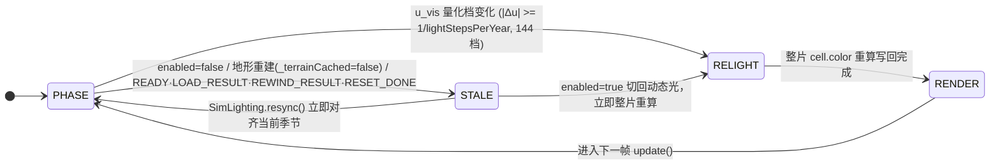

# 17. 动态季节光照（年周期光弧）设计方案

> **状态**：★ **P0–P3 已实现（v1.48.0）**——光相引擎、地形重着色、立体面光照、世界空间阴影、天空氛围、开关与调试读数全部落地；P4（水面镜面高光 / 浅色主题联动微调）仍未实施。口径 4 项决策已确认：年周期光弧 / 四季正方向（春东·夏南·秋西·冬北）/ 冬夏亮度拉开（0.90 / 1.08）/ 默认开启。
> **整理日期**：2026-09-09（按 v1.47.11 代码现状逐函数核对）；2026-09-09 落地为 v1.48.0，实现细节以代码与 `frontend/AGENTS.md` §5.10 为准。
> **范围**：太阳方位/高度角、光照强度与环境项、光色温、阴影方向与长度、天空氛围；**不含**地表反照率（草色/枯黄/积雪）与素材。
> **入口**：[文档导航](../../README.md) · [四季与热力学现状](./15-seasons-climate.md) · [地形美术规划](../../plan/tech/07-terrain-art.md) · [前端现状](./16-frontend-overview.md)。

---

## 状态机

动态季节光照的单帧生效状态迁移：光相推进（含限速器）→ 光档变化触发整片重着色 → 地形读取 `cell.color` 生效，并在开关/读档/重置时失效重算。



| 状态 | 含义 | 进入条件 | 退出条件 |
| :--- | :--- | :--- | :--- |
| PHASE | 光相推进：`update()` 按限速器推进 `u_vis`，`phaseFromSnapshot` 派生 β/e/L/tint | 渲染循环启动（`enabled=true`） | 量化档变化 / 失效事件 |
| RELIGHT | 地形重着色：`relightTerrain` 原地写回 `cell.color`（每趟清空调色板 Map） | `u` 量化档变化 | `cell.color` 整片写回完成 |
| RENDER | 生效呈现：`drawTerrain`/`shadeFace` 读取 `cell.color` 与面光照 | 重着色完成 | 下一帧 `update()` |
| STALE | 失效待重算：开关/地形重建/读档重置触发 | 上述失效事件 | `resync()` 对齐 / 切回动态光 |

**不变量**（违反即出 bug）：
- 零内核改动：光照为纯表现层，不消耗 `WorldRng`、不写模拟状态、不进存档；限速器依赖真实帧时间，不参与逐字节确定性承诺。
- 季节唯一真相源：光相只消费 `season`/`season_progress`/`season_timer`/`temperature`，严禁前端另建计时器或按 `Date.now()` 推季节。
- 图层铁律：天空背景与大气色洗只落在 §4-L4 两个固定插入点；阴影是贴地图元；立体实体仍走 `drawWorldEntities()` 统一深度队列。

## 1. 口径确认：什么叫“运动周期频率与四季一致”

### 1.1 一句话定义

**光源绕世界一周的时间 = 一个四季年轮（`seasonYearLength`）**，四季各占光弧的一个象限。光不是昼夜往复，而是**一年转一圈**：春从东、夏自南、秋由西、冬起北，高度角在盛夏最高、隆冬最低。

| 口径 | 含义 | 是否本方案 |
|---|---|---|
| **年周期光弧（本方案）** | 光向一年扫过 360°，周期 = 四季周期，无昼夜 | ✅ |
| 季节跳变 | 每季换一次光向，季内静止 | ✗（会丢“运动”） |
| 昼夜 + 年调制 | 光在一“日”内东升西落，年周期再调制高度/时长 | ✗（见 §1.3） |

内核的“一年”已经是 240 模拟秒（`seasonYearLength`），因此本方案的周期**直接复用既有季节时钟，不新增任何时间基准**——这正是“周期频率与四季一致”的工程含义。

### 1.2 为什么不自己做一套时间

`./15-seasons-climate.md` 已确立「`season_year_length` 是唯一时间基准，单季长度自动派生，不得引入独立季度长度配置」。光照若自建日/季时钟，就会出现“画布上的季节”与“气温、供暖、浆果霜冻所依据的季节”两套事实——直接违反该不变量。本方案把光相定义成季节时钟的**纯函数**，不存在独立相位。

### 1.3 如果日后要昼夜（变体口径）

当前内核**没有“日”这一层**（无日钟、无昼夜行为）。若将来要昼夜，必须先在 `SimConfig` 增加日长字段并进存档，属另一条技术路线。本方案为此预留的唯一接口是 §4.1 的**相位函数 `phaseFromSnapshot()`**：把昼夜叠上去只需改这一个函数，§5 的全部渲染层不动。**本期不实现。**

---

## 2. 现状事实（代码级核对）

### 2.1 现有光照实现清单

| 位置 | 现状 | 对“运动光照”的阻碍 |
|---|---|---|
| `math.js::computeElevationColor` L57–66 | 硬编码 `L = normalize(-0.45,-0.60,0.66)`（**西北 41°**，见 §4.2 轴向约定），`k = clamp((0.54+0.46·N·L)·ao, 0.52, 1.22)` | 光向是常量，无法运动 |
| `rustworld.js::_applySnapshot` L606 | 地形建缓存时**一次性**算好 `cell.color` 字符串 | 颜色永久冻结，光变后不重算即无效果 |
| `render_world.js::drawTerrain` L55–108 | 沙盘四向侧壁四组固定色（注释写“根据太阳方位计算冷暖明暗”，实为静态） | 不随光向 |
| `render_world.js::drawHouse` L432–489 | 墙面/屋顶四组固定色（左暗右亮） | 面朝向不参与受光 |
| `render_world.js::drawHouse` L419–425 | 落影固定屏幕偏移 `(+1.4,+2.1)·zoom` | 方向不随光向，**也不随相机旋转**（`rotZ` 转了阴影不转） |
| `render_agents.js::drawAgent` L99–102 | 族人落影固定偏移 `(+0.8,+1.8)·zoom` | 同上 |
| `render_world.js::drawPoiGroundBase` L263–287 | POI 底座固定偏移阴影 | 同上 |
| `render_hud.js::updateTopBarStats` L172–174 | 顶栏季节/气温（**画布外唯一消费季节的地方**） | 画布完全不消费季节事实 |

**结论**：现有光照是一组互不相干的常量。所谓“运动光照”不是调参，而是把“一个光向量”贯到地形、侧壁、建筑面、阴影四条链路。

### 2.2 可直接复用的季节事实

| 事实 | 出处 | 状态 |
|---|---|---|
| `season`（Spring/Summer/Autumn/Winter） | 快照 `snap.season` | ✅ `rustworld.js:548` 已映射 |
| `season_timer`（绝对模拟秒） | 快照 `snap.season_timer` | ✅ `rustworld.js:550` 已映射 |
| `season_progress`（当前季节内进度 0..1） | 快照 `snap.season_progress` | ⚠️ **FABS `encode.rs:57` 与 JSON `world_snapshot.rs:759` 均已下发，`snapshot-bin.js:177` 已解码，但 `rustworld.js::_applySnapshot` 未映射** |
| `temperature`（含厄尔尼诺 7 年 + 纪元候波 49 年） | 快照 `snap.temperature` | ✅ `rustworld.js:549` 已映射 |
| 地形法线来源 `dzdx/dzdy` | `rustworld.js:604` 逐格差分 | ✅ 已算，但只用于一次性着色 |

**关键结论：本方案可以做到零 Rust / 零 WASM / 零快照 / 零存档改动。** 唯一缺口是 `rustworld.js` 补一行 `this.seasonProgress = snap.season_progress ?? 0`（§5 L0-1）。这也意味着**不触发 `SAVE_FORMAT_VERSION` 变更**，旧档不作废（但见 §9 的版本号连带影响）。

---

## 3. 光相模型（核心）

### 3.1 轴向约定（从代码实证，勿凭直觉）

`render_world.js::drawTerrain` L55–108 的侧壁注释给出了世界轴向：

- `gx = 0`（`wx = -half`）被命名为**西**侧壁 ⇒ **+x = 东，-x = 西**
- `gy = 0`（`wy = -half`）被命名为**北**侧壁 ⇒ **+y = 南，-y = 北**（世界 +y 在屏幕上向下）
- `z` 向上，高程越大越亮。

罗盘方位角 β 自北起顺时针：北 = `(0,-1)`，东 = `(1,0)`，南 = `(0,1)`，西 = `(-1,0)`。

### 3.2 年度相位 u ∈ [0,1)

优先只用快照字段推导（不依赖前端配置里的年长，避免存档配置与 `SIM_CONFIG` 不一致时相位漂移）：

```
seasonIdx  = {Spring:0, Summer:1, Autumn:2, Winter:3}
u = wrap01( (seasonIdx - 0.5 + seasonProgress) / 4 )
```

与内核分箱自洽（`world_season.rs`：`season_idx = ((season_time + q/2) / q) % 4`，q = 年/4）：

- `season_timer = 0` ⇒ Spring、`seasonProgress = 0.5` ⇒ **u = 0**（年首）；
- 夏季分箱起点（`season_time = 0.5q`）⇒ u = 0.125；**夏季分箱中心（`season_time = q`）⇒ u = 0.25**，正是 `temperature = mid + A·sin(2πu)` 的峰值（盛夏）。

因此“**季节标签中心 = 光照极值**”自动成立，无需额外对齐参数。缺 `seasonProgress` 时回退 `u = wrap01(seasonTimer / seasonYearLength)` 作为交叉校验。

### 3.3 光向量

```
β(u)   = 360°·u + 45°                                  // 罗盘方位（顺时针自北）
e(u)   = elevMid + elevAmp · sin(2π·u)                 // 高度角
L(u)   = ( cos e · sin β,  -cos e · cos β,  sin e )    // 单位向量，指向光源
```

- `elevMid` 默认 47°、`elevAmp` 默认 25° ⇒ 盛夏 72°、隆冬 22°。
- 校验：`u = 0.125` ⇒ β = 90° = **东**；`u = 0.375` ⇒ 180° = **南**；`u = 0.625` ⇒ 270° = **西**；`u = 0.875` ⇒ 0°/360° = **北**。

| 季节 | u 区间 | 中心 u | 方位 β | 光来自 | 高度角（中心） | 阴影朝向 | 光色 | 强度 |
|---|---|---|---|---|---|---|---|---|
| 🌸 春 | 0.00–0.25 | 0.125 | 90° | 东 | 64.7° | 向西 | 清新偏青 | 1.00 |
| ☀️ 夏 | 0.25–0.50 | 0.375 | 180° | 南 | **72.0°（最高）** | 向北（最短） | 暖白偏黄 | 1.08 |
| 🍂 秋 | 0.50–0.75 | 0.625 | 270° | 西 | 29.3° | 向东 | 琥珀 | 1.02 |
| ❄️ 冬 | 0.75–1.00 | 0.875 | 0° | 北 | **22.0°（最低）** | 向南（最长） | 冷蓝 | 0.90 |

> 现有静态光 `(-0.45,-0.60,0.66)` 换算为 β ≈ 323°（**西北**）、e ≈ 41.3°，正落在本方案年弧的“秋末”段上——所以默认观感不会突变，只是从冻结变成缓慢扫过。

### 3.4 强度、环境项与环绕光

沿用现有量级做连续性锚点（现有 `0.54 + 0.46·diffuse`）：

```
N        = normalize(-dzdx, -dzdy, 1)                  // 地形法线
dot      = clamp(N · L, -1, 1)
wrapDot  = max(0, (dot + wrap) / (1 + wrap))            // 半兰伯特：背光面不至纯黑
ambient  = ambientBase + ambientElevGain · sin(e)       // 高日头 → 环境项更高、对比更平
k        = clamp( (ambient + (1-ambient)·wrapDot) · ao · intensity , lightMin , lightMax )
```

默认 `ambientBase 0.40`、`ambientElevGain 0.18`、`wrap 0.35`、`lightMin 0.45`、`lightMax 1.30`。在 e = 41° 时 `ambient ≈ 0.52`，与现有 `0.54` 几乎重合——**这是“换模型不换观感”的验收锚点**。

### 3.5 色温与宏观气候调制

光色温按 u 在四季四键间**连续插值**（不是按 `season` 硬切，避免季界跳变）：

| 键 | 乘子 (R,G,B) |
|---|---|
| 春 | (1.00, 1.02, 0.99) |
| 夏 | (1.06, 1.02, 0.90) |
| 秋 | (1.10, 0.99, 0.86) |
| 冬 | (0.94, 0.99, 1.08) |

再叠一层宏观气候微调（消费已有 `sim.temperature`，因此厄尔尼诺 7 年与纪元候波 49 年会带来肉眼可辨的“偏暖/偏冷”光色年代）：

```
dT = clamp((temperature - tempBaseMid) / tempAmplitude, -1, 1)   // 已有快照事实
tint *= (1 + tempTintPerDeg · dT) 逐通道（默认 0.03/℃ 归一化）
```

**边界**：这里只调“光”，不调地表反照率（草绿/枯黄/积雪属 `../../plan/tech/07-terrain-art.md` S1-4，任务编号 TA-13，见其 §5.2 与 §6.3）。

### 3.6 阴影向量（世界空间，不是屏幕空间）

```
shadowLen   = clamp(1 / tan(e), lenMin, lenMax)        // 默认 0.35 .. 2.4
shadowDir   = -normalize(L.xy)                         // 背光方向（世界 xy）
worldDelta  = shadowDir · shadowLen · objectHeight
screenDelta = ( (dx·cosZ - dy·sinZ)·zoom , (dx·sinZ + dy·cosZ)·cosX·zoom )
```

最后一步与 `project3D`（`main.js:85`）的线性部分一致，因此**阴影会随相机 `rotZ/rotX` 一起旋转**——顺手修掉现有“相机转了阴影不转”的缺陷。冬夏阴影长度比约 2.4 : 0.35 ≈ 7 倍，是仅次于天空氛围的季节可读性来源。

### 3.7 视觉相位限速器与对齐规则

`u` 的推进速度与倍速成正比（1x 时 1.5°/s，512x 时约 768°/s）。直接跟随会在高倍速下变成频闪。规则：

```
du      = shortestTurn(u_target - u_vis)      // 归一到 (-0.5, 0.5]
maxStep = rateCapDegPerSec / 360 · dtReal     // 默认 90°/s ⇒ 最快 4 秒一圈
u_vis  += clamp(du, -maxStep, +maxStep)
if |du| > 0.5 圈 → u_vis = u_target            // 半年以上跳变直接对齐
```

- **≤ 60x 倍速**：仿真角速度 ≤ 90°/s，限速器不介入，光相与季节**严格同相**。
- **> 60x**：光相按 90°/s 匀速转动，相位误差累积到半圈时自动重对齐——观感是“舒缓旋转 + 偶尔归位”，不会频闪。
- **暂停**：`u_target` 不变 ⇒ 光自动冻结。
- **读档 / 重置 / 时光倒流**：时间可能倒退，限速器会“倒着走”。因此在这三处**立即 `resync()`**（§5 L0-3），不做平滑。

---

## 4. 渲染分层实施

### 4.1 L0 · 光相内核（新增 `frontend/js/lighting.js`，约 260 行）

| 编号 | 内容 | 落点 |
|---|---|---|
| L0-1 | `_applySnapshot` 补映射 `this.seasonProgress = snap.season_progress ?? 0` | `rustworld.js` L550 附近 |
| L0-2 | 模块 `window.SimLighting`：`phaseFromSnapshot(sim)`、`update(now, sim)`（限速器）、`L()`、`tint()`、`shadow()`、`relightTerrain()`、`shadeFace()`、`resync()`、`reset()` | 新文件，`math.js` 之后、渲染五件套之前加载 |
| L0-3 | 在 `READY / LOAD_RESULT / REWIND_RESULT / RESET_DONE` 四处（既有缓存清空点）追加 `SimLighting.resync()` | `rustworld.js` |
| L0-4 | 开关 `enabled=false` 时退化到现有固定光（`L = normalize(-0.45,-0.60,0.66)`，一次性着色），保证可一键回到旧观感做 A/B | `lighting.js` |

### 4.2 L1 · 地形重着色（可见性最高、性价比最高）

**改造 `math.js`**：把 `computeElevationColor` 拆成两半，保持单一着色入口：

1. `computeTerrainAlbedo(cell, minZ, maxZ) → {r,g,b}`：现有 L70–119 的**不含光**部分（水体色 / 高程插值 / 坡度平滑过渡），语义不变；
2. `applyLighting(albedo, k, tint) → 'rgb(...)'`：乘光与环境项；
3. `computeElevationColor(...)` 保留为二者组合（`main.js::getElevationColor` 兜底路径不受影响）。

**改造 `rustworld.js` 地形建缓存（L596–608）**：除现有 `dzdx/dzdy` 外，一次性预算并存下 typed array：

- `nx/ny/nz`（`Float32Array`，单位法线三分量，避免每次重着色做 `hypot` + 除法）
- `albR/albG/albB`（`Uint8Array`，无光反照率）
- `ao`（`Float32Array`，现有 L65 的坡度 AO）

**逐帧/分档重着色（`lighting.js::relightTerrain`）**：光相按量化档推进，档位变化时才整片重算并**原地写回 `cell.color`**：

```
k_i = clamp((ambient + (1-ambient)·wrapDot_i) · ao_i · intensity, lightMin, lightMax)
cell.color = palette.get(pack(alb_i · k_i · tint))   // 每趟清空的调色板 Map
```

**`drawTerrain` 一行都不用改**——它已经在读 `c00.color`。这是本方案最省事的一点。

**量化档**：`u` 量化到 `lightStepsPerYear`（默认 144 档 = 2.5°/档）。1x 下 0.6 次/秒重着色；即便 512x 且限速器打满（4 秒一圈），也只有 36 次/秒。**调色板 Map 每趟清空**：平原上大量“同反照率 + 同法线”的格子会命中同一键，实测键数远小于 14,400；趟内去重、趟间不累积，内存有界。

### 4.3 L2 · 立体实体面光照

给每个被绘制的多边形**显式指定世界法线**，再用 `shadeFace(baseColor, n, L, ambient)` 求色（结果按 `(baseColor, 量化 k)` 缓存，键数极小）：

| 实体 | 面 | 建议法线 | 备注 |
|---|---|---|---|
| 房屋 | 左墙 | `(-1, 0, 0)` | 现有左暗右亮 |
| 房屋 | 右墙 | `(0, 1, 0)` | 现有右亮 |
| 房屋 | 左坡屋顶 | `(-0.50, 0, 0.87)` | 屋顶受光是季节最直观的读点 |
| 房屋 | 右坡屋顶 | `(0.50, 0, 0.87)` | 同上 |
| 沙盘侧壁 | 北/南/东/西 | `(0,-1,0) / (0,1,0) / (1,0,0) / (-1,0,0)` | 取代 L55–108 四组固定色 |
| POI 底座 | 贴地圆盘 | `(0, 0, 1)` | 底座亮度随高度角 |
| 族人 | 人偶 | `(0, 0, 1)` | 只做轻微受光侧高光，不做硬阴影 |

**标定步骤（必须做）**：以上法线不保证与现有手绘配色一一对应。实现时先用**旧固定光**跑一遍，调整法线符号/分量，使 `shadeFace` 的输出与当前 `wallFront/wallSide/roofFront/roofSide` 观感最接近（允许 ±10% 亮度差），确认后再开动态光。这一步是“换模型不换观感”的落地手段。

### 4.4 L3 · 阴影

- `drawHouse` 落影椭圆：偏移改用 §3.6 的 `screenDelta`，长度随 `shadowLen` 缩放，透明度 `opacity = shadowOpacityBase + shadowOpacityGain·(1-sin e)`（低日头更浓）。
- `drawAgent` 落影、`drawPoiGroundBase` 底座阴影：同公式，按各自 `objectHeight` 取系数。
- 阴影是**贴地图元**，保持在 `drawWorldEntities()` 之前（`frontend/AGENTS.md` §5.9 的图层铁律），不得塞进实体深度队列。

### 4.5 L4 · 天空氛围与台缘

在 `render_canvas.js::render()` 的**两个固定插入点**做全局氛围（不得新增整层实体绘制）：

1. `drawTerrain()` **之前**：整幅天空/地平渐变背景（现有 `body` 背景是纯色 `#050a12`）。渐变主色随 u 走四季（春淡青、夏暖白、秋琥珀、冬冷蓝），最亮处位于**光源对侧**（逆光处发亮，像晨昏光晕）。
2. `drawLanes()` 之后、`drawWorldEntities()` **之前**：一层极淡的大气色洗（`rgba(tint, 0.04~0.08)`），把地形/路网/贴地图元统一到当季色调；**立体实体与文字保持干净**，不被洗灰。
3. 可选：整体暗角（vignette），冬季更重、夏季更轻。

### 4.6 L5 · 开关、读数与调试

- `index.html` 控制台（`.control-panel`，L788–819）新增一行：`☀️ 动态季节光照` 复选框 `#chk-dynamic-light`（默认开）；
- 同面板新增读数 `#stat-sun`：`☀️ 东南 · 64°`（方位 + 高度角），复用 `.mono-num`；
- `render_hud.js` 调试监视器新增 `#dbg-light-ms`（重着色耗时）与 `#dbg-light-phase`（u 与档位），供 §9 性能验收取证；
- `main.js` 绑定复选框（写 `SIM_LIGHTING.enabled` + 立即重着色）与可选快捷键 `L`（实现前先确认未占用）；
- `style.css` 按 v1.47.10 的浅色适配范式补 `body.theme-light` 规则。

---

## 5. 性能与缓存

### 5.1 成本账

| 项 | 频率 | 单次成本（估算） | 说明 |
|---|---|---|---|
| 地形整片重着色 | 光档变化时（1x：0.6 次/秒） | 14,400 格 ×（3 乘 + 2 加 + 1 查表）≈ 0.3–1.0 ms | 预存法线/反照率后无 `hypot`/`sqrt` |
| 调色板 Map | 每趟清空 | 键数 ≪ 14,400 | 平原同色去重 |
| 立体实体面光照 | 每帧 | 百级实体 × 4 面，≪ 0.1 ms | 结果按 (色, k 档) 缓存 |
| 天空/大气层 | 每帧 | 2 次全屏渐变 + 1 次全屏填充 | 固定 2 个插入点 |
| 限速器 | 每帧 | O(1) | — |

**预算**：新增渲染耗时 p95 增量 ≤ 3 ms；同设备仿真吞吐下降 ≤ 5%（对齐 `../../plan/tech/07-terrain-art.md` §11.3）。

### 5.2 缓存失效矩阵

| 触发 | 必须失效/重算 |
|---|---|
| 光档变化 | 地形 `cell.color` 整片重算 |
| `enabled` 切换 | 立即整片重算（切到固定光 = 一次性重算） |
| 地形重建（`_terrainCached = false`） | 既有路径已重建法线/反照率/`cell.color` |
| `READY / LOAD_RESULT / REWIND_RESULT / RESET_DONE` | 既有清缓存点 + `SimLighting.resync()` |
| 相机旋转/缩放 | **不重算**（阴影按 §3.6 每帧投影，颜色与相机无关） |
| 主题切换 | 只影响 UI 与可选氛围亮度 |

**内存上限**：新增 typed array 约 `14,400 × (3×4 + 3×1 + 1×4) ≈ 0.28 MiB`，调色板 Map 每趟清空，无累积。

---

## 6. 边界与不变量

1. **零内核改动**：不动 Rust、不动 WASM、不动快照字段、不动存档结构（`SAVE_FORMAT_VERSION` 保持 7）。唯一碰 Rust 的连带影响是版本号自增会改 `world_save.rs::SAVE_APP_VERSION`（§9）。
2. **确定性边界**：光照纯表现层，不消耗 `WorldRng`、不写模拟状态、不进存档；限速器依赖真实帧时间，因此**不参与**逐字节确定性承诺。`test-wasm.js` / `test-determinism.js` / `test-snapshot-bin.js` 必须保持全绿（它们不渲染）。
3. **季节唯一真相源**：光相只消费 `season / season_progress / season_timer / temperature`。**严禁**前端另建计时器或按 `Date.now()` 推季节。
4. **图层铁律**：天空背景与大气色洗只能落在 §4-L4 的两个固定插入点；阴影是贴地图元；立体实体仍走 `drawWorldEntities()` 统一深度队列（`frontend/AGENTS.md` §5.9）。
5. **不预告不存在的事实**：光照不得暗示内核没有的机制（无昼夜、无云雨、无洪水）。天色只表达“当季光照”，不表达降水。
6. **高频 DOM 红线**：新读数若写入高频重建容器，必须走内容快照缓存（根 `AGENTS.md` §4.15）。
7. **配置归属**：纯视觉参数放前端 `window.SIM_LIGHTING`，**不得**塞进 `SIM_CONFIG`（会与 `SimConfig` 字段集比对冲突）；影响模拟的参数才走 `SimConfig` 全链路。

---

## 7. 配置项（新增 `frontend/js/config.lighting.js`）

按 `config.poi-rates.js` 先例做**前端独立配置**（不注入 WASM、不并入 `SIM_CONFIG`）：

| 字段 | 默认 | 含义 |
|---|---|---|
| `enabled` | `true` | 动态光照总开关（false = 现有固定光） |
| `azimuthOffsetDeg` | `90` | β = 360°u + 该偏移；90° 使四季分箱中心落在四正方向 |
| `elevMinDeg` / `elevMaxDeg` | `22` / `72` | 隆冬 / 盛夏高度角 |
| `elevPhaseTurns` | `0.25` | 高度角峰值所在的 u（= 盛夏） |
| `ambientBase` / `ambientElevGain` | `0.40` / `0.18` | 环境项基线与随高度角增益 |
| `wrap` | `0.35` | 半兰伯特环绕宽度 |
| `lightMin` / `lightMax` | `0.45` / `1.30` | 光因子钳位 |
| `intensity` | `{spring:1.00, summer:1.08, autumn:1.02, winter:0.90}` | 季节强度 |
| `tint` | 见 §3.5 | 季节光色乘子 |
| `tempTintPerDeg` | `0.03` | 温度偏差 → 暖冷偏移 |
| `shadowLenMin/Max` | `0.35` / `2.4` | 阴影长度钳位（cot e） |
| `shadowOpacityBase/Gain` | `0.18` / `0.12` | 阴影浓度随低日头增强 |
| `lightStepsPerYear` | `144` | 光档数（2.5°/档） |
| `rateCapDegPerSec` | `90` | 视觉相位限速（4 秒/圈） |
| `respectLightTheme` | `true` | 浅色主题下减轻天空暗部 |

**门禁联动**：新文件须登记进 `index.html` 脚本序列、`frontend/AGENTS.md` 文件清单与加载顺序、`./31-code-map.md`（否则 `code-map-check.js` 报“实际有但文档未登记”）。`config-check.js` 无需改动（不并入 `SIM_CONFIG`）。

---

## 8. 文件改动清单

| 文件 | 改动 | 规模 |
|---|---|---|
| `frontend/js/config.lighting.js` | **新增**：`SIM_LIGHTING` 配置 | ~40 行 |
| `frontend/js/lighting.js` | **新增**：光相/限速器/重着色/面光照/阴影工具 | ~260 行 |
| `frontend/js/math.js` | 拆 `computeTerrainAlbedo` / `applyLighting`，保留 `computeElevationColor` 组合入口 | ±30 行 |
| `frontend/js/rustworld.js` | 地形建缓存时预算 `nx/ny/nz/alb/ao`；补 `seasonProgress` 映射；四处 `resync()` | ±40 行 |
| `frontend/js/render_canvas.js` | 两处氛围插入点 + 每帧 `SimLighting.update()` | ±25 行 |
| `frontend/js/render_world.js` | 侧壁/墙面/屋顶面光照、房屋落影改世界空间 | ±60 行 |
| `frontend/js/render_agents.js` | 族人落影 + 受光侧微高光 | ±15 行 |
| `frontend/js/render_hud.js` | `#dbg-light-ms` / `#dbg-light-phase` 读数 | ±15 行 |
| `frontend/index.html` | 脚本标签 + 开关行 + 读数 | ±6 行 |
| `frontend/style.css` | 新行浅色适配 | ±15 行 |
| `frontend/js/main.js` | 开关绑定 + 可选 `L` 键 | ±15 行 |
| 文档 | `frontend/AGENTS.md`（文件清单/加载顺序/DOM 契约）、`./16-frontend-overview.md`、`./31-code-map.md`、`./19-ui-implementation.md`、`../01-changelog.md`、`../../plan/tech/07-terrain-art.md`（S1-4 对接） | — |

水系绘制在 `render_terrain.js`（★ v1.50.23 装饰已迁出，约 365 行），装饰绘制在 `render_accents.js`（v1.50.23 TA-01 拆分）；但 `render_world.js` 现约 904 行、已超 800 行上限：本方案落地时**不得新增整层绘制**，新增光照相关笔迹优先放入既有对应文件并视情况继续拆分（`../../plan/tech/07-terrain-art.md` §6.7 列有渲染文件拆分计划）。

### 8.1 实施门禁

```powershell
node tools/frontend-check.js        # 全部 JS 文件语法（含新增 config.lighting.js / lighting.js）+ DOM ID
node tools/code-map-check.js        # 新文件已登记代码地图
node tools/config-check.js          # 未改 SIM_CONFIG，应保持 237 字段一致
node tools/bump-version.js --patch  # 前端行为变更 → 升版
node tools/bump-version.js --check  # 零漂移
node tools/doc-maintenance-check.js
node tools/cross-doc-check.js
# 版本号变更会改 world_save.rs::SAVE_APP_VERSION ⇒ 必须重编译 WASM 并同步双副本（根 AGENTS.md §4.1/§4.9）
cargo build -p sim_wasm --target wasm32-unknown-unknown --release
Copy-Item target\wasm32-unknown-unknown\release\sim_wasm.wasm frontend\rust\sim_wasm.wasm -Force
Copy-Item target\wasm32-unknown-unknown\release\sim_wasm.wasm frontend\sim_wasm.wasm -Force
node tools/test-wasm.js             # ALL_TESTS_DONE
node tools/test-snapshot-bin.js     # 快照未改，作为回归网
```

> ⚠️ 升版会让 `SAVE_APP_VERSION` 变化，按 v1.37.1 的设计**旧存档自动作废**——这是本项目既有规则，不是本方案引入的副作用（`./06-snapshot-and-save.md`）。

---

## 9. 验收标准

### 9.1 视觉

| 项 | 判据 |
|---|---|
| 四季光位 | 固定 seed / tick / 相机 / 窗口，各取四季中段截图：光来自东→南→西→北，阴影朝西→北→东→南，长度约 7 倍差 |
| 运动可感 | 1x 下 30 秒内阴影明显偏转（约 45°），无抖动、无跳变 |
| 观感不突变 | `enabled=false` 与 v1.47.11 截图逐像素近似（同相机同 tick）；`enabled=true` 在 u≈0.77（西北低日头）时与旧观感最接近 |
| 无频闪 | 512x / 1024x 连续观察 60 秒，光相平滑旋转、无高频闪烁 |
| 无残留 | 读档 / 重置 / 时光倒流后光相立即对齐当前季节，无“上一世界的光” |
| 阴影随相机 | 旋转相机后阴影方向跟随世界，不再固定在屏幕右下 |
| 图层正确 | 天空背景在地形下、大气色洗在实体下，立体实体遮挡关系仍按深度（无回归） |
| 浅色主题 | 浅色 UI 下天空不刺眼，新增控件可读 |

### 9.2 性能

- 同机器同负载，记录 `#dbg-light-ms` 与渲染 FPS：新增 p95 ≤ 3 ms，帧率不降档；
- 14,400 格整片重着色 p95 ≤ 1.5 ms（预存法线后）；
- 内存增量 ≤ 1 MiB（typed array + 每趟清空的调色板）。

### 9.3 门禁

§8 全部命令通过；`test-wasm` 输出 `ALL_TESTS_DONE`；`bump-version --check` 零漂移；文档体检与跨文档检查无新增问题。

---

## 10. 分期与工作量

| 阶段 | 内容 | 粗估 |
|---|---|---|
| **P0 最小可见** | L0 光相 + L1 地形重着色 + 开关 + 调试读数 | 0.5–1 人日 |
| **P1 立体受光** | L2 面光照（含法线标定）+ L3 阴影（世界空间） | 1 人日 |
| **P2 氛围** | L4 天空渐变 + 大气色洗 + 台缘侧壁 | 0.5 人日 |
| **P3 收尾** | 量化/调色板/限速器调优 + 性能取证 + 文档/changelog/升版 | 0.5 人日 |
| **P4 可选** | 水面镜面高光、浅色主题联动、`L` 快捷键 | 按需 |

合计约 3～4 人日。P0 结束即可评审“运动是否好看”，P1 结束即可评审“四季是否可辨”。

---

## 11. 与其它方案的关系

| 方案 | 边界 |
|---|---|
| [../../plan/tech/07-terrain-art.md](../../plan/tech/07-terrain-art.md) S1-4 / M3 | 该方案负责**地表反照率**（草绿→枯黄→积雪、纹理、素材）；本方案负责**光**（方向/强度/色温/阴影/氛围）。两侧**共用** `SimLighting.phase()` 与同一套 `cell.color` 失效机制，**严禁各自维护一套季节相位**。本方案先落地可让 S1-4 直接消费光相。 |
| [./15-seasons-climate.md](./15-seasons-climate.md) | 只提供季节/气温事实；本方案不新增时间基准、不修改 `tick_season`。 |
| [../../plan/tech/06-terrain-templates.md](../../plan/tech/06-terrain-templates.md) | 地表类别与法线来源不变；本方案只消费既有 `dzdx/dzdy`。 |
| [../../plan/tech/08-performance.md](../../plan/tech/08-performance.md) | 本方案的重着色成本需纳入其渲染侧基准；若未来网格分辨率提升，须重估 §4.1。 |
| [./16-frontend-overview.md](./16-frontend-overview.md) | 渲染管线新增两个氛围插入点，需同步文档（不动实体深度队列）。 |

---

## 12. 待确认决策点

1. **口径**：确认采用 §1.1 的“年周期光弧”（一年一圈、四季四象限）。若要昼夜+年调制，需先在内核引入“日”，属另一条路线。
2. ✅ **方位锚定**（已确认）：春=东 / 夏=南 / 秋=西 / 冬=北，实现为 `azimuthOffsetDeg = 90`（季分箱中心 u = 0/0.25/0.5/0.75 恰落在四正方向）。若希望四季落在四隅（春=东南…），改该偏移即可。
3. ✅ **强度对比**（已确认）：隆冬光弱、盛夏光强（0.90 / 1.08）。若偏好“四季亮度基本一致、只变方向与色温”，把 `intensity` 四季键都设为 1.00。
4. ✅ **默认开关**（已确认）：默认开启（`SIM_LIGHTING.enabled = true`）。
