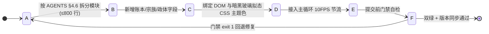
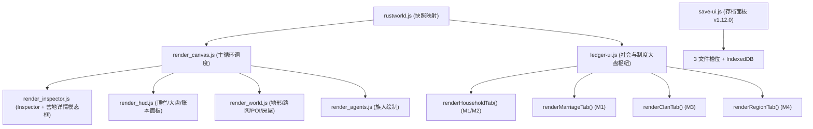
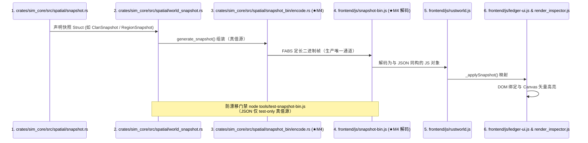
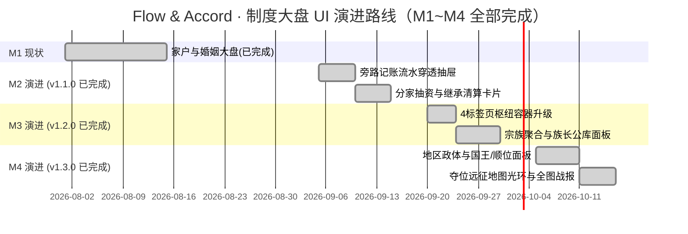

# 21. 🛠️ 前端开发实施指南 (`frontend`)

> **模块索引**：[← 返回 ../README.md 全景索引](../README.md) · 适用范围：新增前端 UI / 社会制度界面开发
> **关联文档**：[./16-frontend-overview.md](./16-frontend-overview.md)（模块总览）· [./19-ui-implementation.md](./19-ui-implementation.md)（UI 页面全景剖析）· [./20-society-ledger-ui.md](./20-society-ledger-ui.md)（制度大盘界面实现）
> **定位**：记录 M1~M4 制度大盘前端界面的落地过程与规范，为后续新增社会制度 UI（M5+ 专利经济、M6 六维政体等）提供可复用的模块化分工、快照同步清单与性能硬约束。

---

## 状态机

新增社会制度 UI 的交付从「模块化拆分 → 快照四处同步 → 设计系统合规 → 性能节流 → 验收门禁」流转；门禁失败回退修复。



| 状态 | 含义 | 进入条件 | 退出条件 |
| :--- | :--- | :--- | :--- |
| A 需求落地 | 新增 M5+ 社会制度 UI 任务 | 需求提出 | 模块拆分完成 |
| B 模块化拆分 | 按 `render_*` / `ledger-ui.js` / `save-ui.js` 分工，单文件 ≤800 行 | AGENTS §4.6 | 字段需同步 |
| C 快照四处同步 | `snapshot.rs→world_snapshot.rs→encode.rs(FABS)→snapshot-bin.js→rustworld.js→UI` 六点一致 | 新增快照字段 | 设计绑定 |
| D 设计系统合规 | 暗黑赛博玻璃拟态 + `.lineage-chip`(data-agent-id) 主题色 | DOM 绑定 | 性能节流接入 |
| E 性能节流校验 | 10FPS 节流 / `.minimized` 跳过 / 内容快照缓存防 click 吞事件 | 主循环接入 | 门禁自检 |
| F 验收门禁 | `config-check` + `test-wasm` + 双副本 + 版本同步四检 | 提交前 | 双绿通过/失败回退 |

**不变量**（违反即出 bug）：
- 单文件严控 800 行以内（根 AGENTS.md §4.6），前端已完成 render.js 五文件与 ledger-ui.js 抽离。
- 新增任何账本/宗族/政体字段必须四处同步（snapshot.rs / world_snapshot.rs / encode.rs / snapshot-bin.js / rustworld.js / UI）。
- 交付门禁须 `config-check` + `test-wasm` + WASM 双副本同步 + 版本号同步四检全过方可提交。

## 1. 前端架构扩展与模块化分工

根据 **AGENTS.md §4.6「单文件严控在 800 行以内」** 的规范，前端已完成两轮拆分：

### 1.1 第一轮：render.js 五文件拆分（v1.7.1）
原 `render.js`（2128 行）拆分为：
- `render_canvas.js`：共享状态 + 主循环调度
- `render_hud.js`：顶栏/调试/资源大盘/均值大盘/账本面板
- `render_world.js`：地形/路网/POI/房屋绘制
- `render_agents.js`：族人绘制 + 登基礼花
- `render_inspector.js`：Inspector 面板 + 点击拾取 + 营地详情模态框

### 1.2 第三轮：地形渲染独立 + D-A 装饰系统（★ v1.48.0 / ★ v1.49.1）
- `render_terrain.js` 从 `render_world.js` 拆出：独立承载地形网格 / 水系地貌特征 (`drawTerrainFeatures`) / 装饰单实体绘制 (`drawAccentEntity`，★ v1.50.2 起由整层 `drawAccents()` 改写并迁出 `drawTerrain()`，改挂 `drawWorldEntities()` 深度队列) / 天空大气环境光`SimLighting` 三角；
- D-A 装饰系统（v1.49.1）扩展了四处同步清单：新增 `TerrainAccent`（`snapshot.rs`）、FABS Section `TerrainAccents=21`（`layout.rs` + `encode.rs`）、前端解码（`snapshot-bin.js`）、`rustworld.js` `_applySnapshot` 映射 `sim.terrain.accents`；
- **TA-02 连续季相**：`accent-season.js` 定义唯一生产者 `SimTreeTint.sample(accent, sim, profile?)`，默认按 Tree/Bush 选落叶乔木/灌木，显式支持 `evergreen` / `floweringBush`。输出 `leafDensity`、浮点 RGB `leafColor`、`budAmount`、`flowerAmount`、`litterAmount` 及兼容枯荣系数。`tint()` 和 `brownness()` 复用新曲线，不再维护旧年历。
- **时钟与连续性**：只读快照季节及进度（缺字段回退 seasonTimer），春中心 0、初春 0.875；周期 smoothstep 跨年连续。kind/id 哈希偏移默认 ±0.025 年、硬限幅 ±0.04，盛夏满叶、隆冬落叶乔木 3% / 灌木 4%，常绿全年至少 94%；先秋色后减叶。叶色与叶量不读取平滑光相，光源仍归 `SimLighting`。
- **配置与消费**：`config.render.js::accentSeasonProfiles` 行格式 `[u, 叶量, RGB, 芽量, 花量, 地被量, 枯荣]`，`accentFlowerCycle` 仅为显式花灌木覆写花量。当前 Tree/Bush 精灵只消费连续叶色（绘制侧派生明暗），其余输出预留 TA-03/15；裸枝、逐簇落叶与花/地被绘制尚未实现，物种分配属于 TA-06。
- **恢复与缓存**：季相纯函数无逐帧累积和颜色缓存；几何缓存不含季相，暂停、读档、回溯与重置直接根据新快照求值，不消耗模拟 RNG、不改存档或 FABS。
- v1.49.1 同时移除了 Pass 1 的 `RiverBank` 手绘金砂漫滩线；v1.50.3~v1.50.5 连续降噪后水系只剩「水面（Pass 2 + 2.8 波光）+ 水下游鱼（Pass 1.5）+ 浅滩涉渡（Pass 4）」，河床基底、卵石、岸线白沫与微波虚线全部移除。

### 1.3 第四轮：制度大盘抽离 ledger-ui.js（v1.3.0）
新建 `frontend/js/ledger-ui.js`，将社会制度与账本大盘 UI 从渲染层抽离：



- **`frontend/js/ledger-ui.js` 职责**：管理 4 标签页切换、渲染家户/婚姻/宗族/王国面板、流水穿透抽屉、地图夺位特效；
- **`frontend/js/save-ui.js` 职责（v1.12.0 重写）**：3 固定文件槽位管理、IndexedDB 句柄持久化、自动保存、浏览器兼容性检测；
- **`index.html`** 按依赖顺序加载全部脚本（决策三件套须早于 rustworld.js）；**`style.css`** 扩展暗黑赛博玻璃拟态样式。

---

## 2. 快照四处同步规范清单 (★ M4 起 · Rust -> Snapshot -> FABS -> JS -> UI)

新增任何账本、宗族或政体字段时，**必须且只能严格按照四处同步规范**（根 AGENTS.md §4.5）：



### 2.1 M2~M4 快照结构体（已落地，与 `snapshot.rs` 实际定义一致）

> 以下为当前实际落地的快照结构（注意：`TransferRecordSnapshot.from/to` 为字符串化主体标识，非整数；`ClanSnapshot` 用 `member_ids` 而非家户 ID 列表；`RegionSnapshot.history_kings` 自 v1.12.0 起为 `HistoryKingSnapshot` 对象数组）。完整字段见 [./07-ledger-and-polity.md](./07-ledger-and-polity.md)。

#### 2.1.1 M2 账本流水快照 (`TransferRecordSnapshot`)
```rust
// snapshot.rs
#[derive(Debug, Clone, Serialize, Deserialize)]
pub struct TransferRecordSnapshot {
    pub tick: u64,
    pub resource: String,   // "Water" / "Food" / "Wood" / "Stone" / "Gold"
    pub amount: f32,
    pub from: String,       // 付出方主体（字符串化，如 Personal(3) / Family(2) / Clan("姬") / Region(1)）
    pub to: String,         // 接收方主体（字符串化）
    pub reason: String,     // "Deposit" / "Consume" / "Split" / "Inheritance" 等
}
```

#### 2.1.2 M3 宗族快照 (`ClanSnapshot`)
```rust
// snapshot.rs
#[derive(Debug, Clone, Serialize, Deserialize)]
pub struct ClanSnapshot {
    pub surname: String,
    pub leader_id: Option<AgentId>,  // None = 无主账本冻结
    pub member_count: u32,
    pub member_ids: Vec<AgentId>,
    pub balances: Vec<LedgerBalanceSnapshot>,
    pub recent_journal: Vec<TransferRecordSnapshot>,
    pub recent_events: Vec<String>,
}
```

#### 2.1.3 M4 地区/政体快照 (`RegionSnapshot`，v1.12.0 更新)
```rust
// snapshot.rs
#[derive(Debug, Clone, Serialize, Deserialize)]
pub struct RegionSnapshot {
    pub camp_id: u32,
    pub camp_name: String,
    pub king_id: Option<AgentId>,
    pub regime: String,            // "Kingdom"
    pub succession: String,        // "Primogeniture"
    pub member_count: u32,
    pub member_ids: Vec<AgentId>,         // v1.9.0 成员列表
    pub arrival_order: Vec<AgentId>,       // 到达时序前10
    pub heir_candidates: Vec<AgentId>,     // 顺位前3继承人
    pub governed_households: Vec<u32>,     // v1.9.0 管辖家户 ID 列表
    pub history_kings: Vec<HistoryKingSnapshot>, // v1.12.0 历史国王（含在位时长+死因）
    pub current_reign_start: Option<u64>,  // v1.12.0 现任国王登基 tick
    pub balances: Vec<LedgerBalanceSnapshot>,
    pub recent_journal: Vec<TransferRecordSnapshot>,
    pub recent_events: Vec<String>,
    pub active_expedition_agents: Vec<AgentId>, // 正在冲向该营地夺位的族人
}

/// v1.12.0 历史国王快照
#[derive(Debug, Clone, Serialize, Deserialize)]
pub struct HistoryKingSnapshot {
    pub agent_id: AgentId,
    pub reign_start_tick: u64,
    pub reign_end_tick: u64,
    pub death_cause: Option<String>,  // None = 退位/被废黜
}
```

---

## 3. CSS 设计系统与组件库规范

所有新 UI 组件必须使用项目现有的暗黑赛博玻璃拟态（Dark Glassmorphism）设计语言，严禁引入未经定义的亮色大底色。

### 3.1 配色规范
- **背景底色**：`rgba(10, 18, 30, 0.96)`；
- **边框与阴影**：`border: 1px solid rgba(255, 255, 255, 0.12); box-shadow: 0 8px 32px rgba(0, 0, 0, 0.6);`；
- **业务语义色彩**：
  - 🏠 家户主题：琥珀金 `#f59e0b` / `rgba(245, 158, 11, 0.2)`
  - 💍 婚姻主题：浪漫粉 `#ec4899` / `rgba(236, 72, 153, 0.2)`
  - 🛡️ 宗族主题：翡翠绿 `#10b981` / `rgba(16, 185, 129, 0.2)`
  - 👑 王权主题：皇家金 `#fbbf24` / `rgba(251, 191, 36, 0.2)`
  - 💧 水资源：`#38bdf8`
  - 🍒 粮食资源：`#10b981`
  - 🌲 木材资源：`#d97706`
  - 🪨 石料资源：`#94a3b8`
  - 🪙 黄金资源：`#fbbf24`

### 3.2 交互芯片 (`.lineage-chip` 体系)
任何出现族人 ID 的位置，必须包装为 `.lineage-chip`，绑定 `data-agent-id`：
- 支持鼠标悬浮高亮；
- 支持点击直接将主地图视口平移并选中该族人；
- 死亡族人自动附加 `.dead` 类，显示为灰暗删除线风格。

---

## 4. 性能与渲染节流硬约束

1. **DOM 更新必须降频节流**：
   - 制度大盘（Households/Clans/Regions）与顶栏一样，必须在 `render_canvas.js` 主循环中以 **10FPS（每 100ms 一次）** 节流更新，严禁随 30FPS Canvas 每帧操作 DOM。
2. **面板折叠状态跳过渲染**：
   - 当 `.ledger-panel` 处于 `.minimized` 折叠态时，除了更新标题栏的简单计数徽章外，**必须直接 return**，跳过内部复杂的 DOM 拼接与 Diff。
3. **列表虚拟化与截断保护**：
   - 超过 20 条的列表必须进行截断显示（如 `... 另有 X 户未展示`），或采用轻量级虚拟列表，避免几百代演化后 DOM 节点数突破数千导致浏览器掉帧卡死。
4. **确定性与零额外 RNG**：
   - 前端所有排序展示（如族长顺位、继承人顺位）必须与 Rust 内核确定性算法保持一致（如并列时按 ID 从小到大排序），禁止在 JS 端使用非稳定排序。
5. **高频 DOM 重建禁止破坏交互（★ v1.21.1 起内容快照缓存 · 根 AGENTS.md §4.15）**：
   - **症状与根因**：任何被高频（每帧 / 10FPS）`innerHTML = ...` 全量重建的容器，其内部可交互元素（`.lineage-chip`、按钮、卡片）会在 mousedown 与 mouseup 之间被替换成新节点，`click` 事件因此落到新旧节点的共同祖先上、`e.target.closest(...)` 落空——表现为「点击无反应 / 无法切换选中项 / 历史跳转失效」，且**控制台零报错**（handler 只是没被命中，并非抛异常）。
   - **唯一正确姿势**：高频刷新容器一律套**内容快照缓存**——生成 HTML 与上次一致即跳过 `innerHTML` 重建。先例：`ledger-ui.js::renderHtml`（v1.21.1）、`auction-ui.js::renderHtml`（v1.22.3）、`render_inspector.js` 的 `innerHTML !== html` 守卫。仅内容真正变化时才重建 DOM，`:hover`/`click` 才稳定。
   - **新增交互前的审计清单**：凡计划在「每帧 / 高频重建的容器」内放可点击元素（chip / 按钮 / 卡片），必须先确认该容器走快照缓存。**当前在红线内的容器**（每帧 innerHTML 重建且含 chip）：`render_hud.js` 的 `eventsList`、`insp-mg-history-list`、家户列表、婚姻列表——动它们前先套缓存。

---

## 5. 阶段性实施路线图与验收门禁



### 5.1 交付门禁（每次代码提交前必检）
1. **配置一致性校验**：`node tools/config-check.js` 必须 219 个超参字段完全匹配；
2. **WASM 与引擎确定性测试**：`node tools/test-wasm.js` 必须输出 `ALL_TESTS_DONE`（0 越界、0 NaN、同种子逐字节一致、存档读档确定性、版本不兼容拒绝）；
3. **WASM 双副本同步**：`frontend/rust/sim_wasm.wasm` 与 `frontend/sim_wasm.wasm` 必须同步更新；
4. **版本号自增与文档同步**：同步更新 `index.html`、`AGENTS.md`、`docs/current/01-changelog.md`、受影响的 `docs/current/0X-*.md`。

> ✅ M1~M4 界面已全部按此路线落地（`ledger-ui.js` 4 标签页枢纽 + Canvas 夺位特效），上述 gantt 中的任务均已 `done`。
