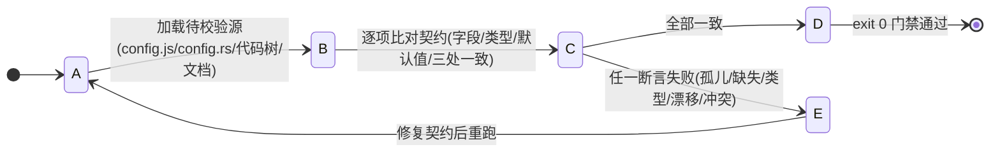

# 23. 🛠️ 仿真内核与工程工具箱操作指南 (tools/)

> **模块索引**：[← 返回 ../README.md 全景索引](../README.md)
> **工具定位**：`tools/` 目录下的 24 个工具脚本均为基于 Node.js 原生模块的**零依赖工具**，覆盖契约门禁、内核确定性测试、微秒级性能基准、无头仿真诊断、世系族谱数据生成与版本自动化治理。

---

## 状态机

契约/一致性门禁工具从「就绪 → 解析目标 → 执行校验」流转，最终以 exit 0 通过或 exit 1 失败收口，失败须修复契约重跑。



| 状态 | 含义 | 进入条件 | 退出条件 |
| :--- | :--- | :--- | :--- |
| A 就绪 | 门禁脚本待运行（如 `config-check`/`snapshot-check`/`cross-doc-check`/`frontend-check`） | 开发者或 CI 调用 `node tools/*.js` | 加载校验源 |
| B 解析目标 | 读取 `config.js`+`config.rs` 或代码树/`docs/` 指纹 | 脚本启动 | 进入比对 |
| C 执行校验 | 交叉比对字段名/类型/默认值/四处同步/文档事实指纹 | 源解析完 | 一致/失败 |
| D 通过 | 契约吻合，输出字段数或 `ALL_BIN_JSON_EQUAL` | 全部一致 | exit 0 收口 |
| E 失败 | 孤儿/缺失/类型错配/数值漂移/文档冲突，阻断发布 | 任一断言失败 | exit 1 退修复 |

**不变量**（违反即出 bug）：
- 门禁 exit 1 即阻断发布，须先修复契约再继续；纯文档变更不升版不跑测试（`doc-maintenance-check` 通过 + `--check` 零漂移）。
- 改动快照字段须同时跑 `snapshot-check.js` + `test-snapshot-bin.js`（★ M4 四处同步防漂移门禁）。
- `bump-version.js` 以 `index.html` 徽章为唯一真相源，改动代码必须升版，仅文档变更例外。

## 1. 📂 工具全景速查总表

| 序号 | 脚本文件 | 分类 | 核心定位与职责 | 典型运行命令 | 退出码契约 |
| :---: | :--- | :--- | :--- | :--- | :--- |
| 1 | **`config-check.js`** | 契约门禁 | 交叉校验 `config.js` 与 Rust `SimConfig` 字段/类型/默认值，自动生成速查表 | `node tools/config-check.js` | 0=通过, 1=字段/数值漂移 |
| 2 | **`snapshot-check.js`** | 契约门禁 | 校验快照在 `snapshot.rs`、`world_snapshot.rs` 与 `rustworld.js` 三处一致性 | `node tools/snapshot-check.js` | 0=通过, 1=三处不匹配 |
| 3 | **`frontend-check.js`** | 契约门禁 | 前端全部 JS 语法检查 + `getElementById` DOM ID 存在性双向校验 | `node tools/frontend-check.js` | 0=通过, 1=语法/ID缺失 |
| 4 | **`code-map-check.js`** | 契约门禁 | 实际文件树 vs `./31-code-map.md` 登记清单交叉比对，捕获文档与代码漂移 | `node tools/code-map-check.js` | 0=通过, 1=未登记/无效登记 |
| 5 | **`doc-maintenance-check.js`** | 契约门禁 | 依据 `docs/doc-maintenance.json` 检查各模块文档的新鲜度与复核周期 | `node tools/doc-maintenance-check.js` | 0=体检完成 (追加 `--strict` 时漂移报 1) |
| 6 | **`snapshot-reader.js`** | 工具公共模块 | ★ T1 的唯一快照访问入口：优先读取 FABS 并复用前端解码器；JSON 调试导出仅作为缺失二进制时的兼容降级 | 被 6 个快照工具 `require()` | 非独立 CLI |
| 7 | **`test-wasm.js`** | 内核测试 | Node 无头运行 WASM，验证确定性、长程稳定（防越界/防NaN）、存读档状态一致 | `node tools/test-wasm.js` | 0=通过, 1=失败抛出 |
| 8 | **`test-determinism.js`** | 内核测试 | **最高级确定性门禁**：验证 6 大数学定理（多种子/分批独立/快照只读/重放一致等） | `node tools/test-determinism.js` | 0=矩阵全通, 1=确定性分叉 |
| 9 | **`profile-benchmark.js`** | 性能分析 | 测算仿真吞吐量（TPS）、内核 8 大子阶段耗时占比与 ★ T1 后的 FABS 编码/解码；支持优化前后加速比对比、`--with-legacy-json` 调试对照、`--preset max-yield` 压力场景、`--set` 覆写与 `--pops` 自定义规模档位 | `node tools/profile-benchmark.js` | 0=完成采样 |
| 10 | **`diagnose.js`** | 诊断排障 | 确定性无头诊断，指定种子与 Tick 极速复现并嗅探死因、贫困、行为卡死 | `node tools/diagnose.js -s 42 -t 3000` | 0=完成诊断 |
| 11 | **`gold_mining_analysis.js`** | 专项分析 | 专门用于深入排查和追踪族人“为何不淘金/采金”的家户物资与马斯洛行为链路 | `node tools/gold_mining_analysis.js` | 0=完成分析 |
| 12 | **`gen-dag-testdata.js`** | 族谱工具 | 驱动内核跑满数十万 Tick 累积族人档案库，裁剪直系血脉生成 DAG 测试集 | `node tools/gen-dag-testdata.js` | 0=生成完成 |
| 13 | **`dag-shot.js`** | 族谱工具 | 加载前端真实的 `FlowDag` 算法，驱动无头 Chrome 多视角自动截取族谱图 | `node tools/dag-shot.js` | 0=完成截图 |
| 14 | **`bump-version.js`** | 版本治理 | 版本号升版与一致性对齐，同步更新 `index.html` 徽章与全部 8+ 处定义点 | `node tools/bump-version.js --patch` | 0=同步成功, 1=校验漂移 |
| 15 | **`rust-download.js`** | 环境构建 | 使用 Node 内置 OpenSSL TLS 下载便携 Rust 工具链（绕过系统证书异常） | `node tools/rust-download.js` | 0=下载完成 |
| 16 | **`vendor-deps.js`** | 环境构建 | 基于 crates.io API BFS 遍历根依赖与传递依赖，离线下载至 `.vendor/` | `node tools/vendor-deps.js` | 0=完成打包 |
| 17 | **`test-preemption.js`** | 行为矩阵 | ★ M19.4b 分级任务抢占验证：危机抢占、平滑中断、行囊保全、进度冻结五大场景 | `node tools/test-preemption.js` | 0=矩阵全通, 1=断言失败 |
| 18 | **`test-personalization.js`** | 行为矩阵 | ★ M19.4c 禀赋与家资个性化选策验证：力量/智力/家户财富三大分化维度五大场景 | `node tools/test-personalization.js` | 0=矩阵全通, 1=断言失败 |
| 19 | **`test-itinerary.js`** | 行为矩阵 | ★ M19.4d 多品类预排采收行程验证：链路生成 / TSP 最近邻排序 / 多站顺路推进 / 异常清空 / 多种子长程确定性 | `node tools/test-itinerary.js` | 0=矩阵全通, 1=断言失败 |
| 20 | **`gen-m19-baseline.js`** | 基线工具 | ★ M19.0 冻结基线生成：长程演化导出观察基线（`tools/baseline-m19-observation.json`） | `node tools/gen-m19-baseline.js` | 0=生成完成 |
| 21 | **`test-m19-differential.js`** | 行为矩阵 | ★ M19 差分回归：3600 tick 存档与快照哈希逐字节一致性（M19 基线回归） | `node tools/test-m19-differential.js` | 0=矩阵全通, 1=断言失败 |
| 22 | **`test-snapshot-bin.js`** | 契约门禁 | ★ M4 四处同步防漂移门禁：FABS 二进制帧 vs JSON 真值逐字段深比较（4 场景，含跨世界驻留表） | `node tools/test-snapshot-bin.js` | 0=全绿, 1=不一致 |
| 23 | **`cross-doc-check.js`** | 契约门禁 | 跨文档事实指纹一致性：同一事实在多篇文档值不同即冲突，配置字段另与 config.js / config.rs 权威比对 | `node tools/cross-doc-check.js` | 0=全部一致, 1=冲突/漂移 |
| 24 | **`test-dag.js`** | 族谱测试 | 直系血脉上下 5 代范围截断、闭合边拓扑、布局确定性与独立页导出自动化套件 | `node tools/test-dag.js` | 0=测试全通, 1=断言失败 |

---

## 2. 静态契约与一致性门禁工具

### 2.1 `config-check.js` · 前后端配置一致性校验
- **目标**：杜绝前端调参 `config.js` 与 Rust 确定性内核 `config.rs` 发生字段拼写漂移或数值错位。
- **工作机制**：
  1. 解析 `frontend/js/config.js`、`config.decision-order.js` 与 `config.house-upgrade-cost.js`；
  2. 正则解析 Rust `crates/sim_core/src/config.rs` 中的 `pub struct SimConfig` 字段与 `impl Default`；
  3. 逐项比对两端的字段名（camelCase ↔ snake_case）、数据类型（Number/Boolean/String）与默认初始值；
  4. 自动生成并覆写 `./05-config-reference.md` 权威参数速查表。
- **常用命令**：
  ```bash
  node tools/config-check.js
  ```

### 2.2 `snapshot-check.js` · 快照同步静态校验
- **目标**：静态核对快照链路（`AGENTS.md` §4.5）：
  1. `crates/sim_core/src/spatial/snapshot.rs`（结构体定义）
  2. `crates/sim_core/src/spatial/world_snapshot.rs`（Rust 数据赋值）
  3. `frontend/js/rustworld.js`（前端接收与映射）
- ⚠️ **★ M4 起真正的不变量是「四处同步」**：本工具只做静态登记核对；**二进制编码/解码是否漂移由
  `tools/test-snapshot-bin.js`（§3.x）把关**——它把 FABS 帧与 JSON 真值逐字段深比较（4 场景，含跨世界驻留表）。
  改动快照字段后**两者都要跑**。
- **常用命令**：
  ```bash
  node tools/snapshot-check.js
  node tools/test-snapshot-bin.js   # ★ M4 防漂移，必跑
  ```

### 2.3 `frontend-check.js` · 前端语法与 DOM 健全性门禁
- **目标**：在无需启动浏览器或加载界面的情况下，100% 静态验证前端脚本语法和 DOM 元素绑定安全。
- **检查内容**：
  1. 调用 `node --check` 严格解析 `frontend/js/` 下全部脚本语法；
  2. 提取 JS 中所有 `document.getElementById('xyz')`，并在 `frontend/index.html` 和 `dag.html` 中核验是否存在对应 ID 的元素。
- **常用命令**：
  ```bash
  node tools/frontend-check.js
  ```

### 2.4 `code-map-check.js` · 代码地图与文件树校验
- **目标**：防止项目不断迭代中新增或重构的文件未及时在文档中建立索引。
- **工作机制**：
  - 扫描项目全部实际源码与文档文件，比对 [`./31-code-map.md`](./31-code-map.md) 的登记清单，捕获“文件未登记”、“登记但已删除”以及 SimConfig 字段数关键词漂移。
- **常用命令**：
  ```bash
  node tools/code-map-check.js
  ```

### 2.5 `doc-maintenance-check.js` · 文档维护体检器
- **目标**：保障全库文档的时效性与责任边界。
- **常用命令**：
  ```bash
  node tools/doc-maintenance-check.js           # 日常只读体检
  node tools/doc-maintenance-check.js --strict  # CI/发版严格模式（源码领先或超期阻断）
  ```

### 2.6 `cross-doc-check.js` · 跨文档事实指纹一致性检查
- **目标**：机检「N 份文档两两之间没有冲突」——不做 O(N²) 全文比对，而是把可枚举事实（配置字段值 / 关键常量 / 结构数字）提取为指纹：
  1. **CONFLICT（文档 vs 文档）**：同一指纹键（如 `carryCapacityResource`、决策错峰相位 `% N == 0`、SimConfig 字段总数）在 ≥2 篇文档中值不同；
  2. **DRIFT（文档 vs 权威）**：配置字段值与 `frontend/js/config.js`、字段总数与 `config.rs`、工具数与 `tools/` 实际脚本数不一致（权威值运行时读取，不硬编码）。
- **扫描范围**：根 AGENTS.md + 各局部 AGENTS.md + `docs/` 全部 markdown；有意排除 `docs/archive/`、`../01-changelog.md`（历史记录）与 `*-plan-*` / `*-spec-*`（规划态）。
- **常用命令**：
  ```bash
  node tools/cross-doc-check.js            # 常规检查（冲突/漂移即退出码 1）
  node tools/cross-doc-check.js --json     # 结构化输出（CI / 仪表盘）
  ```
- **与 doc-maintenance-check.js 的分工**：后者管「文档 vs 源码」的时效与责任（时间戳 + 维护清单）；本工具管「文档 vs 文档」与「文档 vs 权威配置」的事实一致性。两者互补，发布前都跑。

---

## 3. 内核仿真测试与性能基准工具

### 3.1 `snapshot-reader.js` · FABS 统一快照读取器
- **目标**：让所有 Node 工具经同一条 FABS 解码链取得与旧 JSON 快照逐字段同构的对象，彻底消除工具侧双通道漂移。
- **约束**（v1.46.0 起）：**不提供**解码对象复用——对象池化经实测为负收益（快照对象全部短命，V8 新生代回收更划算，池化只会导致对象晋升老生代），故 `setReuse()` 已退化为**空操作**，工具侧与浏览器共用同一条「每帧全新对象」路径。用于字符串确定性比对时，读取器会先请求全量地形，避免增量帧导致假分叉。
- ⚠️ **跨世界缓存**：FABS 驻留表（`STR_TAB`）在前端解码器中**永久缓存**，判据是「`start_index == 0` 视为全新驻留表并清空缓存」——因为新世界 / 读档重建的 `epoch` 恒为 0，**不能**用 epoch 判断是否换世界。工具侧在 `world_load` / `world_create` 之后需显式调用 `reader.resetCaches()`。
- **使用方式**：
  ```js
  const { createSnapshotReader } = require('./snapshot-reader.js');
  const reader = createSnapshotReader(ex);
  const snapshot = reader.getSnapshot();
  ```

### 3.2 `test-wasm.js` · 基础回归与长程稳定性
- **目标**：轻量级快速回归，验证 WASM 二进制的基本运行质量。
- **核心断言**：
  - 种子一致性：同种子下推进 1000 步生成的快照逐字节相等；
  - 状态合法性：无 NaN、无无穷大、坐标防越界；
  - 存档重放一致性：`world_save` 导出后重新 `world_load` 继续推进，状态与不中断连续推进严格一致；
  - 版本门禁：篡改存档版本号后必须被拒绝加载并输出错误码。
- **常用命令**：
  ```bash
  node tools/test-wasm.js
  ```

### 3.3 `test-determinism.js` · 增强型确定性矩阵测试套件
- **目标**：项目的“终极大闸”。任何涉及算法、调度、数据结构改动必须全部通过。
- **六大定理门禁**：
  - **Suite 1 多种子基准**：Seed 42/1024/99999 分别推演，状态重放 100% 一致；
  - **Suite 2 分批独立性**：单步 1 tick 推进 600 拍 vs 批次 100 tick 推进 6 次，逐字节严格相等；
  - **Suite 3 子阶段等价性**：直接 `world_tick` 与逐个调用 8 个 `tick_subphase` 执行轨迹逐字节一致；
  - **Suite 4 快照无副作用**：频繁读取快照不污染内核后续演算；
  - **Suite 5 存读档重放**：中途导出存档并重新加载，推演轨迹完全重合；
  - **Suite 6 多人口长程压力**：高密度人口与数千 Tick 长程演化无漂移。
- **常用命令**：
  ```bash
  node tools/test-determinism.js
  ```

### 3.4 `test-snapshot-bin.js` · ★ M4 四处同步防漂移门禁
- **目标**：把 FABS 二进制帧与 JSON 快照（test-only 真值源）**逐字段深比较**，是「四处同步」唯一的自动网。
- **4 个场景**：`[1/4]` 创世帧（地形+路网全量）· `[2/4]` 稳态帧 + 增量帧（无地形/无路网几何，仅 LANE_WEAR）·
  `[3/4]` 存读档后帧 · `[4/4]` **换世界后**（★ v1.46.0：不调 `resetCaches()` 直接建第二个世界，验证跨世界驻留表缓存失效；
  回退该修复会报 129 处不一致）。
- **常用命令**：
  ```bash
  node tools/test-snapshot-bin.js      # 全绿输出 ALL_BIN_JSON_EQUAL
  ```

### 3.5 `profile-benchmark.js` · 性能 Profiling 与子阶段耗时剖析
- **目标**：微秒级精度度量内核性能，为优化提供量化基准。
- **核心功能**：
  - 测算总体 TPS 与单 Tick 耗时（µs）；
  - 输出 8 大子阶段（Phase 0~8）的单拍物理耗时与百分比条形图；
  - 测试 1x ~ 1024x 步长推进与人口规模扩展性（档位可用 `--pops` 自定义）；
  - 支持导出基准 JSON，并通过 `--compare` 生成优化前后的加速比对比表；
  - ★ **产速预设与逐字段覆写**：无需修改 `frontend/js/config.js` 即可构造极端场景，覆写清单会写入报告 JSON 的 `configOverrides` 字段保证可复现。
- **常用命令**：
  ```bash
  node tools/profile-benchmark.js                              # 默认基准
  node tools/profile-benchmark.js --ticks 6000 --breakdown     # 打印子阶段 ASCII 耗时条形图
  node tools/profile-benchmark.js --ticks 3000 --json base.json # 固化优化前基准
  node tools/profile-benchmark.js --ticks 3000 --compare base.json # 输出优化加速比

  # ★ 产速拉满（单 tick 饱和档）压力场景：POI/市场的产速、采收与卸货速率全部拉到
  #   「单 tick 内回满/装满一囊」，用于构造人口无约束增长的最坏负载画像
  node tools/profile-benchmark.js --preset max-yield --ticks 800000 \
       --breakdown --breakdown-warmup 700000 --breakdown-ticks 2000 \
       --snapshot-warmup 700000 --json tools/baseline-maxyield-800k.json

  # 逐字段覆写（可重复传参，亦可逗号分隔）；未知键或非数值会直接报错防手滑
  node tools/profile-benchmark.js --set regenBaseWater=100,regenBaseGold=50

  # 自定义规模档位，输出人效(µs/人)与超线性系数；用于定位超线性增长的阶段
  node tools/profile-benchmark.js --scale --pops 20,50,100,200,400 --scale-ticks 3000
  ```
- **⚠️ 已知修正**：`world_create` 的 `agent_count` 形参在内核中**并未被使用**（`seed_primitive_ecology(&mut self, _agent_count: usize)`），真实初始人口取自 `config.agentSpawnCount`。
  早期版本因此出现"400 人比 20 人还快"的假象（实为全部按 20 人跑）。现已修复：当 `--agents` / `--pops` 与 `agentSpawnCount` 不一致时，工具会自动同步写入配置。
  **引用 2026-09-07 之前的任何 `--scale` 结论前，必须重新测量。**
- **长尾延迟测量警示**：不要用 `process.hrtime.bigint()` 做逐 tick 计时——它在循环内产生 BigInt 垃圾，会自己制造 GC 尖峰，污染 Max 值。
  应改用 `performance.now()` + 预分配 `Float64Array` 的零分配探针。详见 `../../plan/tech/08-performance.md` §2.8 与 §6.1。

---

## 4. 无头仿真诊断与专项分析工具

### 4.1 `diagnose.js` · 确定性无头内核诊断与 Bug 嗅探
- **目标**：脱离前端界面与渲染，通过 Node.js 极速定位长程演化中的疑难 Bug。
- **常用参数**：
  - `--seed <N>`：随机种子（默认 42）；
  - `--tick <N>`：推进的目标 Tick 计数；
  - `--check <type>`：嗅探类型（`all` / `anomalies` / `starvation` / `deaths`）；
  - `--agent <id>`：针对特定族人追踪其近期行为与生理轨迹；
  - `--house <id>`：针对特定私宅追踪其耐久、仓储与出价记录；
  - `--trace-window <N>`：截止点前的高频轨迹采样窗口（默认 150 拍）；
  - `--export-json <file>` / `--export-report <file>`：导出数据或 Markdown 诊断报告。
- **常用示例**：
  ```bash
  node tools/diagnose.js --seed 42 --tick 3000 --check all
  node tools/diagnose.js --seed 1024 --tick 4500 --agent 5 --trace-window 200
  ```

### 4.2 `gold_mining_analysis.js` · 淘金与经济行为专项分析
- **目标**：专项诊断复杂社会经济模拟中的堵点（如“为什么族人不挖金矿/不盖高阶房屋”）。
- **分析内容**：
  - 逐户监控水/粮/木/石/金五类家户账本储备；
  - 检查家户补货施密特触发器（100 开启 / 200 关闭）的状态锁定；
  - 检查各族人当前马斯洛主导需求及决策顺序阻断情况。
- **常用命令**：
  ```bash
  node tools/gold_mining_analysis.js
  ```

---

## 5. 世系族谱与复杂图形调试工具

### 5.1 `gen-dag-testdata.js` · 族谱布局长程数据集生成器
- **目标**：族谱时间轴分层算法需要覆盖数千人、多代宗族的极端长程血缘关系。
- **工作机制**：
  - 驱动 WASM 内核运行数十万 Tick（默认 500,000 Tick）；
  - 周期性抓取快照并累积全部出生与死亡族人档案库；
  - 提取指定焦点人物的血脉子图并导出为 JSON，供前端布局参数拟合。
- **常用命令**：
  ```bash
  node tools/gen-dag-testdata.js --ticks=500000 --seed=2026 --out=/tmp/dag-lab
  ```

### 5.2 `dag-shot.js` · 族谱无头多视角批量截图工具
- **目标**：在不启动开发服务器的情况下，通过无头 Chrome 批量校验族谱 DAG 在不同缩放模式下的渲染效果。
- **常用命令**：
  ```bash
  node tools/dag-shot.js --foci=2,311 --modes=fit,focus,detail --size=1600x1000
  ```

### 5.3 `test-dag.js` · 族谱上下 5 代与布局确定性自动化测试套件
- **目标**：验证直系血脉族谱构建在上下 5 代范围内的严格截断、闭合连边以及确定性布局与独立页生成。
- **覆盖用例**：
  1. 单传线性链：以中心个体为焦点，验证向上精确截断至第 5 代祖先、向下截断至第 5 代后代，排除第 6 代亲缘；
  2. 多分支后代树：验证二叉后代树 5 代内分支全收录，第 6 代分支全排除；
  3. 双亲祖先网络：验证父系/母系 5 代内祖先全探查，第 6 代全排除；
  4. 边界容错：始祖/末代/孤儿/默认焦点回退平滑无报错；
  5. 连通性完整性：严禁出现跨越边界指向外部节点的悬空边；
  6. 反查子女索引：流产或清理后的子代能被反查并遵守 5 代限制；
  7. 布局确定性：验证无 NaN/Infinity，多次运算坐标逐像素完全确定；
  8. 独立页 HTML：验证导出的自包含 HTML 模板与数据一致。
- **常用命令**：
  ```bash
  node tools/test-dag.js
  ```

---

## 6. 版本治理与离线环境工具

### 6.1 `bump-version.js` · 版本号统一升版器
- **目标**：消灭版本号多处定义导致的不一致（唯一真相源为 `frontend/index.html` 徽章）。
- **自动同步站点**：
  1. `frontend/index.html` 徽章；
  2. `crates/sim_core/src/spatial/world_save.rs` 内的 `SAVE_APP_VERSION`（编译进 WASM 存档门禁）；
  3. `frontend/js/save-ui.js` 的 `DEFAULT_APP_VERSION`；
  4. `frontend/js/rustworld.js` 引擎版本兜底串；
  5. `frontend/js/sim_worker.js` Worker 版本兜底串；
  6. `AGENTS.md` 架构图与步骤；
  7. `../README.md` 与 `docs/current/01-changelog.md` 表头；
  8. `README.md` 对外徽章。
- **常用命令**：
  ```bash
  node tools/bump-version.js --check       # 门禁检查（有漂移返回 exit 1）
  node tools/bump-version.js --patch       # 自增补丁版本（如 1.44.7 → 1.44.8）
  node tools/bump-version.js --minor       # 自增次版本号（如 1.44.7 → 1.45.0）
  node tools/bump-version.js 1.45.0        # 指定目标版本
  ```

### 6.2 `rust-download.js` · 便携 Rust 工具链下载器
- **目标**：解决部分环境（如 Windows schannel TLS 证书受限）下 `rustup` 无法拉取工具链的问题，使用 Node 原生 TLS 稳定拉取官方工具链压缩包。

### 6.3 `vendor-deps.js` · Cargo 依赖离线打包工具
- **目标**：通过 crates.io REST API 执行广度优先搜索（BFS），解析并下载 `crates/sim_core` 与 `crates/sim_wasm` 所需的全部依赖 `.crate` 包至本地 `.vendor`，供纯内网或断网环境下离线编译。

---

## 7. 典型开发流组合速查

```bash
# 1. 改动前端 JS/CSS 后的快速自检：
node tools/frontend-check.js

# 2. 改动数值配置后的一致性检查：
node tools/config-check.js

# 3. 改动 Rust 内核后的完整回归门禁：
node tools/test-wasm.js
node tools/test-determinism.js

# 4. 代码提交前统一门禁：
node tools/bump-version.js --check
node tools/code-map-check.js
node tools/doc-maintenance-check.js
node tools/cross-doc-check.js        # 跨文档事实指纹（文档间冲突 / 配置权威漂移）

# 5. 决策行为改动（M19.4b/c/d）专项矩阵回归：
node tools/test-preemption.js        # 分级任务抢占
node tools/test-personalization.js   # 禀赋与家资个性化选策
node tools/test-itinerary.js         # 多品类预排采收行程
```

> **⚠️ 编写 M19.4 系列行为矩阵测试的通用前提**：这三个工具都通过「改存档 JSON → `world_load` → 推进到决策相位」构造场景，
> 构造「行囊已装满 / 家宅已备满」这类前置条件时，阈值必须从 `SIM_CONFIG` 读取（如 `carryCapacityResource`，当前 **100.0**），
> 严禁写死常量——写错会导致 Agent 在资源点原地采集、永远不进入目标代码路径，表现为难以定位的「功能没生效」假故障。
