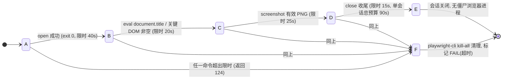

# 27. 浏览器自动化使用指南 (Browser Guide)

> 用于「打开页面 / 渲染校验 / 截图 / 自动化交互」。驱动工具为 playwright-cli，一套命令覆盖多浏览器引擎。
>
> 当前版本：v1.2.0 · 主环境：Windows（§1-5）· 补充：豆包工作云电脑 Ubuntu Linux（§6）· 补充：CatPaw 内置浏览器 macOS（§7）

---

## 状态机

本状态机描述「一次浏览器自动化任务」的生命周期：以独立命名会话打开页面，依次渲染校验与截图，最后收尾，全程受限时包装守护；任一环节超时（退出码 124）即进入超时处置，标记 FAIL(超时) 后继续下一任务，不阻塞整体流程。边界是防卡死与不留僵尸进程（§4 / §5）。



| 状态 | 含义 | 进入条件 | 退出条件 |
| :--- | :--- | :--- | :--- |
| A | 打开会话 | 启动独立命名会话 `-s=<name>` 并 open URL | open 返回 exit 0 |
| B | 渲染校验 | 页面已打开 | `document.title` / 关键 DOM 非空 |
| C | 截图 | 渲染校验通过 | 产出有效 PNG |
| D | 收尾 | 截图成功 | close 关闭会话，释放守护进程 |
| E | 完成 | 会话关闭且无残留 | 进入终态 |
| F | 超时处置 | 任一环节超时限时（返回 124） | kill-all 清理后继续下一任务 |

**不变量**（违反即出 bug）：
- `close` 必须在 finally 语义下执行（成功/失败/超时路径都要收尾），否则留下守护进程与浏览器进程占内存（§5 坑1）。
- 判定标准三件套：打开成功(exit 0) + 渲染成功(标题/关键 DOM 非空) + 截图成功(有效 PNG)，三者齐备才算 PASS（§5 坑5）。
- 超时目标标记 FAIL(超时) 后立即继续下一个，不阻塞整体流程；清理优先用 `playwright-cli kill-all`，切勿 `taskkill chrome.exe` 误杀 IDE（§4.2 / §5 坑2）。

## 1. 可驱动浏览器一览

| 引擎 | 来源 | 说明 |
| :--- | :--- | :--- |
| **Chromium** | playwright 内置内核 | `playwright-cli install-browser` 下载 |
| **Firefox** | playwright 内置内核 | 同上 |
| **WebKit** | playwright 内置内核 | Safari 近似替代引擎 |
| **Chrome** | 系统已装 Chrome | `--browser=chrome` 驱动，无需下载 |

> 无法直接驱动系统 Safari（Windows 无 Safari）；Edge / Brave 装好后可用 `--browser=msedge`。

---

## 2. 安装与环境

### 2.1 安装 playwright-cli

```powershell
npm install -g @playwright/cli
```

安装后二进制位于：

```
C:\Users\<用户名>\AppData\Roaming\npm\playwright-cli.cmd
```

验证：

```powershell
playwright-cli --version   # 应输出 0.1.18
```

### 2.2 下载浏览器内核（首次或重装后）

```powershell
playwright-cli install-browser
```

内核缓存到 `%LOCALAPPDATA%\ms-playwright\`。Chrome 直接驱动系统安装版，不占此缓存。

---

## 3. 标准操作流程

原则：**每个任务用独立命名会话（`-s=<名字>`）**，结束立即 `close`；多 URL 复用同一会话，最后 close 一次。

```powershell
# 1. 打开会话并导航（open 即启动浏览器）
playwright-cli -s=mytask open https://example.com
# 系统 Chrome：playwright-cli -s=mytask open https://example.com --browser=chrome

# 2. 渲染校验
playwright-cli -s=mytask eval "document.title"
playwright-cli -s=mytask eval "document.querySelector('h1').textContent"

# 3. 截图（用绝对路径落盘）
playwright-cli -s=mytask screenshot --filename=C:\Users\<用户名>\Downloads\shot.png

# 4. 收尾（必须！否则留僵尸浏览器进程）
playwright-cli -s=mytask close

# 兜底清理（卡死 / 异常退出后）
playwright-cli kill-all
```

其他能力：`snapshot`（可交互元素引用，输出到 `.playwright-cli\` 目录须 `type` 读取）、`click <ref>`、`fill`、`console`、`network`、`resize 1920 1080`。

---

## 4. 防卡死限时策略

浏览器以独立守护进程运行，可能无响应挂起，任何自动化调用都应限时包裹。

### 4.1 PowerShell 限时包装函数

```powershell
# 用法：Invoke-WithTimeout -Seconds <秒数> -Cmd @("命令", "参数1", "参数2", ...)
# 超时 -> 强制结束进程，返回 124
function Invoke-WithTimeout {
  param([int]$Seconds, [string[]]$Cmd)
  $p = Start-Process -FilePath $Cmd[0] -ArgumentList $Cmd[1..($Cmd.Length - 1)] -NoNewWindow -PassThru
  if (-not $p.WaitForExit($Seconds * 1000)) {
    Stop-Process -Id $p.Id -Force -ErrorAction SilentlyContinue
    return 124
  }
  return $p.ExitCode
}

# 示例：限时 40s 打开页面
Invoke-WithTimeout -Seconds 40 -Cmd @("playwright-cli", "-s=mytask", "open", "https://example.com")
```

### 4.2 推荐时限

| 命令 | 时限 |
| :--- | :--- |
| `open`（含浏览器冷启动） | 40s |
| `eval` / `snapshot` | 20s |
| `screenshot` | 25s |
| `close` | 15s |
| **单会话总预算** | **90s** |

超时处置序列：

1. 包装器强制结束进程（退出码 124）
2. `playwright-cli kill-all` 清理会话
3. 必要时结束浏览器进程（慎用，见 §5.2）

超时的目标标记为 `FAIL(超时)` 后立即继续下一个，不阻塞整体流程；严格串行逐个测，避免多浏览器互扰。

---

## 5. 易踩坑清单

1. **🔴 `close` 必须在 finally 语义下执行**：成功、失败、超时路径都要收尾，否则留下守护进程与浏览器进程占内存。
2. **🔴 模糊杀进程会误杀 IDE**：RustRover / VS Code 等基于 JCEF（内嵌 Chromium），`taskkill /F /IM chrome.exe` 会波及 IDE。清理优先用 `playwright-cli kill-all`，杀进程前先在任务管理器核对命令行。
3. **🟠 `snapshot` 输出落盘不落 stdout**：默认写到当前工作目录的 `.playwright-cli\page-*.yml`，须 `type` 读取；该目录可能污染工作区，任务结束应清理，勿提交 git。
4. **🟠 截图字节数相同 ≠ 未更新**：同一极简页面 + 相同视口，多引擎 PNG 可完全同字节。判有效性用分辨率 / 文件格式确认，勿比字节数。
5. **🟡 判定标准三件套**：打开成功（exit 0）+ 渲染成功（`document.title` / 关键 DOM 非空）+ 截图成功（有效 PNG），三者齐备才算 PASS。
6. **🟡 截图路径用绝对路径**：相对路径基于当前工作目录，跨脚本调用时容易找不到文件。

---

## 6. 🐧 豆包工作云电脑环境（Ubuntu Linux）操作经验

> 本节由**豆包工作云电脑**（Ubuntu Linux）环境实操沉淀，与 §1-5 的 Windows + playwright-cli 方案互为补充。云电脑环境内置浏览器自动化工具链，无需安装 playwright-cli 或下载浏览器内核。
>
> 记录人：豆包 AI Agent · 2026-09-03 · 项目版本 v1.9.1（test 分支）

### 6.1 环境与工具链对照

| 维度 | Windows（§1-5） | 豆包工作云电脑（本节） |
| :--- | :--- | :--- |
| 操作系统 | Windows | Ubuntu Linux |
| 浏览器驱动 | playwright-cli（需 npm 全局安装） | 内置浏览器自动化工具，零安装 |
| 核心命令 | `playwright-cli open/eval/screenshot/close` | `open_url_in_browser` / `click` / `hotkey` / `take_screenshot` / `Wait` |
| 会话管理 | 命名会话 `-s=<name>`，须手动 `close` | 单浏览器实例，工具调用即操作，无需收尾 |
| 截图落盘 | `--filename=` 绝对路径 PNG | `take_screenshot` 直接返回可访问 URL，无需本地文件 |

### 6.2 启动与验证流程

```bash
# 1. 后台启动前端服务器（云电脑无前台终端，必须后台运行）
cd ~/FlowAndAccord && node frontend/server.js &

# 2. 验证服务就绪（返回 200 即可）
sleep 2 && curl -s -o /dev/null -w "%{http_code}" http://localhost:3000/

# 3. 打开浏览器
# （工具调用）open_url_in_browser → http://localhost:3000
```

- **WASM 无需重编译**：仓库已含双副本编译产物（`frontend/rust/sim_wasm.wasm` + `frontend/sim_wasm.wasm`，均 793KB），纯运行场景跳过 §2 编译步骤。
- **SSH 首次连接**：云电脑无 `ssh-askpass`，克隆 GitHub 仓库前须先执行 `ssh-keyscan -t ed25519,rsa github.com >> ~/.ssh/known_hosts`，否则报 `Host key verification failed`。

### 6.3 🔴 下拉框（`<select>`）交互：键盘优于鼠标（最关键经验）

原生 `<select>` 下拉框选项命中区域小（单行约 22px 高），且高倍速下页面每帧刷新，**坐标点击极易落空**——表现为：下拉框关闭了，但选中值未变（连续 3 次点击 1024x 选项均失败，仍停在 2x）。

**可靠操作序列（1 次成功）**：

1. `click` 点击下拉框本体，展开选项列表；
2. `hotkey End` —— 直接跳到最后一项（如需中间项用 `ArrowUp` / `ArrowDown` 逐项导航）；
3. `hotkey Enter` —— 确认选中。

> 原则：凡遇原生 `<select>`，优先键盘导航；坐标点击仅用于按钮、复选框等大命中区域控件。

### 6.4 高倍速长程模拟实测数据（1024x × 20s）

| 指标 | 起始（2x 切换前） | 20 秒后（1024x） |
| :--- | :--- | :--- |
| Tick 计数 | ~2,700 | **503,420** |
| 等效模拟时长 | — | **≈ 4.7 模拟小时**（50 万 tick ÷ 30 tick/s） |
| 活体人口 | 30 | 149 |
| 私产宅舍 | 5 | 52 |
| 存续家户 | 10 | 96 |
| 累计出生 / 死亡 | 0 / 0 | 177 / 43（雷击致死 31） |
| 季节 | 春季 | 夏季（期间经历多轮完整四季轮换） |
| 水 / 浆果储量 | 76% / 76% | **25% / 33%（储量紧俏）** |
| 木 / 石 / 金储量 | 100% | 100%（采集能力跟上建设需求） |
| 行政区等级 | 营地 | 多个营地升级为「乡」 |
| 道路等级 | 无 | 3 级平整石道（硬化主路，移速 +21%） |

**结论**：1024x 下 20 秒足以观察到从「原始营地」到「乡镇聚落」的完整演化跃迁，同时资源瓶颈（水、果）开始显现。适合用于快速验证长期平衡性。

### 6.5 云电脑环境特有注意事项

1. **后台进程回收**：`node frontend/server.js &` 启动的服务器在会话结束后可能被回收，长时间运行前用 `curl` 确认进程存活。
2. **无 GUI 终端**：所有操作通过工具调用完成，不存在手动输入窗口；`hotkey` 是唯一键盘输入通道。
3. **截图即交付**：`take_screenshot` 返回的 URL 可直接通过交付工具呈现，无需先存本地再上传。
4. **工作目录重置**：每次 Bash 调用后工作目录可能被重置为会话工作区，涉及项目路径时使用绝对路径或在同一条命令内 `cd`。
5. **无头模式备选**：若 1024x 渲染导致浏览器卡顿，可点击页面「无头模式（只运行不渲染）」按钮，纯推进模拟不画 Canvas，进一步提升长程演化速度。

---

## 7. 🐱 CatPaw 内置浏览器环境（macOS）操作经验

> 本节由 **CatPaw 内置浏览器**（`paw browser-action`，macOS darwin/arm64）实操沉淀，与 §1-5（Windows playwright-cli）、§6（云电脑）互为补充。内置浏览器渲染在 CatPaw 预览面板中，随会话自动管理生命周期，无需安装。
>
> 🔴 **适用边界（先读）**：内置预览浏览器**不支持 File System Access API**，无法通过本项目的启动存档门禁（模拟一直暂停）。因此它**只适合纯视觉截图 / 布局校验**；凡涉及存档读写、模拟推进、长程演化的验证，**能用 Chrome 测试必须优先用 Chrome 测试**（playwright-cli `--browser=chrome`，见 §3；或手动开系统 Chrome 访问 `localhost:3000`）。
>
> 记录人：CatPaw AI Agent · 2026-09-10 · 项目版本 v1.49.2

### 7.1 工具与前置条件

- **唯一驱动命令**：`paw browser-action '<json>'`——JSON 必须用**单引号**包裹（本环境 CLI 别名为 `paw`，技能文档中出现 `catdesk` 一律替换为 `paw`）。
- **前端服务前置**：先确认 `:3000` 已有服务（`lsof -i :3000 -sTCP:LISTEN`），已在运行则**直接访问**，重复启动 `server.js` 会触发端口递增卡死问题（见根 AGENTS.md §2 步骤三）。
- **可批量串联**：向 `browser-action` 传 JSON 数组可顺序执行多个动作，遇错即停；也可在 bash 层用 `&&` 串联多条单命令（推荐后者，便于观察中间输出）。

### 7.2 标准截图 SOP（一次调用全做完）

```bash
# 前置：lsof 确认 :3000 已监听
paw browser-action '{"action":"navigate","url":"http://localhost:3000","waitUntil":"networkidle"}' \
  && paw browser-action '{"action":"wait","timeout":4000}' \
  && paw browser-action '{"action":"screenshot"}'
```

截图产物落盘于 `/Users/empathy/.agent-browser/tmp/screenshots/screenshot-<ts>.png`（响应 JSON 的 `data.path`），用读图工具按绝对路径查看并验证内容，再以 Markdown 图片语法（``）在对话中展示。

**推荐把「导航 → 处理弹窗 → 调整画面 → 截图」全部放进同一条 bash 命令**（`&&` 串联），原因见 §7.3 坑 1。

### 7.3 易踩坑清单（本次实操全部踩过）

1. **🔴 会话跨调用偶发重置**：每次 bash 调用之间，浏览器 tab 可能被重置为 `about:blank`（`tab_list` 可见 tabId 变化），此前导航的页面直接丢失。**判据**：任何 `evaluate` / `snapshot` 响应的 `origin` 变成 `data:text/html,...New Tab...` 即会话已重置。**对策**：多步流程必须在同一条 bash 命令内 `&&` 串联完成；跨调用续作前先 `tab_list` 检查，发现重置就重新 `navigate`。
2. **🔴 截图 CDP 超时是常态**：`Page.captureScreenshot` 在 Canvas 渲染页面上偶发超时（本项目 60 FPS Canvas 高频重绘，实测约 1/3 概率）。**对策**：捕获失败后先 `wait` 2~3 秒再重试，一般第 2~3 次即成功；可在命令里预置 `(screenshot || (wait && screenshot))` 的重试结构。
3. **🟠 JSON 里的 `!` 会被 shell 破坏**：`evaluate` 脚本中写 `!==` 时，bash 传递后 JSON 出现非法转义导致 `Invalid JSON command`。**对策**：evaluate 的 JS 脚本内**禁用 `!`**——改为正向判等（如 `s.position==="fixed"`）并调整过滤条件写法，或把复杂脚本拆成多个简单 evaluate。
4. **🟠 首次进入的「先建立本地存档文件」弹窗**：本页面用 **File System Access API**（仅 Chrome / Edge 支持）建立本地 `.json` 存档，内置浏览器不支持该 API，点击「建立存档文件」按钮会失败并提示「游戏仍被暂停」，且**该门禁不会解除**——这是设计行为（★ v1.27.0 启动存档门禁），不是 Bug。**要验证存档 / 模拟推进，必须改用系统 Chrome**。**对策**（仅截图展示场景）：用 evaluate 隐藏该 fixed 遮罩：

   ```bash
   paw browser-action '{"action":"evaluate","script":"(()=>{const els=[...document.querySelectorAll(\"div\")].filter(d=>{const s=getComputedStyle(d);return (s.position==="fixed")&&d.textContent.includes("先建立本地存档文件")&&d.offsetWidth>200;});els.forEach(d=>d.style.display="none");return els.length;})()"}'
   ```

   返回 `1` 即隐藏成功；遮罩只是视觉隐藏，未改动页面其它状态。
5. **🟡 Canvas 镜头缩放用 WheelEvent**：页面无缩放按钮，需在 canvas 上派发 `WheelEvent` 调整镜头。**实测方向**：`deltaY:120`（正值）缩小、`deltaY:-120`（负值）放大，每次调用后截图核对方向，不符就反向补发。连发示例：

   ```bash
   paw browser-action '{"action":"evaluate","script":"(()=>{const c=document.querySelector("canvas");if(c===null){return "no canvas";}const r=c.getBoundingClientRect();for(let i=0;i<8;i++){c.dispatchEvent(new WheelEvent("wheel",{deltaY:-120,clientX:r.left+r.width*0.8,clientY:r.top+r.height*0.75,bubbles:true,cancelable:true}));}return "ok";})()"}'
   ```

   返回 `"no canvas"` 同样说明会话已重置（见坑 1）。
6. **🟡 点击 canvas 选坐标会误选实体**：本项目 canvas 支持点选族人/房屋/地标，用坐标点击调镜头时容易顺手打开 Inspector 弹窗挡住画面。**对策**：调镜头统一用 WheelEvent（不产生 click 语义）；误开的面板可通过 evaluate 找「关闭选中窗口」按钮 `.click()` 关闭。

### 7.4 收尾与卫生

- 任务结束后 `tab_list` 检查残留 tab，`tab_close`（不带 index 关当前）逐一关闭，避免占用 4 个 tab 的会话上限。
- 截图产物位于 CatPaw 临时目录，不进工作区、不入 git；若用户要求落盘到工作区再显式复制。
- 判图有效性用读图工具直接打开 PNG 验证内容（分辨率/画面元素），勿凭响应 success 判定（对应 §5 坑 4 同源经验）。
