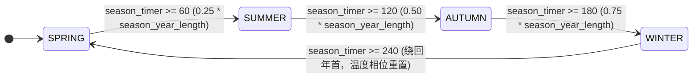

# 41. ❄️ 四季更替与热力学供暖系统 (`seasons`)

> **模块索引**：[← 返回 ../README.md 全景索引](../README.md) · 主要源码：`crates/sim_core/src/spatial/world.rs`（`tick_season`）、`housing_system/maintenance.rs`

---

## 状态机

单个模拟世界在 240 秒年轮内按 `season_timer` 推进的四季相位迁移；温度与供暖/霜冻/受孕红线由相位派生。

| 状态 | 含义 | 进入条件 | 退出条件 |
| :--- | :--- | :--- | :--- |
| SPRING 春 | 气温回升期，浆果产速恢复，`temperature` 由基准正弦派生 | `season_timer` 自 0 或绕回 | `season_timer >= 60` |
| SUMMER 夏 | 年度最热，供暖阈值 `8℃` 一般未触发 | `season_timer >= 60` | `season_timer >= 120` |
| AUTUMN 秋 | 霜降前囤粮窗口，气温逼近 `berryFrostDeclineTemp`(8℃) | `season_timer >= 120` | `season_timer >= 180` |
| WINTER 冬 | 供暖消耗期，`temperature < 8℃` 扣木供暖；`wood < 10.0` 禁孕 | `season_timer >= 180` | `season_timer >= 240` |

**不变量**（违反即出 bug）：
- `season_year_length` 是唯一时间基准，单季长度 = `season_year_length * 0.25` 自动派生，不得引入独立季度长度配置。
- 气温 = 1 年基准正弦 + 7 年厄尔尼诺正弦 + 49 年纪元候波正弦，初始相位由种子派生，全程确定性可复现。
- 供暖仅消耗非 0 级房屋木材（0 级仓库与无主房屋不参与）；房屋木材 `< 10.0` 时自动禁用受孕。

## 模块定位

全局时间驱动的四季气候模型，通过气温周期影响房屋供暖消耗与受孕可行性。四季是宏观环境约束，倒逼族人在春夏秋储备过冬物资。

## 核心机制

### 240 秒四季年轮模型与多周期气候震荡
- 一年 = 240 模拟秒（4 分钟），每季 60 秒：春（0~60s）、夏（60~120s）、秋（120~180s）、冬（180~240s）。
- 基础季节气温呈 1 年周期正弦平滑震荡（基准 14℃ ± 振幅 17℃）。
- ★ v1.34.0 叠加 7 年为周期、范围 ±5℃ 的厄尔尼诺正弦震荡（★ v1.46.16 振幅由 3℃ 提升至 5℃，初始起点相位由世界种子确定性随机生成）。
- ★ 叠加 49 年为周期、范围 ±5℃ 的「纪元候波」（★ v1.46.16 振幅由 3℃ 提升至 5℃，大世纪极值波动，初始相位由世界种子确定性随机生成），综合极端气温范围可达 -13℃ ~ 41℃。
- 单季长度由 `season_year_length × 0.25` 自动派生，无独立配置项。

### 低温供暖消耗
- ★ v1.34.0 供暖与季节解绑：环境气温 < 8℃ 时（不再固定冬季消耗，低于阈值即启动供暖），所有非 0 级有主房屋每秒消耗 0.12 单位木材用于壁炉供暖。
- 0 级仓库不扣供暖木材（无壁炉）。

### 霜冻降产与冰封绝收（浆果生态）
- 霜降寒潮临界点（8℃）：气温低于 8℃（`berryFrostDeclineTemp`）时，自然浆果开始按平滑三次方曲线（Smoothstep）衰减产速。
- 冰封绝收点（0℃）：气温低于 0℃（`berryFrostZeroTemp`）时，野外浆果彻底绝收（产速归零），倒逼族人深秋囤粮或入冬赴榷场买粮。

### 低温受孕安全红线
- 房屋木材储量 < 10.0 时无法保障严寒取暖，自动禁用受孕功能。
- 倒逼族人在春夏秋三季主动伐木储备过冬木料。

### 未来 49 年宏观气候预测（★ v1.46.15）
- 鼠标悬停在顶部气温窗口时，弹出 `#climate-forecast-popup` 折线图浮窗；
- 基于快照下发的 `season_timer`、`el_nino_phase` 与 `climate_epoch_phase`，前端解析外推未来 49 年（11,760 游戏小时）温度全频曲线；
- 辅助线标明 0℃ 绝收冰封线与 8℃ 霜降供暖线，并实时预测极值点（盛夏极热与寒冬极冷峰值及发生年份）。

## 关键不变量
- `season_year_length` 是唯一时间基准，单季长度自动派生，不得引入独立季度长度配置。
- 气温为 1 年基准正弦叠加 7 年厄尔尼诺正弦与 49 年纪元候波正弦，初始相位由种子派生，全过程确定性可复现。
- 供暖仅消耗非 0 级房屋木材，0 级仓库与无主房屋不参与。

## 与其他模块接口
- `world.rs::tick()`：每 tick 调用 `tick_season` 更新季节与气温，排在 POI 再生之前。
- `housing_system/maintenance.rs`：读取气温判断是否扣供暖木材。
- `agent.rs` / `birth.rs`：受孕门槛检查房屋木材储量。
- 前端 `render_hud.js`：顶栏展示四季时钟与实时气温；鼠标悬停展示未来 49 年宏观气候预测折线图。
- 前端 `lighting.js`（★ v1.48.0）：动态季节光照只消费本模块的 `season` / `season_progress` / `temperature` 事实推导年周期光弧（一年一圈、四季各占一个象限），不新增时间基准、不修改 `tick_season`；详见 [./51-seasonal-lighting.md](./51-seasonal-lighting.md)。

## 调参入口
年轮周期、气温基准与振幅、供暖温度阈值与木材消耗速率见 [./14-config-reference.md](./14-config-reference.md) 第 6、7 分区。
