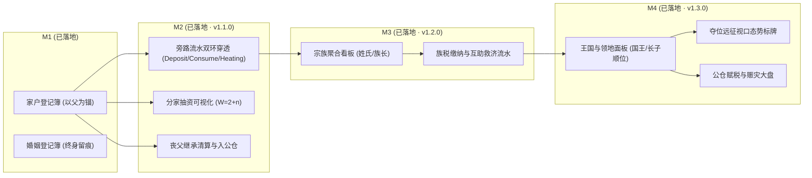
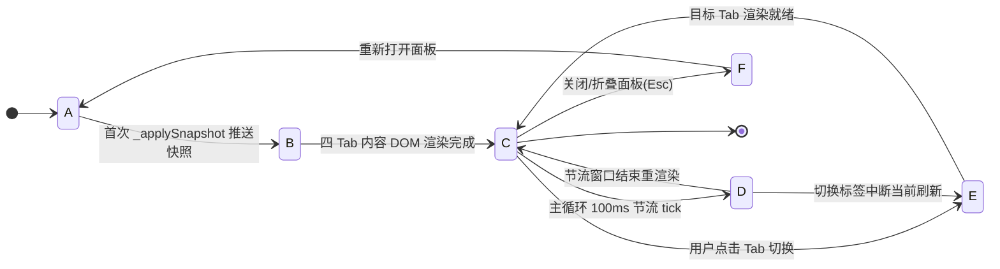

# 54. 🏛️ 制度大盘 UI 实现（M1~M4）(`ledger-ui.js`)

> **模块索引**：[← 返回 ../README.md 全景索引](../README.md) · 主要源码：`frontend/js/ledger-ui.js` · 内核机制：[./20-ledger-and-polity.md](./20-ledger-and-polity.md)
> **关联文档**：[./53-ui-implementation.md](./53-ui-implementation.md)（UI 页面全景剖析）· [./55-frontend-dev-guide.md](./55-frontend-dev-guide.md)（前端开发实施指南）
> **里程碑状态**：M1~M4 已完整落地（M1 v1.0.0 / M2 v1.1.0 / M3 v1.2.0 / M4 v1.3.0）；M5 帝国上层政体（v1.44.7）见 [./20-ledger-and-polity.md](./20-ledger-and-polity.md)。
> **定位**：制度经济学界面实现说明——对 **M2（旁路记账与分家继承）、M3（宗族与族长制）、M4（地区团体与国王政体）** 的 UI/UX 实现架构与视觉交互进行完整说明，以下界面均已落地于 `frontend/js/ledger-ui.js`。



---

## 状态机

制度大盘从「未挂载 → 加载快照 → 就绪」进入主循环，在 10FPS 节流刷新与四标签页切换间流转，关闭/折叠则卸载。



| 状态 | 含义 | 进入条件 | 退出条件 |
| :--- | :--- | :--- | :--- |
| A 未挂载 | `ledger-panel` 尚未初始化 | 页面加载 | 首次快照推送 |
| B 加载快照 | `rustworld.js::_applySnapshot` 映射家户/婚姻/宗族/王国数据 | 首帧推送 | 四 Tab 渲染完成 |
| C 就绪 | 4 标签页（家户/婚姻/宗族/王国）DOM 完备可交互 | 渲染完成 | 刷新/切换/关闭 |
| D 刷新中 | `render_canvas` 主循环以 10FPS 节流更新；`.minimized` 时直接 return | 100ms 节流触发 | 重渲染或切换 |
| E 标签页切换 | `tab-household/marriage/clan/region` 间切换渲染 | 用户点击 | 目标 Tab 就绪 |
| F 卸载 | 面板关闭或折叠，跳过内部 DOM 拼接与 Diff | Esc/折叠 | 重新打开 |

**不变量**（违反即出 bug）：
- 制度大盘必须随主循环以 10FPS（每 100ms）节流更新，严禁随 30FPS Canvas 每帧操作 DOM。
- `.ledger-panel` 处于 `.minimized` 折叠态时必须直接 return，跳过内部复杂 DOM 拼接。
- 高频 `innerHTML` 重建容器须套内容快照缓存（如 `ledger-ui.js::renderHtml`），否则重建节点会吞掉 `click` 事件。

## 2.1 多标签页制度枢纽 (Tabbed Society & Ledger Hub)

### 为什么是多标签页？
右侧面板容器在 M1 只有一个折叠式的 `ledger-panel`，仅能罗列家户与婚姻两条简单列表。演进至 M2~M4 后：
1. **信息维度剧增**：新增了宗族（Clan）、行政领地/王国（Region）、公仓金库、王位顺位链、分家世系；
2. **纵向滚动失控**：如果在单一面板内垂直无限堆叠列表，会导致用户频繁上下拖动，交互体验崩溃；
3. **职责隔离清晰**：家户（私有血缘家庭）、婚姻（两性契约）、宗族（同姓父系联盟）、地区（地缘政体与公权力）属于四个不同层级的社会制度。

### 实现方案：4 标签页「🏛️ 社会与经济制度大盘」
将 `ledger-panel` 重构为带有分段选项卡（Tab Switcher）的制度大盘容器（已落地于 `ledger-ui.js`）：

| 标签页 ID | 名称 | 图标 | 主题色彩 | 核心展示内容 | 对应里程碑 |
| :--- | :--- | :--- | :--- | :--- | :--- |
| `tab-household` | **家户** | 🏠 | 琥珀金 `#f59e0b` | 存续/已解散家户、分家支系树、账面余额、流水穿透抽屉 | M1 / M2 |
| `tab-marriage` | **婚姻** | 💍 | 浪漫粉 `#ec4899` | 存续中婚姻、终身多段历史留痕、平均婚龄、离异/丧偶率 | M1 |
| `tab-clan` | **宗族** | 🛡️ | 翡翠青 `#10b981` | 同姓宗族聚合、世袭族长、族库金库、族税征缴、互助基金 | M3 (v1.2.0) |
| `tab-region` | **王国** | 👑 | 皇家金 `#fbbf24` | 4 大营地王国、当朝国王、长子顺位链、夺位远征中族人、公仓与赋税救济 | M4 (v1.3.0) |

---

## 2.2 M2 界面实现：家庭旁路记账 + 分家抽资 + 丧父继承清算

### 1. 旁路双环记账流水穿透抽屉 (Double-Entry Journal Viewer)
- **触发位置**：点击任一家户卡片或 Agent Inspector 的「📒 账面余额」区域；
- **展示形态**：向下滑出抽屉式流水列表（从环形缓冲区拉取最近 32 笔）：
  - `Deposit`（📥 成员运货回填）：`[Tick 1420] 成员 #3 存入 💧+15.0 (运水回宅)`
  - `Consume`（🍽️ 生活消耗）：`[Tick 1500] 成员 #1 消耗 🍒-2.5 (就餐)`
  - `Heating`（🔥 冬季采暖）：`[Tick 1800] 冬季供暖消耗 🌲-0.12/s`
  - `Construction` / `Maintenance`（🔨 营建修缮）：`[Tick 2100] 茅草房升级私宅 🌲-25.0`
  - `Split`（✂️ 分家出资）：`[Tick 3200] 子代 #5 成年分家 支出份额 [💧-4.2, 🍒-6.0, 🌲-3.1]`
  - `Inheritance`（⚰️ 丧父清算）：`[Tick 4500] 户主 #1 离世，家产平分予 3 位子女各 1/3`

### 2. 分家抽资（$W = 2 + n$）可视化弹窗/卡片
- 当男性族人满足 `age >= 1800`（成年）或父亲亡故触发自主分家时，产生分家事件。
- **UI 交互表现**：
  - 在家户大事记与事件播报中高亮提示：`✂️ 部落民 #5 自立门户（新家户 #8），分得原家户 #2 资产的 1/4（权重比 2:1:1:1）`；
  - 鼠标悬浮分家标记时弹出公式气泡：
    $$\text{总权重 } W = 2(\text{父}) + 1(\text{长子}) + 1(\text{次子}) + 1(\text{胎儿}) = 5 \implies \text{抽资比例 } 20\%$$
  - 在族谱 DAG 图上，分家节点旁出现分支图标 `🌱`，点击可直接展开新家户档案。

### 3. 丧父继承清算与入公仓档案
- 户主去世时：
  - **有在世子一代**：家产等额平分流水明细，家户状态打上 `[已解散 · 遗赠分配完毕]` 灰色标签；
  - **绝嗣（无在世子女）**：家产全额并入公仓流水：`🏛️ 绝嗣清算：家户 #4 剩余资产全部充入 【桃源营地】公仓`。

---

## 2.3 M3 界面实现：宗族公库 + 族长制 + 族税互助

### 1. 宗族聚合看板 (`tab-clan`)
- **宗族卡片**：
  - 族徽与宗族名号：如 `🛡️「姬」氏宗族`、`🛡️「姜」氏宗族`；
  - **👑 族长尊号**：显示同姓在世最年长男性头像与 ID（如 `族长: Agent #3 (72岁/始祖)`）；
  - **宗族规模**：涵盖家户数（`8 户`）、族人总数（`24 人`）；
  - **宗族公库储备仪表**：💧水 / 🍒食 / 🌲木 / 🪨石 / 🪙金 5 类资源族库总额；
  - **族长顺位列表**：展开查看排名前 3 的顺位继承人（按年龄降序、男性、健在、并列取 ID 小者）。

### 2. 族税与互助流水监控
- **族税征收进度条**：各家庭按 `config.clan_tribute_rate` 向宗族公库上缴比例；
- **互助救济动态气泡**：当某成员家庭粮食/木材枯竭时，族长自动签发 `MutualAid` 救济，界面跳出绿色救济流向动画：`🛡️ 宗族救济: 「姬」氏族库拨付 🍒+15.0 -> 极贫家户 #6`。

---

## 2.4 M4 界面实现：地区政体 + 国王尊号 + 夺位远征 + 长子继承

### 1. 地区/王国政体面板 (`tab-region`)
- **4 大行政区卡片**（对应 4 处营地）：
  - 行政等级徽章：🏕️ 原始营地 → 🏘️ 村落 → 🏬 乡集 → 🏙️ 集镇 → 🏛️ 县邑/王国；
  - **👑 国王/领主头像卡片**：展示国王名号、登基时刻、在位年限；
  - **到达时序表 (Arrival Order)**：始祖播撒序与新生儿出生序列；
  - **长子继承顺位树**：国王直系长子 → 长孙 → 幼子 → 元老到达顺位；
  - **地区公仓储备**：大宗公仓物资及周期性税收流水（`Tax`）与赈灾拨付（`Relief`）。

### 2. 历史国王档案（v1.12.0 内核扩展）
- **内核结构**：`Region.history_kings` 从 `Vec<AgentId>` 升级为 `Vec<HistoryKing>{agent_id, reign_start_tick, reign_end_tick, death_cause}`，新增 `Region.current_reign_start` 追踪现任国王登基 tick；
- **`set_king` 签名**：增加 `prev_death_cause: Option<String>` 参数，4 个调用点（初王登基/国王更替/长子继承/夺位远征）同步传入前任国王死因（从 `agent.death_cause` 读取，被废黜/夺位则为 None）；
- **快照三处同步**：`snapshot.rs` 新增 `HistoryKingSnapshot` + `RegionSnapshot.current_reign_start`；`world_snapshot.rs` 映射；`rustworld.js` 适配对象数组并兼容旧档数字数组回退；
- **存档格式**：`SAVE_FORMAT_VERSION` 2→3（`history_kings` 结构不兼容旧档，按设计红线干净拦截）；
- **UI 展示**：营地详情模态框「📜 历史国王」分区，每位国王展示在位时长（`(reign_end - reign_start)/60` 模拟秒）与死因。

### 3. 营地详情模态框（v1.12.0 UI 重构）
营地一级卡片精简为「国王 + 晋升条 + 查看详情按钮」，完整辖区信息移入模态框（见 21 文档 §1.7.3），包含：
- 现任国王（登基时刻 + 在位时长）
- 继承人顺位前 3
- 历史国王列表（在位时长 + 死因）
- 管辖家庭（紧凑格式 `🏠#id(N人·户主#X)`）
- 空置房屋（房屋 ID + 受益人芯片）
- 王国公仓账本（5 类余额 + 最近 6 笔流水）

### 4. ⚔️ 夺位远征视口地图动态标牌
- 当王位空悬（无主营地）时，由决策分支 `B14SeekThrone`（生理层最高档）驱动：在世成年男性非国王且存在空缺王位营地（有房者仅夺自家房屋所在营地、无房可夺任意）时，决策器选定最近可夺位营地发起夺位远征；
- **地图视口动态效果**：
  - 夺位者头顶浮现金色战盔标牌：`⚔️ 冲刺夺位中 -> 桃源营地`；
  - 画布上自夺位者脚下向目标营地绘制金色虚线光束；
  - 率先抵达者登基瞬间，视口炸开金色礼花，全图播报：`👑 胜者为王：部落民 #8 率先抵达，登基为【桃源王国】第一任国王！`。

---

## 2.5 高保真 ASCII Wireframe 与视觉原型图

### 1. 制度枢纽 4 标签页大盘布局 (Society & Ledger Hub)

```text
+-------------------------------------------------------------------+
| 🏛️ 社会与经济制度大盘 (Society & Ledger Hub)              [ - ] [ X ] |
+-------------------------------------------------------------------+
| [ 🏠 家户(12) ]  [ 💍 婚姻(8) ]  [ 🛡️ 宗族(3) ]  [ 👑 王国(4) ]    |  <-- Tab Switcher
+-------------------------------------------------------------------+
| 📌 宗族大盘视图 (TAB: 🛡️ 宗族)                                      |
| +---------------------------------------------------------------+ |
| | 🛡️「姬」氏宗族                      👑 族长: Agent #3 (68岁)   | |
| | 👥 辖属 6 户 (18人)                 💰 族库总额: 186.5 单位    | |
| | ------------------------------------------------------------- | |
| | 💧 45.0  | 🍒 62.0  | 🌲 50.0  | 🪨 20.0  | 🪙 9.5           | |
| | [ 族内互助基金: 充足 🟢 ]            [ 族税征缴率: 5% / 季 ]     | |
| | 📜 近期流向:                                                   | |
| |  · [Tick 3200] 互助救济 -> 家户 #4 (🍒+15.0 过冬度荒)           | |
| |  · [Tick 2900] 族税上缴 <- 家户 #2 (🪙+2.0 贡金)               | |
| +---------------------------------------------------------------+ |
| +---------------------------------------------------------------+ |
| | 🛡️「姜」氏宗族                      👑 族长: Agent #7 (54岁)   | |
| | 👥 辖属 4 户 (11人)                 💰 族库总额: 94.0 单位     | |
| | 💧 20.0  | 🍒 35.0  | 🌲 25.0  | 🪨 10.0  | 🪙 4.0           | |
| +---------------------------------------------------------------+ |
+-------------------------------------------------------------------+
```

### 2. 地区与王权面板布局 (TAB: 👑 王国)

```text
+-------------------------------------------------------------------+
| 🏛️ 桃源王国 (5阶 县邑/王国)              🏛️ 辖区私宅: 26 间       |
+-------------------------------------------------------------------+
| 👑 当朝国王: 部落民 #1【姬】(在位 12年)  ⚔️ 王权状态: 稳固统治    |
| 📜 王位顺位: ① 长子 #9  ② 长孙 #21  ③ 幼子 #14  ④ 元老 #2(按序)    |
+-------------------------------------------------------------------+
| 🏛️ 国库公仓总储量 (公共赈灾与修路基金)                             |
| 💧 120.0     🍒 150.0     🌲 85.0      🪨 60.0      🪙 32.0       |
+-------------------------------------------------------------------+
| 📜 王权政令与大宗流水:                                            |
|  · [Tick 4100] 普发冬赈: 公仓拨付 🌲-20.0 救济受冻贫民家户        |
|  · [Tick 3800] 征收公仓税: 全境 26 户共计纳粮 🍒+26.0             |
|  · [Tick 3100] 先王仙逝，长子 #1 依长子继承制登基为王             |
+-------------------------------------------------------------------+
```
