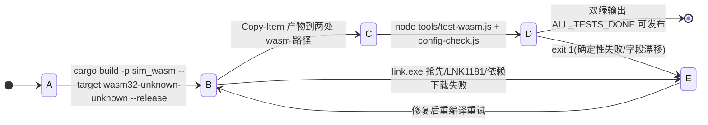

# 编译与运行深度指南 (build-guide)

> 核心编译 / 测试 / 启动步骤见根 [AGENTS.md §2](../../../AGENTS.md)。本文档补充环境变量细节、跨平台说明、故障排查与配置校验流程。
>
> 当前版本：v1.0.1

---

## 状态机

构建从「工具链就绪 → 编译 WASM → 双副本同步 → 门禁校验」流转；编译/同步/门禁失败回退修复重试。



| 状态 | 含义 | 进入条件 | 退出条件 |
| :--- | :--- | :--- | :--- |
| A 工具链就绪 | 注入 `.toolchain` PATH + `CARGO_HOME`；Git Bash 配 `LIB` 与 MSVC `link` 优先级 | 新终端注入便携链 | 编译命令发出 |
| B 编译 WASM | `wasm32-unknown-unknown` release 构建 sim_wasm | cargo build | 产物生成 |
| C 双副本同步 | 复制 `frontend/rust/sim_wasm.wasm` 与 `frontend/sim_wasm.wasm` | 产物就绪 | 门禁校验 |
| D 门禁校验 | `test-wasm.js`(确定性/防 NaN) + `config-check.js`(字段一致) 双绿 | 双副本就位 | 通过/失败 |
| E 失败回滚/重试 | 编译错、双副本未同步或门禁 exit 1 | 任一环节失败 | 修复后重编译 |

**不变量**（违反即出 bug）：
- WASM 双副本缺一不可：`frontend/rust/sim_wasm.wasm` 与 `frontend/sim_wasm.wasm` 必须同步更新（rustworld.js 实际 fetch 主路径）。
- 发布前双绿：`test-wasm.js` + `config-check.js` 均通过方可发布；不以字节数判断是否更新。
- 改过 Rust 代码必须重编译 WASM 并同步双副本，否则浏览器加载旧逻辑。

## 1. 工具链与环境变量

### 1.1 Windows 便携工具链（项目主环境）

项目根目录内置便携 Rust 工具链与离线依赖缓存，每次新开 PowerShell 终端需注入：

```powershell
$env:PATH = "$PWD\.toolchain\cargo\bin;$PWD\.toolchain\rustc\bin;$env:PATH"
$env:CARGO_HOME = "$PWD\.cargo-home"
```

- `.toolchain/`：便携 cargo + rustc 二进制
- `.cargo-home/`：离线依赖缓存（registry + git）
- 注入后 `cargo --version` / `rustc --version` 应正常输出

> ⚠️ CI 中**禁止**使用便携链——CI 运行在 ubuntu-latest，用标准 rustup（见 [./64-cicd.md](./64-cicd.md)）。`.toolchain/` 与 `.cargo-home/` 已被 gitignore。

### 1.1.1 ★ 宿主 linker 环境（MSVC）：Git Bash 下必配 `LIB` 与 linker 优先级

`wasm32-unknown-unknown` 是**纯静态目标、无需 linker**，但 proc-macro 依赖（`serde_derive` / `proc-macro2` / `quote` 等）的 **build script 必须按宿主 `x86_64-pc-windows-msvc` 编译并链接**，因此仍需 MSVC `link.exe` 与 Windows SDK 导入库。

在 **Git Bash** 中编译时会踩两个连环坑（PowerShell / VS 开发人员终端不会遇到）：

1. `link: extra operand '...rcgu.o'` → Git Bash 的 `/usr/bin/link`（GNU coreutils）抢在 MSVC `link.exe` 之前；
2. `LINK : fatal error LNK1181: 无法打开输入文件“kernel32.lib”` → `LIB` 未指向 MSVC 与 Windows SDK 的 x64 库目录。

完整可用的 Git Bash 编译前缀（版本号按本机实际安装调整）：

```bash
cd /c/Users/<你>/RustroverProjects/FlowAndAccord
export MSVCBIN="/c/Program Files (x86)/Microsoft Visual Studio/2022/BuildTools/VC/Tools/MSVC/14.39.33519/bin/Hostx64/x64"
export PATH="$PWD/.toolchain/cargo/bin:$PWD/.toolchain/rustc/bin:$MSVCBIN:$PATH"
export CARGO_HOME="$PWD/.cargo-home"
export LIB="C:\\Program Files (x86)\\Microsoft Visual Studio\\2022\\BuildTools\\VC\\Tools\\MSVC\\14.39.33519\\lib\\x64;C:\\Program Files (x86)\\Windows Kits\\10\\Lib\\10.0.22621.0\\um\\x64;C:\\Program Files (x86)\\Windows Kits\\10\\Lib\\10.0.22621.0\\ucrt\\x64"
cargo build -p sim_wasm --target wasm32-unknown-unknown --release --offline
```

> `$MSVCBIN` 必须排在 `$PATH` **最前**才能压过 coreutils 的 `link`；`$LIB` 用 Windows 风格分号分隔路径。

### 1.1.2 ★ 本地离线 vendor 依赖源（网络不可用时）

仓库**不会**全局配置 `source.crates-io → vendored-sources`，因为 `.vendor/` 未纳入版本控制；在 GitHub Actions 等全新 checkout 中启用它会导致 Cargo 找不到目录而失败。需要本地离线构建时，先确认 `.vendor/` 已完整生成，再仅在本机通过命令行临时启用：

```toml
[source.crates-io]
replace-with = "vendored-sources"

[source.vendored-sources]
directory = ".vendor"
```

- `.vendor/` 由 `.cargo-home/registry/src` 的解压目录 + 逐个 `.crate` 的 sha256 写入 `.cargo-checksum.json` 生成（与 `Cargo.lock` 校验一致）。
- **新增/升级依赖时必须**：联网 `cargo fetch` 后重新生成 `.vendor`；否则新依赖会因 vendor 缺失而报 `no matching package`。
- 只要 `.vendor/` 完整，即可在本地加入上述 replacement 并加 `--offline`，完全绕开 index.crates.io（沙箱/代理阻断网络时唯一可行路径）。

### 1.2 macOS / Linux（标准 rustup）

```bash
curl --proto '=https' --tlsv1.2 -sSf https://sh.rustup.rs | sh
rustup target add wasm32-unknown-unknown
```

编译 / 测试 / 启动命令与 Windows 相同，仅路径分隔符为 `/`，复制用 `cp` 替代 `Copy-Item`。

---

## 2. 编译与双副本同步

核心命令见根 AGENTS.md §2 步骤一。要点：

- 编译目标：`wasm32-unknown-unknown`，`--release`
- 产物路径：`target\wasm32-unknown-unknown\release\sim_wasm.wasm`
- **必须复制到两个位置**（缺一不可）：
  - `frontend\rust\sim_wasm.wasm`（`rustworld.js` 实际 fetch 的主路径）
  - `frontend\sim_wasm.wasm`（根目录静态备用）
- 不要用 wasm 字节数判断是否更新——不同构建可能字节完全相同，以 `node tools/test-wasm.js` 实际输出为准

---

## 3. 测试与校验

### 3.1 WASM 回归测试（唯一长期保留的自动化验证）

```powershell
node tools/test-wasm.js
```

输出 `ALL_TESTS_DONE` 即通过。覆盖：同种子逐字节确定性、坐标防越界、数值防 NaN、长程稳定性。

### 3.2 配置一致性校验（改参后必跑）

```powershell
node tools/config-check.js
```

交叉解析 `frontend/js/config.js` 与 `crates/sim_core/src/config.rs`，捕获四类问题并以非零退出码报错：

1. **孤儿字段**：前端有 / Rust 无
2. **缺失字段**：Rust 有 / 前端无
3. **类型错配**：`usize/u64` 与浮点混淆
4. **数值漂移**：默认值不一致

通过时输出字段数对比，并自动刷新 `./14-config-reference.md`（参数速查表，**勿手改**）。

> 发布前双绿：`test-wasm.js` + `config-check.js` 均通过方可发布。

### 3.3 Rust 原生编译检查

```powershell
cargo test --lib
```

当前源码无持久化单元测试（见 AGENTS.md §4.10 混沌系统定位），命令通过即代表编译无误。

---

## 4. 前端开发服务器

```powershell
node frontend/server.js
```

- 默认端口 `3000`，内置 `.wasm` MIME（`application/wasm`）
- **若 3000 已被占用，说明用户已手动启动服务，Agent 不要重复启动**——直接访问 `http://localhost:3000`
- server.js 在端口占用时会自动递增重试（3001 → 3002 …），重复启动可能导致多实例并存
- 每次重编译 WASM 后浏览器 `Ctrl + F5` 强制刷新清理缓存
- server.js 以自身所在目录（`frontend/`）为静态根，须在项目根目录执行

---

## 5. 数值热调优（免编译）

所有仿真超参集中在 `frontend/js/config.js`（`window.SIM_CONFIG`），直接编辑保存后浏览器 `Ctrl+F5` 即生效，无需重编译 WASM。

- Rust 侧通过 `SimConfig` 结构体接收，逻辑层一律 `self.config.<字段>` 引用，禁止散落字面量
- 新增超参须在 `config.rs` 三处同步：命名 `const`（默认值唯一真相源）+ `SimConfig` 字段 + `Default` 映射
- 改参后必跑 `node tools/config-check.js`（§3.2）

---

## 6. 故障排查

| 现象 | 原因与处理 |
| :--- | :--- |
| `cargo: command not found` | 便携工具链环境变量未注入，执行 §1.1 的两条 `$env:` 命令 |
| 编译报依赖下载失败 | `CARGO_HOME` 未指向 `.cargo-home`，或离线缓存缺失；确认 `$env:CARGO_HOME = "$PWD\.cargo-home"` |
| `failed to get petgraph / unable to update registry crates-io` | 网络被代理/沙箱阻断。改走离线 vendor 源（§1.1.2）+ `--offline` |
| `link: extra operand '...rcgu.o'` | Git Bash 的 coreutils `link` 抢先；把 MSVC `bin/Hostx64/x64` 置于 `PATH` 最前（§1.1.1） |
| `LNK1181: 无法打开输入文件“kernel32.lib”` | `LIB` 未含 MSVC / Windows SDK 的 x64 库目录（§1.1.1） |
| 浏览器加载旧逻辑 | WASM 双副本未同步（§2），或浏览器缓存未清（`Ctrl+F5`） |
| `CompileError: Invalid WebAssembly` | MIME 不对。本地 server.js 已内置正确 MIME；若用其他服务器需确保 `.wasm → application/wasm` |
| `test-wasm.js` 确定性失败 | 新增随机消耗破坏了 WorldRng 确定性顺序（AGENTS.md §4.3）；检查新增的 `rng` 调用是否按 agent 顺序消费 |
| `config-check.js` 报字段漂移 | 改了 `config.rs` 但没同步 `config.js`（或反之）；按报错字段名双向对齐 |
| 端口 3000 占用 | 用户已启动服务，直接访问 `http://localhost:3000`；不要重复 `node frontend/server.js` |
| 页面 404 | 确认在项目根目录执行 `node frontend/server.js`；server.js 以 `frontend/` 为静态根 |


---

# 附篇 · 快速启动与体验

> 原 `current/10-quickstart.md`。

> **模块索引**：[← 返回 ../README.md 全景索引](../README.md)

---

## 方式 1：浏览器体验（推荐）

启动本地 HTTP 服务（默认端口 3000）：
```bash
node frontend/server.js
```
访问浏览器：`http://localhost:3000`

> 若 3000 端口已被占用，说明前端服务已在运行，直接访问即可，无需重复启动。

> ⚠️ **v1.27.0 启动存档门禁 / ★ v1.28.0 自动读档**：页面打开后模拟默认暂停。若已连接默认存档文件（自动槽 1 = 浏览器记住的默认目录 + 默认文件名 `flowaccord-save1.json`，句柄经 IndexedDB 恢复）则**直接读取其内容续演**；首次使用需点击「建立存档文件」创建/连接一个本地 `.json` 存档文件（File System Access API），写入成功后才解除门禁开始模拟。请使用最新版 Chrome 或 Edge（Firefox 不支持）。

### 编译 WASM（改 Rust 代码后）
```powershell
# 注入便携工具链
$env:PATH = "$PWD\.toolchain\cargo\bin;$PWD\.toolchain\rustc\bin;$env:PATH"
$env:CARGO_HOME = "$PWD\.cargo-home"
# 编译
cargo build -p sim_wasm --target wasm32-unknown-unknown --release
# 双副本同步
Copy-Item "target\wasm32-unknown-unknown\release\sim_wasm.wasm" -Destination "frontend\rust\sim_wasm.wasm" -Force
Copy-Item "target\wasm32-unknown-unknown\release\sim_wasm.wasm" -Destination "frontend\sim_wasm.wasm" -Force
```
编译后在浏览器按 `Ctrl + F5` 强制刷新清理 WASM 缓存。

## 方式 2：Node.js 自动化回归测试
```bash
node tools/test-wasm.js
```
输出 `ALL_TESTS_DONE` 即代表确定性测试、坐标防越界、数值防 NaN 校验 100% 通过。

## 方式 3：配置一致性校验
```bash
node tools/config-check.js
```
输出「字段集、类型、默认值完全一致，无漂移」即代表前后端配置同步。同时自动刷新 `./14-config-reference.md`。

## 方式 4：Rust 内核编译检查
```bash
cargo build -p sim_core
```
> 项目定位为混沌系统，不持久化保存单元测试脚本（详见根 AGENTS.md §4.10）。`cargo test --lib` 仅验证编译通过，无测试用例。

## 方式 5：版本号统一升版与一致性校验
```bash
node tools/bump-version.js --patch      # 升版并同步全部 10 个版本号定义点
node tools/bump-version.js --check      # 只校验一致性（漂移即 exit 1）
```
改过代码就必须升版（根 AGENTS.md §4.9）。升版器以 `index.html` 版本徽章为唯一真相源，自动同步 `SAVE_APP_VERSION` 等定义点；若 Rust 常量变更，按方式 1 重编译 WASM 并同步双副本。

> ⚡ **仅文档变更例外**：diff 只含 `docs/` 或根/局部 `AGENTS.md` 内容时，commit **不需要升版、不需要重跑测试**，只需 `doc-maintenance-check` 通过 + `--check` 零漂移（详见根 AGENTS.md §4.0.1 与 `./68-workflow.md` §G）。

## 常用交互
| 操作 | 快捷键/方式 |
| :--- | :--- |
| 暂停/继续 | `Space` 空格键 |
| 选中部落民 | 鼠标左键点击小人 |
| 查看房屋/地标 | 鼠标左键点击 |
| 缩放 | 鼠标滚轮 |
| 平移 | 右键拖拽 |
| 重置模拟 | 顶部「重置模拟」按钮 |
| 强制刷新 | `Ctrl + F5`（重编译 WASM 后） |
