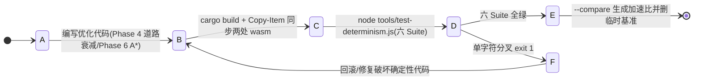
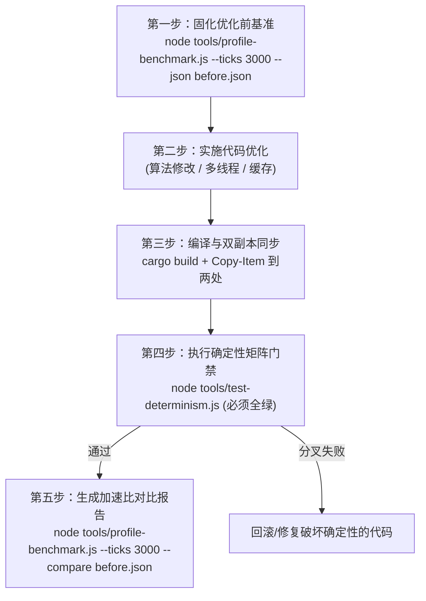

# Flow & Accord · 性能 Profiling 基准测试与确定性矩阵操作指南

> **定位**：面向开发者与未来 AI Agent（Antigravity/LLM）的性能基准分析与长程确定性回归全景指南。在进行任何性能优化（如多线程改造、加权 A* 寻路优化、路网衰减优化、快照二进制零拷贝）时，必须以确定性为铁律，以本基准套件量化加速比与子系统耗时演化。

---

## 状态机

性能优化闭环从「固化基准 → 实施优化 → 编译双副本同步 → 确定性门禁」流转；确定性分叉回滚修复，全绿则生成加速比报告。



| 状态 | 含义 | 进入条件 | 退出条件 |
| :--- | :--- | :--- | :--- |
| A 固化基准 | `profile-benchmark.js --json before.json` 留痕优化前性能 | 优化前 | 实施优化 |
| B 实施优化 | 改 Rust 内核热点（Phase 4 道路磨损 / Phase 6 马斯洛决策 A*） | 基准就绪 | 编译同步 |
| C 编译双副本同步 | 编译并复制 `frontend/rust/sim_wasm.wasm` 与 `frontend/sim_wasm.wasm` | 优化完成 | 确定性门禁 |
| D 确定性门禁 | `test-determinism.js` 六 Suite（多种子/分批/子阶段/快照/存读档/人口） | 双副本就位 | 全绿/分叉 |
| E 加速比报告 | `--compare before.json` 输出各维度加速比 | 六 Suite 全绿 | 记录并清理 |
| F 分叉回滚 | 确定性失败（哪怕单字符），严禁带病提交 | test-determinism exit 1 | 回滚修复 |

**不变量**（违反即出 bug）：
- 性能优化须遵循「基准留痕 → 代码优化 → 确定性矩阵验证 → 加速比回归」闭环，缺一不可。
- 确定性套件报错（哪怕单字符分叉）即不合格，必须排查 RNG/浮点问题，严禁带病提交。
- WASM 双副本缺一不可：`frontend/rust/sim_wasm.wasm` 与 `frontend/sim_wasm.wasm` 必须同步。

## 1. 为什么需要 Profiling 与确定性双套件？

《流与契（Flow & Accord）》内核由 Rust 编写并编译为 WebAssembly 独立运行。系统具有两大核心特征：
1. **强确定性**：同种子、同配置输入下，长程状态在数学上逐字节完全一致（混沌涌现必须可精确复现）；
2. **微秒级高频仿真**：生产环境中由独立的 Web Worker (`sim_worker.js`) 驱动，单 Tick 物理与决策运算仅需 10~20 微秒，1 秒内可推进数万 Tick。

任何性能优化手段（包括算法剪枝、数据并行、缓存层优化、多线程）如果破坏了时钟相位、RNG 消费顺序或浮点累加顺序，都会导致全图演化发生灾难性分叉。
因此，**性能优化必须遵循「基准留痕 $\rightarrow$ 代码优化 $\rightarrow$ 确定性矩阵验证 $\rightarrow$ 加速比回归」闭环流程**。

---

## 2. 性能基准测试工具：`tools/profile-benchmark.js`

### 2.1 快速上手

```bash
# 1. 标准基准测试（推进 3000 tick，输出宏观吞吐量、子阶段占比与快照开销）
node tools/profile-benchmark.js

# 2. 高精度长程采样（推荐在发布重大优化前跑 10,000 tick）
node tools/profile-benchmark.js --ticks 10000

# 3. 人口规模扩展性压测（对比 20 / 50 / 100 初始人口下的吞吐衰减曲线）
node tools/profile-benchmark.js --scale

# 4. 步长批次颗粒度压测（对比 1 / 16 / 64 / 256 / 1024 批次步长）
node tools/profile-benchmark.js --batch

# 5. 导出性能基准数据到 JSON（优化前必须先存基准）
node tools/profile-benchmark.js --ticks 3000 --json baseline.json

# 6. 对比新代码与历史基准的加速比（优化后执行）
node tools/profile-benchmark.js --ticks 3000 --compare baseline.json
```

### 2.2 CLI 参数速查表

| 参数 | 默认值 | 详细说明 |
| :--- | :---: | :--- |
| `--ticks` | `3000` | 推进的测试 Tick 总数（60 tick = 1 游戏小时） |
| `--seed` | `42` | 确定性随机数种子（用于保证跨机器测试可比性） |
| `--agents`| `20` | 初始部落民人口数量 |
| `--camps` | `4` | 行政区营地数量 |
| `--breakdown` | `true` | 是否运行 8 大子阶段细粒度耗时拆解 |
| `--scale` | `false`| 是否运行 20 / 50 / 100 人口规模横向压测 |
| `--batch` | `false`| 是否运行不同 `world_tick_steps` 批次大小的单步效率对比 |
| `--json` | `null` | 导出基准数据为 JSON 文件的路径 |
| `--compare`| `null`| 传入历史基准 JSON 文件，自动计算各维度加速比与变化率 |

### 2.3 关键指标解读

运行基准测试后将获得三个维度的量化评估：

#### A. 宏观性能大盘
- **吞吐量 (TPS - Ticks Per Second)**：每秒推进的仿真步数。现代开发机（如 AMD 7000/Intel 13代+）单核应保持在 $\ge 50,000$ TPS。
- **单 Tick 耗时 (µs/tick)**：平均每推进 1 Tick 消耗的微秒数（正常应为 $12\sim 20\text{ µs}$）。
- **游戏时钟速率**：$1\text{ TPS} = 1/60\text{ 游戏小时/秒}$。在 60,000 TPS 下，现实 1 秒相当于推演 $1,000$ 个游戏小时。
- **延迟分位数 (P50/P95/P99/Max)**：反映计算平稳度。若 P99 与 P50 相差超过 3 倍，说明路网缓存失效或错峰决策相位存在微观负载抖动。

#### B. 8 大子阶段耗时占比（Subphase Breakdown）
内核已通过 `world_tick_subphase` 导出 8 个原子级阶段探针：
1. **Phase 0: 四季与 POI 恢复 (Season & Poi Regen)**：约 $4\%\sim 6\%$
2. **Phase 1: 代谢繁衍与继承 (Metabolism & Child)**：约 $3\%\sim 5\%$
3. **Phase 2: POI 交互卸货 (Poi Interactions)**：约 $7\%\sim 9\%$
4. **Phase 3: 房屋维护与折旧 (Housing & Auction)**：约 $3\%\sim 4\%$
5. **Phase 4: 道路自然衰减 (Road Wear Decay)**：约 $25\%\sim 32\%$（遍历全图边权重衰减并更新磨损分桶）
6. **Phase 5: 动力位移踩踏 (Movement & Trample)**：约 $6\%\sim 8\%$
7. **Phase 6: 马斯洛决策寻路 (Decisions & A\*)**：约 $25\%\sim 35\%$（马斯洛状态机评估 + 加权 A* 寻路）
8. **Phase 7: 账本宗族公仓 (Ledger, Clan, Region)**：约 $10\%\sim 15\%$
9. **Phase 8: 墓碑窗口清理 (Cleanup)**：$< 1\%$

> 💡 **性能优化热点指南**：
> 从实测数据可知，**Phase 4（道路磨损衰减）** 与 **Phase 6（马斯洛决策与 A\* 寻路）** 合计占据了整个仿真周期的 **近 60% 算力**。优化重点应始终聚焦在这两个模块。

#### C. 快照编码与通信开销（Snapshot Overhead）

> ★ T1（v1.46.0）：JSON 快照通道已从生产与工具链路移除。基准工具现在**只**测量 FABS 二进制通道：
> `world_snapshot_bin_ptr()`（Rust 编码）+ 内存拷出 + `SnapshotBin.decode`（JS 解码）。
> 想同时量化已废弃 JSON 通道的代价，加 `--with-legacy-json`（会调用 test-only 的
> `world_snapshot_json_debug_ptr`，仅供对照，不要用于生产结论）。

- 默认配置（88 人）稳态帧约 $46\text{ KB}$；满载档（442 人）约 $144\text{ KB}$；
- 体积相对同帧 JSON 压缩 **$8\sim 12$ 倍**；
- **架构启示**：M4 把「帧体积」压下来之后，瓶颈转移到 **JS 侧解码**（满载档曾占 FABS 总代价的 79%），
  M5-0 又通过**驻留表缓存改用数组 + 单一 DataView + 免 BigInt 的 u64 读取 + 清理死代码**把它压下去，
  并配合 M5-0.4 的按人口自适应降频（≤200 人 30Hz / ≤320 人 25Hz / ≤450 人 20Hz / 更高 15Hz）。
  最新实测见 `../../plan/tech/27-performance.md` §2.7.1。
- ⚠️ **已否决项**：解码器**对象池化**（复用快照对象）曾被提出但实测**负收益**——生成的对象全为短命代，
  V8 scavenge 回收成本极低，池化反而延长生命周期、加剧老生代压力。故 `setReuse()` 已退化为**空操作**，
  工具侧与浏览器共用同一条「每帧全新对象」路径（不要再把 `reuse: true` 写回基准脚本）。

---

## 3. 增强型确定性矩阵测试套件：`tools/test-determinism.js`

在改动任何核心代码后，仅跑 `tools/test-wasm.js` 的单一种子是不充分的。`tools/test-determinism.js` 提供了六大确定性不变量定理门禁：

```bash
node tools/test-determinism.js
```

### 3.1 六大测试套件与数学定义

1. **[Suite 1] 多随机种子独立重放一致性 (Multi-Seed Invariance)**
   - 选取 `[42, 101, 777, 2026, 31415]` 五组特征迥异的随机种子。
   - 每组独立运行 600 tick 两次，断言生成的最终快照字符串字符级 100% 相同。
2. **[Suite 2] 步长分批推进独立性 (Batch Step Size Invariance)**
   - 证明：无论以 1 步推进 600 次、以 10 步推进 60 次、以 100 步推进 6 次、或以 600 步推进 1 次，在第 600 tick 得到的快照逐字节完全相同。
   - 保障前端切换倍速（1x 到 1024x 同帧多步步长变化）绝不引起物理分叉。
3. **[Suite 3] 子阶段步进等价性 (Subphase Stepping Equivalence)**
   - 验证：调用 `world_tick(dt)` 与循环调用 `world_tick_subphase(0..8, dt)` 产生完全一致的内部状态演进。
   - 保障性能分析工具所观测到的分项数据真实反映了生产环境行为。
4. **[Suite 4] 快照提取无副作用性 (Snapshot Non-interference)**
   - 验证：在连续推进 600 tick 的过程中，中途高频提取快照（每 20 tick 一次）与中途完全不提取快照相比，最终世界的物理状态 100% 相同。
   - 保障快照生成完全为只读行为，未意外消费 `WorldRng` 或泄漏可变副作用。
5. **[Suite 5] 多切片存读档连续性 (Multi-slice Save/Load Consistency)**
   - 在 tick 300、600、900 分别建档，再分别载入 tick 600 与 tick 300 续演至 tick 900，与直接演进到 tick 900 的世界进行字符级快照一致性核验。
   - 验证系统具备完美的时间倒流可逆性。
6. **[Suite 6] 多人口规模数值稳定性与确定性 (Population Invariance)**
   - 分别在 10 / 20 / 50 初始人口规模下运行 1200 tick，验证无越界（$|x|, |y| \le 450$）、无 NaN 异常，且相同人口下重放 100% 逐字节确定。

---

## 4. AI Agent 性能优化标准操作流程（SOP 五步闭环法）

当未来的 AI Agent 接手内核优化或重构任务时，必须严格执行以下标准作业流程：



### 步骤详解：

1. **第一步：固化优化前基准（Establish Baseline）**
   在修改任何代码前，先运行命令输出基准快照：
   ```bash
   node tools/profile-benchmark.js --ticks 3000 --json tools/baseline-pre-opt.json
   ```
2. **第二步：实施代码优化（Implement Optimization）**
   根据基准分析指出的热点（如 Phase 4 道路衰减或 Phase 6 A* 寻路）编写优化代码。
3. **第三步：编译 WASM 并同步双副本（Compile & Sync）**
   ```powershell
   $env:PATH = "$PWD\.toolchain\cargo\bin;$PWD\.toolchain\rustc\bin;$env:PATH"
   $env:CARGO_HOME = "$PWD\.cargo-home"
   cargo build -p sim_wasm --target wasm32-unknown-unknown --release
   Copy-Item "target\wasm32-unknown-unknown\release\sim_wasm.wasm" -Destination "frontend\rust\sim_wasm.wasm" -Force
   Copy-Item "target\wasm32-unknown-unknown\release\sim_wasm.wasm" -Destination "frontend\sim_wasm.wasm" -Force
   ```
4. **第四步：执行确定性矩阵验证（Run Determinism Gate）**
   ```bash
   node tools/test-wasm.js
   node tools/test-determinism.js
   ```
   > ⚠️ **铁律**：如果确定性套件报错（哪怕是单字符分叉），优化均视为**不合格**，必须排查随机数或浮点计算问题，严禁带病提交。
5. **第五步：验证加速比与生成对比报告（Measure Speedup）**
   ```bash
   node tools/profile-benchmark.js --ticks 3000 --compare tools/baseline-pre-opt.json
   ```
   检查目标子阶段耗时百分比与整体 TPS 是否达到预期增益，并在 Commit 说明与更新日志中记录具体加速比数据。完成后删除临时的 `baseline-pre-opt.json`。

---

## 5. 常见性能劣化与排查速查

| 现象 | 可能根因 | 排查定位方法 |
| :--- | :--- | :--- |
| **TPS 暴跌，延迟飙升** | A* 路径缓存击穿，频繁发生全图搜索 | 检查 `LaneEdge3D::wear_tier_bucket` 跨阶频率或 `clear_path_cache()` 调用点 |
| **Suite 2 步长分批测试失败** | 存在跨 step 的局部状态泄露或积分溢出 | 检查是否在 `world_tick_steps` 循环外持有了本应逐 tick 刷新的临时状态 |
| **Suite 4 快照无副作用测试失败** | `generate_snapshot()` 内部误用了全局 RNG 或修改了实体状态 | 检查快照导出逻辑中是否有未通过 `Cell`/`RefCell` 限制的隐式副作用 |
| **P99 延迟极大但均值正常** | 错峰决策集中在个别 tick（相位未均摊） | 检查 Agent ID 错峰公式 `(tick + id) % interval` 是否生效 |
