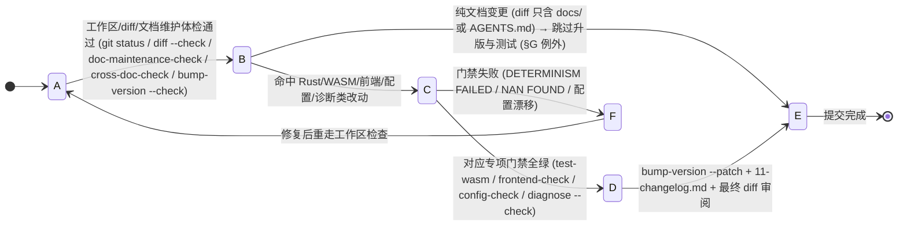
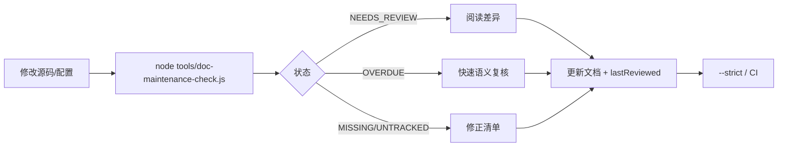

# Agent 开发快速入口

> 本页是修改代码前的最小入口。若与根 `AGENTS.md` 或目录级 `AGENTS.md` 冲突，以根文档为准。

## 状态机

本状态机描述「一次提交」的状态迁移：先做工作区检查，再判定任务类型走对应专项门禁，最后升版与追加 changelog 完成提交；纯文档变更按 §G 例外跳过升版与全部测试门禁。任一门禁失败即回退。



| 状态 | 含义 | 进入条件 | 退出条件 |
| :--- | :--- | :--- | :--- |
| A | 工作区检查 | 准备提交 | git status/diff/文档维护体检通过 |
| B | 类型判定 | 工作区检查通过 | 判定为专项改动或纯文档变更 |
| C | 专项门禁 | 命中 Rust/前端/配置/诊断类 | 对应专项门禁全绿 |
| D | 版本与 changelog | 专项门禁通过 | 升版 + 追加条目 + diff 审阅完成 |
| E | 完成提交 | 升版+changelog 或纯文档跳过 | 进入终态 |
| F | 回退 | 专项门禁失败 | 修复后回到 A 重检 |

**不变量**（违反即出 bug）：
- `doc-maintenance-check.js` 的 `NEEDS_REVIEW` 仅在 `--strict` 下失败，但 `FACT_DRIFT` 普通模式也返回 1（附篇二 §3）。
- 纯文档变更例外（§G）：仅 `docs/` 或 `AGENTS.md` 内容改动时跳过升版与全部测试门禁，但不升版即无 changelog 版本条目。
- 门禁不过不提交：命中 B/C/D/E 时对应专项项必须通过，`--strict` 主要用于发布或 CI（最低标准）。

---

## 1. 先判定任务类型

先读根 `AGENTS.md` §4。快照主链路已采用 M4 二进制：字段变更还必须检查 `snapshot_bin/encode.rs`、`snapshot-bin.js` 并运行 `node tools/test-snapshot-bin.js`。JSON 赋值实际位于 `world_snapshot.rs`。

| 任务关键词 | 首先阅读 | 最小门禁 |
|---|---|---|
| 快照 / Agent / House / POI 字段 | `./67-impact-matrix.md`、`crates/sim_core/src/spatial/AGENTS.md` | `node tools/snapshot-check.js`、`node tools/frontend-check.js` |
| 决策 / NeedKind / 路由 | `crates/sim_core/src/spatial/decisions/AGENTS.md`、影响矩阵 §1.3 | `cargo test --lib`、`node tools/test-wasm.js` |
| 账本 / 家户 / 宗族 / 王国 | `crates/sim_core/src/spatial/ledger/AGENTS.md`、`./20-ledger-and-polity.md` | `cargo test --lib`、`node tools/test-wasm.js` |
| 配置 / 超参 | `./13-config-system.md`、影响矩阵 §1.8 | `node tools/config-check.js` |
| 前端 / DOM / UI | `frontend/AGENTS.md`、`./55-frontend-dev-guide.md` | `node tools/frontend-check.js` |
| WASM / 导出 / 存档 | `crates/sim_wasm/AGENTS.md`、`./15-snapshot-and-save.md` | WASM 双副本、`node tools/test-wasm.js` |
| 仅文档 / AGENTS.md 内容 | 根 `AGENTS.md` §4.0.1、`./68-workflow.md` §G | `node tools/doc-maintenance-check.js`（不升版、不跑测试） |

## 2. 修改前四问

1. 谁是该数据或行为的唯一真相源？
2. 哪些模块生产、适配、消费它？是否需要更新影响矩阵？
3. 它属于哪个 tick 阶段，读写边界是否改变？
4. 是否涉及版本、快照、配置、存档或确定性契约？

## 3. 完成定义

- 代码、WASM 双副本（如适用）和文档已同步；
- 运行与改动类型匹配的专项门禁；
- 运行 `node tools/doc-maintenance-check.js`；发布追加 `--strict`，提交按 `./68-workflow.md` 执行；
- 使用 `node tools/bump-version.js --patch` 统一升版，并用 `--check` 验证零漂移（**仅代码/配置/契约变化时**；纯文档变更跳过升版与测试，按 `./68-workflow.md` §G 执行）；
- 在 `docs/current/11-changelog.md` 记录行为或契约变化。

## 4. 交互遗漏排查顺序

`唯一真相源 → Rust 生产者 → WASM/快照适配器 → 前端消费者 → 存档/恢复 → 门禁与文档`。

遇到“无动作”或 `undefined` 时，优先检查这条链，而不是先修改调用方的兜底逻辑。


---

# 附篇一 · Commit 前检查单

> 原 `current/19-commit-checklist.md`。

> 本清单是 `AGENTS.md §4.0.1` 的详细执行版。它只约束准备提交的改动；未涉及的模块跳过对应专项项。

## A. 所有提交必做

```bash
git status --short
git diff --check
node tools/doc-maintenance-check.js
node tools/cross-doc-check.js          # 跨文档事实指纹：文档间冲突 / 配置权威漂移
node tools/bump-version.js --check        # 版本号定义点零漂移（AGENTS.md §4.9）
```

- [ ] 工作区只有本次任务相关文件；没有构建产物、临时截图、调试输出、`.playwright-cli/` 或临时测试脚本。
- [ ] `git diff --check` 无空白错误，新增/删除/重命名文件和引用路径已核对。
- [ ] 文档维护检查没有未处理的 `MISSING_DOC`、`MISSING_SOURCE` 或 `UNTRACKED_DOC`；源码产生的 `NEEDS_REVIEW` 已复核。
- [ ] 改过代码已用 `node tools/bump-version.js --patch`（或 `--minor` / 指定版本）升版，`--check` 零漂移；**未手工编辑任何版本号定义点**。
- [ ] `docs/current/11-changelog.md` 已追加该版本条目；对应 `docs/current/` 模块文档已同步。
- [ ] **仅纯文档变更**（diff 只含 `docs/` 或根/局部 `AGENTS.md` 内容）：跳过升版与全部测试门禁，改按 §G 执行（A 的工作区/diff/文档维护体检照常）。

## B. Rust、WASM 或快照改动

```bash
cargo build -p sim_wasm --target wasm32-unknown-unknown --release
# 复制 release wasm 到 frontend/rust/sim_wasm.wasm 与 frontend/sim_wasm.wasm
cargo test --lib
node tools/test-wasm.js
```

- [ ] WASM 双副本已同步。
- [ ] 快照字段**四处同步**（★ M4）：`snapshot.rs` / `world.rs`（或 `world_snapshot.rs`）/ `snapshot_bin/encode.rs` / `frontend/js/snapshot-bin.js`+`rustworld.js`，并跑 `node tools/test-snapshot-bin.js`。
- [ ] 若改动驻留表 / `STR_TAB` / 新增 `world_create` 调用点：跨世界缓存失效判据仍为 `start_index == 0`（根 `AGENTS.md` §4.5.1，勿改用 `epoch`）。
- [ ] 同种子确定性、无 NaN、无越界、长程稳定性通过。
- [ ] 若涉及配置，额外运行 `node tools/config-check.js`。

## C. 前端 HTML / CSS / JS 改动

```bash
node tools/frontend-check.js
```

- [ ] `node tools/frontend-check.js` 语法与 DOM ID 完整性门禁全绿通过。
- [ ] 新增或修改的 DOM ID 已搜索全部引用，事件委托和脚本加载顺序正确。
- [ ] 高频刷新区域没有因 `innerHTML` 重建破坏点击、悬停或拖拽；必要时使用内容快照缓存。
- [ ] Inspector 关闭、`Esc`、遮罩点击、模态返回和镜头跟随状态已检查。
- [ ] 窗口结构或跳转关系变化已同步 [./53-ui-implementation.md](./53-ui-implementation.md)。
- [ ] 受影响的地图拾取、账本 chip、族谱、存档、拍卖路径已在浏览器手测。

## D. 配置、决策顺序或拆分配置改动

```bash
node tools/config-check.js
```

- [ ] Rust `const` / `SimConfig` / `Default`、前端配置和拆分配置三方一致。
- [ ] `config.decision-order.js`、`config.house-upgrade-cost.js` 仍早于 `rustworld.js` 加载。
- [ ] `tools/test-wasm.js` 的注入配置与浏览器一致。

## E. 诊断规则或行为机制改动

```bash
node tools/diagnose.js --check all
```

- [ ] 使用固定 Seed/Tick 复现并记录结果，相关规则（尤其 Rule 5）无新增异常。
- [ ] 临时 `#[cfg(test)]`、`tests.rs`、调试断言和实验脚本已删除。

## F. 最终 diff 审阅

执行 `git diff --stat` 和 `git diff --name-only`，逐文件确认：

- [ ] diff 都属于本次任务，删除操作、版本号、文档链接和配置字段无误。
- [ ] 对外文案、错误提示和空态与当前机制一致。
- [ ] 提交说明包含“改了什么 / 为什么改 / 如何验证”；未执行的门禁已说明原因。

## G. 仅文档变更（纯文档提交）

diff 只涉及 `docs/` 或根/局部 `AGENTS.md` 内容（不含 Rust / 前端 / 配置 / 版本号定义点等任何代码或行为/契约改动）时的专用通道：

```bash
git status --short
git diff --check
node tools/doc-maintenance-check.js
node tools/cross-doc-check.js          # 跨文档事实指纹（纯文档提交正是其主战场）
node tools/bump-version.js --check        # 一致性校验，非升版
```

- [ ] **不升版**：跳过 `node tools/bump-version.js --patch / --minor / <版本>`，也不得手工改动任何版本号定义点。
- [ ] **不重跑测试**：跳过 `cargo build / cargo test`、`node tools/test-wasm.js`、`config-check.js`、`frontend-check.js`、`test-snapshot-bin.js`、`diagnose.js --check all` 等全部测试门禁（无行为/契约变化，测试结果不受影响）。
- [ ] 文档维护体检通过；`bump-version.js --check` 零漂移（确认本次文档改动未波及版本号定义点）。
- [ ] 不新增 changelog 版本条目（`../11-changelog.md` 按版本归档，无升版即无条目）；若修订了机制描述，仍按根 `AGENTS.md` §5 分层守则同步对应 `docs/current/` 模块文档与局部 AGENTS.md。

## 允许提交的最低标准

A 必须全部通过（纯文档提交按 §G 走：跳过升版与测试，工作区 / diff / 文档维护体检照常）；命中 B/C/D/E 时，对应专项项必须通过。`--strict` 主要用于发布或 CI；本地小改动可以暂不阻塞，但报告中的问题必须有明确归属和处理计划。

---

# 附篇二 · 文档维护发现机制

> 原 `current/18-doc-maintenance.md`。

## 1. 目标

项目文档容易出现两种“看起来存在、实际上失养”的状态：源码已经变化但机制文档没有复核，或文档存在却没有明确维护责任、源码范围和最近复核时间。

本项目采用“维护清单 + 自动体检 + 人工确认”的轻量机制。它不试图判断自然语言是否绝对正确，而是把责任和可观测证据固定下来，让“需不需要更新”和“有没有被维护”变成可扫描的问题。

## 2. 维护清单

清单文件为 [`docs/doc-maintenance.json`](../doc-maintenance.json)。每条记录包含：

| 字段 | 含义 |
|---|---|
| `id` | 稳定标识，不随标题修改 |
| `path` | 文档路径 |
| `owner` | 维护责任域/团队 |
| `sources` | 文档描述的源码、配置或工具范围，支持 `*` / `**` |
| `lastReviewed` | 最近一次人工确认“文档与实现相符”的日期 |
| `reviewIntervalDays` | 可选，覆盖全局复核周期 |

`sources` 应尽量精确，避免写整个仓库；建议把文档自身也列入来源，防止文档刚修改后被误报为落后。新建 `docs/current/*.md` 时必须登记，纯历史记录才放入 `ignoreDocs`。

## 3. 自动体检器

```bash
node tools/doc-maintenance-check.js
node tools/doc-maintenance-check.js --json
node tools/doc-maintenance-check.js --strict
```

检查器只读工作区，依据文件更新时间和清单日期输出：

| 状态 | 含义 | 处理 |
|---|---|---|
| `OK` | 文档和来源存在、文档不落后、复核未过期 | 保持 |
| `NEEDS_REVIEW` | 关联源码晚于文档 | 阅读源码差异，必要时更新文档 |
| `OVERDUE` | 超过复核周期没有人工确认 | 做一次快速语义复核 |
| `MISSING_DOC` | 清单登记的文档不存在 | 修正路径或补回文档 |
| `MISSING_SOURCE` | 来源通配没有匹配文件 | 修正清单，防止监控失效 |
| `UNTRACKED_DOC` | `docs/current` 中有未登记文档 | 登记责任，或明确加入忽略列表 |
| `FACT_DRIFT` | 核心指南配置字段数或决策间隔与源码不符，或版本源不可读取 | 根据源码复核修正；普通模式也返回 1 |

关键事实从 config.rs 和 config.js 提取，检查 sim_core、spatial、frontend 指南与影响矩阵。历史 changelog 不参与旧值扫描；最后核验版本是人工记录，不随升版自动更新。版本定义点由 `bump-version.js --check` 校验。此检查不证明全部自然语言语义正确。

源码和文档使用工作区修改时间，因此未提交的改动也会触发 `NEEDS_REVIEW`。`--json` 供 CI、仪表盘或 IDE 集成；`--strict` 在有任何问题时返回退出码 1。

### 3.1 跨文档事实指纹检查（`tools/cross-doc-check.js`）

上述体检器回答「文档 vs 源码」的时效；本文档另设一层回答「**N 份文档两两之间是否有冲突**」的机检部分：

- **原理**：不做 O(N²) 全文比对，把可枚举事实（配置字段值 / 关键常量 / 结构数字）提取为「指纹」，同一指纹键在 ≥2 篇文档中值不同即 CONFLICT；
- **权威比对**：配置字段值 vs `frontend/js/config.js`、SimConfig 字段总数 vs `config.rs`、工具数 vs `tools/` 实际脚本数，不一致即 DRIFT（权威值运行时读取，不硬编码）；
- **扫描范围**：根 AGENTS.md + 各局部 AGENTS.md + `docs/` 全部 markdown；有意排除 `docs/archive/`、`docs/current/11-changelog.md`（历史记录）与 `*-plan-*` / `*-spec-*`（规划态数值）；
- **用法**：`node tools/cross-doc-check.js`（存在冲突/漂移即 exit 1），`--json` 供 CI 与仪表盘；
- **边界**：语义型冲突（机制描述 / 因果 / 归属自相矛盾）无法机检，仍靠维护清单 + 人工复核兜底。

## 4. 推荐工作流



完成一次维护后，维护者应更新文档内容（如有变化）、把 `lastReviewed` 改为当天，并在机制变化时追加 `../11-changelog.md`。推荐日常运行普通模式，发布前或 CI 运行 `--strict`。

## 5. 判断“有没有被维护”的标准

“被维护”不等于文件最近改过。较可靠的证据组合是：来源范围明确、责任域明确、`lastReviewed` 新鲜、源码领先告警已处理、机制变化有 changelog 记录。自动工具负责发现风险，语义正确性仍由责任域人工确认。

## 6. 后续扩展

- 在 Pull Request 中发布 `--json` 摘要，只展示新增或变红文档；
- 为高风险文档增加必备章节检查；
- 通过 Git 历史区分源码提交时间和工作区时间；
- 在 IDE 或文档页显示健康徽章并直达待维护文档。
