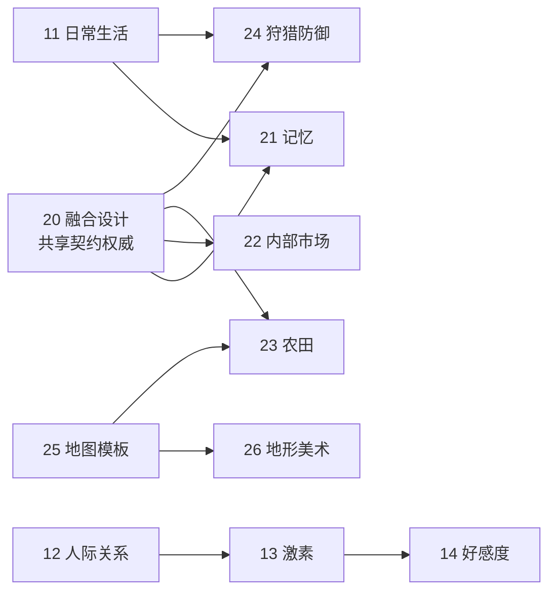

# 计划 · 在办设计与未落地方案

> ⚠️ 本目录**不代表当前实现**。当前行为以 [`../current/`](../current/)、源码与根 `AGENTS.md` 为准。
> 近期待办的唯一入口是 [`TODO.md`](../../TODO.md)。

---

## 两条入口

| 我想… | 去这里 |
| :--- | :--- |
| 讨论玩法方向、体验目标、世界观 | [`design/`](./design/) · 产品设计 |
| 讨论数据结构、状态机、接口契约、验收 | [`tech/`](./tech/) · 技术方案 |

---

## 产品设计 `design/`

| # | 文档 | 状态 |
| :---: | :--- | :--- |
| 10 | [长期路线图](design/10-roadmap.md) | M10~M18 里程碑、跨里程碑原则、风险与验证计划 |
| 11 | [人物日常生活细化](design/11-everyday-life.md) | 方向设计，未排期；八个深化方向 + 首期「一家人的一天」 |
| 12 | [人际依赖与敌对关系 × 生产](design/12-social-relations.md) | 方向分析，未排期；五条传导管道 |
| 13 | [神经内分泌调制层](design/13-hormone-system.md) | 设计稿，未排期；四轴十一激素 |
| 14 | [人际好感度系统](design/14-affinity-system.md) | 设计稿，未排期；36 条 -7~+7 态度表 |
| 15 | [竞品与同类项目分析](design/15-competitor-analysis.md) | 研究基线；六维度横向比较与可借鉴方向 |

---

## 技术方案 `tech/`

| # | 文档 | 状态 |
| :---: | :--- | :--- |
| 20 | [在办方案融合设计](tech/20-integration-contracts.md) | 跨专项共享契约权威：家庭资源/预约、L2 选策、物资与身体、土地通行、事实观察 |
| 21 | [人物记忆与经验传承](tech/21-memory-system.md) | 实施方案，未排期；P0 只记事实 → P3 家庭传承 |
| 22 | [内部市场](tech/22-internal-market.md) | 售货员撮合 + 有限订单簿（替代已废弃的 AMM 方案） |
| 23 | [农田与农业税](tech/23-farmland-agriculture.md) | 规划设计；真实劳动与搬运、产出税与库存税并存 |
| 24 | [狩猎、流寇与防御](tech/24-hunting-defense.md) | 规划设计（M18）；生命力解耦、民兵动员与公仓契约 |
| 25 | [地图模板规划](tech/25-terrain-templates.md) | T0/T1/T2/D-A 已落地；本文保留模板库与 D-B 子特征注入蓝图 |
| 26 | [地形美术与世界景观](tech/26-terrain-art.md) | 部分落地（S1/S2/P2）；剩余素材、季节调色与标注避让 |
| 27 | [性能优化](tech/27-performance.md) | 仅保留未完成项：M5-1 消除超线性（P2）、M5-2 多线程 Fork-Join |

---

## 依赖顺序（不新增排期，只表示依赖）

推进建议：先随最小切片统一家庭储备/预约、选策与物资身份；市场 P0/P1 与记忆 P0 可分别验证；
农业须具备真实劳作、搬运与土地查询后实施；地图模板 T0 先建立公共地理查询，动态路卡晚于道路失效与任务恢复。

---

## 纪律

- **规划不写入现状文档**。机制落地后，把对应章节迁入 [`../current/`](../current/) 并更新 changelog 与版本。
- 上表所有条目的详细权威定义以源文档为准，本页只做索引。
