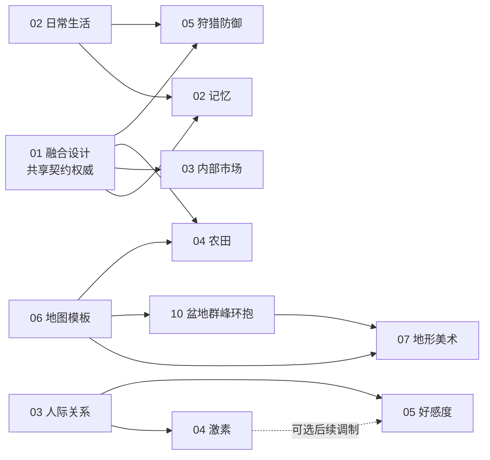

# 计划 · 在办设计与未落地方案

> ⚠️ 本目录**不代表当前实现**。当前行为以 [`../current/`](../current/)、源码与根 `AGENTS.md` 为准。
> 近期待办的唯一入口是 [`TODO.md`](../../TODO.md)。

---

## 两条入口

| 我想… | 去这里 |
| :--- | :--- |
| 讨论玩法方向、体验目标、世界观 | [`design/`](./design/) · 产品设计 |
| 讨论数据结构、状态机、接口契约、验收 | [`tech/`](./tech/) · 技术方案 |

---

## 产品设计 `design/`

| # | 文档 | 状态 |
| :---: | :--- | :--- |
| 01 | [长期路线图](design/01-roadmap.md) | M10~M18 里程碑、跨里程碑原则、风险与验证计划 |
| 02 | [人物日常生活细化](design/02-everyday-life.md) | 方向设计，未排期；八个深化方向 + 首期「一家人的一天」 |
| 03 | [人际依赖与敌对关系 × 生产](design/03-social-relations.md) | 方向分析，未排期；五条传导管道 |
| 04 | [神经内分泌调制层](design/04-hormone-system.md) | 设计稿，未排期；四轴十一激素 |
| 05 | [人际好感度系统](design/05-affinity-system.md) | 设计已复核，未排期；有向态度、防刷与生存边界；[实施任务序列](../../AFFINITY_IMPLEMENTATION_PLAN.md) |
| 06 | [竞品与同类项目分析](design/06-competitor-analysis.md) | 研究基线；六维度横向比较与可借鉴方向 |
| 07 | [狩猎、防卫与公共庇护](design/07-hunting-defense.md) | 规划设计（M18），未排期；有限狩猎、真实掠夺、自主庇护与预算兑现 |

---

## 技术方案 `tech/`

| # | 文档 | 状态 |
| :---: | :--- | :--- |
| 01 | [在办方案融合设计](tech/01-integration-contracts.md) | 跨专项共享契约权威：家庭资源/预约、L2 选策、物资与身体、土地通行、事实观察 |
| 02 | [人物记忆与经验传承](tech/02-memory-system.md) | 实施方案，未排期；P0 只记事实 → P3 家庭传承 |
| 03 | [内部市场](tech/03-internal-market.md) | 产品设计已复核，未排期；自主兼职售货员 + 实物托管 + 有限订单簿；[实施任务序列](../../INTERNAL_MARKET_IMPLEMENTATION_PLAN.md) |
| 04 | [农田与农业税](tech/04-farmland-agriculture.md) | 规划设计；真实劳动与搬运、产出税与库存税并存 |
| 05 | [狩猎、流寇与防御](tech/05-hunting-defense.md) | 规划设计（M18）；对应 design/07 的任务、接触结算、物资与存档契约 |
| 06 | [地图模板规划](tech/06-terrain-templates.md) | T0/T1/T2/D-A/D-B1 代码与 TB-01 支脊已落地，草原骨架已交付；R.3 维护 16 张模板的批次与能力前置，R.6 区分任务依赖、验收与 random 准入 |
| 07 | [地形美术与世界景观](tech/07-terrain-art.md) | 部分落地；§1 为任务总台账（TA/TB/TC 编号+难度+依赖），§6 为 Accent 季相、动态受光、LOD 与遮挡边界方案；★ 2026-09-17 渲染架构决策：**全量 WebGL、不再使用 Canvas 2D**（TC-03 改为既定路线，原 2D 遮挡近似策略取消；TA-08 任务已删除视为完成，验收矩阵并入 31 号 §8.5）；★ 2026-09-22 渲染架构决策：**TA-07 任务已取消视为完成**（实现 v1.50.65 保留且在默认 WebGL 路径下照常生效，仅剩的 Chrome 视觉验收与性能 A/B 随「已无性能问题」不再追补） |
| 08 | [性能优化](tech/08-performance.md) | 仅保留未完成项：M5-1 消除超线性（P2）、M5-2 多线程 Fork-Join |
| 09 | [植被样板验证（TA-05）](tech/09-vegetation-verification.md) | ✔ 已收口（2026-09-22 按用户口径：功能已齐，仅缺测试验证与取舍；LOAD 补测不再作为完成门槛）；验收权威在 07 号 §11.4 |
| 10 | [盆地群峰环抱（TB-04）](tech/10-basin-mountain-encirclement.md) | 规划设计（TB-04）；闭合环脊双坡解耦、向心山嘴支脊、切穿峡谷出水口与自然山间盆地地貌重构 |
| 31 | [Canvas→WebGL 渲染迁移方案](tech/31-canvas-to-webgl-migration.md) | ★ **v2.0（2026-09-17）目标形态已定：全量 WebGL、不再使用 Canvas 2D**。阶段一/二已落地（v1.50.77 双 Canvas 过渡架构；v1.50.80~82 帧率解限）；§8 阶段三~五（装饰层 / 实体层 / Canvas 2D 退役）为既定路线 |

---

## 依赖顺序（不新增排期，只表示依赖）

推进建议：先随最小切片统一家庭储备/预约、选策与物资身份；市场 P0/P1 与记忆 P0 可分别验证；
农业须具备真实劳作、搬运与土地查询后实施；地图模板 T0 先建立公共地理查询，动态路卡晚于道路失效与任务恢复。

---

## 纪律

- **规划不写入现状文档**。机制落地后，把对应章节迁入 [`../current/`](../current/) 并更新 changelog 与版本。
- 上表所有条目的详细权威定义以源文档为准，本页只做索引。
