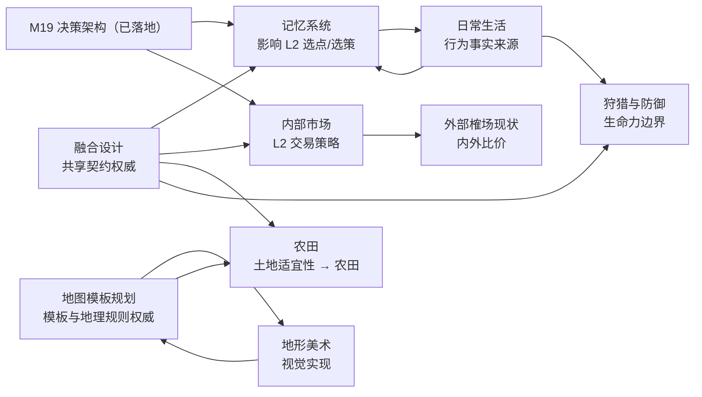

# 01. 🌊 Flow & Accord（流动公约）项目长期规划书

> ⚠️ 本文档为**规划态/愿景**，描述未来方向，不代表当前已实现。当前已实现功能见 [../../current/README.md](../../current/README.md)。
>
> **版本**：v1.50.27（本文档随 v1.50.27 现状整理）· **当前基线**：v1.50.27（确定性 Rust/WASM 内核 + 有限生态 + 四季气候与气候折线 + 代谢繁衍 + 5 级私宅 + 家户/宗族/王国/帝国账本 + M19 决策架构与决策编排 + 族谱 + 市场拍卖 + 时光倒流 + 地形模板 T0/T1/T2 + 地表装饰与植被季相 + Canvas 前端）
>
> **专项规划**：docs 根目录编号 19 及以后的专项规划信息已并入本文档第 8 节（原 `docs/plan.md` 已合并删除）。

---

## 1. 项目愿景

构筑一个**玩家规划环境与制度、居民自主组成社会、历史可以回看和分支比较**的社区尺度模拟游戏。玩家不逐个操控族人，而是通过营地规划、公共政策、资源投入和有限的危机决策改变条件；族人依据自身需求、关系、资产和继承规则生活，几代之后把这些条件演化成道路、家族、宗族与王国。

游戏的第一吸引力不是“有多少系统”，而是玩家能在短时间内认领一个具体家族，并持续追问：谁会活下来、哪座房屋会传下去、哪一条路会成为大道、哪个陌生人会改变历史。

**核心设计哲学**：

- **确定性是因果实验**：同一种子、同一 Tick、同一组干预产生同一结果；玩家可以保存、回滚、分支和复演，而不是只看一次随机演出。
- **玩家规划，Agent 自治**：玩家只改变环境、公共规则和观察焦点，不直接扫描全图替居民派发任务；所有个人行动仍由决策引擎产生。
- **家族故事是主线**：资源、道路、账本和政治都应最终回答“哪个人、哪个家庭、哪个世代因此改变”。
- **信息逐步展开**：首局先呈现生存、房屋和关系；玩家产生兴趣后再打开账本、王国、决策编排和经济分析。
- **历史可比较**：回滚不是调试按钮，而是玩家比较“如果当时做了另一种选择”的核心玩法。

---

## 2. 已完成阶段（v0.x → 当前）

以下能力已经落地，未来里程碑应优先复用它们，而不是重复建设底层系统：

| 领域 | 已交付内容 |
| :--- | :--- |
| 确定性内核 | Rust `sim_core`、共享 `WorldRng`、固定 Tick、多步推进、长程确定性矩阵验证 |
| 空间与生态 | 3D 地形、23 处有限 POI、A* 路网、踩踏成道、道路衰减、资源再生与断流 |
| 生存与代际 | 饥渴/体力/健康、四季气温、未来 49 年气候折线与厄尔尼诺振幅、供暖、受孕/流产/分娩、遗传禀赋、自然与非自然死亡、衰弱行为约束与逝者遗物归户 |
| 房屋与家庭 | 0~4 级私宅、自主选址、瞬时升级、折旧修缮、家户账本、继承与分家 |
| 社会制度 | 婚姻登记簿、宗族/族税/互助、营地王国/国王/继承/夺位远征、帝国政体（M5，v1.44.7）、公仓税与救济、国库结算重构 |
| 经济互动 | 榷场动态价格、断流采购、二手房屋拍卖、资源流水和市场历史 |
| 叙事基础 | 族谱时间轴、人物 Inspector、营地/家户/宗族/王国大盘、事件日志、历史国王档案 |
| 玩家工具 | 决策顺序热注入、资源产速调节、倍速/无头模式、Checkpoint + Replay 时光倒流、主题切换、本地存档 |
| 工程底座 | Worker 与 Canvas 解耦、WASM 双副本、配置校验、确定性/快照/前端门禁、CI/CD |
| 决策架构（M19） | 意图/策略/执行三层解耦（v1.46.8~v1.46.10）：`ActiveTask` 单一真相源、分级任务抢占矩阵、禀赋与家资个性化选策、多品类采收预排队列与 TSP 行程优化、决策行动中枢三栏看板（详见 §8.2） |
| 地图模板（T0/T1/T2） | 静态地形模板基座（v1.47.1~v1.50.19）：T1 山口聚落（主脊通行力 T1-R 修复，v1.50.17）、T2 两岸河谷水系/浅滩走廊/地形感知路网、地形栅格分辨率配置化、生成器版本 4（详见 §8.1 专项 22） |
| 地形美术与植被季相 | S1/S2/P2 渲染基底与统一深度队列、D-A 地表装饰系统（v1.49.1）、TA-01 装饰三件套（v1.50.23）、TA-02 连续植被季相 `SimTreeTint.sample()`（v1.50.24）、TA-03 局部三维枝干骨架 + 两遍式树冠（v1.50.25~v1.50.27）、动态季节光照（v1.48.0）（详见 §8.1 专项 21） |
| 性能底座（M5-0 收尾） | 快照下发降频 30Hz、家户存续索引、M4 快照零拷贝扁平二进制缓冲、移除 JSON 快照通道（v1.44.3~v1.46.0）；剩余 M5-1/M5-2 见 [08 性能优化](../tech/08-performance.md) |

> 现状判断：内核的“社会模拟宽度”已经足够形成独特卖点；当前缺口是首次进入门槛、观察焦点、事件因果可读性和有限但有意义的玩家规划。

---

## 3. 未来里程碑（规划态）

> 以下顺序按**玩家价值与验证成本**排列，不承诺具体日期。每个里程碑都应先以可玩的垂直切片验证，再扩展机制规模。

人物与家庭生活的专项方向见 [人物日常生活细化规划](./02-everyday-life.md)：以家庭分工、做饭、幼儿照料和生活观察组成首期“一家人的一天”，再评估邻里互惠、技能传承与康复等内容。该规划连接下述家族故事、记忆与分工方向，尚未实现或排期。

地形与画面表现的专项方向见 [地形美术与世界景观提升规划](../tech/07-terrain-art.md)及[地图模板总纲](../tech/06-terrain-templates.md)：渲染基底（S1/S2/P2）、地表装饰系统（D-A）与植被专项波次一（TA-01~03：装饰三件套、连续季相、三维枝干骨架与两遍式树冠，v1.50.23~v1.50.27）已落地；地图模板总表已扩至 16 张，其中 T0/T1/T2 已实现（T1 主脊通行力修复见 v1.50.17），2026-09-12 新登记平地草原 `grassland_plain_v1` 与半坡林地 `hillside_woodland_v1`；**2026-09-13 起 16 张模板全部纳入 [地图模板规划 R.3 阶段计划](../tech/06-terrain-templates.md)**（阶段五～八为主体批次、九a～九d 为远期批次）。后续待做：TA-04 世界光向动态受光与 TA-05 样板闭环、D-B 子特征注入与 RockCluster/GrassTuft，随后按 R.3 依次推进台地/盆地绿洲/冲积扇/湖畔盆地等 P1 模板与 T4 动态水文。地形方向以地图模板为主轴组织，负责模板清单与地理规则/技术契约；落地明细以 [现状 · 地形与路网](../../current/tech/14-terrain-and-network.md) 与 changelog 为准。

### 3.5 M14 · 交换、分工与资源政治

**目标**：在玩家已经关心家族和营地之后，让经济系统产生更清楚的比较优势与社会冲突。

内部市场的专项方案见 [内部市场方案：售货员撮合、场地中介与有限订单簿](../tech/03-internal-market.md)：交易由集市场地中介、雇佣售货员（真人族人）撮合完成，买卖双方挂单进入有限订单簿按价格/时间/ID/信任优先配对，黄金与资源强守恒；濒危家庭可用木石金换水粮、富余家庭可用余水余粮换木石金，首期全图只设一个独立居民市集。该方案已取代早期 AMM 恒定乘积池口径（见 §8.1 口径变更注），尚未实现或排期。

- 将黄金逐步扩展为通用交换媒介，允许供需形成价格和专业化分工。
- 让高力量、高智力、不同家族传统与道路条件影响职业倾向，但不绕过 Agent 自主决策。
- 将固定税率、救济和 POI 公地规则变成可观察的制度变量，提供分配、贫富差距、资源诅咒和冬季存储视图。
- 先实现一个资源或一座营地的纵向切片，再决定是否扩大为完整专利经济。

### 3.6 M15 · 政治资本与混合政体

**目标**：让王国制度成为玩家可以比较的社会实验，而不是先增加一层抽象数值。

- 民意、技术、资本、强制、宗法和意识形态六维政治资本按事件、税制、财富与继承积累。
- 特权法案必须改变道路、贸易、救济或继承的实际反馈，并带来维护成本。
- 支持国王下台、隐退、复仇和重新夺位的多条路径，避免单一胜负条件。
- 先展示制度对家族生活的影响，再考虑生成式称号和长篇政治文本。

### 3.7 M16 · 生成式社交与编年史（可选）

**目标**：让生成式文本润色已经发生的事实，不替代模拟器制造事实。

- 模板即时生成事件摘要，LLM 异步生成小报、日记和人物口吻版本。
- 所有文本引用可追溯的 Agent、Tick、账本流水和关系变化；生成失败时不影响核心游戏。
- 先支持家族年表和重大事件，暂不把 LLM 作为每日决策器或隐藏随机源。

### 3.8 M17 · 规模化内核（按需）

**目标**：只有当玩家内容和性能数据证明需要时，才进行 ECS、零拷贝快照和更大人口规模重构。

- 继续用现有性能基准决定是否迁移 ECS；架构升级不能先于玩家价值验证。
- 保持 WASM Worker、存档、回放和快照的确定性契约。
- 任何底层重构都必须以旧种子逐字节回归为发布门槛。

### 3.9 M18 · 生态狩猎、流寇危机与武力公约演化

**目标**：引入生产型武力（打猎）与防御型武力（御寇），以外部生存危机推动公仓契约与社会秩序的建立。（详细设计稿见 [../tech/05-hunting-defense.md](../tech/05-hunting-defense.md)）

- **生态狩猎（PvE 生产）**：引入野鹿/猛兽等轻量漫游 POI，青壮年男性自主追踪围猎；产出高能肉食与御寒兽皮（削减寒冬 50% 烧柴消耗），搏斗失败面临负伤与猛兽扑杀风险。
- **流寇掠夺（PvE 防御）**：边境游寇与极寒濒死堕落流民沿 A* 路网入侵，劫道、破门洗劫私宅账本乃至攻打营地公仓。
- **公约与防卫制度**：警钟拉响时老弱避难入 1~4 级坚固私宅（坞堡效应）；民兵自主动员阻击；公仓支付击杀赏金并抚恤战死孤寡，确立“税赋换安全”的社会契约。
- **生命力与伤病解耦**：解耦自然寿命与实战血量（`vitality`），阵亡因果链与功勋记入族谱与家族时间轴。

---

## 4. 跨里程碑核心设计原则

| 原则 | 说明 |
| :--- | :--- |
| **确定性红线** | 新随机消耗走 `WorldRng`，同一种子/配置/时间线/干预必须可复现；穿越者不能拥有未入档的隐藏随机状态 |
| **玩家规划、Agent 自治** | 玩家改变环境、公共规则和观察焦点；禁止系统扫描全图强制切换个人状态 |
| **时间线明确** | 回滚、穿越和实验均标注原时间线与新分支；不静默覆盖原历史 |
| **故事事实优先** | 先由内核产生事件，再由模板或 LLM 描述；文本不能改变账本、关系、死亡或继承事实 |
| **家族可追踪** | 重要事件都能从事件卡跳转到人物、房屋、家户、营地、王国或族谱 |
| **渐进复杂度** | 首局展示生存/房屋/关系，中期展示家户/道路/市场，长期运行后再展开政治/经济分析 |
| **快照完整同步** | 新增字段遵循[根指南 §4.5](../../../AGENTS.md#45--快照与前端字段四处同步-m4-起v1453)与[影响矩阵](../../current/tech/29-impact-matrix.md)，覆盖结构、生产者、FABS 编解码及前端映射 |
| **配置集中化** | 新增规则参数同时进入 `config.rs`、前端配置和 `config-check.js`；不散落行为字面量 |
| **持久化测试禁令** | 不提交临时单元测试；长期验证使用 `test-wasm.js`、`test-determinism.js`、`frontend-check.js` 等门禁 |

---

## 5. 核心风险与应对

| 风险 | 应对策略 |
| :--- | :--- |
| 首次进入被文件权限挡住 | 临时世界立即可玩，本地文件保存改为主动选择 |
| 信息很多但玩家不在意 | 首局认领一个家族，围绕该对象聚焦镜头、事件和时间线 |
| 纯观察导致无力感 | 采用低频、带成本、带延迟的环境和公共政策干预 |
| 复杂度吓退新玩家 | 渐进式解锁高级面板；首局不展示全部账本和配置工具 |
| 事件日志变成流水账 | 只提升关键事件，记录原因、受影响对象和后续结果 |
| 穿越造成因果悖论 | 采用来源时间线 + 新分支；穿越者记忆不等于当前时间线必然未来 |
| LLM 文案与事实不一致 | 模板先行、结构化事实输入、异步失败可降级、LLM 不消耗 RNG |
| 继续堆系统却没有留存 | 每个里程碑先做垂直切片，以首局完成率、再次打开率、家族追踪和分享率验证 |
| 底层重构消耗大量时间 | 只有性能数据和人口规模明确证明需要时才启动 M17 |

---

## 6. 玩家体验验证计划

每个涉及新玩法的里程碑都先验证四个问题：

1. 玩家是否在第一次进入后立即开始观察，而不是先处理设置和存档。
2. 玩家是否能说出一个具体人物或家族，而不只是人口、资源和 Tick 数字。
3. 玩家是否能理解一次关键事件的直接原因和后果。
4. 玩家是否愿意回到同一世界、尝试另一种规划，或分享一个可复现的历史分支。

测试优先观察行为而非询问“你喜不喜欢”：首次点击族人的时间、第一次打开族谱的时间、首次使用回放的时间、首局运行时长、重新打开同一存档的比例，以及玩家能否复述一个家族转折。小规模测试用于发现理解障碍，扩大测试后再判断留存和传播。

---

## 7. 远期定位

Flow & Accord 不需要成为 RimWorld 的战斗版，也不需要成为城市：天际线的建筑版。更清晰的定位是：

> **玩家规划一个社会，居民自主活出一段可以回放、比较和分享的家族史。**

道路、房屋、账本、市场、王国和 NPC 穿越都服务于这个定位。未来最有价值的新内容，应优先回答一个问题：它是否让玩家更关心某个人、某个家庭或某个历史分支。

---

## 8. 专项规划索引

> 本节**只做索引**。各专项的权威定义与实施细节一律以源文档为准，本节不复制正文——
> 过去本节逐篇聚合正文，导致同一方案在两处各写一遍并逐渐漂移（如内部市场的 AMM 口径已被取代却仍留在此处）。
> **已落地的专项迁入 [`docs/current/`](../../current/README.md)，不再在此维护。**

### 8.1 专项清单一览

| 专项 | 主题 | 状态 | 权威文档 |
| :--- | :--- | :--- | :--- |
| M19 | 部落民 AI 决策架构：意图—策略—原语三层解耦 | ✅ 全阶段落地（v1.46.8 ~ v1.46.10） | [现状 · 32 M19 决策架构](../../current/tech/12-m19-architecture.md) |
| 20 | 人物日常生活细化 | 📋 方向设计，未排期 | [02 日常生活](./02-everyday-life.md) |
| 21 | 地形美术与世界景观提升 | ◐ S1/S2/P2、D-A 与 TA-01~03 已落地（v1.50.23~v1.50.27）；TA-04~TA-09、D-B、S3、缓存/LOD 未实施 | [07 地形美术](../tech/07-terrain-art.md) |
| 22 | 地图模板与地形要素 | ◐ T0/T1/T2/D-A 已落地（生成器版本 4）；P1 三 profile、T1/T2 子特征注入、D-B/D-C、T4 动态水文未实施；2026-09-13 起 16 张模板全部纳入 06 号 R.3 阶段计划（阶段五~八主体 + 九a~九d 远期） | [06 地图模板规划](../tech/06-terrain-templates.md) 已落地基座：[现状 · 40 地形与路网](../../current/tech/14-terrain-and-network.md) |
| 23 | 人物记忆与经验传承 | 📋 实施方案，未排期 | [02 记忆系统](../tech/02-memory-system.md) |
| 24 | 内部市场 | 📋 未排期（AMM 方案已废弃） | [03 内部市场](../tech/03-internal-market.md) |
| 25 | 在办方案融合设计（跨专项共享契约） | 📋 已确定，未实现 | [01 融合设计](../tech/01-integration-contracts.md) |
| 17 | 农田与农业税 | 📋 规划设计，未排期 | [04 农田与农业税](../tech/04-farmland-agriculture.md) |
| 18 | 生态狩猎、流寇危机与武力公约（M18） | 📋 规划设计，未排期 | [05 狩猎与防御](../tech/05-hunting-defense.md) |
| 16 | 性能优化 | 📋 仅保留未完成项 | [08 性能优化](../tech/08-performance.md) |
| — | 人际依赖与敌对关系 × 生产 | 📋 方向分析，未排期 | [03 人际关系](./03-social-relations.md) |
| — | Agent 神经内分泌调制层 | 📋 设计稿，未排期 | [04 激素系统](./04-hormone-system.md) |
| — | 人际好感度系统 | 📋 设计稿，未排期 | [05 好感度系统](./05-affinity-system.md) |
| — | 竞品横向分析（六维度 × 9 个开源项目） | 📄 研究基线（v1.45.4 现状），非实施方案 | [06 竞品分析](./06-competitor-analysis.md) |

> ⚠️ **口径变更**：原「内部市场 · AMM 恒定乘积池」方案已被**售货员撮合 + 有限订单簿**取代
> （理由：AMM 需有限开局资本冷启动，且小额需求下价格曲线偏离直觉；撮合方案在人类学真实度与叙事可观察性上更强）。
> 旧 AMM 口径不再作为实施依据。

### 8.2 跨文档共性约束

| 约束 | 说明 | 适用 |
| :--- | :--- | :--- |
| 确定性红线 | 新随机消耗走 `WorldRng`；同种子/配置/Tick/干预逐字节可复现；装饰/视觉/记忆/只读报价不消费共享 RNG | 全部 |
| Agent 自治 | 一切「去哪里/做什么」由决策引擎产生；禁止系统扫描全图强制派任务或改写状态 | 记忆 · 市场 · 地形 · 日常生活 |
| 家户账本唯一真相源 | 家庭储备只有账本一份；记忆不建虚拟库存、设施不另建储备真相源、市场池库存独立于家户账本 | 记忆 · 市场 · 日常生活 · 农田 |
| 快照同步链 | 新字段同步 `snapshot.rs` → `world_snapshot.rs` → `snapshot_bin/encode.rs` → `snapshot-bin.js` + `rustworld.js` | 全部 |
| 配置集中化 | 新超参进入 `config.rs`（命名 const + 字段 + Default 三处）+ 前端配置 + `config-check.js` | 全部 |
| 存档纪律 | `SAVE_FORMAT_VERSION` 仅在结构不兼容时升级并同步前端；新增行为状态必须持久化，读档不得重规划/重掷点/重发资本；旧应用版本存档拒绝加载 | 记忆 · 市场 · M19 |
| 版本与 WASM 双副本 | 改动后统一升版器升版、重编译并同步 `frontend/rust/` 与 `frontend/` 双副本 | 全部 |
| 持久化测试禁令 | 临时验证脚本/断言用后即删；长期验证走 `test-wasm.js` / `test-determinism.js` / `config-check.js` / `frontend-check.js` | 全部 |
| 性能配对基线 | 同机器/同配置配对相对基线，决策与内核耗时增长 ≤5%；报价只在决策/交易发生时计算，不逐 tick 全人口扫描 | 记忆 · 市场 · 性能 |
| 文档纪律 | 规划不写入现状文档；机制落地后迁入 `docs/current/`，并同步局部 AGENTS、changelog 与版本 | 全部 |

### 8.3 文档间关系

- **M19 ↔ 记忆**：记忆效果注入 L2 选点/选策与个性化阈值，但 `ActiveTask` 仍是持续任务真相源，记忆不得写 `state`/路线/pending。
- **M19 ↔ 市场**：内部交换是 L2 候选策略之一，交易计划存入 `ActiveTask` 走统一 transition，不另造竞争状态机；交易属持续任务而非瞬发，不复活独立 b15 商贸需求。
- **地形美术 ↔ 地图模板**：模板规划是地形种类/生成/通行/选址/水资源语义的权威；美术只做材质、光照、素材、遮挡、缓存与视觉性能，装饰不得反向决定地理规则。
- **地图模板 ↔ 农田**：共用地块查询；天然土壤适宜性与农业 `fertility` 资产状态分开，避免同一肥力优势重复计算。
- **日常生活 ↔ 狩猎防御**：可恢复身体状态与生命力（`vitality`）统一边界，避免重复建模。
- **日常生活 ↔ 记忆**：进餐、照料、授艺等记忆需对应日常行为落地后接入；记忆方案首期复用既有生存/采收/采购/房屋事实。
- **市场 ↔ 外部榷场**：内部撮合与外部榷场分工互补——外部向世界供给水粮木、黄金流出，内部在居民间双向调剂真实存量；外部报价只供选策、不改内部池余额。
- **记忆 ↔ 市场**：共用融合设计的 L2 选择器与家庭保护/预约查询；记忆不能被富裕选策提前返回绕过，危机时效不受偏好改变。
- **与本文档里程碑的关系**：日常生活连接 M12 家族记忆与家族故事主线；地形/模板服务于世界景观与地理玩法方向；记忆是 M12 的行为层技术方案；市场是 M14 的首个纵向切片；M19 已为 M16 等叙事类功能提供可解释的决策透视基础。

### 8.4 实施顺序

跨专项规则统一以 [01 融合设计](../tech/01-integration-contracts.md) 为权威，领域正文保留自身生产、交易和表现规则。
建议先随首个消费者落实共享契约，再分别验证市场最小闭环与记忆事实记录；
农田完成劳动运输与土地查询后接入；日常生活与狩猎复用物资与身体模型。
实际排期由 [`TODO.md`](../../../TODO.md) 管理，不把设计修订写成已实现功能。
