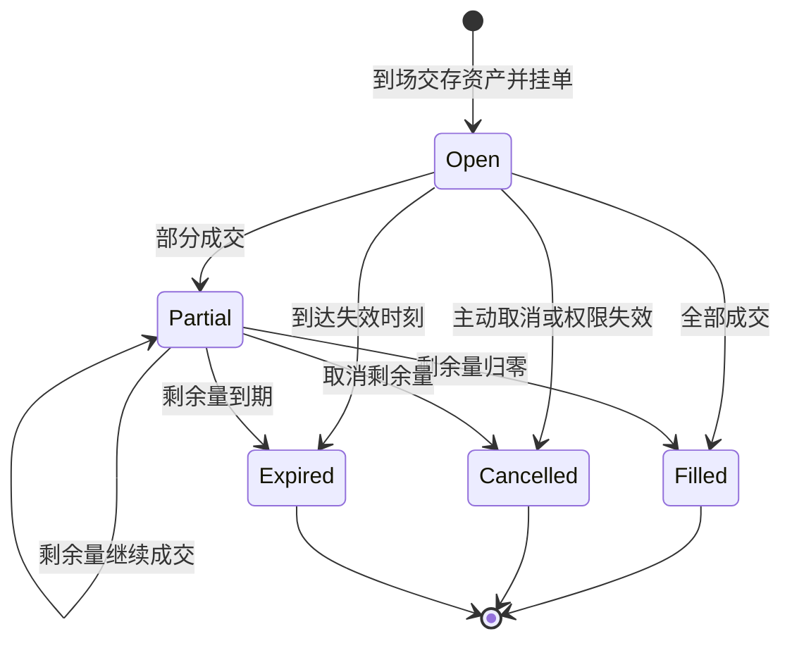

# 03. 内部市场方案：售货员撮合、场地托管与有限订单簿

> **状态**：产品设计已复核，尚未实现、未排期；不描述当前运行行为。
> **复核日期**：2026-09-14。
> **范围**：单市集、真人兼职售货员、四品类限价单、实物托管、家庭交换与生存边界。
> **入口**：[文档导航](../../README.md) · [融合契约](./01-integration-contracts.md)。
> **分工**：本文维护产品规则；按用户要求导出的[技术实现方案与任务序列](../../../INTERNAL_MARKET_IMPLEMENTATION_PLAN.md)维护代码接入、算法、数据结构和验收。审查问题及修复记录见该方案 §1。

## 状态机

订单、货物和人物任务各有不同生命周期。订单终止仅解除冻结，货物仍留在市集待领取；不得把“撤单”解释为远程送货回家。

每张订单独立判断完成；一次撮合不要求买卖两张单同时清零。成交部分不因另一部分失败而回滚。终态释放剩余冻结到同所有者的市集可领取余额；领取、现场消费及搬回家是后续动作。

**不变量**：

- 家户现货在家户账本、在途物资在行囊、市集物资在托管账户，各只有一份；订单仅引用托管冻结，不另存一套资产余额。
- 内部交易黄金不增不减；买方支付 = 卖方净收入 + 售货员佣金。消费、外部进出口及既有损失单列。
- 任意挂单都须全额担保，无负余额、裸卖、信用金、虚拟对手盘或免费做市本金。
- 人物去向仅由马斯洛决策入口分派；市场执行器只结算已授权动作，售货员岗位不凌驾于生理需求。

## 1. 设计目标与首期边界

让有资产但缺资源的家庭，通过居民间交易取得水粮或建材；真人售货员提供在场撮合服务并收取佣金。市场重新分配已有资源，不能创造已经耗尽的水粮，也不保证穷人获救；无偿救济仍由既有社会互助承担。

典型闭环必须有真实资金：甲有余石，乙有余水及黄金且需要石料。乙先用黄金买甲的石，甲获得扣佣后的黄金，再买乙的水；售货员收到两次成交佣金。只有甲卖石、乙卖水两张卖单时不能成交；双方都无金也不能靠两腿交易凭空启动。不引入易货或清算信用掩盖这个限制。

### 1.1 当前实现边界

- 当前外部榷场是黄金购买水、粮、木的独立机制，黄金流向外部；仍保留其既有远程家户黄金支付能力。
- 当前 `decisions/market.rs` 已把采购作为资源意图的 L2 策略；不能复活独立 b15 商贸分支。旧[外部市场文档](../../current/tech/09-market-pricing.md)存在历史描述，接入位置以源码及[M19 架构](../../current/tech/12-m19-architecture.md)核对。
- 家庭资产归属依循现有账本、婚姻和继承体系，不为职业另造强制迁籍或宿舍家庭。

### 1.2 交付范围

首期包含一处无资源再生的市集、水/普通粮/木/石四张订单簿、黄金支付、一个兼职售货员岗位、有限托管、挂单与立即成交限价单、家庭提货和往返运输。熟食、生肉不自动加入普通粮。

自营做市、公共资本分红、固定工资、多个市集、信贷、直接易货、无限市价单、专业套利、税制修改均后置。好感度可在基础闭环稳定后独立接入，不阻塞市场首期。

## 2. 谁在什么情况下交易

### 2.1 濒危交换

由原有解渴、觅食或家庭水粮需求产生。候选必须有合法资产、有效路线、能满足最低自救量的当前真实深度，并计入返家、装货、赶路、服务排队、领取和消费时间。家中资产不等于途中已经可支付。

黄金可直接购买；木石须先有真实买单接货，再有目标水粮卖单供货。两腿净收益和佣金须逐腿核算，排除同户自成交。优先出售无近期用途的石、超过最低供暖保留量的木，且只出售本次救命预算所需量。不能以“反正可能有人来买”作为濒危方案的可行性证明。

危机交易采用有价格上限和最迟退出时刻的立即成交限价单；剩余量立即取消，不续期等待。到场先复核两腿及最低救命量；第一腿成交后第二腿仍有竞争风险，不承诺跨品类原子性。第二腿失败时保留实际货款，经统一选策选择可及时到达的其他补给或退出，不能恢复已卖货物。

### 2.2 普通交换与空簿启动

普通采购允许持金补货；水粮有盈余且木、石或金目标采集断流时，可出售盈余满足该目标。买目标资源需要该资源的**卖单**，出售筹金需要所售资源的**买单**；黄金是收入目标而非第五张商品簿。b13 的住宅等级等守卫完整保留。

普通任务可在没有对手单时带真实资产到场挂有限期限价单，不把当前可交叉深度设为所有任务的出发条件。这是空簿启动途径：资金充足的需求方可先挂买单，盈余家庭可先挂卖单。只有两张卖单或社会黄金不足时允许零成交，不自动造金或强制派人采购。

首次无历史成交时使用配置化的四品类参考价作为报价起点，不是政府收购承诺。已有可成交报价且满足预算时优先成交；否则普通单按参考价/最近有效成交价和自身预算形成限价，到期后由人物重新评估是否改价。卖价代表卖方愿意接受的佣金前价格；计划必须同时展示净收入。具体算法见实施方案。

保护量与预约按[融合设计 §2](./01-integration-contracts.md#2-家庭资源保护与可支配余额)计算：

`可出售量 = max(0, 家户现货 − 保护储备 − 其他有效未提取预约)`

启动须额外超过出售余量，降到保护线停止；家庭预测覆盖全体成员和任务往返，已有记忆阈值不能忽略。已挂出的待售水粮仍须在家庭保护需求变化后复核，必要时撤单转待领取；托管货物不能被当作在家即可吃到的补给。新需求优先通过正常决策取回或寻找更及时的补给。

任务完成原始需求后退出；同一计划不得卖出后又买回同品类，不无限倒买倒卖。失败冷却和价格切换滞回只限制普通交易，不阻挡生理抢占。

### 2.3 权限

- 常规家庭交换沿用户主权限；每户同时至多一个市场提货预约，与其他承诺共用可支配余额。
- 新增受限成年成员自救授权：可在家提取本人最低水粮自救及必要返程预算，记录用途、来源家户、上限和受益人；不扩大其常规家财处分权。
- 紧急消费可挤掉低优先级未提取预约；不能抢走别人已携带资产。木材仍留安全期最低供暖量。
- 无家户成年人只使用合法持有的随身资产。首期可领取购买水粮并现场自用，不开放无家宅者常规采收装袋或一般囤货；多余采购留托管待领。
- 儿童和胎儿不单独经商。货物归属与搬运人分开记录，家庭授权货物不能冒充搬运人的私产。

## 3. 集市场地与售货员

### 3.1 场地

世界初始化时，在已有营地附近合法、可接入路网的位置确定性放置一处市集；不承诺所有断连路网人物都能抵达。无合法位置则不生成并显示原因。不增加原有自然点产量、不借用外部 `Market` 库存，不强制搬迁居民。

场地管理归属地区（不存在则世界），托管资产始终属于委托人，与公共所有权分离。地区变更只改管理归属，不没收货物。每品类托管容量、每户订单上限、全场订单和每拍撮合上限均有限。

开市要求售货员在场且正在合法值守。无人值守暂停新挂单和撮合；到期、撤单、继承和到场取回继续运行。这些是保管结算，不是无人自动经营。关闭场地先撤单，保留可达领取点，清空托管前不能删除实体。

### 3.2 自主应聘与值守

首期为一个兼职岗位，无强制离家、迁籍、固定退休年龄或每届换人。人物在已有 `AcquireGold` 意图下，可把值守作为 L2 挣金策略：成年、有自主劳动能力、有相应黄金需求、满足原分支守卫且更高需求允许时自主应聘。按预计佣金收益与时间成本比较，收益无保证。

空场无成交记录时允许有严格时长上限的试岗，随后依实际收入、需求完成和冷却退出，不能承诺基础工资。多名人物同拍申请时以现有魅力/智力综合分及稳定人物 ID 选一名；系统只裁决已提交的申请，不扫描全图强制指定最聪明的人。

任职者保留家户、住宅、婚姻及普通代谢，正常回家补给或休息。上岗租约限定最长本次服务时段；生理抢占、死亡、失能或主动退出立即停止服务、释放岗位，下一位仍须自行申请和步行抵达。怀孕不自动等于失能，资格只用当前实际身体能力和任务守卫。

### 3.3 报酬与中立

每次真实成交只向卖方抽一次佣金，归当时在场售货员的随身黄金，按既有归户/继承规则处理。无虚拟工资、市场留存分成或自营头寸。需求已满足或收益过低时人物可以不再值守，休市是合理结果。

售货员不能调整客户限价；其本人及所属家户在其值守期间的订单暂停参与撮合，避免借职权给自己赚佣和刷往来。订单期限继续计时，换班后可恢复参与。所有同一资产所有者/同户买卖单都禁止互相成交。

## 4. 订单、价格与佣金

### 4.1 托管和有限订单簿

卖家必须实际带货到场交存，买家实际携金到场交存；市集可领取黄金可在现场再次授权下单。内部市场不新增远程家户扣款。

卖单冻结剩余货量；买单冻结剩余量按限价计算的最大货款。托管账户区分可领取与冻结，累计成交量仅用于记录，不能当作额外库存。买入货物留在买方托管，售货款留在卖方托管，均须本人或当前合法家户代理到场领取。

每人离场前可撤单或保留已授权普通挂单至到期。主动离场保留挂单不代表仍运行交易任务；更高需求抢占则取消该任务未成交挂单。重新领取托管属于相关资源需求的 L2 候选，经 `ActiveTask` 驱动。

### 4.2 确定性撮合

买单按价格降序、提交时间升序、订单 ID 升序扫描；对当前买单，合格卖单按价格升序、时间升序、可选关系破平、订单 ID 升序选择。无合格对手时跳过该买单，不让自成交禁令挡住其他合格交易。关系默认关闭。

只有买限价 ≥ 卖限价才成交，数量为双方剩余量及合法接收容量的较小值。成交价取较早提交的挂单限价；同 tick 用订单 ID 判先后。这给后来的交易者确定的当前深度报价，避免原稿中“均价成交”和“卖一报价”口径分裂。

卖方净收入、佣金、买方支出使用同一结算结果：

`买方支出 N = 成交量 × 成交价`

`卖方净收入 = N − 手续费 F；售货员收入 = F`

费率首期建议 30 BPS（0.3%，待实验），只向卖方收取，不再给买方报价额外加佣。买单限价高于成交价时差额立即转为可领取黄金；剩余订单仍只冻结其限价所需金额。数值舍入和拆分成交规则见实施方案。

### 4.3 到期与容量

普通单到期即取消剩余量，不存在自动续期或等待售货员通知的中间状态。人物可在现场重新授权下单，获得新时间优先级；改价及加量同样失去旧优先级。

订单上限和托管容量不足时拒绝新承诺，不挤掉别人订单、不删除资产。买单须预留对应货物接收容量；成交只是所有权转移，不能使市集实物超容。可领取物资没有强制过期销毁，归同所有者合并，长期不领可能堵塞市集并在 UI 明示。

## 5. 搬运、消费与社会变化

一次任务：`资源需求 → 选策 → 必要时返家及预约 → 按速率装货 → 到市交存 → 下单/成交 → 领取/现场自用 → 返家卸货`。水粮木石仍为每类独立行囊容量；现场消费优先处理紧迫水粮需求，不靠等待空背包才能救命。

| 事件 | 资产变化 | 位置约束 |
|---|---|---|
| 家庭提货 | 家户减、行囊增；预约等量减少 | 到家且按实际装载量 |
| 交存 | 行囊减、市集可用增 | 到场；冻结是托管内部分类 |
| 成交 | 买方金减、卖方净金及售货员金增；货物变更所有者 | 在场售货员服务，客户可已离场 |
| 撤单/到期 | 剩余冻结转可领取 | 不远程加回行囊或家户 |
| 领取/消费 | 市集减、行囊增或记真实消费 | 到场且有权限；容量/速率有效 |
| 返家卸货 | 行囊减、家户增 | 既有卸货流程 |

人物死亡取消其委托未成交单；行囊只走一次既有死亡资产处置。市集资产单独变更合法受益权，保持原位置，不再作为死亡行囊重复归集。家庭货物仍归原合法家庭；个人货物按继承结果接续。家户分拆、成婚转籍或解散时，先失效旧授权，再用既有产权分配结果更新托管权属，不能按搬运人的新家户任意划走原家资产；无继承者归既有公仓主体，仍在市集待领取。

普通税收基数不因托管增加第二份现货；首期不把托管权益自动加入现有家户现货税基，也不借市场发明新税。分别展示家庭现货与市集权益，长期实验观察托管带来的税负偏移；如显著影响制度，另行设计权益税，不能暗中重复扣税。

## 6. 选策与危机退出

统一遵循[融合设计 §4](./01-integration-contracts.md#4-统一-l2-选策与记忆接入)，不另建市场采购仲裁器。

- 内部购买成本逐档模拟真实成交规则；内部出售使用扣佣净收益。两腿必须同时证明出售需求和购买供给，并扣除可能的共同对手预算竞争。
- 外部成本复用现有库存、逐步结算和自救逻辑；只比较外部也售卖的水、粮、木。石没有外部报价。
- 危机只接受当前深度能够覆盖最低救命量的方案；既有排队量和每拍服务上限进入等待时间，不用过去成交量倒推出“必能成交”。出发报价只读、无担保，到场重新校验。
- 普通无对手挂单独立标记为“等待出售/求购”，不能冒充可立即交货候选；等待有上限，服务中断及时退出。
- 优先更及时取得最低救命量，再考虑资产牺牲；高优先级需求抢占不得被疲劳回家或市场冷却覆盖。切到非移动态统一走既有 transition 与 `enter_stationary_state()`。

## 7. 观察与解释

市集 Inspector 展示营业状态及原因、售货员、四品类可执行买卖深度、可领取/冻结库存、容量占用、最近成交和佣金。无成交参考价标为“报价参考”，旧价标注时间，不伪造实时行情。

人物展示本次目标、支付来源、预计到达/退出时间、挂单状态、部分成交、待取货及失败原因；家庭展示在家现货与市集权益，不能把托管水粮显示为在家可食用。

行情计算器显示同量买入总支出和卖出净收入，交易记录关联订单和每笔执行编号。宏观指标包含无流动性比例、岗位空缺率、挂单等待/取消率、实际自救后存活、内部黄金流转、佣金及外部黄金流失。

## 8. 好感度接入（后置）

以[05 好感度 §6](../design/05-affinity-system.md)为权威；技术依赖见[AF-10/11](../../../AFFINITY_IMPLEMENTATION_PLAN.md)。只在同价同时间合格卖单中以双方有向态度较小值破平；不改价佣、不设敌意拒单，售货员个人喜恶不参与。

实际履约才生成普通往来事实，同买卖委托订单对只发一次，跨订单仍受人对冷却约束。正常缺货、合法撤单不惩罚好感，不能拆单刷分。

## 9. 阶段与验收边界

| 阶段 | 范围 | 出口 |
|---|---|---|
| P0 | 托管、有限簿、费用、关闭回收、存档基础 | 临时构造交易可逐笔复算，生命周期资产不丢失 |
| P1 | 自主兼职、搬运、双侧挂单及最低救命闭环 | 自然 Agent 能提供供需和服务；有金条件下两腿完成，无金诚实失败 |
| P2 | 完整普通交换、统一选策、观察及可选好感 | 空簿可启动，家庭保护无机械震荡，托管可解释 |
| P3 | 多季节、多代平衡与性能 | 控制初始总资产比较开关效果；给出休市、贫困与税负偏移结论 |

不要求“所有交换循环参与者都不盈利”：相对价格变化可使某家庭获利，售货员佣金也不是全世界泄漏。验收要求每次交易和任意封闭序列的全世界黄金守恒，固定外部条件下没有舍入、退款、对敲或重复领取造钱路径。

技术任务、极端案例和门禁统一见[实施方案](../../../INTERNAL_MARKET_IMPLEMENTATION_PLAN.md)。实施前不修改当前版本，不把规划写成已落地机制。
