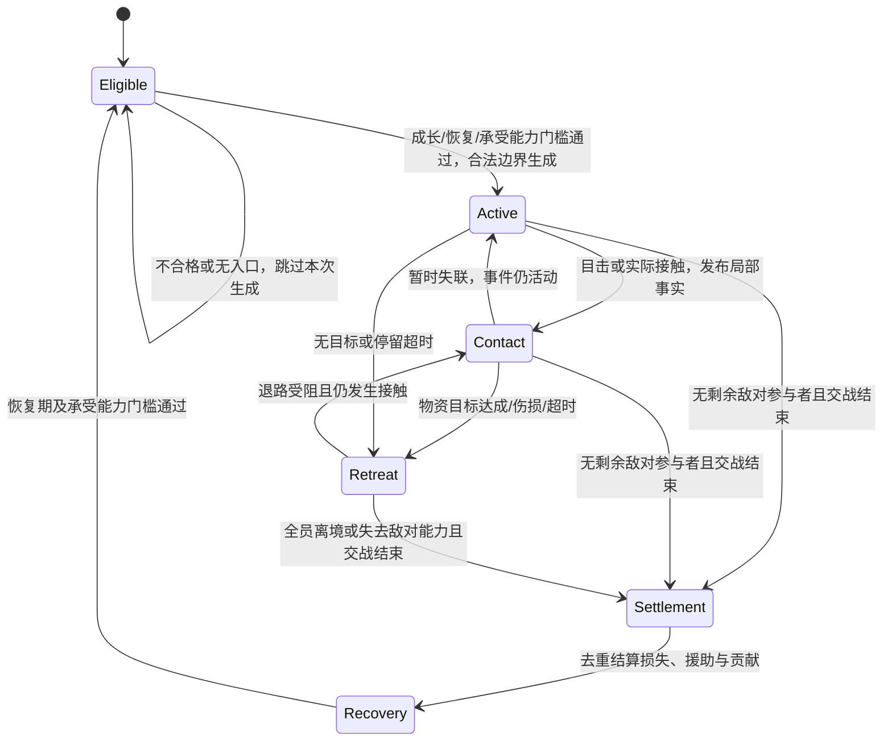

# 05. 狩猎、流寇与公共防卫技术方案（M18）

> **状态**：规划设计，尚未实现、未排期；2026-09-13 按机制优化同步。
> **玩法权威**：[07 狩猎、防卫与公共庇护设计](../design/07-hunting-defense.md)，维护动机、收益、风险、公共政策与体验验收。本文维护执行契约，不重复设定玩法数值。
> **跨专项权威**：[01 融合设计](./01-integration-contracts.md)。实现须遵守[根 AGENTS.md](../../../AGENTS.md)、[决策架构](../../current/tech/12-m19-architecture.md)、[账本体系](../../current/tech/07-ledger-and-polity.md)与对应局部指南。

## 状态机

入侵事件只维护环境事实与结案生命周期，不是向 Agent 派任务的指挥器。局部警报有独立的传播、失联与解除状态，不等同全局事件状态。

| 状态 | 负责的事实 | 退出条件 |
|---|---|---|
| Eligible 待评估 | 开局保护、冷却、承受能力、合法入口 | 固定调度点通过生成门槛 |
| Active 活动 | 有限参与者、冻结规模、战利品目标与停留期限 | 实际接触、撤离或结案条件 |
| Contact 接触 | 接触双方、局部目击与实际交战结果 | 接触消失、撤离或结案条件 |
| Retreat 撤离 | 撤离意图与可达出口；不提供免伤 | 全部离境/失去敌对能力，或受阻再接触 |
| Settlement 结算 | 实际损失、贡献、受益人、应付/实付 | 幂等提交完成 |
| Recovery 恢复 | 上次事件结束时刻、近期伤亡与恢复事实 | 冷却及门槛满足 |

**不变量**：所有族人任务经 `Decisioner::arbitrate_sustained_task` → `dispatch_task`；只有真实接触与合法提交才转移资产或造成伤害；死亡、归还、援助与奖励均按稳定身份去重；同版本、同种子、同配置及输入时间线可复现。

## 1. 范围与依赖

原稿的 b20 狩猎、b21 民兵、b22 避难仅保留为历史占位引用，不是已经注册的分支。农业与激素规划中提到这些编号也不构成实现承诺。落地时统一登记稳定 ID，并同步前端可编排配置、层级覆盖、类型映射与观察接口。

| 能力 | 前置 | 首期边界 |
|---|---|---|
| 身体与新物资 | 融合设计 §3/§5、生命周期 | 一套生命力/伤势，肉皮身份、腐败、装备成本闭环 |
| 动物与狩猎 | 合法移动查询、动态目标、真实搬运 | 一种食草动物，单目标占用，无协同包抄 |
| 外寇 | 逃生/庇护/守卫/撤离同时可用 | 有限外部事件，无内生黑化、俘虏或刑罚 |
| 公共防务 | 合法预算、家庭占用、公共施工授权 | 预算救济与贡献、静态哨塔/工坊 |
| 路卡 | 独立通行版本、缓存失效、在途恢复 | 前置完成前不开放真实阻路 |

完整切片和产品放行条件见[产品设计 §8](../design/07-hunting-defense.md#8-实施切片与暂缓范围)。未经实现验证，不把规划写入现状文档或提高应用版本。

## 2. 决策与任务生命周期

### 2.1 意图与策略分工

狩猎作为食物或保暖目标的 L2 来源参与统一候选选择，不以“已持武器”创建永久独立需求。若保暖目标需要新增 L1 分支，其完成条件必须依据有效供暖缺口；不得再叠加一条无条件狩猎分支。防卫与避难表达独立安全意图，守卫分支自己检查个人、家庭与目标条件，不能依赖它前面的分支替它过滤。

| 层 | 职责 |
|---|---|
| L1 | 食物/保暖缺口、安全需求、抢占资格、完成与退出；饥渴和直接危险使用可行求生判据 |
| L2 | 比较首次救命量时效、路线、预计产量、身体/装备、返程预算、庇护容量及风险 |
| L3 | 导航、驻留、处理、装备制作/领取与攻击提交；统一任务转换 |
| 世界执行器 | 校验并结算接触、伤害、资产转移、死亡、事件与预算；只回报结果 |

常规决策沿用固定 dt 与个人错峰相位。直接遇敌作为现有决策侧抢占/熔断入口的新增事实消费，必须走统一仲裁和转换；不改变基础节拍，不由战斗 tick 扫描后写 `Seeking*` 等状态。直接危险与临界饥渴同时出现时，按实际可达、来得及生还的行动选策；身体不允许攻击的守卫分支不能靠拖到首位强行命中。具体抢占映射在实施前登记并验证任意合法分支重排。

### 2.2 狩猎阶段与占用

任务阶段为准备、追踪、接触、处理、携带返程、卸货；分别保存完成条件与剩余预算。使用共享占用记录避免多人锁定同一只猎物、重复处理尸体；只读候选评估不占用、不扣账、不掷点。目标抢先占用时回报受阻并继续有界选策。

出发前估算往返、处理、携带成本，执行时持续复核生理与位置。追逐时间/距离/接触次数分别有限；重路由有频率限制，目标移动超过阈值或路线失效才重算。超过边界、失联、缺口消失或资格失效时释放未执行占用；已处理/携带物资保持原状，不能远程退款。相同失败目标记录冷却及原因。

### 2.3 家庭守卫名额与庇护预约

家庭名额是共享对象占用，不是新家户管理器派工。查询根据在世成员能力、依赖人数与现有占用返回可申请名额；执行按稳定人物 ID 提交，死亡、分家、成员失能或任务退出后重验。名额失效只报告原任务，统一决策产生退守等后续行动。直接自卫使用独立守卫，不受普通远征名额锁死。

庇护记录设施、人物、容量、预计到达有效期与接纳优先级。原住者始终计入且不被驱逐；其余请求按需要庇护的优先级、申请时刻、稳定 ID 排序。未出发或未到达的预约到期释放，门口再次核验。无候选必须返回明确原因，禁止高优先级不可达避难永久阻塞求生。

临时避难不更改成员家户；消费权限、物资所在地与公共供给独立处理。首期不实现不可移动者的自动搬运，避免借助坐标改写伪造救援。

## 3. 领域状态与唯一真相源

以下为概念数据，不是可直接粘贴的 Rust 字段定义；避免把派生属性与真实资产重复持久化。

| 状态 | 必须保存的事实 | 可重建或派生的数据 |
|---|---|---|
| 身体 | vitality、轻/重伤、恢复进度、死亡提交身份 | 可移动/重劳动等能力查询；health 保持寿命职责 |
| 装备 | 所有者、物品身份、品类、耐久、实际装备/借用状态 | 武器加成，不能同时由 weapon_tier 再造一份资产 |
| 兽群/动物 | 稳定 ID、存量/个体、位置与移动、补充/繁殖时点、受惊状态 | 空间索引、栖息地可达缓存 |
| 猎物产物 | 尸体 ID、货主、剩余肉皮、处理进度、腐败期限 | 可处理候选索引 |
| 入侵事件 | ID、参与者、进入/结束时间、撤离目标、战利品限额与事件阶段 | 活跃威胁空间索引 |
| 目击/警报 | 来源、地点、时刻、传播到达、有效期、确认/失联状态 | 界面危险叠层 |
| 庇护/家庭占用 | 设施/家户/人物/任务 ID、容量预约与期限 | 可用容量、可申请名额 |
| 公共承诺 | 付款主体、额度、用途、受益人、应付实付与结算标记 | 剩余可用预算、事件统计 |
| 防务设施 | 实际耐久、门状态、在建进度、值守/维护事实 | 房屋等级对应防护值与容量，不另存可漂移的固定表 |

首期房屋防护消费现有耐久；是否另设门体状态必须有明确维修成本和破门需求，不能简单增加第二条等价房屋血条。永久残疾、击杀排行与高级装备谱系不作为基础数据依赖。

## 4. 接触、战斗与物理时序

### 4.1 移动与动态目标

族人继续由 `current_lane_id` 与现有运动驱动；停止必须经统一任务转换和 `enter_stationary_state()`，不以 `route.is_empty()` 判断是否抵达。追踪采用目标最近合法接触位置，目标离开可达区域就报告不可行。

首期动物使用可由现有合法移动接口支持的栖息走廊/位置集合；完整离路追猎在地理路径能力就绪后扩展。动物逃跑、流寇入境/离境也必须校验连续路径，不因是 NPC 就穿水、穿墙。无合法出口者保持受阻事实，不能超时直接删除；无活动接触且有合法边界出口才完成离境。

### 4.2 攻击提交与有界结算

移除以兽速充当分母的一次性胜率公式。接近/逃脱由实际移动与射程判定；攻击在距离、冷却、装备、体力及目标有效性均通过后，分别计算命中与有限伤害。各加成用单位明确的配置归一化并限幅，不允许除零、负伤害或负冷却。

首期每个有效攻击提交固定消费一次共享 RNG 用于命中，伤害由确定性属性计算；无效提交不消费 RNG。攻击按稳定攻击者 ID、目标 ID、动作序号排序；每目标同拍接触数有配置上限。后序攻击前重验存活，已死亡目标不受伤、不重复掉落。此顺序可能产生先手影响，长程实验需观测；如以后采用同时伤害需另立明确语义，不能依赖容器遍历顺序。

不根据渲染帧数、墙钟时间、HashMap 顺序或快照请求触发随机消费。候选评分和 UI 读概率不掷点；所有随机生成、生态补充与攻击均使用已登记稳定顺序。

### 4.3 tick 接入与死亡

保留既有 tick 各阶段相对顺序。建议在运动后、决策前加入领域事实与接触结算子阶段：更新生态/目击 → 消费上次合法提交且当前仍成立的攻击/掠夺 → 提交伤害与死亡 → 决策读取结果并产生下一次提交。新决策不得追溯在本阶段已经过去的位置造成伤害。

死亡必须在本次新决策之前禁用行动资格，经统一生命周期入口完成一次资产继承与人物清理；不得以“最终清理还没跑”为由允许致死者继续提交。实施前对照生命周期既有位置评审该接入，不能为方便战斗重排卸货、账本或运动。受伤与装备损坏只更新事实，退出任务仍由决策控制。

## 5. 物资与公共资金结算

### 5.1 有限物资与腐败

新增肉、皮及装备身份覆盖账本、容量、消费、税收、继承、存档和快照；市场首期仍为融合设计规定的四池。尸体 → 行囊 → 家户逐步转移，家庭现货不含在途货；无宅者不因狩猎获得装袋例外。

生肉按有限批次保存数量和来源腐败时点；转移可拆分批次但继承原期限，合并只合并相同保存属性的批次。到期损耗在固定结算阶段扣一次，包括无人访问的尸体、行囊与家户。批次总量是肉库存的唯一数据源，账本余额为聚合接口，不能同时维护独立肉总数；实现前评估批次数上界。兽皮和装备按各自保存/耐久规则处理，不跟随肉一起无条件腐败。

营养系数只用于真实消费与只读储备预测；生肉原型可从普通粮每单位营养的 1.5 倍开始实验，不作为玩法承诺。保暖合成、最低正燃料比例、用途转移遵循融合设计 §5；供暖预测与实际燃料消费读取同一查询。其余追逐、繁殖、腐败、伤害、冷却、恢复、警报、容量和预算参数实施时通过完整配置链注入，不写散落常数。

### 5.2 掠夺与归还

每次掠夺提交验证目标位置、接触、破门状态、可拿库存、流寇剩余容量及事件额度，再原子扣原库存、装入流寇行囊。该转移不授予普通出售权限，导致原预约不可满足时由执行器报告失效。水粮木石与金分别配置掠夺上限，不能无视家户实际余额。

赃物携带原货主及数量来源；追回后保留来源，交付时才归还合法账户。无法找到原货主的物资进入有明确公共权限的待认领记录，无合法公共主体时留在现场，不自动变成奖金。世界边界物资流入/流出列为事件账，区分外来初始装备、带走损失、腐败及实际消费。

流寇死亡的外来物资/赃物走其所属资产处置；族人死亡走既有遗物归户。不得在统一继承之后又从死亡前快照生成掉落。

### 5.3 预算、贡献与一次性支付

事件预算通过公共预约冻结可用额度，真正支付才扣账；救济等更高优先支出使预算不足时重验。事件内记录经结算事实证明的贡献，按人物及事件限幅，不按每 tick 在场无限累积。

支付严格按产品设计 §5 的支出优先级，同级比例分配；采用确定性可分割金额单位和稳定余数分配。每笔以事件、用途、受益人标识去重，读档/反复打开事件详情不再支付。差额首期是披露记录而非负余额或隐性债务。

结算时重新解析受益家户与付款主体；不合法时保留未付原因。公粮援助建立有来源、有额度的实际运输/交付事务，不以黄金划账的方式远程给人物加饱食。无合法承运手段时保持待交付，不宣称救济已经完成。

## 6. 快照、存档与观察

完整保存任务阶段、剩余预算、攻击序号/冷却、生态补充时点、腐败批次、占用、警报传播、事件参与者、RNG 状态以及已消费结算标记。读档重建空间/容量索引，不重新掷点、补兵、装货、支付或开始新一轮腐败期限。

新字段和枚举沿 `snapshot.rs` → `world_snapshot.rs` → `snapshot_bin/encode.rs`/`dict.rs` → `snapshot-bin.js` + `rustworld.js` 同步；跨世界驻留表继续以 `start_index == 0` 失效。展示的动机来自实际任务来源，损失、功勋与死因来自已结算事实。公共物资待交付与到账必须分开显示。

有限事件记录供当前行为使用，结案摘要供历史/族谱使用；旧事件不保留能重复行动的参与者副本。观察接口不得消费 RNG 或改预约；前端交互采用内容变化缓存，避免高频重建节点。

## 7. 验证与放行

以下为实现时的临时场景与既有门禁计划，本次文档修订不新增持久化测试、不声称已验证机制平衡。

| 维度 | 必须覆盖的场景与判据 |
|---|---|
| 决策 | 分支重排、身体失能、临界饥渴与危险并存、家人补货、无宅现场猎食；不越权派工、不无限候选重试 |
| 追猎 | 目标不可达/被占用、追逐超时、动物逃离、尸体多人处理；可有限退出，无重复产物 |
| 物资 | 装袋/卸货中断、批次腐败、税后余额不足、赃物追回、死亡继承；流量和存量可对账 |
| 避难 | 同拍争名额、原住者返回、预约过期、无路/满员、不可移动者；无驱逐、瞬移或全家锁死 |
| 战斗 | 同目标多攻击、后序目标已死、撤退遇阻、门未破抢库；无越距伤害、重复死亡或远程扣账 |
| 事件 | 成长保护、恢复门槛、无入口、无政体、失联再目击、有限撤退；规模不动态加码 |
| 公约 | 败退仍援助、公仓不足、付款主体/家户解散、重复结案；不造钱、不重复支付，未付可见 |
| 确定性 | 多种子、不同分批、快照频率变化、中段任务及结算存读档；同版本继续结果一致 |
| 长程与性能 | 对照产品设计 §7 三阶段基线；生态/人口/资源/预算分布及接触查询成本，避免全图两两配对 |

按实际影响运行根指南要求的 WASM 构建及双副本、`test-wasm.js`、`test-determinism.js`、快照、配置、前端和文档门禁。临时边界断言验证后删除。新增行为只要求同版本可复现，不能声称开启狩猎和入侵后仍与旧版本逐字节等价。
