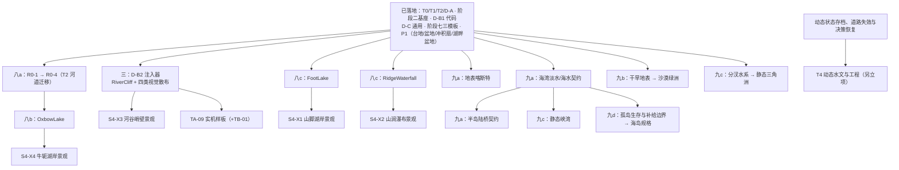
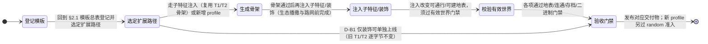

# 06. 地图模板规划：模板库、地形要素与未落地蓝图

> **定位**：本文是地图模板与未落地地形方案的规划权威；已实现机制以 [14 地形与路网](../../current/tech/14-terrain-and-network.md)为准，材质、光照、素材、遮挡与视觉性能见 [07 地形美术](./07-terrain-art.md)。先定义地图的空间结构与玩法，再选择实现它所需的共用基座。
> **复核基线**：2026-09-23，应用 v1.53.0；源码 `TERRAIN_GENERATOR_VERSION=16`（八a R0 河道表示迁移落地）、存档 `SAVE_FORMAT_VERSION=7`、FABS `FORMAT_VERSION=4`。阶段三与八a 交付见 R.1.1 / §6，旧验收记录保留各自版本基线；实施按变更性质判断版本递增，不照抄旧稿中的目标版本号。
> **阅读入口**：[R.1 当前状态](#r1-现状快照)（含 [R.1.1 未完成步骤速览与必要性](#r11-未完成步骤速览与必要性)）→ [R.3 阶段计划](#terrain-roadmap) → §2.1 模板清单 → §5/§6 施工契约 → §18 验收。近期任务明细见 [TODO](../../../TODO.md)。阶段二（STAGE2-1~8）与阶段七（S7-01~10）均已收官，专项任务文档随收官归档删除，收口证据见 [14 号 §8.2](../../current/tech/14-terrain-and-network.md)；阶段七探针门禁基线与固定种子验收表收编于 §18.8，交付证据见 [changelog](../../current/01-changelog.md)。
> **编号约定**：按 [文档导航的编号例外](../../README.md)，保留 R、§0～6、§17～21 及历史任务 ID；本文中的 **§7～16 均指 [14 号现状文档](../../current/tech/14-terrain-and-network.md)的对应章节**。阶段号表示批次，提交组表示变更类型，任务 ID 表示可验收工作项，三者不能互代；不存在必须先完成所有较小阶段号的规则。
> **文档分工**：R.3 只维护跨批次依赖与范围；专项 TODO 维护原子任务及勾选状态；§2.1 维护模板登记；§4～6 维护设计；§18 保留验收证据。完成代码、完成样板、进入 `random` 是三个独立里程碑。

## 项目路线图与实施计划

> **本节是全文唯一的排期权威**（2026-09-12 重组新增）：整合原 §2.2 实现路线、§5.9 推荐提交顺序、§5.1 提交组框架与 §19 景观对接的排期信息，原位置只保留细节契约或指针，避免多处维护漂移。排期原则：**从易到难、按依赖解锁**；§5.1 的四类提交组（D-B1 / R0 / D-B2 / P1）仍是不可合并的提交边界——阶段编号只是推荐顺序而非强制串行，禁止把多个提交组合并为一次大改。

<a id="r1-现状快照含阶段一装饰扩展--生成器版本-4"></a>
### R.1 现状快照

| 交付面 | 已实现 | 未完成 / 下一步 |
| :--- | :--- | :--- |
| T0 / T1 / T2 | 地表查询、山口、静态河谷、共享水池、合法路网及 T1/T2 随机轮换 | 无——生存成本诊断、`flat_baseline` 等价基线、有界降级 3 项遗留门禁已随阶段二销项（证据见 14 号 §8.2） |
| D-A / D-B1 | 五类通用装饰、子特征模型与选择器、FABS Section 22、静态缓存拆分；D-B1-9 代码验收完成（§18.5） | TA-09 / D-B1-8 实机场景样板待交付（构图草案已过；第 5 步 RiverCliff 与第 9 步四类视觉散布已交付，见 R.1.1；实机验收见 07 号 §4.4.1） |
| 阶段二 | STAGE2-1~8 **全部交付**（v1.50.39~49）；合法基线等价与失败降级分层验收完成（证据见 14 号 §8.2） | STAGE2-3 完整几何事务域已实施（候选隔离覆盖 features/水体/中心线/覆盖意图/差分 halo；局部拒绝原子回滚；空注入保持旧输出） |
| T1 骨架扩展 | TB-01 支脊与多尺度地貌已交付；现状见 14 号与 [07 号 §7.2](./07-terrain-art.md) | 不再重复安排支脊开发；后续流水线重构须保持当前 T1 输出 |
| 阶段七 · 独立模板 | S7-01~10 **全部交付**（v1.50.39~52）：草原 / 半坡林地 / 河谷聚落三张新 profile 通过 §18 验收并入 `random`（2→5 路）；探针基线与固定种子表收编于 §18.8 | 河谷聚落已随 v1.50.68 砍需求删除下线（设计存档见 §4.3，random 池 8 路见 §5.6.1） |
| 阶段四 · D-C | 通用资源景观套件、几何遮罩避让、五类配方样板、标签布局引擎与聚合/双目标停靠兜底（S4-01~08 全部收口交付，v1.50.46~53，详见 [16 号文](../../current/tech/16-frontend-overview.md) §2.16～§2.18） | 特定地貌专属景观群（S4-X1~X4）随对应注入器逐项交付；院地任务见 [STAGE-04-SUBFEATURE-LANDSCAPES-TODO](../../../STAGE-04-SUBFEATURE-LANDSCAPES-TODO.md) |
| 阶段五 / 六 · P1 | 台地 `plateau_v1`（v1.50.54 TB-02）、盆地 / 冲积扇 / 湖畔盆地（v1.50.55 TB-03）**已发布并入 random**（v1.50.68 起 8 路，§5.6.1）；湖畔盆地独立规格已回填 §5.6 | TB-04 盆地群峰环抱与峡谷出水口远期重构另立 [10 号文](./10-basin-mountain-encirclement.md) |
| 其余模板 / R0 / T4 | 规划登记与局部规格 | 八a R0、八b OxbowLake、八c FootLake/RidgeWaterfall、九a~九d 远期模板、T4 动态水文——速览见 R.1.1，分项解锁见 R.3 |

### R.1.1 未完成步骤速览与必要性

> 本节是当前未完成工作的**速览与排序权威**：只登记未交付项及「不做会怎样」，不重复 §5/§6 的施工细节；实施窗口与依赖见 R.3，原子任务见 TODO。

| 步骤 | 状态 | 直接前置 | 必要性（不做会怎样） |
| :--- | :--- | :--- | :--- |
| STAGE2-3 完整几何事务域 | ✅ 已实施：候选隔离覆盖完整几何支撑域、覆盖意图与差分 halo，失败原子丢弃 | 阶段二其余项 | 为阶段三注入器提供安全施工地基；空注入不改变旧世界输出 |
| 阶段三 · D-B2 注入器（RiverCliff + 四类视觉散布） | ✅ **已交付**（v1.52.6）：四类视觉散布（v1.52.5）+ RiverCliff 河谷峭壁物理注入（§5.4.D，`TERRAIN_GENERATOR_VERSION` 14）；离散尺度探针 144 组合全通过、固定种子矩阵 12 例注入全通过（components 恒 1），证据见 changelog v1.52.6 | 事务域 | 视觉子特征确定性追加；RiverCliff 改变 T2 命中种子高程/地表/通行，其余种子逐位不变 |
| 八c · FootLake / RidgeWaterfall | ⬜ 未开工 | 事务域（不等待 R0） | T1 侧局部地标与绕行/选址变化来源（山脚湖绕湖、飞瀑挂接水源）；S4-X1/X2 景观解锁前提 |
| 八a · R0 T2 河道表示迁移（R0-1~4） | ✅ 已交付（v1.53.0，生成器 14→16） | 事务域 | `RiverCenterline` 弧长采样/精确距离/符号横距；沿中心线法向派生河岸、浅滩、取水点与水面轮廓；三回环 meander train；R0-4 裁弯窗口诊断谓词（无窗口仅不注入子特征） |
| 八b · OxbowLake 牛轭湖 | ✅ **已交付（v1.54.0，生成器 16→17）** | R0-4 | T2 专属结构型子特征（20%），按真实「弯道裁弯取直」生成月牙湖；S4-X4 景观解锁前提 |
| S4-X1~X4 专属景观群 | ◐ 通用 D-C 已收口，专属待注入器 | 对应注入器 | 山脚湖/瀑布/峭壁/牛轭湖岸的辨识度表现（草原模板即以视觉辨识度为最大风险，§4.1）；纯表现层，不阻塞内核 |
| TA-09 / D-B1-8 实机场景样板 | ◐ 构图草案已过（2026-09-14），实机验收待交付 | TB-01 + RiverCliff 已落地；当前混合管线遮挡仍待验（07 号 §4.4.1） | 样板通过前不将阶段一全部交付标为完成；纯视觉样板不替代物理验收（遮挡判据按 31 号 §8.5） |
| 九a~九d 远期模板（喀斯特/海湾/半岛、沙漠绿洲、三角洲/峡湾、海岛） | ⬜ 未开工、缺规格 | 各自水陆/淡水/可达性契约 | 地图类型库的长期扩展；未过规格与有效世界验收不注册空实现、不加入 random，防止「看起来能走」的假设施 |
| T4 动态水文与工程 | ⏳ 长期另立项 | 动态状态存档、道路失效及决策恢复 | 枯丰水期/洪水/桥梁/土地演化与航运的远期载体；静态首版明确不等待 |

> **当前施工关键路径**：阶段三注入器已交付（v1.52.6）→ 八c（FootLake / RidgeWaterfall）；八a R0 → 八b OxbowLake 已交付（v1.54.0）。被动解锁：S4-X1/X2/X4 专属景观（S4-X3 已解锁待交付）、TA-09 实机样板。

### R.2 路线总览（依赖解锁图）



实线仅表示能力前置，不代表日期或所有批次间的先后顺序。已交付批次（阶段二/四/五/六/七及 D-B1 代码）不再展开；同一框中的模板仍各自立项与验收；九a～九d 保留远期窗口，静态首版不强制等待 T4。TA-09 场景样板的实际前置见 R.4 / §19，构图评审与实机交付记录见 [07 号 §4.4.1](./07-terrain-art.md#441-ta-09-构图评审与实机交付记录)。

<a id="terrain-roadmap"></a>
### R.3 阶段计划（从易到难 × 依赖）

| 批次 / 提交组 | 交付范围与状态 | 直接前置 | 物理变更 / 难度 | 规格 |
| :--- | :--- | :--- | :--- | :--- |
| ⓪ 基座 | ✅ **已交付**：T0/T1/T2/D-A 已落地；生存成本诊断、`flat_baseline`、有界降级 3 项遗留门禁已随阶段二收口销项 | — | 已交付 | R.1、§18 |
| 一 · D-B1 | ◐ **代码交付完成**（D-B1-9 验收收口，§18.5）：装饰、模型/快照、选择器与缓存已交付；TA-09 / D-B1-8 实机场景样板待交付（依赖阶段三 RiverCliff） | D-A | 否 / 低 | §5.2、§5.5、§18.5 |
| 二 · 共用基座 | ✅ **全部交付**：STAGE2-1～8（v1.50.39~49 收官，专项 STAGE2-TODO.md 已随收官归档删除，分层验收证据见 14 号 §8.2）；STAGE2-3 完整几何事务域随阶段三注入启用 | 一；原子任务顺序见 R.6 | 重构不改；新增拒绝/降级另拆 / 中 | §5.3、§5.8 |
| 三 · D-B2 / 视觉散布 | ✅ **已交付**（v1.52.5 视觉散布 + v1.52.6 RiverCliff）：ForestedSlope / RockyOutcrop / RiversideForest / GravelBeach hash 放点追加装饰；RiverCliff 注入器过离散坡度/连通性验收（探针证据见 changelog v1.52.6） | 物理需二；视觉已具备事务域 | 分项 / 中 | §5.4.D、§5.5 |
| 四 · D-C | **✅ 通用部分已收口交付（v1.50.46~53）**：通用资源景观套件、几何遮罩避让、五类配方样板、标签布局引擎、聚合与双目标停靠兜底完成（S4-01~S4-08 全部完成，详见 [16 号文](../../current/tech/16-frontend-overview.md) §2.16～§2.18；特定地貌专属景观群与院地任务见 [STAGE-04-SUBFEATURE-LANDSCAPES-TODO](../../../STAGE-04-SUBFEATURE-LANDSCAPES-TODO.md)）；特定地貌专属景观群逐项交付 | 一·D-B1 已就绪；特定地貌专属景观群另需对应注入器 | 否 / 低 | §19、阶段四 TODO |
| 五 · P1 | ✅ **已交付**（v1.50.54 TB-02：台地 `plateau_v1`，SDF 圆角矩形台面 + 陡壁过渡带 + 双入口缓坡 + 坡脚泉溪与双接入路网；60/60 种子全通并准入 random） | 二 | 是 / 中高 | §5.6 |
| 六 · P1 | ✅ **已交付**（v1.50.55 TB-03：盆地 `basin_oasis_v1` / 冲积扇 `alluvial_fan_v1` / 湖畔盆地 `lakeside_basin_v1`，静水全链路 + 60/60 种子矩阵；湖畔盆地独立规格已回填 §5.6；冲积扇辨识度改善第一批随 v1.50.68 落地） | 二；建议五先行，不是硬依赖 | 是 / 中高 | §1.2、§5.6 |
| 七 · 独立模板 | ✅ **全部交付**（v1.50.39~52 S7-01~10）：草原 / 半坡林地 / 河谷聚落 3 张新 profile 通过 §18 验收并入 `random`（2→5 路；河谷聚落随 v1.50.68 删除，现 8 路）；探针基线收编于 §18.8 | 无 | 是 / 中 | §4.1/4.2/4.3、§18.8 |
| 八a · R0 | ✅ **已交付（v1.53.0）**：R0-1 → 2 → 3 → 4；中心线查询、精确距离场、蜿蜒列与裁弯窗口谓词均已接入；生成器版本 14→16 | 二 | 分项 / 高 | §6 |
| 八b · D-B2 | ✅ **已交付（v1.54.0，生成器 16→17）**：OxbowLake 裁弯与闭合月牙湖，见 §5.4.C 与 changelog v1.54.0 | 八a 的 R0-4 | 是 / 高 | §5.4.C |
| 八c · D-B2 | ⬜ **未开工**：FootLake、RidgeWaterfall 各自交付；瀑布先补供水关联、尺度与遮挡样板 | 二；互不依赖，也不等待 R0 | 是 / 高 | §5.4.A/B |
| 九a · 远期静态 | ⬜ **未开工**：地表喀斯特、海湾、半岛；分别补地表/淡水/陆桥规格 | 二；半岛复用海湾海水/淡水契约 | 是 / 中高 | §4 |
| 九b · 远期静态 | ⬜ **未开工**：沙漠绿洲；干旱地表基座独立立项 | 二 + 干旱地表；不依赖九a | 是 / 中高 | §4 |
| 九c · 远期静态 | ⬜ **未开工**：三角洲需分汊水系，峡湾需海水/淡水与陡坡走廊；动态扩展另需 T4 | 二 + 各自契约；不依赖九b | 是 / 高 | §4、§19 |
| 九d · 远期静态 | ⬜ **未开工**：海岛先评审岛内闭环与榷场外部补给边界；跨岛交换另立航运 | 二 + 海水/淡水 + 孤岛生存规格；不强绑 T4 | 是 / 高 | §4 |

此表登记实施窗口，不宣称所有远期模板已有完整算法；已交付行（⓪/二/四/五/六/七）的验收证据见 §18 与 changelog。未通过规格与有效世界验收的模板不注册空实现、不加入 random。

### R.4 依赖与并行要点

- **R0 只阻塞牛轭湖**：不阻塞河谷峭壁、台地和其他静态骨架；R0-1～R0-4 各自独立可回滚；只有改变生成事实的提交递增生成器版本，禁止同号对应不同算法（§6.5）。
- **D-B1 可单独上线**：旧 T1/T2 物理输出逐字节不变是其退出条件（§5.1）。✅ **已收口（D-B1-9，2026-09-13）：阶段一代码交付完成**（跨构建差分与 R.5 门禁记录见 §18.5），可进入阶段二；D-B1-8 / TA-09 实机场景样板依赖 07 号 TB-01 及本方案阶段三 `RiverCliff`（原前置 TA-08 遮挡实测已删除视为完成），样板通过前不将阶段一全部交付标为完成，视觉样板不替代物理验收，遮挡判据以 [31 号 §8.5 验收矩阵](./31-canvas-to-webgl-migration.md) 为准。
- **失败隔离**：D-B2/P1 任何一项失败只禁用该特征或 profile，不得在运行中修改道路、移动居民或回抽世界种子（§5.1、§5.8）。
- **每组一改**：四类提交组禁止合并为一次大改；一次只改一件事，门禁失败才可定位（§6.5「不要顺手做的事」）。
- **模板级前置已就绪**：GrassTuft 已随草原交付（§4.1）；半坡林地骨架已交付，其「密林山坡」视觉散布规则随阶段三注入器落地（§4.2、§5.5）。
- **当前施工关键路径**：阶段三已收口（v1.52.6 RiverCliff）→ 八c（FootLake / RidgeWaterfall）；八a R0 → 八b OxbowLake 已交付（v1.54.0）。被动解锁：S4-X1/X2/X4 专属景观（S4-X3 已解锁）、TA-09 实机样板。
- **文档节奏**：每个代码阶段独立更新现状文档与 changelog，按根 AGENTS.md 升版、同步 WASM 双副本并执行适用门禁；纯规划修订不升版，不把建议写成已落地能力。

### R.5 通用门禁与退出标准速查

代码阶段交付前执行以下公共门禁；纯文档按工作流 §G。专项场景见 §5.8，分阶段门禁见 §18；§5.8 是场景表，实际 seed 必须记录，不能以场景名称冒充固定种子：

```text
cargo test --lib
cargo build -p sim_wasm --target wasm32-unknown-unknown --release   # 并同步 WASM 双副本
node tools/test-wasm.js
node tools/test-determinism.js
node tools/config-check.js
node tools/frontend-check.js
node tools/cross-doc-check.js
```

**配置接入状态**（`config-check.js` 第 5 条的读取检查不能代替行为验收）：

| 字段 | 状态 | 当前消费与剩余工作 |
| :--- | :--- | :--- |
| `terrainAccentSubFeatures` | ✅ 已加回（v1.50.29 · D-B1-1，连同 §5.3 第 4–5、9 步空钩子门控） | 子特征注入总开关；置 false 时 §5.3 第 4–5、9 步为空 |
| `terrainGenerationMaxRetries` | ✅ 已加回并消费（v1.50.39 接入；v1.50.49 STAGE2-5 有界降级环落地） | `new_seeded_with_config_bounded` 语义 = 初始创世失败时阶梯降级重试的最大次数（0 = 只尝试一次）；入口钳制至最多 8，全部降级共用同一预算；夹具覆盖 0/1/N、策略去重与无解报错 |

已删除且**不回加**：`terrainRidgeWidth`（T1 主脊改走 `terrainPassRidgeWidth` / `terrainPassRidgeAmplitude`）、`terrainTreeSeasonTint`（季节叶色改由前端 `SimTreeTint` 按快照季节实时派生）。

### R.6 原子任务与交付规则

- 沿用 `STAGE2-*`、`S7-*`、`R0-*`、`TA/TB-*` 等现有 ID，章节号和阶段号不再充当新任务号。每项写明输入、产物、直接前置、失败处理和验收证据；一个任务只承担一种物理/视觉/基础设施变更。
- 阶段二的正确依赖为：STAGE2-2 → 3 → 4；3 → 6（独立诊断）、3 → 7（基线实现）；1 + 4 + 6 + 7 → 5（集成回退）→ 8（收口）。诊断与基线先可独立验证，再由重试器消费，避免 5 与 6/7 相互依赖。
- 剩余阶段开工时逐项拆分；已交付的 TB-01 支脊、S7-02 草原骨架及 TB-02/TB-03 P1 模板不重新建任务。湖畔盆地规格已随 TB-03 落地（§5.6 要点 1），TB-04 群峰环抱与峡谷出水口另立 [10 号文](./10-basin-mountain-encirclement.md)。
- 新 profile 按「显式指定可生成 → 地理/生存门禁 → 视觉与性能 → 存读档及模拟回归 → 加入 random」逐项验收；装饰与 R0 改造不新增 random 候选。修改 random 候选集合会改变种子到模板的映射，须单独记录并按生成器版本契约处理。
- 纯重构对比**包含所有已交付物理变更的冻结基准**；历史 D-B1/阶段二部分提交的版本 4 证据保留，不得拿它要求当前版本 5 的 T1 回退到旧地貌。基准提交、WASM/配置摘要、seed、差分范围须在开工时固定；禁止验收失败后移动基准。

## 目录

- **项目路线图与实施计划**：R.1 现状快照（含 R.1.1 未完成步骤速览与必要性）· R.2 路线总览 · R.3 阶段计划 · R.4 依赖与并行要点 · R.5 门禁与退出标准速查 · R.6 原子任务与交付规则
- **状态机**：未落地模板立项生命周期（登记 → 选路径 → 生成骨架 → 注入子特征/装饰 → 校验有效世界 → 验收门禁）
- **0. 本文的组织方式与阅读路径**：0.1 三层结构 · 0.2 术语对齐
- **第一部分 · 地图模板（核心）**
  - **1. 设计目标与责任边界**：1.1 核心原则 · 1.2 组合式地貌路线 · 1.3 高度场、分辨率与有效世界边界
  - **2. 路线与落地状态总览**：2.1 地图模板总表（16 张） · 2.2 实现路线（排期已并入文首 R） · 2.3 落地状态总览
  - **3. 七类有效地形要素（另保留湿地撤销记录）与地理玩法**：3.1 丘陵 · 3.2 山脊与山口 · 3.3 河流与浅滩 · 3.4 河滩与河阶 · 3.5 湖泊与出水口 · 3.6 湿地与泥泽（已删除） · 3.7 峡谷与断崖 · 3.8 泉谷与瀑布
  - **4. 未落地地图模板的组合库**：4.1 平地草原 · 4.2 半坡林地
  - **5. 地图模板实现蓝图**：5.1 提交组与边界 · 5.2 单一真相源与稳定 ID · 5.3 创世流水线 · 5.4 D-B2 四种子特征 · 5.5 D-B1 纯视觉扩展 · 5.6 P1 新 profile（3 个已写规格 + 湖畔盆地待规格） · 5.7 快照/FABS/前端/存档同步 · 5.8 有界失败与验收矩阵 · 5.9 提交顺序（已并入文首 R.3）
  - **6. R0：T2 河道表示迁移**（牛轭湖硬前置）：6.1 目标表示 · 6.2 距离场 · 6.3 蜿蜒列 · 6.4 受影响下游数据 · 6.5 提交边界与门禁
- **第二部分 · 共用技术基座** → 已迁至现状文档 [14-terrain-and-network.md](../../current/tech/14-terrain-and-network.md)（本文 §7～§16 引用一律指其对应章节，编号约定见文首）
- **第三部分 · 落地、验收与边界**
  - **17. 文件级实施清单**：17.1 D-B 装饰扩展 + 子特征注入
  - **18. 分阶段验收门禁**：18.1 T0 · 18.2 T1 · 18.3 T2 · 18.4 D-A · 18.5 D-B · 18.6 通用确定性与性能 · 18.7 验收维度与风险
  - **19. 分阶段落地与景观计划对接**
  - **20. 退出标准**
  - **21. 明确不做的事项**：21.1 文档范围说明

## 状态机

本节描述「未落地地图模板」从总表登记、选定扩展路径、生成骨架、注入子特征/装饰、校验有效世界到验收门禁的立项生命周期。已落地的 T0/T1/T2/D-A 不在此机内；本机只覆盖规划侧（D-B 子特征注入、R0 河道迁移、P1 新 profile 与未落地模板组合库）。



| 状态 | 含义 | 进入条件 | 退出条件 |
| :--- | :--- | :--- | :--- |
| A 登记模板 | 在 §2.1 总表登记，状态=候选（登记不等于已排期），标注构成与玩法 | 新增模板先回总表 | 选定扩展路径（子特征注入/新增 profile） |
| B 选定扩展路径 | 依 §5.1 四类提交组（D-B1/R0/D-B2/P1）独立发布，排期见文首 R.3 | 登记后选路径 | 生成骨架或 D-B1 装饰单独上线 |
| C 生成骨架 | T0 地表查询 + 合法走廊生成，先走廊后曲线 | 路径确定 | 骨架通过后再注入子特征/装饰 |
| D 注入子特征/装饰 | D-B 子特征注入器按 seed 哈希概率注入；accent_rng 生成装饰 | 骨架完成 | 改变可通行/可建地表后过门禁 |
| E 校验有效世界 | 连通性/占地/取水/确定性门禁（§11/§14） | 注入完成 | 各项门禁通过 |
| F 验收门禁 | §18 按交付类型验收，新 profile 另核对 random 准入 | 门禁全过 | 交付物可用；只有通过全部模板门禁的新 profile 才加入轮换 |

**不变量**（落地时必须守住的约束）：
- 装饰不参与通行/资源/碰撞与建造判定，且只能用独立 `accent_rng` 生成，不消费共享模拟 RNG；新增随机只用地形局部 RNG，不污染世界 RNG。
- 子特征注入不新增 profile 命名；开启与关闭子特征是两个不同的静态世界，不要求 POI/营地坐标相同。
- 同版本同种子确定性优先于旧图兼容：`terrain_generator_version` + `terrain_profile` + `SAVE_FORMAT_VERSION` 门禁拒绝旧档，杜绝旧路网与新地貌静默拼接。

> 本机描述待交付部分的目标流程，不表示所有节点尚无代码；具体就绪度见 R.1。

## 0. 本文的组织方式与阅读路径

### 0.1 三层结构：模板 → 地形要素 → 共用基座

本文只有一条主轴：**地图模板**。

```text
地图模板（第一部分 · 核心）                    玩家看到与玩到的东西
  ├─ 已落地模板：山口聚落 / 两岸河谷
  ├─ 未落地模板：河口三角洲 / …（组合库）
  └─ 扩展机制：子特征注入 / 新增 profile / 地表装饰
        ▲
        │ 由这些要素拼装
        │
地形要素（第一部分 · 词汇表）                  构成模板的七类有效地形要素（另保留湿地撤销记录）
        ▲
        │ 全部依赖
        │
共用技术基座（已迁至现状文档 14）             让任何模板都能生成、通行、存档、渲染
  地表查询 · 数据模型 · 创世流水线 · 路网 · 水资源 · 选址 · 快照存档 · 前端 · 配置
  → [14-terrain-and-network.md](../../current/tech/14-terrain-and-network.md) §7～§16
```

- **共用基座不在本文重复**：已落地能力一律以现状文档 14 为准（编号约定见文首）。评审任何新技术时先问：**它服务于哪个模板？** 没有对应模板需求的能力，不进本文。
- **第三部分**是模板落地的通用流程：文件清单、验收门禁、景观对接、退出标准与明确不做的事——新增任何模板都复用同一套；提交顺序与排期以文首「项目路线图与实施计划」R.3 为准。

### 0.2 术语对齐

| 术语 | 含义 | 位置 |
| :--- | :--- | :--- |
| **地形要素**（地形种类） | 七类有效地形：丘陵 / 山脊与山口 / 河流与浅滩 / 河滩与河阶 / 湖泊 / 峡谷与断崖 / 泉谷与瀑布（湿地已删除）。地图模板由它们拼装而成 | §3 |
| **地图模板** | 一张地图的完整玩法设定：由若干地形要素 + 子特征构成，决定玩家看到什么、在哪里做取舍 | §2、§4 |
| **profile** | 模板在内核中的实现形式：`mountain_pass_v1` / `river_valley_v1`，以及规划中的 `plateau_settlement_v1` / `basin_oasis_v1` / `alluvial_fan_v1` / `grassland_plain_v1` / `hillside_woodland_v1`。空间骨架不同才新增 profile；同一骨架的子特征与景观变体复用 profile | §2、§9.1 |
| **子特征**（sub-feature） | 在已有 profile 骨架上按种子哈希概率注入的额外地貌（山脚湖 / 山涧飞瀑 / 河谷峭壁 / 牛轭湖……），**不新增 profile** | §5 |
| **地表装饰**（Accent） | 纯视觉点缀（树 / 岩石 / 灌木 / 草簇），不参与通行、资源、碰撞与建造判定 | §7.4、§9.5 |

---

# 第一部分 · 地图模板（核心）

> 本部分是全文核心：先定义我们想要哪些地图（§2 清单 / §3 词汇表 / §4 组合库），再给出新增模板的施工图（§5 实现蓝图 / §6 牛轭湖硬前置）。

## 1. 地图模板的设计目标与责任边界

> **服务对象**：本文全部内容——先定清楚「地图模板」是什么、谁负责它的哪一部分。


让地图拥有可以被记住的地方：一条把聚落分隔两岸的河、一处绕山必经的山口。地形同时改变画面轮廓、路线选择和聚落条件，帮助玩家理解“为什么人们住在这里、走这条路”。

内核地形以高程与坡度为基础，见 [biome.rs](../../../crates/sim_core/src/geo/biome.rs)；[terrain.rs](../../../crates/sim_core/src/geo/terrain.rs) 使用倾斜大势与平滑起伏。本文是在此基础上的扩展，不将已有坡地改名当作新功能。

本文是**地形种类、生成关系、通行、选址和水资源语义**的规划权威；[景观提升计划](./07-terrain-art.md)负责材质、光照、素材、遮挡、缓存与视觉性能。土地适宜性由地形提供，农田产权、投资与产出仍由[农业规划](./04-farmland-agriculture.md)负责。

### 1.1 核心原则

1. **Rust 地理事实唯一真相源**：前端只绘制内核提供的高程、地表类别、水域、岸带、连接设施与装饰位置，不用装饰反推碰撞或资源。
2. **先走廊后曲线**：先在栅格上找合法通行走廊，再拟合 `Curve3D`；不能用节点端点合法替代整条曲线合法。
3. **静态拓扑先行**：T1/T2 的地形、水位、浅滩和禁建区在创世时确定；运行中不改变道路拓扑，降低缓存和存档风险。
4. **水体几何与水资源池分离**：河湖可以有连续视觉轮廓，但可采水点引用共享资源池，不按岸点重复发库存。
5. **同一查询服务供房屋、农业、防务和路网消费**：不再让各模块分别判断坡度、占地、水域和接路。
6. **新增随机只使用地形局部 RNG**：地貌结构、子特征与装饰不污染现有世界 RNG；POI、始祖、出生等既有消费顺序保持不变。
7. **同版本同种子确定性优先于旧地图兼容**：生成器变更必须通过版本门禁拒绝旧存档，不能把旧路网与新地貌静默拼接。
8. **装饰不产生物理事实**：地表装饰（树木/岩石/灌木）是纯视觉层，不参与通行、资源、碰撞与建造判定。

<a id="12-组合式地貌路线2026-09-12-修订未实施"></a>
### 1.2 组合式地貌路线（部分实施）

采用 **少量地图骨架 × 地貌子特征 × 成套景观风格**，继续使用 Rust 静态高度场。目标是先获得五六种轮廓清楚、生活条件不同的地图，再扩展复杂水系；不以完整侵蚀模拟、实时流体或 GPU 迁移为前置。

| 层次 | 职责 | 示例与边界 |
|---|---|---|
| 地图骨架 / profile | 主要高低关系、水陆分布与通行瓶颈 | 山口、河谷、台地、盆地、冲积扇；空间结构和选址取舍明显不同才新增 profile |
| 地貌子特征 | 局部地标及绕行、选址变化 | 支脊、山脚湖、岩壁；改变几何就必须进入 Rust 地表与有效世界门禁 |
| 景观风格 | 岩性外观、植被形态、地表色彩 | 灰岩疏林、暖色层岩、深色岩坡；只改变表现时不新增 profile，不自动生成矿产或肥力收益 |

每张图以一个主地标、少量次地标和足够开阔生活空间组织。先定大尺度轮廓，再加入不对称支脊、分段台缘、凹凸岸等中尺度变化，最后补岩纹、草土斑块和碎石。随机性控制方向、比例、弯曲与成组分布；用模板允许列表约束组合，避免所有地貌等概率混搭。岩壁接碎石坡、缓岸接草地、坡面林地成团是景观关联，不代表已实现土壤或气候模拟。

山脚湖是局部子特征；**湖畔盆地**应围绕湖岸、陆路出口和连续可建带组织完整骨架，不能仅靠在 T1/T2 塞一座小湖达成。其独立 profile 名称及与 `basin_oasis_v1` 的区分须在施工设计中确定，当前不注册空实现。已登记的平地草原、半坡林地（§4.1/§4.2）保留，分别作为低障碍、缓坡成本的后续候选，不因增加景观风格重复命名。

### 1.3 高度场、分辨率与有效世界边界

- 当前默认 `terrainGridRes=256`（v1.50.70 由 160 提升），约 764m 世界对应采样间距约 2.996m。影响通行的沟、岸、坡应跨越数个网格，并以**离散高程、坡度及完整走廊**验收；连续公式峰值不能代替栅格结果。§5.4 的 7m 浅沟、窄跌水和 §5.6 台缘参数均是待校准初值，不能直接承诺稳定成形。
- 岩缝、细水丝、草簇等小尺度细节由表现层派生。渲染细分不得创造与内核不一致的可走地面；每边分辨率翻倍约使格数增至四倍，须先测生成、查询、快照与绘制成本，不默认全图加密。
- 高度场适合丘陵、陡坡、台地、盆地、沟谷；真垂直崖面、悬挑、洞穴和多层通行需要额外表示。近期岩壁采用真实陡坡与贴合坡面的岩层表现，不绘制暗示可穿行的天然石桥。
- 水系整形必须限于明确的河道、岸带与谷地影响范围，边缘平滑接回骨架。`hydrology::generate_river` 已随 STAGE2-2 收敛到水系影响带，后续按 §5.3 接入完整流水线；最终统一派生坡度与地表规则，再放置 POI 和路网。
- 新骨架须校验主要可居住区域连通、关键资源可达、营地往返成本、连续可建面积及失败原因。无关荒地不必全部可达；已有 T1/T2 子特征的“不增加连通分量”保护门禁仍按 §5.3 执行，不能借此放宽既有保护。各模板分别设诊断区间，不把开放草原的低绕行比判为失败，也不为了全种子通过而抹平地理差异。

技术参考：[Terrain Modelling from Feature Primitives](https://www.cs.purdue.edu/homes/bbenes/papers/Genevaux15CGF.pdf) 支持按特征原语组合地形的方向；本项目采用轻量实现，不引入论文系统作为依赖。景观组织、样板与性能门禁见 [07 地形美术 §4.4](./07-terrain-art.md#44-组合地貌美术规则)。

## 2. 地图模板路线与落地状态总览

> **服务对象**：全部地图模板——这里是模板清单、落地状态与实现路线的总入口。

### 2.1 地图模板总表

本文要实现的全部地图模板如下。「构成」列引用 §3 的地形要素；「实现方式」列说明它走 §5 的哪条扩展路径（子特征注入 / 新增 profile）；「详情」列给出玩法意图位置。

| # | 地图模板 | 构成（地形要素） | 主要玩法价值 | 实现方式 / profile | 状态 | 详情 |
| :--- | :--- | :--- | :--- | :--- | :--- | :--- |
| 1 | 山口聚落 | 丘陵、山脊与山口、山脚泉源 | 道路绕过陡坡，在山口汇聚；山两侧采集距离不同 | ✅ `mountain_pass_v1` | **已落地**（v1.47.1/v1.47.2；v1.50.17 修复主脊通行力） | §3.1/§3.2、§9.3 |
| 2 | 两岸河谷 | 主河、浅滩、河滩/河阶、泉谷、少量丘陵 | 两岸聚落经浅滩往返，近在眼前的资源需要绕行 | ✅ `river_valley_v1` | **已落地**（v1.47.5） | §3.3/§3.4/§3.8、§9.5 |
| 3 | 湖畔盆地 | 中心湖、外缘山坡、环湖缓岸与陆路出口 | 房屋沿干燥缓岸分布，道路绕开水面 | 独立骨架待设计；山脚湖/牛轭湖仅为局部子特征 | ✅ 已落地（v1.50.55 · TB-03：`lakeside_basin_v1` 独立规格见 §5.6，双出口 + 双岸点共享池） | §3.5、§5.6 |
| 4 | 台地（原“台地聚落”，v1.50.68 更名） | 平缓台面、台缘陡坡、坡脚水源、缓坡入口 | 高处开阔用地与下行取水/采集成本之间的取舍 | profile `plateau_v1`（原 `plateau_settlement_v1`） | ✅ **已发布**（v1.50.54 TB-02：SDF 圆角矩形台面 + 陡壁过渡带 + 双入口缓坡 + 坡脚泉溪与双接入路网 + 随机池准入，60/60 种子全通） | §5.6 |
| 5 | 河口三角洲 | 主河分汊、潮湿冲积低地、支汊间干地脊 | 丰富近水土地、绕开支汊的路径网络 | 静态分汊水系；动态扩展另需 T4 | ⏳ 排期：阶段九c（规格前置） | §4 |
| 6 | 海湾聚落 | 受陆地环抱的海湾、缓岸、岩岬 | 沿避风岸发展的聚落、绕湾陆路 | 静态扩展候选（需海陆边界与淡水语义） | ⏳ 排期：阶段九a（先补海水/淡水契约） | §4 |
| 7 | 盆地 | 封闭/半封闭盆地、平缓低地、环抱高山 | 聚落围绕低地平缓生活带分布 | 新增 profile `basin_oasis_v1` | ✅ 已落地（v1.50.55 · TB-03，超阔盆底平原生活带） | §5.6 |
| 8 | 峡湾聚落 | 深窄海湾、两侧陡坡、谷口、少量缓岸 | 水域造成强分隔，谷口成为陆路关键节点 | 静态海水/淡水与陡坡走廊 | ⏳ 排期：阶段九c（规格前置） | §4 |
| 9 | 河谷聚落 | 上游河道、谷底冲积带、两侧连续山坡 | 水、耕地、道路都沿谷底集中 | 原 profile `river_valley_settlement_v1` | 🗑️ **已删除**（v1.50.68 砍需求下线；random 候选池随 9→8 改变，历史设计与验收记录见 §4.3/§18.8） | §4.3 |
| 10 | 半岛聚落 | 三面临水的陆地、狭窄陆桥、内陆高地 | 陆桥成为进出瓶颈 | 静态扩展候选（需海水/淡水与陆桥契约） | ⏳ 排期：阶段九a（复用海湾契约） | §4 |
| 11 | 海岛聚落 | 被海水完整包围的陆块、岛内淡水 | 隔离环境下的资源闭环与有限土地 | 静态孤岛契约待评审；跨岛交换另需航运 | ⏳ 排期：阶段九d（全表最后） | §4 |
| 12 | 沙漠绿洲 | 干旱裸地、局部泉池、绿洲植被 | 水源极度集中，聚落与储备围绕绿洲展开 | 静态扩展（前置：干旱地表/蒸散表现基座独立立项） | ⏳ 排期：阶段九b | §4 |
| 13 | 山前冲积扇 | 山口出口、扇形缓坡、分散浅沟 | 山地资源流向平原的过渡地带 | 新增 profile `alluvial_fan_v1` | ✅ 已落地（v1.50.55 · TB-03）；✅ 辨识度改善第一批已随 v1.50.68 落地（干沟 3~4 条放射系 + 沟带 DryGround 色差 + 粒度分带 + 双段剖面与默认值调整）；后续批次规划 10 号专项文档待建（2026-09-15 立项） | §5.6 |
| 14 | 喀斯特地貌 | 石灰岩丘峰、洼地、落水洞 | 地表路径绕开岩丘，水源集中在洼地 | 静态地表扩展候选（洞穴与地下河另立项） | ⏳ 排期：阶段九a（限地表丘峰与可达洼地） | §4 |
| 15 | 平地草原 | 低幅起伏平原、草甸地表、孤立残丘与泉溪洼地（辅助至多二） | 无天然屏障的开放开局：选址与通行近乎自由，聚落结构完全由水源分布与踩踏涌现 | 新增 profile `grassland_plain_v1` | ✅ **已发布**（v1.50.40 S7-02 骨架 + v1.50.45 S7-03 草甸装饰 + v1.50.52 S7-10 全链路收口：存读档白名单 + `random` 候选池入列，见 §4.1） | §4.1 |
| 16 | 半坡林地 | 单侧缓坡山体、坡面林地、坡脚泉溪与局部露岩（辅助至多二） | 林地纯视觉可穿越、坡度产生真实慢行；房屋沿坡脚与林缘形成带状聚落 | 新增 profile `hillside_woodland_v1` | ✅ **已发布**（v1.50.46 S7-04 骨架 + v1.50.47 S7-05 梯级密林与取水点隔离 + v1.50.52 S7-10 全链路收口：存读档白名单 + `random` 候选池入列，见 §4.2） | §4.2 |

> **读法**：本文所有技术章节都服务于这张表——已落地 1、2 号模板的技术基座见现状文档 14 号（§7～§16，编号约定见文首），新增模板 3～16 号的共用施工规则见 §5、§6；阶段七细化规格见其专项 TODO（已随收官归档删除，探针门禁基线收编于 §18.8）。**新增任何模板，先回到本表登记，再按 §5 的扩展路径施工。**
> **排期口径（2026-09-22 复核）**：3～16 号模板已全部纳入文首 R.3 阶段计划；表中「排期：阶段 X」指实施窗口与依赖关系，开工仍按「状态机」A→F 逐张过门禁。阶段编号是推荐顺序而非强制串行（R.4），前置就绪即可提前开工；已交付模板（阶段七 3 张、阶段五/六 4 张及 1/2 号）的验收证据见 §18 与 changelog，其余按 R.3 分项解锁。

### 2.2 实现路线与落地进度

采用“静态地貌生成 + 内核地表查询 + 合法走廊生成 + 共享水资源池 + FABS 增量快照”的路线，不引入完整侵蚀模拟、流体模拟、桥梁施工或 GPU 渲染器作为前置条件。

> **路线与排期已整合**：实现路线总览、从易到难的阶段计划与依赖关系统一由文首「**项目路线图与实施计划**」（R.2 依赖图 / R.3 阶段表）承载，本节不再重复维护第二份路线图，避免两处漂移。

> **子特征注入**：通过 seed 哈希按概率决定是否在 T1/T2 骨架上注入额外地貌特征（如湖泊/瀑布/峭壁）。注入不改变基础 profile 命名，仅在同一模板内增加视觉与地形复杂度，避免无限新增独立 profile。
> **装饰系统（D 系列）**：独立于骨架生成的纯视觉要素层，用独立 `accent_rng` 生成树木/岩石/灌木等点缀物。装饰不参与通行/资源/碰撞计算，挂进 `drawWorldEntities()` 统一深度队列渲染。

### 2.3 落地状态总览

当前交付状态集中见 [R.1](#r1-现状快照)；模板级状态见 §2.1，分阶段证据见 §18。已落地机制与历史变更分别以 [14 号现状文档](../../current/tech/14-terrain-and-network.md)和 [changelog](../../current/01-changelog.md)为准，本节不再复制第二份实现清单。

## 3. 模板构成要素：七类有效地形要素（另保留湿地撤销记录）与地理玩法

> **服务对象**：全部地图模板——七类有效地形是拼装模板的**词汇表**；§3.6 保留撤销记录以维护历史引用，模板是这些词汇的组合。


> v1.48.0 方案优化：**取消独立 T3 profile 阶段**。原 T3 的湖泊/湿地/峡谷/瀑布重组为「T1/T2 子特征注入」+「地表装饰系统（Accents）」两大方向；湿地因视觉辨识度低而明确删除。下表「落地路径」列反映这一重组。

| 地形 | 视觉识别点 | 主要玩法价值 | 落地路径 |
|---|---|---|---|
| 丘陵 | 连续缓坡、局部露岩 | 建房地点与绕行距离的取舍 | ✅ T1 已落地 |
| 山脊与山口 | 有方向的山体、鞍部、裸岩坡面 | 形成交通走廊和资源距离差异 | ✅ T1 已落地 |
| 河流与浅滩 | 连续河道、两岸、可见的石砾浅滩 | 分隔聚落并形成跨岸通道 | ✅ T2 已落地 |
| 河滩与河阶 | 河边沙砾带、稍高的平缓阶地 | 安家位置与取水距离的取舍 | ✅ T2 已落地 |
| 湖泊 | 成片静水、岸线、缓岸 | 绕湖交通与岸线空间取舍（湖是障碍，不是资源点） | ⏳ 子特征注入：T1「山脚湖」/ T2「牛轭湖」（均不可采水，见 §3.5） |
| 湿地与泥泽 | 芦苇、浅水斑块、软泥地 | 通行代价与土地利用差异 | ❌ v1.48.0 删除（视觉辨识度过低） |
| 峡谷与断崖 | 深切谷地、陡壁、狭窄出口 | 少量强地标与路线瓶颈 | ⏳ 子特征注入：T2「河谷峭壁」 |
| 泉谷与瀑布 | 山脚泉源、短溪、落差水景 | 将现有水源 POI 与山地联系起来 | 泉谷 ✅ T2 已落地；瀑布 ⏳ 子特征注入：T1「山涧飞瀑」 |

这里的山地是适配当前社区尺度地图的山脊、山麓与局部峰体，不把一整条大陆级山系压缩进村落大小的区域。每张图先选一个主地貌、最多两种辅助特征，避免全部地形要素堆在同一张图。

### 3.1 丘陵：适合首先落地

> v1.47.7 起不再将「台地/高台」纳入 T1——平顶高台在实机中观感生硬，已从 T1 设计与实现中移除；T1 只保留连绵丘陵（山脊/山口连续起伏）。台地如要回归，须作为第 4 节中的独立后续地图模板，经新的高度场、台缘占地与缓坡通行契约验证。

- **形态**：一到两组连绵丘陵，草地与裸岩沿坡度渐变。
- **规则**：缓坡可通行；房屋需满足完整占地的坡度、高差与道路接入条件，不能只检查中心点高度。
- **取舍**：丘陵缓坡提供可建空间，但可能离水源较远；坡脚近资源，却可能缺少可扩张用地。
- **最小实现**：高程形状、坡度/占地校验、贴地路网和材质分区。首期不附加高地防御或税收加成。
- **验收**：丘陵缓坡从远景可辨认，房屋底面无明显悬空；存在多处可选建房区，不能由生成器指定居民必住某处。

### 3.2 山脊与山口：形成自然路线

- **形态**：有明确走向的主脊，配少量支脊；在合理位置保留较低的鞍部作为山口。
- **规则**：超过配置阈值的坡段禁止通行，中等坡段按经过的坡形计入成本；山口是合法的缓坡通道，不是额外传送节点。
- **资源联系**：石矿、金矿可优先选择可达的岩石露头；并非每座山都必有矿，也不随山体面积增发资源额度。
- **最小实现**：一条山脊、至少一个可达山口、两侧资源与营地候选地。山口不自动征税或建立关隘。
- **验收**：两端等高但中途越过陡脊的曲线不能被误判为平路；高坡会挡路，山口确实被路径搜索识别。

> ✅ **已修复（2026-09-11，v1.50.17）**：主脊宽度/幅度改走 `terrainPassRidgeWidth` / `terrainPassRidgeAmplitude`，实测主脊最大坡度升至 36.2°~40.8°（60 个种子），产生真实硬禁行与绕行代价（绕行比 2.17~4.80），山口仍是唯一通道且全图保持 1 个连通分量。参数契约与门禁见 §9.3.1。

### 3.3 河流与浅滩：首个地理玩法切片

- **形态**：一条主河道，少量弯曲、宽窄变化和连续岸线。首期不做分汊、改道或复杂支流。
- **规则**：普通水面禁止步行、建房；跨河只允许经内核认可的浅滩连接。浅滩有实际宽度、路程与通行成本，人物沿真实曲线过河。
- **取舍**：河两岸直线距离近，实际路程可能需要绕到浅滩，形成自然的往返与交易走廊。
- **最小实现**：固定水位、静态水域边界、固定浅滩、合法岸边取水点；不包含游泳、船舶、桥梁施工和涨水。
- **验收**：所有普通路段均不穿水；浅滩处人物与水面接触合理；关闭该连接的诊断场景会改变可达性，而不是仍从河中抄近路。

### 3.4 河滩与河阶：让岸边有空间层次

- **形态**：紧邻水体的低滩与较高阶地形成不同地表色和高度，避免河水直接贴着建筑。
- **规则**：首期低滩为固定建房排除带，河阶在坡度与占地校验通过后可建；这代表选址规则，不宣称已经有洪水灾害。
- **农业联系**：后续可提供天然土地适宜性，农业仍自行决定开垦成本与产量，不能因“冲积地”标签直接给家户发粮。
- **最小实现**：河道两侧派生岸带与建房掩码，显示“低滩不可建”原因。
- **验收**：阶地大小足够容纳真实房屋占地；河滩宽度与水面、通路一致，边缘不会被装饰遮住。

### 3.5 湖泊与出水口：产生环湖路径

> 局部湖泊走 T1/T2 子特征注入；整图「湖畔盆地」仍是独立骨架（§1.2），两者不要混淆：T1 鞍部低地的「山脚湖」、T2 主河弯道切割的「牛轭湖」。两者均生成静态 `WaterBody` 特征（`resource_pool_id = 0`，**不可采水**，不创建 `WaterAccessPoint` / `PrimitivePoi`，不参与 HUD 水库存量统计）。**现行算法与拒绝条件以 §5.4.A（`FootLake`）与 §5.4.C（`OxbowLake`）为准**，本节只保留玩法意图。

**现行设计**：

- **形态**：闭合静水面，岸线以可接近的缓岸为主；T1 山脚湖是鞍部低地的椭圆湖盆，T2 牛轭湖是裁弯后残留的月牙湖，两端由陆地封口，与现行主河断开。
- **规则**：湖面不可步行；湖岸按基础地表规则处理，**不提供取水**（无资源池、无 `WaterAccessPoint`）；封口陆地不产生跨主河的 `TerrainConnection`，人物不能由此跨河。
- **玩法价值**：绕湖交通与岸线空间取舍——湖是**通行与建造的障碍**，不是资源点。
- **验收**：同一湖面的高程一致，岸线与地表交界合理；无湖底道路、湖中房屋或孤立必需资源；湖不计入 HUD 水库存量；加入湖后全图可行走连通分量仍为 1。

> ⚠️ 旧稿曾要求「湖有出水口、合法岸点可取水」，均已作废：现行子特征湖没有开放出水口、不可采水，以上述规则为准。此外 `SHORE_ACCESS` 目前是**只写不读**的标志（见 §7.1），湖岸写它不产生任何交互语义。

### 3.6 湿地与泥泽：已删除

> ❌ **v1.48.0 明确删除**。湿地与河滩/河岸在视觉上区分度低，玩家难以感知，且功能与河滩软地重叠。原「可涉软地 + 不可通行水洼」的设计由 T2 `RiverBank`（岸带软地，`terrain_soft_ground_cost`）承载，不再单独规划湿地 profile 或特征。

### 3.7 峡谷与断崖：控制数量的强地标

> v1.48.0 起改为 T2「河谷峭壁」子特征注入：首版只在主河单侧生成一段 `Cliff` 特征（尺度候选与探针准入见 §5.4.D），对应地表写入 `NO_BUILD` 并硬禁行（`slope >= 34°` 即 `SurfaceKind::RockFace`，由 `is_hard_blocked()` 判为 `NO_WALK`；`terrainMaxWalkSlope = 30°` 低于该阈值，故不存在可通行的 34–45° 中间带，详见 §5.4.D）。

- **形态**：狭长谷地与陡峭谷壁，只占有限区域，保留从谷口或缓坡出入的路线。
- **规则**：陡壁不可跨越，沿谷路线按真实高程通行；采矿点必须有入口与可达落脚处。
- **最小实现**：当前高度场可表达的陡坡谷壁，不包含悬挑、洞穴、多层地下交通。
- **验收**：曲线平滑不会切进谷壁；远景仍能看见谷底路线，近景人物不会长期被山体完全遮挡。

### 3.8 泉谷与瀑布：连接已有水源与新地形

> 泉谷（`SpringValley`）已于 T2 落地（v1.47.5）；瀑布改为 T1「山涧飞瀑」子特征注入（主脊中段 3–5m 跌水 + 沟谷汇入）。

- **形态**：山脚低处的泉池接短溪；有合法落差时再加瀑布、浅潭和少量水雾。
- **规则**：水源与水系建立明确归属。取水发生在安全岸点或潭边，瀑布本体不可当步行路段。
- **最小实现**：先将现有水源 POI 适配到泉谷；瀑布只消费已有河段落差和流动状态，不在前端另造水流事实。
- **验收**：同一股水不在泉、溪、潭各复制一份储量或再生；水源断流时，不显示与内核状态矛盾的持续大流量。

## 4. 未落地地图模板的组合库

> **服务对象**：尚未完成全部模板验收的方案；草原已有骨架，其余状态见 §2.1。这里补充设计约束，不重复维护任务状态。


> 以下为**规划模板的目标组合**（含草原部分交付）（2026-09-13 起已全部纳入文首 R.3 排期：阶段五～八为主体批次、阶段九a~九d 为远期批次），不是现有 profile；表内「建议阶段 / 前置」列即排期落点。实现一律走子特征注入或新增 profile（§5），独立 T3 阶段已取消（§21）。每张图仍只选择一个主地貌，并限制为至多两种辅助特征；同一模板先完成最小静态切片及连通性、生存、资源守恒和确定性门禁，再增加动态水文、航运、洞穴或灾害等扩展内容。

| 地图模板 | 地形构成 | 玩家会观察到什么 | 建议阶段 / 前置 |
|---|---|---|---|
| 湖畔盆地 | 湖泊、外缘山坡、环湖缓岸 | 房屋沿干燥缓岸分布，道路绕开水面 | 阶段六（先规格后实施）；按 §1.2 设计独立环湖骨架、连续岸带与陆路出口，复用水体和可建区查询；不能用局部山脚湖替代整图构图。**不含湿地/泥泽**，不依赖动态排水 |
| 台地（原“台地聚落”） | 边缘陡坡的平缓台面、坡脚水源、少量缓坡入口 | 高处开阔用地与下行取水/采集成本之间的取舍；入口自然汇聚 | 阶段五（P1）；与已删除的 T1 平顶压平方案无关，须先验证台缘完整占地、缓坡入口和高度场表现 |
| 河口三角洲 | 主河分汊、潮湿冲积低地、支汊间干地脊与可达岸点 | 丰富近水土地、绕开支汊的路径网络与不同支流间的聚落竞争 | 阶段九c；首版需要静态分汊水系、岸带与共享资源池守恒，不在 T2 单主河范围内；动态水位/淹水留给 T4 |
| 海湾聚落 | 受陆地环抱的海湾、缓岸、岩岬与内陆淡水来源 | 沿避风岸发展的聚落、绕湾陆路与岸线空间取舍 | 阶段九a；海水不可直接作为淡水资源，航运另立项，先完成海陆边界和淡水语义 |
| 盆地 | 封闭或半封闭盆地、平缓低地、外缘山坡与中心平缓生活带 | 聚落围绕平缓生活带分布，外缘山坡与中心生活区形成明确高差 | 阶段六（P1）；超阔盆底平原生活带（见 §5.6） |
| 峡湾聚落 | 深窄海湾、两侧陡坡、谷口与少量缓岸 | 水域造成强分隔，有限岸带与谷口成为陆路关键节点 | 阶段九c；需要静态海水边界、陡坡走廊、安全岸线与内陆淡水，动态水文和航运均不作为首批前提 |
| 河谷聚落 | 上游河道、谷底冲积带、两侧连续山坡和浅滩/桥位预留 | 水、耕地、道路都沿谷底集中，跨谷与上坡扩张形成权衡 | 🗑️ 已于 v1.50.68 随砍需求删除下线（曾以两岸河谷为基础交付 v1.50.48/49/52，新增 profile `river_valley_settlement_v1`，设计存档见 §4.3） |
| 半岛聚落 | 三面临水的陆地、狭窄陆桥、内陆高地或淡水点 | 陆桥成为进出瓶颈，岸线资源与有限扩张腹地形成选择 | 阶段九a（复用海湾契约）；先确认海水、淡水、陆桥连通及极端阻断时的生存诊断 |
| 海岛聚落 | 被海水完整包围的陆块、岛内淡水与有限资源区 | 隔离环境下的资源闭环与有限土地；与外界交换必须有独立机制 | 阶段九d；先明确孤岛生存与外部补给边界，不得直接沿用能无限外部交易的榷场假装资源闭环；跨岛交换另立航运任务 |
| 沙漠绿洲 | 干旱裸地、局部泉池/地下水出口、绿洲植被与远距资源点 | 水源极度集中，聚落、路径和储备策略围绕绿洲展开 | 阶段九b；需先加入干旱地表/蒸散表现（基座独立立项），但不以视觉沙漠标签直接改变水库存 |
| 山前冲积扇 | 山口出口、扇形缓坡、分散浅沟与较高扇缘 | 山地资源流向平原的过渡地带；扇面选址、洪沟禁建带与水源距离取舍 | 阶段六（P1）；首期只做静态扇形地表与禁建/通行规则，洪水冲刷留至 T4 |
| 喀斯特地貌 | 石灰岩丘峰、洼地、落水洞与可建台地 | 地表路径绕开岩丘，水源集中在洼地取水点；形成辨识度高的局部地标 | 阶段九a（限地表丘峰与可达洼地）；洞穴、多层地下河和地下交通不进入首批，必须先定义地表水去向与安全禁入边界 |
| 平地草原 | 低幅起伏平原、草甸地表、孤立残丘与泉溪洼地（辅助至多二） | 无天然屏障的开放开局：选址与通行近乎自由，聚落结构由水源分布与踩踏涌现 | 阶段七（插队位）；新增 profile `grassland_plain_v1`，草甸视觉依赖 D-B GrassTuft 先行落地（设计见 §4.1） |
| 半坡林地 | 单侧缓坡山体、坡面林地、坡脚泉溪与局部露岩（辅助至多二） | 林地纯视觉可穿越、坡度产生真实慢行；房屋沿坡脚与林缘形成带状聚落 | 阶段七（插队位）；新增 profile `hillside_woodland_v1`，林地散布复用「密林山坡」子特征规则（设计见 §4.2） |

这些组合只约束初始环境。聚落兴衰、道路流量和家庭选择由模拟涌现，不预设某一岸必富、某个山口必成王都；水体模板也不自动赋予航运、渔业或无限淡水。

### 4.1 平地草原（`grassland_plain_v1`）· ✅ 已交付（v1.50.40~52 S7-01~03/08/10；探针门禁基线见 §18.8）

> **定位**：首张「低障碍」地图模板——与山口（硬禁行制造绕行）、河谷（水域制造分隔）互补，提供近乎自由的通行与选址开局，检验在几乎没有地形约束时，聚落形态能否仍由水源与资源分布涌现出结构。

- **形态**：主地貌为低幅起伏平原——基础倾斜 + 平缓波动（复用 T0 生成器，主起伏幅度显著低于 T1/T2），坡度主体 < 10°。辅助特征至多两种：① **孤立残丘**（1–2 处缓丘，坡度 < 18°，作为远景局部地标与高肥力坡脚，不形成通行障碍）；② **泉溪洼地**（水源沿既有 `SpringValley` / `WaterPool` 语义布置，不做河道与浅滩，保持「无水面」的开阔观感）。
- **地表**：绝大多数 `DryGround`，可建格占比显著高于 T1/T2；草甸沃土给出全图较高的 `natural_fertility` 基线（只透传、不直接产粮，见 §7.1 与 §13.2）；保留少量低洼 `SoftGround` 软地带（通行 1.25× 慢行），避免「全图同质、绕行比恒为 1 的纯平面」。
- **规则**：无硬禁行区（仅保留既有坡度阈值兜底）；绕行比 ≈ 1 是**设计预期而非缺陷**；选址取舍从「地形避让」转移为「水源距离与软地规避」，路网结构完全由踩踏涌现。
- **视觉**：草甸感主要依赖装饰层——`GrassTuft`（D-B1 已生成并绘制，草原专用分布待 S7-03）高密度散布 + Bush 丛 + 少量孤树；草丛密度分档与残丘轮廓是避免「平得无聊」的关键。**视觉承载依赖 D-B 落地，D-B 应先于本模板排期。**
- **约束与风险**：① 视觉辨识度是最大风险（湿地即因同类问题被删除，见 §3.6）——若草丛/色带方案无法让玩家在远景分辨草原与普通干地，模板不通过验收；② 开放地形下寻路近乎直线，路网涌现结构弱，需以泉溪洼地的布局制造真实往返走廊；③ 必须守住「低障碍 ≠ 零约束」，否则与调平参数后的 T0 无差别，不构成独立模板。
- **验收**：全图可行走连通分量 = 1；可建格占比、软地占比设上下界（落地时经 `terrain_probe` 校准，参照 §9.3.1 方法论）；生存诊断确认营地到水源距离在诊断上限内；旧 T1/T2 逐字节不变（§5.1 门禁）；通过 §18 中适用于本模板的全部门禁后才加入 `terrainProfile` random 候选。
- **落地记录（已交付；逐版本流水账见 [changelog v1.50.39~52](../../current/01-changelog.md)，探针门禁基线与固定种子验收见 §18.8）**：S7-02 内核骨架（v1.50.40，`generate_with_profile` 草原分支——tilt 16~24、谐波振幅 ×0.4；孤立残丘 1~2 处（高斯 A∈[6.5,9.5]m、A/R∈[0.19,0.31] → 峰值坡度 9.3°~14.9°）；泉溪洼地 2 处（`SoftGround` 凹圈 0.7R~1.5R + 盆心 `DryGround`，**无水体无水面**）；草甸肥力均值 0.91；60 种子 0 违例）。S7-03 草甸装饰（v1.50.45，GrassTuft 预算 ×8、Tree ×0.2 孤树恒 8、双频哈希斑块 + 残丘坡度疏草，装饰两态物理事实逐位全等）。S7-08 配置联动（v1.50.51，37 个 SimConfig 字段集中化，`wave_scale` 死变量删除）。S7-10 全链路收口（v1.50.52，存读档白名单 + `random` 候选池 2→5 路；60 种子矩阵 0 违例：maxSlope 9.61°~16.33°、buildable ≥14392、detour_p95 1.08）。

### 4.2 半坡林地（`hillside_woodland_v1`）· ✅ 已交付（v1.50.46~52 S7-04/05/08/10；探针门禁基线见 §18.8）

> **定位**：与 T1 山口互补的第二张山地模板——T1 靠「硬禁行主脊 + 唯一山口」制造强绕行，本模板靠「连续缓坡 + 林地密度差」制造慢行与带状聚落，**不设硬禁行主脊**，是三种已规划聚落形态（山口的点状汇聚、河谷的两岸对置）之外的第三种。

- **形态**：主地貌为单侧缓坡山体——一条不对称主脊：迎风坡缓（< 14°）、背风坡较陡（14° ~ 28°），但**全域坡度低于 `terrainMaxWalkSlope` = 30° 硬禁行阈值**。辅助特征至多两种：① **坡脚泉溪**（`SpringValley` 语义，聚落的水源锚点）；② **局部露岩带**（纯视觉裸岩色带与 Boulder 装饰，仍使用可通行陆地类别；不得写入硬禁行 `RockFace`）。
- **林地语义**：林地是**装饰层事实而非地表类别**——密林由高密度 Accent:Tree 表达（散布规则复用/扩展「密林山坡」子特征，见 §9.4），不新增 `SurfaceKind`、不写 `NO_WALK`/`NO_BUILD`、不改变通行/选址判定。玩家感知为「林子看得见、穿得过、但坡走得慢」——通行成本只来自坡度折算（`LaneTerrainProfile` 既有机制），不来自树。
- **规则**：坡度产生真实慢行成本；建房受 `terrainMaxBuildSlope` = 16° 约束，自然把房屋压进坡脚带与林缘缓坡，形成**沿等高线的带状聚落**；林缘过渡带（密林 → 疏树 → 草地）由 Tree/Bush 密度梯度表达。
- **取舍**：坡腰近林近资源但建房难、通行慢；坡脚可建平坦但离坡面采集点远——与山口模板「绕行距离」、河谷模板「跨岸成本」不同维度的选址三角。
- **约束与风险**：① 不对称主脊参数必须守住「全域 < 30°」（落地前先跑 `terrain_probe` 校准振幅/宽度组合，参照 §9.3.1 的参数契约方法论——本模板的失败模式恰好与 T1-R 相反：坡度不足则退化成 T0，过陡则变成第二张山口图）；② 林地纯装饰原则（§1.1 原则 8）不可破——不得用树丛密度变相阻挡通行或选址；③ 视觉密度需设上限，避免数百棵树拖累 Section 21 帧与绘制（装饰数量走 `terrainAccentDensity` 乘子，落地时评估每树 24B 的下发体积）。
- **验收**：全图可行走连通分量 = 1 且无硬禁行导致的孤立分量；带状可建带宽度至少覆盖完整房屋直径（2 × `terrainFootprintHalfExtent`，默认 14m），并通过旋转占地与接路校验；开启/关闭林地装饰时路网、POI、营地坐标逐字节一致（装饰不改物理事实）；旧 T1/T2 逐字节不变（§5.1 门禁）；通过 §18 中适用于本模板的全部门禁后才加入 `terrainProfile` random 候选。
- **落地记录（已交付；逐版本流水账见 [changelog v1.50.39~52](../../current/01-changelog.md)，探针门禁基线与固定种子验收见 §18.8）**：S7-04 内核骨架（v1.50.46，不对称高斯主坡——迎风 $W_{wind}$≈100m 目标 8°~12°、背风 $W_{lee}$≈40m 目标 23°~23.2°（$A_s\in[26,32]$m，C1 连续）；半坡 fBm 噪声增益 ×0.6；坡脚泉溪复用 S7-02 洼地；`TERRAIN_GENERATOR_VERSION` 5→6；124 种子 0 违例）。S7-05 林地装饰（v1.50.47，Tree 预算 ×4 + 坡度梯级接受 0.06/0.35/0.95/0.25 + 泉源隔离圆 30m + 取水点二次裁剪；梯级密度严格递增验证）。S7-08 配置联动（v1.50.51，`terrainHillside*` 与 `terrainSpringDepression*` 字段集中化；装饰层常数保持常量）。S7-10 全链路收口（v1.50.52，存读档白名单 + `random` 池 2→5 路；60 种子 0 违例：maxSlope 22.04°~27.22°、buildable ≥13268、>30° 恒 0）。★ 门禁窗口修订（`detour_p95` 下限 1.15 撤销、固定种子 seed 7 行 [22.0°,28.5°]）见 §18.8。

### 4.3 河谷聚落（`river_valley_settlement_v1`）· 设计登记（2026-09-13）· 内核已交付（v1.50.48 骨架 / v1.50.49 水系贯通）· 🗑️ 已随 v1.50.68 砍需求删除下线（本节保留为历史设计存档）

> **形态**：南北走向深切河谷——中央连续冲积谷底 + 两侧连续陡壁 + 壁顶台地缓穹。水、耕地、道路沿谷底集中；跨谷与上坡扩张构成选址权衡。
>
> **规则**：谷底高程平缓、基础肥力 0.95、保留 ≥55m 干燥平坦河阶带容纳沿河带状聚落建造；两侧陡壁峰值坡度 39°~41.5° ≥34° 自动派生 `RockFace`+`NO_WALK` 硬禁行（侧壁不可翻越，两岸交往依赖 S7-07 浅滩）；台地缓穹沿谷包络向图缘收敛，谷口缓梁（≈24°）是旱谷骨架期的天然绕行通道。
>
> **取舍**：谷底近水近耕地但用地窄长、聚落只能沿谷轴带状扩张；台地开阔但被硬禁行陡壁隔断、上下谷成本高——与山口模板「绕行距离」、半坡模板「慢行成本」不同维度的选址三角。
>
> **约束与风险**：① 陡壁幅宽比 H/W 与高差联动抽样（H∈[44,48]m、H/W∈[0.54,0.585]），使峰值梯度稳定落在 [36°,45°] 探针窗内且留 fBm 余量；② 谷底半宽下沿 160m 保证扣除 S7-07 河道+河岸带（≤24m）后两侧河阶干燥平坦带 ≥55m；③ 谷底水源锚点横向偏移 ±0.52×谷底半宽，避开 S7-07 河道下凹带；④ S7-07 主河水系写入必须严格收敛在河道局部带（T2 影响带覆盖先例），不得向两侧山壁外溢。
>
> **落地记录（已交付后下线；逐版本流水账见 [changelog v1.50.39~52](../../current/01-changelog.md)，探针窗口修订与基线见 §18.8）**：S7-06 骨架（v1.50.48，三分带高度场——冲积谷底/连续陡壁（峰值梯度 39°~41.5° → `RockFace`+`NO_WALK`）/台地缓穹 + 谷轴微幅蜿蜒，`TERRAIN_GENERATOR_VERSION` 6→7；60 种子 0 违例）。S7-07 水系贯通（v1.50.49，`generate_settlement_river` 谷轴镜像版 + 2 处固定浅滩 + `WaterBody #1` / 6 处取水点共享 `WaterPool #1`，写入收敛在影响带 ≤44m；生成器版本 7→8）。S7-08 配置联动（v1.50.51，`terrainValley*` 字段集中化）。S7-09/10 全链路收口（v1.50.52，存读档白名单 + `random` 池入列；60 种子 0 违例：maxSlope 39.06°~41.26°、NO_WALK 1232~1434、跨障绕行95 2.01~2.74、水源距 ≤16m）。🗑️ 随 v1.50.68 砍需求删除下线，random 池 9→8 路，同一种子的 random 映射随之改变。


## 5. 地图模板实现蓝图（D-B ～ 静态 Profile 扩展）

> **服务对象**：**新增地图模板的唯一施工图**——从子特征注入到新 profile 的全部编码规则。


> **目标读者**：直接编写 Rust/WASM/Canvas 代码的开发者。此节规定顺序、数据所有权、稳定 ID、拒绝条件和文件改动点；未写明的行为不得自行补充。它描述待实施目标；与 14 号现状不同时须明确列为变更，不得以规划覆盖现有行为。
>
> **本节修正一个旧表述**：子特征会改变可通行/可建地表，故必须在生态播撒和路网生成前完成。开启与关闭子特征是两个不同的静态世界；不要求 POI、营地或节点坐标相同，只要求两者分别通过有效世界门禁。

### 5.1 范围、阶段与禁止跨越的边界

按以下四类独立提交组实施，**禁止合并为一次大改**；这不是串行排期。优先级与排期见文首 R.3，R0 只阻塞牛轭湖：

| 提交组 | 交付内容 | 新增 profile | 改变物理事实 | 退出条件 |
| :--- | :--- | :--- | :--- | :--- |
| **D-B1** | 特征/快照骨架、`RockCluster`、`GrassTuft`、子特征选择器 | 否 | 否（仅新装饰与元数据） | 旧 T1/T2 的高度、地表格、路网、POI 均逐字节不变 |
| **R0** | T2 河道表示迁移：参数化中心线 + 蜿蜒列（§6） | 否 | 是（全部 T2 世界的河道几何） | R0-1 保持旧生成逐字节等价；R0-2 起改变距离度量，递增生成器版本并重跑门禁；R0-4 证明存在满足几何量的裁弯窗口 |
| **D-B2** | T1 山脚湖、山涧飞瀑；T2 牛轭湖、河谷峭壁 | 否 | 是（高程、地表、水体、通行） | 每项通过地表/连通/存档/二进制门禁 |
| **P1** | 台地聚落、盆地、山前冲积扇；湖畔盆地待独立规格 | 是（逐个验收） | 是 | 每个模板单独通过有效世界矩阵后才加入 `random` 候选 |

视觉子特征可复用 D-B1 骨架独立交付（当前专属注入尚未实现）；D-B2/P1 任何一项失败均只禁用该特征或 profile，**不能**在运行中修改道路、移动居民或回抽世界种子。三角洲、海岛、峡湾暂不进入阶段一～八；动态河流、洪水、桥梁及地下系统另立项。海湾、半岛、地表喀斯特可作为后续静态扩展，不强制等待 T4（远期排期见文首 R.3 阶段九a～九d），但须先补齐各自水陆、淡水与可达性契约，不能提前做成“看起来能走”的假设施。

**D-B1 跨构建比较契约**：阶段一之前的基准提交与最终候选提交、两个 WASM 的 SHA256 必须写入验收记录（本轮基准见根 TODO 的 D-B1-9）。两端注入同一份冻结的完整模拟配置，记录配置内容及 SHA256；配置由基准提交的前端配置及拆分配置合并，候选端仅额外覆盖 `terrainAccentSubFeatures=false/true`，旧端不注入该新增字段。分别显式设置 `mountain_pass_v1` / `river_valley_v1`，种子固定为 `1, 2, 3, 7, 42, 100, 123, 456, 789, 1024, 2026, 65535`，在创世完成且未推进 tick 时取完整快照。该矩阵已于 2026-09-13 由 D-B1-9 执行并通过（✅ 三组配对各 24/24 逐字节一致），验收记录见 §18.5 末。

- 比较高程与完整地表格、完整路网节点/车道及其几何与拓扑、完整 POI 记录；导出时固定字段顺序、保留数组顺序及数值精度，不四舍五入、不删物理字段，逐字节比较导出结果并记录逐类摘要。任一物理差异即失败，不得通过更新基线消除差异。
- 允许变化的 `terrain_accents`、新增 `terrain_sub_features` 元数据、FABS/应用版本及编码封装不纳入物理比较；不直接比较整个存档或不同格式版本的 FABS 原始字节。装饰自身确定性另由同构建回归验证。
- `test-wasm.js` 与 `test-determinism.js` 验证各自构建内部的确定性和回归，不能替代上述跨构建差分；使用临时比较脚本，提交前删除，验收记录保留基准、配置、矩阵与结果证据。

### 5.2 单一真相源、稳定 ID 与新数据模型

#### 5.2.1 事实层分工

1. `TerrainMap.cells` 是高程、坡度、`SurfaceKind`、水域归属和禁行/禁建标志的唯一真相源。
2. `TerrainMap.hydrology.water_bodies` 是水面几何和水池关联的唯一真相源；`TerrainFeatureKind::WaterBody` **只是一份可渲染轮廓**，不得再保存第二套库存。
   - ⚠️ **`WaterBody` 一词在本文件里有三个含义，实现时勿混**：① `TerrainFeatureKind::WaterBody`（特征类型枚举，供 Canvas 画轮廓）；② `hydrology.water_bodies: Vec<WaterBody>` 中的结构体（几何 + `resource_pool_id`，唯一真相源）；③ §5.4 里的「`WaterBody #2` / `#3`」指 **cell 的 `water_body_id` 取值**，与 `TerrainFeature.id` 是两套编号空间（见本节 ID 表）。
   - ⚠️ **顶点副本是有意为之**：§5.4.A/C 要求把同一组顶点同时写入 `hydrology.water_bodies` 与 `TerrainFeature.vertices`。这是为不改动既有 FABS `TerrainFeatures` section 布局而接受的冗余；两份必须由同一次生成写入，并由 `validate_static_terrain_geometry()` 断言逐字节相等，禁止任何一方被单独修改。现有主河水体 1 对应 `River` 特征 1（水面多边形）；只有新增局部湖对应 `WaterBody` 特征，不能按特征类型名字统一匹配所有水体。
3. `TerrainMap.features` 是少量、按 ID 排序的线/面特征，供快照和 Canvas 绘制。它不保存资源、税收、寻路缓存或 Agent 状态。
4. `TerrainMap.accents` 是纯视觉点集。树林、碎石滩等可以改变画面密度，但永远不改变 `NO_WALK`、路径成本、碰撞、资源量和房屋候选。
5. 生态播撒、POI 调整、`terrain_network` 和房屋选址只能调用 `sample_cell`、`validate_footprint`、`corridor::route`/`validate_curve`，不得读取 feature 名称来绕过地表规则。

新增类型定义如下。`#[serde(default)]` 只能用于容器字段；**闭集枚举不能用字符串兜底**，未知枚举/不支持的 profile 必须拒绝存档。

> **反序列化默认值与版本门禁分工**：`#[serde(default)]` 只在缺字段时填默认值，不保证存档兼容。当前加载同时检查应用版本、存档格式、生成器版本与已支持的 profile；合法 profile 不要求等于用户当前选中的模板。跨版本不得静默用新地貌重建旧路网，版本现状见文首。

```rust
// terrain.rs
#[derive(Debug, Clone, Copy, PartialEq, Eq, Serialize, Deserialize)]
pub enum TerrainFeatureKind {
    River = 0,
    RiverBank = 1,
    ShallowFord = 2,
    SpringValley = 3,
    WaterBody = 4,  // 闭合静水面：山脚湖、牛轭湖
    Waterfall = 5,  // 从 source 到 basin 的跌水折线
    Cliff = 6,      // 沿崖顶或崖脚的折线；禁行来自 cells，不来自本枚举
}

#[derive(Debug, Clone, Copy, PartialEq, Eq, Serialize, Deserialize)]
pub enum TerrainSubFeatureKind {
    FootLake = 0,
    RidgeWaterfall = 1,
    ForestedSlope = 2,
    RockyOutcrop = 3,
    OxbowLake = 4,
    RiverCliff = 5,
    RiversideForest = 6,
    GravelBeach = 7,
}

/// 规划期中间结构：只描述「要注入什么」，不含生成后的 ID 绑定，不进快照。
/// `plan_subfeatures` 的返回类型（§5.3 第 4 步）。
#[derive(Debug, Clone)]
pub struct PlannedSubFeature {
    pub kind: TerrainSubFeatureKind,
    pub salt: u64,          // 该 kind 的固定盐值
    pub anchor_hint: Vec3,  // 由 profile 几何推导的候选锚点（山口鞍部 / 主河弯道）
    pub accepted: bool,     // 第 5d 步局部判定的结果
}

#[derive(Debug, Clone, Serialize, Deserialize)]
pub struct TerrainSubFeature {
    pub id: u32,                       // 稳定 ID，见下表
    pub kind: TerrainSubFeatureKind,
    pub anchor: Vec3,                  // 生成锚点，z 为最终地表高程
    pub bounds_min: Vec3,              // 世界坐标 AABB，仅用于调试/检查
    pub bounds_max: Vec3,
    pub feature_ids: Vec<u32>,         // 关联 TerrainFeature，升序
    pub accent_id_start: Option<u32>,  // 无装饰则 None
    pub accent_id_end: Option<u32>,    // 闭区间；无装饰则 None
}

// hydrology.rs：0 表示静态但不可采的水面；现有河流保持 pool=1。
pub const NO_RESOURCE_POOL_ID: u32 = 0;
```

`TerrainMap` 增加 `#[serde(default)] pub sub_features: Vec<TerrainSubFeature>`；每次创世先清空 `features`、`accents`、`sub_features` 和 `hydrology`，再按第 5.3 节重建。`WaterBody.resource_pool_id` 暂保留 `u32`，湖泊填写 `NO_RESOURCE_POOL_ID`；不得把 `None` 扩散为一轮全链路 `Option` 改造。只有将来需要“可采但无 POI”的第三种状态时，才另行迁移为 `Option<u32>`。

结构特征 ID 不能使用 `Vec::len()`、HashMap 遍历顺序或候选失败次数。Accent 是例外：保持既有连续编号，只保证同世界同配置内稳定；跨世界/密度变化不能用其 ID 维持身份，须按生命周期清缓存。**下表中的 `kind_code` 一律指 `TerrainFeatureKind as u32`（0–6），不是 `TerrainSubFeatureKind`**——两者编号空间不同，混用会直接算错 ID。固定分区如下：

| 对象 | ID 范围 | 分配规则 |
| :--- | :--- | :--- |
| 当前 T2 核心水系 `TerrainFeature` | 1、10–11、20–21、30 | **绝不重排**（River=1、ShallowFord=10/11、RiverBank=20/21、SpringValley=30） |
| T1 子特征 `TerrainFeature` | 100–127 | `100 + kind_code * 4 + local_index` |
| T2 子特征 `TerrainFeature` | 200–227 | `200 + kind_code * 4 + local_index` |
| 静水 `water_body_id`（**独立于 `TerrainFeature.id`**） | 2 / 3 | 山脚湖=2、牛轭湖=3；不因候选失败换号 |
| `TerrainSubFeature` | 1000 + `TerrainSubFeatureKind as u32` | 一种最多一个实例；若未注入则不创建 |
| 通用 Accent | 维持现有 0..N-1 | 不改变 `generate_accents()` 的现有 RNG 消费顺序 |
| 注入 Accent | 从通用 Accent 的 `len()` 开始连续追加 | 按 `TerrainSubFeatureKind` 升序、再按局部 index 追加 |

`local_index` 是同一次生成中同 `kind` 特征的出现序号，从 0 起递增。§5.4 涉及的 5 个特征 ID 必须由本表推导，不得另行手写：

| 子特征 | 生成的特征 | `kind_code` | `local_index` | 最终 `TerrainFeature.id` |
| :--- | :--- | :--- | :--- | :--- |
| `FootLake`（T1） | `WaterBody` | 4 | 0 | **116** |
| `RidgeWaterfall`（T1） | `SpringValley`（视觉浅沟） | 3 | 0 | **112** |
| `RidgeWaterfall`（T1） | `Waterfall` | 5 | 0 | **120** |
| `OxbowLake`（T2） | `WaterBody` | 4 | 0 | **216** |
| `RiverCliff`（T2） | `Cliff` | 6 | 0 | **224** |

> **修订记录（2026-09-11 审查）**：原表 T2 规则写作 `200 + (kind_code - 4) * 4 + local_index`，且 §5.4 手写了 `104` / `105` / `220` 三个 ID。这三者在「`kind_code` = `TerrainFeatureKind`」与「= `TerrainSubFeatureKind`」两种解读下都推不出来（`Waterfall` 应为 120、`SpringValley` 应为 112、`Cliff` 应为 224）。现统一为同一条公式，§5.4 的 ID 全部改由本表推导。

**待补全的集合校验（STAGE2-4；子特征容器排序校验已落地）**：结构 ID 必须唯一；新子特征集合按 `id` 升序，既有 `features` 保持生成顺序（当前 T2 为 10、11、1、20、21、30），`accents` 保持既有连续顺序。`feature_ids` 和所有几何顶点须在创建时固定顺序，不能在前端重排序。实际改变集合顺序会影响快照字节；先核对既有顺序，纯重构阶段只加兼容校验，必要的排序变更独立提交并同步 14 号描述。
✅ **STAGE2-4（v1.50.47）已落地**：断言集实现于 `geo/validation.rs`（`validate_static_terrain_geometry` 只读不修复、不重排），第 7 步薄分发接线。覆盖：特征 ID 唯一 + 按 profile 归属/kind 期望映射（T2 核心水系 1/10/11/20/21/30、草原/半坡水源 30–31、山口/T2 子特征预留段 100–127/200–227）+ 顶点在界；子特征升序唯一 + `feature_ids` 引用存在 + accent 区间配对；水体↔同 id 特征顶点双副本逐字节相等（水体 1 额外断言 kind==`River`；其余水体在 `WaterBody` 特征枚举随 D-B2 落地前不按 kind 拒绝）；取水点/授权走廊引用与边界；浅滩端点在陆侧；cells 水域归属与 NO_WALK/NO_BUILD 一致；装饰 ID 连续（供存档路径复用）。验收：4 profile × seed 0–59 合法矩阵平凡通过 + 9 项破坏夹具稳定失败码（临时脚本用后删除）。

### 5.3 无歧义的创世流水线

当前 `generate_with_config()` 的“生成基础地貌 → 河谷 → 装饰”需重构为以下私有阶段；外部调用点仍只调用 `generate_with_config(seed, config)`：

```text
0. resolve_profile(seed, config.terrain_profile)                     // 不消费 WorldRng
1. reset_static_terrain_state()                                      // 清 features/accents/sub_features/hydrology
2. generate_base_relief(seed, profile)                               // 保持现有主 RNG + relief_rng 消费顺序
3. apply_profile_static_hydrology(seed, profile, config)             // T2 主河；P1 对应水面
4. plan_subfeatures(seed, profile, enabled) -> Vec<PlannedSubFeature>// ✅ D-B1-3 已落地：纯 hash 决定"注入哪些"；不读/写 terrain
5. 按 kind 升序逐个处理已计划的子特征：
     5a. begin_geometry_transaction(f) // 完整支撑域 + 坡度差分 halo；备份全部可能变更的数据
     5b. apply_subfeature_geometry(f) // 修改暂存高程/几何/地表覆盖意图；不提交 slope/flags
     5c. recompute_slopes_scratch(f)  // 读取 halo，临时派生坡度及地表覆盖用于局部判定
     5d. accept_or_rollback(f)        // 用临时坡度做几何类接受判定；失败则回滚高程、几何、覆盖意图和元数据
6. recompute_slopes(); derive_surface_and_flags(profile)             // 全图唯一写 slope + 派生/合并 flags 的位置
7. validate_static_terrain_geometry()                                // 边界、环带、宽度、ID、水面、禁行
8. generate_base_accents(seed, density)                              // 原有 accent_rng，不改其消费顺序
9. append_subfeature_accents(seed, plan, terrain, density)           // hash 放点，不使用 accent_rng
10. ecology::spawn / prepare_terrain_layout / connect_terrain_world // 只读取最终地表
11. validate_terrain_world + 生存成本诊断                            // 失败进入有界降级，见 5.8
```

关键规则：

- `generate_base_relief` 内的基础 `WorldRng::new(seed)` 与 `relief_rng` 调用顺序必须保持原样；新判定一律使用无状态整数混合函数，不能在中间插入 `gen_bool`。
- **第 5 步只提交暂存高程、几何与覆盖意图**：不得写 `slope_angle_deg`、不得派生 `RockFace`/`SoftGround`、不得写 `NO_WALK`/`NO_BUILD`。§5.4 中“写 DeepWater / RiverBank / flags”均指登记覆盖意图；第 5c 步算出的坡度是**判定用临时值**，不提交进 `cells`；第 6 步才是全图唯一写 `slope_angle_deg` 与派生/合并 flags 的位置。
- **接受判定必须分两层**（原方案把两层混写在同一处，导致流水线无法实现）：
  - **几何类**（只依赖该 feature 自身几何与地表）：在第 5d 步判定，失败即整块回滚该 feature，不影响其他子特征。例：§5.4.A 的「深水格触边 / 岸环不足」、B 的「中心格是否达到硬禁行坡度」、D 的「硬禁行连续带是否达目标长度 70%」。
  - **全局类**（依赖营地、POI、路网、生存距离）：在第 5 步**不可能判定**，因为这些实体要到第 10–11 步才存在。例：§5.4.A 的「形成无出口的初始营地连通分量」、C 的「岸带侵入初始必需 POI 安全半径」。这些一律下沉到 §5.8 的有界重试环，按「禁用该子特征 → 重试」处理。
- **回滚必须是事务**：备份完整几何支撑域及差分 halo 内的原高程，记录 features、水体、中心线、计划接受状态、地表覆盖意图和 ID 绑定的新增/覆盖项。失败时一并撤销，不能只还原高程而留下幽灵湖面。局部判定读取暂存地表；最终第 6 步统一提交坡度与地表，禁止外部读取半完成状态。
- **不得切断既有生存链路（★ v1.50.17 新增，适用于全部四个改变物理事实的子特征）**：施加后必须满足 ① 相对同 seed、同 profile、同骨架但未注入结构子特征的地表，可行走连通分量数不增加（用独立 scratch 派生两侧地表，不读取未定稿 slope/flags）；② 每个 `WaterAccessPoint` 仍能经路网到达至少一个初始营地节点；③ 已有取水点位置不被移动（选址阶段就要避开，而不是事后重排）。几何类检查（崖体/湖体 AABB 与 `interaction_radius` 相交、岸沿是否高于水面等）放第 5d 步；连通与可达类放第 11 步 → §5.8 重试环。
- `apply_subfeature_geometry` 写格子前先复制所需原高程到局部数组，**不能**边遍历边读回已改写的邻格。
- 水面、河岸、河阶、浅滩拥有更高优先级的 `SurfaceKind`：第 6 步对它们只重算 `slope_angle_deg`，保留其既有 `surface_kind` 与 flag；只有由坡度派生的陆地格才合并 `NO_WALK`/`NO_BUILD`。峭壁可在水系带外侧写 `RockFace`。
✅ **STAGE2-2（v1.50.40）已交付**：低丘公式提取为 `terrain.rs::generate_river_valley_base_relief`（陆地基底铺满全图），`generate_river` 收敛为仅写水系影响带（per-row 列边界 + 原判据精确裁决，带外一格不碰），两段共享 `plan_river_geometry` 的 `RiverGeometry`（hydro_rng 单次 phase 抽取，消费顺序不变）；临时对拍 120 组（双 profile × seed 0–59）逐字节 100% 全等，`TERRAIN_GENERATOR_VERSION` 保持 4。
- **阶段二跨构建证据**：剩余纯重构基准取包含 TB-01 与 S7-02 的冻结当前提交（记录实际提交 ID）；已完成 STAGE2-2 的历史对拍保留原基准（记录基准/候选提交、双副本 WASM SHA256、配置与固定种子），复用 §5.1 的物理字段规范化比较方法，显式 T1/T2 各跑 seed 0–59 开关开/关均比；任一物理差异即不通过，必要的行为修正另拆物理变更提交、递增生成器版本并重新验收，不能混入等价重构。
- ◐ **STAGE2-3（v1.50.45）流水线框架已落地，完整几何事务域随阶段三注入启用**：编排器 `generate_with_config` 迁至 `geo/terrain.rs`，按本节管线展开为私有阶段 0–9（`resolve_profile` / `reset_static_terrain_state` / `generate_base_relief` / `apply_profile_static_hydrology` / `plan_subfeatures` / 第 5 步 5a–5d / `finalize_slope_and_surface` / `validate_static_terrain_geometry` / `generate_base_accents` / `append_subfeature_accents`〔空实现〕）；第 10/11 步由 `World3DEngine` 创世序列执行。等价验证：180 组（T1/T2/草原 × seed 0–59）物理字段逐位指纹 100% 全等；`TERRAIN_GENERATOR_VERSION` 保持 5。**缺口**：本节「回滚必须是事务」要求的完整支撑域备份（features / 水体 / 中心线 / 覆盖意图 / 差分 halo）尚未实现——当前 `SubFeatureWorkspace` 仅备份高程并支持整块回滚，属阶段三生产注入时的启用范围。
- ✅ **生存诊断已交付（STAGE2-6，v1.50.47）**：`spatial/survival_diagnosis.rs::diagnose_survival()` 独立只读——按实际配置枚举营地，逐营地单源 Dijkstra 检查水/粮/市场三类路网可达与往返成本（口径复用生产寻路：`terrain_time_cost` 软地/浅滩折算 + `Δz×grade_coef` 坡度折算）；预算由现有配置推导（往返 ≤ 2×capacity/代谢速率），无新增超参。失败码 `SpawnDisconnected` / `SurvivalCostExceeded`；矩阵校准 4 profile × seed 0–59 全通过（水 max 349.8s / 粮 169.5s / 市 441.7s < 500s 预算），掐断资源车道可准确检出。拒绝与重试由 STAGE2-5 有界回退环承担。
- `generate_base_accents` 发生在路网/房屋尚未出现时，所以现有实现只能保证避开水面与禁行格；文档中“避开道路、房屋、POI”的描述不是当前代码事实。若未来必须做视觉避让，应新增**确定性的后处理过滤**，不得让装饰影响布局。

子特征选择器采用固定的 `mix64`，实现为私有纯函数；不得使用 `DefaultHasher`、浮点哈希或系统时间：

```rust
fn mix64(mut x: u64) -> u64 {
    x ^= x >> 30; x = x.wrapping_mul(0xbf58_476d_1ce4_e5b9);
    x ^= x >> 27; x = x.wrapping_mul(0x94d0_49bb_1331_11eb);
    x ^ (x >> 31)
}
fn roll_10000(seed: u64, salt: u64) -> u16 {
    (mix64(seed ^ salt) % 10_000) as u16
}
```

每种 feature 使用单独固定盐值和 `roll_10000 < probability_bp` 判定。首先选出**至多一个结构型**（T1：FootLake / RidgeWaterfall；T2：OxbowLake / RiverCliff），再选出**至多一个视觉型**（T1：ForestedSlope / RockyOutcrop；T2：RiversideForest / GravelBeach）。所以每张图最多两个子特征。

**首版候选池与命中概率**（各类内部按 `TerrainSubFeatureKind` 升序逐个判定、首个命中即停止）：

| 模板 | 结构型候选 | 概率 | 视觉型候选 | 概率 |
| :--- | :--- | :---: | :--- | :---: |
| T1 山口聚落 | `FootLake` 山脚湖 | 30% | `ForestedSlope` 密林山坡 | 40% |
| T1 山口聚落 | `RidgeWaterfall` 山涧飞瀑 | 25% | `RockyOutcrop` 裸岩露头 | 35% |
| T2 两岸河谷 | `OxbowLake` 牛轭湖 | 20% | `RiversideForest` 河岸林带 | 50% |
| T2 两岸河谷 | `RiverCliff` 河谷峭壁 | 25% | `GravelBeach` 碎石浅滩 | 40% |

> 百分比是「该候选**自身是否命中**」的独立概率，不是「该类最终选中它」的概率——命中后再按上面的互斥规则裁决。
> `FootLake` 会改变可通行/可建地表（进而改变路网拓扑），**不是纯视觉**；`RidgeWaterfall` / `OxbowLake` 的几何硬前置见 §5.4.B / §5.4.C，未满足时判为未注入、**不重抽其他特征**。

**互斥裁决规则（必须按此实现，否则同种子会因代码书写顺序而换图）**：在每一类内部，按 `TerrainSubFeatureKind` **升序**逐个判定；**首个命中者即选定，并立即停止该类别的后续判定**。因此「选到哪一个」只取决于哈希值与 kind 编号顺序，与函数书写顺序、插入位置无关。`terrainAccentSubFeatures=false` 时第 4–5、9 步为空（✅ 该开关已于 v1.50.29 由 D-B1-1 按R.5 配置状态加回并接线为空钩子门控）；D-B1 上线前相关步骤必须是空实现、不改变既有世界。

> **✅ D-B1-3 已落地（v1.50.30）**：第 4 步 `plan_subfeatures()` 已在 `geo/terrain.rs` 实现（`mix64` / `roll_10000` / 8 个固定盐值 / kind 升序互斥裁决 / `PlannedSubFeature` 中间结构），并由创世流水线第 4 步（`geo/terrain.rs::generate_with_config` 门控，★ STAGE2-3 起编排器位于 terrain.rs）的开关门控调用。第 5 步（几何施加 5a~5d）与第 9 步（专属装饰）**仍为空实现**——`plan` 目前只被第 9 步空钩子读取长度，不写任何格子、不追加任何装饰，故开关两态与改动前世界输出**逐字节等价**（实测 12 种子 × 2 profile × 3 开关态，高程/地表格/水系/特征/装饰/POI/节点/车道 8 类指纹全等）。
> 实现注意（踩坑沉淀）：候选池是 **profile 作用域** 的，按 kind 编号扫描时「该 kind 不在本 profile 池内」必须 `continue` 跳过，**不能**用 `?` 提前返回 `None`——T2 的 `OxbowLake`/`RiverCliff`（编号 4/5）排在 T1 的 `FootLake`/`RidgeWaterfall`（0/1）之后，提前返回会让 T2 恒为空。

### 5.4 D-B2 四种改变物理事实的子特征

下面的数值是临时探针候选，不是生产代码的散落常量。达标后的形状、概率与数量等可调超参按根 AGENTS.md §4.12 走配置联动；稳定枚举、ID 与哈希盐值属于协议常量。不得为尚无实现的参数预先增加空转配置。

#### A. `FootLake`（仅 T1，`WaterBody #2`，无资源池）

1. **偏移量必须由湖体自身半轴推导，不能写成 `ridge_width` 的倍数**（★ v1.50.17 修订：原式 `0.18 * ridge_width` 在 T1-R 把 `ridgeWidth` 由 125m 降到 62m 后只剩 **11m**，远小于 `ry = 22m`，椭圆会骑在主脊脊线上）。取
   `offset = ry + 0.5 * rx`（半轴 `rx = 32m` 沿脊、`ry = 22m` 沿法线 → `offset = 38m`），并要求 `offset >= 2 * cell_step`（≈12.8m）。候选 AABB 距地图边界至少 `max(rx, ry) + 2 * cell_step`。
   **断言**：湖体沿脊方向的半轴必须完全落在鞍部窗口内，即 `rx <= 0.5 * saddle_width`（`saddle_width = 0.14~0.19 * world_size ≈ 107~145m`，`rx = 32m` 余量充足）。不成立即拒绝该湖候选，不能为了子特征修改既有山口参数。
2. 对椭圆距离 `q = sqrt((dx/rx)^2 + (dy/ry)^2)`：
   - `q <= 1`：写湖床 `level - 1.2`；
   - `1 < q <= 1.22`：用 `lerp(level - 1.2, level + 0.35, smoothstep(1, 1.22, q))` 从湖床连续升至岸沿（**岸沿高于水面**）；
   - `1.22 < q <= 1.55`：禁建岸带，把原高程按同一 smoothstep 权重向 `level + 0.35` 混合（整形），保证湖岸一整圈连续高于水面。
3. `level = min(候选边界 q∈[1.18,1.22] 的原高程) - 0.35`。★ **原稿取 `median(...)` 是错的**：边界高程一旦有起伏，中位数会让水面高于低侧岸沿，出现「水漫出岸」。取**最小值**只给出候选水位，不保证高侧挖深合理；必须另验岸坡坡度、最大挖填高差与支撑域连续性，超限即拒绝。所有湖面格写 `DeepWater`、`water_body_id=Some(2)`、`NO_BUILD|NO_WALK`；内环 1 格写 `RiverBank|NO_BUILD|SHORE_ACCESS`，外环只在坡度/占地通过时允许建造。
4. 湖面轮廓须取整形后高程与 `level` 的交线（不能直接把湖床 q=1 当岸线）；按固定顺序采样闭合轮廓，目标 48 点并与离散水域覆盖对齐。生成 `TerrainFeature{kind: WaterBody,id:116,...}` 与 `hydrology.water_bodies` 的同一顶点副本（副本一致性由第 7 步 `validate_static_terrain_geometry()` 断言，见 §5.2.1）；`resource_pool_id=0`，不创建 `WaterAccessPoint`、`PrimitivePoi` 或 HUD 水量。
5. 拒绝条件分两层（见 §5.3）：**几何类**在第 5d 步判定——湖面覆盖山口最低 70m 走廊、湖岸可用陆地环少于 1.5 个房屋占地宽、深水格触边、**整形后整圈岸沿仍不能全部高于 `level + 0.2`（候选落在陡坡上）**、或**岸沿高程极差 > 1.5m 且整形不足**；**全局类**（形成无出口的初始营地连通分量）在第 5 步不可判定，交由 §5.8 的有界重试环按「禁用该子特征」处理。被拒绝只跳过 `FootLake`，不重抽其他特征。

#### B. `RidgeWaterfall`（仅 T1，无独立水量）

1. 在主脊远离山口的一侧选择长度 24m 的下坡段；要求起终点高差 3–5m、两端都离地图边界 30m 以上、且终点不落入预计山口走廊。
2. 沿跌水方向切出宽 7m 的 V 型浅沟：中心线向下最多 4m，两侧各 4m 用 `smoothstep` 回接。跌水本体的中心 2 格必须经第 5c 步的临时重算自然达到 `slope >= 34°`（`SurfaceKind::RockFace` 阈值，见 §5.4.D.3）；否则候选失败，不能通过手工把坡度字段写成 34。
3. 水落线是 3 点折线（源点、崖顶、潭脚）；创建 `Waterfall`（id=120）和作为视觉浅沟的 `SpringValley`（id=112），ID 由 §5.2 表推导。跌水格在第 6 步派生为 `RockFace|NO_BUILD|NO_WALK`；首版不造独立潭面；以后若加潭，须补独立水体/轮廓 ID 与资源语义，不能无登记复用山脚湖 ID。
4. 首版须先明确水源语义：若表现持续有水，必须引用已有泉池/河段的供水状态且不复制库存；关联源枯竭时同步收敛水效。找不到合法供水源则不注入，不能靠无资源池的视觉浅沟凭空生成永久瀑布。前端水流是由 `Waterfall.vertices` 和稳定 `feature.id` 派生的短线/白沫，不能随 tick 改变几何、不能凭空显示可采水。

#### C. `OxbowLake`（仅 T2，`WaterBody #3`，无资源池）

**几何定义与前置改造（★ v1.50.17 重写）**：原稿是「在河道外侧摆一个椭圆静水湾」——**那在几何上不是牛轭湖**。真正的牛轭湖来自**弯道裁弯取直**：河流抄近路穿过弯颈，被废弃的那段弯道弧成为月牙形静水。

> ⚠️ **前置条件：必须先做 §6 的河道表示迁移**。理由（已按 2026-09-11 实测校正，勿沿用早期「函数图永远做不出弯颈」的说法——那是错的）：
>
> 1. **现行河道太缓，任何窗口都切不出弯**：`center(y) = 42.0 · sin(5y/764 + phase)` 的 `A·k = 0.275`（最大坡度仅 15.4°），实测任意窗口的最小「弦长/弧长」= **0.978**，而裁弯需要 ≤ 0.71。
> 2. **单靠调参也不行**：弦长/弧长只取决于无量纲量 `A·k`（尺度不变）。要压到 0.71 需 `A·k ≳ 1.4`；在现行波长（960m，即 `k = 5/764`）下这意味着 **A ≳ 214m**——河道要横摆 ±214m（地图半宽的 56%），画面与玩法都不成立。
> 3. **振幅与波长可以独立调整**：`x = A sin(ky)` 中 A 与 k 本来就是独立参数。现有实现固定了它们与地图尺寸的关系，但这不是函数图表示的数学限制；改变参数后的几何与通行结果仍须重新验证。
> 4. **参数化中心线用于更自由的回环与沿程查询**：允许 y 非单调，支持折返、非对称弯道、弧长采样与法向岸带。它是本方案选定的工程路线，不声称牛轭湖只能由这一种表示生成。
>
> 所以迁移不是「为了自交」，而是为了**支持自由回环形状和统一沿程坐标**。迁移内容与提交边界见 **§6**；它改变全部 T2 世界，**必须独立递增 `TERRAIN_GENERATOR_VERSION`**。
>
> **若不做这次迁移**，本子特征应从 D-B2 **移除**，或降级为如实命名的 `BendSlough`（河湾洼地：贴弯道外侧、两端以窄口连主河的月牙水面）——但那种几何**不是牛轭湖**，不得沿用 `OxbowLake` 这个名字与「裁弯取直」的验收项。

**迁移完成后的裁弯算法**：

1. **选址（裁弯窗口）**：在参数化中心线上找窗口 `[s0, s1]`（弧长参数），同时满足
   - `L_chord / L_arc <= 0.71`（等价于曲折率 ≥ 1.4）；弯颈宽度 `<= 3 × half_width`，且**弦的内部陆地区段可开挖**（端点衔接区允许落在旧河道带内；其余段按新河宽检查完整扫掠带）；
   - 窗口内曲率 `|d²P/ds²|` 取极大（弯顶在窗口内）；
   - 距两处浅滩 `terrainCrossingWidth + 30m` 以上；
   - 距任一 `WaterAccessPoint.pos` 的 `interaction_radius + 8m` 以上（取水点不重排，见第 5 条）；
   - 不覆盖 `SpringValley`（id=30）折线；距地图边界 40m 以上。
   找不到满足条件的窗口 → 判为未注入，不重抽其他特征。
2. **裁弯取直**：把窗口内的中心线折线替换为端点弦（直线段）。窗口外保持原折线；端点处严格取原顶点，C0 连续、不产生台阶。
3. **弃弯成湖**：窗口内**落在旧河道带、且不在新直道河道带内**的格子成为牛轭湖，写 `DeepWater`、`water_body_id = Some(3)`、`NO_BUILD | NO_WALK`，`resource_pool_id = 0`。窗口内的新直道按 §9.5 原规则重写 `DeepWater` / `RiverBank` / `RiverTerrace`。
   ★ **必须回填弧的上游段**：弦 + 弧合起来是一条闭曲线，若整段弧都留作水面，**曲流核心会被水整圈围住成为孤岛**——那是不可达陆地，直接违反 §5.3「连通分量数不增加」。因此把弧的**上游 ≥ 25% 长度**回填为 `RiverTerrace`（老河道的淤积端，与真实牛轭湖的上游先淤积一致），核心由此与陆地相连，剩下的一段弧才是月牙。回填段与水面段的交界写 `RiverBank`（封口端）。25% 只是候选初值，必须实测陆路连接的完整宽度、坡度与高于水位的连续性；不足即拒绝，不能仅凭回填比例宣称连通。
4. **封口**：月牙两端均以高于水位的陆地回填与主河断开；上游回填段同时提供足够宽的合法陆路，不能仅更改格子标签。月牙自身水域连通、轮廓闭合，封口岸沿写 `RiverBank | NO_BUILD`。**两处都不创建 `TerrainConnection`**——人物既不能由此跨河，也不能沿湖纵向涉水。
5. **重生成受影响数据**：窗口 AABB 内重新派生 `River` 水面多边形（由变更后的中心线重新派生两岸）、`RiverBank` 轮廓与河阶/岸带 `surface_kind`；牛轭湖轮廓作为新的 `TerrainFeature{kind: WaterBody, id: 216}` 与其 `hydrology.water_bodies` 副本（`water_body_id = 3`）一并写入，两点集须逐字节一致（§5.2.1）。**取水点与水池完全不动**：窗口选址已保证远离所有 `WaterAccessPoint`，故 `WaterPool #1`、岸点、HUD 统计均不受影响。主河仍是 `water_body_id = 1` / 水池 1。
6. 拒绝条件分两层（见 §5.3）：**几何类**在第 5d 步判定——新河道完整扫掠带侵入边界、浅滩或受保护取水区（使用水系几何校验，不能用拒绝深水的步行 `corridor::segment_valid` 校验河道）、裁弯后河阶可建面积低于配置下限、牛轭湖触及任一浅滩授权走廊、或月牙水域自身不连通、轮廓未闭合、两端封口仍漏水；**全局类**（岸带侵入任一初始必需 POI 的最小安全半径）要到第 10 步才有 POI，交由 §5.8 的有界重试环处理。

> ✅ **已交付（v1.52.6，`TERRAIN_GENERATOR_VERSION` 13→14）**：实现与实测以 [14 号 §9.6 交付注记](../../current/tech/14-terrain-and-network.md) 与 [changelog v1.52.6](../../current/01-changelog.md) 为准。两处实现口径（均为规格兼容收紧）：① 崖基线锚定在**河阶带外缘 +6m**（河岸/河阶属水系优先地表，`RockFace` 不得覆盖，规格下限 `half+bank+8` 自动满足）；② 支撑域（崖体 18m + 外侧回落 12m）**整体**登记 `RockFace`——按坡度/18m 阈值离散切分会产生「可走口袋」（探针实测 2~129 格孤立分量）。

#### D. `RiverCliff`（仅 T2，不产生水体）

1. 选择主河单侧、长度 55–80m 的河段，避开浅滩、`WaterAccessPoint`、泉谷端点和地图边缘。崖顶距河中心须大于 `half_width + bank + 8m`，故不覆盖现有河面/岸带。
2. 按河流切向 `t` 与外法线 `n` 构造局部坐标；在 `|along|<len/2`、`0<across<cliff_width(18m)` 区间施加 `height = H * smoothstep(0, 0.25, across/width)`，其中 `H∈[6,12]m` 由该 feature 的 hash 固定决定。边缘再用 12m 平滑带衔接。**这些是待校准候选值，不是已验证默认值**；崖顶/崖脚、沿程两端及外侧回落均须连续，完整支撑域含平滑带，写入与回滚不得截断支撑域。
3. 硬禁行阈值统一取基础规则：`slope >= 34°` 即 `SurfaceKind::RockFace`，而 `geo/biome.rs::is_hard_blocked()` 把 `RockFace` 计为 `NO_WALK`，且 `terrainMaxWalkSlope = 30° < 34°`。因此**不存在「34–45° 仍可通行」的中间带**——原稿的「`35°<=slope<45°` 至少写 `NO_BUILD` 并保留正常走廊成本」与既有地表派生规则冲突，已删除。第 5c 步用临时坡度判定「硬禁行连续带是否达到目标长度的 70%」，不足则按 5a 快照整体回滚并判为未注入；第 6 步再由统一派生把 `slope >= 34°` 的格落为 `RockFace|NO_BUILD|NO_WALK`。
4. 生成崖顶折线 `Cliff`（id=224，见 §5.2）。`Cliff` 仅用于画阴影/岩层；寻路、建房和道路校验只信任 cells。
5. **连通性与取水口保护（★ v1.50.17 新增，原稿完全缺失）**：崖体是一道 6–12m 高、距岸仅 8m 的硬墙，完全可能把河岸取水点从陆路隔绝，或把河段一侧切成孤岛。补两条检查，按 §5.3 的两层分工落位：
   - **几何类（第 5d 步）**：崖体 AABB 不得与任一 `WaterAccessPoint.pos` 的 `interaction_radius` 圆相交。岸点在 §9.5 生成水系时（第 3 步）就已确定，第 5d 步可知。违反即按 5a 快照整体回滚。
   - **全局类（第 11 步 → §5.8 重试环）**：施加崖体后的**可行走连通分量数不得增加**；且每个 `WaterAccessPoint` 的 `nearest_node_id` 必须仍能经路网到达至少一个初始营地节点。任一不满足，按 §5.8 的阶梯禁用 `RiverCliff` 后重试。
   这两条与 §5.4.C 的选址约束是同一条原则：**改变物理事实的子特征不得切断既有生存链路**。

6. **离散尺度准入（编码前先跑临时探针）**：默认步长 Δ = 764/255 ≈ 2.996m（v1.50.70 起分辨率 256），上述 0.25×18m 的抬升带仅 4.5m，不能用连续函数导数代替实际格点中心差分。探针使用与生产相同的坡度、地表和走廊判据，扫描 H={6,9,12}m、宽={18,24,30}m、抬升比例={0.25,0.5,0.75}、切向角 0°/30°/60°/90°、x/y 两轴网格相位 0/0.25/0.5/0.75Δ；平滑带完整计入，包含格界与斜向案例。候选均不达标时先调整局部形状/尺度，禁止直接提高全图分辨率掩盖失败。
7. **成功率与连续带定义**：沿目标崖段按不大于 Δ/2 采样，记录实际格点派生的硬禁行带在切向上的最长连续覆盖长度，须 ≥0.7×目标长度；对角接触不单独算作封阻，另以生产 `validate_curve` 检查跨崖路线拒绝、绕端路线合法。候选定型后显式 T2 seed 0–59：分别记录选择命中数、保护区筛选后有合法候选数、局部通过数及全局通过数；局部通过/合法候选目标 ≥90%，且至少 10 个种子成功注入并通过全局门禁。样本不足则按 seed 60 起顺序扩展至最多 255；仍不足即暂不准入，不能把全部回滚报告为成功。90% 是本方案准入目标，不是实测结论。最终参数须走配置联动；探针脚本提交前删除，保留矩阵、失败码和结果证据。

<a id="e-t1-不对称支脊骨架扩展未实施"></a>
#### E. T1 不对称支脊（骨架扩展，已交付）

TB-01 已完成支脊、多尺度起伏与生成器版本 5 的交付，现状参数和生成机制以 [14 号](../../current/tech/14-terrain-and-network.md)为准，验收入口见 [07 号 §7.2](./07-terrain-art.md)。本节不再保留与当前实现竞争的候选算法；历史锚点保留以兼容已有链接。

后续阶段二只做等价迁移，必须保护当前主脊/支脊、山口、RNG 顺序与物理输出。若为失败降级增加 `disable_spurs`，它是**待实施**的单次创世策略：保留 seed、按固定策略重建并记录诊断，不得在运行中削山或搬迁居民。支脊骨架与 `terrainAccentSubFeatures` 控制的八类子特征仍分开。

### 5.5 D-B1 纯视觉子特征与装饰扩展

`RockCluster` 和 `GrassTuft` 在 `AccentKind` 中已存在，D-B1 只补生成与绘制，**不改 FABS 记录布局**（`kind:u8` 已预留）。通用 `generate_accents()` 增加两段固定顺序：Tree → Boulder → Bush → RockCluster → GrassTuft；任何新增随机数都只能由 `accent_rng` 消费，因此要同步更新所有“同种子 accent 数组一致”的基线。

| 类型 | 候选地表与规则 | 可视化规格 | 禁止事项 |
| :--- | :--- | :--- | :--- |
| `RockCluster` | `RiverBank`/`RiverTerrace` 或坡度 ≥ 8° 的干地；由一个 anchor 和 2–5 个前端派生子石组成 | Rust 只下发一个 anchor；Canvas 用 `accent.id` 派生子石偏移/尺度 | 不为每颗子石建立实体，不改变碰撞/路面 |
| `GrassTuft` | `DryGround`/`SoftGround`/`RiverTerrace`，坡度 < 24°；避开深水/浅水/`NO_WALK` | 3–6 根短草线，颜色由**前端按当前季节**派生（同 Tree；不读存档 `tint`，见 §7.4） | 不把草丛当湿地、水源或可采资源 |
| `ForestedSlope`/`RiversideForest` | 用子特征固定多边形采样，树间距 ≥15m；水源交互点半径 + 8m 内拒绝 | 追加 `Tree`，不创建新的 `SurfaceKind` | 不遮挡取水点、不修改 POI |
| `RockyOutcrop`/`GravelBeach` | 分别在 `slope>28°` 岩坡和河岸非浅滩区放置 | 分别追加 `Boulder`/`RockCluster` | 不让碎石成为跨河授权 |

子特征装饰不使用 `accent_rng`。对每个 `subfeature_id` 和局部槽位 `i`，以 `mix64(seed ^ SUBACCENT_SALT ^ (id<<16) ^ i)` 映射到该 feature 的局部 AABB；连续失败最多 `3*target` 次，失败后少生成而不换种子。前端必须实现 `RockCluster`/`GrassTuft` 分支，否则未知 kind 直接跳过并在开发模式计数报警，不能默默按 `Bush` 绘制。

### 5.6 P1 三个新增静态 Profile 的明确算法

如引入闭集 `TerrainProfileKind`，须保留所有现有显式 profile（含 `grassland_plain_v1`），再逐项增加已实现的字符串映射：`mountain_pass_v1`、`river_valley_v1`、`plateau_settlement_v1`、`basin_oasis_v1`、`alluvial_fan_v1`。当前 `random` 只在 T1/T2 间轮换；每个新模板先支持显式指定，独立通过全链路验收后单独准入，不等待整个 P1 批次。`WorldSave` 只接受已注册 kind，旧生成器版本加载新 kind 或新版本加载旧地形均明确报错。

| Profile | 高程函数与水面 | 通行/建造规则 | 固定生成设施 | 必过的专属断言 |
| :--- | :--- | :--- | :--- | :--- |
| `plateau_settlement_v1` | 圆角矩形 SDF 得 `d`（内部 `d<0`），台面高 `H∈[18,26]m`。★ **过渡带必须拆成两个独立参数**（v1.50.17 修订）：`edge_band` 管台缘、`ramp_band` 管入口缓坡。单条 smoothstep 的最大梯度是 `1.5·H/band`，而「台缘 ≥34°」要求 `edge_band ≤ 2.22·H`、「入口 ≤30°」要求 `ramp_band ≥ 2.60·H`——**同一条带不可能同时满足**，原稿「`0<d<ramp_band` 用 smoothstep 过渡」是过约束。取值：`edge_band = 0.6·H`（H=22m 时约 13m，台缘约 68°）、`ramp_band = 4·H`（约 88m，峰值约 20.6°）；只在两处固定方位把 `edge_band` **局部替换**为 `ramp_band`，入口横向宽度 ≥32m | 台缘实际坡度 ≥34° 为 `RockFace`（阈值统一，见 §5.4.D）；台面需有 ≥3 个完整房屋候选；入口走廊最大坡度 ≤ `terrain_max_walk_slope` | 坡脚保留既有水源候选；先由 `corridor::route` 连到两个入口 | **同一次生成里台缘实测 ≥34° 且入口实测峰值 ≤30°**（这正是原稿不可能同时成立的那条）；从台面到水源至少有两条合法路线；任一端点直线合法但跨台缘的曲线必须被拒绝 |
| `basin_oasis_v1` | 椭圆盆地下凹平缓生活带（$q \le 0.82$）+ 环抱高山屏障（$q \in (0.82,1.05]$ 攀升至 $+42\text{m}$，坡度 $38^\circ\sim 45^\circ \ge 34^\circ$ 硬禁行）+ 外围山岳基底 + 出口垭口走廊 | 环抱高山硬禁行天然阻隔；中心超阔平原可建生活带；出口走廊畅通 | 出口通畅连通 components=1；盆底生活带可建房屋充裕 | 超阔生活带房屋候选完整占地；营地到出口走廊畅通连通 |
| `alluvial_fan_v1` | 从一个山口出口向平原展开扇形缓坡：局部极坐标 `r,θ`，高程增量随 r 衰减；1–2 条浅沟以 `sin(θ)` 偏移切出 | 浅沟首版是 `SoftGround|NO_BUILD`，非水面，不可作为跨河；扇缘平缓区可建 | 山口出口、扇面资源候选与外缘水源；无需动态洪水 | 浅沟不切断所有营地；至少一条干地走廊连通山口与扇缘；房屋完整占地不跨浅沟 |

P1 不实现海水、航运、湿地、洞穴或季节水位。湖畔盆地的大湖是本节可采的新水面，必须复用现有 `WaterPool`、`WaterAccessPoint`、`sync_water_pois()` 和按 `agent.id` 的结算顺序；台地/冲积扇不得因地形标签直接发放资源或肥力收益。

✅ **TB-03（v1.50.55）三模板已落地**：`alluvial_fan_v1` / `basin_oasis_v1` / `lakeside_basin_v1` 均按本节规格实现并通过 60/60 种子物理矩阵与 Chrome 样板验收；实施算法、参数窗口与实测踩坑沉淀见各模块（`geo/alluvial_fan.rs` / `geo/basin.rs` / `geo/lakeside.rs` / `geo/static_water.rs`）与 [14 号文](../../current/tech/14-terrain-and-network.md)。落地要点修订（以实现为准）：

1. **湖畔盆地独立规格（`lakeside_basin_v1`，本节新增回填）**——湖半轴 0.10~0.16×world 两轴独立抽样、湖形 = 椭圆 + 有限低频径向扰动；分带高程：湖床（静水 `WaterBody` 特征 #1，水位 = 干岸基准 − 1.2m）→ 干岸平台（0.45×r_out 宽、岸线外 10m 安全退距 NO_BUILD）→ 环湖盆岭（sin² bump 峰值 12m，两端导数为零，不可用单调外坡否则形成环形断崖墙）→ 外缘平地；两个分离陆路出口（角向归零 85%、间隔 ≥126°）与两个分离湖岸取水点共享 `WaterPool #1`。
2. **湖畔盆地取水岸点数量例外**——取水岸点数 = 2（由 `water_source_poi_count(profile, countWater)` 决定）；`countWater` 保留水供给预算基数语义（池总量/再生按 `countWater` 乘算，岸点不再乘入），既有模板语义不变。
3. **静水几何契约**——`TerrainFeatureKind::WaterBody`（枚举码 4，追加不移动旧码位）；水体 #1 ↔ 特征 #1 顶点双副本逐字节一致；零流向、connections 为空、轮廓闭合非自交（`StaticWaterOutlineInvalid`）。
4. **实测踩坑沉淀**——盆地不做整片平坦化（盆底曲率混合环会产生 33°+ 陡坡环阻断出口，改为中心平缓生活带）；冲积扇山口锚点须在图缘线上且扇头侧缘保留 110m 最小过渡弧宽；固定生成期锚点不可作建房候选门禁（门禁按最终定稿格网扫描 `validate_footprint`）。
5. **★ TB-04 盆地群峰环抱与峡谷出水口远期重构**——针对盆地四周呈平坦高台平原的几何缺陷，专项方案见 [10 号文](./10-basin-mountain-encirclement.md)（闭合环脊双坡解耦、起伏峰峦天际线、向心山嘴支脊与穿山深切峡谷出水口模型），未来作为 TB-04 独立地貌里程碑实施。

### 5.6.1 random 候选池现状

`resolve_profile` 的 `random` 映射随各模板 M1/M2 验收分批扩容：v1.50.40 五路（T1/T2/草原/半坡/河谷聚落）→ v1.50.54 六路（+台地）→ v1.50.55 九路（+冲积扇/盆地/湖畔盆地，`(seed ^ 0x5052_4F46_494C_4531) % 9` 各 ~11.1%）→ **v1.50.68 八路（砍需求：删除河谷聚落、台地更名 `plateau_v1`，`(seed ^ 0x5052_4F46_494C_4531) % 8` 各 ~12.5%；同一种子的 random 映射随之改变）**；`flat_baseline` 永不入池。

### 5.7 快照、FABS、前端与存档的逐文件同步

D-B2/P1 改变 `TerrainFeatureKind`、`TerrainMap` 或 profile 时，必须在同一提交完成下表所有项。遗漏任一项即视为未完成：

| 层 | 必改文件 | 精确改动 |
| :--- | :--- | :--- |
| 内核模型 | `geo/terrain.rs`、`geo/hydrology.rs`、`geo/accents.rs`、`geo/mod.rs` | 新枚举/子特征、阶段化生成器、ID 断言、水面 pool=0 语义与公开重导出 |
| 配置 | `config.rs`、`frontend/js/config.js`、`tools/config-check.js` | 新 profile 白名单；新增字段必须同时落到这 3 处 + `examples/config.json`（探针用），并由 `config-check.js` 校验；**不得再引入无消费点的字段**——`config-check.js` 第 5 条「空转参数」规则会直接报错；接入状态见 R.5 |
| 内核快照 DTO | `spatial/snapshot.rs`、`spatial/world_snapshot.rs` | `TerrainSubFeatureSnapshot` 及 `terrain_sub_features`；静态地形脏帧才发送 |
| FABS | `snapshot_bin/layout.rs`、`encode.rs`、`dict.rs`、`frontend/js/snapshot-bin.js` | D-B1 已完成 `FORMAT_VERSION=3` 与 `TerrainSubFeatures=22`；后续只按实际布局/枚举兼容性判断是否递增，不重复执行 2→3。记录固定为 `id:u32,kind:u8,anchor:Vec3,bounds_min:Vec3,bounds_max:Vec3,feature_count:u8,feature_ids...,accent_start:opt_u32,accent_end:opt_u32,align4`；同步 feature/accent 枚举表 |
| 前端状态 | `frontend/js/rustworld.js` | 映射 `terrain.subFeatures`（★ v1.50.33 D-B1-7 已落地，契约详见 §18.4）：features/accents/subFeatures 三通道独立于地形网格缓存——静态帧（数组，可为空）整组替换、增量帧（`null`）保留旧值；READY/LOAD/REWIND/RESET 按消息生命周期整体失效静态数据与 `AccentModel` 模型缓存（`_invalidateWorldStaticCaches()`）；`STR_TAB.start_index==0` 仅清字符串驻留表，不替代世界生命周期处理 |
| Canvas | `frontend/js/render_terrain.js`、`render_accents.js`（★ v1.50.23 装饰已迁入，装饰统一深度队列在后者），必要时 `render_world.js` | `WaterBody` 按静水多边形绘制；`Waterfall` 绘制折线/白沫；`Cliff` 绘制岩层阴影；`RockCluster`/`GrassTuft` 通过统一深度队列绘制，不能恢复整层落笔 |
| 存档 | `spatial/world_save.rs` 与存读档测试路径 | `TerrainMap` 自动序列化 sub_features（容器字段可加 `#[serde(default)]`）；保存/加载严格校验 `terrain_generator_version` 与 `terrain_profile`，跨版本旧档明确报错、不静默重生成；**以当前生成器版本为起点：改变物理生成或 random 映射的独立交付递增；等价重构保持版本**，不得硬编码未来版本或把三个 profile 强绑一次升版，`SAVE_FORMAT_VERSION` 仅在 `WorldSave` 结构本身变化时才递增（当前 7） |

`TerrainSubFeatures` 不是渲染必需字段，但必须快照化：它是调试面板、诊断输出、跨世界缓存清理和“此种子究竟启用了什么”的稳定事实。FABS Section 18 的 feature 记录布局只新增 enum code 不改变字段布局；该扩展已由 D-B1 升至版本 3；后续新增不兼容 code 或布局时再同步升级两端。

### 5.8 有界失败、诊断与验收矩阵

重试器在世界初始化入口包住 §5.3 全流程，每次在临时候选世界中生成，全部门禁通过后才发布。配置 `terrainGenerationMaxRetries` 表示**首次尝试以外的最多重试次数**（0 = 只尝试一次）；创建入口已将其钳制到最多 8，所有降级合计使用同一预算。
✅ **STAGE2-5（v1.50.49）已落地**：`spatial/creation_fallback.rs::new_seeded_with_config_bounded`（`prepare` 钩子内完成 camp_count 覆盖与生态播撒后运行门禁链：静态几何 → 路网 → 生存诊断，失败码 `Geometry:`/`RoadNetwork:`/`Survival:` 前缀）；阶梯与去重按本节规则实现，诊断记录附着 `creation_diagnostic` + 降级发布经事件流展示，WASM `world_create` 失败返回 1 并经 `world_last_error_*` 上报。行为统计与差分证据（0/1/N 重试、策略去重、无解报错、降级后存读档、240 组两态对拍）见 [14 号 §8.2](../../current/tech/14-terrain-and-network.md)。**仍开放**：局部拒绝随阶段三几何事务注入启用；`disabled_mask` 随注入器落地后才有物理效果。

```text
首次：请求的 profile + 已选结构/视觉子特征 + 当前骨架
  → 局部几何校验 → 最终地表 → 布局/路网 → 生存诊断
  → 失败：按失败类型选择下一个尚未尝试的降级策略
  → 候选通过：发布完整世界，并保留 requested/effective profile 与降级原因
  → 无新策略或耗尽总预算：返回初始化错误
```

- **局部拒绝**：几何事务撤销该特征，标记未注入，不重抽替代特征；尚未产生世界级布局，无需完整重试。视觉装饰失败只减量/跳过，不能触发地形重生成。
- **物理失败降级**：先禁用已接受的结构子特征，再尝试移除可选支脊（若该 profile 已实现此策略），最后使用已验收的简化基线。每步必须产生不同的 `(effective_profile, disabled_mask, disable_spurs)`；已无结构特征时不重复尝试相同世界，不能先禁用纯视觉特征来修复物理连通问题。
- **初始化隔离**：每次从同一 seed、冻结配置和全新局部状态开始，不继承失败尝试的 RNG、计数器、POI 或路网。相同候选策略须有相同 RNG 消费；不同地貌导致不同布局属预期，不要求不同策略消耗数量相同。失败候选不能污染最终模拟 RNG。
- **基线先验收**：`flat_baseline` 是待实现的显式诊断/降级 profile，不进 random；其旧 T0 对照源、配置与比较字段须先冻结。自动换 profile 是显式降级，不得冒充原模板成功；effective profile 必须可保存、加载与复演。
  ✅ **STAGE2-7（v1.50.48）已交付，基准缺口声明**：旧 T0 生成源已随 v1.50.17 无配置兼容壳删除、基底正弦波公式被 TB-01-2（v1.50.37）fBm 取代，**仓库内不存在可复现的旧 T0 冻结基准**，故 `flat_baseline` 不宣称与旧 T0 等价，实现为全新显式 profile（倾斜-only 平地：低幅倾斜 16~24 + 第 6 步统一派生，无 fBm/山脊/支脊/洼地/水系/特征；`resolve_profile` 不分派、永不进 random）。**新冻结基准**（后续比较以此为准，禁止验收失败后移动）：v1.50.48、WASM SHA256 `e4f71187b44c95e51d2520214f1e88ee1567f7a70a95dadbbea2bfaa0d1c439d`、探针冻结配置 `crates/sim_core/examples/config.json`、比较字段 = 高程/坡度/地表/肥力/flags/水系/特征/装饰/POI/节点/车道（FNV-1a 逐位）；flat_baseline seed 0–59 聚合指纹 `c71c4f8abbe18b7b`。既有 4 profile × seed 0–59 跨构建指纹逐位全等（生成器版本 6 → 7）、生存诊断 seed 0–59 零失败、存档白名单已放行、`SAVE_FORMAT_VERSION` 保持 7。
- **范围分离**：等价重构保证原本通过校验、未触发降级的 T1/T2 物理输出不变；新增生存拒绝与自动换 profile 属行为变更，独立提交并评估生成器版本。不能同时要求“纠正所有旧失败世界”和“所有旧世界输出永远不变”。
- **诊断记录**：至少记录 `seed/requested_profile/effective_profile/generator_version/attempt/disabled_mask/disable_spurs/failure_code`；保留首次失败和最终结果。成功注入率、降级率与硬失败率分别统计，全部降级不等于模板通过验收。

公共命令只维护在 R.5；下面是专项场景矩阵。失败路径使用临时断言/可控夹具覆盖 0 次重试、局部回滚、多策略去重、预算耗尽及存读档恢复；临时脚本提交前删除。

**专项场景矩阵**：每项必须附具体 seed 与配置，固定基线 seed 0–59（T1/T2 显式 profile）；特征命中不足按 §5.4.D 的扩展窗口补样。本表不是已完成的测试记录，也不要求恢复已删除的 JSON 通道：

| 场景 | 必查事实 |
| :--- | :--- |
| T1 + 山脚湖 | 无湖底道路/房屋；湖不计入 HUD 水库存；绕湖后营地仍连通；**整圈岸沿高于水面（无漫水）**，湖面水平；湖体未骑上主脊脊线（`offset >= ry + 0.5·rx`） |
| T1 + 瀑布 | 跌水格实测坡度 ≥34°（`RockFace` 阈值）；完整曲线不能穿越；无第二份水资源 |
| T2 + 牛轭湖 | 裁弯后主河改走直道且端点 C0 连续；弃弯弧成为**月牙形**静水（不是椭圆）；两处封口不提供跨主河授权；浅滩仍只有既有授权通道；WaterPool 总量不翻倍；`WaterAccessPoint` 位置未被改动 |
| T2 + 峭壁 | `Cliff` 仅作可视化，cells 才决定拒绝；路网绕过峭壁且不穿河；**施加崖体后可行走连通分量数不增加，且每个 `WaterAccessPoint` 仍能经路网到达营地** |
| R0 迁移（§6） | R0-1 旧生成逐字节等价；R0-2 起按新度量验收并递增生成器版本；R0-3 后浅滩端点仍在陆侧、`SpringValley` 仍汇入主河、取水点未移出可建区；`profile-benchmark` 创世耗时回归 ≤ 15%；≥10 种子存在满足曲折率/弯颈/摆幅的裁弯窗口 |
| D-B1 视觉组 | 同种子 accent ID/位置逐字节一致；未知 kind 不会错误绘制成现有类型 |
| P1 三 profile | 各至少 10 seed；每 seed 的营地→水/粮/市场可达、往返成本、可建面积、存读档续演、1x/批量 tick 一致 |
| 换世界与回溯 | 旧 `terrain_features`、`terrain_accents`、`terrain_sub_features` 不残留；FABS 编解码、静态缓存语义与存读档续演通过 |

### 5.9 提交顺序与排期（已整合至文首 R.3）

> 推荐提交顺序已与 §2.2 路线图、§5.1 提交组统一整合为文首「**项目路线图与实施计划**」R.3 阶段计划（含难度、依赖与提交组映射），本节不再维护第二份顺序清单。约束不变：提交组边界与退出条件以 §5.1 为准，每阶段门禁见 §5.8 与 §18，阶段内要求（支脊按 §5.4.E 规格及探针准入、物理/装饰改动分别提交、样板不冒充验收、湖畔盆地先补独立骨架规格等）已并入 R.3/R.4。

每个正式地形都必须完整保存、传输和清除，并通过 Rust 地表与路网验收。验收同时比较轮廓辨识、地理取舍、资源可达、连续可建面积与性能；精选截图之外记录失败种子及回退原因。

## 6. R0：T2 河道表示迁移（`OxbowLake` 模板的硬前置）

> **服务对象**：牛轭湖模板（`OxbowLake`）的硬前置改造，独立提交、独立递增生成器版本。


> **本节是 §5.4.C（`OxbowLake`）的前置改造，仅阻塞牛轭湖，不阻塞 D-B2 河谷岩壁或 P1 静态模板。**
> 它**不属于 D-B1**，也**不能塞进 D-B2 的同一次提交**：迁移会改变**全部 T2 世界**的河道几何，必须独立提交、独立递增生成器版本、独立过门禁。
> 触发原因与实测依据见 §5.4.C 的前置条件块。一句话：现有参数使河道过缓；参数化折线用于自由回环、沿程采样与法向岸带，振幅和波长本身可以独立调整。

### 6.1 目标表示

```rust
/// 河道中心线：弧长等距采样的折线。★ 仅生成期使用，不入存档。
pub struct RiverCenterline {
    pub points: Vec<Vec3>,    // 世界坐标；z 暂存 0，河床高程仍由 level 派生
    pub cumulative: Vec<f32>, // 累计弧长，cumulative[0] = 0 且严格单调
    pub total: f32,
}
// 纯函数接口（无状态、确定性、可单测）：
//   sample(s) -> Vec3        弧长参数 → 位置（相邻采样点线性插值）
//   distance(p) -> (f32, f32) 到折线的最短距离 + 最近点的弧长参数
//   lateral(p) -> f32        带符号横向距离（区分左右岸，供岸带/河阶用）
```

- **允许 `y` 非单调**（回环段会折返），用于构造本方案的折返回环，并非所有弯颈的数学前提。
- **不入存档**：渲染仍消费既有 `River` / `RiverBank` 折线特征；`hydrology.connections` / `water_bodies` / `access_points` 结构不变。因此**本阶段不动 `SAVE_FORMAT_VERSION`**（若将来出现加载期需求再单独评估，不要顺手加字段）。
- 采样间距取 `0.5 × cell_step`（≈3.2m）：保证 `bank`(18m) 与 `terrace`(65m) 边界量化误差 < 1 格，与现状同量级。

### 6.2 距离场（性能是主要风险）

河道带判定由 `|p.x - center(p.y)|` 换成「到折线的最短距离」，这是 O(格子数 × 线段数) 的直接开销，必须加加速结构：

- **加速结构**：以线段 AABB 建立空间索引（均匀网格或层次包围盒均可），按包围盒距离下界搜索；只有未访问候选的下界都不小于当前最优距离才停止。候选去重和等距决胜使用稳定线段索引。
- **正确性**：候选使用点到线段的投影距离，与遍历全部线段的暴力解逐格比较（相同浮点计算与决胜顺序）。最近采样点的相邻两段不保证包含最近线段；“首个非空桶”也不是正确停止条件。首版全部地表查询使用精确折线距离；远场近似另立性能优化并证明误差界。
- **度量变化**：旧 `|x-center(y)|` 是水平距离，新值是欧氏最短距离，斜直线已足以证明二者不同。切换度量会改变岸带、地表格和高程，不设置新旧逐字节等价门禁。
- **门禁**：`tools/profile-benchmark.js` 记录迁移前后创世耗时，**回归不得超过 15%**。超了先做分块预计算或索引优化，不得用未经误差验证的降采样绕过精确距离契约，也不得直接放宽预算。

### 6.3 蜿蜒列（meander train）

- 由 `hydro_rng` 决定 `n_meander ∈ [3,5]`、各回环的圆心、半径 `R` 与扫角 `Δθ`。
- **几何量要求**（对候选窗口同时检查；无窗口是未注入，不是基础世界失败）：
  - 曲折率 `L_arc / L_chord >= 1.4`；
  - **弯颈宽度** `2R·sin(Δθ/2) - 2·half_width` 落在 `[0.5 × half_width, 3 × half_width]`；
  - 横向摆幅 `2R >= 4 × half_width`（即 `R >= 2 × half_width`，约 28~42m）。
- **推荐取值**：`R ∈ [2.2, 2.8] × half_width`、`Δθ ∈ [280°, 310°]`（> 180° 才可能折返成颈）；弯道波长 ≈ `0.13~0.26 × world_size`。这些值必须由实现侧数值验证后再定稿，本节只给区间。
- 回环之间用切线短段连接，**C1 连续**（不得出现折角，否则沿河道路会被 `validate_curve` 拒绝）。
- 蜿蜒不得进入两处浅滩窗口（`|y| = 0.24 × world_size`），不得把河道推出地图边界（留 `bank + terrace + 20m` 余量）。

### 6.4 受影响的下游数据（迁移必须同步改，缺一项即视为未完成）

| 依赖项 | 现状 | 迁移后 |
| :--- | :--- | :--- |
| 河道带栅格化 | `\|p.x - center(p.y)\|` | 到参数化折线的距离（6.2） |
| `River` / `RiverBank` 特征几何 | 每岸 97 点；River 是左岸 + 反向右岸组成的水面多边形，不是中心线 | 沿中心线法向派生两岸，再组装 River 水面多边形；RiverBank 保持岸线。`vertex_count:u16` 记录变长点数，不把内部中心线直接替换渲染水面 |
| 浅滩 `TerrainConnection` 端点 | `center(±0.24·size) ± (half_width+bank+margin)` | 取对应弧长处的中心线点与**法向**，保证端点仍落在陆侧 |
| `SpringValley`（id=30） | 固定 `y = 0.34·size` | 锚到最近的**回环内侧凹岸**，仍须汇入主河 |
| `WaterAccessPoint` 落位 | 沿 y 均匀交替两岸 | 沿**弧长**均匀交替两侧；`nearest_node_id` 仍由 `prepare_terrain_layout` 绑定 |
| `WaterPool #1` / HUD 去重 | 不变 | 不变（只统计 POI 所属水池） |
| `recompute_slopes()` | 只重算坡度 | 不变 |
| 路网 | `corridor::route` 只读最终地表 | 不变，但**必须重跑连通性门禁**——蜿蜒会显著改变可通行走廊 |

### 6.5 提交边界与门禁（R0-1 ～ R0-4）

每个边界独立可回滚。**R0-4 通过之前不得开始 `OxbowLake`。**

1. **R0-1 中心线表示（不改变生成）**：新增 `RiverCenterline` 与查询接口，验证累计弧长、采样与精确距离；生产生成仍沿用旧公式，因此 `TerrainMap` 与旧路径逐字节一致。新查询独立对比暴力解，不要求其数值等于旧水平距离。
2. **R0-2 距离场接入（改变物理事实）**：中心线暂保持旧平缓形状，切换精确距离并同步 §6.4 的岸带、浅滩、取水点与特征几何。递增 `TERRAIN_GENERATOR_VERSION`，执行完整确定性、存读档、FABS、配置、前端及地形连通门禁；创世耗时相对迁移前基线回归目标 ≤15%。记录可建面积和绕行成本变化，不要求新旧字节相等。
3. **R0-3 蜿蜒列（再次改变物理事实）**：加入回环参数与切线连接，同步 §6.4 全表。若独立交付，再次递增生成器版本；重复 R0-2 门禁、`terrain_probe world 20` 与性能比较，保证两处浅滩、主要生活区及关键资源仍可达。
4. **R0-4 前置几何量断言**：把 6.3 的三条几何量作为候选局部谓词接入几何校验（无合格窗口不拒绝整个世界），并加**固定种子表（≥10 个种子）**证明「确实存在满足条件的裁弯窗口」。**至此 `OxbowLake` 才可开工**；个别种子找不到窗口时，`OxbowLake` 按 §5.8 判为未注入（不是失败）。

> **回滚策略**：R0-1 不改变生成；R0-2 起改变 T2 世界。回滚须配套恢复对应生成器版本与数据契约，并明确拒绝不匹配存档；不得把同一版本号复用于不同生成算法。
> **不要顺手做的事**：不要借这次迁移改浅滩数量、水位、`bank` / `terrace` 宽度或 T1 主脊参数——一次只改一件事，否则门禁失败时无法定位。

---

# 第三部分 · 落地、验收与边界

> 新增任何地图模板都走同一套流程：改哪些文件（§17）→ 过哪些门禁（§18）→ 与景观计划如何对接（§19）→ 退出标准（§20）→ 什么明确不做（§21）；提交顺序与排期以文首「项目路线图与实施计划」R.3 为准。
> （第二部分「支撑所有地图模板的共用技术基座」已迁至现状文档 14 号，见文首编号约定。）

## 17. 文件级实施清单

> **服务对象**：全部交付物——每个阶段对应哪些文件、改动点在哪里。已落地阶段（T0/T1/T2/D-A）的文件级改动明细不再在本文维护：落地事实以现状文档 [14-terrain-and-network.md](../../current/tech/14-terrain-and-network.md) 与 [01-changelog.md](../../current/01-changelog.md) 为准，下表仅保留 **D-B 待实施清单**。

> 落地列：✅ = 已改；◐ = 部分/原语已提供；⏳ = 未实施。

### 17.1 D-B 装饰扩展 + 子特征注入

| 文件 | 修改内容 | 落地 |
|---|---|---|
| `crates/sim_core/src/geo/accents.rs` | RockCluster/GrassTuft 类型生成 | ✅ 已实现；装饰扩展见 §5.5 |
| `crates/sim_core/src/geo/terrain.rs` | 子特征选择器 `plan_subfeatures()`（§5.3 第 4 步：无状态 `mix64` 哈希驱动，**不消费 `relief_rng`**）+ T1 注入器 | ◐ 选择器已落地（D-B1-3）；T1 注入器 ⏳ |
| `crates/sim_core/src/geo/hydrology.rs` | T2 子特征注入器（无状态 `mix64` 哈希驱动，**不消费 `hydro_rng`**，见 §5.3） | ◐ RiverCliff 注入器已落地（v1.52.6，§5.4.D）；OxbowLake ⏳ |
| `crates/sim_core/src/spatial/snapshot_bin/dict.rs` | 注册 Cliff/Waterfall/WaterBody 特征表 | ◐ Cliff 已注册（v1.52.6，字典码 5）；Waterfall 待 RidgeWaterfall |
| `frontend/js/render_terrain.js` | Cliff/Waterfall/WaterBody 特征绘制（★ v1.50.23 装饰已迁至 `render_accents.js` / `accent-model.js` / `accent-season.js`） | ◐ Cliff 岩层阴影分支已落地（v1.52.6）；Waterfall ⏳ |
| `tools/config-check.js` | 子特征相关配置映射 | ✅ 无需改动（RiverCliff 参数为代码内常量，未新增配置字段） |
| `crates/sim_core/src/spatial/terrain_network.rs` | 无（子特征在路网生成前完成，路网只消费最终地表） | ✅ 无需改动 |

## 18. 分阶段验收门禁

> **服务对象**：全部地图模板的验收标准。带版本号的 ✅ 条目是对应历史批次证据，不是本次重新运行的结果；当前状态见 R.1，新交付按 §18.6 重新验收，不沿用旧版数值宣称通过。


### 18.1 T0 门禁

- ✅ **T0 门禁已收口**（STAGE2-5/6/7/8 落地，v1.50.47~49）：同种子、同配置生成的地形网格、地表类别、查询结果和合法候选逐字节一致（`test-wasm.js` + `test-determinism.js` 6/6）；房屋占地跨越水域/陡坡/边界或已有占用时返回稳定失败码（浅水 `WaterCovered`、深水 `DeepWater`、`Occupied` 由 `houses_clear` 判定），不生成实体；`validate_curve` 与 `segment_valid` 严格检查整条贝塞尔曲线与走廊宽度，仅端点合法不能通过；初始营地、关键资源和市场位于预期陆路连通分量且往返成本不超生存诊断上限（默认配置 4 profile × seed 0–59 共 240/240 首试通过）；`flat_baseline` 显式 profile 已交付（生成器版本 6 → 7，可生成/可存读档/可续演、不进 random、生存诊断 seed 0–59 零失败）——旧 T0 等价对照存在**基准缺口**（旧生成源已删除，见 §5.8 声明与新冻结基准）。降级目标实测：收紧 `terrainMaxWalkSlope=1.9°` 后 231/240 种子降级发布至 flat_baseline。

### 18.2 T1 门禁

- ✅ **T1 门禁已收口**（v1.47.1~7 + v1.50.17 主脊通行力修复 + v1.50.49 有界降级）：固定山口种子主脊可从远景辨认、陡坡挡路、山口存在合法连续路线（实测主脊最大坡度 36.2°~40.8°、可行走连通分量恒为 1，§9.3.1）；两端欧氏距离相近但越过主脊的路线成本高于经过山口的路线（34°+ 硬禁行带 + 山口唯一通道，实测绕行比 2.17~4.80）；生成失败时有界重试后使用通过校验的简化 profile 并记录失败原因（STAGE2-5 阶梯：禁结构子特征 → 移除可选支脊 → `flat_baseline`，诊断记录 `creation_diagnostic` + 降级发布经事件流明示；证据见 [14 号 §8.2](../../current/tech/14-terrain-and-network.md)）。历史 JSON/FABS 对拍通道已于 v1.50.35 移除，当前执行 `snapshot-check.js`、`test-wasm.js` 与 `test-determinism.js` 核对换世界/读档/回溯无残留。

### 18.3 T2 门禁

- ✅ **T2 门禁已收口**（v1.47.5）：河道走向明确、河床单调下凹，普通陆路不穿深水，人物只能经两处浅滩跨河（`validate_terrain_world` 读档校验全通，创世侧由 `commit_terrain_path` 前置复核，v1.50.17 起）；浅滩具有明确地表通行代价（`terrain_shallow_water_cost`）且严禁借道浅滩沿河纵向涉水；两岸岸点引用同一 `WaterPool`、按 `agent.id` 升序稳定串行扣减、家户账本与水池守恒，存读档多检查点逐字节吻合；河阶平缓且肥力 0.95、可容纳真实房屋占地，浅水占地严格返回 `WaterCovered` 拒绝建房；水面/岸线/浅滩/人物/道路投影一致、HUD 水源储量按水池去重聚合无虚高；`random` 按种子哈希 ~50% 自然分配 T1/T2 且保持 100% 确定性。★ R0 迁移将改变 T2 河道表示（§6），届时按新度量重跑门禁。

### 18.4 D-A 装饰系统门禁

- ✅ **D-A 门禁已收口**（v1.49.1~v1.50.2 + ★ v1.50.33 D-B1-7 静态缓存拆分）：同种子、同配置生成的 `terrain.accents` 数组逐字节一致（id/kind/pos/scale/rotation/tint；`tint` 当前恒 0 无生产者，D-B1 若加生产者须同步更新预期）；生成时过滤禁行格与深/浅水（`Boulder+RockFace` 为受控例外；道路/房屋/POI 视觉避让由 D-C 确定性后处理承担，不勾选为已有能力）；装饰密度与 `terrainAccentDensity` 线性（density=0 无装饰、density=2 约 2x）；装饰并入统一深度队列后按相机深度正确遮挡（v1.50.2）；FABS Section 21 历史对拍通过（当前按 §18.6 命令执行）；换世界/读档/重置后装饰缓存无旧数据残留（D-B1-7 拆分单一 `_terrainCached`，22 断言临时用例验证后删除）。

**装饰缓存拆分的静态数据更新契约（★ v1.50.33 D-B1-7 已实施，子特征注入落地时仍须遵守）**：

- 普通增量帧没有发送静态 section（快照三通道为 `null`）时，保留已有 features/accents/subFeatures；不能仅凭解码器默认空数组清空缓存。
- 明确携带静态全量数据的帧（三通道为数组，**可为空**），即使装饰集合为空，也必须替换旧值。解码器以 `null`（section 缺席）区分数组（section 在场）；内核快照使用 `Option<Vec<_>>` 表达同一缺席语义，不能用装饰数组长度猜测是否发送。
- READY/LOAD/REWIND/RESET 按实际消息生命周期使静态数据及 `AccentModel` 模型缓存失效（`rustworld.js::_invalidateWorldStaticCaches()`），并在新世界完整静态数据到达后重建；世界切换不能只靠 profile、生成器版本或复用的 accent ID 判断。字符串驻留表继续按 `STR_TAB.start_index==0` 清理，该判据不替代世界生命周期处理。

### 18.5 D-B 子特征注入门禁

- ◐ T1 子特征**选择器**：当总开关 `terrainAccentSubFeatures` 为真时（✅ 该字段已于 v1.50.29 由 D-B1-1 加回），foot_lake/ridge_waterfall/forested_slope/rocky_outcrop 各自用固定盐值做无状态哈希判定；**结构型（foot_lake/ridge_waterfall）至多取一个、视觉型（forested_slope/rocky_outcrop）至多取一个**，互斥裁决按 kind 升序取首个命中者（§5.3）。同种子 100% 复现。✅ **选择器已于 v1.50.30 由 D-B1-3 落地**（`plan_subfeatures()`，实测 10000 种子：FootLake 29.63%/ForestedSlope 40.12% 命中，两类各 >1 的违规 0；同种子 1000 次重复调用逐项一致）；⏳ **注入器（几何施加）仍属阶段三/八**，本阶段不写任何格子。
- ◐ T2 子特征**选择器**：oxbow_lake/river_cliff/riverside_forest/gravel_beach 同上（结构型至多一个、视觉型至多一个）。✅ **选择器已于 v1.50.30 由 D-B1-3 落地**（实测 10000 种子：OxbowLake 20.20%/RiversideForest 49.80% 命中，违规 0）；⏳ 注入器未实施。
- ⏳ **「选中 ≠ 注入」**：阶段一选择器已产出 `PlannedSubFeature`，但第 5 步几何施加与第 9 步专属装饰为空实现，故**开关两态、改动前后旧 T1/T2 世界逐字节等价**（D-B1-3 实测 12 种子 × 2 profile × 3 开关态 × 8 类指纹全等）。注入器落地后本条须改为「开关两态是两张不同的静态世界」。
- ⏳ 子特征注入在 POI/营地/路网生成前完成；生成后的 POI/路网必须通过完整地表、连通性与生存成本校验。关闭注入与开启注入是两张不同的静态世界，不比较 POI 坐标。
- ⏳ Cliff 子特征对应地表写入 `NO_BUILD` 并硬禁行（`slope >= 34°` → `RockFace`/`NO_WALK`）；占地校验返回 `CliffTooSteep`。
- ⏳ foot_lake / oxbow_lake 生成 `WaterBody` 特征（静态水面），HUD 不重复统计其储量（非可采水点）。

**D-B1 阶段一收口验收记录（★ 2026-09-13 · D-B1-9，跨构建差分 + R.5 门禁）**：

- ✅ **跨构建差分（§5.1 契约全项执行）**：基准 `5f09236`（v1.50.28）vs 候选 `f21e573`（v1.50.35），双副本 WASM SHA256 基准 `640c3cedb9dd82a23e12bc42a83361bc7a8741b6f08d942ac1658030d7f26b93` / 候选 `bd3b7699e907e44801bd67255c6f351fe449d881f3a8e7a5d995ecb4619dd1a4`；冻结配置 = 基准前端 `config.js` + `config.decision-order.js` + `config.house-upgrade-cost.js` 合并（232 字段，SHA256 `5192330c1b00eab65e7646bf8a235e2bafabf79b6d708cc0179242edd00e3469`，候选端仅额外覆盖 `terrainAccentSubFeatures=false/true`）。显式 T1/T2 × 固定种子 `1,2,3,7,42,100,123,456,789,1024,2026,65535`，创世完成未推进 tick 取 FABS 全量帧；高程+完整地表格（6 物理字段）、完整路网（几何+拓扑）、完整 POI 经规范化导出逐字节比较：**基准 vs 候选关 / 基准 vs 候选开 / 候选关 vs 候选开 三组各 24/24 全等、任一物理差异 0**（`terrain_generator_version` 两侧均为 4；允许项符合预期：候选端 accents 85±3→157±1、`terrain_sub_features` 恒空）。临时比较脚本按 §4.10 删除，本记录保留基准、配置、矩阵与结果摘要。
- ✅ **R.5 门禁**：`cargo test --lib`（0 用例 0 失败，§4.10 有意结果）；WASM release 双副本同步（SHA256 同上）；`test-wasm.js`（ALL_TESTS_DONE）；`test-determinism.js`（6/6）；`config-check.js`（Rust 233 = 前端 233，含 `terrainAccentSubFeatures` 消费点）；`frontend-check.js`（全绿）；`cross-doc-check.js`（冲突 0 · 漂移 0）。
- ✅ **阶段一代码交付完成**，可进入阶段二；D-B1-8 / TA-09 场景样板按 07 号波次后置，样板通过前不将阶段一全部交付标为完成。

### 18.6 通用确定性与性能门禁

每阶段至少覆盖：

```text
固定种子：山口聚落、两岸河谷、失败重试种子
多种子矩阵：不同 seed、不同 agentCount、不同 campCount
分批步进：1x 与批量 world_tick_steps
存读档：保存后继续推进与连续运行到同 tick 对比
回溯：回滚后重新推进，地形/路网/装饰无残留
换世界：RESET 后检查 FABS 字符串和特征缓存
```

实现门禁按改动类型执行：

- Rust/配置：`cargo test --lib`、WASM 编译、双副本同步、`node tools/test-wasm.js`、`node tools/config-check.js`。
- 快照：核对 `snapshot.rs`、`world_snapshot.rs`、`encode.rs`、`snapshot-bin.js`、`rustworld.js` 四处同步，跑 `node tools/snapshot-check.js` + `test-wasm.js`。
- 前端：`node tools/frontend-check.js`。
- 确定性矩阵：`node tools/test-determinism.js`（6 套件全通）。
- 跨文档：`node tools/cross-doc-check.js`（冲突 0、漂移 0）。

### 18.7 验收维度与风险控制

每阶段保留同种子、配置、Tick 的诊断记录，使用现有门禁与临时断言，不提交新的持久化单元测试。

| 验收维度 | 必须覆盖的场景 |
|---|---|
| 几何 | 河道出口、同湖水位、山口缓坡、完整曲线过水/穿壁、窄河与栅格边界 |
| 连通与生存 | 每个初始营地到水粮的成本；到关键资源/市场的合法路径；携物往返能否完成 |
| 扩张 | 房屋占地跨水、门前路径跨河、无有效地块时正常放弃/重试，不能瞬移绕过障碍 |
| 资源 | 多岸点同时采水不重复扣减或增发；私有触发器与断流兜底一致；背包和账本守恒 |
| 确定性 | 同种子逐字节一致、不同分批步进一致、存读档与回放一致、换世界无缓存残留 |
| 表现 | 浅滩与普通河面容易区分；山后选中对象可识别；水面/岸线/人物高程一致 |
| 性能 | 初始化耗时与重试次数有界，曲线校验不放入每帧；沿用景观计划渲染预算并新增内核基线 |

至少覆盖山口、两岸河谷各自的固定种子，以及多种子矩阵。为极端失败种子记录失败原因及模板回退，避免只展示精选好看的地图。

**重点风险及处理**：窄水体漏检用完整走廊/栅格穿越校验；山地导致饥渴死亡用资源路径成本与长程生存诊断；新水面造成无限水用共享资源池；高度场无法表达悬挑则限制地貌范围；动态洪水切断路线则延后至 T4，先完成运动与恢复规则；装饰影响观感但不参与判定，任何「装饰暗示可通行/可建造」都是缺陷。

### 18.8 阶段七探针门禁基线（v1.50.52 终版窗口 · 自 STAGE-07-TODO 收编）

> **来源与权威**：专项任务文档 STAGE-07-TODO.md 已随阶段七收官归档删除，其 §1.4 探针门禁基线表与 §4.1 固定种子验收表收编于本节。窗口数值的**实现权威**是 `crates/sim_core/examples/terrain_probe.rs::gate_window_for`（60 种子矩阵，`--profile <name> --seeds 60`）；本表为基线快照与物理涵义说明，两者修订须同步（修订原因详录于探针注释）。模板专属诊断指标（草原 `mound_count`/`soft_ground_ratio`/`fertility_mean`，半坡 `windward_slope_max`/`leeward_slope_max`/`buildable_band_width`，河谷聚落 `valley_floor_width`/`cliff_slope_mean`/`crossing_detour_ratio`）为纯几何统计，不设门禁窗口。

| 指标 | 平地草原 `grassland_plain_v1` | 半坡林地 `hillside_woodland_v1` | 河谷聚落 `river_valley_settlement_v1` | 物理涵义与违规后果 |
| :--- | :---: | :---: | :---: | :--- |
| **连通分量 `components`** | **恒为 1** | **恒为 1** | **恒为 1** | $>1$ 表示产生无法通行的孤立死区，直接拒收。 |
| **最大坡度 `max_slope`** | $< 20.0^\circ$ | $22.0^\circ \sim 28.5^\circ$ | $36.0^\circ \sim 45.0^\circ$ | 半坡 $\ge 30^\circ$ 则误产硬禁行；河谷 $< 34^\circ$ 则侧壁不挡路。 |
| **硬禁行格数 `hard_blocked`** | **0** | **0** | $600 \sim 1500$ | 半坡必须全域通达；河谷侧壁必须形成连续壁垒。 |
| **普通禁行格数 `no_walk`** | 0 | 0 | $600 \sim 1700$ | 排除浅滩以外的深水与陡坡（★ S7-07 上限 1500→1700：主河 `DeepWater` 格叠加在侧壁之上，实测 1232~1434）。 |
| **可建格数 `buildable`** | $\ge 12000$ | $\ge 7500$ | $\ge 4200$ | $< 16^\circ$ 且非水体的平坦用地保障。 |
| **测地绕行比 `detour_p95`** | $\le 1.15$ | $\le 1.45$ | $\le 2.40$ | 草原近似直达；河谷上界防谷轴纵向病态截断（★ 下限撤销记录见下）。 |
| **跨障绕行95 `crossing95`** | — | — | $\ge 1.90$ | 浅滩是两岸交往纽带的量化下界（★ S7-07 接线：原规格 $\ge 2.20$ 为骨架期外推，浅滩落地后实测 2.01~2.74，下限取实测最小值 + 余量）。 |
| **生活水源距离 `water_dist`** | $\le 160\text{m}$ | $\le 180\text{m}$ | $\le 140\text{m}$ | 初始营地到最近可用水源距离，防止开局渴死。 |
| **连续可建带 `band_width`** | — | $\ge 35\text{m}$ | $\ge 55\text{m}$ | 坡脚 / 河阶容纳真实房屋占地（S7-04 / S7-06 建造保护线）。 |

**窗口修订记录**（历次修订原因详录于探针 `gate_window_for` 注释）：

- **S7-04**：半坡 `detour_p95` 下限 1.15 撤销——探针测地距离为纯几何 Dijkstra，「全域 $< 30^\circ$ 零禁行」设计铁律下几何绕行天然 $\approx 1.08$（与草原同底）；慢行代价由 `LaneTerrainProfile` 坡度折算承载，绕行压力由 `NO_BUILD`($\ge 18^\circ$) 把房屋压进坡脚带实现，仅保留上界 1.45。
- **S7-06**：河谷聚落 `detour_p95` 下限 2.20 撤销——骨架期验收不含绕行指标；「两岸对置点绕行比 $\ge 2.20$」按探针口径属 `crossing95`（S7-07 接线），且浅滩缝合后全图 detour 只会更低；保留上界 2.40（实测峰值 2.17 + 余量）。
- **S7-07**：`crossing95_min` 接线 **1.90**、`no_walk` 上限 1500→1700（主河河道格叠加在侧壁之上，实测 1232~1434，原上限是旱谷骨架期口径）。

**60 种子实测基线（v1.50.52 · S7-10 收口，后续改动的防退化对拍参照）**：草原 maxSlope 9.61°~16.33°、buildable ≥14392、components 恒 1、detour_p95 恒 1.08、孤树恒 8 棵、GrassTuft 恒 480（@density=1.0）；半坡 maxSlope 22.04°~27.22°、buildable ≥13268、$>30^\circ$ 恒 0、乔木 128~160 棵/种子；河谷 maxSlope 39.06°~41.26°、NO_WALK 1232~1434、buildable ≥9291、跨障绕行95 2.01~2.74、水源距 ≤16m、components 恒 1。

**固定种子验收表（回归抽查用）**：

| 场景 / 模板 | 固定种子 | 必查事实与物理断言 |
| :--- | :---: | :--- |
| **平地草原** | `seed: 42` | 残丘坡度峰值 $\le 14.2^\circ$；全图可行走连通分量恒为 1；可建格占比 $> 86\%$；测地绕行比 $p95 \le 1.10$。 |
| **平地草原** | `seed: 2026` | 孤立残丘位于地图外围，不压迫初始营地；无任何硬禁行格（`hard_blocked == 0`）；`GrassTuft` 呈现自然斑块化聚集。 |
| **半坡林地** | `seed: 7` | 背风坡最大坡度处于 $[22.0^\circ, 28.5^\circ]$（★ S7-04 修订：原 $[23.0^\circ, 26.5^\circ]$ 与 60 种子门禁在 fBm 逐种子方差下不可兼得，实测 26.95°），全图无 $> 30^\circ$ 禁行；坡脚平坦可建带宽度 $\ge 45\text{m}$；坡腰密林覆盖度充足且取水点 $8\text{m}$ 内无乔木（✅ S7-05 已验证：实测 143 棵、密林带密度梯度成立、隔离圆零违例）。 |
| **半坡林地** | `seed: 123` | 迎风坡缓和可建（坡度 $< 12^\circ$）；路网在密林中自如穿行且不穿水；开启/关闭装饰开关，路网与 POI 坐标逐位全等（✅ S7-05 已验证，实测 160 棵）。 |
| **河谷聚落** | `seed: 100` | 谷底冲积带宽度 $\ge 150\text{m}$；两侧侧壁坡度实测 $\ge 38^\circ$（出现连续硬禁行石墙）；2 处浅滩完好连接两岸；跨障绕行95 $\ge 1.90$（★ S7-07 修订：原 $\ge 2.40$ 为浅滩落地前的外推口径，60 种子实测带 2.01~2.74）。 |
| **河谷聚落** | `seed: 789` | 主河道严格限制在谷底中心；所有房屋候选地安全位于河阶上方（绝不泡入浅水/深水）；全图连通分量恒为 1。 |
| **旧图防退化** | T1/T2 各种子 | 阶段七交付后，旧山口与河谷的高程、地表、路网、POI **逐字节完全不变**（✅ S7-10 已以各 24 种子跨构建对拍验证）。 |

## 19. 分阶段落地与景观计划对接

> **服务对象**：本文与地形美术计划的接口分工。已落地阶段（T0/T1/T2/D-A）的对接事实见 [07-terrain-art.md](./07-terrain-art.md) 与 changelog；下表仅保留未落地阶段。

| 阶段 | 实施内容 | 前置条件 | 对接景观计划 | 现状 |
|---|---|---|---|---|
| D-B：装饰扩展 + 子特征注入 | RockCluster/GrassTuft、T1/T2 子特征注入（山脚湖/瀑布/峭壁/牛轭湖等） | D-A 通过 | 中期 M2/M3 | ◐ 阶段一代码交付已收口（D-B1-9，§18.5）；D-B1-8 / TA-09 场景样板待交付；子特征注入未实施 |
| D-C：高级装饰 | 泉水景观群、资源区景观群、标注避让 | D-B1；特定景观群依赖相应注入器，不等待 R0/全部 D-B2 | 中期 M3 | ✅ 通用部分已收口交付（v1.50.46~53，S4-01~S4-08 全部完成，详见 [16 号文](../../current/tech/16-frontend-overview.md) §2.16～§2.18；特定地貌专属景观群与院地任务见 [STAGE-04-SUBFEATURE-LANDSCAPES-TODO](../../../STAGE-04-SUBFEATURE-LANDSCAPES-TODO.md)）；特定地貌专属景观群待对应注入器落地 |
| T4：动态地理 | 枯丰水期、洪水、桥梁工程、土地演化；航运单独立项 | 动态状态存档、道路失效及决策恢复先完成 | 长期 L1/L2 | ⏳ 未实施 |

## 20. 退出标准

> **服务对象**：全部地图模板的提交边界。历史里程碑（T0/T1/T2/D-A 各批次）明细见 [01-changelog.md](../../current/01-changelog.md) 与 §2.3 状态表；后续排期以文首「项目路线图与实施计划」R.3 为准，每个边界独立交付。

**T1/T2 退出标准**：同版本同种子可复现；同一静态世界的地理、路网、资源、选址和画面事实一致；失败有界且可解释；旧 profile 不会被新生成器静默加载；普通观察能在短时间内辨认主要地貌、聚落、主路和水源区。

> **当前达成度**：T0/T1/T2 的地貌/路网/资源/画面事实已达到退出标准（T1 的主脊通行力缺口已于 v1.50.17 修复，§9.3.1）；「失败有界且可解释」已由 STAGE2-5（v1.50.49）有界降级环达成——失败候选整体丢弃、降级阶梯与诊断记录明确可解释、预算有界（`terrainGenerationMaxRetries` ≤8），§18.1/§18.2 三项遗留门禁已按证据销项（STAGE2-8 收口，差分与统计证据见 [14 号 §8.2](../../current/tech/14-terrain-and-network.md)）。**仍开放项**不再包含 STAGE2-3 完整几何事务域：该事务域已实施，阶段三注入器可在候选隔离状态中提交或原子丢弃；它不改变现有空注入世界输出。

**D 系列退出标准**：装饰地形视觉丰富度显著提升（不再只有空地）；装饰不影响既有通行/库存/选址逻辑；性能增量 p95 ≤ 3ms。D-A 已达标；D-B 待子特征注入与 TA-09 场景样板；D-C 通用资源景观与标签布局（S4-01~S4-08）已全量矩阵验收达标（全流水线 p95 0.15ms 远优于 ≤3ms 预算，物理差分 0），特定地貌景观群待验证。

## 21. 明确不做的事项

> **服务对象**：本文的负向边界——明确不做什么，避免模板范围失控。


近期静态交付（阶段一～八）不包含下列扩展；R.3 的远期模板仅登记方向与前置，不代表 T4/航运已经具备施工规格：

- 完整侵蚀、流体、地下水、洪水和枯丰水期模拟；
- 游泳、船舶、桥梁建造、动态路卡和运行中地形改造；
- 由山地自动产生防御、税收、矿产或行政优势；
- 由河滩/高肥力标签直接发放粮食；
- 前端自行生成碰撞、水体库存、资源产量或可通行路线；
- 在系统 tick 中扫描居民并强制改写决策状态；
- 为了画面效果提前添加尚未通过内核契约的横穿道路大河、深湖或悬崖；
- 以 GPU/3D 引擎升级替代 T0 的查询、存档、确定性和路网基础工作；
- ❌ **独立湿地（Wetland）profile / 特征**——视觉辨识度低、与河滩/河岸功能重叠，v1.48.0 起明确删除，不规划；
- ❌ **独立 T3 profile 阶段**——v1.48.0 起取消，原内容重组为 D-B 子特征注入与装饰系统。

### 21.1 文档范围说明

本文为规划文档，**不修改运行时行为、应用版本或存档格式**。实施时按根 [AGENTS.md](../../../AGENTS.md) 执行升版、WASM 双副本、配置、快照与确定性门禁，并将已交付内容同步至现状文档（`../../current/tech/14-terrain-and-network.md`、`../../current/tech/04-config-system.md`、`../../current/tech/06-snapshot-and-save.md`、`../../current/tech/16-frontend-overview.md`、`../../current/tech/29-impact-matrix.md` 等）及 `docs/current/01-changelog.md`。
