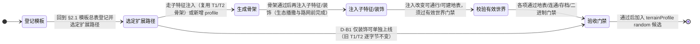

# 06. 地图模板规划：模板库、地形要素与未落地蓝图

> **状态**：T0 / T1 / T2 / D-A 已落地；本文保留**模板设计目标、模板总表、未落地组合库、D-B 子特征注入蓝图、R0 河道表示迁移与验收门禁**。
> **已落地的共用技术基座**（地表单元、地貌特征、水体与资源池、装饰、地表查询、生成顺序、路网、取水、快照、前端绘制与配置）已迁入现状文档 [../../current/tech/14-terrain-and-network.md](../../current/tech/14-terrain-and-network.md)；视觉方案见 [./07-terrain-art.md](./07-terrain-art.md)。


> **本文以「地图模板」为核心**：回答「我们想要哪些地图、每张地图像什么、玩家在上面做什么」，并把数据结构、生成流水线、路网、水资源、快照、存档、前端渲染与配置统一降格为**服务于实现这些模板的共用基座**——任何新技术只有当它让某个地图模板能落地、能被保存、能被读回时，才有资格进入本文。
>
> **状态**：T0 统一地表查询、T1 山口聚落、T2 两岸河谷水系与 D-A 地表装饰系统**均已落地**（T1/T2 于 v1.47.5；D-A 于 v1.49.1，v1.49.2/v1.49.3/v1.50.10 持续打磨）；生成器版本 **4**（v1.50.17 经 T1-R 主脊通行力修复后由 3 递增）；T1/T2 **子特征注入**、D-B/D-C 高级装饰为**新增规划（v1.48.0）**；T4 动态水文、桥梁与土地演化**未实现、未排期**。**T1-R 主脊通行力缺口已修复**（2026-09-11 审查发现、同日修复：主脊最大坡度由约 24° 提升至 36°~41°，产生真实硬禁行与绕行代价；实测记录、参数契约与门禁见 §9.3.1）。
> **本文定位**：地形领域**唯一权威文档**——以地图模板为主轴，同时承载「模板清单与地理玩法」与「支撑其实现的技术方案」两部分。2026-09-11 由原 `./06-terrain-templates.md`（方向设计）与 `26-plan-terrain-implementation.md`（实施技术方案）合并而成，26 号已删除；合并时按当前代码事实校正了原 26 号中已过时的落地状态（D-A 装饰已落地、`render_terrain.js` 已拆分、配置已达 232 字段）。同日二次整理：改为以地图模板为核心，技术章节按「服务对象」重新归位并整体重排章节号（对照表见 §0.3）。
> **整理日期**：2026-09-11（合并日 + 模板化重组日）；方案优化基线 v1.48.0，现状基线 v1.50.16。
> ⚠️ **配置字段状态更正（2026-09-12）**：本文 D-B 蓝图引用的三个字段
> `terrainGenerationMaxRetries`（有界重试）、`terrainAccentSubFeatures`（子特征注入总开关）、
> `terrainTreeSeasonTint`（树木季节变色开关）**已于 v1.50.18 全量删除**——它们在 `crates/` 中零读取点，
> 属"空转配置"。因此下文凡出现「已声明未消费」「保留该开关」「应一并清理」的表述**均以本段为准**：
> 三项已清理完毕，**D-B 落地时必须把字段连同唯一消费点一起加回**（`tools/config-check.js` 第 5 条
> 「空转参数」规则会拒绝任何无消费点的字段）。树木季节变色已不依赖任何配置开关：
> 自 2026-09-12 起由前端 `SimTreeTint`（`render_terrain.js`）按快照季节实时派生，
> 调参入口是 `window.RENDER_CONFIG.treeTint*`（`frontend/js/config.render.js`）。
> **入口**：[文档导航](../../README.md) · [长期路线图](../design/01-roadmap.md) · [地形美术与世界景观提升](./07-terrain-art.md)。
> **依据**：[./01-integration-contracts.md](./01-integration-contracts.md)、[./07-terrain-art.md](./07-terrain-art.md)、[../../current/tech/17-seasonal-lighting.md](../../current/tech/17-seasonal-lighting.md)、[../../current/tech/18-water-rendering.md](../../current/tech/18-water-rendering.md)。
> **现状以** `../../current/tech/14-terrain-and-network.md`、`../../current/tech/04-config-system.md`、`../../current/tech/06-snapshot-and-save.md`、`../../current/tech/16-frontend-overview.md` 与 `../../current/01-changelog.md` 为准。

## 状态机

本节描述「未落地地图模板」从总表登记、选定扩展路径、生成骨架、注入子特征/装饰、校验有效世界到验收门禁的立项生命周期。已落地的 T0/T1/T2/D-A 不在此机内；本机只覆盖规划侧（D-B 子特征注入、R0 河道迁移、P1 新 profile 与未落地模板组合库）。



| 状态 | 含义 | 进入条件 | 退出条件 |
| :--- | :--- | :--- | :--- |
| A 登记模板 | 在 §2.1 总表登记，状态=未排期，标注构成与玩法 | 新增模板先回总表 | 选定扩展路径（子特征注入/新增 profile） |
| B 选定扩展路径 | 依 §5.1 三阶段（D-B1/R0/D-B2/P1）独立发布 | 登记后选路径 | 生成骨架或 D-B1 装饰单独上线 |
| C 生成骨架 | T0 地表查询 + 合法走廊生成，先走廊后曲线 | 路径确定 | 骨架通过后再注入子特征/装饰 |
| D 注入子特征/装饰 | D-B 子特征注入器按 seed 哈希概率注入；accent_rng 生成装饰 | 骨架完成 | 改变可通行/可建地表后过门禁 |
| E 校验有效世界 | 连通性/占地/取水/确定性门禁（§11/§14） | 注入完成 | 各项门禁通过 |
| F 验收门禁 | §18 分阶段验收，通过后才加入 random 候选 | 门禁全过 | 模板可用，加入 terrainProfile 轮换 |

**不变量**（落地时必须守住的约束）：
- 装饰不参与通行/资源/碰撞与建造判定，且只能用独立 `accent_rng` 生成，不消费共享模拟 RNG；新增随机只用地形局部 RNG，不污染世界 RNG。
- 子特征注入不新增 profile 命名；开启与关闭子特征是两个不同的静态世界，不要求 POI/营地坐标相同。
- 同版本同种子确定性优先于旧图兼容：`terrain_generator_version` + `terrain_profile` + `SAVE_FORMAT_VERSION` 门禁拒绝旧档，杜绝旧路网与新地貌静默拼接。

> 本文为规划态：以上状态（D-B 子特征注入、R0 河道迁移、P1 新 profile、未落地模板组合库）均尚未实现；T0/T1/T2/D-A 已落地不在本机内。

## 0. 本文的组织方式与阅读路径

### 0.1 三层结构：模板 → 地形要素 → 共用基座

本文只有一条主轴：**地图模板**。

```text
地图模板（第一部分 · 核心）                    玩家看到与玩到的东西
  ├─ 已落地模板：山口聚落 / 两岸河谷
  ├─ 未落地模板：湖畔盆地 / 台地聚落 / 河口三角洲 / …（组合库）
  └─ 扩展机制：子特征注入 / 新增 profile / 地表装饰
        ▲
        │ 由这些要素拼装
        │
地形要素（第一部分 · 词汇表）                  构成模板的八类地形种类
        ▲
        │ 全部依赖
        │
共用技术基座（第二部分）                       让任何模板都能生成、通行、存档、渲染
  地表查询 · 数据模型 · 创世流水线 · 路网 · 水资源 · 选址 · 快照存档 · 前端 · 配置
```

- **第二部分的每一节**都以「服务对象」开头，说明它在为哪些地图模板服务。评审任何新技术时先问：**它服务于哪个模板？** 没有对应模板需求的能力，不进本文。
- **第三部分**是模板落地的通用流程：文件清单、验收门禁、提交顺序与明确不做的事——新增任何模板都复用同一套。

### 0.2 术语对齐

| 术语 | 含义 | 位置 |
| :--- | :--- | :--- |
| **地形要素**（地形种类） | 八类基础地形：丘陵 / 山脊与山口 / 河流与浅滩 / 河滩与河阶 / 湖泊 / 峡谷与断崖 / 泉谷与瀑布（湿地已删除）。地图模板由它们拼装而成 | §3 |
| **地图模板** | 一张地图的完整玩法设定：由若干地形要素 + 子特征构成，决定玩家看到什么、在哪里做取舍 | §2、§4 |
| **profile** | 模板在内核中的实现形式：`mountain_pass_v1` / `river_valley_v1`，以及规划中的 `plateau_settlement_v1` / `basin_oasis_v1` / `alluvial_fan_v1`。一个模板对应一个 profile | §2、§9.1 |
| **子特征**（sub-feature） | 在已有 profile 骨架上按种子哈希概率注入的额外地貌（山脚湖 / 山涧飞瀑 / 河谷峭壁 / 牛轭湖……），**不新增 profile** | §5 |
| **地表装饰**（Accent） | 纯视觉点缀（树 / 岩石 / 灌木 / 草簇），不参与通行、资源、碰撞与建造判定 | §7.4、§9.7 |

### 0.3 旧章节号对照

本文于 2026-09-11 由「地形特征 + 技术方案」双轴改为「以地图模板为轴」，章节号整体重排。若你手中的旧引用指向旧号，按下表换算；正文内所有 `§` 引用已同步改写。

| 旧 | 新 | 主题 | 旧 | 新 | 主题 |
| :--- | :--- | :--- | :--- | :--- | :--- |
| 1 | 1 | 设计目标与责任边界 | 12 | 14 | 快照、存档与版本门禁 |
| 2 | 3 | 地形种类与地理玩法 | 13 | 15 | 前端景观实现 |
| 3 | 4 | 未来地图组合库 | 14 | 16 | 配置设计 |
| 4 | 8 | 生成顺序与有效世界保障 | 15 | 17 | 文件级实施清单 |
| 5 | 2 | 方案结论与落地状态总览 | 16 | 18 | 分阶段验收门禁 |
| 6 | 7 | 目标数据模型 | 17 | 19 | 分阶段落地与景观计划对接 |
| 7 | 9 | 确定性地貌生成 | 18 | 20 | 实施顺序与退出标准 |
| 8 | 10 | 现状与改造边界 | 19 | 21 | 明确不做的事项 |
| 9 | 11 | 路网与运动 | 20 | 5 | 多种新地形的可编码实施蓝图 |
| 10 | 12 | 取水与生态预算 | 21 | 6 | R0：T2 河道表示迁移 |
| 11 | 13 | 房屋、农业、设施与 POI 接入 | — | — | — |

> 小节号随父章节整体平移：旧 §7.3.1 → 新 §9.3.1，旧 §6.4 → 新 §7.4，旧 §20.4.A → 新 §5.4.A，以此类推。

---

# 第一部分 · 地图模板（核心）

> 本部分是全文核心：先定义我们想要哪些地图（§2 清单 / §3 词汇表 / §4 组合库），再给出新增模板的施工图（§5 实现蓝图 / §6 牛轭湖硬前置）。

## 1. 地图模板的设计目标与责任边界

> **服务对象**：本文全部内容——先定清楚「地图模板」是什么、谁负责它的哪一部分。


让地图拥有可以被记住的地方：一条把聚落分隔两岸的河、一处绕山必经的山口。地形同时改变画面轮廓、路线选择和聚落条件，帮助玩家理解“为什么人们住在这里、走这条路”。

内核地形以高程与坡度为基础，见 [biome.rs](../../../crates/sim_core/src/geo/biome.rs)；[terrain.rs](../../../crates/sim_core/src/geo/terrain.rs) 使用倾斜大势与平滑起伏。本文是在此基础上的扩展，不将已有坡地改名当作新功能。

本文是**地形种类、生成关系、通行、选址和水资源语义**的规划权威；[景观提升计划](./07-terrain-art.md)负责材质、光照、素材、遮挡、缓存与视觉性能。土地适宜性由地形提供，农田产权、投资与产出仍由[农业规划](./04-farmland-agriculture.md)负责。

### 1.1 核心原则

1. **Rust 地理事实唯一真相源**：前端只绘制内核提供的高程、地表类别、水域、岸带、连接设施与装饰位置，不用装饰反推碰撞或资源。
2. **先走廊后曲线**：先在栅格上找合法通行走廊，再拟合 `Curve3D`；不能用节点端点合法替代整条曲线合法。
3. **静态拓扑先行**：T1/T2 的地形、水位、浅滩和禁建区在创世时确定；运行中不改变道路拓扑，降低缓存和存档风险。
4. **水体几何与水资源池分离**：河湖可以有连续视觉轮廓，但可采水点引用共享资源池，不按岸点重复发库存。
5. **同一查询服务供房屋、农业、防务和路网消费**：不再让各模块分别判断坡度、占地、水域和接路。
6. **新增随机只使用地形局部 RNG**：地貌结构、子特征与装饰不污染现有世界 RNG；POI、始祖、出生等既有消费顺序保持不变。
7. **同版本同种子确定性优先于旧地图兼容**：生成器变更必须通过版本门禁拒绝旧存档，不能把旧路网与新地貌静默拼接。
8. **装饰不产生物理事实**：地表装饰（树木/岩石/灌木）是纯视觉层，不参与通行、资源、碰撞与建造判定。

## 2. 地图模板路线与落地状态总览

> **服务对象**：全部地图模板——这里是模板清单、落地状态与实现路线的总入口。

### 2.1 地图模板总表

本文要实现的全部地图模板如下。「构成」列引用 §3 的地形要素；「实现方式」列说明它走 §5 的哪条扩展路径（子特征注入 / 新增 profile）；「详情」列给出玩法意图位置。

| # | 地图模板 | 构成（地形要素） | 主要玩法价值 | 实现方式 / profile | 状态 | 详情 |
| :--- | :--- | :--- | :--- | :--- | :--- | :--- |
| 1 | 山口聚落 | 丘陵、山脊与山口、山脚泉源 | 道路绕过陡坡，在山口汇聚；山两侧采集距离不同 | ✅ `mountain_pass_v1` | **已落地**（v1.47.1/v1.47.2；v1.50.17 修复主脊通行力） | §3.1/§3.2、§9.3 |
| 2 | 两岸河谷 | 主河、浅滩、河滩/河阶、泉谷、少量丘陵 | 两岸聚落经浅滩往返，近在眼前的资源需要绕行 | ✅ `river_valley_v1` | **已落地**（v1.47.5） | §3.3/§3.4/§3.8、§9.5 |
| 3 | 湖畔盆地 | 山脚湖 / 牛轭湖、外缘山坡、环湖缓岸 | 房屋沿干燥缓岸分布，道路绕开水面 | 子特征注入（复用 T1/T2 骨架） | ⏳ 未排期 | §3.5、§5.4.A/§5.4.C |
| 4 | 台地聚落 | 平缓台面、台缘陡坡、坡脚水源、缓坡入口 | 高处开阔用地与下行取水/采集成本之间的取舍 | 新增 profile `plateau_settlement_v1` | ⏳ 未排期（P1） | §5.6 |
| 5 | 河口三角洲 | 主河分汊、潮湿冲积低地、支汊间干地脊 | 丰富近水土地、绕开支汊的路径网络 | T4 动态水文 | ⏳ 未排期 | §4 |
| 6 | 海湾聚落 | 受陆地环抱的海湾、缓岸、岩岬 | 沿避风岸发展的聚落、绕湾陆路 | T4（需海陆边界与淡水语义） | ⏳ 未排期 | §4 |
| 7 | 盆地绿洲 | 封闭/半封闭盆地、汇水低地、中心泉池 | 聚落围绕低地水源分布 | 新增 profile `basin_oasis_v1` | ⏳ 未排期（P1） | §5.6 |
| 8 | 峡湾聚落 | 深窄海湾、两侧陡坡、谷口、少量缓岸 | 水域造成强分隔，谷口成为陆路关键节点 | T4 | ⏳ 未排期 | §4 |
| 9 | 河谷聚落 | 上游河道、谷底冲积带、两侧连续山坡 | 水、耕地、道路都沿谷底集中 | T2 后扩展 | ⏳ 未排期 | §4 |
| 10 | 半岛聚落 | 三面临水的陆地、狭窄陆桥、内陆高地 | 陆桥成为进出瓶颈 | T4 | ⏳ 未排期 | §4 |
| 11 | 海岛聚落 | 被海水完整包围的陆块、岛内淡水 | 隔离环境下的资源闭环与有限土地 | T4 以后（依赖航运与补给模型） | ⏳ 未排期 | §4 |
| 12 | 沙漠绿洲 | 干旱裸地、局部泉池、绿洲植被 | 水源极度集中，聚落与储备围绕绿洲展开 | 未排期（需干旱地表/蒸散表现） | ⏳ 未排期 | §4 |
| 13 | 山前冲积扇 | 山口出口、扇形缓坡、分散浅沟 | 山地资源流向平原的过渡地带 | 新增 profile `alluvial_fan_v1` | ⏳ 未排期（P1） | §5.6 |
| 14 | 喀斯特地貌 | 石灰岩丘峰、洼地、落水洞/泉眼 | 地表路径绕开岩丘，水源集中在泉眼 | T4（洞穴与地下河另立项） | ⏳ 未排期 | §4 |

> **读法**：本文后续所有技术章节都服务于这张表——要么让已落地的 1、2 号模板更完整（§9、§11～§16），要么给出新增模板 3～14 号的施工规则（§5、§6）。**新增任何模板，先回到本表登记，再按 §5 的扩展路径施工。**

### 2.2 实现路线与落地进度

采用“静态地貌生成 + 内核地表查询 + 合法走廊生成 + 共享水资源池 + FABS 增量快照”的路线，不引入完整侵蚀模拟、流体模拟、桥梁施工或 GPU 渲染器作为前置条件。

第一条可实施主线如下（v1.48.0 优化后，★ 标注当前实际落地进度）：

```text
T0 地表查询与完整曲线校验                      ✅
  -> T1 山口聚落（丘陵/山脊/山口连续起伏；v1.47.7 起无台地）  ✅
       + D-A 装饰系统基础（Tree/Boulder/Bush）   ✅ v1.49.1
       + D-B 装饰系统扩展（RockCluster/GrassTuft + 季节色调）  ⏳
  -> T2 静态主河/两处浅滩/河滩河阶/泉谷          ✅
  -> T1 子特征注入（山脚湖 / 山涧飞瀑 / 密林山坡 / 裸岩露头）  ⏳
  -> T2 子特征注入（牛轭湖 / 河谷峭壁 / 河岸林带 / 碎石浅滩）  ⏳
  -> D-C 高级装饰（泉水景观群 / 资源区景观）      ⏳
  -> T4 动态水文、桥梁、土地演化                 ⏳
```

> **子特征注入**：通过 seed 哈希按概率决定是否在 T1/T2 骨架上注入额外地貌特征（如湖泊/瀑布/峭壁）。注入不改变基础 profile 命名，仅在同一模板内增加视觉与地形复杂度，避免无限新增独立 profile。
> **装饰系统（D 系列）**：独立于骨架生成的纯视觉要素层，用独立 `accent_rng` 生成树木/岩石/灌木等点缀物。装饰不参与通行/资源/碰撞计算，挂进 `drawWorldEntities()` 统一深度队列渲染。

### 2.3 落地状态总览

| 阶段 | 状态 | 落地要点 | 剩余工作 |
| :--- | :--- | :--- | :--- |
| T0 地表查询与完整曲线校验 | ✅ 主体已落地 | `GeoCell` 扩展 `SurfaceKind`/肥力/水体关联/标志；`geo/query.rs` 提供 `sample_cell`/`validate_footprint`/稳定失败码；房屋实体化消费完整占地；`TerrainMap::validate_curve` 走廊校验原语；`geo/corridor.rs` 浅滩与陆路寻路 | 生态落位（`ecology/spawn.rs`）部分生存硬约束优化；`terrainGenerationMaxRetries`（已声明未消费）已于 v1.50.18 删除，实现本步时一并加回 |
| T1 山口聚落（丘陵/山脊/山口连续起伏） | ✅ 已落地（v1.47.1/v1.47.2；v1.47.7 移除台地） | `mountain_pass_v1` profile；局部 `relief_rng` 派生主脊/山口连续起伏；存档版本门禁；前端按地表类别渲染。v1.47.7：删除台地压平与 `Ridge`/`Saddle`/`Terrace` 特征及前端轮廓绘制 | 山口地貌参数已配置化（`terrainPassRidgeWidth` / `terrainPassRidgeAmplitude`）；支脊未实现；子特征注入待规划。v1.50.17 完成主脊通行力修复（§9.3.1） |
| T2 静态主河/浅滩/河阶/泉谷 | ✅ 已落地 | `river_valley_v1` profile + 生成器版本 3（v1.47.7 起，与 T1 共用全局版本）；主河生成（`geo/hydrology.rs`），单调河床下凹与水面静态；低滩（`NO_BUILD`）与河阶（`RiverTerrace`）；两处静态浅滩走廊（`ShallowFord`，跨水授权）；共享水池 `WaterPool` 聚合取水与稳定扣减；地形感知路网（`spatial/terrain_network.rs`）与 `LaneTerrainProfile` 边权通行代价折算；占地校验拒绝浅水（`WaterCovered`）；存档格式升级为 7；10 个 T2 配置参数；前端河道/岸线/浅滩特征渲染与 HUD 水量去重；支持 T1/T2 模板按种子哈希随机轮换（`terrainProfile: 'random'`） | 子特征注入待规划 |
| D-A 装饰系统基础（Tree/Boulder/Bush） | ✅ 已落地（v1.49.1；v1.49.2/v1.49.3/v1.50.10 打磨） | `geo/accents.rs`（`AccentKind` 5 变体、`TerrainAccent`、`generate_accents()`、`ACCENT_RNG_SALT`）；`TerrainMap.accents` 字段 + 随 `terrain_state` 入档；FABS `SectionKind::TerrainAccents = 21`；前端 `render_terrain.js::drawAccentEntity()`（Tree 四瓣层叠树冠 / Boulder 多边形岩体 / Bush 三瓣灌丛，含叶片斑驳纹理与季节叶色 `SimTreeTint`）；配置字段现存 1 个（`terrainAccentDensity`），`terrainAccentSubFeatures`/`terrainTreeSeasonTint` 已于 v1.50.18 删除（见文首更正段） | RockCluster/GrassTuft 仅枚举定义未生成；装饰缓存标志仍与地形共用 |
| D-B 装饰系统扩展 | ⏳ 未实施 | — | RockCluster/GrassTuft 生成；季节色调细化 |
| T1 子特征注入 | ⏳ 未实施 | — | 山脚湖（T1 鞍部静水）；山涧飞瀑（主脊跌水）；密林山坡（装饰树群）；裸岩露头（陡坡岩石） |
| T2 子特征注入 | ⏳ 未实施 | — | 牛轭湖（回水湾）；河谷峭壁（河段两侧 Cliff）；河岸林带（沿河装饰树列）；碎石浅滩（河滩石砾） |
| T4 动态水文、桥梁、土地演化 | ⏳ 未实施 | — | — |

**实现偏差（方案设计 vs 实际落地）速查**：存档格式版本递增至 7（§14.3）；配置落地 19 字段（§16，全系统配置总数 240）；`TerrainFailure` 实现 8/10 变体（§7.5，`WaterCovered` 已产生）；`validate_curve` 落在 `geo/corridor.rs` 与 `terrain.rs`（§11.1）；路网感知生成落地于 `spatial/terrain_network.rs`（§11）；房屋选址改造实际落在 `housing_system/settlement.rs`（§13.1）；前端地形缓存仍为单一 `_terrainCached`（§15.4）；FABS 新增 `TerrainFeatures=18` 承载水系全部特征、`TerrainAccents=21` 承载装饰（§14.2）。

## 3. 模板构成要素：八类地形种类与地理玩法

> **服务对象**：全部地图模板——八类地形是拼装模板的**词汇表**，模板是这些词汇的组合。


> v1.48.0 方案优化：**取消独立 T3 profile 阶段**。原 T3 的湖泊/湿地/峡谷/瀑布重组为「T1/T2 子特征注入」+「地表装饰系统（Accents）」两大方向；湿地因视觉辨识度低而明确删除。下表「落地路径」列反映这一重组。

| 地形 | 视觉识别点 | 主要玩法价值 | 落地路径 |
|---|---|---|---|
| 丘陵 | 连续缓坡、局部露岩 | 建房地点与绕行距离的取舍 | ✅ T1 已落地 |
| 山脊与山口 | 有方向的山体、鞍部、裸岩坡面 | 形成交通走廊和资源距离差异 | ✅ T1 已落地 |
| 河流与浅滩 | 连续河道、两岸、可见的石砾浅滩 | 分隔聚落并形成跨岸通道 | ✅ T2 已落地 |
| 河滩与河阶 | 河边沙砾带、稍高的平缓阶地 | 安家位置与取水距离的取舍 | ✅ T2 已落地 |
| 湖泊 | 成片静水、岸线、缓岸 | 绕湖交通与岸线空间取舍（湖是障碍，不是资源点） | ⏳ 子特征注入：T1「山脚湖」/ T2「牛轭湖」（均不可采水，见 §3.5） |
| 湿地与泥泽 | 芦苇、浅水斑块、软泥地 | 通行代价与土地利用差异 | ❌ v1.48.0 删除（视觉辨识度过低） |
| 峡谷与断崖 | 深切谷地、陡壁、狭窄出口 | 少量强地标与路线瓶颈 | ⏳ 子特征注入：T2「河谷峭壁」 |
| 泉谷与瀑布 | 山脚泉眼、短溪、落差水景 | 将现有水源 POI 与山地联系起来 | 泉谷 ✅ T2 已落地；瀑布 ⏳ 子特征注入：T1「山涧飞瀑」 |

这里的山地是适配当前社区尺度地图的山脊、山麓与局部峰体，不把一整条大陆级山系压缩进村落大小的区域。每张图先选一个主地貌、最多两种辅助特征，避免八类地形全部堆在同一张图。

### 3.1 丘陵：适合首先落地

> v1.47.7 起不再将「台地/高台」纳入 T1——平顶高台在实机中观感生硬，已从 T1 设计与实现中移除；T1 只保留连绵丘陵（山脊/山口连续起伏）。台地如要回归，须作为第 4 节中的独立后续地图模板，经新的高度场、台缘占地与缓坡通行契约验证。

- **形态**：一到两组连绵丘陵，草地与裸岩沿坡度渐变。
- **规则**：缓坡可通行；房屋需满足完整占地的坡度、高差与道路接入条件，不能只检查中心点高度。
- **取舍**：丘陵缓坡提供可建空间，但可能离水源较远；坡脚近资源，却可能缺少可扩张用地。
- **最小实现**：高程形状、坡度/占地校验、贴地路网和材质分区。首期不附加高地防御或税收加成。
- **验收**：丘陵缓坡从远景可辨认，房屋底面无明显悬空；存在多处可选建房区，不能由生成器指定居民必住某处。

### 3.2 山脊与山口：形成自然路线

- **形态**：有明确走向的主脊，配少量支脊；在合理位置保留较低的鞍部作为山口。
- **规则**：超过配置阈值的坡段禁止通行，中等坡段按经过的坡形计入成本；山口是合法的缓坡通道，不是额外传送节点。
- **资源联系**：石矿、金矿可优先选择可达的岩石露头；并非每座山都必有矿，也不随山体面积增发资源额度。
- **最小实现**：一条山脊、至少一个可达山口、两侧资源与营地候选地。山口不自动征税或建立关隘。
- **验收**：两端等高但中途越过陡脊的曲线不能被误判为平路；高坡会挡路，山口确实被路径搜索识别。

> ✅ **已修复（2026-09-11，v1.50.17）**：主脊宽度/幅度改走 `terrainPassRidgeWidth` / `terrainPassRidgeAmplitude`，实测主脊最大坡度升至 36.2°~40.8°（60 个种子），产生真实硬禁行与绕行代价（绕行比 2.17~4.80），山口仍是唯一通道且全图保持 1 个连通分量。参数契约与门禁见 §9.3.1。

### 3.3 河流与浅滩：首个地理玩法切片

- **形态**：一条主河道，少量弯曲、宽窄变化和连续岸线。首期不做分汊、改道或复杂支流。
- **规则**：普通水面禁止步行、建房；跨河只允许经内核认可的浅滩连接。浅滩有实际宽度、路程与通行成本，人物沿真实曲线过河。
- **取舍**：河两岸直线距离近，实际路程可能需要绕到浅滩，形成自然的往返与交易走廊。
- **最小实现**：固定水位、静态水域边界、固定浅滩、合法岸边取水点；不包含游泳、船舶、桥梁施工和涨水。
- **验收**：所有普通路段均不穿水；浅滩处人物与水面接触合理；关闭该连接的诊断场景会改变可达性，而不是仍从河中抄近路。

### 3.4 河滩与河阶：让岸边有空间层次

- **形态**：紧邻水体的低滩与较高阶地形成不同地表色和高度，避免河水直接贴着建筑。
- **规则**：首期低滩为固定建房排除带，河阶在坡度与占地校验通过后可建；这代表选址规则，不宣称已经有洪水灾害。
- **农业联系**：后续可提供天然土地适宜性，农业仍自行决定开垦成本与产量，不能因“冲积地”标签直接给家户发粮。
- **最小实现**：河道两侧派生岸带与建房掩码，显示“低滩不可建”原因。
- **验收**：阶地大小足够容纳真实房屋占地；河滩宽度与水面、通路一致，边缘不会被装饰遮住。

### 3.5 湖泊与出水口：产生环湖路径

> v1.48.0 起不再规划独立湖泊 profile，改为 T1/T2 子特征注入：T1 鞍部低地的「山脚湖」、T2 主河弯道切割的「牛轭湖」。两者均生成静态 `WaterBody` 特征（`resource_pool_id = 0`，**不可采水**，不创建 `WaterAccessPoint` / `PrimitivePoi`，不参与 HUD 水库存量统计）。**现行算法与拒绝条件以 §5.4.A（`FootLake`）与 §5.4.C（`OxbowLake`）为准**，本节只保留玩法意图。

**现行设计**：

- **形态**：闭合静水面，岸线以可接近的缓岸为主；T1 山脚湖是鞍部低地的椭圆湖盆，T2 牛轭湖是主河弯道外侧的静水湾，经窄口与主河连通。
- **规则**：湖面不可步行；湖岸按基础地表规则处理，**不提供取水**（无资源池、无 `WaterAccessPoint`）；窄口不产生 `TerrainConnection`，人物不能由此跨河。
- **玩法价值**：绕湖交通与岸线空间取舍——湖是**通行与建造的障碍**，不是资源点。
- **验收**：同一湖面的高程一致，岸线与地表交界合理；无湖底道路、湖中房屋或孤立必需资源；湖不计入 HUD 水库存量；加入湖后全图可行走连通分量仍为 1。

> ⚠️ **与旧稿的两处实质差异**（旧稿见下方删除线，已作废）：① 现行子特征湖**没有出水口**——不再要求「唯一或少量出水通道」，也不再派生「湖泊与其出水河段属于同一水系」；② 现行子特征湖**不可采水**，因此「合法岸点可取水 / 多个岸点不能重复创建水量」不适用。此外 `SHORE_ACCESS` 目前是**只写不读**的标志（见 §7.1 说明），湖岸写它不产生任何交互语义。

~~- **形态**：盆地中的有边界水面，岸线包含可接近的缓岸与少量岩岸；只做有出水口的湖。~~
~~- **规则**：湖面不可步行，合法岸点可取水；湖泊与其出水河段属于同一水系，多个岸点不能重复创建水量。~~
~~- **最小实现**：一个湖盆、明确湖面高程、一个出水口、一条绕湖陆路。~~

### 3.6 湿地与泥泽：已删除

> ❌ **v1.48.0 明确删除**。湿地与河滩/河岸在视觉上区分度低，玩家难以感知，且功能与河滩软地重叠。原「可涉软地 + 不可通行水洼」的设计由 T2 `RiverBank`（岸带软地，`terrain_soft_ground_cost`）承载，不再单独规划湿地 profile 或特征。

### 3.7 峡谷与断崖：控制数量的强地标

> v1.48.0 起改为 T2「河谷峭壁」子特征注入：部分河段（1–2 段）两侧生成 `Cliff` 特征（高 6–12m），对应地表写入 `NO_BUILD` 并硬禁行（`slope >= 34°` 即 `SurfaceKind::RockFace`，由 `is_hard_blocked()` 判为 `NO_WALK`；`terrainMaxWalkSlope = 30°` 低于该阈值，故不存在可通行的 34–45° 中间带，详见 §5.4.D）。

- **形态**：狭长谷地与陡峭谷壁，只占有限区域，保留从谷口或缓坡出入的路线。
- **规则**：陡壁不可跨越，沿谷路线按真实高程通行；采矿点必须有入口与可达落脚处。
- **最小实现**：当前高度场可表达的陡坡谷壁，不包含悬挑、洞穴、多层地下交通。
- **验收**：曲线平滑不会切进谷壁；远景仍能看见谷底路线，近景人物不会长期被山体完全遮挡。

### 3.8 泉谷与瀑布：连接已有水源与新地形

> 泉谷（`SpringValley`）已于 T2 落地（v1.47.5）；瀑布改为 T1「山涧飞瀑」子特征注入（主脊中段 3–5m 跌水 + 沟谷汇入）。

- **形态**：山脚低处的泉池接短溪；有合法落差时再加瀑布、浅潭和少量水雾。
- **规则**：水源与水系建立明确归属。取水发生在安全岸点或潭边，瀑布本体不可当步行路段。
- **最小实现**：先将现有水源 POI 适配到泉谷；瀑布只消费已有河段落差和流动状态，不在前端另造水流事实。
- **验收**：同一股水不在泉、溪、潭各复制一份储量或再生；水源断流时，不显示与内核状态矛盾的持续大流量。

## 4. 未落地地图模板的组合库

> **服务对象**：尚未落地、也未排期的地图模板——它们的玩法意图与前置条件。


> 以下均为**未排期的未来地图模板**，不是现有 profile，也不承诺按表中次序实现。**v1.48.0 起「T3 独立 profile 阶段」已取消**——表中标注 T3 的行现统一理解为「通过子特征注入或新 profile 实现，未排期」。每张图仍只选择一个主地貌，并限制为至多两种辅助特征；同一模板先完成最小静态切片及连通性、生存、资源守恒和确定性门禁，再增加动态水文、航运、洞穴或灾害等扩展内容。

| 地图模板 | 地形构成 | 玩家会观察到什么 | 建议阶段 / 前置 |
|---|---|---|---|
| 山口聚落 | 丘陵、主脊、山口、山脚泉源 | 道路绕过陡坡，在山口汇聚；山两侧采集距离不同 | ✅ T1 已落地 |
| 两岸河谷 | 主河、浅滩、河滩/河阶、少量丘陵 | 两岸聚落经浅滩往返，近在眼前的资源需要绕行 | ✅ T2 已落地 |
| 湖畔盆地 | 湖泊、外缘山坡、环湖缓岸 | 房屋沿干燥缓岸分布，道路绕开水面 | 未排期；复用 T1 山脚湖 / T2 牛轭湖子特征与可建区、连通性契约（原 T3，已并入子特征注入方向）。**不含湿地/泥泽**（v1.48.0 删除），也不依赖排水或出水口 |
| 台地聚落 | 边缘陡坡的平缓台面、坡脚水源、少量缓坡入口 | 高处开阔用地与下行取水/采集成本之间的取舍；入口自然汇聚 | 未排期；与已删除的 T1 平顶压平方案无关，须先验证台缘完整占地、缓坡入口和高度场表现 |
| 河口三角洲 | 主河分汊、潮湿冲积低地、支汊间干地脊与可达岸点 | 丰富近水土地、绕开支汊的路径网络与不同支流间的聚落竞争 | T4；需要分汊水系、共享资源池与动态水位/淹水边界，不在 T2 静态主河范围内 |
| 海湾聚落 | 受陆地环抱的海湾、缓岸、岩岬与内陆淡水来源 | 沿避风岸发展的聚落、绕湾陆路与岸线空间取舍 | T4；海水不可直接作为淡水资源，航运另立项，先完成海陆边界和淡水语义 |
| 盆地绿洲 | 封闭或半封闭盆地、汇水低地、外缘山坡与中心泉池 | 聚落围绕低地水源分布，外缘资源与中心生活区形成明确距离梯度 | 未排期；复用湖畔盆地的可建区与生存诊断契约，泉池走 `WaterPool`（见 §5.6） |
| 峡湾聚落 | 深窄海湾、两侧陡坡、谷口与少量缓岸 | 水域造成强分隔，有限岸带与谷口成为陆路关键节点 | T4；需要海水边界、陡坡走廊和安全岸线，航运不作为首批前提 |
| 河谷聚落 | 上游河道、谷底冲积带、两侧连续山坡和浅滩/桥位预留 | 水、耕地、道路都沿谷底集中，跨谷与上坡扩张形成权衡 | T2 后扩展；以两岸河谷为基础，逐步加入更连续的谷地骨架 |
| 半岛聚落 | 三面临水的陆地、狭窄陆桥、内陆高地或淡水点 | 陆桥成为进出瓶颈，岸线资源与有限扩张腹地形成选择 | T4；先确认海水、淡水、陆桥连通及极端阻断时的生存诊断 |
| 海岛聚落 | 被海水完整包围的陆块、岛内淡水与有限资源区 | 隔离环境下的资源闭环与有限土地；与外界交换必须有独立机制 | T4 以后；在航运、外部补给和孤岛生存模型完成前不启用为常规开局 |
| 沙漠绿洲 | 干旱裸地、局部泉池/地下水出口、绿洲植被与远距资源点 | 水源极度集中，聚落、路径和储备策略围绕绿洲展开 | 未排期；需先加入干旱地表/蒸散表现，但不以视觉沙漠标签直接改变水库存 |
| 山前冲积扇 | 山口出口、扇形缓坡、分散浅沟与较高扇缘 | 山地资源流向平原的过渡地带；扇面选址、洪沟禁建带与水源距离取舍 | 未排期；首期只做静态扇形地表与禁建/通行规则，洪水冲刷留至 T4 |
| 喀斯特地貌 | 石灰岩丘峰、洼地、落水洞/泉眼与可建台地 | 地表路径绕开岩丘，水源集中在泉眼或洼地；形成辨识度高的局部地标 | T4；洞穴、多层地下河和地下交通不进入首批，必须先定义地表水去向与安全禁入边界 |

这些组合只约束初始环境。聚落兴衰、道路流量和家庭选择由模拟涌现，不预设某一岸必富、某个山口必成王都；水体模板也不自动赋予航运、渔业或无限淡水。

## 5. 地图模板实现蓝图（D-B ～ 静态 Profile 扩展）

> **服务对象**：**新增地图模板的唯一施工图**——从子特征注入到新 profile 的全部编码规则。


> **目标读者**：直接编写 Rust/WASM/Canvas 代码的开发者。此节规定顺序、数据所有权、稳定 ID、拒绝条件和文件改动点；未写明的行为不得自行补充。它细化并在实现层面优先于第 7.4、7.6、15.5、16.5 节的概念性描述。
>
> **本节修正一个旧表述**：子特征会改变可通行/可建地表，故必须在生态播撒和路网生成前完成。开启与关闭子特征是两个不同的静态世界；不要求 POI、营地或节点坐标相同，只要求两者分别通过有效世界门禁。

### 5.1 范围、阶段与禁止跨越的边界

按以下三个可独立发布的阶段实现，**禁止合并为一次大改**：

| 提交组 | 交付内容 | 新增 profile | 改变物理事实 | 退出条件 |
| :--- | :--- | :--- | :--- | :--- |
| **D-B1** | 特征/快照骨架、`RockCluster`、`GrassTuft`、子特征选择器 | 否 | 否（仅新装饰与元数据） | 旧 T1/T2 的高度、地表格、路网、POI 均逐字节不变 |
| **R0** | T2 河道表示迁移：参数化中心线 + 蜿蜒列（§6） | 否 | 是（全部 T2 世界的河道几何） | R0-1/R0-2 与旧路径逐字节等价；R0-3 起全部门禁重跑通过；R0-4 证明存在满足几何量的裁弯窗口 |
| **D-B2** | T1 山脚湖、山涧飞瀑；T2 牛轭湖、河谷峭壁 | 否 | 是（高程、地表、水体、通行） | 每项通过地表/连通/存档/二进制门禁 |
| **P1** | 台地聚落、盆地绿洲、山前冲积扇三个静态模板 | 是（3 个） | 是 | 每个模板单独通过有效世界矩阵后才加入 `random` 候选 |

D-B1 的视觉子特征可以单独上线；D-B2/P1 任何一项失败均只禁用该特征或 profile，**不能**在运行中修改道路、移动居民或回抽世界种子。海湾、三角洲、海岛、峡湾、动态河流、洪水、桥梁、洞穴及多层地下水仍属于 T4，不能借本节的数据结构提前做成“看起来能走”的假设施。

### 5.2 单一真相源、稳定 ID 与新数据模型

#### 5.2.1 事实层分工

1. `TerrainMap.cells` 是高程、坡度、`SurfaceKind`、水域归属和禁行/禁建标志的唯一真相源。
2. `TerrainMap.hydrology.water_bodies` 是水面几何和水池关联的唯一真相源；`TerrainFeatureKind::WaterBody` **只是一份可渲染轮廓**，不得再保存第二套库存。
   - ⚠️ **`WaterBody` 一词在本文件里有三个含义，实现时勿混**：① `TerrainFeatureKind::WaterBody`（特征类型枚举，供 Canvas 画轮廓）；② `hydrology.water_bodies: Vec<WaterBody>` 中的结构体（几何 + `resource_pool_id`，唯一真相源）；③ §5.4 里的「`WaterBody #2` / `#3`」指 **cell 的 `water_body_id` 取值**，与 `TerrainFeature.id` 是两套编号空间（见本节 ID 表）。
   - ⚠️ **顶点副本是有意为之**：§5.4.A/C 要求把同一组顶点同时写入 `hydrology.water_bodies` 与 `TerrainFeature.vertices`。这是为不改动既有 FABS `TerrainFeatures` section 布局而接受的冗余；两份必须由同一次生成写入，并由 `validate_static_terrain_geometry()` 断言逐字节相等，禁止任何一方被单独修改。
3. `TerrainMap.features` 是少量、按 ID 排序的线/面特征，供快照和 Canvas 绘制。它不保存资源、税收、寻路缓存或 Agent 状态。
4. `TerrainMap.accents` 是纯视觉点集。树林、碎石滩等可以改变画面密度，但永远不改变 `NO_WALK`、路径成本、碰撞、资源量和房屋候选。
5. 生态播撒、POI 调整、`terrain_network` 和房屋选址只能调用 `sample_cell`、`validate_footprint`、`corridor::route`/`validate_curve`，不得读取 feature 名称来绕过地表规则。

新增类型定义如下。`#[serde(default)]` 只能用于容器字段；**闭集枚举不能用字符串兜底**，未知枚举/不支持的 profile 必须拒绝存档。

> **两套版本门禁的分工（别混淆）**：`#[serde(default)]` 解决的是**同一生成器版本内**的字段增删容错（旧档缺字段时填默认值）；而「旧世界必须被拒绝」由 `WorldSave.terrain_generator_version` 与 `terrain_profile` 的严格相等校验负责（`world_save.rs::deserialize_save`）。所以「给新字段加 `serde(default)`」与「拒绝旧档」并不矛盾：前者让**同一版本**的新旧结构互通，后者挡住**跨生成器版本**的地形错配。当前常量：`TERRAIN_GENERATOR_VERSION = 4`、`SAVE_FORMAT_VERSION = 7`、FABS `FORMAT_VERSION = 2`。

```rust
// terrain.rs
#[derive(Debug, Clone, Copy, PartialEq, Eq, Serialize, Deserialize)]
pub enum TerrainFeatureKind {
    River = 0,
    RiverBank = 1,
    ShallowFord = 2,
    SpringValley = 3,
    WaterBody = 4,  // 闭合静水面：山脚湖、牛轭湖
    Waterfall = 5,  // 从 source 到 basin 的跌水折线
    Cliff = 6,      // 沿崖顶或崖脚的折线；禁行来自 cells，不来自本枚举
}

#[derive(Debug, Clone, Copy, PartialEq, Eq, Serialize, Deserialize)]
pub enum TerrainSubFeatureKind {
    FootLake = 0,
    RidgeWaterfall = 1,
    ForestedSlope = 2,
    RockyOutcrop = 3,
    OxbowLake = 4,
    RiverCliff = 5,
    RiversideForest = 6,
    GravelBeach = 7,
}

/// 规划期中间结构：只描述「要注入什么」，不含生成后的 ID 绑定，不进快照。
/// `plan_subfeatures` 的返回类型（§5.3 第 4 步）。
#[derive(Debug, Clone)]
pub struct PlannedSubFeature {
    pub kind: TerrainSubFeatureKind,
    pub salt: u64,          // 该 kind 的固定盐值
    pub anchor_hint: Vec3,  // 由 profile 几何推导的候选锚点（山口鞍部 / 主河弯道）
    pub accepted: bool,     // 第 5d 步局部判定的结果
}

#[derive(Debug, Clone, Serialize, Deserialize)]
pub struct TerrainSubFeature {
    pub id: u32,                       // 稳定 ID，见下表
    pub kind: TerrainSubFeatureKind,
    pub anchor: Vec3,                  // 生成锚点，z 为最终地表高程
    pub bounds_min: Vec3,              // 世界坐标 AABB，仅用于调试/检查
    pub bounds_max: Vec3,
    pub feature_ids: Vec<u32>,         // 关联 TerrainFeature，升序
    pub accent_id_start: Option<u32>,  // 无装饰则 None
    pub accent_id_end: Option<u32>,    // 闭区间；无装饰则 None
}

// hydrology.rs：0 表示静态但不可采的水面；现有河流保持 pool=1。
pub const NO_RESOURCE_POOL_ID: u32 = 0;
```

`TerrainMap` 增加 `#[serde(default)] pub sub_features: Vec<TerrainSubFeature>`；每次创世先清空 `features`、`accents`、`sub_features` 和 `hydrology`，再按第 5.3 节重建。`WaterBody.resource_pool_id` 暂保留 `u32`，湖泊填写 `NO_RESOURCE_POOL_ID`；不得把 `None` 扩散为一轮全链路 `Option` 改造。只有将来需要“可采但无 POI”的第三种状态时，才另行迁移为 `Option<u32>`。

稳定 ID 不能使用 `Vec::len()`、HashMap 遍历顺序或候选失败次数。**下表中的 `kind_code` 一律指 `TerrainFeatureKind as u32`（0–6），不是 `TerrainSubFeatureKind`**——两者编号空间不同，混用会直接算错 ID。固定分区如下：

| 对象 | ID 范围 | 分配规则 |
| :--- | :--- | :--- |
| 当前 T2 核心水系 `TerrainFeature` | 1、10–11、20–21、30 | **绝不重排**（River=1、ShallowFord=10/11、RiverBank=20/21、SpringValley=30） |
| T1 子特征 `TerrainFeature` | 100–127 | `100 + kind_code * 4 + local_index` |
| T2 子特征 `TerrainFeature` | 200–227 | `200 + kind_code * 4 + local_index` |
| 静水 `water_body_id`（**独立于 `TerrainFeature.id`**） | 2 / 3 | 山脚湖=2、牛轭湖=3；不因候选失败换号 |
| `TerrainSubFeature` | 1000 + `TerrainSubFeatureKind as u32` | 一种最多一个实例；若未注入则不创建 |
| 通用 Accent | 维持现有 0..N-1 | 不改变 `generate_accents()` 的现有 RNG 消费顺序 |
| 注入 Accent | 从通用 Accent 的 `len()` 开始连续追加 | 按 `TerrainSubFeatureKind` 升序、再按局部 index 追加 |

`local_index` 是同一次生成中同 `kind` 特征的出现序号，从 0 起递增。§5.4 涉及的 5 个特征 ID 必须由本表推导，不得另行手写：

| 子特征 | 生成的特征 | `kind_code` | `local_index` | 最终 `TerrainFeature.id` |
| :--- | :--- | :--- | :--- | :--- |
| `FootLake`（T1） | `WaterBody` | 4 | 0 | **116** |
| `RidgeWaterfall`（T1） | `SpringValley`（视觉浅沟） | 3 | 0 | **112** |
| `RidgeWaterfall`（T1） | `Waterfall` | 5 | 0 | **120** |
| `OxbowLake`（T2） | `WaterBody` | 4 | 0 | **216** |
| `RiverCliff`（T2） | `Cliff` | 6 | 0 | **224** |

> **修订记录（2026-09-11 审查）**：原表 T2 规则写作 `200 + (kind_code - 4) * 4 + local_index`，且 §5.4 手写了 `104` / `105` / `220` 三个 ID。这三者在「`kind_code` = `TerrainFeatureKind`」与「= `TerrainSubFeatureKind`」两种解读下都推不出来（`Waterfall` 应为 120、`SpringValley` 应为 112、`Cliff` 应为 224）。现统一为同一条公式，§5.4 的 ID 全部改由本表推导。

**D-B1 要求（当前未实现）**：所有输出集合最后按 `id` 升序排序，并断言 ID 唯一（现有 `features` 是生成顺序，`accents` 已按 ID 排序）。`feature_ids` 和所有几何顶点须在创建时固定顺序，不能在前端重排序。D-B1 落地时必须同时更新 §7.2 与 §14.1 的顺序描述。

### 5.3 无歧义的创世流水线

当前 `generate_with_config()` 的“生成基础地貌 → 河谷 → 装饰”需重构为以下私有阶段；外部调用点仍只调用 `generate_with_config(seed, config)`：

```text
0. resolve_profile(seed, config.terrain_profile)                     // 不消费 WorldRng
1. reset_static_terrain_state()                                      // 清 features/accents/sub_features/hydrology
2. generate_base_relief(seed, profile)                               // 保持现有主 RNG + relief_rng 消费顺序
3. apply_profile_static_hydrology(seed, profile, config)             // T2 主河；P1 对应水面
4. plan_subfeatures(seed, profile, enabled) -> Vec<PlannedSubFeature>// 纯 hash 决定"注入哪些"；不读/写 terrain
5. 按 kind 升序逐个处理已计划的子特征：
     5a. snapshot_bbox(f)             // 复制该 feature AABB 内的原高程到局部数组
     5b. apply_subfeature_geometry(f) // 只改高程、水面几何与 features；不写 slope_angle_deg / flags
     5c. recompute_slopes_scratch(f)  // 仅在该 AABB 内算临时坡度（不提交到 cells）
     5d. accept_or_rollback(f)        // 用临时坡度做几何类接受判定；失败则按 5a 快照整块回滚
6. recompute_slopes(); derive_surface_and_flags(profile)             // 全图唯一写 slope + 派生/合并 flags 的位置
7. validate_static_terrain_geometry()                                // 边界、环带、宽度、ID、水面、禁行
8. generate_base_accents(seed, density)                              // 原有 accent_rng，不改其消费顺序
9. append_subfeature_accents(seed, plan, terrain, density)           // hash 放点，不使用 accent_rng
10. ecology::spawn / prepare_terrain_layout / connect_terrain_world // 只读取最终地表
11. validate_terrain_world + 生存成本诊断                            // 失败进入有界降级，见 5.8
```

关键规则：

- `generate_base_relief` 内的基础 `WorldRng::new(seed)` 与 `relief_rng` 调用顺序必须保持原样；新判定一律使用无状态整数混合函数，不能在中间插入 `gen_bool`。
- **第 5 步只改高程与几何**：不得写 `slope_angle_deg`、不得派生 `RockFace`/`SoftGround`、不得写 `NO_WALK`/`NO_BUILD`。第 5c 步算出的坡度是**判定用临时值**，不提交进 `cells`；第 6 步才是全图唯一写 `slope_angle_deg` 与派生/合并 flags 的位置。
- **接受判定必须分两层**（原方案把两层混写在同一处，导致流水线无法实现）：
  - **几何类**（只依赖该 feature 自身几何与地表）：在第 5d 步判定，失败即整块回滚该 feature，不影响其他子特征。例：§5.4.A 的「深水格触边 / 岸环不足」、B 的「中心格是否达到硬禁行坡度」、D 的「硬禁行连续带是否达目标长度 70%」。
  - **全局类**（依赖营地、POI、路网、生存距离）：在第 5 步**不可能判定**，因为这些实体要到第 10–11 步才存在。例：§5.4.A 的「形成无出口的初始营地连通分量」、C 的「岸带侵入初始必需 POI 安全半径」。这些一律下沉到 §5.8 的有界重试环，按「禁用该子特征 → 重试」处理。
- 回滚后必须重新执行第 6 步（或至少重算受影响 AABB），否则 `cells.slope_angle_deg` 会与最终高程不一致。
- **不得切断既有生存链路（★ v1.50.17 新增，适用于全部四个改变物理事实的子特征）**：施加后必须满足 ① 可行走连通分量数不增加；② 每个 `WaterAccessPoint` 仍能经路网到达至少一个初始营地节点；③ 已有取水点位置不被移动（选址阶段就要避开，而不是事后重排）。几何类检查（崖体/湖体 AABB 与 `interaction_radius` 相交、岸沿是否高于水面等）放第 5d 步；连通与可达类放第 11 步 → §5.8 重试环。
- `apply_subfeature_geometry` 写格子前先复制所需原高程到局部数组，**不能**边遍历边读回已改写的邻格。
- 水面、河岸、河阶、浅滩拥有更高优先级的 `SurfaceKind`：第 6 步对它们只重算 `slope_angle_deg`，保留其既有 `surface_kind` 与 flag；只有由坡度派生的陆地格才合并 `NO_WALK`/`NO_BUILD`。峭壁可在水系带外侧写 `RockFace`。
- ⚠️ **第 3 步需先改造既有实现**：当前 `hydrology::generate_river` 对**整张网格**无条件重写 `elevation` / `surface_kind` / `feature_flags` / `natural_fertility`（见 `geo/hydrology.rs`），第 2 步生成的基础地貌在 T2 下会被完全覆盖，且 `recompute_slopes()` 只重算坡度、不重派生 flags。本流水线落地时必须把水系写入收敛到河道带，否则第 6 步「统一重算」无从谈起。
- `generate_base_accents` 发生在路网/房屋尚未出现时，所以现有实现只能保证避开水面与禁行格；文档中“避开道路、房屋、POI”的描述不是当前代码事实。若未来必须做视觉避让，应新增**确定性的后处理过滤**，不得让装饰影响布局。

子特征选择器采用固定的 `mix64`，实现为私有纯函数；不得使用 `DefaultHasher`、浮点哈希或系统时间：

```rust
fn mix64(mut x: u64) -> u64 {
    x ^= x >> 30; x = x.wrapping_mul(0xbf58_476d_1ce4_e5b9);
    x ^= x >> 27; x = x.wrapping_mul(0x94d0_49bb_1331_11eb);
    x ^ (x >> 31)
}
fn roll_10000(seed: u64, salt: u64) -> u16 {
    (mix64(seed ^ salt) % 10_000) as u16
}
```

每种 feature 使用单独固定盐值和 `roll_10000 < probability_bp` 判定。首先选出**至多一个结构型**（T1：FootLake / RidgeWaterfall；T2：OxbowLake / RiverCliff），再选出**至多一个视觉型**（T1：ForestedSlope / RockyOutcrop；T2：RiversideForest / GravelBeach）。所以每张图最多两个子特征。

**互斥裁决规则（必须按此实现，否则同种子会因代码书写顺序而换图）**：在每一类内部，按 `TerrainSubFeatureKind` **升序**逐个判定；**首个命中者即选定，并立即停止该类别的后续判定**。因此「选到哪一个」只取决于哈希值与 kind 编号顺序，与函数书写顺序、插入位置无关。`terrainAccentSubFeatures=false` 时第 4–5、9 步为空（⚠️ 该开关已于 v1.50.18 删除，落地 D-B1 时须先按文首更正段把它加回并接线）；D-B1 上线前相关步骤必须是空实现、不改变既有世界。

### 5.4 D-B2 四种改变物理事实的子特征

下面的参数是首版常量，先不增加 20 个配置字段；确认平衡与性能后再将**确实需要调试**的少量值加入 `SimConfig`/`config.js`/`config-check.js`。

#### A. `FootLake`（仅 T1，`WaterBody #2`，无资源池）

1. **偏移量必须由湖体自身半轴推导，不能写成 `ridge_width` 的倍数**（★ v1.50.17 修订：原式 `0.18 * ridge_width` 在 T1-R 把 `ridgeWidth` 由 125m 降到 62m 后只剩 **11m**，远小于 `ry = 22m`，椭圆会骑在主脊脊线上）。取
   `offset = ry + 0.5 * rx`（半轴 `rx = 32m` 沿脊、`ry = 22m` 沿法线 → `offset = 38m`），并要求 `offset >= 2 * cell_step`（≈12.8m）。候选 AABB 距地图边界至少 `max(rx, ry) + 2 * cell_step`。
   **断言**：湖体沿脊方向的半轴必须完全落在鞍部窗口内，即 `rx <= 0.5 * saddle_width`（`saddle_width = 0.14~0.19 * world_size ≈ 107~145m`，`rx = 32m` 余量充足）。断言不成立说明鞍部被配得过窄，应先修 `saddle_width`，不要硬塞湖。
2. 对椭圆距离 `q = sqrt((dx/rx)^2 + (dy/ry)^2)`：
   - `q <= 1`：写湖床 `level - 1.2`；
   - `1 < q <= 1.22`：用 `1 - smoothstep(1, 1.22, q)` 把高程从 `level - 1.2` 平滑升到 `level + 0.35`（**岸沿高于水面**）；
   - `1.22 < q <= 1.55`：禁建岸带，把原高程按同一 smoothstep 权重向 `level + 0.35` 混合（整形），保证湖岸一整圈连续高于水面。
3. `level = min(候选边界 q∈[1.18,1.22] 的原高程) - 0.35`。★ **原稿取 `median(...)` 是错的**：边界高程一旦有起伏，中位数会让水面高于低侧岸沿，出现「水漫出岸」。取**最小值**保证水面低于整圈岸沿，配合第 2 条的岸带整形，高侧也不会挖出深坑。所有湖面格写 `DeepWater`、`water_body_id=Some(2)`、`NO_BUILD|NO_WALK`；内环 1 格写 `RiverBank|NO_BUILD|SHORE_ACCESS`，外环只在坡度/占地通过时允许建造。
4. 生成闭合 48 点椭圆 `TerrainFeature{kind: WaterBody,id:116,...}` 与 `hydrology.water_bodies` 的同一顶点副本（副本一致性由第 7 步 `validate_static_terrain_geometry()` 断言，见 §5.2.1）；`resource_pool_id=0`，不创建 `WaterAccessPoint`、`PrimitivePoi` 或 HUD 水量。
5. 拒绝条件分两层（见 §5.3）：**几何类**在第 5d 步判定——湖面覆盖山口最低 70m 走廊、湖岸可用陆地环少于 1.5 个房屋占地宽、深水格触边、**整形后整圈岸沿仍不能全部高于 `level + 0.2`（候选落在陡坡上）**、或**岸沿高程极差 > 1.5m 且整形不足**；**全局类**（形成无出口的初始营地连通分量）在第 5 步不可判定，交由 §5.8 的有界重试环按「禁用该子特征」处理。被拒绝只跳过 `FootLake`，不重抽其他特征。

#### B. `RidgeWaterfall`（仅 T1，无独立水量）

1. 在主脊远离山口的一侧选择长度 24m 的下坡段；要求起终点高差 3–5m、两端都离地图边界 30m 以上、且终点不落入预计山口走廊。
2. 沿跌水方向切出宽 7m 的 V 型浅沟：中心线向下最多 4m，两侧各 4m 用 `smoothstep` 回接。跌水本体的中心 2 格必须经第 5c 步的临时重算自然达到 `slope >= 34°`（`SurfaceKind::RockFace` 阈值，见 §5.4.D.3）；否则候选失败，不能通过手工把坡度字段写成 34。
3. 水落线是 3 点折线（源点、崖顶、潭脚）；创建 `Waterfall`（id=120）和作为视觉浅沟的 `SpringValley`（id=112），ID 由 §5.2 表推导。跌水格在第 6 步派生为 `RockFace|NO_BUILD|NO_WALK`；下方小潭若实现为水面，必须是 `WaterBody #2` 且同样无资源池，首版可只画浅沟而不造潭。
4. 前端水流是由 `Waterfall.vertices` 和稳定 `feature.id` 派生的短线/白沫，不能随 tick 改变几何、不能凭空显示可采水。

#### C. `OxbowLake`（仅 T2，`WaterBody #3`，无资源池）

**几何定义与前置改造（★ v1.50.17 重写）**：原稿是「在河道外侧摆一个椭圆静水湾」——**那在几何上不是牛轭湖**。真正的牛轭湖来自**弯道裁弯取直**：河流抄近路穿过弯颈，被废弃的那段弯道弧成为月牙形静水。

> ⚠️ **前置条件：必须先做 §6 的河道表示迁移**。理由（已按 2026-09-11 实测校正，勿沿用早期「函数图永远做不出弯颈」的说法——那是错的）：
>
> 1. **现行河道太缓，任何窗口都切不出弯**：`center(y) = 42.0 · sin(5y/764 + phase)` 的 `A·k = 0.275`（最大坡度仅 15.4°），实测任意窗口的最小「弦长/弧长」= **0.978**，而裁弯需要 ≤ 0.71。
> 2. **单靠调参也不行**：弦长/弧长只取决于无量纲量 `A·k`（尺度不变）。要压到 0.71 需 `A·k ≳ 1.4`；在现行波长（960m，即 `k = 5/764`）下这意味着 **A ≳ 214m**——河道要横摆 ±214m（地图半宽的 56%），画面与玩法都不成立。
> 3. **要同时拿到「地图尺度的弯」和「可辨识的月牙」，必须解耦波长与地图尺寸**：取弯道波长 ≈ `0.13~0.26 × world_size`（100~200m）、`A·k ≈ 2`（实测最小弦长/弧长 **0.557** ✓）。此时 `A ≈ 48m`，河道横摆 ±48m——合理。而「波长 × 振幅」是两个独立自由度，**只有弧长参数化的折线表示**能自由给；`x = c(y)` 的函数图把两者绑死在同一条正弦上。
> 4. **月牙形要求非对称回环**：函数图的正弦弯是对称的，裁弯后留下的是一块对称「半圆瓣」，不是月牙。真正的牛轭湖来自**非对称回环**（进入肢与返回肢的曲率半径不同），这需要一个能自定形状的回环原语（如扫角 280°~310° 的圆弧），也只能在参数化折线上构造。
>
> 所以迁移不是「为了自交」，而是为了**拿到两个独立自由度 + 非对称回环原语**。迁移内容与提交边界见 **§6**；它改变全部 T2 世界，**必须独立递增 `TERRAIN_GENERATOR_VERSION`**。
>
> **若不做这次迁移**，本子特征应从 D-B2 **移除**，或降级为如实命名的 `BendSlough`（河湾洼地：贴弯道外侧、两端以窄口连主河的月牙水面）——但那种几何**不是牛轭湖**，不得沿用 `OxbowLake` 这个名字与「裁弯取直」的验收项。

**迁移完成后的裁弯算法**：

1. **选址（裁弯窗口）**：在参数化中心线上找窗口 `[s0, s1]`（弧长参数），同时满足
   - `L_chord / L_arc <= 0.71`（等价于曲折率 ≥ 1.4）；弯颈宽度 `<= 3 × half_width`，且**弦穿过的是陆地**（沿弦采样，不得落在旧河道带内）；
   - 窗口内曲率 `|d²P/ds²|` 取极大（弯顶在窗口内）；
   - 距两处浅滩 `terrainCrossingWidth + 30m` 以上；
   - 距任一 `WaterAccessPoint.pos` 的 `interaction_radius + 8m` 以上（取水点不重排，见第 5 条）；
   - 不覆盖 `SpringValley`（id=30）折线；距地图边界 40m 以上。
   找不到满足条件的窗口 → 判为未注入，不重抽其他特征。
2. **裁弯取直**：把窗口内的中心线折线替换为端点弦（直线段）。窗口外保持原折线；端点处严格取原顶点，C0 连续、不产生台阶。
3. **弃弯成湖**：窗口内**落在旧河道带、且不在新直道河道带内**的格子成为牛轭湖，写 `DeepWater`、`water_body_id = Some(3)`、`NO_BUILD | NO_WALK`，`resource_pool_id = 0`。窗口内的新直道按 §9.5 原规则重写 `DeepWater` / `RiverBank` / `RiverTerrace`。
   ★ **必须回填弧的上游段**：弦 + 弧合起来是一条闭曲线，若整段弧都留作水面，**曲流核心会被水整圈围住成为孤岛**——那是不可达陆地，直接违反 §5.3「连通分量数不增加」。因此把弧的**上游 ≥ 25% 长度**回填为 `RiverTerrace`（老河道的淤积端，与真实牛轭湖的上游先淤积一致），核心由此与陆地相连，剩下的一段弧才是月牙。回填段与水面段的交界写 `RiverBank`（封口端）。
4. **封口**：月牙与主河相接处写 `RiverBank | NO_BUILD | SHORE_ACCESS`；弧的上游端由第 3 条的回填断开。**两处都不创建 `TerrainConnection`**——人物既不能由此跨河，也不能沿湖纵向涉水。
5. **重生成受影响数据**：窗口 AABB 内重新派生 `River` 折线（中心线已变）、`RiverBank` 轮廓与河阶/岸带 `surface_kind`；牛轭湖轮廓作为新的 `TerrainFeature{kind: WaterBody, id: 216}` 与其 `hydrology.water_bodies` 副本（`water_body_id = 3`）一并写入，两点集须逐字节一致（§5.2.1）。**取水点与水池完全不动**：窗口选址已保证远离所有 `WaterAccessPoint`，故 `WaterPool #1`、岸点、HUD 统计均不受影响。主河仍是 `water_body_id = 1` / 水池 1。
6. 拒绝条件分两层（见 §5.3）：**几何类**在第 5d 步判定——窗口内新直道的走廊不合法（`corridor::segment_valid` 失败）、裁弯后河阶可建面积低于配置下限、牛轭湖触及任一浅滩授权走廊、或弃弯弧与新直道不连通（月牙未闭合）；**全局类**（岸带侵入任一初始必需 POI 的最小安全半径）要到第 10 步才有 POI，交由 §5.8 的有界重试环处理。

#### D. `RiverCliff`（仅 T2，不产生水体）

1. 选择主河单侧、长度 55–80m 的河段，避开浅滩、`WaterAccessPoint`、泉谷端点和地图边缘。崖顶距河中心须大于 `half_width + bank + 8m`，故不覆盖现有河面/岸带。
2. 按河流切向 `t` 与外法线 `n` 构造局部坐标；在 `|along|<len/2`、`0<across<cliff_width(18m)` 区间施加 `height = H * smoothstep(0, 0.25, across/width)`，其中 `H∈[6,12]m` 由该 feature 的 hash 固定决定。边缘再用 12m 平滑带衔接。
3. 硬禁行阈值统一取基础规则：`slope >= 34°` 即 `SurfaceKind::RockFace`，而 `geo/biome.rs::is_hard_blocked()` 把 `RockFace` 计为 `NO_WALK`，且 `terrainMaxWalkSlope = 30° < 34°`。因此**不存在「34–45° 仍可通行」的中间带**——原稿的「`35°<=slope<45°` 至少写 `NO_BUILD` 并保留正常走廊成本」与既有地表派生规则冲突，已删除。第 5c 步用临时坡度判定「硬禁行连续带是否达到目标长度的 70%」，不足则按 5a 快照整体回滚并判为未注入；第 6 步再由统一派生把 `slope >= 34°` 的格落为 `RockFace|NO_BUILD|NO_WALK`。
4. 生成崖顶折线 `Cliff`（id=224，见 §5.2）。`Cliff` 仅用于画阴影/岩层；寻路、建房和道路校验只信任 cells。
5. **连通性与取水口保护（★ v1.50.17 新增，原稿完全缺失）**：崖体是一道 6–12m 高、距岸仅 8m 的硬墙，完全可能把河岸取水点从陆路隔绝，或把河段一侧切成孤岛。补两条检查，按 §5.3 的两层分工落位：
   - **几何类（第 5d 步）**：崖体 AABB 不得与任一 `WaterAccessPoint.pos` 的 `interaction_radius` 圆相交。岸点在 §9.5 生成水系时（第 3 步）就已确定，第 5d 步可知。违反即按 5a 快照整体回滚。
   - **全局类（第 11 步 → §5.8 重试环）**：施加崖体后的**可行走连通分量数不得增加**；且每个 `WaterAccessPoint` 的 `nearest_node_id` 必须仍能经路网到达至少一个初始营地节点。任一不满足，按 §5.8 的阶梯禁用 `RiverCliff` 后重试。
   这两条与 §5.4.C 的选址约束是同一条原则：**改变物理事实的子特征不得切断既有生存链路**。

### 5.5 D-B1 纯视觉子特征与装饰扩展

`RockCluster` 和 `GrassTuft` 在 `AccentKind` 中已存在，D-B1 只补生成与绘制，**不改 FABS 记录布局**（`kind:u8` 已预留）。通用 `generate_accents()` 增加两段固定顺序：Tree → Boulder → Bush → RockCluster → GrassTuft；任何新增随机数都只能由 `accent_rng` 消费，因此要同步更新所有“同种子 accent 数组一致”的基线。

| 类型 | 候选地表与规则 | 可视化规格 | 禁止事项 |
| :--- | :--- | :--- | :--- |
| `RockCluster` | `RiverBank`/`RiverTerrace` 或坡度 ≥ 8° 的干地；由一个 anchor 和 2–5 个前端派生子石组成 | Rust 只下发一个 anchor；Canvas 用 `accent.id` 派生子石偏移/尺度 | 不为每颗子石建立实体，不改变碰撞/路面 |
| `GrassTuft` | `DryGround`/`SoftGround`/`RiverTerrace`，坡度 < 24°；避开深水/浅水/`NO_WALK` | 3–6 根短草线，颜色由**前端按当前季节**派生（同 Tree；不读存档 `tint`，见 §7.4） | 不把草丛当湿地、水源或可采资源 |
| `ForestedSlope`/`RiversideForest` | 用子特征固定多边形采样，树间距 ≥15m；水源交互点半径 + 8m 内拒绝 | 追加 `Tree`，不创建新的 `SurfaceKind` | 不遮挡取水点、不修改 POI |
| `RockyOutcrop`/`GravelBeach` | 分别在 `slope>28°` 岩坡和河岸非浅滩区放置 | 分别追加 `Boulder`/`RockCluster` | 不让碎石成为跨河授权 |

子特征装饰不使用 `accent_rng`。对每个 `subfeature_id` 和局部槽位 `i`，以 `mix64(seed ^ SUBACCENT_SALT ^ (id<<16) ^ i)` 映射到该 feature 的局部 AABB；连续失败最多 `3*target` 次，失败后少生成而不换种子。前端必须实现 `RockCluster`/`GrassTuft` 分支，否则未知 kind 直接跳过并在开发模式计数报警，不能默默按 `Bush` 绘制。

### 5.6 P1 三个新增静态 Profile 的明确算法

先新增闭集 `TerrainProfileKind` 和字符串映射：`mountain_pass_v1`、`river_valley_v1`、`plateau_settlement_v1`、`basin_oasis_v1`、`alluvial_fan_v1`。`terrain_profile='random'` 在 P1 验收完成**前仍只在旧 T1/T2 间二选一**；每个新模板先支持显式指定。`WorldSave` 只接受已注册 kind，旧生成器版本加载新 kind 或新版本加载旧地形均明确报错。

| Profile | 高程函数与水面 | 通行/建造规则 | 固定生成设施 | 必过的专属断言 |
| :--- | :--- | :--- | :--- | :--- |
| `plateau_settlement_v1` | 圆角矩形 SDF 得 `d`（内部 `d<0`），台面高 `H∈[18,26]m`。★ **过渡带必须拆成两个独立参数**（v1.50.17 修订）：`edge_band` 管台缘、`ramp_band` 管入口缓坡。单条 smoothstep 的最大梯度是 `1.5·H/band`，而「台缘 ≥34°」要求 `edge_band ≤ 2.22·H`、「入口 ≤30°」要求 `ramp_band ≥ 2.60·H`——**同一条带不可能同时满足**，原稿「`0<d<ramp_band` 用 smoothstep 过渡」是过约束。取值：`edge_band = 0.6·H`（H=22m 时约 13m，台缘约 68°）、`ramp_band = 4·H`（约 88m，峰值约 20.6°）；只在两处固定方位把 `edge_band` **局部替换**为 `ramp_band`，入口横向宽度 ≥32m | 台缘实际坡度 ≥34° 为 `RockFace`（阈值统一，见 §5.4.D）；台面需有 ≥3 个完整房屋候选；入口走廊最大坡度 ≤ `terrain_max_walk_slope` | 坡脚保留既有水源候选；先由 `corridor::route` 连到两个入口 | **同一次生成里台缘实测 ≥34° 且入口实测峰值 ≤30°**（这正是原稿不可能同时成立的那条）；从台面到水源至少有两条合法路线；任一端点直线合法但跨台缘的曲线必须被拒绝 |
| `basin_oasis_v1` | 椭圆盆地用 `bowl = depth*(1-q²)` 下凹；中心小泉池半径 10–14m，池外 12m 为干燥岸环 | 泉池深水禁行；只允许岸环放置水源 POI；外缘坡度过大禁建 | `WaterBody #1` 绑定唯一 `WaterPool #1`，所有水源 POI 共享它；不能同时保留额外独立清泉库存 | 多岸点扣减守恒；湖面与库存分离；营地到水点往返低于生存阈值 |
| `alluvial_fan_v1` | 从一个山口出口向平原展开扇形缓坡：局部极坐标 `r,θ`，高程增量随 r 衰减；1–2 条浅沟以 `sin(θ)` 偏移切出 | 浅沟首版是 `SoftGround|NO_BUILD`，非水面，不可作为跨河；扇缘平缓区可建 | 山口出口、扇面资源候选与外缘水源；无需动态洪水 | 浅沟不切断所有营地；至少一条干地走廊连通山口与扇缘；房屋完整占地不跨浅沟 |

P1 不实现海水、航运、湿地、洞穴或季节水位。盆地绿洲的泉池是本节唯一可采的新水面，必须复用现有 `WaterPool`、`WaterAccessPoint`、`sync_water_pois()` 和按 `agent.id` 的结算顺序；台地/冲积扇不得因地形标签直接发放资源或肥力收益。

### 5.7 快照、FABS、前端与存档的逐文件同步

D-B2/P1 改变 `TerrainFeatureKind`、`TerrainMap` 或 profile 时，必须在同一提交完成下表所有项。遗漏任一项即视为未完成：

| 层 | 必改文件 | 精确改动 |
| :--- | :--- | :--- |
| 内核模型 | `geo/terrain.rs`、`geo/hydrology.rs`、`geo/accents.rs`、`geo/mod.rs` | 新枚举/子特征、阶段化生成器、ID 断言、水面 pool=0 语义与公开重导出 |
| 配置 | `config.rs`、`frontend/js/config.js`、`tools/config-check.js` | 新 profile 白名单；新增字段必须同时落到这 3 处 + `examples/config.json`（探针用），并由 `config-check.js` 校验；**不得再引入无消费点的字段**——`config-check.js` 第 5 条「空转参数」规则会直接报错。⚠️ 本行原列的三个遗留项 `terrainGenerationMaxRetries`、`terrainRidgeWidth`（T1 主脊已改走 `terrainPassRidgeWidth`）与总开关 `terrainAccentSubFeatures` **已于 v1.50.18 全部清理完毕**；D-B1 落地时须把 `terrainAccentSubFeatures` 连同唯一消费点一起加回（见文首更正段） |
| 快照 JSON | `spatial/snapshot.rs`、`spatial/world_snapshot.rs` | `TerrainSubFeatureSnapshot` 及 `terrain_sub_features`；静态地形脏帧才发送 |
| FABS | `snapshot_bin/layout.rs`、`encode.rs`、`dict.rs`、`frontend/js/snapshot-bin.js` | `FORMAT_VERSION` 由当前 **2** 递增为 **3**（旧 JS 枚举表无法可靠展示新 code，故必须递增）；新增 `TerrainSubFeatures=22`。记录固定为 `id:u32,kind:u8,anchor:Vec3,bounds_min:Vec3,bounds_max:Vec3,feature_count:u8,feature_ids...,accent_start:opt_u32,accent_end:opt_u32,align4`；同步 feature/accent 枚举表 |
| 前端状态 | `frontend/js/rustworld.js` | 映射 `terrain.subFeatures`；在 READY/LOAD/REWIND/RESET 及 `STR_TAB.start_index==0` 时和 features/accents 一起清除 |
| Canvas | `frontend/js/render_terrain.js`、必要时 `render_world.js` | `WaterBody` 按静水多边形绘制；`Waterfall` 绘制折线/白沫；`Cliff` 绘制岩层阴影；`RockCluster`/`GrassTuft` 通过统一深度队列绘制，不能恢复整层落笔 |
| 存档 | `spatial/world_save.rs` 与存读档测试路径 | `TerrainMap` 自动序列化 sub_features（容器字段可加 `#[serde(default)]`）；保存/加载严格校验 `terrain_generator_version` 与 `terrain_profile`，跨版本旧档明确报错、不静默重生成；**本阶段必须把 `TERRAIN_GENERATOR_VERSION` 从当前 4 递增到 5**（P1 新增 3 个 profile 时再递增一次），`SAVE_FORMAT_VERSION` 仅在 `WorldSave` 结构本身变化时才递增（当前 7） |

`TerrainSubFeatures` 不是渲染必需字段，但必须快照化：它是调试面板、诊断输出、跨世界缓存清理和“此种子究竟启用了什么”的稳定事实。FABS Section 18 的 feature 记录布局只新增 enum code 不改变字段布局；仍必须升级 `FORMAT_VERSION`，因为旧 JS 枚举表不能可靠展示新 code。

### 5.8 有界失败、诊断与验收矩阵

静态地貌的失败处理严格按以下顺序：

```text
尝试完整 profile + 已选子特征
  -> validate_static_terrain_geometry
  -> spawn / terrain_network / validate_terrain_world
  -> 生存距离诊断
  -> 若失败：按“结构型 -> 视觉型”的逆序禁用一个子特征后重试
  -> 若仍失败：使用同 profile 的无子特征版本
  -> 若仍失败：在 terrain_generation_max_retries 上限内使用指定简化 profile
  -> 最终失败：返回带 profile、seed、失败码、已禁用 feature 列表的初始化错误
```

重试只改变明确记录的 feature mask，不得更换 seed、改变 RNG 消费顺序、运行中搬迁 Agent 或写入随机修补地块。日志至少包含 `seed/profile/generator_version/attempt/disabled_mask/failure_code`，不在正常每 tick 输出。

每个提交组运行的门禁：

```text
cargo test --lib
cargo build -p sim_wasm --target wasm32-unknown-unknown --release
# 随后将 wasm 同步至 frontend/rust/sim_wasm.wasm 与 frontend/sim_wasm.wasm
node tools/test-wasm.js
node tools/test-determinism.js
node tools/test-snapshot-bin.js
node tools/config-check.js
node tools/frontend-check.js
node tools/cross-doc-check.js
```

新增固定种子表（写入现有无头诊断/测试夹具，而不是长期保留临时单测）：

| 场景 | 必查事实 |
| :--- | :--- |
| T1 + 山脚湖 | 无湖底道路/房屋；湖不计入 HUD 水库存；绕湖后营地仍连通；**整圈岸沿高于水面（无漫水）**，湖面水平；湖体未骑上主脊脊线（`offset >= ry + 0.5·rx`） |
| T1 + 瀑布 | 跌水格实测坡度 ≥34°（`RockFace` 阈值）；完整曲线不能穿越；无第二份水资源 |
| T2 + 牛轭湖 | 裁弯后主河改走直道且端点 C0 连续；弃弯弧成为**月牙形**静水（不是椭圆）；两处封口不可跨河；浅滩仍只有既有授权通道；WaterPool 总量不翻倍；`WaterAccessPoint` 位置未被改动 |
| T2 + 峭壁 | `Cliff` 仅作可视化，cells 才决定拒绝；路网绕过峭壁且不穿河；**施加崖体后可行走连通分量数不增加，且每个 `WaterAccessPoint` 仍能经路网到达营地** |
| R0 迁移（§6） | R0-1/R0-2 与旧路径逐字节等价；R0-3 后浅滩端点仍在陆侧、`SpringValley` 仍汇入主河、取水点未移出可建区；`profile-benchmark` 创世耗时回归 ≤ 15%；≥10 种子存在满足曲折率/弯颈/摆幅的裁弯窗口 |
| D-B1 视觉组 | 同种子 accent ID/位置逐字节一致；未知 kind 不会错误绘制成现有类型 |
| P1 三 profile | 各至少 10 seed；每 seed 的营地→水/粮/市场可达、往返成本、可建面积、存读档续演、1x/批量 tick 一致 |
| 换世界与回溯 | 旧 `terrain_features`、`terrain_accents`、`terrain_sub_features` 不残留；JSON/FABS 深比较通过 |

### 5.9 推荐提交顺序（可直接作为开发任务拆分）

1. **D-B1-Model**：仅增加枚举、`TerrainSubFeature`、快照/FABS Section 22、前端缓存清理；不启用生成。先让空数组全链路通过。
2. **D-B1-Accents**：实现 `RockCluster`/`GrassTuft` 和 Canvas 单实体分支；固定种子验证只改变装饰 section。
3. **D-B2-Planner**：实现 `mix64`、`PlannedSubFeature`、固定 salt、互斥/上限选择及 debug 输出。⚠️ 总开关 `terrainAccentSubFeatures` 已于 v1.50.18 删除——实施本项时须**先把它按原默认值 `true` 加回**（§16 与 `frontend/js/config.js`）并接线，不得只声明不消费；D-B2 生成器落地前，第 4–5、9 步必须是空实现，以保证 D-B1 阶段既有世界逐字节不变；首次真正改变世界时同步递增生成器版本与存档格式版本。
4. **D-B2-T1**：先山脚湖，再瀑布；每个子功能单独提交并完成静态几何与路网门禁。山脚湖必须补「整圈岸沿高于水面、湖面水平、未骑上脊线」三条断言（§5.4.A）。
5. **D-B2-T2**：**先做 §6 的河道表示迁移（R0-1 ～ R0-4，单独递增生成器版本）**，再实现牛轭湖（裁弯取直，含「主河端点 C0 连续 + 弃弯弧月牙闭合 + 上游段回填避免核心成孤岛」断言）；河谷峭壁含「取水口不可达 / 连通分量增加」两条保护检查；接入水体 pool=0 语义与 HUD 去重断言。若不做迁移，则把 `oxbow_lake` 从 D-B2 移除或改名 `BendSlough`。
6. **D-B2-VisualGroups**：实现林带、裸岩露头、碎石滩；它们只能追加 accent，不得混入 D-B2 物理地形提交。
7. **P1-Profile**：依次实现台地、盆地绿洲、冲积扇；每个 profile 先显式选择、跑完多 seed 矩阵后，才评估是否纳入 `random`。
8. 每个阶段结束后更新 `../../current/tech/14-terrain-and-network.md`、`../../current/tech/04-config-system.md`、`../../current/tech/06-snapshot-and-save.md`、`../../current/tech/16-frontend-overview.md`、`../../current/tech/29-impact-matrix.md` 与 `../../current/01-changelog.md`，并按根 `AGENTS.md` 升版本、同步两份 WASM。

这套顺序的核心是：先让“新事实能被完整保存、传输和清除”，再让它影响地表与路网，最后才增加地图模板；任何只在 Canvas 里画出来、却未经过 Rust 地表查询和存档门禁的“新地形”都不属于本方案。

## 6. R0：T2 河道表示迁移（`OxbowLake` 模板的硬前置）

> **服务对象**：牛轭湖模板（`OxbowLake`）的硬前置改造，独立提交、独立递增生成器版本。


> **本节是 §5.4.C（`OxbowLake`）的前置改造，也是 D-B2-T2 的第一件事。**
> 它**不属于 D-B1**，也**不能塞进 D-B2 的同一次提交**：迁移会改变**全部 T2 世界**的河道几何，必须独立提交、独立递增生成器版本、独立过门禁。
> 触发原因与实测依据见 §5.4.C 的前置条件块。一句话：现行 `center(y)` 把「弯道波长」和「振幅」绑死在同一条正弦上，拿不到地图尺度的弯，也构造不出非对称回环。

### 6.1 目标表示

```rust
/// 河道中心线：弧长等距采样的折线。★ 仅生成期使用，不入存档。
pub struct RiverCenterline {
    pub points: Vec<Vec3>,    // 世界坐标；z 暂存 0，河床高程仍由 level 派生
    pub cumulative: Vec<f32>, // 累计弧长，cumulative[0] = 0 且严格单调
    pub total: f32,
}
// 纯函数接口（无状态、确定性、可单测）：
//   sample(s) -> Vec3        弧长参数 → 位置（相邻采样点线性插值）
//   distance(p) -> (f32, f32) 到折线的最短距离 + 最近点的弧长参数
//   lateral(p) -> f32        带符号横向距离（区分左右岸，供岸带/河阶用）
```

- **允许 `y` 非单调**（回环段会折返），这是拿到弯颈的前提。
- **不入存档**：渲染仍消费既有 `River` / `RiverBank` 折线特征；`hydrology.connections` / `water_bodies` / `access_points` 结构不变。因此**本阶段不动 `SAVE_FORMAT_VERSION`**（若将来出现加载期需求再单独评估，不要顺手加字段）。
- 采样间距取 `0.5 × cell_step`（≈3.2m）：保证 `bank`(18m) 与 `terrace`(65m) 边界量化误差 < 1 格，与现状同量级。

### 6.2 距离场（性能是主要风险）

河道带判定由 `|p.x - center(p.y)|` 换成「到折线的最短距离」，这是 O(格子数 × 线段数) 的直接开销，必须加加速结构：

- **加速结构**：把采样点按 y 分桶（桶高 = `bank + terrace` ≈ 83m）。查询时从当前桶起按 `1×、2×、4×…` 半径**扩环**直到命中采样点（地图有界，最多 3~4 次扩环）。
- **精度分级**：`distance <= bank + terrace` 的格子必须给出**到折线的精确距离**（取最近采样点后，再对其相邻两段做点-线段投影取最小）；更远的格子允许用「到最近采样点的距离」（误差 ≤ 0.5 格），因为它只喂给远场线性抬升项。
- **门禁**：`tools/profile-benchmark.js` 记录迁移前后创世耗时，**回归不得超过 15%**。超了先做分块预计算或降采样，不得直接放宽预算。

### 6.3 蜿蜒列（meander train）

- 由 `hydro_rng` 决定 `n_meander ∈ [3,5]`、各回环的圆心、半径 `R` 与扫角 `Δθ`。
- **几何量要求**（候选窗口内必须同时成立，写成 `validate_static_terrain_geometry()` 的断言）：
  - 曲折率 `L_arc / L_chord >= 1.4`；
  - **弯颈宽度** `2R·sin(Δθ/2) - 2·half_width` 落在 `[0.5 × half_width, 3 × half_width]`；
  - 横向摆幅 `2R >= 4 × half_width`（即 `R >= 2 × half_width`，约 28~42m）。
- **推荐取值**：`R ∈ [2.2, 2.8] × half_width`、`Δθ ∈ [280°, 310°]`（> 180° 才可能折返成颈）；弯道波长 ≈ `0.13~0.26 × world_size`。这些值必须由实现侧数值验证后再定稿，本节只给区间。
- 回环之间用切线短段连接，**C1 连续**（不得出现折角，否则沿河道路会被 `validate_curve` 拒绝）。
- 蜿蜒不得进入两处浅滩窗口（`|y| = 0.24 × world_size`），不得把河道推出地图边界（留 `bank + terrace + 20m` 余量）。

### 6.4 受影响的下游数据（迁移必须同步改，缺一项即视为未完成）

| 依赖项 | 现状 | 迁移后 |
| :--- | :--- | :--- |
| 河道带栅格化 | `\|p.x - center(p.y)\|` | 到参数化折线的距离（6.2） |
| `River` / `RiverBank` 特征折线 | `center(y)` + `half_width(y)` 采样 96 点 | 沿中心线按弧长等距采样；点数由弧长决定，写 FABS 的 `vertex_count:u16`（变长记录已支持，**不改布局**） |
| 浅滩 `TerrainConnection` 端点 | `center(±0.24·size) ± (half_width+bank+margin)` | 取对应弧长处的中心线点与**法向**，保证端点仍落在陆侧 |
| `SpringValley`（id=30） | 固定 `y = 0.34·size` | 锚到最近的**回环内侧凹岸**，仍须汇入主河 |
| `WaterAccessPoint` 落位 | 沿 y 均匀交替两岸 | 沿**弧长**均匀交替两侧；`nearest_node_id` 仍由 `prepare_terrain_layout` 绑定 |
| `WaterPool #1` / HUD 去重 | 不变 | 不变（只统计 POI 所属水池） |
| `recompute_slopes()` | 只重算坡度 | 不变 |
| 路网 | `corridor::route` 只读最终地表 | 不变，但**必须重跑连通性门禁**——蜿蜒会显著改变可通行走廊 |

### 6.5 提交边界与门禁（R0-1 ～ R0-4）

每个边界独立可回滚。**R0-4 通过之前不得开始 `OxbowLake`。**

1. **R0-1 中心线表示（纯等价重构）**：新增 `RiverCenterline` 与 `sample` / `distance` / `lateral`，附自检（等距性、`cumulative` 严格单调、距离场与暴力解逐格一致）。**暂不接入生成**，`generate_river` 仍走旧路径。退出条件：把旧 `center(y)` 按同一步长转成采样折线喂给新距离场，产出与旧路径**逐字节相同**的 `TerrainMap`。
2. **R0-2 距离场接入（纯等价重构）**：河道带栅格化切到新距离场（中心线仍是旧的平缓正弦）。退出条件：与 R0-1 逐字节一致；`profile-benchmark` 创世耗时回归 ≤ 15%。
3. **R0-3 蜿蜒列（改变物理事实）**：引入 `n_meander` / `R` / `Δθ`，产出真实蜿蜒；同步更新 6.4 全表。**递增 `TERRAIN_GENERATOR_VERSION`**（本阶段唯一一次）。退出条件：`cargo test --lib`、WASM 双副本、`test-wasm`（含存读档）、`test-determinism` 6/6、`test-snapshot-bin`、`config-check`、`frontend-check`、`cross-doc-check`、`code-map-check` 全绿；`terrain_probe world 20` 的 `validate_terrain_world` 零失败；T2 的可建格数、连通分量、绕行比不塌陷。
4. **R0-4 前置几何量断言**：把 6.3 的三条几何量写进 `validate_static_terrain_geometry()`，并加**固定种子表（≥10 个种子）**证明「确实存在满足条件的裁弯窗口」。**至此 `OxbowLake` 才可开工**；个别种子找不到窗口时，`OxbowLake` 按 §5.8 判为未注入（不是失败）。

> **回滚策略**：R0-1 / R0-2 是纯等价重构，回滚无副作用（可独立 revert）。R0-3 起改变全部 T2 世界，回滚**必须同时回退生成器版本**，否则新档读不回。
> **不要顺手做的事**：不要借这次迁移改浅滩数量、水位、`bank` / `terrace` 宽度或 T1 主脊参数——一次只改一件事，否则门禁失败时无法定位。

---

# 第三部分 · 落地、验收与边界

> 新增任何地图模板都走同一套流程：改哪些文件（§17）→ 过哪些门禁（§18）→ 与景观计划如何对接（§19）→ 按什么顺序提交（§20）→ 什么明确不做（§21）。

## 17. 文件级实施清单

> **服务对象**：全部交付物——每个阶段对应哪些文件、改动点在哪里。


> 落地列：✅ = 已改；◐ = 部分/原语已提供；⏳ = 未实施。

### 17.1 T0

| 文件 | 修改内容 | 落地 |
|---|---|---|
| `crates/sim_core/src/geo/biome.rs` | 扩展 `GeoCell`、新增 `SurfaceKind` 和稳定失败码/标志定义 | ✅ 已改（7 变体 + 4 标志 + `Default`） |
| `crates/sim_core/src/geo/terrain.rs` | 抽取生成步骤、完善边界坡度、增加地表采样与生成器版本 | ✅ 已改（`generate_with_profile`、`sample_cell`/`grid_index`、`validate_curve`、`TERRAIN_GENERATOR_VERSION=3`） |
| `crates/sim_core/src/geo/query.rs` | 新增地表、占地、曲线和接路查询 | ◐ 已建（`sample_cell`/`validate_footprint`/`surface_walk_cost`/`explain_failure`；曲线校验在 `terrain.rs`；无 `nearest_valid_node`） |
| `crates/sim_core/src/geo/corridor.rs` | 新增完整曲线走廊检查和静态路线拟合 | ✅ 已建（`segment_valid`/`validate_curve`/`route`） |
| `crates/sim_core/src/geo/mod.rs` | 导出新模块和类型 | ✅ 已改 |
| `crates/sim_core/src/spatial/graph.rs` | 增加地形通行摘要、边权和缓存失效入口 | ✅ 已改（`LaneTerrainProfile`） |
| `crates/sim_core/src/spatial/ecology/spawn.rs` | POI/营地候选改用合法地表和有效节点 | ⏳ 未改 |
| `crates/sim_core/src/spatial/housing_system/founding.rs` | 中心点校验改为完整占地和门前接路 | ◐ 实际落在 `housing_system/settlement.rs`（`is_house_site_valid` + 候选过滤） |
| `crates/sim_core/src/config.rs` | 增加仿真地形参数 | ✅ 已改（分区 7） |
| `frontend/js/config.js` | 增加与 Rust 对齐的字段 | ✅ 已改 |
| `tools/config-check.js` | 增加地形字段影响模块映射 | ✅ 已改 |

### 17.2 T1

| 文件 | 修改内容 | 落地 |
|---|---|---|
| `crates/sim_core/src/geo/terrain.rs` 或新 `relief.rs` | 丘陵、主脊、支脊、山口模板 | ✅ 实现在 `terrain.rs`（`relief_rng` + 高斯脊型，未建 `relief.rs`；支脊未实现；v1.47.7 删除台地压平） |
| `crates/sim_core/src/geo/feature.rs` | `TerrainFeature` 与稳定特征生成 | ◐ 实际并入 `terrain.rs`（`TerrainFeature`/`TerrainFeatureKind`/`build_t1_features`，未建 `feature.rs`） |
| `crates/sim_core/src/spatial/ecology/seed.rs` | 生成顺序：地貌校验后再播撒 POI、节点和始祖 | ⏳ 未改 |
| `crates/sim_core/src/spatial/world_save.rs` | 生成器版本/profile 门禁 | ✅ 已改（deserialize 门禁 + `serde(default)`） |
| `crates/sim_core/src/spatial/snapshot.rs` | 地表字段和地貌特征快照定义 | ✅ 已改（`GeoCellSnapshot` 扩展 + `TerrainFeatureSnapshot` + 版本/profile） |
| `crates/sim_core/src/spatial/world_snapshot.rs` | JSON 快照赋值 | ✅ 已改（特征仅脏帧输出） |
| `crates/sim_core/src/spatial/snapshot_bin/layout.rs` | FABS 版本和新增 section | ✅ `FORMAT_VERSION` 1→2、`TerrainFeatures=18` |
| `crates/sim_core/src/spatial/snapshot_bin/encode.rs` | 地表字段与特征编码 | ✅ 已改（TERRAIN 扩展 + TerrainFeatures section + 全局版本/profile） |
| `crates/sim_core/src/spatial/snapshot_bin/dict.rs` | 枚举名表 | ✅ 已改（`surfaceKind`/`terrainFeatureKind` 表注入 `enum_table_json`） |
| `frontend/js/snapshot-bin.js` | 同构解码 | ✅ 已改（`FORMAT_VERSION=2`、`K.TERRAIN_FEATURES=18`、`align4`、变长特征解码） |
| `frontend/js/rustworld.js` | 静态地形/特征缓存映射 | ✅ 已改（`features`/`accents`/`generatorVersion`/`profile`；仍单一 `_terrainCached`） |
| `frontend/js/render_terrain.js` | 地形、材质和遮挡绘制 | ✅ 已拆（`drawTerrainShell`/`drawTerrainCell`/`drawTerrainGrid`/`drawFeatureItem`；v1.47.7 删除 Ridge/Saddle/Terrace 分支） |
| `frontend/js/render_canvas.js` | 保持调度并增加必要缓存失效调用 | ✅ 已改（收敛为 天空 → 地形壳层 → 统一深度队列 → 调试网格线 → 礼花） |

### 17.3 T2

| 文件 | 修改内容 | 落地 |
|---|---|---|
| `crates/sim_core/src/geo/hydrology.rs` | 主河、水体、河阶、岸带、浅滩和水池生成 | ✅ 已建（`generate_river`、`WaterPool`、`Hydrology`） |
| `crates/sim_core/src/geo/corridor.rs` | 浅滩走廊校验与跨水授权寻路 | ✅ 已建（`segment_valid`、`validate_curve`、`route`） |
| `crates/sim_core/src/spatial/terrain_network.rs` | 地形感知路网生成、边权折算与浅滩跨河 | ✅ 已建（`prepare_terrain_layout`、`connect_terrain_world`、`validate_terrain_world`） |
| `crates/sim_core/src/spatial/graph.rs` | `LaneEdge3D` 增加 `LaneTerrainProfile` 通行摘要与 A* 边权折算 | ✅ 已改 |
| `crates/sim_core/src/spatial/agent.rs` | 移动速度按 `lane.terrain_profile.terrain_time_cost` 折算 | ✅ 已改 |
| `crates/sim_core/src/spatial/poi.rs` | 水源 POI 关联 `WaterPool`/岸点，保持既有采收 API | ✅ 已改（`water_pool_id`、`access_point_id`） |
| `crates/sim_core/src/spatial/ecology/harvest.rs` | 共享水池扣减与按 `agent.id` 升序稳定结算 | ✅ 已改 |
| `crates/sim_core/src/spatial/ecology/tick.rs` | 共享水池统一自然再生与 POI 储量同步 | ✅ 已改 |
| `crates/sim_core/src/spatial/world_save.rs` | `SAVE_FORMAT_VERSION = 7`，`terrain_state` 与 `water_pools` 入档与门禁 | ✅ 已改 |
| `crates/sim_core/src/config.rs` | 增加 10 个 T2 参数 | ✅ 已改 |
| `frontend/js/config.js` | 增加 10 个 T2 参数，`terrainProfile` 默认为 `'random'` | ✅ 已改 |
| `crates/sim_core/src/spatial/snapshot_bin/dict.rs` | 特征枚举注册 River, RiverBank, ShallowFord, SpringValley | ✅ 已改 |
| `frontend/js/render_terrain.js` | 河道、岸线、浅滩和泉谷特征渲染 | ✅ 已改（`drawFeatureItem`） |
| `frontend/js/render_hud.js` | 水源储量按水池去重聚合显示 | ✅ 已改 |
| `tools/config-check.js` | 增加 10 个 T2 字段映射与 240 参数一致性校验 | ✅ 已改 |

### 17.4 D-A 装饰系统基础

| 文件 | 修改内容 | 落地 |
|---|---|---|
| `crates/sim_core/src/geo/accents.rs` | 新增 `TerrainAccent`/`AccentKind` 数据结构 + 装饰生成器 | ✅ 已建（5 变体枚举、`ACCENT_RNG_SALT`、`generate_accents()`、基础数量 40/25/20、有界重试 3×） |
| `crates/sim_core/src/geo/terrain.rs` | `TerrainMap` 增加 `accents` 字段并在生成末尾调用 `generate_accents()` | ✅ 已改（`#[serde(default)] pub accents: Vec<TerrainAccent>`） |
| `crates/sim_core/src/geo/hydrology.rs` | 水系生成完成后调用装饰生成 | ✅ 已改 |
| `crates/sim_core/src/spatial/world_save.rs` | `terrain_state` 携带装饰（随 `TerrainMap` 序列化） | ✅ 已改 |
| `crates/sim_core/src/spatial/snapshot.rs` | 新增 `TerrainAccentSnapshot` + `terrain_accents` 字段 | ✅ 已改 |
| `crates/sim_core/src/spatial/world_snapshot.rs` | JSON 赋值（脏帧输出） | ✅ 已改 |
| `crates/sim_core/src/spatial/snapshot_bin/layout.rs` | 新增 `TerrainAccents=21` | ✅ 已改 |
| `crates/sim_core/src/spatial/snapshot_bin/encode.rs` | 装饰数据编码（约 24B/个） | ✅ 已改 |
| `crates/sim_core/src/spatial/snapshot_bin/dict.rs` | 注册 `accentKind` 枚举表 | ✅ 已改 |
| `crates/sim_core/src/config.rs` | 增加 3 个 D 系列参数 | ✅ 已改（总数 240） |
| `frontend/js/config.js` | 增加 3 个 D 系列参数 | ✅ 已改 |
| `frontend/js/snapshot-bin.js` | FABS Section 21 解码 | ✅ 已改 |
| `frontend/js/rustworld.js` | `_applySnapshot` 新增 `terrain.accents` 映射 | ✅ 已改 |
| `frontend/js/render_terrain.js` | 承载 `drawTerrainShell` + `drawAccentEntity` | ✅ 已建（`drawAccentTree`/`drawAccentBoulder`/`drawAccentBush`） |
| `frontend/js/render_world.js` | 装饰并入统一深度队列 | ✅ 已改（v1.50.2 `WORLD_ENTITY_ACCENT`） |
| `tools/config-check.js` | 增加 3 个 D 系列字段映射 | ✅ 已改 |
| `tools/test-snapshot-bin.js` | 新增装饰数据深比较（JSON vs 二进制） | ✅ 已改 |

> 原方案拟新建 `frontend/js/render_features.js` 承载独立特征绘制，实际未创建——特征绘制与地形壳层同驻 `render_terrain.js`。

### 17.5 D-B 装饰扩展 + 子特征注入

| 文件 | 修改内容 | 落地 |
|---|---|---|
| `crates/sim_core/src/geo/accents.rs` | 扩展 RockCluster/GrassTuft 类型生成 | ⏳ 未改（枚举已定义，生成未实现） |
| `crates/sim_core/src/geo/terrain.rs` | T1 子特征注入器（无状态 `mix64` 哈希驱动，**不消费 `relief_rng`**，见 §5.3） | ⏳ 未改 |
| `crates/sim_core/src/geo/hydrology.rs` | T2 子特征注入器（无状态 `mix64` 哈希驱动，**不消费 `hydro_rng`**，见 §5.3） | ⏳ 未改 |
| `crates/sim_core/src/spatial/snapshot_bin/dict.rs` | 注册 Cliff/Waterfall/WaterBody 特征表 | ⏳ 未改 |
| `frontend/js/render_terrain.js` | Cliff/Waterfall/WaterBody 特征绘制、Tree 季节色调细化 | ⏳ 未改 |
| `tools/config-check.js` | 子特征相关配置映射 | ⏳ 未改 |
| `crates/sim_core/src/spatial/terrain_network.rs` | 无（子特征在路网生成前完成，路网只消费最终地表） | ✅ 无需改动 |

## 18. 分阶段验收门禁

> **服务对象**：全部地图模板的验收标准。


### 18.1 T0 门禁

- ✅ 同种子、同配置生成的地形网格、地表类别、查询结果和合法候选逐字节一致——已由 `test-wasm.js` 与 `test-determinism.js` 6/6 覆盖。
- ✅ 房屋占地跨越水域、陡坡、边界或已有占用时均返回稳定失败码，不生成实体——房屋占地已接入；其中“跨越水域”在浅水时返回 `WaterCovered`，深水返回 `DeepWater`，`Occupied` 由 `houses_clear` 判定。
- ✅ 路线曲线任一段穿过禁行单元时创建失败；仅端点合法不能通过——`validate_curve` 与 `segment_valid` 严格检查整条贝塞尔曲线与走廊宽度覆盖。
- ⏳ 初始营地、关键资源和市场位于预期陆路连通分量，往返成本不超过生存诊断上限——未实施（`spawn.rs` 基础生成）。
- ⏳ 现有无新地貌基线在关闭地形 profile 后保持行为等价——暂无 `flat_baseline` profile 开关；v1.50.17 起生成入口收敛为 `generate_with_profile(seed, profile, config)`，无配置的兼容壳已删除。

### 18.2 T1 门禁

- ✅ 固定山口种子：主脊可从远景辨认，陡坡会挡路，山口存在合法连续路线——连续起伏地貌与路网感知生成已打通（v1.47.7 起不再有台地/特征轮廓绘制）；v1.50.17 修复后实测主脊最大坡度 36.2°~40.8°、可行走连通分量恒为 1（§9.3.1）。
- ❌ 台地房屋候选与平顶压平——v1.47.7 已整体删除，T1 不再生成台地。
- ✅ 两端欧氏距离相近但越过主脊的路线成本高于经过山口的路线——v1.50.17 后主脊存在 34°+ 硬禁行带，越过主脊必须走山口；实测绕行比 2.17~4.80（§9.3.1）。
- ⏳ 生成失败时在有界重试后使用通过校验的简化 profile，并记录失败原因——参数 `terrainGenerationMaxRetries` 已于 v1.50.18 删除，实现时连同消费点一并加回。
- ✅ T1 FABS 二进制与 JSON 深比较通过，读档/重置/回溯无旧特征或字符串串味——`test-snapshot-bin.js` 通过。

### 18.3 T2 门禁

✅ 全部通过（v1.47.5）：

- ✅ 河道有明确走向与单调下凹河床；普通陆路不穿深水，人物只能经两处浅滩跨河（`validate_terrain_world` 读档校验全通，创世侧由 `commit_terrain_path` 前置复核，v1.50.17 起）。
- ✅ 浅滩具有明确地表通行代价（`terrain_shallow_water_cost`），过水真实减速，严禁借道浅滩沿河纵向涉水。
- ✅ 两岸岸点引用同一 `WaterPool`；多人采水按 `agent.id` 升序稳定串行扣减，家户账本与水池守恒，存读档多检查点逐字节吻合。
- ✅ 河阶平缓且肥力丰富（0.95），可容纳真实房屋占地；浅水占地严格返回 `WaterCovered` 拒绝建房。
- ✅ 水面、岸线、浅滩、人物和道路投影一致；HUD 水源储量按水池去重聚合，无虚高。
- ✅ T1/T2 随机轮换：当 `terrainProfile: 'random'` 时，基于种子哈希以 ~50% 概率自然分配至 T1 或 T2，且保持 100% 确定性。

### 18.4 D-A 装饰系统门禁

- ✅ 同种子、同配置生成的 `terrain.accents` 数组逐字节一致（id / kind / pos / scale / rotation / tint）——由 `test-determinism.js` 与 `test-wasm.js` 覆盖。注意 `tint` 当前恒为 0（无生产者，见 §7.4），本项对 `tint` 是平凡成立；D-B1 若给它加生产者，必须同步更新本门禁的预期。
- ✅ 装饰物不进入道路/房屋/POI 占地禁区（生成时过滤 `NO_WALK`/深水/浅水，`Boulder+RockFace` 为受控例外）。
- ✅ 装饰密度与配置 `terrainAccentDensity` 呈线性关系（density=0 时无装饰；density=2 时数量约 2x 默认）。
- ✅ 装饰并入统一深度队列后按相机深度正确遮挡（v1.50.2），不再「远树压近树」或「近树被远人穿透」。
- ✅ FABS Section 21 编码/解码与 JSON 深比较通过（`test-snapshot-bin.js`）。
- ⏳ 换世界/读档/重置后装饰缓存无旧数据残留——当前依赖单一 `_terrainCached`，拆分后需独立验证。

### 18.5 D-B 子特征注入门禁

- ⏳ T1 子特征注入：当总开关 `terrainAccentSubFeatures` 为真时（⚠️ 该字段已于 v1.50.18 删除，实施时先加回），foot_lake/ridge_waterfall/forested_slope/rocky_outcrop 各自用固定盐值做无状态哈希判定；**结构型（foot_lake/ridge_waterfall）至多取一个、视觉型（forested_slope/rocky_outcrop）至多取一个**，互斥裁决按 kind 升序取首个命中者（§5.3）。同种子 100% 复现。
- ⏳ T2 子特征注入：oxbow_lake/river_cliff/riverside_forest/gravel_beach 同上（结构型至多一个、视觉型至多一个）。
- ⏳ 子特征注入在 POI/营地/路网生成前完成；生成后的 POI/路网必须通过完整地表、连通性与生存成本校验。关闭注入与开启注入是两张不同的静态世界，不比较 POI 坐标。
- ⏳ Cliff 子特征对应地表写入 `NO_BUILD` 并硬禁行（`slope >= 34°` → `RockFace`/`NO_WALK`）；占地校验返回 `CliffTooSteep`。
- ⏳ foot_lake / oxbow_lake 生成 `WaterBody` 特征（静态水面），HUD 不重复统计其储量（非可采水点）。

### 18.6 通用确定性与性能门禁

每阶段至少覆盖：

```text
固定种子：山口聚落、两岸河谷、失败重试种子
多种子矩阵：不同 seed、不同 agentCount、不同 campCount
分批步进：1x 与批量 world_tick_steps
存读档：保存后继续推进与连续运行到同 tick 对比
回溯：回滚后重新推进，地形/路网/装饰无残留
换世界：RESET 后检查 FABS 字符串和特征缓存
```

实现门禁按改动类型执行：

- Rust/配置：`cargo test --lib`、WASM 编译、双副本同步、`node tools/test-wasm.js`、`node tools/config-check.js`。
- 快照：`node tools/test-snapshot-bin.js`，并核对 `snapshot.rs`、`world_snapshot.rs`、`encode.rs`、`snapshot-bin.js`、`rustworld.js`。
- 前端：`node tools/frontend-check.js`。
- 确定性矩阵：`node tools/test-determinism.js`（6 套件全通）。
- 跨文档：`node tools/cross-doc-check.js`（冲突 0、漂移 0）。

### 18.7 验收维度与风险控制

每阶段保留同种子、配置、Tick 的诊断记录，使用现有门禁与临时断言，不提交新的持久化单元测试。

| 验收维度 | 必须覆盖的场景 |
|---|---|
| 几何 | 河道出口、同湖水位、山口缓坡、完整曲线过水/穿壁、窄河与栅格边界 |
| 连通与生存 | 每个初始营地到水粮的成本；到关键资源/市场的合法路径；携物往返能否完成 |
| 扩张 | 房屋占地跨水、门前路径跨河、无有效地块时正常放弃/重试，不能瞬移绕过障碍 |
| 资源 | 多岸点同时采水不重复扣减或增发；私有触发器与断流兜底一致；背包和账本守恒 |
| 确定性 | 同种子逐字节一致、不同分批步进一致、存读档与回放一致、换世界无缓存残留 |
| 表现 | 浅滩与普通河面容易区分；山后选中对象可识别；水面/岸线/人物高程一致 |
| 性能 | 初始化耗时与重试次数有界，曲线校验不放入每帧；沿用景观计划渲染预算并新增内核基线 |

至少覆盖山口、两岸河谷各自的固定种子，以及多种子矩阵。为极端失败种子记录失败原因及模板回退，避免只展示精选好看的地图。

**重点风险及处理**：窄水体漏检用完整走廊/栅格穿越校验；山地导致饥渴死亡用资源路径成本与长程生存诊断；新水面造成无限水用共享资源池；高度场无法表达悬挑则限制地貌范围；动态洪水切断路线则延后至 T4，先完成运动与恢复规则；装饰影响观感但不参与判定，任何「装饰暗示可通行/可建造」都是缺陷。

## 19. 分阶段落地与景观计划对接

> **服务对象**：本文与地形美术计划的接口分工。


| 阶段 | 实施内容 | 前置条件 | 对接景观计划 | 现状 |
|---|---|---|---|---|
| T0：统一地表查询 | 占地/通行查询、完整曲线合法性、生成校验与固定诊断场景 | 读取相关局部指南，建立旧场景基线 | S1～S3 可先行；只消费旧地形 | ✅ 已落地 |
| T1：山口聚落 | 丘陵、山脊和山口连续起伏，适配选址与路网 | T0 通过 | 中期 M1 生成，M2/M3 表现 | ✅ 已落地（v1.47.1/v1.47.2；v1.50.17 完成主脊通行力修复，§9.3.1） |
| T2：两岸河谷 | 静态主河、浅滩、河滩/河阶、泉谷与共享取水语义 | T1 稳定；水系、资源和快照契约就绪 | 中期 M4 完整垂直切片 | ✅ 已落地（v1.47.5） |
| D-A：装饰系统基础 | Tree/Boulder/Bush 三种装饰类型、FABS Section 21、季节色调开关 | T2 通过 | 中期 M2 素材与遮挡 | ✅ 已落地（v1.49.1） |
| D-B：装饰扩展 + 子特征注入 | RockCluster/GrassTuft、T1/T2 子特征注入（山脚湖/瀑布/峭壁/牛轭湖等） | D-A 通过 | 中期 M2/M3 | ⏳ 未实施 |
| D-C：高级装饰 | 泉水景观群、资源区景观群、标注避让 | D-B 通过 | 中期 M3 | ⏳ 未实施 |
| ~~T3：更多组合~~ | ~~湖泊、湿地、峡谷、瀑布；逐个验证~~ | — | — | ❌ v1.48.0 取消独立阶段，重组为 D-B 子特征注入 + 装饰系统；湿地明确删除 |
| T4：动态地理 | 枯丰水期、洪水、桥梁工程、土地演化；航运单独立项 | 动态状态存档、道路失效及决策恢复先完成 | 长期 L1/L2 | ⏳ 未实施 |

第一张有水的新地图采用“一条主河 + 两处静态浅滩 + 两岸可建河阶 + 少量丘陵”（T2 已落地），两处浅滩用于比较绕行距离并减少单通道风险。数量是原型建议，进入实现后配置化。初始营地数量继续服从现有配置，不限定为两座。

T2 不以完整水文系统、桥梁建造或 GPU 渲染器为前置条件；固定水位也必须保证几何、导航、资源与画面一致。景观原计划的工时估算不包含 T0～T4 的新增内核工作，完成 T0 原型后单独估算。

## 20. 实施顺序与退出标准

> **服务对象**：全部地图模板的提交边界。


按以下提交边界推进，每个边界都可独立回滚。✅ = 已落地，⏳ = 待实施：

1. ✅ **T0-A：数据模型和查询**。只增加 `GeoCell` 字段、查询服务和固定诊断，不改变默认地图外观——已落地（v1.47.1）。
2. ✅ **T0-B：生成校验和房屋接入**。完整占地、完整曲线、浅滩走廊校验通过——已落地（v1.47.1/v1.47.5）。
3. ✅ **T1-A：山口地貌**。固定 profile、山脊/山口连续起伏生成、路网成本和存档版本门禁——已落地（v1.47.1/v1.47.2）。
4. ✅ **T1-B：山地景观**。材质与地表渲染通过——已落地（v1.47.2）；v1.47.7 删除台地平顶压平与 Ridge/Saddle/Terrace 特征/绘制。
5. ✅ **T2-A：静态水系几何**。河道、河阶、岸带、浅滩和水系特征折线生成——已落地（v1.47.5）。
6. ✅ **T2-B：共享水池与两岸玩法**。采水稳定排序聚合、浅滩跨河走廊、地形成本折算、断流与 HUD 统计——已落地（v1.47.5）。
7. ✅ **T2-C：完整垂直切片**。两岸河谷的内核、WASM、存档（FORMAT 7）、前端、T1/T2 随机轮换和 6 套件确定性矩阵全部通过——已落地（v1.47.5）。
8. ✅ **D-A：装饰系统基础**。Tree/Boulder/Bush 三种装饰类型，FABS Section 21，前后端确定性通过——已落地（v1.49.1，v1.49.2/v1.49.3/v1.50.10 打磨）。
9. ⏳ **D-B：装饰扩展 + 子特征注入**。RockCluster/GrassTuft、季节色调、T1/T2 子特征注入。
10. ⏳ **D-C：高级装饰**。泉水景观群、资源区景观群、标注避让。

**T1-R（2026-09-11 审查发现，v1.50.17 已修复，见 §9.3.1）**：主脊通行力修复——新增 `terrainPassRidgeWidth` / `terrainPassRidgeAmplitude` 并加陡主脊、放宽鞍部窗口，实测主脊最大坡度 36.2°~40.8°、绕行比 2.17~4.80、可行走连通分量恒为 1、可建格最少 11626/14400。生成器版本 3 → 4，WASM 双副本与全部门禁已重跑。

**T1/T2 退出标准**：同版本同种子可复现；同一静态世界的地理、路网、资源、选址和画面事实一致；失败有界且可解释；旧 profile 不会被新生成器静默加载；普通观察能在短时间内辨认主要地貌、聚落、主路和水源区。

> **当前达成度**：T1、T2 的地貌/路网/资源/画面事实已达到退出标准（T1 的主脊通行力缺口已于 v1.50.17 修复，§9.3.1）。但**「失败有界且可解释」尚未完全达到**——`terrain_generation_max_retries` 已声明但无消费点，创世没有有界重试与简化 profile 回退（§18.1、§18.2 两条 ⏳）。因此准确表述是「T0/T1/T2 主体达标，遗留 3 项 T0 门禁待办」，不写「全面达到」。

**D 系列退出标准**：装饰地形视觉丰富度显著提升（不再只有空地）；装饰不影响既有通行/库存/选址逻辑；性能增量 p95 ≤ 3ms。D-A 已达标；D-B/D-C 待验证。

## 21. 明确不做的事项

> **服务对象**：本文的负向边界——明确不做什么，避免模板范围失控。


本方案不包含：

- 完整侵蚀、流体、地下水、洪水和枯丰水期模拟；
- 游泳、船舶、桥梁建造、动态路卡和运行中地形改造；
- 由山地自动产生防御、税收、矿产或行政优势；
- 由河滩/高肥力标签直接发放粮食；
- 前端自行生成碰撞、水体库存、资源产量或可通行路线；
- 在系统 tick 中扫描居民并强制改写决策状态；
- 为了画面效果提前添加尚未通过内核契约的横穿道路大河、深湖或悬崖；
- 以 GPU/3D 引擎升级替代 T0 的查询、存档、确定性和路网基础工作；
- ❌ **独立湿地（Wetland）profile / 特征**——视觉辨识度低、与河滩/河岸功能重叠，v1.48.0 起明确删除，不规划；
- ❌ **独立 T3 profile 阶段**——v1.48.0 起取消，原内容重组为 D-B 子特征注入与装饰系统。

### 21.1 文档范围说明

本次合并**不修改运行时行为、应用版本或存档格式**。实施时按根 [AGENTS.md](../../../AGENTS.md) 执行升版、WASM 双副本、配置、快照与确定性门禁，并将已交付内容同步至现状文档（`../../current/tech/14-terrain-and-network.md`、`../../current/tech/04-config-system.md`、`../../current/tech/06-snapshot-and-save.md`、`../../current/tech/16-frontend-overview.md`、`../../current/tech/29-impact-matrix.md` 等）及 `docs/current/01-changelog.md`。
