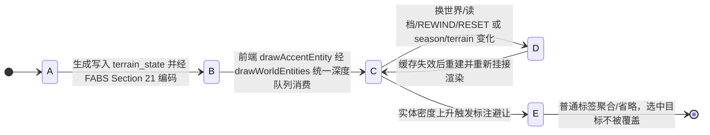
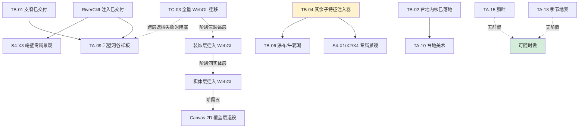
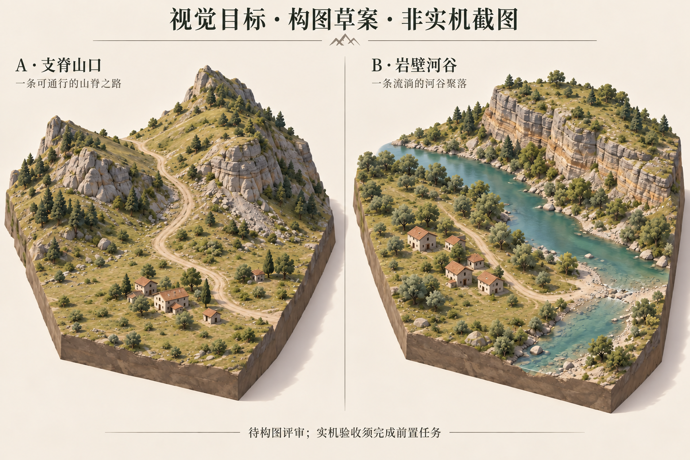

# 07. 地形美术与世界景观提升规划

> **当前架构**：双 Canvas 过渡形态——地形与沙盘侧壁由 `frontend/js/webgl/` 绘制在底层 `sim-canvas-gl`，装饰/实体/道路/标签仍在 Canvas 2D 覆盖层 `sim-canvas` 经统一深度队列绘制。★ **2026-09-17 架构决策：全量 WebGL、不再使用 Canvas 2D**，双 Canvas 仅为过渡，装饰层与实体层将整体迁入同一 WebGL 管线后退役 2D 覆盖层（[31 号 §8](./31-canvas-to-webgl-migration.md) 阶段三~五），遮挡由 GPU 深度缓冲逐像素解决。
> **本文定位**：世界景观提升的**任务台账 + 设计契约**。已完成任务的实现细节与验收流水账权威在 [changelog](../../current/01-changelog.md) 与证据包（`assets/ta*-evidence-*/`），本文只保留"当前是什么规则、还剩什么没做、为什么做"。
> **入口**：[文档导航](../../README.md) · [长期路线图](../design/01-roadmap.md) · [空间与路网现状](../../current/tech/14-terrain-and-network.md) · [前端现状](../../current/tech/16-frontend-overview.md) · [地形专项方案](./06-terrain-templates.md) · [统一地形场编译器设计](../../../TERRAIN_FIELD_COMPILER_DESIGN.md)。

## 状态机

本节描述「地形装饰实体 TerrainAccent」从视觉种子生成、持久化入档、挂接渲染队列到缓存失效重建的生命周期。装饰是纯视觉层，不参与通行、资源、碰撞与建造判定。

**不变量**（落地时必须守住）：

- 装饰只用独立 `accent_rng`（seed ^ 加盐）生成，不消费共享模拟 RNG；不参与通行/资源/碰撞/建造判定，纯装饰树不是额外资源点。
- 缓存按实际输入及世界生命周期失效；纯几何与逐帧受光分离；换世界/读档不残留装饰。
- 季节调色必须显式使 `cell.color` 缓存失效（只改颜色函数而继续用旧缓存会毫无效果）；雨/洪水/积雪等新事件在有模拟来源前不展示为事实。

## 1. 项目实施计划（先读本节）

本节是剩余工作的唯一任务台账。任务设计细节见 §5~§9，工程约束见 §10，验收口径见 §11。

**难度口径**：**低** = 单文件局部改动约 1~3 人日；**中** = 跨 2~3 个前端文件约 3~8 人日；**高** = 跨内核与快照/确定性契约约 1~3 周以上。

### 1.1 已落地基线（不再作为待办）

- **地表与沙盘**：单一着色入口 `computeElevationColor` + 不透明填充 + 兰伯特方向光 + 微 AO；草/土/岩按坡度与肥力 smoothstep 连续混合；四向明暗沙盘侧壁与落底投影；天空渐变底。
- **道路**：管线层级反转（地表→道路→实体），默认低饱和土石五级自然色阶，明艳色阶与外发光仅保留在 `R` 键热力图模式；16 分段入统一深度队列。
- **水系**：T2 内核河道/岸线/浅滩/泉谷 + 清透碧蓝三层落笔（深底/主流/波光）；水面高程、岸线、浅滩全部来自内核 `TerrainFeature`。
- **深度排序**：`drawWorldEntities()` 统一深度队列——地形格、水系、道路、营地辖区、POI、房屋、族人、装饰、侧壁全部按相机深度远→近落笔，稳定排序保确定性，拾取与绘制解耦。
- **内核地貌**：T0 地表查询、T1 山口 `mountain_pass_v1`、T2 河谷 `river_valley_v1`；TB-01 多尺度 fBm 噪声与不对称支脊（v1.50.36~43）；TB-02 台地 `plateau_v1`（v1.50.54）；TB-03 冲积扇/盆地/湖畔三新模板 + 静水全链路（v1.50.55）。`terrainProfile: 'random'` 按种子哈希轮换并回写入档。
- **装饰系统**：五类（Tree/Bush/Boulder/RockCluster/GrassTuft）独立盐值 RNG + FABS Section 21 持久化；TA-01 拆出 accent 三件套（v1.50.23）；TA-02~04 连续季相、局部三维枝干骨架、世界光向动态受光（v1.50.24~46）；TA-06 三乔木+三灌木变体（v1.50.64）；TA-07 LOD 判档与包围体剔除（v1.50.65，任务已取消视为完成、实现保留）；TA-11 RockCluster/GrassTuft 全链路（v1.50.38）；TA-12 世界坐标锁定地表纹理（v1.50.53）；TA-14 几何遮罩避让（v1.50.49）；TA-16 标注避让聚合（v1.50.53）；TA-17 五类资源区景观（v1.50.51）。
- **TA-05 P0 样板闭环**：2026-09-22 按用户口径收口为已完成——功能已齐（装饰系统全链路 + TA-06/07 落地），收口前剩余仅为测试验证缺口（Chrome/Edge 真实存档 LOAD 链路 NOT_RUN，属测试验证缺口，含 TA-06 同口径）与取舍项（TA-04-8 高密·拖动超标处置维持现状，见 §11.3）。
- **渲染底座**：v1.50.77 起地形层由 WebGL 承载，帧率已解限。

### 1.2 任务总表（剩余工作）

| 编号 | 任务 | 难度 | 依赖 | 必要性（不做会怎样） |
| :--- | :--- | :--- | :--- | :--- |
| **TA-05** ✅ | P0 样板闭环：2026-09-22 按用户口径收口为完成——功能已齐，剩余仅测试验证缺口（Chrome/Edge 真实存档 LOAD 链路 NOT_RUN）与取舍项（TA-04-8 高密·拖动超标处置维持现状，见 §11.3） | 中 | — | 植被系统存读档契约端到端证据待 Chrome 补测，不再作为完成门槛；TA-06 同口径 LOAD 缺口随本项收口 |
| **TA-09** ◐ | 完整场景样板：支脊山口与岩壁河谷实机交付（D-B1-8）；L1/L2 几何与完整世界筛选完成、候选种子已冻结、L3/L5 人工评审用户确认通过；L4 矩阵采集/L6 性能/L7 全量存档为后续技术任务 | 中 | TB-01 与 RiverCliff（v1.52.6）已落地，见 §4.4.1 | 216 帧矩阵与 t0/t1 存档尚未采集；主路可读性与遮挡已由人工确认无阻断，全量矩阵证据待补 |
| **TA-10** | 台地表现层：不规则台缘、缓坡入口、高低处遮挡 | 中 | TB-02（已落地） | 台地几何对了但视觉平庸，陡壁/坡顶/双入口无美术表达 |
| **TA-13** | 季节地表反照率调色（春嫩/夏深/秋枯/冬雪预留）+ `cell.color` 缓存失效 | 中 | — | 树在变色但地表不变——夏天枯黄草甸仍是绿色，四季感不完整 |
| **TA-15** | 落叶地被图元（树脚低对比斑块）+ 数量封顶的飘叶 | 低 | TA-02、TA-14（均已落地） | 树在落叶但地上永远干净，缺地面季相反馈 |
| **TA-17** ◐ | 聚落院地保留占地留白（S4-X1~X4 + TA-17-COURTYARD）；五类通用资源景观已落地 | 高 | 06 号阶段三子特征注入器 | 房屋院地门前通道无留白，专属景观（山脚湖/瀑布/峭壁）无表现 |
| **TA-18** | 地形与装饰分块缓存、远景减量、视觉缓存内存上限 | 中 | TA-07 实现（已落地） | 性能收口；优先级低，TA-07 任务取消后按既有实现为前置 |
| **TB-04** ◐ | D-B 子特征注入器：RiverCliff 与四类视觉散布已交付（v1.52.5～6）；FootLake / RidgeWaterfall / OxbowLake 待实施 | 高 | 各子特征按 06 号 R.3 解锁 | RiverCliff 已解锁 TA-09 / S4-X3；其余注入器仍阻塞 S4-X1/X2/X4 与 TB-06 |
| **TB-05** | 生态落位消费地表查询：`ecology/spawn.rs` 接入地表类别做生存距离诊断 | 中 | TB-01（已落地） | 泉水可能长在非法坡上、浆果丛可能长在水里 |
| **TB-06** | 复杂水系：瀑布尺度与遮挡验证、牛轭湖 | 高 | TB-04 | 瀑布/牛轭湖只存在于设计，无实机验证 |
| **TC-01** | 动态水文 T4：枯丰水期、洪水、桥梁工程；动态通行恢复与存档契约先行 | 高 | — | 水系是静态快照，不随季节/时间变化 |
| **TC-02** | 景观记录时间：道路拓宽/荒废、聚落扩展、林地采伐恢复、废宅遗址 | 高 | — | 世界不留"社会活动痕迹"，项目"涌现演化"定位在视觉层不兑现 |
| **TC-03** ◐ | 全量 WebGL 迁移阶段三~五：装饰层→实体层迁入同一管线，退役 Canvas 2D 覆盖层与 2D 回退 | 高 | 现行性能数据（§11.3） | 双渲染管线长期并存，几何维护两套路径；既定路线不是可选 |

### 1.3 推荐实施波次

1. **无前置、性价比高**：TA-13（季节地表）、TA-10（台地美术，TB-02 已就绪）、TA-15（飘叶）。（TA-05 已按用户口径收口，LOAD 补测不再排期）
2. **分项解锁**：RiverCliff 与四类视觉散布已交付，TA-09 筛选与人工评审已完成（候选冻结，见 §4.4.1）、S4-X3 可开始专属景观；TB-04 剩余注入器按 06 号 R.3 推进，继续解锁 S4-X1/X2/X4 与 TB-06。TA-09 实测未发现需转 TC-03 的系统性遮挡问题。
3. **长期演进**：TC-03 按 31 号方案阶段三~五顺序推进（装饰层→实体层→Canvas 退役）；TC-01/02 另立项排期。
4. **排期原则**：装饰类任务在 Canvas 2D 侧不追加一次性优化投入；几何与筛选逻辑（模型层、LOD、遮罩）保持与渲染后端解耦，TC-03 迁移时直接复用。视觉只表现内核已提供的事实——不先画横穿道路的装饰河、不提前画不存在的生产/阻路/防御效果。

### 1.4 剩余工作依赖图

**若只挑三项性价比最高**：TA-13（玩家一眼看出春夏秋冬）、TA-10（内核已就绪）、TA-15（飘叶）。**剩余关键路径**：TB-04 的未交付注入器仍阻塞对应地貌/景观；TA-09 候选已冻结且人工评审通过，剩余为矩阵采集与存档归档等技术工作。

## 2. 目标与方案边界

### 2.1 总体方向

将世界做成**有柔和光照、自然地表与聚落生活痕迹的斜俯视微缩景观**：远看能分辨草地、林地、坡地和村落，近看能观察族人在土路上往返、在泉边取水、在房屋间生活。先完成"地表质感 + 自然道路 + 信息减噪"的同一幅画面，再完善地貌与资源场景，最后升级渲染技术。

### 2.2 与相邻方案的分工

- **与 [06 号地图模板方案](./06-terrain-templates.md)**：该文是地形种类、生成关系、通行、选址与水资源**语义**的规划权威；本文只负责**视觉实现**（材质、光照、素材、遮挡、缓存与视觉性能）。
- **与 [17 号季节光照方案](../../current/tech/17-seasonal-lighting.md)**：该方案负责**光**（光向/强度/色温/阴影/天空），本文负责地表与植被**反照率**；两侧共用快照季节时钟，严禁各自维护一套季节时钟。植被叶量不得由平滑光相决定。
- **与农业/融合契约**：农田、哨塔、路卡的占地与通行消费内核事实；`LandUseKind` 已预留 `Farm`/`Defense`。视觉样板不得提前画出不存在的生产、阻路或防御效果。
- **装饰纯视觉铁律**：Accent 与地被不参与通行、资源采收、碰撞与建造判定；纯装饰树不是额外资源点，不暗示可采资源或真实历史事件；材质不反向决定规则。

## 3. 现状基线

### 3.1 诊断项与剩余差距

| 观察项 | 现状 | 剩余差距（任务） |
|---|---|---|
| 大片绿黄灰渐变像色板 | ✅ T0/T1/T2 地貌骨架由内核生成，TB-01 支脊与多尺度噪声已落地 | D-B 子特征（TB-04） |
| 地面偏暗缺细部 | ✅ 单一着色入口 + 不透明填充 + AO + 天空渐变 | 世界坐标锁定草斑/土纹（TA-12 已落地）；地貌到边界自然收边未做 |
| 地图边界笔直 | ✅ 沙盘侧壁四向明暗 + 落底投影 | 地貌过渡到边界的自然收边 |
| 道路抢眼划破屋顶 | ✅ 低饱和自然色阶，亮色仅热力图模式 | — |
| 森林/水源像发光标记 | ◐ D-A 五类装饰群已落地；POI 已降噪 | 资源点景观群与院地（TA-17） |
| 季节截图地表仍绿 | ◐ Tree/Bush 已有连续季相；**地表**着色仍不读季节 | 季节地表材质（TA-13） |
| 跨图层远物压近物 | ✅ 统一深度队列；★ 2026-09-17 后遮挡最终判据改 GPU 深度缓冲（TC-03） | 高树穿插遮挡由 TC-03 迁移解决 |
| 水系观感 | ✅ T2 河道/岸线/浅滩 + 三层水光 | 水位静态；涨落/洪水属 TC-01 |

### 3.2 已落地渲染机制摘要

- **地表着色**：`math.js::computeElevationColor` 唯一实现，快照重建时由 `rustworld.js` 一次算好 `cell.color` 缓存；草/土/岩按坡度 12°/28°/45° 与肥力 smoothstep 连续遮罩。
- **自然道路谱**：线宽随踩踏度 1.2→2.8px，五级色阶（泥径/夯土/石道/石板/通衢），`R` 键热力图模式保留明艳色阶。
- **三层水系**：深底 `rgba(32,86,122,0.45)` / 主流 `rgba(56,158,202,0.82)` / 波光 `rgba(235,248,255,0.65)`；浅滩卵石踏道 + 浪花斑。
- **统一深度队列**：`render_canvas.js::render()` 顺序为 `SimLighting.update()` → `drawSkyBackdrop()` → `drawTerrainShell()` → **`drawWorldEntities()`** → 调试网格。队列内图元按 `depth = ry·sinX + z·cosX` 升序绘制，同深度保持收集原序（`Array.sort` 稳定）保确定性；深度项走持久对象池 `_depthPool` 零每帧 GC。**新增世界实体/贴地图元必须挂进同一队列，严禁在 `render()` 里另开整层绘制。**
- **装饰基础**：`geo/accents.rs::generate_accents()` 独立 RNG 流（`seed ^ 0x4143_4345_4E54_3031`），基数树 40/石 20/灌木 25 × 密度，FABS Section 21 约 24B/个；前端 `render_accents.js::drawAccentEntity` 分种类绘制。

### 3.3 关键实现入口

- **内核**：[terrain.rs](../../../crates/sim_core/src/geo/terrain.rs) / [hydrology.rs](../../../crates/sim_core/src/geo/hydrology.rs) / [accents.rs](../../../crates/sim_core/src/geo/accents.rs) / [query.rs](../../../crates/sim_core/src/geo/query.rs)（地理事实唯一真相源，`sample_elevation` 仍为最近邻采样）；[terrain_network.rs](../../../crates/sim_core/src/spatial/terrain_network.rs)（走廊合法性与通行代价）。
- **前端绘制**：[math.js](../../../frontend/js/math.js)（`computeElevationColor`）/ [lighting.js](../../../frontend/js/lighting.js)（`SimLighting` 光源真相）/ [rustworld.js](../../../frontend/js/rustworld.js)（快照接收与 `cell.color` 缓存）/ [render_terrain.js](../../../frontend/js/render_terrain.js)（2D 回退管线，WebGL 模式下地形由 [terrain-renderer.js](../../../frontend/js/webgl/layers/terrain/terrain-renderer.js) 承担）/ [accent-season.js](../../../frontend/js/accent-season.js) / [accent-model.js](../../../frontend/js/accent-model.js) / [accent-lod.js](../../../frontend/js/accent-lod.js)（LOD 唯一口径）/ [render_accents.js](../../../frontend/js/render_accents.js) / [render_world.js](../../../frontend/js/render_world.js)（深度队列）/ [render_canvas.js](../../../frontend/js/render_canvas.js)（帧循环）。
- **存读档**：[world_save.rs](../../../crates/sim_core/src/spatial/world_save.rs)，`terrain_state` + `water_pools` 直接入档（`SAVE_FORMAT_VERSION = 7`），生成器版本与 `terrain_profile` 作为门禁拒绝旧档。

## 4. 统一美术规则

### 4.1 色板与材质

采用自然、偏暖、低至中饱和度的地面色，把明亮颜色留给选中对象和紧急事件。

| 表面 | 当前色值 | 形状与细节 |
|---|---|---|
| 草地 | 苔绿→浅草绿（`rgb(108,138,88)` → `rgb(156,156,114)`），肥力提绿 | 连续过渡；草斑/土纹由 TA-12 落地 |
| 裸土与小路 | 坡度 12°→28° smoothstep 到土色 `rgb(152,138,114)` | 道路五级自然色阶见 §3.2 |
| 岩石 | 坡度 >28° smoothstep 到暖灰（`rgb(130~145,126~140,118~134)`） | 成组露头未做；当前连续坡度派生 |
| 泉水 | `ShallowWater rgb(62,152,176)` / `DeepWater rgb(36,104,138)` / `RiverBank rgb(168,152,126)` | 三层水光 + 岸带 + 浅滩踏石 |
| 季节地表 | ⏳ 未实现（地表着色不读季节） | 春嫩/夏深/秋枯/冬雪预留，规则见 §4.3 |

光源固定世界方向（左上方俯视 `L = normalize(-0.45, -0.60, 0.66)`），地形、房屋体块、族人投影与植被共用同一受光约定。地面为不透明填充。这些只是视觉材质，不宣称存在新的土壤或湿度模拟。

### 4.2 尺度、遮挡与信息层级

- 远景读地貌、聚落和主路；中景读资源区与房屋；近景读人物与生活细节。装饰密度随屏幕面积控制。
- ✅ 世界物体统一接地锚点与阴影尺度；立体实体统一按相机深度远→近绘制。
- ✅ 普通观察只突出选中、悬浮和关键异常：库存环仅在 `zoom ≥ 0.70` 或选中时显示；网格默认关闭。
- ★ **遮挡口径（2026-09-17 定稿）**：树冠遮人**不再在 Canvas 2D 侧做局部淡化/轮廓**（原 TA-08 三策略取消），改由 TC-03 迁移后在 WebGL 侧以「关深度测试描边 pass + 叶簇半透明」实现，验收矩阵见 [31 号 §8.5](./31-canvas-to-webgl-migration.md)。

### 4.3 季节表现总规则

本节是季节视觉的唯一规则入口，植被曲线细则见 §6.3，光照归 [17 号方案](../../current/tech/17-seasonal-lighting.md)。

- **只消费已存在事实**：`snap.season`、`season_progress`、`temperature`；雨/洪水/积雪等新事件在有模拟来源前不展示为事实（首期冬景以裸枝与冷色表达，不画正在下雪）。
- **年相位统一定义**：春中心 0、夏 0.25、秋 0.5、冬 0.75；季节曲线跨 1→0 连续；逐株只做小幅有界偏移，盛夏全绿和隆冬低叶量设共同稳定区。
- **两条季节链路分开做、共用时钟**：TA-13 负责地表反照率，TA-02 负责植被季相；植被读取原始快照相位，不读取限速平滑后的 `SimLighting.phase()`，禁止自建第二套季节时钟。
- **缓存联动**：任何季节改色都必须显式使 `cell.color`（地表）与对应装饰缓存失效。

### 4.4 组合地貌美术规则

**TA-09 交付分两步**：① 构图草案可提前制作评审色板与主次关系；② 实机样板须等待 06 号阶段三 `RiverCliff` 通过门禁。固定两组真实 seed/profile 与同版本存档，记录版本、配置、窗口与 DPR，按 §11 覆盖四季、四方位、低高俯角、远中近景及模拟推进。岩壁尺度准入以 06 号 §5.4.D 为准，不用人工挑选的漂亮截图代替种子矩阵。若 TA-09 实机交付排在 TC-03 迁移之后，则直接按 WebGL 管线口径验收。

- **尺度层次**：远景读主脊/湖盆/台面；中景读支脊/崖缘/河岸/林缘；近景才加岩纹/草簇/枝叶。每图一个主地标、少量次地标，聚落与主路保留开阔空间。
- **环境关联**：岩壁接碎石坡、缓岸接草地、林地成团；道路/房屋/取水点避让按 §6.6 几何遮罩执行。
- **材质与受光**：地表、岩石、岸带、植被共享低饱和色板；岩层方向锁定世界空间，明暗读取统一光源。
- **尺寸边界**：地表采样间距约 2.996m；小岩缝/水丝/草叶只作视觉派生；岩壁先以陡坡与贴面岩层表达，悬挑和洞穴不进入样板。

### 4.4.1 TA-09 构图评审与实机交付记录

**2026-09-23：构图方向与实机视觉评审均已获用户确认通过；候选种子已冻结。L4 矩阵采集/L6 性能/L7 全量存档为后续技术任务，TA-09 / D-B1-8 保持 ◐ 未勾完。** 本记录是该样板的交付权威入口。

| 场景 | 已接受的构图方向 | 实机对齐要求 |
| :--- | :--- | :--- |
| A 支脊山口 | 主脊与不对称支脊围出低鞍部；土路从前景聚落引向山口；坡脚疏林成组、山体保留露岩 | 选用真实 `mountain_pass_v1` 世界；主路必须对应可达路网；中景可读支脊与鞍部，近景核对坡脚接地 |
| B 岩壁河谷 | 远岸层岩为主地标，河流引导视线；近岸低河阶安置聚落，浅滩与岩壁错开 | 选用真实 `river_valley_v1` 且实际接受 RiverCliff 的世界；普通陆路只经合法浅滩跨河，崖体不得压盖近路与取水点 |

**历史前置核对（2026-09-14）**：源码 `77fffc7`，应用版本 1.50.50，地形生成器版本 8，存档结构版本 7；当时 RiverCliff 仅有枚举与空几何注入，`accepted=false`。

**当前前置复核（2026-09-22，v1.52.6 / 生成器 14）**：TB-01 与 RiverCliff 已落地（06 号 §5.4.D），可开始真实种子筛选，TA-09 仍未交付。默认管线的地形/装饰已进 GL，但房屋、人物、道路、水面与 Cliff 描线仍有 Canvas 覆盖层，不能由“装饰已迁 GL”推定 31 号 §8.5 的跨层遮挡已通过；须先冒烟，系统性失败转 TC-03/渲染缺陷。执行流程、主备数量、精确 Tick 与证据规则见 [TA-09 实施方案](../../../TA-09-IMPLEMENTATION-PLAN.md)。

**已冻结样板（2026-09-23 用户确认）**：

| 场景 | 主选 seed | 备选 seed | 验证状态 |
| :--- | :--- | :--- | :--- |
| A 支脊山口 `mountain_pass_v1` | **1**（2 支脊，detour 3.61） | 43（2 支脊，detour 5.03） | L1/L2 通过，构图与可读性经人工确认 |
| B 岩壁河谷 `river_valley_v1` | **1**（RiverCliff id=1005，157 RockFace 格） | 38（RiverCliff 确认，133 格） | L1/L2 通过，构图与可读性经人工确认 |

seed=0 因 `sim_worker.js` 入口缺陷（`msg.seed || Date.now()` 替换 0）排除。冻结配置、相机锚点与完整环境记录见证据包 `metrics/seed-screening.json`。

**后续实机证据包（待采集）**：两场景各覆盖四季×四方位×低高俯角×远中近景（每场景 96 视图）；记录 seed/profile/tick/版本/提交/WASM 双副本 SHA256/配置/Chrome 版本/窗口与 DPR/相机参数。物理门禁记录与视觉证据分开归档。

## 5. 地表与信息层任务（短期）

这些任务无内核依赖，可随时插入任意波次。

### 5.1 TA-13 · 季节地表调色与缓存失效（难度：中）

先给 `computeElevationColor` 加季节因子（春嫩、夏深、秋枯草色；冬季覆雪待明确气候数据契约后再接入），再**显式使 `cell.color` 缓存失效**——`rustworld.js` 的 `_terrainCached` 是单标志，只改颜色函数而继续用旧缓存会毫无效果。与 17 号方案分工：本节改反照率，光向/色温归光照方案，共用 `SimLighting.phase()`。

## 6. Accent 植被专项升级（设计契约）

> 本节是 TA-01~TA-11、TA-14、TA-15 的设计细则，任务编号与状态以 §1.2 为准。已完成任务的实现流水账见 changelog 对应版本条目。

### 6.1 设计目标

| 当前实现 | 造成的观感 | 设计目标 |
|---|---|---|
| 树冠为四瓣椭圆，树干仅短曲干 | 去掉叶片后没有可读树形 | 全年存在的主干、主枝、细枝骨架（TA-03 已落地） |
| 树皮亮线、冠部径向渐变固定在屏幕左上 | 转镜头时亮部与投影脱节 | 同一世界光向驱动枝干、叶簇、岩面与投影（TA-04 已落地） |
| Bush 不消费季节状态 | 灌木四季常绿且形状相同 | 落叶/常绿灌木分别表现季相（TA-06 已落地） |
| 仅生成并绘制 Tree/Bush/Boulder | 林下、水岸缺少低层植被 | 按环境补充草丛、碎石与落叶地被（TA-11 已落地；TA-15 待做） |

### 6.2 渲染路线

首期选择的局部三维枝干骨架 + Canvas 投影绘制（TA-03 已落地）。★ **2026-09-17 架构决策：全量 WebGL、不再使用 Canvas 2D**——本节的局部三维骨架、季相曲线、受光公式与 LOD 筛选**全部作为 CPU 侧几何与参数来源保留**，只更换绘制后端（31 号 §8 阶段三~五）。后续不再以"性能超标或遮挡成为阻碍"为启动条件。

### 6.3 季相规则（TA-02/TA-06 已落地）

`SimTreeTint` 是植被季相唯一生产者，接口 `sample(accent, sim, profile)`。输出 `leafDensity`/`leafColor`/`budAmount`/`flowerAmount`/`litterAmount`，纯视觉派生值，不写存档。

| 阶段 | 落叶乔木 | 落叶灌木 | 常绿植被 |
|---|---|---|---|
| 初春 | 裸枝带芽，少量小叶 | 多茎枝条先显露，再发新叶；部分花灌木开花 | 枝梢少量嫩色 |
| 春末至夏 | 叶簇充实、层叠有空隙 | 茂密但轮廓更碎、更低 | 饱和度温和变化 |
| 初秋至深秋 | 各簇先后黄化/红化，再逐簇稀疏 | 铜红、赭黄与局部枯枝混合 | 保持轮廓 |
| 冬季 | 普通落叶树只余约 0–5% 叶量，主枝清晰 | 枯枝为主，少量宿存叶 | 保留绝大多数叶量 |

三种乔木轮廓（阔冠/疏冠/锥形常绿）与三种灌木变体（落叶多茎/花灌/低矮常绿）由 `accent-model.js::speciesOf` 从 `accent.id` 稳定哈希派生，不新增持久化字段。**环境适配的物种分布仍留给扩展阶段**——须在 `speciesOf` 内新增显式参数并 bump `accentModelStyleVersion`，禁止绘制层临时按环境改写物种。

### 6.4 骨架与逐簇落叶规则（TA-03 已落地）

每株缓存稳定局部模型：根部锚点、锥形主干、若干主枝与二级枝、挂在枝端的叶簇。**全部叶簇必须挂在真实枝条上**，禁用抽象包络定位。每个叶簇有稳定脱落次序与局部色差，随着叶量减少按次序收缩隐藏，枝条始终保留。**禁止仅把完整树冠整体调透明度**——那会得到半透明云团，无法产生枝间空隙。春季按萌芽曲线恢复同一批稳定位置，暂停/读档/回溯后不重新随机抽样。

地被落叶从树的季相直接派生，在树脚形成低对比度不规则斑块（TA-15 待做）。飘落叶片仅近景、仅落叶时段、全屏数量封顶；首期不做风场或持续粒子积分。当前无积雪/降雪事实来源，首期冬景以裸枝与冷色表达。

### 6.5 动态受光规则（TA-04 已落地）

每帧统一读取 `SimLighting.lightDir()`/`ambient()`/`intensity()`/`tint()`；按实际局部到世界的几何变换转换枝干面、叶簇面法线，再与世界光向求点积。**相机只改变投影和可见面，不能用投影深度驱动漫反射明暗**。颜色管线为"季节基础色 → 柔和漫反射与环境光 → 光源色温"。枝干用少量侧面明暗表达圆柱体，叶簇用低频分面或椭球近似，叶面以宽而弱的亮部为主。投影继续复用世界光向与影长，输入实际世界树高，随叶量改变覆盖范围。阴影作为地面图元独立加入统一深度队列。

### 6.6 类型扩展、成组分布与几何遮罩

成组分布优先于全图提高密度：主树周围有低灌木与草，岸边有草石，聚落和主路保留可读空间。新增 GrassTuft/RockCluster 时须补齐生成、枚举字典、快照消费与绘制入口全链路。表现层遮罩（TA-14 已落地）基于车道贝塞尔胶囊、房屋保守圆与 POI 操作区足迹做空间分桶检测，只影响装饰可见部分，不改通行或建造规则。

### 6.7 模块拆分与 LOD（TA-01 已落地、TA-07 实现保留）

- **文件分工**：`accent-season.js`（季相曲线）/ `accent-model.js`（个体形态缓存 + 真值包围体）/ `render_accents.js`（绘制入口）/ `accent-lod.js`（LOD 判档唯一口径）；`render_world.js` 继续负责跨实体队列。
- **模型缓存**：按实际几何输入组织，READY/LOAD_RESULT/REWIND_RESULT/RESET_DONE 时失效；只缓存可复用几何，不无限缓存相机方向×光向×季节组合。
- **LOD 分级**：远景树形/中景主枝/近景二级枝+簇高光；阈值带滞回避免缩放闪烁；入队前两级包围体剔除（一级 `kindBounds` 零模型访问、二级模型真值 AABB）。四条防回退红线见 [frontend/AGENTS.md](../../../frontend/AGENTS.md)。
- **遮挡**：根部足迹排序不能保证高树与坡地/房屋真实穿插；★ 2026-09-17 起改由 GPU 深度缓冲承担（TC-03），不再在 Canvas 2D 侧做局部淡化。落叶和阴影仍按地表足迹处理，不能因为骨架三维化而重新引入半截入土。

## 7. 地貌与水系扩展（内核侧，中期）

**范围**：内核生成语义以 [06 号地图模板方案](./06-terrain-templates.md)为准，本节只登记视觉对接与表现层任务。

### 7.1 生成顺序与已落地骨架

生成顺序：内核先完成字段编译、高程/水系/土壤湿润度/地表材料与通行选址约束，再生成合法路网并通过校验，最后由前端消费调色字段和装饰事实。现有 T1 山口与 T2 河谷继续按高度场运行；统一生成器 UGC-01~03 通过后，台地、盆地、冲积扇和湖泊也由同一套 Field Graph/水文过程生成。水的可达性先决定土壤湿润度，再决定草地资格与沙地/裸土类别；视觉层不得根据模板名称自行补画草地或沙漠。材质、颜色、LOD 和网格细节只消费 Rust 输出的字段与 `TerrainFeature`。

### 7.2 TB-04 · D-B 子特征注入（难度：高）

按 seed 哈希概率注入局部特色地貌，不新增独立 profile：

- T1（山口）注入：山脚湖、山涧飞瀑、密林；
- T2（河谷）注入：牛轭湖、河谷峭壁、河岸林带。

注入只扩展局部地形与地表类别，须满足"不增加连通分量"等既有保护门禁；未完成的子特征不得提前画成可涉水或可通行的视觉暗示。瀑布先验证尺度与遮挡，牛轭湖依赖 06 方案 R0（R0 不阻塞岩壁等静态模板）。

### 7.3 TB-02/03/06 · 台地、盆地冲积扇与复杂水系

1. **台地（TB-02 内核已落地 + TA-10 表现待做）**：物理生成按地图模板方案执行；表现层完成不规则台缘、缓坡入口和高低处遮挡。
2. **盆地、冲积扇与风格组合（TB-03 已落地）**：三新模板 + 静水全链路 + 景观风格样式表已交付。
3. **复杂水系（TB-06）**：瀑布先验证尺度与遮挡；牛轭湖等随 D-B 注入排期。

### 7.4 河谷切片收尾与 TB-05 生态落位

- ⏳ 未来桥面作为独立高程的连接设施预留（随 TC-01/T4），不把桥当作道路纹理。
- ⏳ **TB-05**：`ecology/spawn.rs` 尚未消费地表查询，需接入地表类别做生态落位的生存距离诊断，保证族人始祖落位与地表事实一致。

### 7.5 统一场编译器与体素网格对接（UGC-04/05）

统一编译器的视觉输入分成两层：

1. **语义层**：`SurfaceKind`、坡度、湿度、硬度、水体、水的可达性、草地资格、地表材料、调色类别、岸带、可建/可行走 flags。它们决定材质选择、装饰禁区、路网和拾取，不由网格反推。
2. **几何层**：HeightfieldBackend 或稀疏 VoxelBackend 输出的高度、密度、材质和网格。它决定轮廓、岩壁、悬挑、洞穴和 LOD；材质字段沿用语义层结果。

体素迁移的表现约束：

- 初期 VoxelBackend 用 32³ chunk + 一格 halo；chunk 边界不得出现裂缝或法线跳变。
- 网格提取可先用 Surface Nets，确认锐利岩壁需求后采用 Dual Contouring；算法选择不能改变语义字段。
- `HeightfieldView` 在多层导航完成前只提供顶部可居住层，洞穴和地下层不能自动成为 Agent 路径。
- 静态 chunk 网格按 `recipe_hash + chunk_coord + generator_version` 缓存；换世界、读档或生成器版本变化时统一失效。
- 地表颜色使用 `surface_palette`，由水可达性、土壤湿润度、坡度、材料和季节共同决定；前端不得仅凭高度或模板名称把干燥地面着成草地。
- 全量 WebGL 迁移沿用 [31 号方案](./31-canvas-to-webgl-migration.md)；地形、实体、装饰和水体共享深度缓冲，LOD 只改变几何细节。

实现细节、字段量化、chunk 存档和验收命令见根目录 [TERRAIN_FIELD_COMPILER_DESIGN.md](../../../TERRAIN_FIELD_COMPILER_DESIGN.md) §7、§8、§10。

## 8. 资源区与聚落地景（TA-17）

通用资源区已由 `landscape-model.js` 与 `render_landscapes.js` 落地五类稳定配方（泉水湿润土、林地暗部与 foliage 细节、浆果点簇、采石场明暗、金矿哑光斑点），点簇与贴地片单调表达库存丰度，基础骨架与候选坐标 100% 确定。

| 区域 | 场景表达 | 与模拟的边界 |
|---|---|---|
| 清泉与河湖岸 | 小泉池、湿润土色、岸石、芦草 | 装饰不得挡住真实岸边取水位置 |
| 森林 | 主树群、林缘灌木、林下暗部 | 资源减少优先改变可采部分，不让整片树林随库存抖动消失 |
| 果丛 | 不规则灌木簇、果实点缀 | 果实丰度对应库存，采收地点可辨认 |
| 石矿与金矿 | 岩脊露头、碎石、局部矿脉 | 金色只作小面积点缀，不能让整座山发光 |
| 聚落 | 院地、门前路、少量生活摆设 | 房屋与通行区域优先，装饰不能制造并不存在的仓储或生产设施 |

**待做**：聚落院地保留房屋占地与入口留白（S4-X1~X4，依赖阶段三子特征注入器）。素材走世界坐标 + 稳定对象 ID/视觉种子哈希，不消费共享模拟 RNG。

## 9. 长期方向：让景观记住社会的历史

**范围**：中期验证后按专题推进，依赖玩法范围、美术产能与性能结果。

### 9.1 TC-01 · 动态水文（L1、T4）

在静态地形与水系基础上，逐步评估枯丰水期、洪水、桥梁工程、土壤/湿度和植被变化。动态通行恢复与存档契约须先完成，具体规则由内核计算，前端只呈现事实。

### 9.2 TC-02 · 景观记录时间（L2）

道路变宽或荒废、聚落扩展、林地采伐与恢复、废宅遗址，逐渐形成可辨认的年代感。凡是影响回放的土地变化，明确采用入档状态、确定性事件或可验证重建方案。前端不能凭当前人口猜测过去的森林覆盖，也不能在回滚后保留未来的废墟。

### 9.3 TC-03 · 全量 WebGL 迁移（既定路线，L3）

★ **阶段一/二已落地（v1.50.77~82）**：地形与沙盘侧壁已由 `frontend/js/webgl/` 绘制在底层 `sim-canvas-gl`；帧率已解限。剩余 = 装饰层、实体层整体迁入同一 WebGL 管线，随后退役 2D 覆盖层与 2D 回退管线。方案见 [31 号 §8 阶段三~五](./31-canvas-to-webgl-migration.md)。实施建议：先做"一片装饰群 + 一座房屋 + 一名可选中人物"并入现有 WebGL 地形管线的切片原型，对比帧耗时、内存、镜头与命中行为后按阶段推进。**拾取与标签层是主要回归风险点**，须同步验证。迁移后保留低画质档位（同一 WebGL 管线内的 LOD/质量档，而非独立 2D 降级路径）。

## 10. 数据与工程约束

### 10.1 数据权威表

| 数据类别 | 权威来源与约束 |
|---|---|
| 高程、坡度、地表类别 | ✅ Rust T0/T1/T2 生成，经 FABS 地形 section 传递；不由前端另造物理地形 |
| 统一场/体素几何（UGC） | ⬜ UGC-01~03 由 Field Graph 生成语义；UGC-04~05 由 VoxelBackend/HeightfieldView 提供网格与顶部查询；未落地前不写入现状快照 |
| 河湖几何、水位、岸带、浅滩 | ✅ 内核 `TerrainFeature`/`WaterPool`/`TerrainConnection`；水面高程独立于河床；桥梁待 TC-01 |
| 道路、房屋、资源储量 | 现有世界快照；材质映射不得改变真实坐标、路线、容量与消耗 |
| 草斑、装饰石、素材变体 | ✅ 五类全量承载；独立 `accent_rng`，不消费共享模拟 RNG；FABS Section 21 持久化 |
| 季节颜色 | ◐ 季节/气温事实已随快照下发，Tree/Bush 连续季相已落地；地表视觉映射（TA-13）待做 |
| 缓存和缩放细节层级 | 前端派生，可随时重建；不写入模拟状态；换世界/载入/地形变化时失效 |

### 10.2 缓存失效契约

- **静态地形缓存拆分**：`_terrainCached` 仅管地形网格；features/accents/subFeatures 三通道独立裁决，在 READY/LOAD_RESULT/REWIND_RESULT/RESET_DONE 时由 `_invalidateWorldStaticCaches()` 随世界生命周期整体失效。
- **跨世界字符串表**：缓存失效以 `STR_TAB.start_index == 0` 为唯一判据，**不得**改用 FABS epoch（会串味），也不得改成全局单调递增 epoch（会击穿确定性）。
- **装饰缓存键**：纯局部几何键覆盖 kind/ID/素材风格版本与影响几何的参数；逐帧受光不烘焙进骨架缓存；严禁缓存投影结果、屏幕 AABB、滞回档位、季节/光向/相机派生的精灵。
- **内存上限**：设上限并释放旧缓存，不能无限保存每种镜头结果（建议上限见 §11.3）。

### 10.3 版本门禁与存档契约

当前 `terrain_generator_version` + `terrain_profile` 与 `SAVE_FORMAT_VERSION`（当前 7）共同拒绝旧档，地形与水池直接从存档恢复。UGC-05 后将增加 `terrain_recipe_hash` 与 `voxel_backend_version` 的门禁；静态 chunk 由 seed/recipe 重建，动态修改只保存 chunk delta。后续若新增持久化字段再评估存档结构版本，不能把每次材质改色都变成格式升级。改变 accent 生成规则时同样按此处理。

### 10.4 工程纪律

- **快照同步**：新增 accent 字段/枚举时，`world_snapshot.rs`/`snapshot.rs`/`snapshot_bin/encode.rs`/`snapshot-bin.js`/`rustworld.js` 五处同步；枚举还要同步 `snapshot_bin/dict.rs`。
- **配置集中**：影响模拟的参数走 `SimConfig` 全链路；纯视觉参数集中在 `config.render.js`（`RENDER_CONFIG`，不注入 WASM）；共用光源参数沿用 `config.lighting.js`。
- **文件行数**：单文件严控 800 行以内。
- **持久化测试禁令**：不提交临时单元测试；临时验证跑通后删除，长期验证以 `test-wasm.js` 等既有门禁为准。

## 11. 验收与性能预算

### 11.1 已通过项

- ✅ 道路不再切过屋顶；跨图层遮挡按相机深度正确。
- ✅ T2 水面、岸线、浅滩、人物与道路投影一致；普通陆路不穿深水，仅经浅滩跨河。
- ✅ 读档/重置/回溯后无旧世界特征残留与字符串串味。
- ✅ 世界光向动态受光（TA-04）：四季×四方位光向协调随动；亮部不黏屏幕；生命周期端到端通过。
- ✅ TA-06 三乔木/三灌木变体：96 视图矩阵 + 景观共用通道 57 对零失配 + 四季花历数值全过（证据包 `assets/ta06-evidence-2026-09-22/`）。

### 11.2 待验收清单

以固定种子、配置、Tick、相机、窗口尺寸、DPR 和视觉时刻保存前后对照。

- ⏳ 远/中/近三档镜头、四季，以及初始聚落和高密度聚落。
- ⏳ 普通视图下评审者能在约 5 秒内指出主要聚落、水源区和主路。
- ⏳ 缩放、旋转、镜头跟随、读档、重置、时光回溯后无纹理漂移、旧世界残留、物体悬空或点击错位。
- ◐ 资源断流有可辨认反馈；漂亮水面或树林不能掩盖"当前不可采"的事实。
- ⏳ TB-04 子特征注入后：补充山口、浅滩、河阶之外的湖泊/峭壁场景。
- ◐ **最小遮挡样板**：一面岩壁、一座房屋、一棵树、一段道路、一个族人；验收判据以 [31 号 §8.5](./31-canvas-to-webgl-migration.md) 为准，在 TC-03 迁移后 WebGL 管线上验收。

### 11.3 测量方式与性能预算

先记录测试机器、浏览器、分辨率、DPR、人口与倍速；固定镜头和连续拖动/跟随镜头分别测量，预热后各采样至少 60 秒。

| 指标 | 首轮目标 | 超标处理 |
|---|---|---|
| 主线程渲染与 UI 耗时 | 参考桌面 p95 ≤ 16 ms（帧率已解限，新任务以各自文档标注为准） | 先减标签、纹理层和装饰数量 |
| 新增地表/装饰绘制耗时 | 同条件 p95 增量 ≤ 3 ms | 调整分块、缓存、可见性剔除和缩放分级 |
| 纯美术改动的仿真吞吐 | 同设备同负载下降不超过约 5% | 核查主线程争用，不能减少模拟 Tick 掩盖回退 |
| 新增视觉缓存内存 | 初始上限建议 64 MiB | 缩小图块、限制 DPR/缓存档数、淘汰不可见块 |
| 重置/读档与相机变动 | 单独记录首帧及缓存重建 p95 | 分批重建装饰，避免在交互帧集中生成 |

**已知偏差**：TA-04-8 首轮实测中高密·拖动场景最差视角超标（+5.8~+14.8 ms/帧），逐类分解显示增量主体在 `drawTerrainCell`（TB-01 fBm 起伏侧壁）与 `drawAccentEntity`（TA-11 石簇/芦草强化），TA-04 自身范畴约 +3~5 ms/帧达标。该场景处置 **2026-09-22 经用户取舍为维持现状归档**（不修订预算、不对 TB-01/TA-11 追加优化），作为 TA-05 收口口径的一部分。

### 11.4 Accent 专项验收口径

验收材料采用 Chrome、固定种子/存档、窗口/DPR、镜头与模拟时刻。季相端点与"固定季相改变光向"可在临时视觉夹具中独立控制，但必须另外验证真实快照推进、暂停、读档与回溯，不能以强改模拟季节字段代替端到端验收。

| 验收项目 | 通过标准 |
|---|---|
| 四季与边界 | 同株春芽、夏冠、秋色、冬枝可辨；冬季落叶树叶量约 0–5%，常绿保持轮廓 |
| 落叶过程 | 先变色后减叶，有真实空隙与枝形，不出现整团半透明树冠 |
| 受光 | 固定季相改变光向时，枝干/树冠/岩面亮部和投影协调；亮部不黏屏幕 |
| 旋转与遮挡 | 四方位、低高俯角、远中近缩放下无悬空、入土、树冠裁断或错误覆盖选中信息 |
| 分级与剔除 | 远/中/近三档可辨且不混淆；缩放穿越阈值零闪烁；漏画 0 例（TA-07 已落地，不再作为独立补做任务） |
| 生命周期 | 暂停季相与飘叶冻结；读档/回溯可重建；换世界缓存结果与冷重建一致 |

**TA-05（✔ 2026-09-22 按用户口径收口）**：功能已齐（装饰系统全链路 + TA-06/07 落地，见 §1.1），收口前仅剩两项均非功能缺口——① **测试验证缺口**：Chrome/Edge 真实存档 LOAD 链路 NOT_RUN（预览浏览器无 File System Access API；TA-06 同口径 LOAD 缺口一并随本项收口，不再作为完成门槛）；② **取舍项**：TA-04-8 高密·拖动超标预算处置由用户取舍为维持现状（§11.3）。植被观察台 `ta06-acceptance.js` 长期保留，验收 URL：`http://localhost:3000/?seed=42&nogate=1&ta06=1`。TA-06/07 的完整验收记录与像素指标见证据包 `assets/ta06-evidence-2026-09-22/` 与 changelog v1.50.64/v1.50.65 条目。

### 11.5 实施门禁

- 纯文档改动不升版、不构建 WASM，交付前运行文档维护体检、跨文档一致性检查与 `bump-version.js --check`。
- 前端实现运行 `frontend-check.js`，按 [浏览器指南](../../current/tech/27-browser-automation.md) 做视觉与交互验收（优先 Chrome 做存档链路验证；沙箱禁止外启浏览器时允许内置预览浏览器 + `?nogate=1` 做非存档验证）。
- 涉及 Rust/版本常量变更时重编译并同步 WASM 双副本；涉及快照字段执行 `snapshot-check.js` + `test-wasm.js`；配置变更执行 `config-check.js`。
- 各阶段实现完成后再同步现状文档、版本和 changelog，不能把本文的规划写成已实现机制。
