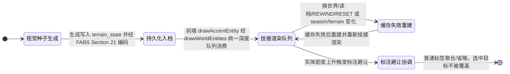

# 07. 地形美术与世界景观提升规划

> **状态**：短期 S1（地表光照沙盘基底）、S2/P0（渲染层级反转 + 自然道路色阶）、S2.1/P1（水系三层水光）、S2.2/P2（统一相机深度绘制）均已落地，并在 v1.50.11 / v1.50.14 / v1.50.20 演进为「地形格 / 水系 / 道路 / 沙盘侧壁 / 地表装饰全部并入 `drawWorldEntities()` 统一深度队列」；内核 T0 地表查询、T1 山口聚落、T2 两岸河谷已提供真实高程、地表类别与水系事实（`terrain_generator_version = 4`）；D-A 装饰基础（Tree/Bush/Boulder 生成 + FABS Section 21 + 绘制，v1.49.1）与连续植被季相（v1.50.24）已落地；v1.50.23 TA-01 将装饰代码拆为 `accent-season.js` / `accent-model.js` / `render_accents.js` 三件套。v1.50.24 TA-02 已提供连续季相与 Tree/Bush 叶色接入；★ v1.50.25 TA-03 已落地局部三维枝干骨架 + 椭球叶簇 + 稳定脱落次序（枝干全年保留、冬季落叶树余 0~5% 叶量、禁整冠透明度；v1.50.26 修复补位簇悬空——叶簇一律挂真实枝条）；RockCluster/GrassTuft 已完成内核生成与前端绘制（D-B1-5/6）；★ 世界光向动态受光（TA-04）已落地（v1.50.32~v1.50.46，收口验收见 §11.1/§11.3）；未实施：植被轮廓变体（TA-06）、D-B 子特征注入阶段二、资源点景观群与房屋院地、标注避让、季节地表调色、分块缓存与 LOD。
> **v1.48.0 方案决策**：取消独立 T3（湖泊/湿地/峡谷/瀑布 profile），改为「T1/T2 子特征注入 + 地表装饰系统」——Accent 装饰层（Tree/Boulder/Bush/RockCluster/GrassTuft）以独立加盐 RNG 生成；子特征注入器按 seed 概率注入山脚湖/瀑布/峭壁等特色地貌；湿地因视觉辨识度低明确删除。
> **整理记录**：2026-09-12 结构重整——原先同层内容散落在旧 §3/§4/§5/§9/§10（季相写了四遍、缓存规则写了四遍、验收写了五遍、优先级写了三遍），现按「计划 → 目标边界 → 现状 → 规则 → 任务设计 → 工程约束 → 验收」归并；全部待办统一编号为 TA/TB/TC 任务并前置到 §1，旧 S/M/D-B/P 编号作为别名保留以便检索；同时按当前源码刷新管线、函数名与数字事实。
> **评估依据**：用户实机运行反馈截图（诊断基线）＋ 当前 `frontend/js` 渲染实现逐函数核对 ＋ [地形专项方案](./06-terrain-templates.md) 落地状态。
> **入口**：[文档导航](../../README.md) · [长期路线图](../design/01-roadmap.md) · [空间与路网现状](../../current/tech/14-terrain-and-network.md) · [前端现状](../../current/tech/16-frontend-overview.md) · [地形专项方案](./06-terrain-templates.md)。

## 状态机

本节描述一个「地形装饰实体 TerrainAccent」从视觉种子生成、持久化入档、挂接渲染队列到缓存失效重建的生命周期。装饰是纯视觉层，不参与通行、资源、碰撞与建造判定。

| 状态 | 含义 | 进入条件 | 退出条件 |
| :--- | :--- | :--- | :--- |
| A 视觉种子生成 | accent_rng 按世界坐标+种子哈希生成 Tree/Boulder/Bush 等 | 创世或装饰注入时生成 | 写入 terrain_state 并经 FABS 编码 |
| B 持久化入档 | FABS Section 21 编码，随 terrain_state 入档，稳定对象 ID | 生成写入完成 | 前端解码消费 |
| C 挂接渲染队列 | drawAccentEntity 经 drawWorldEntities 统一深度队列按深度落笔 | 入档并解码 | 缓存失效或标注避让触发 |
| D 缓存失效重建 | 换世界/读档/REWIND/RESET 或 season/terrain 变化清除缓存 | 失效事件 | 重建后重新挂接 |
| E 标注避让协调 | 拥挤时聚合/省略普通标签，保证选中目标不被覆盖 | 实体密度上升 | 避让完成，画面稳定 |

**不变量**（落地时必须守住的约束）：

- 装饰不参与通行、资源、碰撞与建造判定，且只用独立 `accent_rng`（seed ^ 加盐）生成，不消费共享模拟 RNG。
- 缓存按实际输入及世界生命周期失效；纯几何与逐帧受光分离，具体依赖见 §10.2，换世界/读档不残留装饰。
- 季节调色必须显式使 `cell.color` 缓存失效（不能只改颜色函数而继续用旧缓存）；雨/洪水等新事件在有模拟来源前不展示为事实。

> 本文为规划态：D-A 基础（Tree/Boulder/Bush）、连续季相（TA-02）、局部三维骨架/逐簇落叶（TA-03）、世界光向受光（TA-04 ✅ v1.50.32~v1.50.46，见 §6.5）与 RockCluster/GrassTuft 生成/绘制已落地；S3 样板、标注避让与季节地表材质均尚未实现。

## 1. 项目实施计划（先读本节）

本节是全部剩余工作的唯一任务台账：任务编号、难度、依赖与推荐顺序以此为准；「原代号 / 详见」列保留旧编号（S1-2 / S1-4 / S3 / M1~M4 / D-B / P0~P3 / L1~L3 / T4）别名并指向本文设计细节章节。任务设计细节见 §5~§9，工程约束见 §10，验收口径见 §11。

**难度口径**：**低** = 单文件局部改动、无跨层契约，约 1~3 人日；**中** = 单模块内有算法/设计含量或跨 2~3 个前端文件，约 3~8 人日；**高** = 跨内核与快照/确定性契约，或渲染算法本身困难，约 1~3 周及以上。

### 1.1 已落地基线（含后续装饰扩展，不再作为待办）

- **地表与沙盘**：单一着色入口 `computeElevationColor`、不透明填充、兰伯特方向光 + 微环境光遮蔽（AO）、草/土/岩按坡度与肥力 smoothstep 连续混合；网格默认关闭（`G` 键）；四向明暗沙盘侧壁与落底投影；天空渐变底与逆光光晕（`drawSkyBackdrop`，随季节光照）。
- **道路**：管线层级反转（地表 → 道路 → 实体），默认观察为低饱和土石五级自然色阶，明艳色阶与外发光仅保留在 `R` 键热力图模式。
- **水系**：T2 内核河道/岸线/浅滩/泉谷 + 清透碧蓝水体三层落笔（深底/主流/波光）；v1.49.1 移除手绘沙滩金砂线，v1.50.20 河面按剖分区间逐段并入深度队列。
- **深度排序**：`drawWorldEntities()` 统一深度队列——地形格、水系、道路 16 分段、营地辖区连线、POI 底座/标记、房屋、族人、地表装饰、沙盘侧壁全部按相机深度远 → 近落笔，稳定排序保确定性，拾取遍历与绘制队列解耦。
- **内核地貌**：T0 地表查询（`sample_elevation` / `validate_footprint`）、T1 山口聚落 `mountain_pass_v1`、T2 两岸河谷 `river_valley_v1`，`terrainProfile: 'random'` 按种子哈希 ~50% 轮换并回写入档，生成器版本 5（v1.50.41 TB-01 多尺度噪声与支脊系统后递增）。
- **D-A 装饰基础**：`geo/accents.rs` 五类枚举（Tree/Bush/Boulder/RockCluster/GrassTuft，五类均已生成）、独立盐值 RNG、基数树 40 / 石 20 / 灌木 25 × 密度、FABS Section 21 持久化、前端 `drawAccentEntity` 绘制上述五类；v1.50.21 落地三档树冠季相（鲜绿 → 黄绿 → 红褐，快照季节驱动）。★ v1.50.23 TA-01：装饰代码自 `render_terrain.js` 迁出为 `accent-season.js`（SimTreeTint）/ `accent-model.js`（个体模型缓存）/ `render_accents.js`（绘制入口）三文件。

### 1.2 任务总表

**波次一 · 植被专项 P0 样板（§6，当前最高优先）**

| 编号 | 任务 | 原代号 / 详见 | 难度 | 依赖 |
| :--- | :--- | :--- | :--- | :--- |
| TA-01 | ✅ 从 `render_terrain.js` 迁出装饰代码，建立 `accent-season.js` / `accent-model.js` / `render_accents.js` 三文件（v1.50.23 落地） | P0，详见 §6.7 | 低 | — |
| TA-02 ✅ v1.50.24 | 统一植被季相生产器：`SimTreeTint` 扩展 `sample()`，输出连续叶色/叶量/芽/花/地被落叶，替代 v1.50.21 的三档映射 | P0，详见 §6.3 | 中 | TA-01 |
| TA-03 ✅ v1.50.25 | 局部三维枝干骨架 + 椭球叶簇 + 稳定脱落次序，真正落叶露枝、冬季 0~5% 叶量（当时的稳定哈希常绿变体为过渡接口，TA-06 落地后已随之删除） | P0，详见 §6.4 | 高 | TA-02 |
| TA-04 ✅ | 世界光向动态受光：枝干/叶簇/Boulder/RockCluster 法线点积，移除固定屏幕亮斑，阴影随树高与叶量变化 | P0，详见 §6.5 | 中 | TA-03 |
| TA-05 ◐ 2026-09-14 | P0 样板闭环：一株落叶树、一株落叶灌木、一块岩石，验证四季、四方位旋转与帧耗时——视觉/季相/受光/生命周期（除 LOAD）已通过；LOAD 存档链路 NOT_RUN 待 Chrome 补测；性能仅现状归档（未改代码无差分），高密拖动预算处置仍待用户取舍；**保持未完成状态** | P0，验收记录见 §11.4；方案与遗留事项见 [09 植被样板验证](./09-vegetation-verification.md)；精简证据包 [assets/ta05-evidence-2026-09-14](./assets/ta05-evidence-2026-09-14/report.md)（全量原始截图见 git 历史 5c9a661） | 中 | TA-03、TA-04 |

**波次二 · 普及优化与组合地貌样板**

| 编号 | 任务 | 原代号 / 详见 | 难度 | 依赖 |
| :--- | :--- | :--- | :--- | :--- |
| TA-06 ◐ v1.50.64 | 三类乔木轮廓（阔冠/疏冠/锥形常绿）与三类灌木变体（落叶多茎/花灌/低矮常绿），稳定哈希派生、不增持久化字段——**实现与静态/数值验证已落地**（物种派生层 + 三乔木/三灌木骨架 + 花灌木花朵图元 + `render_bush.js` 前置拆分 + 冠幅/实高单一来源联动；`frontend-check` / `code-map-check` / `cross-doc-check` / `doc-link-check` / `bump-version --check` 全绿，临时断言 6 组全过）；**未完成**：Chrome 端视觉·受光·四季矩阵验收与证据包（含 TA-05 LOAD 补测）、性能 A/B 四场景、景观共用通道抽查取证均 **NOT_RUN**——故记 ◐ 部分通过（同 TA-05 先例） | P1，详见 §6.3；方案与任务序列见 [TA-06 实施方案](../../../TA-06-TODO.md) | 中 | TA-05（建议按 §0.2 合并 LOAD 补测） |
| TA-07 ◐ v1.50.65 | 细节分级 LOD（远/中/近三档，阈值带滞回）、完整投影包围体剔除、局部几何模型缓存——**实现与静态/数值验证已落地**（新建 `accent-lod.js` 集中解析层：特征尺度 CSS px / 三档滞回判档 / 解析式屏幕 AABB / `kindBounds` 一级保守常数；模型层真值包围体 `bounds` + 分级几何 `farClusters`/`segTier`/`stoneMain`（`accentModelStyleVersion` 5→6）；装饰·灌木·草丛·阴影·景观·队列六处消费点收口，删净旧 `44/14` 启发余量与 `crownR×1.8` 经验包络；入队前两级剔除 + 深度项传 AABB 与锚点 `ex/ey`；临时断言 4 组全过——含 72 万投影点全部落在解析 AABB 内的保守性验证）；**未完成**：Chrome 端视觉矩阵（四季×四方位×两俯角×三缩放）、缩放扫掠零闪烁、六场景性能 A/B 与证据包均 **NOT_RUN**——故记 ◐ 部分通过（同 TA-05/TA-06 先例）。实施与任务序列见 [TA-07 实施方案](../../../TA-07-TODO.md) | M3、P1，详见 §6.7 | 中 | TA-06 |
| TA-08 | 遮挡边界实测：一树一屋一人旋转切片；模型内枝簇排序，必要时实体拆有限子项 | P1，详见 §6.7 | 高 | TA-07 |
| TA-09 | 完整场景样板（待交付）：支脊山口与岩壁河谷，把地表色彩、岩层、成组植被、道路可读性、植被受光纳入同一幅画面；对应 D-B1-8，按本表前置后置交付，不阻塞 06 号阶段一代码交付及阶段二 | 旧 §9-1，详见 §4.4/§7 | 中 | TB-01、TA-08、06 号阶段三 RiverCliff |
| TA-10 | 基座与台地表现层：不规则台缘、缓坡入口、高低处遮挡（内核生成由 06 方案承担） | 旧 §9-2，详见 §7.4 | 中 | TB-02 |

**波次三 · 环境补全**

| 编号 | 任务 | 原代号 / 详见 | 难度 | 依赖 |
| :--- | :--- | :--- | :--- | :--- |
| TA-11 ✅ v1.50.38 | RockCluster / GrassTuft 全链路：生成器调用、枚举字典、FABS 快照、前端绘制入口；走独立盐值通道，不扰动既有抽样序列（v1.50.34~v1.50.38 各子项落地，含芦草变体、碎石群微接触阴影、渲染热路径零 GC 与 Chrome 端到端验收；子项分解与验收记录见 [01-changelog.md](../../current/01-changelog.md) v1.50.29~v1.50.38 条目） | D-A 余项、P2，详见 §6.6 | 中 | TA-01 |
| TA-12 ✅ v1.50.53 | 世界坐标锁定的低对比度地表纹理（草斑/土纹），缩放旋转不重随机（实施与验收记录见 [TA-12-TODO.md](assets/ta12/TA-12-TODO.md) §6：确定性纹样模型 + 跨格预裁剪 + 共用受光色档 + 生命周期/性能收口；Chrome 验收四方位摘要不变、水系排除、吞吐零回退；性能增量超标如实记录待取舍，详见该文任务 7） | S1-2 | 中 | — |
| TA-13 | 季节地表反照率调色（春嫩/夏深/秋枯/冬雪预留），消费 `season`/`season_progress`，并显式使 `cell.color` 缓存失效 | S1-4、M3 | 中 | — |
| TA-14 ✅ v1.50.49 | 表现层几何遮罩：基于车道贝塞尔采样胶囊、房屋保守圆与 POI 操作区足迹，自适应空间分桶索引与动态脏桶更新，精确避让路网/房屋/POI/取水走廊，不改通行与建造规则（S4-03 交付，v1.50.48~49，详见 §6.6） | P2，详见 §6.6 | 中 | TA-11 |
| TA-15 | 落叶地被图元（树脚低对比斑块）与近景、落叶时段、数量封顶的飘叶；暂停冻结、回溯可重建 | P2，详见 §6.4/§6.6 | 低 | TA-02、TA-14 |
| TA-16 ✅ v1.50.53 | 标注避让与聚合：label-layout.js 抽离 10 处世界文字入口，统一网格冲突检测、UI 禁入矩形、普通房屋编号聚合徽标（🏠 N舍）、选中/悬浮双目标强制保留与边缘停靠虚线引线兜底、DOM 快照缓存防抖动（S4-06/07 交付，v1.50.52~53，详见 §5.3） | 诊断项、M3 | 中 | — |
| TA-17 ◐ v1.50.51 | 通用资源区景观：Water/Wood/Berry/Stone/Gold 五类通用 POI 派生景观群（水岸湿润土、林下暗部与 foliage 细节、浆果点簇、采石场明暗、金矿哑光斑点），库存丰度单调表达；聚落院地保留占地留白另立项（S4-04/05 交付，v1.50.49~51，详见 §8） | S3、M2 | 高 | TA-14 |
| TA-18 | 地形与装饰分块缓存、远景减量、相机旋转期性能测量，视觉缓存设内存上限 | M3，详见 §10.2/§11.3 | 中 | TA-07 |

**内核侧（TB：主要在 [地图模板方案](./06-terrain-templates.md) 立项，本表只登记视觉对接）**

| 编号 | 任务 | 原代号 / 详见 | 难度 | 依赖 |
| :--- | :--- | :--- | :--- | :--- |
| TB-01 | ✅ 已落地（v1.50.36~43，TB-01-1~8 全闭环，验收记录分层归档至 changelog v1.50.36~43 条目与本文 §7.2）：多尺度 fBm 噪声 + 高度调制掩码/鞍部保护带 + 主脊域扭曲 45m + 不对称支脊 1~2 条（鞍部禁区/根部爬坡）+ SimConfig 集中化 + 生成器版本门禁 5 + 60 种子连通矩阵（components 恒 1）+ Chrome 视觉验收通过 | M1 | 高 | 06 号阶段二 |
| TB-02 | ✅ 已落地（v1.50.54，TB-02-01~10 全闭环；模板原“台地聚落”，v1.50.68 更名“台地”，`plateau_settlement_v1`→`plateau_v1`）：台地内核 profile（SDF 圆角矩形台面 + 陡壁过渡带 $B=0.6H$ + 双入口缓坡 $B=4.0H$ + 坡脚双泉溪 + 双接入路网 + 专属门禁 + 随机池准入，60 种子探针矩阵 100% 通过；交付 TA-10 表现层样板对接） | 旧 §9-2，详见 §7.4 | 高 | TB-01 |
| TB-03 | ✅ 已落地（v1.50.55，TB-03-01~14 交付）：三新模板 `alluvial_fan_v1`（扇形缓坡 + 干浅沟 SoftGround\|NO_BUILD）/ `basin_oasis_v1`（盆地 + 中心小泉池 + 单岸点共享池）/ `lakeside_basin_v1`（中心大湖 + 环湖干岸 + 双出口 + 双岸点共享池）+ 静水全链路（`WaterBody` 枚举/校验/FABS 字典/闭合多边形分块绘制）+ 景观风格样式表（`terrain-style.js`，profile→基调白名单 + 反照率乘色，首轮每模板一基调：warm_layered / oasis_dry / lakeside_green）+ random 池准入（9 路），60/60 种子矩阵与 Chrome 样板验收通过；规格回填 06 号 §5.6 | 旧 §9-3，详见 §7.4 | 高 | TB-01 |
| TB-04 | D-B 子特征注入器：T1 注入山脚湖/瀑布/密林，T2 注入牛轭湖/峭壁/河岸林带，按 seed 哈希概率 | D-B、M4 | 高 | 06 号阶段二；各子特征按 06 号 R.3 解锁 |
| TB-05 | 生态落位消费地表查询：`ecology/spawn.rs` 接入地表类别做生存距离诊断 | M4 交付物 | 中 | TB-01 |
| TB-06 | 复杂水系：瀑布先验证尺度与遮挡；牛轭湖依赖 06 方案 R0（R0 不阻塞岩壁等静态模板） | 旧 §9-5，详见 §7.3/§7.4 | 高 | TB-04 |

**长期（TC，详见 §9）**

| 编号 | 任务 | 原代号 / 详见 | 难度 | 依赖 |
| :--- | :--- | :--- | :--- | :--- |
| TC-01 | 动态水文 T4：枯丰水期、洪水、桥梁工程；动态通行恢复与存档契约先行 | L1、T4 | 高 | — |
| TC-02 | 景观记录时间：道路拓宽/荒废、聚落扩展、林地采伐恢复、废宅遗址；入档或可验证重建 | L2 | 高 | — |
| TC-03 | GPU 渲染层迁移（条件触发，不预设）：缓存与 LOD 后仍超 §11.3 预算，或真实遮挡无法在 Canvas 达成时启动原型对比 | L3、P3 | 高 | TA-08 实测结论 |

### 1.3 推荐实施波次

1. **波次一（当前）**：TA-01 → TA-02 → TA-03/04 → TA-05，先把一株植物的四季做透；不新增 FABS 字段、不等待内核任务。
2. **波次二**：TA-06 → TA-07 → TA-08 做普及与性能/遮挡底座；TB-01 可与之并行；随后 TA-09（支脊山口/岩壁河谷实机样板，另需 06 号阶段三 RiverCliff；构图草案可提前）、TA-10（待 TB-02）。
3. **波次三**：TA-11~TA-18 环境补全，与 TB-02/TB-03/TB-04 并行推进；纹理、季相地表（TA-12/13）与标注避让（TA-16）无内核依赖，可随时插入。
4. **波次四**：TB-05/TB-06、TC-01/TC-02 另立项排期。
5. **条件触发**：TC-03 仅由 §11.3 性能数据或不可接受的遮挡缺陷触发，不作为任何前期任务的前置依赖。

S3/M2/M3 均可独立推进，不以农业、内部市场或记忆系统上线为前提；但视觉只能表现内核已经提供的事实，不先画横穿道路的装饰河、不提前画不存在的生产/阻路/防御效果。

## 2. 目标与方案边界

### 2.1 总体方向

将世界做成**有柔和光照、自然地表与聚落生活痕迹的斜俯视微缩景观**：远看能分辨草地、林地、坡地和村落，近看能观察族人在土路上往返、在泉边取水、在房屋间生活。

优先完成“地表质感 + 自然道路 + 信息减噪”的同一幅画面，再完善地貌与资源场景，最后按需要升级渲染技术。精美程度取决于色彩、形状、尺度和信息层级的统一；单独增加网格密度或换成 3D 引擎不能自动解决当前问题。

### 2.2 与相邻方案的分工

- **与 [地图模板方案](./06-terrain-templates.md)**：该文是地形种类、生成关系、通行、选址与水资源**语义**的规划权威（模板清单、生成、走廊合法性、取水契约）；本文只负责**视觉实现**（材质、光照、素材、遮挡、缓存与视觉性能）。新增河流、山地等世界特征按该文执行，真实静态河流已随 T2（v1.47.5）落地，长期动态水文属 TC-01/T4。
- **与 [动态季节光照方案](../../current/tech/17-seasonal-lighting.md)**：该方案负责**光**（光向/强度/色温/阴影/天空氛围），本文负责地表与植被**反照率**；两侧共用快照季节时钟；植被读取原始相位，光照可限速平滑；地表调色须使 `cell.color` 失效，**严禁各自维护一套季节时钟**。植被叶量不得由平滑光相决定。
- **与 [农业规划](./04-farmland-agriculture.md) / [融合契约](./01-integration-contracts.md)**：农田、哨塔、路卡的占地与通行消费融合设计 §6 与[现状 · 地形与路网 §13](../../current/tech/14-terrain-and-network.md#13-房屋农业设施与-poi-接入)的内核事实；T0 的 `validate_footprint` 原语已就绪但农业/防务尚未接入，视觉样板不得提前画出不存在的生产、阻路或防御效果。与农业规划共享地块与土地用途定义（`LandUseKind` 已预留 `Farm`/`Defense`），避免农业、植被、水系各维护一套互不一致的地表。
- **装饰纯视觉铁律**：Accent 与地被不参与通行、资源采收、碰撞与建造判定；纯装饰树不是额外资源点，不改变采收库存，不暗示可采资源或真实历史事件；材质不反向决定规则。

## 3. 现状基线

### 3.1 诊断项与落地情况

下表左两列是 2026-09-08 截图诊断时的实现，右两列是当前代码（v1.50.21）的事实。**已解决项不再作为待办**，只保留剩余差距。

| 观察项 | 诊断时实现 | 当前实现 | 剩余差距（任务编号） |
|---|---|---|---|
| 大片绿、黄、灰渐变，像一块倾斜色板，坡地辨识弱 | `geo/terrain.rs` 只有全局倾斜加两组平滑谐波 | ✅ 已解决：T0/T1/T2 地貌骨架（山脊 + 山口鞍部 / 蜿蜒主河 + 河阶）由内核按种子生成，坡度不再是唯一形体 | 支脊与多尺度噪声（TB-01）；D-B 子特征（TB-04） |
| 地面偏暗、缺少细部，背景透出明显 | `math.js::computeElevationColor` 按归一化高程着色，透明度 0.55；`main.js` 另有同类兜底函数 | ✅ 已解决：单一着色入口 + 不透明填充 + 兰伯特方向光 + AO；另有天空渐变底 `drawSkyBackdrop`（依赖季节光照开关）；`main.js::getElevationColor` 仅保留一层纯色兜底 | 世界坐标锁定的草斑/土纹（TA-12）；地貌到边界的自然收边未做 |
| 地图边界笔直，悬在黑色背景中 | `drawTerrain` 逐格画四边形 | ✅ 已解决：微缩沙盘侧壁（四向明暗分面）+ 底部柔和投影；v1.50.14 起侧壁分段并入统一深度队列，正确遮盖贴边实体 | 未做地貌过渡到边界的自然收边 |
| 黄、青、紫道路比地貌更抢眼，甚至划破屋顶 | `drawLanes` 在 `drawHouses` 之后绘制，高等级道路用亮黄/亮橙 + 外发光 | ✅ 已解决：道路作为地表踩踏纹理先画，房屋压在道路之上；默认低饱和土石色阶，亮色/发光只在 `R` 键热力图模式出现；v1.50.11 起道路 16 分段并入统一深度队列 | 无 |
| 森林、水源和矿区主要像发光标记，缺少面积与体积 | `drawPois` 使用径向渐变 + Emoji + 库存环 | ◐ D-A 已落地 Tree/Bush/Boulder 装饰群（v1.49.1）与三档季相（v1.50.21）；POI 本体已降噪（底座阴影 + 温和色圆，库存环仅近景或选中显示），但标记本质仍是 Emoji 图标 | RockCluster/GrassTuft 已随 TA-11 落地；资源点景观群与院地（TA-17） |
| 聚落中的门牌、拍卖牌和状态标记重叠 | `drawHouses` 在多类房屋上直接画文字 | ◐ 已分级：房屋编号标签仅在 `zoom > 1.05` 或选中时显示，拍卖/修缮标识保留 | 标注避让与聚合（TA-16），拥挤时仍可能互相压字 |
| 截图显示秋季，但地表仍以大片绿色为主 | 着色函数不含季节因子 | ◐ Tree/Bush 已有连续季相（TA-02，v1.50.24）；**地表** `computeElevationColor` 仍未消费 `sim.currentSeason`，且 `cell.color` 被 `rustworld.js` 缓存，改色必须显式失效 | 季节地表材质（TA-13）；几何落叶（TA-03） |
| 跨图层「远物压近物」 | Canvas 2D 无深度缓冲，房屋/POI/族人各按数组原序整层绘制 | ✅ 已解决并持续扩展：`drawWorldEntities()` 统一深度队列，v1.50.11/v1.50.14/v1.50.20 起地形格、水系段、道路、侧壁也全部入队，按 `project3D().depth` 远 → 近绘制 | 新增世界实体必须挂进同一队列（见 `frontend/AGENTS.md` §5.9）；高树穿插遮挡待 TA-08 实测 |
| （新增）水系观感 | 无真实水体 | ✅ 已解决：T2 河道/岸线/浅滩/泉谷特征 + 三层水光（深底、主流水、波光反射） | 水位静态；涨落/洪水属 TC-01 |

仅凭截图无法判断交互流畅度、完整种子或性能瓶颈；§11.3 的性能预算至今仍无实测基线。

### 3.2 已落地渲染机制摘要

**地表着色（S1）**：`math.js::computeElevationColor` 是着色唯一实现，快照重建时由 `rustworld.js` 一次算好 `cell.color` 缓存；草/土/岩按坡度 12°/28°/45° 与肥力做 smoothstep 连续遮罩（消除离散台阶）；`sim.showGrid` 默认 `false`；沙盘侧壁四向色为 `#5A5043` / `#50463B` / `#38322B` / `#3D362E`，底部 `rgba(0,0,0,0.26)` 投影，未把矩形边界涂成海岸。

**自然道路谱（S2/P0）**：默认视角关闭高饱和亮黄/亮橙与外发光（`rgba(245,158,11,0.25)` 仅保留在热力图模式）；线宽随踩踏度 1.2px → 2.8px 递增，五级色阶为：

- 1 级（wear 0.3~1.0）踩踏泥径 `rgba(142,115,84,≤0.55)` + 虚线；
- 2 级（wear 1.0~2.0）夯土小路 `rgba(122,98,72,≤0.75)`；
- 3 级（wear 2.0~3.0）平整石道 `rgba(108,95,80,0.85)`；
- 4 级（wear 3.0~4.0）精修石板 `rgba(132,128,120,0.90)`；
- 5 级（wear ≥ 4.0）帝国通衢 `rgba(158,154,144,0.95)`。

`R` 键热力图模式完整保留明艳色阶（`rgba(180,83,9)` → `#f59e0b` → `#facc15` → `#38bdf8` → `#d946ef`）与高等级外发光；悬浮 Tooltip 数据两条路径完全一致。

**三层水系（S2.1/P1）**：`ShallowWater rgb(62,152,176)`、`DeepWater rgb(36,104,138)`、`RiverBank rgb(168,152,126)`，保留法线光照与 AO；`render_terrain.js` 对 `River` 特征分三层落笔——深底水层 `rgba(32,86,122,0.45)`、主流水层 `rgba(56,158,202,0.82)`、波光反射层 `rgba(235,248,255,0.65)` 断续高光；`ShallowFord` 为 `rgba(215,196,142,0.90)` 卵石踏道 + `rgba(255,255,255,0.65)` 浪花斑，`SpringValley` 为柔和土褐细带。水面高程、岸线、浅滩位置全部来自内核 `TerrainFeature`；`Ridge`/`Saddle`/`Terrace` 三类轮廓已随特征删除（v1.47.7），前端不再绘制。

**统一深度队列（S2.2/P2，v1.47.8 建立、v1.50.11/14/20 扩展）**：`render_canvas.js::render()` 现行顺序为 `SimLighting.update()` → `drawSkyBackdrop()` → `drawTerrainShell()`（全网格顶点投影 + 沙盘基底/侧壁壳）→ **`drawWorldEntities()`（世界统一深度队列）** → `drawTerrainGrid()`（`G` 键调试网格）→ 登基礼花。队列内一切图元按 `depth = ry·sinX + z·cosX`（数值越大越靠近视点）**升序**绘制，同深度保持收集原序（`Array.sort` 稳定）以维持渲染确定性，深度项走持久对象池 `_depthPool` 零每帧 GC；排序只作用于绘制，`sim.pois` / `sim.houses` / `sim.agents` 顺序与点击拾取、Inspector 遍历不变。**新增世界实体/贴地图元必须挂进同一队列，严禁在 `render()` 里另开整层绘制**（已有三次历史教训，见 `frontend/AGENTS.md` §5.9）。

**D-A 装饰基础（v1.49.1）**：`geo/accents.rs` 定义 `AccentKind`（Tree/Bush/Boulder/RockCluster/GrassTuft 五变体）与 `TerrainAccent`（id/kind/pos/scale/rotation/tint）；`generate_accents()` 使用独立 RNG 流（`seed ^ 0x4143_4345_4E54_3031`），基数树 40 / 巨石 20 / 灌木 25 × `terrainAccentDensity`，按地表类别/坡度/肥力过滤水体与禁区、有界重试 3×；经 FABS Section 21（约 24B/个）随 `terrain_state` 入档；前端 `render_accents.js::drawAccentEntity` 分种类绘制（★ v1.50.23 自 `render_terrain.js` 迁出）。RockCluster/GrassTuft 已随 TA-11 全链路落地（v1.50.34~v1.50.38）：内核生成 60 草丛（含哈希派生水岸芦草变体）+ 12 碎石群并入 FABS Section 21，前端 `render_accents.js` 完整绘制（芦草白穗、碎石群微接触阴影与岩面分层、四季季相），渲染热路径零 GC。

### 3.3 关键实现入口（按职责）

- [地形生成与高程采样](../../../crates/sim_core/src/geo/terrain.rs) / [水系与共享水池](../../../crates/sim_core/src/geo/hydrology.rs) / [地表装饰生成](../../../crates/sim_core/src/geo/accents.rs) / [地表查询与占地校验](../../../crates/sim_core/src/geo/query.rs)：内核地理事实唯一真相源，`sample_elevation` 仍为最近邻采样，不能把渲染平滑误认为物理采样已平滑。
- [地形感知路网](../../../crates/sim_core/src/spatial/terrain_network.rs)：走廊合法性、浅滩跨河授权与 `LaneTerrainProfile` 通行代价。
- [颜色计算](../../../frontend/js/math.js)（`computeElevationColor`，唯一着色入口）/ [颜色兜底与投影](../../../frontend/js/main.js)（`getElevationColor` 只做委托 + 纯色兜底）/ [季节光照](../../../frontend/js/lighting.js)（`SimLighting`，光源真相）。
- [地形接收与颜色缓存](../../../frontend/js/rustworld.js)（`_applySnapshot` 重建 `cells[].color`；★ v1.50.33 D-B1-7 起 `_terrainCached` 仅管地形网格，静态特征/装饰/子特征三通道独立裁决，`_invalidateWorldStaticCaches()` 随世界生命周期失效）。
- [地形/水系绘制](../../../frontend/js/render_terrain.js)（`drawTerrainShell` / `drawTerrainCell` / `drawFeatureItem` / `drawRiverBand`，约 365 行）/ [装饰季相层](../../../frontend/js/accent-season.js)（`window.SimTreeTint`）/ [装饰模型层](../../../frontend/js/accent-model.js)（`window.AccentModel` 个体形态缓存 + ★ TA-07-3 真值包围体 `bounds` 与分级几何 `farClusters`/`segTier`）/ ★ TA-07 [装饰细节分级 LOD 集中解析层](../../../frontend/js/accent-lod.js)（`window.AccentLOD`：特征尺度 / 三档滞回判档 / 解析式屏幕 AABB / `kindBounds` 一级保守常数；装饰·灌木·草丛·阴影·景观·队列六处消费点的唯一口径入口）/ [装饰绘制层](../../../frontend/js/render_accents.js)（`drawAccentEntity`）/ [世界实体深度队列与道路/POI/房屋](../../../frontend/js/render_world.js)（`drawWorldEntities` / `drawLaneSegment` / `drawPoiMarker` / `drawHouse`，约 904 行，**已超 800 行上限，新增绘制前先拆分**）/ [族人绘制](../../../frontend/js/render_agents.js)（`drawAgent`）/ [帧循环](../../../frontend/js/render_canvas.js)。
- [渲染表现层参数](../../../frontend/js/config.render.js)（`window.RENDER_CONFIG`，不注入 WASM、不并入 SIM_CONFIG）。
- [存读档](../../../crates/sim_core/src/spatial/world_save.rs)：`terrain_state` + `water_pools` 直接入档（`SAVE_FORMAT_VERSION = 7`），生成器版本 5 与 `terrain_profile` 作为门禁拒绝旧档，不再依赖“按种子重建 + 静默拼接”。

## 4. 统一美术规则

### 4.1 色板与材质

采用自然、偏暖、低至中饱和度的地面色，把明亮颜色留给选中对象和紧急事件。下表“当前色值”是**已落地实现**（`frontend/js/math.js` 与 `render_terrain.js`），不是待确认的试色。

| 表面 | 当前色值 | 形状与细节 |
|---|---|---|
| 草地 | 由归一化高程插值出苔绿→浅草绿（基准约 `rgb(108,138,88)` → `rgb(156,156,114)`），`naturalFertility` 再提绿（G +10~14，R/B 略降） | 连续过渡；**草斑/细碎纹理未做**（TA-12） |
| 裸土与小路 | 坡度 12°→28° 用 smoothstep 过渡到土色 `rgb(152,138,114)` | 道路五级自然色阶（泥径/夯土/石道/石板/通衢），见 §3.2 |
| 岩石 | 坡度 >28° 再 smoothstep 过渡到暖灰（`rgb(130~145, 126~140, 118~134)`，随高程提亮） | 成组露头未做；当前是连续坡度派生，不撒点 |
| 泉水 | `ShallowWater rgb(62,152,176)`、`DeepWater rgb(36,104,138)`、`RiverBank rgb(168,152,126)` | 三层水光 + 岸带 + 浅滩踏石，见 §3.2 |
| 季节地表 | ⏳ 未实现（地表着色不读季节）；Tree/Bush 连续季相已落地，见 §6.3 | 春嫩、夏深、秋枯、冬（覆雪待气候契约），规则见 §4.3 |

光源为固定世界方向（左上方俯视 `L = normalize(-0.45, -0.60, 0.66)`），光照强度 `clamp((0.54 + 0.46·diffuse)·ao, 0.52, 1.22)`，AO 随坡度衰减（`max(0.70, 1 − slope/65·0.30)`）；地形、房屋体块、族人投影与植被（§6.5）共用同一受光约定。地面为**不透明填充**，不再依靠透出深色背景制造阴影。坡度负责草/土/岩倾向，`naturalFertility` 负责绿度；这些只是视觉材质，不宣称存在新的土壤或湿度模拟。

### 4.2 尺度、遮挡与信息层级

- 远景读地貌、聚落和主路；中景读资源区与房屋；近景读人物与生活细节。装饰密度随屏幕面积控制。◐ **装饰族分级 LOD 已落地**（TA-07，v1.50.65：三档判档统一走 `accent-lod.js`，阈值 7/15 CSS px 带 12% 滞回死区；远景簇子集 + 石体两笔、中景只画主枝 `segTier 0`、近景加二级枝与簇亮部；入队前两级包围体剔除）。⏳ 分块缓存与远景减量未做（TA-18）。
- ✅ 世界物体统一接地锚点与阴影尺度：房屋为 2.5D 微缩体块 + 落底阴影，POI 为贴地底座 + 标记，族人带微接触投影。
- ✅ 立体实体（含地形格、水系、道路、侧壁、装饰）统一按相机深度远 → 近绘制（`drawWorldEntities()`）；新增世界实体必须登记进同一队列，严禁在 `render()` 里另开整层绘制。
- ✅ 普通观察只突出选中、悬浮和关键异常：库存环仅在 `zoom ≥ 0.70` 或选中时显示；网格默认关闭（`G` 键），道路等级色阶仅在 `R` 键热力图模式展示。
- ◐ 保留全部信息的访问入口：拍卖房远景仍显示 `🔨` 标牌，完整价格在悬浮/选中/拍卖面板中查看。⏳ 标签避让与聚合未做（TA-16）。
- ◐ 选中对象始终可辨认、可点击：拾取逻辑仍按 `sim.*` 原序遍历，与绘制队列解耦；树冠遮人时的局部淡化/轮廓待局部三维骨架后评估（TA-08）。

### 4.3 季节表现总规则（地表反照率与植被季相共用）

本节是季节视觉的唯一规则入口，植被曲线细则见 §6.3，光照（光向/色温/天空）归 [17 号方案](../../current/tech/17-seasonal-lighting.md)。

- **只消费已存在的事实**：`snap.season`、`season_progress`、`temperature`；雨、洪水、积雪/降雪等新事件在有模拟来源前不展示为事实（首期冬景以裸枝与冷色表达，不画正在下雪或已有积雪）。
- **年相位统一定义**：春中心为 0，夏中心为 0.25，秋中心为 0.5，冬中心为 0.75；季节曲线必须跨 1→0 连续，按季节进度校对初春（不能把 u=0 误当春季起点）；逐株/逐簇只做小幅有界偏移，盛夏全绿和隆冬低叶量设共同稳定区，不能因抖动使隆冬树仍满冠。
- **两条季节链路分开做、共用时钟**：TA-13 负责地表反照率（草绿→枯黄→覆雪预留），TA-02/§6.3 负责植被季相；二者共用快照季节时钟；植被读取原始快照相位，不读取限速平滑后的 `SimLighting.phase()`，禁止自建第二套季节时钟。
- **缓存联动**：任何季节改色都必须显式使 `cell.color`（地表）与对应装饰缓存失效，只改颜色/曲线函数而不失效缓存会毫无效果。
- 截图验收固定视觉时刻；暂停与回放时季相不漂移。

### 4.4 组合地貌美术规则

**TA-09 交付分两步**：① 构图草案可提前制作，用于评审色板、主次地标、植被成组和道路留白，标为视觉目标，不勾选 D-B1-8；② 实机样板须等待 TB-01 支脊、TA-08 遮挡底座及 06 号阶段三 `RiverCliff` 分别通过门禁。固定两组真实 seed/profile 与同版本存档，记录应用/生成器版本、配置、窗口与 DPR，按 §11 覆盖四季、四方位、低高俯角、远中近景及模拟推进；核对岩壁不压盖近路、选中对象可辨、实体接地及帧预算。两场景全部通过才勾选 TA-09 / D-B1-8，物理门禁证据独立保留。岩壁尺度准入以 06 号 §5.4.D 为准，不用人工挑选的漂亮截图代替种子矩阵。

美术风格是“地图骨架 × 地貌子特征 × 景观风格”的表现层，骨架与子特征清单见 [地图模板 §1.2](./06-terrain-templates.md)。灰岩疏林、暖色层岩、深色岩坡是候选色材组合，不自动引入新 profile、矿产、气候或肥力事实。

- **尺度层次**：远景读主脊、湖盆与台面；中景读支脊、崖缘、河岸与林缘；近景才加岩纹、草簇和枝叶。每图一个主地标、少量次地标，聚落与主路保留开阔空间，避免通过均匀加噪声和堆装饰制造丰富度。
- **环境关联**：岩壁接碎石坡、缓岸接草地、林地成团；由最终地理事实决定允许的装饰分布。道路、房屋和取水点避让按 §6.6 最终几何遮罩执行，不声称当前创世装饰已避开尚未生成的实体（当前 accent 早于路网/房屋/POI 生成）。
- **材质与受光**：地表、岩石、岸带、植被共享低饱和色板；岩层方向锁定世界空间，明暗读取统一光源。材质不改变碰撞、可采库存或通行授权。
- **尺寸边界**：默认地表采样间距约 2.996m（`terrainGridRes=256`，764m 世界 / 255；v1.50.70 由 160 提升），小岩缝、水丝、草叶只作视觉派生；高程细分不得创造内核不存在的通行面。岩壁先以陡坡与贴面岩层表达，悬挑和洞穴不进入样板。
- **缓存**：优先复用局部几何与重复图元，不无限缓存相机×季节×光向组合；屏幕缓存必须在相关输入变化后失效。Canvas 预渲染重复图元可参考 [MDN 优化建议](https://developer.mozilla.org/en-US/docs/Web/API/Canvas_API/Tutorial/Optimizing_canvas)，本项目收益仍按 §11.3 实测。

### 4.4.1 TA-09 构图评审与实机交付记录

**2026-09-14：构图方向已获用户明确接受；实机验收未开始，TA-09 / D-B1-8 保持未完成。** 本记录是该样板的交付权威入口，TODO 与 06 号方案仅引用本节。

素材由内置 image_gen 生成并修订，完整[提示词](assets/ta09/prompts.txt)随图归档。评审回复为“接受构图方向”，仅接受主次关系、色板与道路留白，不代表接受实机性能或物理尺度。首稿误带的农田、围墙与院地已移除；保留稿不作为已实现美术资产或渲染能力证明。

| 场景 | 已接受的构图方向 | 实机对齐要求 |
| :--- | :--- | :--- |
| A 支脊山口 | 主脊与不对称支脊围出低鞍部；土路从前景聚落引向山口；坡脚疏林成组、山体保留露岩 | 选用真实 `mountain_pass_v1` 世界；主路必须对应可达路网，聚落/树石均用真实快照；中景可读支脊与鞍部，近景核对坡脚接地 |
| B 岩壁河谷 | 远岸层岩为主地标，河流引导视线；近岸低河阶安置聚落，浅滩与岩壁错开；草石沿岸成组 | 选用真实 `river_valley_v1` 且实际接受 RiverCliff 的世界；普通陆路只经合法浅滩跨河，崖体不得压盖近路与取水点；不得以其他 profile 的陡坡冒充 RiverCliff |

共同视觉目标：鼠尾草绿地表、低饱和橄榄绿植被、暖灰层岩、土褐道路与灰青水面；地表、岩面和枝叶共享世界光向。草案只示意岩层方向和光影组织，成组密度、树形、房屋外形及石层精度不是新增功能承诺。尤其图中崖高与崖面陡度**不提供米制参数**，实施以 06 号 §5.4.D 离散尺度探针通过的结果为准，不从草案反推物理默认值。首期冬景只表达落叶和冷色，不增加积雪、降雪等未实现事实。

**前置核对基线**：源码提交 `77fffc7`，应用版本 `1.50.50`，地形生成器版本 `8`，存档结构版本 `7`。这些是本次核对的版本，不是实机验收成绩。

| 前置项 | 核对结果 | 解除条件 |
| :--- | :--- | :--- |
| TB-01 | 已完成，历史验收见 §7.2 | 实机样板仍须保存所选版本的真实种子与存档 |
| TA-08 | 本文任务台账仍为待交付；未找到该项完整遮挡验收记录 | 按 TA-05→TA-06→TA-07→TA-08 波次完成相关底座与 §11.4 验收，不能借本次草案标为完成 |
| 阶段三 RiverCliff | `geo/terrain.rs` 仅有枚举、候选计划与空几何注入；`accept_or_rollback` 保持 `accepted=false`，尚无真实注入结果 | 先完成 06 号 §5.4.D 尺度准入、几何事务、回退及物理门禁，再筛选真实样板世界 |

**后续实机证据包（待采集）**：两场景分别记录 seed、实际 profile、tick、应用/生成器/存档版本、源码提交、WASM 双副本 SHA256、完整模拟/渲染/光照配置、同版本存档及其 SHA256；Chrome 版本、操作系统/设备、窗口 CSS 尺寸、画布尺寸、实际 DPR；相机中心、方位角、俯角、缩放、季节与进度。当前无合格岩壁种子或样板存档，不填写猜测值，亦不套用其他任务截图。

实机验收执行矩阵：

1. 两场景各覆盖四季 × 四方位 × 低/高俯角 × 远/中/近景（每场景 96 个视图）；固定存档与相机参数命名截图，逐项记录通过/缺陷。季相夹具与真实快照推进分别注明，夹具不能代替模拟推进、暂停、LOAD、REWIND、RESET 验证。
2. 检查主路/聚落/水源约 5 秒辨识、岩壁与近路遮挡、树屋人穿插、选中信息、草石与坡地接地；局部放大和旋转连续过程均保留证据。
3. 按 §11.3 在同设备同负载下测固定与连续移动镜头：预热后每组至少 60 秒，报告渲染/UI p95、新增绘制差值、仿真吞吐、缓存内存、生命周期首帧/重建 p95。已有 TA-04 高密拖动超标不能视作本项预算豁免。
4. 物理门禁记录与视觉证据分开归档；全部前置及两场景实机门禁通过后，再同步 TA-09 / D-B1-8 完成状态。只有 TODO.md 所有任务均完成时才清空该文件。

## 5. 地表与信息层任务（短期，设计细节）

S1 已落地部分见 §3.2；本节只保留 S1 未完成项与信息减噪任务。这些任务无内核依赖，可随时插入任意波次。

### 5.1 TA-12 · 世界坐标锁定的低对比地表纹理（难度：中）

当前仍是逐格纯色填充，尚未引入草斑/土纹，因此“缩放旋转刷新后重随机”的问题暂时也还不存在。引入时必须锁定世界坐标（同一世界位置任何相机/帧下纹理一致），做低对比度草斑与土纹，先在固定种子/镜头下与纯色版对照；纹理是视觉派生，不改变坡度/肥力派生的主色，也不新增物理事实。缓存与失效遵守 §10.2。

### 5.2 TA-13 · 季节地表调色与缓存失效（难度：中）

先给 `computeElevationColor` 加季节因子（春嫩、夏深、秋枯草色；冬季覆雪待明确气候数据契约后再接入），再**显式使 `cell.color` 缓存失效**——`rustworld.js` 的 `_terrainCached` 是单标志，只改颜色函数而继续用旧缓存会毫无效果。与 [17 号光照方案](../../current/tech/17-seasonal-lighting.md)分工：本节改反照率，光向/色温归光照方案，共用 `SimLighting.phase()`，禁止两套季节时钟（§4.3）。

### 5.3 TA-16 · 标注避让与聚合（✅ 已落地，v1.50.52~53，S4-06/S4-07，详见 [16 号文](../../current/tech/16-frontend-overview.md) §2.18）

已由 `label-layout.js` 统一接管世界画布文字入口：统一网格冲突检测（`labelGridCellSize` 48px 分桶）、UI 禁入矩形（支持 5 处控制面板动态刷新）、同类普通房屋编号聚合徽标（`🏠 N舍`，点击展开成员跳转卡）、选中与悬浮双目标强制保留（落入 UI 覆盖区或画布外时自动转入 `#label-fallback-dock` 边缘提示槽位并拉出虚线引线）、有限布局滞回（`_prevSlotMap` + `labelHysteresisPx` 4px 消除临界微抖动）及 DOM 快照缓存（`_lastDockHtml` / `_lastClusterHtml`，严格杜绝高频 DOM 重排与事件断流，守住根 AGENTS.md §4.15 红线）。

## 6. Accent 植被专项升级（波次一/二核心）

> 本节是 TA-01~TA-11、TA-14、TA-15 的设计细则，2026-09-12 逐函数核对 `render_terrain.js`、`render_world.js`、`lighting.js`、`config.render.js` 与 `geo/accents.rs` 后写成；任务编号与顺序以 §1 为准，验收标准统一在 §11.4。

### 6.1 源码核对与设计目标

| 当前实现 | 造成的观感 | 本次设计目标 | 任务 |
|---|---|---|---|
| v1.50.21 落地的 `SimTreeTint.tint()` 把连续枯荣值压为鲜绿/黄绿/红褐三档，冬季沿用红褐档 | 季节颜色跳档，冬天仍是满冠褐树 | 叶色连续变化，叶量独立变化，冬季显露枝干 | TA-02 |
| 树冠为四瓣椭圆，树干仅短曲干 | 去掉叶片后没有可读的完整树形 | 全年存在的主干、主枝、细枝骨架 | TA-03 |
| 树皮亮线、冠部径向渐变和亮斑固定在屏幕左上 | 转镜头或变光时，亮部与投影脱节 | 同一世界光向驱动枝干、叶簇、岩面与投影 | TA-04 |
| Bush 不消费季节状态，颜色固定 | 灌木四季常绿且形状相同 | 落叶灌木与常绿灌木分别表现季相 | TA-05/06 |
| 仅锚点做空间投影，树冠形状留在屏幕平面 | 相机旋转时树形缺少空间感 | 枝干与叶簇中心具备局部三维坐标 | TA-03 |
| 仅生成并绘制 Tree/Bush/Boulder | 林下、水岸缺少低层植被 | 按环境补充草丛、碎石与落叶地被 | TA-11/15 |

基础目标数为树 40、石 20、灌木 25，再乘密度；实际数量取决于地表过滤与重试，不应直接当作性能实测样本数。目标风格延续写意微缩沙盘：树形有空隙，亮部柔和，冬景清瘦；叶片细节只在近景可见。优先提升季节辨识度与体积感，再增加数量。

### 6.2 渲染路线：Canvas 承载局部三维植被

建议首期使用**局部三维枝干骨架 + 椭球叶簇 + Canvas 投影绘制**。它有三维形态与世界空间受光，仍使用现有画布、相机、实体队列和拾取逻辑；不是完整 GPU 三维场景。

| 路线 | 能解决的问题 | 代价与适用范围 |
|---|---|---|
| 继续纯二维精灵，补季相和动态渐变 | 最快修复落叶、颜色和亮部方向 | 旋转视角仍像纸片，适合作为低画质表现 |
| **局部三维骨架与叶簇（推荐）** | 冬季枝形、旋转体积、分簇受光 | 需缓存几何与局部排序，沿用 Canvas 的遮挡近似 |
| 完整 GPU 三维场景 | 深度缓冲、复杂遮挡、大规模实例植被 | 需协同迁移地形、房屋、人物和拾取；单独叠加树的 WebGL 画布不能自动解决与 Canvas 地形的遮挡（TC-03） |

先制作一株落叶树、一株落叶灌木和一块岩石的样板，验证四季、旋转与帧耗时。缓存与细节分级后仍不满足 §11.3，或真实穿插遮挡成为验收阻碍，再启动 §9.3 的完整场景原型；届时复用局部几何、材质和季相定义，不绑定具体三维库。

### 6.3 统一季相模型（TA-02、TA-06）

**TA-02 已实现（v1.50.24）**：周期 smoothstep 曲线、kind/id 有界偏移、乔木/灌木/常绿与显式花灌木 profile、五项连续输出及 Tree/Bush 连续叶色接入。兼容 `tint()`/`brownness()` 复用新年历。当前精灵仅消费叶色，冬季低叶量是数据输出；枝干/逐簇落叶待 TA-03，地被待 TA-15，自动物种分配待 TA-06。现状契约见 [前端指南 §1.2](../../current/tech/21-frontend-dev-guide.md#12-第三轮地形渲染独立--d-a-装饰系统-v1480--v1491)。

`SimTreeTint` 是植被季相的唯一生产者，已在 v1.50.24 增加接口 `sample(accent, sim, profile)`；迁移期保留 `tint()` 兼容调用，迁移完成后统一清理，避免两套年历并存。输入继续采用 `currentSeason` 与 `seasonProgress`，缺字段时沿用现有回退。**不要用已平滑的光相决定落叶数量**，光照仍直接读取 `SimLighting` 的当前状态。年相位定义与连续性要求以 §4.3 为唯一准则。

输出至少包括 `leafDensity`（叶量）、`leafColor`（叶片基础色）、`budAmount`（芽）、`flowerAmount`（花）与 `litterAmount`（地被落叶）。这些是纯视觉派生值，不写存档、不累积逐帧状态。

| 阶段 | 落叶乔木 | 落叶灌木 | 常绿植被 |
|---|---|---|---|
| 初春 | 裸枝带芽，少量小叶萌出 | 多茎枝条先显露，再发新叶；部分花灌木开花 | 枝梢少量嫩色 |
| 春末至夏 | 叶簇充实、层叠有空隙，夏叶转深绿 | 茂密但轮廓更碎、更低 | 饱和度温和变化 |
| 初秋至深秋 | 各簇先后黄化/红化，再逐簇稀疏 | 铜红、赭黄与局部枯枝混合 | 保持针叶或常绿轮廓 |
| 冬季 | 普通落叶树只余约 0–5% 叶量，主枝与细枝清晰 | 枯枝为主，少量宿存叶；常绿灌木另行保留 | 色调偏冷偏暗，保留绝大多数叶量 |

以上比例是美术初值，待样板调优；常绿种类不套用落叶树曲线。先提供阔冠落叶树、疏冠落叶树、锥形常绿树三种轮廓；灌木提供落叶多茎、花灌木、低矮常绿三种变体（TA-06）。首期变体从已有 `kind/id` 的稳定哈希派生，不新增持久化字段；环境适配的物种分布留给扩展阶段。

> ★ **TA-06 落地状态（v1.50.64，实现层）**：三种乔木轮廓与三种灌木变体已由 `accent-model.js::speciesOf` 从 `accent.id` 稳定哈希派生（权重表 `accentSpeciesWeights`，累积权重单值查表；哈希走全新 800 段，997/998 专属季相 jitter），profile 由 `model.profile` 单一入口送入 `SimTreeTint.sample()`；花灌木 `floweringBush` 曲线连同 `accentFlowerCycle` **首次被真实消费**（花朵图元见 §6.3 与 `render_bush.js`）。原「过渡接口」`evergreenOf` / `accentEvergreenChance` / `tint()` / `treeTintYellowBand` / `treeTintRedBand` 已按本文要求统一清理，两套年历并存问题消除。冠幅/实高/深度足迹/扁压/倾干幅度全部改为模型单一来源。**环境适配的物种分布仍留给扩展阶段**（预留接口注释：须在 `speciesOf` 内新增显式参数并 bump `accentModelStyleVersion`，禁止绘制层临时按环境改写物种）。视觉矩阵验收与性能 A/B 待补（台账记 ◐）。

### 6.4 枝干骨架与逐簇落叶（TA-03 ✅ v1.50.25 / v1.50.26 修复悬空簇 / v1.50.27 漫画风两遍式树冠、TA-15）

> ★ v1.50.25 落地状态（补位簇定位规则经 v1.50.26 修正，★ v1.50.27 树冠画法改为两遍式）：Tree = 锥形主干 + 5~6 主枝 + 每枝 1 根二级枝 + 枝端/冠顶/枝上补位叶簇（目标簇数由 `accentLeafClustersTree` 驱动；冠顶簇贴最高枝端内侧偏上，补位簇锚定主枝线段 55%~95% 参数位——**全部叶簇必须挂在真实枝条上**，禁用抽象包络定位，防秋冬叶量下降后幸存高位簇悬空）；Bush = 基生 4~6 细茎 + 茎端/茎中段叶簇（`accentLeafClustersBush`）；叶簇带稳定脱落次序 `shed` 与色差通道 `lite`（accent.id 纯函数，accent-model.js 缓存键含 `accentModelStyleVersion`=3）；绘制在 render_accents.js 以局部三维坐标走同一套相机投影（含随 `accent.rotation` 的倾干剪切），叶簇按 `leafDensity×(1+fade)−shed` 求可见度收缩隐藏、簇间画家排序，细节分级近/中/远三档（远景树形/中景主枝/近景二级枝+簇高光+春芽）；贴地投影随叶量调制。地被落叶与飘叶仍待 TA-15。
>
> ★ **v1.50.27 漫画风两遍式树冠**（用户反馈「簇内部深描边太重」）：废「逐簇深色 rim 椭圆 + 本体椭圆」画法（相邻簇叠压处 rim 压在邻簇本体上，冠内布满深色分界线，观感像一堆描边气泡），改为 **Pass A 全部可见簇在单 path 内以同一「冠影色」（叶色压暗偏冷 `r×0.50+4/g×0.58+8/b×0.62+14`）扩边 `lw+rr×0.16` 一次填充**——重叠即并集，簇间零分界线，深色只留整冠外缘一圈与簇间空隙（读作冠内阴影与外缘云边）；**Pass B 逐簇本体 = 基色 + lite 色差 × 冠内体积明暗**（垂直 `0.80+0.20×tZ` × 深度 `0.90+0.10×tD`，tZ/tD 按整副骨架求范围归一——秋季掉叶幸存簇明暗不随可见集跳变），以体积分档替代描边提供立体感；近景簇高光只给冠层上半部（并修复 v1.50.25 起高光 `it.v` 未入 items 恒 NaN、fillStyle 赋值被静默忽略、高光从未生效的潜伏缺陷）。以下为原始设计细则：

每株缓存稳定的局部模型：根部锚点、锥形主干、若干主枝与二级枝、挂在枝端的叶簇。建议近景样板从每树 12–24 个叶簇、每灌木 6–12 个叶簇开始，最终上限由性能结果决定。灌木由根部发出多根细茎，不缩小乔木模型冒充灌木。

每个叶簇有稳定的脱落次序与局部色差。随着叶量减少，按该次序收缩并隐藏叶簇，只在短过渡带淡出；枝条始终保留。**禁止仅把完整树冠整体调透明度**——那会得到半透明的绿色或褐色云团，无法产生枝间空隙。春季按萌芽曲线恢复同一批稳定位置，暂停、读档、回溯后不重新随机抽样。

地被落叶从树的季相直接派生，在树脚形成低对比度不规则斑块，深秋增加、冬末减少；它表达装饰性季相，不模拟物质守恒。落叶地被走地表图元路径（TA-15），不能和树冠一起以树根深度覆盖近处房屋或人物。

飘落叶片为第二阶段可选效果：仅近景、仅落叶时段、全屏数量封顶；出生批次、轨迹与位置由模拟时间和稳定哈希直接求值，暂停冻结、回溯可重建。首期不做风场或持续粒子积分。当前无积雪/降雪事实来源，首期冬景以裸枝与冷色表达；覆雪留待明确气候数据契约后再接入。

### 6.5 动态受光（TA-04 ✅ v1.50.32~v1.50.46）

每帧统一读取 `SimLighting.lightDir()`、`ambient()`、`intensity()`、`tint()`；按实际局部到世界的几何变换转换枝干面、叶簇面法线，再归一化与世界光向求点积：纯旋转可直接旋转法线；倾干剪切（现有 `x += leanShear * z`）或椭球非均匀缩放须使用变换矩阵的逆转置，或由变换后的几何重新求法线。固定光向及材质时，同一世界表面的漫反射颜色与相机无关；相机只改变投影和可见面，不能继续用投影深度 `tD` 驱动漫反射明暗。颜色管线为“季节基础色 → 柔和漫反射与环境光 → 光源色温”，不把受光明暗预先烘焙进季节色板。

枝干用少量侧面明暗表达圆柱体，叶簇用低频分面或椭球近似表达体积；叶面以宽而弱的亮部为主，移除固定白色椭圆，避免塑料反光。Boulder 与 RockCluster 子石同步改为带法线的顶面与侧面，否则场景仍有两套受光方向；亮暗由面朝向与光向决定，不固定规定顶面总亮于侧面。GrassTuft 本期保留季相短草线，不新增立体法线或投影模型。

二维低画质路径把世界光向完整投影到屏幕，供渐变光心使用：`screenX = Lx*cosZ - Ly*sinZ`，`screenY = (Lx*sinZ + Ly*cosZ)*cosX - Lz*sinX`。现有 `sunScreenDir()` 只投影水平分量，不能原样作为立体树冠亮部位置；光源接近视线方向时投影趋零，应令亮部回到冠心，避免归一化抖动。

现有 `shadeFace()` 是相对旧固定光的明暗校正，且不直接合入 `intensity/tint`，不能当作新植被材质的完整照明函数。实施时可在 `lighting.js` 增加面向基础色的独立受光帮助函数，保留现有房屋等调用行为；不要在每种 accent 内复制光照公式。

投影继续复用世界光向与影长，输入实际世界树高（不含 camera.zoom），随叶量改变覆盖范围与强度：夏季叶冠影较完整，冬季以稀疏枝影和弱接地影为主。当前已有世界光向驱动，但使用固定高度并对屏幕 x/y 偏移分别缩放；须消除该方向偏差。阴影作为地面图元独立加入统一深度队列，以接收地表的落点/覆盖范围计算高程、深度及剔除，不共用树根深度，也不在实体内重复绘制。绘制逻辑归装饰层，入队/分发归 `render_world.js` 及拆分模块；扩展前先处理其 800 行上限。样板阶段可用簇影近似，无需逐叶阴影贴图。

#### TA-04 实施记录（★ 2026-09-13 全序列落地，原独立任务序列文档已并入本节后删除）

| 分项 | 交付要点 | 版本/交付 | 临时断言（§4.10 验证后已删） |
|---|---|---|---|
| TA-04-1 | `lighting.js::sunScreenDirFull()`——含 z 分量完整世界光向屏幕投影，`len < eps` 平滑回冠心；`shadeRgb` 评估直接复用 | v1.50.32（`cd89213`） | 16 组 |
| TA-04-2 | 法线点积管线接入 Tree/Bush/Boulder/RockCluster（唯一入口 `accentLitFill` → `shadeRgbInto`），移除 tD 投影深度驱动；`attachCrownNormals()`/`shearNormal()` 法线几何入模型层；`sunScreenEps` 迁入 `config.render.js` | 随 v1.50.39 补录（`ccc83e8`） | 13 组 |
| TA-04-3 | 枝干圆柱侧面明暗：`cylinderShade()` 主干三色 + 枝条/茎逐段受光，移除固定屏幕左上树皮亮线；GrassTuft 绘制拆出 `render_grass.js`（§4.6） | v1.50.39 | 20 组 + 浏览器三光位实测 |
| TA-04-4 | 叶簇宽而弱亮部沿屏幕光向偏移 + 受光管线衰减，移除固定白斑与 `accentLeafPalette` 死代码 | v1.50.40 | 17 组 |
| TA-04-5 | `drawStoneBody()` 共用石体受光几何：billboard 移除、顶面 (0,0,1)/侧面 = 面片中点世界水平方向，亮暗次序随光向 | v1.50.45 | 16 组 |
| TA-04-6 | 贴地投影迁出 `render_shadows.js`（三段影：接地弱影/稀疏枝影/冠影随叶量），实高驱动影长，独立入深度队列 `DEPTH_ACCENT_SHADOW=12`；前置拆分 `render_depth_queue.js`（§4.6） | v1.50.46 | 19 组 |
| TA-04-7 | 参数与缓存依赖/生命周期审计（纯审计零代码变更）：16 键集中/回退一致、SIM_CONFIG 隔离、光源参数唯一来源 `config.lighting.js`、缓存键契约复核、四事件失效与 `_CACHE_MAX=2048` | 文档 | 52 组 |
| TA-04-8 | 收口：§11.4 受光验收矩阵 + 性能基线（§11.3 实测记录）+ 最终产物门禁 + 文档同步 | 文档 | 见 §11.3 |

配置键组（全部在 `frontend/js/config.render.js`，缺省回退逐键一致）：`sunScreenEps`（1）/ `accentBarkBand*`（5）/ `accentCrownLit*`（5）/ `accentStoneHeightK`（1）/ `accentShadow*`（4）。每次代码交付均统一升版 + 重编译同步 WASM 双副本 + changelog 条目。

### 6.6 类型扩展、成组分布与几何遮罩（TA-11、TA-14、TA-15）

| 优先级 | 类型 | 季相与放置规则 |
|---|---|---|
| P1 | Tree/Bush 外观变体 | 先改已有实例的形态，保持规模可控（TA-06） |
| P2 | GrassTuft | 嫩绿→深绿→枯黄→冬季低矮枯草，偏向林缘和空旷地；水岸可派生芦草外观（TA-11） |
| P2 | RockCluster | 河滩、坡脚少量碎石，统一岩面受光，打散孤立圆石观感（TA-11） |
| P2 | LeafLitter 视觉子图元 | 挂在落叶树/灌木下，由父对象派生；无需立刻增加 AccentKind（TA-15） |
| P3 | 苔藓、枯枝或倒木 | 样板证明需要时再补，限制密度；不暗示可采资源或真实历史事件 |

新增 GrassTuft/RockCluster 时须补齐**生成、枚举字典核对、快照消费与绘制入口**全链路，不能只放开前端白名单。将新生成过程放在独立盐值通道或已有生成过程之后，避免无意扰动已有树石灌木的抽样序列；若改变生成规则，按地形生成与存档契约（§10.3）明确版本处理。

成组分布优先于全图提高密度：主树周围有低灌木与草，岸边有草石，聚落和主路保留可读空间。当前 accent 早于路网/房屋/POI 生成，不能声称生成时已经避让这些对象；扩展阶段（TA-14，✅ 已由 `landscape-mask.js` 落地，v1.50.48~49）增加基于最终世界几何的**表现层遮罩/裁剪**（细分车道胶囊带/房屋保守圆/POI 操作区空间网格分桶检测），只影响装饰可见部分，不改通行或建造规则。选中目标轮廓与标签保持清晰。

### 6.7 模块拆分、模型缓存与遮挡边界（TA-01 ✅ v1.50.23、TA-07、TA-08）

TA-01 已落地（v1.50.23）：装饰代码自 `render_terrain.js`（约 724 → 约 365 行）迁出为三文件，`render_world.js` 的超限已随 TA-04-6（v1.50.46）深度队列拆分消除（见 §10.4），后续植被功能（TA-02/03/04）应优先在 accent 三件套内扩展：

- ✅ `accent-season.js`：承接扩展后的 `SimTreeTint`，只负责季相和物种曲线（v1.50.23，v1.50.24 TA-02 已扩展 `sample()` 连续季相）。
- ✅ `accent-model.js`：稳定形态、叶簇次序、局部几何和包围体缓存（v1.50.23，当前提供 `get(accent)` 派生缓存 + `resetCache()` 世界事件失效 + `_accentHash`）。
- ✅ `render_accents.js`：模型投影、受光、细节分级、绘制入口（v1.50.23，`drawAccentEntity` / Tree / Boulder / Bush）。
- `render_world.js`：继续负责跨实体队列；需要时把地被、影子、枝干和冠层拆成有限子项。
- `config.render.js`：集中维护视觉种类、曲线与质量预算；`lighting.js` 继续独占光源真相。

模型缓存按实际几何输入组织（详见 §10.2），READY/LOAD_RESULT/REWIND_RESULT/RESET_DONE 时失效，不能仅以 ID 或 FABS epoch 替代世界生命周期管理。只缓存可复用几何，不无限缓存相机方向×光向×季节的组合精灵。季相基础曲线每帧算一次，个体偏移与簇阈值预计算。

细节分级按投影后的像素尺寸决定：远景保留树形与叶量，中景绘制主要枝簇，近景增加细枝、叶片和地被；阈值带滞回避免缩放闪烁。剔除使用完整投影包围体，纳入枝冠与影长，替换仅依赖锚点固定边距的近似。
★ **TA-07 落地现状（v1.50.65，实现与静态/数值验证通过；Chrome 视觉与性能验收 NOT_RUN）**：
- 口径收口到 `accent-lod.js` 唯一入口——特征尺度 = 主体特征世界尺寸 × `accent.scale` × `camera.zoom`（**CSS px**，`main.js` 的 `ctx.setTransform(dpr,…)` 已承担 DPR ⇒ 档位天然 DPR 无关）；三档判档 `tierOf/tierFor`（升档裸阈值、降档 `T×(1−0.12)` 死区，状态挂个体瞬态字段 `_lodT`，随世界事件整组换新自然失效，**严禁**模块级 `Map`）；屏幕 AABB 取解析解（水平圆盘经 `rotZ` 仍是圆盘、经 `rotX` 压成 `cosX`，另显式登记 `yUp` 石体贴落地偏移与 `rS` 球体半径两个不乘 `cosX` 的修正项）；`kindBounds` 一级保守常数已由 4000 id × 5 kind 骨架实测校核（Tree rH 12.38/zMax 17.31、Bush 6.04/8.03、Boulder 7.20/1.80、RockCluster 7.01/1.24、GrassTuft 5.07/7.49）。
- 档位语义按本文档口径修订实现（**不再是「中景画全部枝条」**）：模型层输出 `segTier`（0 主枝 / 1 二级枝）与 `farClusters`（远景簇子集，半径降序前 8、回排保画家次序，`Uint8Array`）；远景石体走「顶面 + 剪影描边」两笔、RockCluster 远景只画主石。远景簇子集**仍走 Pass A 单 path 并集剪影**，不退化成离散气泡。
- 入队前两级剔除（§3.5）：一级 `kindBounds` 零模型访问 ⇒ 屏外个体不付 `AccentModel.get()`、不构建屏外骨架；二级模型真值 AABB；屏外个体还不付 `_decalDepth`（3~6 次 `_ownCellCenterDepth`）、不进排序与分发。深度项复用 `s1x~s2y` 存 AABB、新增 `ex/ey` 存锚点屏幕坐标 ⇒ **入队端与绘制端消费同一个 AABB**（旧装饰/景观「入队 + 绘制各写一遍 44/14 余量」与阴影 `crownR×1.8+|so|` 经验包络已全部删除）。
- 两处硬编码收编进 `RENDER_CONFIG` 的 `accentLOD` 键组：芦花穗 2px → `accentLODPlumeMinPx`、贴地片 1px → `accentLODGroundPatchMinPx`；`accentLODCullEnabled` / `accentLODHysteresisEnabled` / `accentLODStoneFarSides` 为纯渲染开关，关态完整回退现状路径。几何输入（`accentLODFarMaxClusters` / `accentKindBounds`）调值须同步 bump `accentModelStyleVersion`（5→6）。

**遮挡边界必须实测**：现有根部足迹排序不能保证高树与坡地/房屋的真实穿插。先测一树一屋一人的旋转切片；局部模型内按深度排枝簇，跨实体必要时拆有限子项，但不承诺 Canvas 画家算法达到逐像素深度正确。落叶和阴影仍按地表足迹处理，不能因为骨架三维化而重新引入半截入土。局部拆分与排序仍无法满足 §11.4 验收时，再评估完整 GPU 场景切片（TC-03），不单独叠加一层树木 WebGL 画布。

## 7. 地貌与水系扩展（内核侧，中期）

**范围**：短期样板通过后推进；素材与遮挡工作粗估 3~6 周。内核生成语义以 [地图模板方案](./06-terrain-templates.md)为准，本节只登记视觉对接与表现层任务。

### 7.1 生成顺序与已落地骨架

生成顺序以[现状 · 地形与路网 §8](../../current/tech/14-terrain-and-network.md#8-生成顺序与有效世界保障)为准：内核先完成高程、水系、通行与选址约束，再生成合法路网并通过校验，最后添加材质与装饰。

- ✅ T1 山口聚落（`mountain_pass_v1`：主脊 + 山口鞍部连续起伏，v1.47.7 起不含台地）与 T2 两岸河谷（`river_valley_v1`：蜿蜒主河 + 河阶 + 两岸浅滩）均已落地；`terrainProfile: 'random'` 按种子哈希在两者间约 50% 轮换，创世后把实际模板名回写入档。
- ✅ 用少量可控的山脊、洼地塑造轮廓，保留平缓建房区与可达资源；地形感知路网（`terrain_network.rs`）保证路线绕山、经浅滩跨河，而非直线穿水。
- ✅ T2 静态主河、浅滩、河滩与河阶已落地（v1.47.5）：水域、岸线、浅滩位置来自内核，前端只增加高光、岸石和植被（岸石/植被：TA-11 碎石群与草丛已落地 v1.50.38；资源区景观群待 TA-17）；河床先绘制，水面与岸边物体按遮挡关系组织；人物在浅滩沿内核实际路线过水并按 `terrain_shallow_water_cost` 减速。
- ❌ **不再规划独立 T3 profile**（v1.48.0 决策）：湖泊/峡谷/瀑布通过 TB-04 子特征注入实现；湿地因视觉辨识度低明确删除。

### 7.2 TB-01 · 多尺度噪声与支脊（难度：高）✅ 已落地（v1.50.36~43）

- ✅ **多尺度物理噪声**（TB-01-1/2）：确定性 2D 梯度噪声 + 3 倍频 fBm（λ≈300/108/37.5m）接入高程场，高度调制掩码（平原 0.25 / 山体 0.90）+ 鞍部保护带（走廊内 ≤0.15）；主脊域扭曲双分量峰值归一化 45m，蛇形清晰。
- ✅ **不对称支脊**（TB-01-3，[06 号 §5.4.E](./06-terrain-templates.md#e-t1-不对称支脊骨架扩展未实施)）：1~2 条（第 2 条 40%），φ 45°~70°、长 120~180m、鞍部禁区 ≥1.5×saddle_width 线性映射避让、根部爬坡 30%L 消交汇 NO_WALK；`TERRAIN_GENERATOR_VERSION` 4 → 5（TB-01-6，旧档按门禁拒绝）；振幅/波长/支脊参数接入 SimConfig（TB-01-5，默认零漂移）。
- ✅ **种子矩阵与视觉验收**（TB-01-7/8）：60 种子探针矩阵 components 恒 1、buildable ≥11730、硬禁行 2.81%~4.88%、支脊检出率 100%；Chrome 视口远景蛇形主脊、中景分形褶皱与岩壁、近景平原平整均通过。
- ⏳ 视觉细分：`sample_elevation` 当前已为双线性高程插值，`sample_cell` 仍按格索引读取离散地表事实；插值不增加物理网格分辨率。若进一步改变采样方式，必须同时核对物理采样、路网曲线、POI 和房屋接地位置；每边分辨率翻倍约使格数增至四倍，须先测生成、查询、快照与绘制成本。
- 确定性内核纪律（已按此落地）：噪声/扭曲只消费世界种子 + 固定盐值（无状态 hash），支脊抽样走 `relief_rng` 专属流固定消费序，不插入共享 RNG；生成器版本已随 TB-01 升至 5，多种子、存读档、回溯与全图连通校验均已通过。

### 7.3 TB-04 · D-B 子特征注入（难度：高）

按 seed 哈希概率注入局部特色地貌，不新增独立 profile：

- T1（山口）注入：山脚湖、山涧飞瀑、密林；
- T2（河谷）注入：牛轭湖、河谷峭壁、河岸林带。

注入只扩展局部地形与地表类别，须满足“不增加连通分量”等既有保护门禁；未完成的子特征不得提前画成可涉水或可通行的视觉暗示。瀑布先验证尺度与遮挡，牛轭湖依赖 06 方案 R0，R0 不阻塞岩壁和其他静态模板。

### 7.4 TB-02/03/06 · 台地、盆地冲积扇与复杂水系

1. **基座与台地（TB-02 内核 + TA-10 表现）**：物理生成按地图模板方案执行；表现层完成不规则台缘、缓坡入口和高低处遮挡；需要时补 RockCluster/GrassTuft，不以整个 D-B 完成作为样板前提。
2. **盆地、冲积扇与风格组合（TB-03）**：先轮廓后细节；草原与半坡林地保留候选，在草甸辨识度、坡林遮挡样板通过后排期。湖畔盆地须围绕湖岸、陆路出口和连续可建带组织完整骨架，不能仅靠在 T1/T2 塞一座小湖达成。
3. **复杂水系（TB-06）**：瀑布先验证尺度与遮挡；牛轭湖等随 D-B 注入排期。

### 7.5 河谷切片收尾：桥梁预留、准入门槛与 TB-05 生态落位

- ⏳ 未来桥面作为独立高程的连接设施预留（随 TC-01/T4），不把桥当作道路纹理；T2 不生成桥梁对象。
- **真实水系的准入门槛**：流向与出口、静态水域、合法跨水连接、共享取水语义、建房禁区及连通性/生存诊断一同通过。T2 已满足上述门槛。
- ⏳ **TB-05 生态落位（难度：中）**：`ecology/spawn.rs` 尚未消费地表查询，需要接入地表类别做生态落位的生存距离诊断，保证族人始祖落位与地表事实一致。
- **交付物**：✅ T2 两岸河谷切片与全图连通性校验（`validate_terrain_world`）；⏳ T1 山口景观素材样板、四季同镜头对照、资源场景素材集、遮挡与标签系统、生态落位生存距离诊断；D-B 子特征作为后续扩展。

## 8. 资源区与聚落地景（TA-17 ◐ 通用五类区域已落地 v1.50.49~51，S4-04/S4-05）

通用资源区已由 `landscape-model.js` 与 `render_landscapes.js` 落地五类稳定配方（泉水 wet 湿润土贴地片、林地 shade 与 foliage 可采细节、浆果 fruit 点簇、采石场 quarry 明暗、金矿 vein 哑光矿脉斑点），点簇与贴地片单调表达库存丰度（q），基础骨架与候选坐标 100% 确定且不变。聚落院地保留房屋占地与入口留白，完整院地另立项。素材走**世界坐标 + 稳定对象 ID/视觉种子哈希**，不消费共享模拟 RNG。

| 区域 | 场景表达 | 与模拟的边界 |
|---|---|---|
| 清泉与河湖岸点 | 小泉池、湿润土色、岸石、芦草 | T2 已用共享 `WaterPool` 聚合取水；装饰不得挡住真实岸边取水位置（`WaterAccessPoint`） |
| 森林 | 主树群、林缘灌木、林下暗部 | 资源减少优先改变可采部分、树桩或冠层状态，不让整片树林随库存抖动消失 |
| 果丛 | 不规则灌木簇、果实点缀 | 果实丰度对应库存，采收地点可辨认 |
| 石矿与金矿 | 岩脊露头、碎石、局部矿脉 | 金色只作小面积点缀，不能让整座山发光 |
| 聚落 | 院地、门前路、少量生活摆设 | 房屋与通行区域优先，装饰不能制造并不存在的仓储或生产设施 |

**S3 首个样板交付物**：同一存档、镜头、缩放下的前后对照；普通/道路/资源视图；至少一个近景泉边与林地样板；静态缓存与性能记录。

## 9. 长期方向：让景观记住社会的历史

**范围**：中期验证后按专题推进，约 2~6 个月以上；依赖玩法范围、美术产能与性能结果，不宜一次承诺全部内容。

### 9.1 TC-01 · 地形与生态形成真实因果（L1、T4）

在中期静态地形与水系基础上，按专项方案 T4 逐步评估枯丰水期、洪水、桥梁工程、土壤/湿度和植被变化。坡地影响道路，平缓地带吸引聚落，水源影响生活和农业。动态通行恢复与存档契约须先完成，具体规则由内核计算，前端只呈现事实。地块与土地用途定义与[农业规划](./04-farmland-agriculture.md)共享（`LandUseKind` 已预留 `Farm`/`Defense`）。

### 9.2 TC-02 · 景观记录时间（L2）

道路变宽或荒废、聚落扩展、林地采伐与恢复、废宅遗址，逐渐形成可辨认的年代感。与[人物日常生活规划](../design/02-everyday-life.md)连接门前活动、取水点、公共空地，让生活成为景观的一部分。凡是影响回放的土地变化，明确采用入档状态、确定性事件或可验证重建方案。前端不能凭当前人口猜测过去的森林覆盖，也不能在回滚后保留未来的废墟。

### 9.3 TC-03 · 按测量结果升级渲染（L3、P3）

继续以 Rust/WASM 作为唯一模拟内核，评估独立的 GPU 渲染层，逐步替换绘制实现。启动条件是：缓存与缩放分级后仍持续超出 §11.3 性能预算，或真实遮挡、水面和大规模植被效果无法在现有方案中合理实现（含 TA-08 的实测结论）。

先做“一个地形块 + 一片树群 + 一座房屋 + 一名可选中人物”的原型，对比现有 Canvas 的帧耗时、内存、资源加载、镜头与命中行为，再决定技术栈。WebGL/WebGPU 的选择留给届时的平台兼容性与原型数据，不在规划阶段绑定引擎，也不单独叠加一层树木 WebGL 画布。

**长期退出标准**：景观变化能够解释资源、迁徙或聚落历史；同一存档回放得到一致的世界事实；升级后的渲染层保留低画质降级和原有观察交互。

## 10. 数据与工程约束

### 10.1 数据权威表

| 数据类别 | 权威来源与更新方式 | 约束 |
|---|---|---|
| 高程、坡度、地表类别、真实地表状态 | ✅ Rust T0/T1/T2 生成或更新，经 FABS 地形 section 传递 | 不由前端另造物理地形；静态数据只在 `terrain_dirty` 帧下发 |
| 河湖几何、水位、岸带、浅滩与后续桥梁 | ✅ 内核 `TerrainFeature` / `WaterPool` / `TerrainConnection`；桥梁待 TC-01 | 水面高程独立于河床；禁行、可建与交互点共用内核事实，装饰不得反向决定规则 |
| 道路、房屋、资源储量 | 现有世界快照 | 材质映射不得改变真实坐标、路线、容量与消耗 |
| 草斑、装饰石、素材变体 | ✅ D-A 五变体全量承载：Tree/Bush/Boulder（v1.49.1）+ RockCluster/GrassTuft（TA-11，v1.50.34~v1.50.38，含哈希派生水岸芦草变体、碎石群微接触阴影与岩面分层）；`accent_rng` 生成 + 世界坐标锁定（id u32 + pos Vec3 + scale + rotation + tint），渲染热路径零 GC（v1.50.37） | 独立 `accent_rng` (`seed ^ 0x4143_4345_4E54_3031`)，不消费共享模拟 RNG；FABS Section 21 持久化 |
| 季节颜色、水面微动 | ◐ 季节/气温事实已随快照下发（`season`、`season_progress`、`temperature`），Tree/Bush 连续季相已落地；地表视觉映射未做 | 截图验收固定视觉时刻；暂停与回放时不漂移；改色须让 `cell.color` 缓存失效 |
| 缓存和缩放细节层级 | 前端派生，可随时重建 | 不写入模拟状态；换世界、载入、地形变化时失效 |

### 10.2 缓存失效契约

- **现状**：★ v1.50.33 D-B1-7 起静态地形缓存已拆分——`_terrainCached` 仅管地形网格（cells + 光照数组）；features/accents/subFeatures 三通道独立裁决（`null`=未发送保留旧值、明确静态帧整组替换），并在 READY / LOAD_RESULT / REWIND_RESULT / RESET_DONE 时由 `_invalidateWorldStaticCaches()` 随消息生命周期整体失效（含 `AccentModel` 模型缓存），契约见 06 号 §18.4。
- **跨世界字符串表**：缓存失效以 `STR_TAB.start_index == 0` 为唯一判据，**不得**改用 FABS epoch，也不得改成全局单调递增 epoch（前者会串味、后者击穿确定性，见根 AGENTS.md §4.5.1）；工具侧在 `world_load` / `world_create` 后显式 `reader.resetCaches()`。
- **装饰缓存键**：纯局部几何键覆盖 kind/ID/素材风格版本与影响几何的参数（或等价显式失效），几何变动才要求重建或递增风格版本；不依赖季节、光向、相机的骨架无需加入这些键。若派生数据依赖世界或地形，额外覆盖世界内容身份；profile/生成器版本相同不代表同一世界。逐帧受光不烘焙进骨架缓存；确有季相或屏幕派生缓存时才覆盖对应季节档位、相机、画布尺寸与 DPR。
- **★ TA-07 分级几何与滞回状态（v1.50.65）**：模型条目新增 `bounds{rH,zMin,zMax,yUp,rS}` / `farClusters` / `segTier` / `stoneMain`，全部为 `(kind,id)` 纯函数，随现有缓存键 `v{accentModelStyleVersion}#kind#id` 入缓存——**不改** `_CACHE_MAX=2048`、不改生命周期、不新增缓存池。`accentLODFarMaxClusters` 与 `accentKindBounds` 属几何输入，调值必须同步 bump `accentModelStyleVersion`（TA-07 起 5→6）。**严禁**缓存：投影结果、屏幕 AABB、档位（滞回状态挂个体对象 `_lodT`，不挂模型）、季节/光向/相机派生的任何精灵。
- **模型生命周期与分工**：READY/LOAD_RESULT/REWIND_RESULT/RESET_DONE 显式清理模型缓存，验收与冷缓存重建一致；`STR_TAB.start_index==0` 仅用于上条字符串表，不替代模型清理。D-B1-7 负责静态数据通道与总体拆分（06 号 §18.4），TA-04-7 负责受光新增缓存依赖及生命周期接入，两者不重复实施。
- **内存上限**：设上限并释放旧缓存，不能无限保存每种镜头结果（建议上限见 §11.3）；只缓存可复用几何，不缓存相机×光向×季节组合精灵。

### 10.3 版本门禁与存档契约

生成算法变动已由版本门禁覆盖：`terrain_generator_version`（当前 **4**）+ `terrain_profile` 与 `SAVE_FORMAT_VERSION`（当前 **7**）共同拒绝旧档，地形与水池直接从存档恢复，不存在“旧路网 + 新地貌”静默拼接。后续若新增持久化字段，再评估存档结构版本，不能把每次材质改色都变成格式升级；改变 accent 生成规则时同样按此处理。

### 10.4 工程纪律

实现时按根 [AGENTS.md](../../../AGENTS.md) 及相关局部指南执行：固定 Tick、Agent 自主决策、集中配置、快照四处同步与 WASM 双副本保持不变。

- **快照同步**：快照真值赋值文件为 `crates/sim_core/src/spatial/world_snapshot.rs`，连同 `snapshot.rs`、`snapshot_bin/encode.rs`、`snapshot-bin.js`、`rustworld.js` 一起核对；新增 accent 字段/枚举时还要同步 `snapshot_bin/dict.rs` 枚举表。
- **配置集中**：影响模拟的参数走 `SimConfig` 全链路（当前 **232** 字段，`config.rs` 命名 const + 字段 + Default 三处，前端 `config.js` 同步并过 `config-check.js`）；纯视觉参数随各实现任务同步集中在 `frontend/js/config.render.js`（`window.RENDER_CONFIG`，不注入 WASM），审计任务不作为延后集中参数的理由；共用光源参数继续沿用 `config.lighting.js`，不重复定义。
- **文件行数**：单文件严控 800 行以内；★ v1.50.23 TA-01 已将装饰从 `render_terrain.js`（约 724 → 约 365 行）拆出至 accent 三件套，后续植被功能在 `render_accents.js` / `accent-model.js` / `accent-season.js` 内扩展，不再回填 `render_terrain.js`；★ TA-04-6（v1.50.46）起深度队列职责拆出为 `render_depth_queue.js`、贴地投影拆出为 `render_shadows.js`、GrassTuft 绘制拆出为 `render_grass.js`（TA-04-3 拆分），原 `render_world.js` 904 行超限已消除，相关文件均在 800 行内。
- **持久化测试禁令**：不提交临时单元测试；临时验证跑通后删除，长期验证以 `test-wasm.js` 等既有门禁为准。

## 11. 验收与性能预算

### 11.1 已通过项（v1.47.5 / v1.47.8 / v1.47.9 及后续版本实测）

- ✅ 道路不再切过屋顶；道路、房屋与人物位置一致，跨图层遮挡按相机深度正确（统一队列深度序 0 违规；v1.50.11 起地形格/水系/侧壁同队列）。
- ✅ T2 水面、岸线、浅滩、人物与道路投影一致；普通陆路不穿深水，仅经浅滩跨河；HUD 水源储量按水池去重。
- ✅ 读档/重置/回溯后无旧世界特征残留与字符串串味（`test-snapshot-bin.js` 换世界场景 + `test-determinism.js` 存读档/回溯套件）。
- ✅ **世界光向动态受光（TA-04 ✅ 2026-09-13 收口）**：Chrome（seed 42 固定、`?nogate=1`、1600×900）固定季相热调 `SIM_LIGHTING.azimuthOffsetDeg` 覆盖四季 × 四方位光向——枝干明暗带/树冠亮部/灌木/岩面亮面与地面投影整体协调随动（北光↔西光投影方向翻转核对）；固定世界光向转相机（4 方位 × 低高俯角 × 远中近）亮部不黏屏幕左上、无悬空入土/树冠裁断；坡地（河岸崖边 RockCluster）贴地；生命周期端到端——真实快照推进、暂停、时光倒流（REWIND，与 LOAD 同走 `_invalidateWorldStaticCaches`）、RESET、1024x 高倍速、动态光开关开→关→开全部通过；LOAD 文件选择器依赖原生对话框无法自动化，其缓存重建证据由 REWIND/RESET 同路径 + `test-determinism.js` Suite 5 存读档覆盖。证据截图存 `../FA-ta04-evidence/`（仓库外）。

### 11.2 待验收清单

以固定种子、配置、Tick、相机、窗口尺寸、DPR 和视觉时刻保存前后对照。截图中的局面需要对应存档才能严格复现，不能从图片反推出种子；没有该存档时建立新的固定基线。

- ⏳ 覆盖远/中/近三档镜头、四季，以及初始聚落和高密度聚落（四季地表尚无差异，验收需等 TA-13/TA-03）。
- ⏳ 普通视图下，评审者能在约 5 秒内指出主要聚落、水源区和主路（D-A 装饰上线后再加林地）；记录识别错误，作为设计迭代依据。
- ⏳ 选中/悬浮标签不互相遮盖；拥挤时普通标签聚合或省略（TA-16，当前只有缩放分级）。
- ⏳ 缩放、旋转、镜头跟随、读档、重置、时光回溯后，无纹理漂移、旧世界残留、物体悬空或点击错位（纹理随 TA-12 引入后复验）。
- ◐ 资源断流有可辨认反馈；漂亮水面或树林不能掩盖“当前不可采”的事实（水面已与库存解耦，树林素材上线后需复验）。
- ⏳ TB-04 子特征注入后：补充山口、浅滩、河阶之外的湖泊/峭壁场景（已取消湿地、取消独立 profile）。
- ⏳ **最小遮挡样板**（TA-08）：一面岩壁、一座房屋、一棵树、一段道路、一个族人；在 Chrome 中固定种子/存档、窗口与 DPR，覆盖四方位、低高俯角、远中近景、四季及模拟推进。岩壁不能错误盖住近处道路，树冠不能遮断选中信息，实体不能悬空或入土。

### 11.3 测量方式与性能预算

**以下仍为待验证的工程目标，至今没有实测成绩**（§11.1 均为功能正确性，不含帧耗时基线）。先记录测试机器、浏览器、分辨率、DPR、人口与倍速；固定镜头和连续拖动/跟随镜头分别测量，预热后各采样至少 60 秒。

| 指标 | 首轮目标 | 超标处理 |
|---|---|---|
| 主线程渲染与 UI 耗时 | 参考桌面设备 p95 ≤ 16 ms，争取接近 60 FPS | 先减标签、纹理层和装饰数量，低画质以稳定 30 FPS 为目标 |
| 新增地表/装饰绘制耗时 | 同条件 p95 增量 ≤ 3 ms | 调整分块、缓存、可见性剔除和缩放分级 |
| 纯美术改动的仿真吞吐 | 同设备同负载下降不超过约 5%，重复确认测量噪声 | 核查主线程争用与快照处理，不能减少模拟 Tick 掩盖回退 |
| 新增视觉缓存内存 | 初始上限建议 64 MiB | 缩小图块、限制 DPR/缓存档数、淘汰不可见块 |
| 重置/读档与相机变动 | 单独记录首帧及缓存重建 p95，与基线对照 | 分批重建装饰，避免在交互帧集中生成全部素材 |

★ **TA-04-8 首轮实测（2026-09-13）**：基准端 `cd89213`（v1.50.32，TA-04-1 已交付、实体受光未接入，WASM md5 `457f634a…7421`）与候选端 v1.50.46（WASM md5 `05e3ea8b…d442`）各自以同 seed 42/config 建档，高密负载以时光倒流对齐至同一 tick 1,854,386；Chrome 152 headed、1600×900、DPR≤1.25、2x（≈125 tps）。统一深度队列绘制（同一计时边界含阴影入队、排序及绘制，`drawWorldEntities` 原始包裹采样 ≥62 s，预热 ≥12 s）p95：**初始·固定 30.1→30.8 ms（+0.7）｜初始·拖动 32.7→31.4 ms（−1.3）｜高密·固定 37.6→37.7 ms（+0.1）｜高密·拖动 33.3→39.1~49.9 ms（+5.8~+14.8）**。前三场景达标 ≤3 ms；高密·拖动最差视角超标，逐类绘制分解（20 s 包裹采样归一化为 ms/帧）显示增量主体在非 TA-04 范畴——`drawTerrainCell` 单格 +38%（17.2→23.3 ms/帧，TB-01 fBm 起伏侧壁）、`drawAccentEntity` 单次 +120%（3.9→8.5 ms/帧，含 TA-11 石簇/芦草强化），TA-04 自身范畴 = 受光管线/明暗带/簇亮部 ≈ +3~5 ms/帧（最差近景预算边缘）+ 贴地投影队列 +0.5 ms/帧（达标）。仿真吞吐两端均 124~125 tps（0% 下降）；视觉缓存：JS 堆 12.6~39 MB ≪ 64 MiB 预算（装饰模型缓存上限 2048 份骨架）。相机跳变重建首帧 p95 46.0→60.2 ms，与整体帧成本同比例抬升、无额外重建惩罚。渲染/UI 绝对 p95（31.6~40.3 ms）受测试机远程虚显 + 软件光栅 + 30 Hz 虚拟显示所限高于 16 ms 参考值，两端同环境、差分结论不受影响；桌面 GPU 环境绝对值待补测。**按本节「超标先优化复测，不能仅记录结论就标完成」口径，高密·拖动场景的处置（按场景口径修订预算 / 对 TB-01/TA-11 追加优化 / 其他）待用户取得测量取舍后回填预算行。** p95 对照使用相同计时边界并包含新增阴影入队、排序与绘制，报告两端原始值及差值。超标先优化复测，不能仅记录结论就标完成；确需调整预算时，提交测量结果及取舍并取得用户明确接受后更新本节预算，保留原始结果。

已具备的优化基础：地形网格单次全量顶点投影 + 视口边界剔除 + 静态颜色预缓存 + 批处理网格线；统一深度队列每帧一次排序且深度项走持久对象池 `_depthPool`（实体量级为百级）。重复图元预渲染、静态与动态层分离可作为后续缓存方案的技术依据；实际收益仍需在本项目的相机运动和地形投影下验证。参见 [MDN：Canvas 性能优化](https://developer.mozilla.org/en-US/docs/Web/API/Canvas_API/Tutorial/Optimizing_canvas)。

### 11.4 Accent 专项验收（TA-01~TA-08）

验收材料采用 Chrome、固定种子/存档、窗口/DPR、镜头与模拟时刻，记录设备信息。季相端点与“固定季相改变光向”可在临时视觉夹具中独立控制，但必须另外验证真实快照推进、暂停、读档与回溯，以及动态光开关往返，不能以强改模拟季节字段代替端到端验收。关闭动态光时沿用既有固定世界光。

| 验收项目 | 通过标准 |
|---|---|
| 四季与边界 | 同株春芽、夏冠、秋色、冬枝均可辨认；跨年连续；冬季普通落叶树叶量约 0–5%，常绿保持轮廓 |
| 落叶过程 | 先变色后减叶，有真实空隙与枝形，不出现整团半透明树冠；灌木同步呈现自身季相 |
| 受光 | 固定季相改变光向时，枝干/树冠/灌木/岩面亮部和地面投影协调；固定世界光向转相机，亮部不黏在屏幕左上 |
| 旋转与遮挡 | 四个方位角、低高俯角、远中近缩放下，不出现明显悬空、入土、树冠裁断或错误覆盖选中信息 |
| 分级与剔除 | 远/中/近三档可辨且不混淆；缩放穿越阈值零闪烁；视口边缘无弹跳、无半株突现、**漏画 0 例**（TA-07 追加，见 §6.7 与 [TA-07-TODO](../../../TA-07-TODO.md) §6） |
| 生命周期 | 暂停季相与飘叶冻结；读档/回溯可重建；换世界缓存结果与冷重建一致、不串入旧数据；动态光开关往返正常；高倍速下不频闪；**LOD 滞回档位随世界对象换新而自然失效**（TA-07 追加） |
| 性能 | 按 §11.3 同设备同负载对照，新增绘制 p95 增量目标 ≤ 3 ms；首轮实测（TA-04-8）：3/4 场景达标，高密·拖动最差视角超标且主体归因非 TA-04 范畴，处置待用户取舍（§11.3）。TA-07 六场景 A/B（P1~P6）NOT_RUN |

**TA-05 验收记录（◐ 2026-09-14，内置预览浏览器 + `?nogate=1`，种子 42，v1.50.52，HEAD `1ef2660`，零代码改动）**：三对象 = 落叶 Tree#0 / 落叶 Bush#77 / Boulder#44（常绿对照 Tree#36，高地补充 Tree#12），身份表与受控夹具方法见[证据包 identities.json](./assets/ta05-evidence-2026-09-14/visual/fixture/identities.json)；夹具以同 id/kind/scale/rotation/tint 克隆改坐标走生产管线，选点过 `LandscapeMask.accentHidden` 判据。①四季与边界 PASS：同株春芽(芽量0.64)/夏满冠/秋金黄/冬枝可辨，冬落叶树叶量 0.03~0.04（规格 0~0.05）、常绿 0.94 保持轮廓，四季交界 1−ε/ε 两侧连续无跳变，先变色后减叶，岩石材质不随季相变色，`yearPhase` 回环（春季中部）与季分箱边界分别覆盖（[season-sampling.json](./assets/ta05-evidence-2026-09-14/metrics/season-sampling.json)，26 点 × 4 对象数值 + 季相样张）。②96 视图主矩阵（四季×四方位×两俯角×三缩放，细节三档全覆盖）+ 受光分离（azimuthOffsetDeg 0/90/180/270 投影翻转）+ 光近视线退化 + 视口四边 + 整圈旋转扫掠 PASS，无悬空/入土/裁断/跳层。③生命周期：真实快照推进、暂停/继续、REWIND 精确回滚、RESET 同种子冷重建一致、换种子不复用旧世界、1024x 无频闪、交互/共享模型、动态光开→关→开 全部 PASS；**LOAD 文件存档 NOT_RUN**（预览浏览器无 File System Access API，须 Chrome 补测）。④性能：未改渲染代码无 A/B 差分，现状绝对耗时已归档（初始世界统一队列 p95 14.6~16.7ms；高密 16.0~27.9ms 方差大，面板隐藏 + Worker 驱动产帧 + 1024x 演化扰动口径受限，吞吐不可靠不产结论）——TA-04-8 高密·拖动超标处置仍待用户取舍（§11.3）。**TA-05 保持未完成**：余 LOAD 补测 +（如需严格判定）Chrome 可见面板环境性能复测。报告：[assets/ta05-evidence-2026-09-14/report.md](./assets/ta05-evidence-2026-09-14/report.md)；方法论与遗留事项：[09 植被样板验证](./09-vegetation-verification.md)。

**TA-06 实施记录（◐ 2026-09-14，v1.50.64，纯前端表现层，零持久化字段）**：①**已交付（实现 + 静态/数值层验证）**——物种派生层 `speciesOf(kind,id)`（累积权重表，乔木常绿维持 0.24、灌木常绿 0.20；哈希全新 800 段）、三乔木轮廓 `broad`/`sparse`/`conifer`（锥形常绿走轮生 4~6 层 × 3~5 短枝、层半径线性收缩、簇小而扁、倾干收敛）与三灌木变体 `multiStem`（现状基准逐值复现）/`flowering`（花位固定 + 花历真实消费）/`lowEvergreen`（短茎扁压铺展）、花灌木花朵图元（花量只决定可见点数与 alpha、低饱和三色板、宿主簇法线受光、**中景及以上 + 花点屏半径门槛**双条件：`K=0.30`/`MinPx=1.2` 定稿后实测 zoom 3 起可见 187 点、zoom ≤1.6 整组省略）、`render_bush.js` 前置拆分（`render_accents.js` 771 → 657 行）、冠幅/实高/深度足迹/LOD 阈值/`extent` 统一读模型（连带修正旧三处硬编码漂移与 `bushSkeleton` crownR 不一致）；过渡接口 `evergreenOf`/`accentEvergreenChance`/`tint()`/`treeTintYellowBand`/`treeTintRedBand` 按本文 §6.3 要求清理完毕，`accentModelStyleVersion` 4 → 5。验证：临时 Node 断言 6 组（物种分布 4000 样本 ±3%、纯函数性、非植被零影响、骨架零 NaN 与簇-枝锚定 ≤3.0、multiStem 基准逐值一致、常绿最小可见度 0.2775 ≥ 0.06、花位数量/外围/稳定/花色槽位、`resetCache` 暖缓存==冷重建、`L#` 通道物种一致）全过，用后删除；**绘制层沙箱 Node 冒烟**（桩化 canvas/相机/光照，5 类 kind × 5 季相 × 4 方位 × 2 俯角 × 3 缩放 × 40 id）19,200 次实体绘制 + 7,680 次阴影绘制**零异常、零 NaN 坐标**；**花朵与花历协调性核对**——春季中部花量 1.0/叶量 0.52 → 190 点、夏至深冬零花点、冬末回升段（u=0.94 花量 0.543 但叶量 0.142）仅 21 点被宿主簇显隐抑制（**无冬季满花，`accentFlowerCycle` 结点无需收紧**）、非花灌木与其余 kind 全年零花点；`frontend-check.js`（45 个 JS 文件，含 frontend/server.js）+ `code-map-check.js` + `cross-doc-check.js` + `doc-link-check.js` + `bump-version.js --check` 全绿。②**NOT_RUN（故本项记 ◐，不勾选完成）**——§11.4 主矩阵（四季 × 四方位 × 两俯角 × 三缩放 96 视图/场景）与受光分离、6 变体样板身份表取证与证据包归档、Chrome 真实存档 LOAD 链路（含 TA-05 补测回填）、§11.3 口径性能 A/B 四场景（P1~P4，新增绘制 p95 增量 ≤3 ms / 吞吐回退 ≤5% / 缓存 ≤64 MiB）、资源景观共用通道（Wood/Berry/detail foliage）抽查取证。上述均须按 §11.4 与 [09 号验证方案](./09-vegetation-verification.md) 在 Chrome（或沙箱内预览浏览器 + `?nogate=1` 的非存档链路）补做后方可勾选。

**TA-07 实施记录（◐ 2026-09-14，v1.50.65，纯前端表现层，零持久化字段、零内核/快照变更）**：①**已交付（实现 + 静态/数值层验证）**——新建 `accent-lod.js`（206 行，`window.AccentLOD`，`index.html` 24b 位，晚于 `accent-model.js`、早于全部消费点）作为**唯一口径**：特征尺度 `featurePx`（CSS px，DPR 无关）、三档滞回判档 `tierOf/tierFor`（升档裸阈值 7/15、降档 `T×(1−0.12)` 死区，状态挂个体瞬态字段 `_lodT`）、解析式屏幕 AABB（含 `yUp` 石体贴落地偏移与 `rS` 球体半径两个**不乘 cosX** 的保守修正项）、`shadowAabb` 冠影+影梢并集、`kindBounds` 一级保守常数表；模型层新增真值包围体 `bounds{rH,zMin,zMax,yUp,rS}` 与分级几何 `farClusters`（簇半径降序前 8，`Uint8Array`）/ `segTier`（0 主枝 / 1 二级枝）/ `stoneMain`，`extent` 改由 `bounds` 派生，`accentModelStyleVersion` 5→**6**；绘制层三档接入（中景只画 `segTier 0` 主枝、二级枝移入近景；远景走 `farClusters` 子集仍单 path 并集剪影；远景石体两笔、RockCluster 远景只画主石）；入队前两级剔除 + 深度项复用 `s1x~s2y` 存 AABB、新增 `ex/ey` 存锚点（`it.lod` 标记入队端已剔除，关态绘制端自算自剔 ⇒ 完整回退现状路径）；两处硬编码收编为 `accentLODPlumeMinPx`(2.0) / `accentLODGroundPatchMinPx`(1.0)，旧 `44/14` 启发余量（装饰 + 景观入队/绘制共四处）、阴影 `crownR×1.8+|so|` 经验包络、`accentDetailLevels()` 本地实现**全仓零残留**。验证：**临时 Node 断言 5 组**全过——AABB 保守性 722,736 个骨架投影点越界 **0**；一级常数表保守性 15,000 条目（3000 id × 5 kind）越界 **0**；滞回（死区宽度/单调性/收敛唯一/关态回退裸判档）失败 **0**；分级几何纯函数性与「半径降序前 K」失败 **0**；**漏画零容忍** 43,200 样本漏画 **0** 例且粗剔 AABB 恒含精剔 AABB（精剔相对粗剔多剔 774/43,200，即剔除收益）。**绘制层沙箱冒烟**（桩化 canvas/相机/光照/季相，5 kind × 40 id × 5 季相 × 5 缩放 × 4 方位 × 2 俯角）40,000 次实体 + 16,000 次阴影 + 320 次景观子图元绘制 + 4,800 次**关态回退路径**绘制：**零异常、零非有限坐标**（ctx 调用 300 万次）；档位分布 far 17,080 / mid 8,560 / near 6,360（三档全覆盖）。一级常数表由 4000 id × 5 kind 骨架实测校核（Tree rH 12.38/zMax 17.31、Bush 6.04/8.03/zMin −0.93、Boulder 7.20/1.80、RockCluster 7.01/1.24、GrassTuft 5.07/7.49）。`frontend-check.js`（46 个 JS 文件）+ `config-check.js`（376 字段契约一致）全绿。②**NOT_RUN（故本项记 ◐，不勾选完成）**——§11.4 主矩阵（三组样板世界 × 四季 × 四方位 × 两俯角 × 三缩放）与受光分离、**缩放扫掠**（穿越 7px/15px 各 20 次往复零闪烁）与**视口边缘扫掠**（四边 + 整圈旋转 + 连续平移）取证、§5 TA-07-10 **六场景性能 A/B**（P1~P6，含草原 480 丛 / 半坡 160 树高负载；新增绘制 p95 增量 ≤3 ms、吞吐回退 ≤5%、缓存 ≤64 MiB）、Chrome 真实存档 **LOAD** 与 REWIND/RESET 端到端（含 TA-05/TA-06 的 LOAD 缺口合并补测）、证据包归档 `assets/ta07-evidence-<日期>/`。上述均须按 §11.4 与 [09 号验证方案](./09-vegetation-verification.md) 在 Chrome（或沙箱内预览浏览器 + `?nogate=1` 的非存档链路）补做后方可勾选完成；临时断言与沙箱冒烟脚本按根 AGENTS.md §4.10 **不入库**：`tools/tmp-ta07-assert.js`（保守性/滞回/漏画）与 `tools/tmp-ta07-smoke.js`（绘制层沙箱冒烟）**保留供 TA-07-9/10 待用**（TA-07-11 收口时删除）；一次性脚本（骨架实测 `tmp-ta07-bounds.js`、围栏块调试 `tmp-ta07-mapdbg.js`、changelog 注入 `tmp-ta07-changelog.js`）已删除。③**遗留提醒**：`accent-model.js` 已达 **784 行**（≤800 红线内但逼近），TA-08 前建议按 TA-06 §3.7-4 预案拆出 `accent-species.js`；TA-04-8 高密·拖动超标处置仍归用户取舍（§11.3），TA-07 的六场景 A/B 只提供数据、不宣称豁免。

### 11.5 实施门禁

- 本文为规划与现状对照文档；纯文档改动不升版、不构建 WASM，交付前运行文档维护体检、跨文档一致性检查与 `bump-version.js --check`。
- 后续前端实现运行 `frontend-check.js`，按[浏览器指南](../../current/tech/27-browser-automation.md)做视觉与交互验收（优先 Chrome 做存档链路验证；沙箱禁止外启浏览器时允许内置预览浏览器 + `?nogate=1` 做视觉/性能/生命周期等非存档验证，见 27 号 §7）；使用[性能指南](../../current/tech/25-benchmarking.md)建立基线。
- 涉及 Rust/版本常量变更时重编译并同步 WASM 双副本，执行 `cargo test --lib`、`test-wasm.js` 与适用的确定性门禁；**即使首期植被改造只改前端，统一升版仍会修改 Rust 应用版本常量，实施交付仍需重编译并同步 WASM 双副本**。
- 涉及快照字段执行 `snapshot-check.js` + `test-wasm.js`；配置变更执行 `config-check.js`；地形行为变化增加多种子、存读档和回溯诊断。行为有意变化时不能要求新旧生成算法结果相同，但同版本同种子必须确定性一致。
- 不提交临时单元测试；各阶段实现完成后再同步现状文档、版本和 changelog，不能把本文的规划写成已实现机制。
