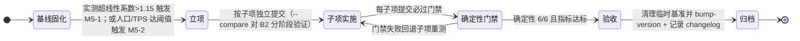

# 08. Flow & Accord · 仿真内核与全链路性能优化规划书

> **文档定位**：仅记录尚未落地的性能优化。已完成优化的设计、实施与验收统一归档至 `docs/current/01-changelog.md`。
>
> **当前主线**：M5-1「消除超线性」（P2）；M5-2「多线程 Fork-Join」只在容量阈值触发后立项。
>
> **当前版本基准**：v1.46.5；基线采集于 2026-09-06（500k tick）与 2026-09-07（800k 满载）。

## 状态机

本节描述一项「性能优化」从基线固化、立项、子项实施、确定性门禁到验收归档的生命周期。优化必须以实测超线性热点或容量阈值为触发，且 100% 通过确定性不变量，不接受字节级分叉。



| 状态 | 含义 | 进入条件 | 退出条件 |
| :--- | :--- | :--- | :--- |
| A 基线固化 | profile-benchmark 采集 B0/B1/B2，定位超线性热点 | 优化前固化基准 | 热点超线性系数>1.15 或容量阈值满足 |
| B 立项 | M5-1 消除超线性（P2）/ M5-2 多线程 Fork-Join（条件触发） | 触发条件达成 | 拆为子项独立提交 |
| C 子项实施 | M5-1.1~1.4 或 M5-2 并发只读 Phase 6 评估寻路 | 立项拆分 | 每子项必过门禁 |
| D 确定性门禁 | test-determinism 6/6、test-wasm、config-check、frontend-check | 子项提交 | 门禁通过转验收；失败回退重测 |
| E 验收 | B2 稳态<42µs、Phase 3/7/6 系数≤1.15、400 人新世界单拍<100µs | 门禁全过且指标达标 | 清理临时基准并升版 |
| F 归档 | 结果写入 docs/current/01-changelog.md，bump-version | 验收完成 | 优化关闭，进入现状文档 |

**不变量**（落地时必须守住的约束）：
- 任何优化必须 100% 通过 `test-determinism.js` 的 6 套不变量，不接受字节级分叉；同版本同种子必须确定性一致。
- 保持固定 dt、既有个人决策相位、层级评估时机与结算时序；取消按需求层级再错峰，不能通过延后需求评估取得性能收益。
- `crates/sim_wasm` 保持 raw wasm（零依赖、无 host import）架构；重量级架构变更必须由数据触发，不引入 wasm threads。

> 本文为规划态：M5-1 为当前主线（P2），M5-2 仅条件触发立项；以上状态均尚未实现。

## 1. 基准与结论

| 基准线 | 场景 | Tick 数 | 终局人口 | 平均单拍 | 稳态单拍 | 用途 |
| :--- | :--- | ---: | ---: | ---: | ---: | :--- |
| B0 | 默认配置 | 500,000 | ~80 | 15.02 µs | — | 历史对照 |
| B1 | 默认配置 | 800,000 | 88 | 15.80 µs | 19.89 µs | 同尺度对照 |
| **B2** ★ | **产速拉满** | 800,000 | **442** | **32.22 µs** | **57.45 µs** | M5 立项依据 |

- 产速本身不进入热路径；满载的代价来自解除资源约束后的人口增长（88 → 442 人）。
- 442 人成熟世界仍有 **17,405 TPS（约 290 倍实时）**；400 人新世界瞬时仍有 **7,355 TPS（约 122 倍实时）**。
- 当前需处理的超线性热点是 Phase 3 房屋维护与折旧、Phase 7 账本宗族公仓与 Phase 6 马斯洛决策寻路。
- 毫秒级且位置不可复现的尖峰属于 V8 GC、操作系统调度或同机争用，不构成优化立项理由；长尾测量必须用零分配探针。

| 阶段 | 100 人 (µs) | 400 人 (µs) | 实测倍数 | 超线性系数¹ |
| :--- | ---: | ---: | ---: | ---: |
| Phase 3 房屋维护与折旧 | 1.70 | 11.21 | 6.59x | **1.65** |
| Phase 7 账本宗族公仓 | 7.52 | 39.97 | 5.31x | **1.33** |
| Phase 6 马斯洛决策寻路 | 9.12 | 48.14 | 5.28x | **1.32** |
| Phase 5 动力位移踩踏 | 4.83 | 21.38 | 4.43x | 1.11 |
| Phase 1 代谢繁衍与继承 | 1.15 | 4.65 | 4.04x | 1.01 |

> ¹ 超线性系数 = 实测倍数 ÷ 人口倍数（4.0）；1.0 为完美线性。

## 2. 优化铁律

1. 任何优化必须 100% 通过 `node tools/test-determinism.js` 的 6 套不变量；不接受字节级分叉。
2. 优先处理有实测收益的热点；重量级架构变更必须由数据触发。
3. `crates/sim_wasm` 保持 raw wasm（零依赖、无 host import）架构。
4. **取消按需求层级再错峰**：保持固定 dt、既有个人决策相位、层级评估与结算时序；不能通过延后需求评估取得性能收益。与新增行为的验证边界见[融合设计 §7](./01-integration-contracts.md#7-事实快照与验证)。

## 3. M5-1：消除超线性（当前主线）

**目标**：将 Phase 3 / 7 / 6 的超线性系数（1.65 / 1.33 / 1.32）全部压到 ≤ 1.15。

| 子项 | 阶段 | 候选方案 |
| :--- | :--- | :--- |
| M5-1.1 | Phase 3 房屋维护与折旧 | 立宅候选检索改为空间网格或营地分桶邻域检索；核实拍卖环形缓冲归还路径无 O(n) 搬移；评估活跃房屋稀疏集合。 |
| M5-1.2 | Phase 7 账本宗族公仓 | 全量重算改为增量累加加周期校准；家户聚合改为变更事件驱动。 |
| M5-1.3 | Phase 6 马斯洛决策寻路 | 复核既有 origin-target 路径缓存、APSP 与失效条件，按热点证据优化查询和索引；核实 A* open list。保持个人决策相位及各层评估时机，不增加需求层级错峰。 |
| M5-1.4 | Phase 1 代谢繁衍与继承 | 为继承链和家户关系建立 id → index 索引，避免线性查找。 |

- **范围**：`crates/sim_core/src/spatial/housing_system/`、`ledger/`、`decisions/`、`world.rs`。
- **验收**：确定性 6/6；400 人新世界单拍 < 100 µs；Phase 3/7/6 系数均 ≤ 1.15；B2 稳态 < 42 µs（> 23,800 TPS）。
- **风险**：中高。各子项须独立提交、独立测量，并使用 `--compare` 对 B2 分阶段基准验证。

## 4. M5-2：多线程 Fork-Join（条件触发，非必做）

仅在满足任一条件时启动：

1. 目标人口 ≥ 1,000 人且成熟世界稳态 TPS < 3,000；
2. 人口 > 500，且 100x 倍速下稳态单拍 > 167 µs（低于 6,000 TPS）。

当前 442 人规模未满足触发条件。若启动，仅并发只读的 Phase 6 评估和寻路；主线程必须按 `agent.id` 升序确定性汇聚与回写。不得引入 wasm threads。目标收益为 1.5–2.5x，并新增逐字节匹配单线程结果的多线程等效性测试。

## 5. 实施与复现

```bash
# 优化前固化基准
node tools/profile-benchmark.js --ticks 3000 --json tools/baseline-pre.json
node tools/profile-benchmark.js --preset max-yield --ticks 800000 \
  --breakdown --breakdown-warmup 700000 --breakdown-ticks 2000 \
  --snapshot-warmup 700000 --json tools/baseline-pre-maxyield.json

# 必过门禁
node tools/test-wasm.js
node tools/test-determinism.js
node tools/config-check.js
node tools/frontend-check.js

# 对比优化结果
node tools/profile-benchmark.js --ticks 3000 --compare tools/baseline-pre.json
```

完成后清理临时基准，执行 `node tools/bump-version.js --patch` 与 `node tools/bump-version.js --check`，并在 `docs/current/01-changelog.md` 记录结果。

```bash
# B2 满载复现
node tools/profile-benchmark.js --preset max-yield --ticks 800000 \
  --breakdown --breakdown-warmup 700000 --breakdown-ticks 2000 \
  --snapshot-warmup 700000 --json tools/baseline-maxyield-800k.json
```
