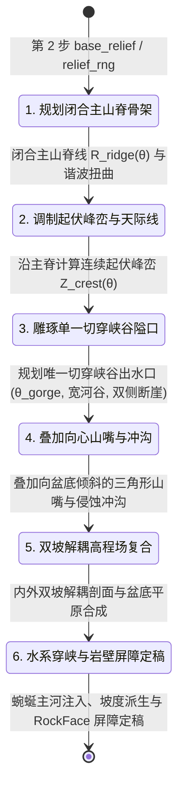
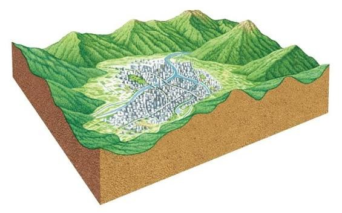

# 10. 盆地群峰环抱与峡谷出水口地貌规划 (TB-04)

> **状态**：规划设计，尚未实施；未来作为独立地貌重构里程碑（**TB-04**）落地。
> **前置依赖**：[06 地图模板规划](./06-terrain-templates.md)（§5.6 盆地模板原型） · [07 地形美术](./07-terrain-art.md)（TA-09/TA-12 岩石纹理与高山表现）。
> **核心目标**：彻底消除盆地四周被平地环绕的人工几何缺陷，构建符合自然地理真实规律的“群峰环抱、向心支脊、深切峡谷出水口”宏伟山间盆地地貌。

## 状态机

本节描述 TB-04 盆地创世阶段的高程场与水文地貌生成流水线状态机。创世流程从确定性 RNG 抽取主山脊参数开始，顺序规划闭合山脊线、向内倾斜山嘴支脊、切穿峡谷出水口，最后复合双坡高程场并定稿水文与地表分类。



| 阶段 | 状态名称 | 核心职责 | 输入与依赖 | 退出条件与产出 |
| :--- | :--- | :--- | :--- | :--- |
| 1 | PlanRidgeSkeleton | 抽样盆心、长短半轴、旋转角与角向多谐波（$3\theta+5\theta+7\theta$） | `relief_rng`、`SimConfig` 盆地形态超参 | 生成闭合连续极坐标曲线 $R_{\text{ridge}}(\theta)$ |
| 2 | ModulatePeakElevations | 沿山脊线计算峰顶与鞍部的起伏高程场（$Z_{\text{peak}} \sim 70\text{m}$，鞍部 $\sim 42\text{m}$） | 山脊线角度 $\theta$、多尺度 fBm 噪声 | 消除平顶台地，生成锯齿状起伏天际线 |
| 3 | CarveWaterGapPass | 在峡谷方向角 $\theta_{\text{gorge}}$ 雕出两岸绝壁夹峙的深切出水口走廊 | `exit_theta`、峡谷角宽、切深参数 | 形成盆地唯一对外连通与排水的峡谷通道 |
| 4 | SuperimposeRadialSpurs | 向盆心延伸三角形山嘴（Spurs）与放射状侵蚀冲沟（Ravines） | 径向距离 $r$、局部角向扰动 | 打破光滑椭圆内壁，形成自然山前凹凸山湾 |
| 5 | DualSlopeElevationComposite | 分离计算内坡（朝向盆心降至平原）与外坡（向外延伸至图缘连绵峰峦） | 法向距离 $d_\perp$、双坡解耦函数 | 生成全图高程场（沙盘侧壁保留起伏山体剖面） |
| 6 | FinalizeBasinWaterAndBiome | 铺设盆底蜿蜒河流，派生坡度场与 $\ge 34^\circ$ `RockFace` 硬屏障 | 第 3 步水系流水线、高程梯度运算 | 盆心平原可建格充裕，环抱山壁自然闭合禁行 |

---

## 1. 现象与现状缺陷诊断

### 1.1 现状缺陷现象：盆地四周被平地环绕
在既有盆地模板（`basin_oasis_v1`）生成的地图中，视口观察与沙盘切面存在显著违背自然地理的形态特征：
- 盆地内部为下凹平原，但在盆壁上升到一定高度后，四周展现为**一整圈平缓的高海拔台地/平原**；
- 边界沙盘侧壁（`BOUNDARY_WALLS`）呈现出近乎水平的切线平顶，未呈现崇山峻岭的地质断层或起伏峰峦；
- v1.50.78 为消除外围孤岛死区，引入了 4 条等间隔径向平地谷地（`valley_mask`），使得四周高台进一步被四向人工平地切穿，彻底丧失了自然山间盆地“四面环山、天险闭合”的沉浸感。

### 1.2 源码几何根因剖析
在 `crates/sim_core/src/geo/basin.rs` 中，当前高程计算逻辑如下：
1. **盆底生活带（$q \le 0.82$）**：深度 $Z \approx -18\text{m}$，平缓开阔；
2. **山壁爬升带（$0.82 < q \le 1.05$）**：用单一 `smoothstep` 在仅 $0.23$ 的极窄距离内急剧爬升至 $+42\text{m}$；
3. **外围截断缺陷（$q > 1.05$）**：
   ```rust
   let dz = if q <= 0.82 {
       // ... 盆底下凹 ...
   } else if q <= 1.05 {
       // ... 极窄爬坡带 ...
   } else {
       self.rim_height_m * (1.0 - 0.85 * vm) // ⚠️ 致命截断：此处恒为常数 42.0m！
   };
   ```
   当 $q > 1.05$ 直至世界边缘（$q \approx 1.4 \sim 1.7$），高程增量 `dz` 直接锁死在固定常数 $42\text{m}$（除谷地掩码抑制外）。其上叠加的 3 倍频噪声振幅仅 $\pm 4\text{m}$，导致**山壁外侧全是一块巨大的平顶高原平地**。
4. **谷地切穿缺陷**：4 条谷地掩码全宽直接将山壁压至地平，破坏了环抱山体的连续性。

---

## 2. 自然地理原型解构与设计目标

根据自然地理真实山间盆地（如四川盆地、吐鲁番盆地及典型山间构造盆地）的三维地质剖面切面原型：



### 2.1 五大核心地质特征
1. **闭合环抱山系与崇山峻岭（Enclosing Mountain Range）**：
   - 盆地周围被剧烈抬升的褶皱/断块山脉完全包围。山脉不是平顶台地，而是由起伏的主山脊线（Mountain Crest）与错落的独立山峰（Mountain Peaks）组成；
   - 沙盘侧壁切面（Cutaway Cross-section）展现出山峰与山谷交替的波浪状起伏地质剖面。
2. **向盆底倾斜伸展的支脉山嘴（Foothill Spurs）**：
   - 山体向盆地内部伸出一道道三角形山嘴（Spurs），形成层次丰富、有进有退的山湾与山脚缓坡带（山前冲积裙）；
   - 彻底打破同心椭圆的机械人造感，产生近景山脉的遮挡、阴影与错落感。
3. **向心汇水的侵蚀沟壑（Dendritic Ravines）**：
   - 山嘴之间下切侵蚀出 V 字形山涧与干沟，将山脉水流汇流至盆地底部。
4. **唯一切穿山脉的峡谷出水口（Antecedent River Gorge）**：
   - 自然山间盆地的排水与对外交通依赖一条**穿山深切峡谷**（如长江三峡之于四川盆地、黄河积石峡之于循化盆地）；
   - 峡谷两侧是刀削般的千仞绝壁（`RockFace` 垂直断崖），河道与栈道沿峡底蜿蜒穿出盆地，构成极具视觉辨识度的天然咽喉关隘。
5. **宽阔肥沃的盆底冲积生活平原（Fertile Alluvial Plain）**：
   - 盆地中央地势平坦低矮（坡度 $< 5^\circ$），主河蜿蜒流淌，土壤肥沃，为族人提供大规模聚落建设、农耕与通畅交通网络。

---

## 3. 核心数学与物理高程模型

TB-04 将重构 `crates/sim_core/src/geo/basin.rs`，确立全新的**闭合环脊双坡解耦算法**（Closed Crest Dual-Slope Algorithm）。

### 3.1 闭合主山脊线与起伏峰脊

以盆心 $(C_x, C_y)$ 为极点，定义主山脊线的极径 $R_{\text{ridge}}(\theta)$ 与峰脊天际线高程 $Z_{\text{crest}}(\theta)$：

$$R_{\text{ridge}}(\theta) = R_0 \cdot \left[ 1.0 + \sum_{k=1}^4 a_k \cos(k\theta + \phi_k) \right]$$

- $R_0$：主山脊平均半径，取 $0.38 \sim 0.44 \times \text{world\_size}$；
- 谐波项（$a_1 \sim a_4$）：引入 $2\theta$（椭圆伸长）、$3\theta$（三角形山块分布）、$5\theta$ 与 $7\theta$（高频自然曲折），使山脊走向呈现极其自然的地理轮廓。

沿山脊走向的峰峦天际线高程 $Z_{\text{crest}}(\theta)$：
$$Z_{\text{crest}}(\theta) = Z_{\text{base}} + \sum_{m=1}^5 B_m \cos(m\theta + \psi_m) + \text{fBm}_{\text{ridge}}(\theta) \cdot H_{\text{noise}}$$

- $Z_{\text{base}} = 55.0\text{m}$；
- 独立主峰顶标高 $Z_{\text{peak}} \approx 70 \sim 85\text{m}$；
- 山脊鞍部（Saddles）标高 $Z_{\text{saddle}} \approx 38 \sim 48\text{m}$；
- **从数学源头上彻底杜绝平顶高台**，确保整条环形山脉峰峦叠嶂、起伏跌宕。

### 3.2 内外双坡解耦横截面剖面

对于全图任意点 $(wx, wy)$，求其相对主山脊线的法向有符号距离 $d_\perp(wx, wy) = r(wx, wy) - R_{\text{ridge}}(\theta)$：

```text
       盆地中央               山前裙带        内山壁 (RockFace)       主山脊峰顶 (Z_crest)      外围山峦延伸
       Z_floor (~-16m)       缓坡 (6~15°)    陡崖 (38~46°)           Z_peak (70~85m)         持续起伏 (40~65m)
─────────┬──────────────────────┬───────────────┬─────────────────────────▲───────────────────────┬───────────► 世界边缘
         │                      │               │                         │                       │
     d_perp << 0            d_perp < 0      d_perp -> 0               d_perp = 0              d_perp > 0
    (盆底平原生活区)         (冲积扇/麓原)     (硬禁行断崖天然阻隔)      (分水岭峰脊)            (崇山峻岭沙盘切面)
```

1. **内坡模型（$d_\perp \le 0$，朝向盆心）**：
   - 归一化内坡位置 $u_{\text{in}} = \text{clamp}\left(\frac{|d_\perp|}{W_{\text{inner}}}, 0.0, 1.0\right)$；
   - 复合剖面函数划分为三个连续微区：
     - **山脊至绝壁段（$u_{\text{in}} \in [0.0, 0.4]$）**：高坡度急剧下坠，坡度稳定在 $38^\circ \sim 46^\circ \ge 34^\circ$，天然派生 `RockFace` 材质与 `NO_WALK` 硬阻隔圈；
     - **山前麓原段（$u_{\text{in}} \in [0.4, 0.75]$）**：由倒石堆与冲积物形成的过渡缓坡（$6^\circ \sim 15^\circ$），树木石块成组分布；
     - **盆底生活平原（$u_{\text{in}} \in [0.75, 1.0]$）**：微幅凹陷至 $Z_{\text{floor}} \approx -16.0\text{m}$，坡度 $< 5^\circ$，提供超万格开阔平原。
2. **外坡模型（$d_\perp > 0$，朝向世界边缘）**：
   - **核心改动：不再锁死为常数！**
   - 保持外侧山体高位起伏，并沿坡面叠加高频地形 fBm 与次级褶皱：
     $$Z_{\text{outer}}(wx, wy) = Z_{\text{crest}}(\theta) - \Delta Z_{\text{drop}} \cdot \text{smoothstep}\left(\frac{d_\perp}{W_{\text{outer}}}\right) + \text{fBm}_{\text{outer}}(wx, wy) \times W_{\text{mountain}}$$
   - 外缘高程在世界边界处仍维持在 $35 \sim 65\text{m}$，使沙盘四面侧壁（`BOUNDARY_WALLS`）切出的全是嶙峋起伏的山体切面，重现参考图沙盘切面地质美感。

### 3.3 向心山嘴支脊（Spurs）与侵蚀冲沟（Ravines）

为消除平滑碗状内壁的人工痕迹，在内坡叠加确定性放射状山嘴与冲沟系统：
$$\Delta Z_{\text{detail}}(r, \theta) = \sum_{j=1}^{N_{\text{spur}}} H_j \cdot \exp\left( -\frac{(\theta - \theta_j)^2}{2\sigma_\theta^2} \right) \cdot P_{\text{radial}}(r)$$

- **山嘴（Spurs，$\Delta Z > 0$）**：犹如巨大的三角形扶壁从主山壁向盆心突出 $30 \sim 60\text{m}$，端部平缓没入盆底；
- **冲沟（Ravines，$\Delta Z < 0$）**：相邻山嘴之间凹陷，下切成陡峭的山涧深沟，与后续高山植被与岩壁阴影形成强烈光影明暗对比。

### 3.4 唯一切穿峡谷出水口（Canyon Water Gap）

废除 v1.50.78 的十字 4 径向开敞平地割裂，代之以**地质学真实的切穿峡谷隘口**：
- 抽取单主出水口方向角 $\theta_{\text{gorge}}$（由种子确定）；
- 在角向窗口 $|\theta - \theta_{\text{gorge}}| \le \Omega_{\text{gorge}}$ 内，对主山脊高程进行垂直深切雕琢：
  $$Z_{\text{cut}}(\theta) = Z_{\text{crest}}(\theta) \cdot \left[ 1.0 - (1.0 - k_{\text{pass}}) \cdot \cos^2\left(\frac{\pi (\theta - \theta_{\text{gorge}})}{2\Omega_{\text{gorge}}}\right) \right]$$
- 峡谷底部为宽 $18 \sim 28\text{m}$ 的通畅开阔河谷走廊（坡度 $< 12^\circ$），主河自峡底穿出；
- 峡谷两侧保留高耸突兀的峡门绝壁（峡谷石门），实现“一夫当关、万夫莫开”的险要峡口意象，同时确保盆地内外 $100\%$ 步行动力学连通（`components == 1`）。

---

## 4. 水系、生态与连通性规则契约

### 4.1 水文系统深度融合
1. **盆地内部蜿蜒主河**：
   - 废除单泉池或生硬静水，在盆底引入蜿蜒曲折的主河流（Meandering River）；
   - 主河发源于盆地深处的山前涌泉/山涧汇流区，贯穿盆底平原，在聚落旁形成优美河湾与取水沙洲；
   - 最终自唯一峡谷出水口（Gorge）奔流出山，注入外部水系。
2. **取水与灌溉安全**：
   - 河流沿岸设置平缓河阶与安全取水点（`RiverBank` / `ShallowFord`），保证族人饮水与灌溉需求。

### 4.2 土地利用与生态分带
1. **盆心平原地带（生活与农耕区）**：
   - 面积充足（可建格 $\ge 12,000$ 格），地势平缓（坡度 $< 5^\circ$），深厚冲积沃土；
   - 营地、私宅、仓储与未来农田集中分布于此。
2. **山前麓原与山嘴（林木采伐带）**：
   - 坡度 $6^\circ \sim 18^\circ$，散布密集的落叶乔木与灌木群落（利用既有 `accents.rs`）；
3. **高山绝壁与峰脊（矿藏与天险）**：
   - 坡度 $\ge 34^\circ$，天然暴露巨型基岩（`RockFace`）；采石场与金矿 POI 可依山势锚定在山脚冲积扇与岩壁交界处。

---

## 5. 表现层与沙盘侧壁切面渲染增强

### 5.1 沙盘侧壁（`BOUNDARY_WALLS`）地质剖面呈现
由于外坡高程保持在 $35 \sim 65\text{m}$ 且具起伏变化：
- 渲染管线（★ v1.60.1 前经 `render_terrain.js::drawBoundaryWallSeg`，此后侧壁由 WebGL 地形层顶点绘制并参与 GPU 深度测试）在地图边缘切出的不再是一条平淡的水平天际线；
- 侧壁垂直下垂面将真实展现出自然切断的山峰山谷波浪形断层剖面（与参考图的泥土/岩石三维截面完全一致）。

### 5.2 垂直自然带视觉呈现（结合 TA-12）
- **盆底**：嫩绿草甸与冲积壤土纹样；
- **山麓**：浅绿疏林与卵石砂砾带；
- **山腰**：高坡度暖灰/深灰层状沉积岩壁（`RockFace` 纹理条带）；
- **峰峦**：高海拔裸岩、高山草甸与风化岩屑堆（Scree）。

---

## 6. 参数规范与探针门禁验收体系

### 6.1 新增/重构超参规划（`SimConfig`）
在 TB-04 实施阶段，相关超参将集中收敛并前后端同步：

| 参数字段 | 类型 | 建议默认值 | 说明与地貌影响 |
| :--- | :--- | :--- | :--- |
| `terrainBasinRidgeMeanRadiusRatio` | `f32` | 0.42 | 主山脊平均半径比例（× world_size） |
| `terrainBasinPeakElevationM` | `f32` | 75.0 | 主山脊峰顶典型标高 (m)，雄壮起伏峰顶 |
| `terrainBasinSaddleElevationM` | `f32` | 42.0 | 主山脊鞍部典型标高 (m)，控制山脊起伏韵律 |
| `terrainBasinSpurCount` | `u32` | 7 | 向盆心伸入的三角形山嘴支脊数量 (5~9) |
| `terrainBasinSpurReachM` | `f32` | 45.0 | 山嘴向盆底延伸的最大水平距离 (m) |
| `terrainBasinGorgeWidthM` | `f32` | 24.0 | 唯一切穿峡谷出水口底部宽度 (m) |
| `terrainBasinOuterMountainNoiseGain` | `f32` | 0.70 | 外围崇山峻岭粗糙度增益（保证沙盘侧壁起伏） |

### 6.2 无头探针验收矩阵（`terrain_probe.rs`）
实施后必须通过 60 种子全量矩阵检验，守住如下硬性门禁：

1. **单连通分量绝无死区（`components == 1` 100%）**：
   - 60 种子中 60/60 连通分量恒为 1；
   - 峡谷出水口与盆底生活区完全打通，杜绝任何外部噪声孤岛；
2. **盆底生活空间充足**：
   - `buildable_count >= 11,500`（160×160 分辨率下有效可建格充裕）；
3. **环抱天险硬禁行闭合率**：
   - 山壁中上部 $\ge 34^\circ$ `RockFace` + `NO_WALK` 连续闭合（除峡谷隘口外 $100\%$ 阻隔）；
4. **沙盘边缘高度标准差**：
   - 地图四周边格高程方差 $\sigma(Z_{\text{boundary}}) \ge 8.5\text{m}$，数理证明边缘非平地，沙盘切面呈起伏山脉状。

---

## 7. 实施路线与阶段分解

TB-04 规划分为四个交付阶段：

1. **阶段一 · 静态高程骨架重构（内核几何）**：
   - 在 `crates/sim_core/src/geo/basin.rs` 中实现闭合主山脊线、双坡解耦与向心山嘴数学模型；
   - 跑通 60 种子探针，标定山壁坡度与连通分量。
2. **阶段二 · 穿山峡谷出水口与水文雕琢**：
   - 接入峡谷切穿算法与盆地主河道贯通，校准出水通道坡度与两岸断崖。
3. **阶段三 · 表现层与沙盘侧壁效果验证**：
   - 验证 3D 沙盘边界切面山体剖面呈现，配置四季光照与高山岩石纹理。
4. **阶段四 · 全链路回归与基线发布**：
   - 跑通全量确定性回归与无头性能基准，递增生成器版本并正式收官。
