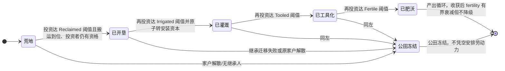

# 荒地开垦农田与农业税经济系统设计

> **状态**：规划设计，尚未实现；具体排期以 TODO 为准。
> **修订日期**：2026-09-09。
> **公共契约**：[在办方案融合设计](./20-integration-contracts.md)负责家庭保护储备、预约、选策、物资和土地接口。

## 状态机

本节描述「农田地块 FarmPlot」从荒地到肥沃的投资阶梯生命周期。地块等级按固定四级顺序逐级提升，每次只升级一级，投资先查家庭保护线再逐次提货搬运、集齐后原子转为安装资本。



| 状态 | 含义 | 进入条件 | 退出条件 |
| :--- | :--- | :--- | :--- |
| A 荒地 | Wasteland，area=0，无安装资本 | 新建地块或所有权清空 | 投资达 Reclaimed 阈值并原子转资本 |
| B 已开垦 | Reclaimed，area 固定 1，开垦资本就位 | 首级投资集齐且资格有效 | 再投资达 Irrigated 阈值 |
| C 已灌溉 | Irrigated，irrigation 资本就位 | 第二级投资到账 | 再投资达 Tooled 阈值 |
| D 已工具化 | Tooled，tool_quality 资本就位 | 第三级投资到账 | 再投资达 Fertile 阈值 |
| E 已肥沃 | Fertile，fertility 资本就位，作物高产 | 第四级投资到账 | 收获后 fertility 有界衰减，tier 不变 |
| F 公田冻结 | owner_household=None，冻结新投资/播种/派工 | 无继承人或家户解散 | 按合法继承规则迁移（不复制产物） |

**不变量**（落地时必须守住的约束）：
- 同田同一时刻最多一个未完成升级项目；中断只释放未提取预约，不退回已装入行囊或送到田的物资。
- 资本账本不提供原材料提取接口，已安装资本不能当作可搬走原材料；农田待运粮、已安装资本、行囊与家庭现货分开记账，同一份物资只能在一处。
- 资本支付不能代替劳动，零劳动不产生可收获粮食；作物产量由真实到场劳作与物理阶段结算，不按背包装载重复生成。

> 本文为规划态：以上状态均尚未实现（M1~M4 为建议落地阶段）。

## 1. 设计目标与首期边界

农田是需要资本、劳动和运输的生产资产。首期必须完成“自主投资 → 实际赴田劳作 → 收获留田 → 装入行囊 → 回宅卸货 → 产出税与净粮入账”，不采用远程自动产粮入家户的简化模型。世界系统只推进作物物理过程、执行已选任务和结算事务，不扫描居民强制派工。

采用**产出税与现有库存税并存**：农业税对实际运回并结算的本次农业产出征一次；税后粮食留在家户时，仍进入之后的库存税税基。两种税负分别展示，不承诺同一批粮终生只纳一次税；首期不增加抵扣、免税追踪或税收债务。

## 2. 农田资产与物资归属

建议新增农业模块，按规模拆分，农田不放入自然 `PrimitivePoi`。概念模型如下，具体类型名在实施时确定：

```text
FarmPlot {
  id: FarmPlotId,
  camp_id: u32,
  owner_household: Option<HouseholdId>, // None 表示所属地区公田
  node_id: NodeId,
  area: f32,                          // 荒地 0，开垦后首期固定 1
  tier: FarmTier,                      // Wasteland → Reclaimed → Irrigated → Tooled → Fertile
  fertility: f32,                      // 可投资、会耗损的资产地力
  irrigation: f32,
  tool_quality: f32,
  labor_progress: f32,                 // 当前作物批次实际累计劳动小时
  crop_stage: f32,
  planted_tick: u64,
  crop_cycle_id: u64,
  last_harvest_cycle: Option<u64>,
  capital_ledger: Ledger,              // 已安装资本，不能当作可搬走原材料
  harvest_batches: bounded collection, // 待运产物及其来源/结算状态
  cumulative_output: f32,
  cumulative_tax: f32,
}
```

农田待运粮、已安装资本、人物行囊与家庭现货分开记账；同一份物资只能在一处。资本账本表示投入形成的资产，不提供原材料提取接口；收益估值不是可消费库存。原材料从家中提取、实际运到农田投入后才能升级。

农田由家户持有，分家或原家户解散时按合法继承规则迁移，已运输物资另按货物归属处理，不复制农田产物。无继承人时成为 `owner_household = None` 的地区公田，现有资产与待运产物保全；首期冻结新投资/播种/派工，不凭空安排公田劳动力。公田经营与配送另行设计，不能自动发粮到公仓。

## 3. 投资、作物与真实劳动

### 3.1 投资阶梯

首期采用固定顺序的四级投资阶梯，依次改善开垦、灌溉、农具和地力；不同时承诺四槽自由组合。数值为校准起点，均须配置化：

| 目标等级 | 水 | 粮 | 木 | 石 | 金 |
|---|---:|---:|---:|---:|---:|
| Reclaimed | 20 | 30 | 60 | 30 | 10 |
| Irrigated | 40 | 20 | 50 | 70 | 30 |
| Tooled | 20 | 30 | 70 | 20 | 50 |
| Fertile | 30 | 40 | 40 | 50 | 80 |

每次只升级一级。投资先按[家庭保护与预约](./20-integration-contracts.md#2-家庭资源保护与可支配余额)检查各类可支配余额，预约后逐次提货搬运。超过独立背包容量的成本须分趟运输，已送达投入留在农田项目账中；集齐且投资者仍有资格时才原子转为安装资本并升级。中断只释放未提取预约，不退回已经装入行囊或送到田里的物资。

同田同一时刻最多一个未完成升级项目；退料也要真实搬运，项目废弃不得无条件重新发放投入。家庭缺粮、分家或紧急自救可取消尚未执行的承诺，结算前复核余额与权属。

### 3.2 作物周期与产量

首期每块田每季最多一个作物批次，采用一种普通粮作物。播种和劳作由 Agent 自主到田完成，只有人在合法作业点、任务有效且实际消耗工作时间时，物理执行器才增加 `labor_progress`。资本支付不能代替劳动，零劳动不产生可收获粮食。

```text
climate = clamp(1 - abs(temperature - crop_optimal_temp) / crop_temp_span, 0.25, 1)
labor   = clamp(labor_progress / labor_required, 0, 1)
yield   = base_yield_per_area × area × climate × labor
        × (1 + irrigation_coef × irrigation)
        × (1 + tool_coef × tool_quality)
        × (fertility_floor + fertility_coef × fertility)
```

成熟度随配置化作物周期、温度和水分条件推进；采收须同时满足成熟度、最低实际劳动量及该季未收获。作物状态和产量采用确定的物理阶段更新；收获由到场 Agent 的执行任务触发，冻结本批真实产量并重置作物批次，不能由每次背包装载重复生成产量。无劳动、无人采收时不自动转为家庭粮食。待运批次满额时暂停新播种，数量上限配置化且不得静默丢弃粮食。

天然土地适宜性由22提供，只负责准入及明确的基础成本/产量项；投资地力独立，禁止同一肥力优势重复相乘。每次实际收获后对资产地力做有界衰减，投资恢复也有上限。灌溉资本不等于新增可饮水库存；首期按气候与安装条件建模，不隐式抽取河流额度，未来真实灌溉须另接共享水池预算。

## 4. Agent 自主行动与执行阶段

- **投资意图**：保留拟新增 `B19InvestFarm` / `InvestFarm`，安全/尊重层的分支默认值在实现时按配置体系接入。资格为在世成年、合法家户户主或配偶、具有劳动能力且非衰弱、无更高需求阻断，并有地块、预算与可达路线。
- **生产意图**：首期一并接入农业生产需求，阶段包括播种、照料作物、收获与搬运；稳定分支 ID 在统一分支登记时分配，避免与18的 b20～b22 占位冲突。成熟待运粮可作为家庭备粮的 L2 来源，已有更紧急需求仍优先。
- **任务权威**：投资和生产都放入 `ActiveTask`，经统一 transition 入口安装、到达、劳作、装卸及退出；不新增自行改写 `state` 的农业扫描器。
- **选择目标**：只读比较可行地块、劳动/往返时间与预期税后产出。ROI 使用同一游戏时间窗口、同一估值尺度，包含资本、劳动和运输；同分按稳定农田 ID 破平。无可靠跨物资估值时使用配置化估值，不把单位不同的资源直接相加。
- **提交事务**：执行器在实际到场且满足阶段条件时提交类型化 `Invest / Plant / Work / Harvest / Load / Unload` 结果，含任务 ID、批次、归属、实际数量或工时。重复提交同一完成标志不重复结算。
- **并发与中断**：复用家庭资源预约及农田作业占用；临界饥渴、伤势、衰弱、房宅失效或权属变化触发正常退出/重选，已产生的进度和实物保全，不能瞬移回家。

保持世界原有阶段顺序：交互阶段结算实际劳作、收获和装卸，决策阶段选择/推进任务，账本阶段继续现有制度处理。新任务不能追溯参与已经结束的交互阶段；无需为农业重排 `tick_region` 或全部 world tick。

## 5. 搬运、农业税与地区财政

### 5.1 税基与时点

田里采下的粮先进入农田待运批次，按速率装入人物行囊，返宅后才结算为家户收入。每次实际卸货数量 `q` 是本次农业入账税基；同批可以分趟、分步卸货，每一单位只计一次农业税，已纳税粮食再次搬运或市场出售不再征农业税。

携带记录必须保留农田、作物批次、未结算农业量和合法受益家户，不能把粮卖到市集绕开首期农业入账流程。首期禁止出售尚未结算的农业货物；死亡遗物归户走同一农业入账结算，已处置物资不能再退款或重复征税。继承改变受益人但不清除批次来源，公田归属按 §2 冻结，不能把公田粮暗转私人收入。

税款归农田 `camp_id` 对应地区。是否有王以**实际卸货交互阶段开始时已有的政体状态**判定；后续账本阶段发生继承/登基不追溯更改已完成结算。无王时本次卸货全额入合法家户且无欠税；恢复有王只对其后的新卸货征收，不追税前已经入账的粮。

```text
protected_from_q = min(q, 本次卸货段剩余免征留粮额度)
taxable_q        = q - protected_from_q
tax              = region_has_king ? taxable_q × agricultural_tax_rate : 0
剩余免征留粮额度 -= protected_from_q
net               = q - tax
行囊农业货物 → 家户账本 : net
行囊农业货物 → 地区公仓 : tax （AgriculturalTax）
```

卸货段开始时，以 `max(0, 农业税最低留粮线 - 家户当前可食用现货折算量)` 冻结免征留粮额度，分步卸货持续扣减，不每 tick 重置。实际消费、家庭归属或税率/政体发生变化时结束该段并按新条件建立下一段，已结算量不回滚；单纯暂停、分批步进和读档不新建卸货段。

首期农业税沿用现有制度税收的账本划拨抽象：人物已将粮运到家宅，制度结算把税份划入公仓，不增加另一趟纳税运输；该例外只用于税收，不允许家庭收获、投资材料或市场买卖远程搬运。未来若设计实物运税，须另行评估公仓配送与欠税状态。

采用全系统确定的精度规则，批次记录累计计税基数/已缴税及舍入余量，使同一税率、政体和留粮条件下分步卸货不改变总税额。税率或政体实际变化可影响后续卸货，并保留时点证据。

### 5.2 与库存税并存

农业税率、最低留粮线配置化，税率首轮可用 0.12 校准。留粮线限制本次农业税，不从原家户余额倒扣，也不阻止同 tick 后续库存税依法征收；家庭预约不是免税金额。取消独立农业税周期，随真实卸货结算，避免收获与周期双重征税。

例：暂不触发留粮减免，卸回 100 粮、农业税率 12%，农业税 12、净入户 88。若随后库存税率为 10% 且家中无其他粮，则再征 8.8，剩 79.2。两次税分别有不同税基，UI 必须展示总负担；不能描述为“农业税与库存税绝不重复影响同批粮”。

地区分别记录本期/累计农业实际入账产出、农业税与库存税；无王期间新农业税为零，但已累计的历史产出/税额不清零。另列田间毛产出、待运量、途中量与家庭净收益，不能用田间产量冒充已交付收入。对照实验比较不启用农业、农业无产出税、农业与双税并存的劳动负担、生存率与财政收益。

## 6. 地块、快照与存档

农业选址依赖22 T0统一地块查询，校验完整占地、坡度、水域、占用及路网接入；无需等待全部河流地图上线。先占地再安装资产，同拍竞争相同地块按稳定顺序提交，后来的任务失败不能覆盖既有产权。

新增 `FarmSnapshot`、农业汇总、投入项目与产物运输摘要。同步链直接遵循[根 AGENTS.md §4.5](../../../AGENTS.md#45--快照与前端字段四处同步-m4-起v1453)和[影响矩阵](../../current/tech/67-impact-matrix.md)，包括 FABS 编解码及前端映射；不能只改 JSON 真值和 UI。只读观察按稳定 ID 输出，不推进生产或征税。

存档保存完整农田、ID 分配器、资本/未安装投入、作物周期与劳动、待运批次、携带来源、计税进度、任务阶段及预约/占用。读取后不重种、不重收、不重复纳税或送粮。未来实现时按不兼容结构变化升级存档格式及前端门禁，并执行应用升版与 WASM 双副本同步；本次文档修订不改变版本。

## 7. 配置与分阶段交付

配置包括地块数量与批次容量、作物周期和最低劳动、温度/水分响应、单位产量、投资成本矩阵、灌溉/农具/肥力系数、地力衰减、投资冷却、农业税率与最低留粮线。容量、装卸速率、身体能力和家庭保护优先复用共享规则；新增字段须遵守既有配置集中化及工具注入契约。

| 阶段 | 内容 | 完成条件 |
|---|---|---|
| M1 资产与物理模型 | 农田产权、地块查询、作物/劳动、投入项目、待运批次、存档和快照 | 临时诊断验证零劳动无产出、每季一次、各位置库存无重复 |
| M2 自主生产闭环 | 投资预约与多趟运料、赴田劳作、收获装袋、回宅卸货 | 至少一个家庭自主完成全链；中断与继承不复制资产 |
| M3 农业税 | 卸货时产出税、留粮线、无王边界、与库存税并存 | 分步计税可复算；无王不追溯；双税负担清楚可见 |
| M4 观察与长程平衡 | 农田 Inspector、家户/王国统计、劳动与回本视图 | 区分待运产物与收入，多季节多代生存和收益可解释 |

M2 无税原型不作为完整农业交付；首个正式切片须包括 M3 与基本观察。临时验证覆盖同户多预约、多人同田、分家/死亡、公田冻结、搬运中读档、税制变化、极小量卸货与待运容量上限；长期回归沿用项目 WASM、确定性、快照、配置和前端门禁，不新增持久化单元测试。
