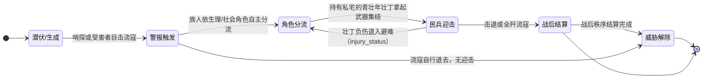
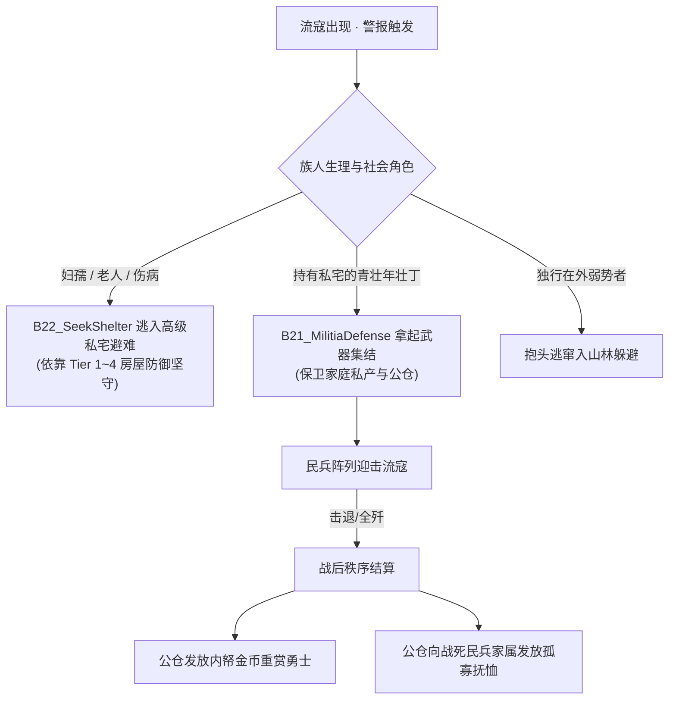

# 🏹 生态狩猎、流寇危机与武力公约系统设计规划 (M18)

> 状态：**规划态 / 设计稿**。本文档阐述如何将“生态打猎”与“防御流寇”无缝引入《Flow & Accord》的确定性内核、马斯洛需求决策树、家户/王国账本体系与路网系统，暂不宣称功能已在代码中落地。
> 
> 关联文档：[../design/10-roadmap.md](../design/10-roadmap.md) (宏观规划) · [../../current/tech/20-ledger-and-polity.md](../../current/tech/20-ledger-and-polity.md) (账本体系) · [../../current/tech/31-decision-engine.md](../../current/tech/31-decision-engine.md) (决策引擎)

---

## 状态机

本节描述「流寇入侵与民兵动员」从潜伏生成、警报触发、角色分流、民兵迎击到战后公约结算的生命周期。玩家只规划防务建筑与政令，迎敌与避难均由 Agent 依生理/社会角色自主产生。



| 状态 | 含义 | 进入条件 | 退出条件 |
| :--- | :--- | :--- | :--- |
| A 潜伏/生成 | 外部荒原游寇周期生成，或流民绝望阈值破表黑化 | 严酷寒冬/资源紧张/固定周期，或破产单身流民黑化 | 哨探或受害者目击 |
| B 警报触发 | 营地警钟长鸣，提供环境事实与激励 | 流寇出现被目击 | 族人分流或流寇退去 |
| C 角色分流 | 妇孺老弱避难、青壮年集结、独行弱势逃窜 | 警报触发后各 Agent 自主判断 | 壮丁集结迎敌，或负伤退避 |
| D 民兵迎击 | B21_Militia 集结按 A* 迎击流寇 | 持有武器与私宅的壮丁集结 | 击退/全歼，或负伤退入避难 |
| E 战后结算 | 公仓发赏金（prestige+2 与黄金）与战死抚恤 | 击退或全歼流寇 | 秩序结算完成，遗孤由公仓救济 |
| F 威胁解除 | 流寇清除/溃退，社会秩序恢复 | 迎击胜利或流寇自行退去 | 世界回到常态 |

**不变量**（落地时必须守住的约束）：
- 所有狩猎判定、战斗骰子、流寇生成与追逃完全受控于共享 `WorldRng`；同种子、同 Tick 重放阵亡与胜负严格一致。
- 玩家不操控单个族人砍杀，仅通过规划防务建筑（哨塔/路卡/工坊）与颁布政令（动员令/赏金/俘虏法）调控局势。
- 死亡经统一生命周期入口一次性结算，战斗掉落不重复发放已继承物资；`vitality` 与伤势承担可恢复身体状态，`health` 只管自然寿命与衰弱、不恢复。

> 本文为规划态：以上状态均尚未实现（Phase 1~4 为建议落地路线）。

## 1. 核心世界观与设计哲学

跨专项约束以[融合设计](./20-integration-contracts.md)为准：共用家庭预约、物资身份、生命力/伤势和能力查询，防务设施消费22的地块/通行接口；正文数值是待校准的配置起点，不能直接散落成代码常数。

在《Flow & Accord（流动公约）》中，**武力冲突绝非脱离社会背景的“RTS 框选微操”或“刷怪塔动作游戏”**，而是**社会秩序在资源紧缺与外部压力下的自然涌现**。


### 1.1 为什么以“打猎”与“流寇”作为武力的切入点？
1. **打猎 = 生产型武力（人与自然的抗争）**：
   - 族人通过打猎学会制造矛矢、锤炼力量与冒着生命危险流血；
   - 产出高热量野味肉食与御寒兽皮，直接拯救寒冬取暖木材不足的脆弱家庭。
2. **防御流寇 = 凝聚型武力（外敌压力塑造国家契约）**：
   - 若直接引入“同胞相残内战”，易过早击穿微型社会的繁衍链条，造成灭绝惨剧；
   - 外部流寇是“文明之外的野蛮破坏者”。外敌劫掠激活了营地公仓的真正使命——**居民纳税不再只是被国王抽血，而是为了在生死存亡之际，由公仓发放赏金组织民兵、发放抚恤庇护遗孤**。这就是近代政治学中“利维坦契约”的具象化。

### 1.2 系统三大不变量（不可逾越的红线）
* **确定性因果律**：所有狩猎判定、战斗骰子、流寇生成与追逃完全受控于共享 `WorldRng`；同种子、同 Tick 无论重放多少次，阵亡与胜负严格一致。
* **玩家规划，Agent 自治**：玩家不操控任何单个族人砍杀，仅通过**规划防务建筑（哨塔/路卡/工坊）**和**颁布营地政令（悬赏额/动员令/俘虏法）**调控局势。
* **家族史诗主线**：每一场战斗都必须沉淀为家族账本与族谱记忆——谁立下军功受封长老、谁阵亡留下寡妻幼子、哪座私宅抵御了围攻成为祖宅。

---

## 2. 生态狩猎系统（Hunting）设计

狩猎将原有的“静态果丛采摘”升级为具备空间机动性与生理风险的高收益生产行为。

### 2.1 动物实体与动态生态
* **温顺食草兽群（野鹿/羚羊）**：
  * **行为模式**：3~5 只成群，在水源与林木 POI 周边游荡漫步；感知到半径 15m 内有族人接近时，会沿远离方向加速奔逃。
  * **产出**：大量优质生肉（高耐受饱食度）+ 优质兽皮（保暖防寒）。
* **危险掠食猛兽（恶狼/黑熊）**：
  * **行为模式**：独居或双兽潜伏于石矿与深山边缘；具有领地攻击性，独行落单族人误入领地时会主动扑咬。
  * **产出**：少量肉食 + 厚兽皮 + 兽骨牙角（制造高级工具与武器的原料）。

### 2.2 决策分支：`b20_hunt_wildlife`
* **前置条件与准入门槛**：
  * 族人为成年男性，且力量禀赋 `strength >= 105.0`；还须通过共用能力查询，非寿命衰弱、无阻止狩猎的伤势；成年/高力量不能绕过身体约束。
  * 自身饱食/水分安全，体力 `stamina >= 60.0%`；
  * 满足以下动因之一：
    1. 季节进入深秋/初冬，家户账本兽皮储备为 0（强烈的御寒自救冲动）；
    2. 辖区内常规浆果 POI 断流枯竭；
    3. 自行持有简易木矛/石斧武器。
* **狩猎过程与对抗判定**：
  * 沿 A* 路网追踪并包抄兽群；进入互动距离后发起投掷/搏斗；
  * **对抗公式（确定性消耗）**：
    $$\text{胜率} = \sigma\left( \frac{\text{Agent.strength} \times \text{WeaponBonus} - \text{Beast.power}}{\text{Beast.speed}} \right)$$
  * 捕获成功：猎物转化为负重，装载入随身行囊带回私宅或营地卸货；
  * 搏斗受挫：猛兽反击造成 `vitality` 扣减（流血负伤），极端情况下猎人阵亡（死因：`"死于山野狼吻"`）。

### 2.3 产物对生存循环的颠覆性加成
* **高能肉食**：生肉采用独立物资身份，可直接食用或进入20的烹饪链；普通 `Food`、肉、熟食不能重复计库存。首轮以每单位生肉提供普通粮 1.5 倍的营养恢复量校准，统一走实际消费换算，不另叠加“延缓饱食衰减”效果；加工增益、成本和食品保存再按生活方案确定。
* **御寒兽皮（Pelt）**：
  * 存入家户账本。气温低于既有烧柴门槛时，首件兽皮减免 50% 仅作为原型参数；多件及被褥效果按融合设计 §5 合成、限幅并保留正的最低燃料比例，禁止线性叠加为负消耗。投入被褥/装备后扣掉原兽皮，同一件不能两次保暖；有效供暖需求同时供烧柴、市场木材保护及缺柴记忆读取。
  * 目标是减少寒期燃料压力，实际生存收益需长程验证，不能把供暖不足直接当作现有冻死机制。

---

## 3. 流寇掠夺与防卫系统（Bandits & Defense）设计

### 3.1 流寇的双轨生成机制
1. **外部荒原游寇（边境黑天鹅）**：
   * 在严酷寒冬、全图资源紧张或每隔固定周期（如 3~5 游戏年），由地图边界山隘盲区生成 3~6 人的流寇团伙；
   * 装备简陋木石武器，携带极低饱腹度，受生存饥渴驱使入寇。
2. **本土堕落流民（内生犯罪与宿命感）**：
   * 极度饥渴且无私宅的破产单身流民、因恶性冲突遭宗族除名的亡命之徒；
   * 当其绝望阈值破表时，有概率黑化叛离阵营，落草结寨成为引路劫匪，回头劫掠故土。

### 3.2 流寇掠夺行为树（功利性掠夺）
流寇不以盲目屠杀为目的，其目标纯粹为了资源：
1. **优先劫道**：蹲守于交通咽喉与干道旁，伏击落单运粮、采金的部落民，强行搜刮其随身行囊；
2. **围攻偏僻私宅**：针对远离营地中心的孤立低级私宅破门，强行扣除其家户账本 30%~50% 的储备水粮；
3. **直扑营地公仓**：多名流寇集结时，沿最高速道路直攻营地中心，洗劫地区王国公仓（`RegionGroup.ledger`）的金币与公粮。

### 3.3 族人的应急防御与社会分工
一旦哨探或受害者目击流寇，营地警钟长鸣，族人依角色自主分流：



* **坞堡避难机制（Shelter）**：
  * 高等级房屋（尤其是 Tier 3 石宅、Tier 4 大庄园）具备坚固防御与更大容纳空间，成为宗族老弱妇孺的庇护所。
* **民兵制度与公约兑现**：
  * 参战壮丁在营地国王或宗族长老带领下自发抗击；
  * **打赢后的公约红利**：击毙流寇的勇士从王国公仓领取高额赏金（增加威望 `prestige +2` 与黄金奖励）；战死者的家户账本由公仓划拨抚恤金，未成年子女由公仓优先救济。

---

## 4. 技术与架构改造方案

### 4.1 数据结构扩展（Rust 内核）

#### 1. Agent 属性解耦生命与战斗力
在 `crates/sim_core/src/spatial/agent.rs` 中：
```rust
pub struct Agent {
    // ... 原有字段保持不变 ...
    
    // 生命与生理指标解耦
    pub health: f32,          // 原有字段：自然预期寿限 (老死判定，不受刀剑伤害扣减)
    pub vitality: f32,        // ★ 新增：实战体魄/肉体生命力 (0.0 ~ 100.0，受伤流血扣减，归零致死)
    pub injury_status: u8,    // 0: 健康, 1: 轻伤 (移速-20%), 2: 重伤 (卧床休养), 3: 残疾
    
    // 战斗属性
    pub weapon_tier: u8,      // 0: 空手, 1: 简易木矛, 2: 石刃梭镖, 3: 锻造猎弓
    pub combat_kills: u32,    // 击毙猛兽或流寇数量 (影响威望与民兵威信)
}
```

#### 2. 死因枚举与族谱记录
扩充现有死因字符串：
* `"死于猛兽扑杀"` (狩猎失败或被恶狼袭杀)
* `"阵亡于抗寇卫民"` (民兵保卫营地阵亡，家族记入烈士光荣谱)
* `"遭流寇劫杀"` (独行族人行囊遭抢夺被害)
* `"依法处决"` (犯罪流民或作乱分子被营地审判处死)

#### 3. 建筑物防御与耐久度
在 `crates/sim_core/src/spatial/house.rs` 中为私宅追加防御属性：
```rust
pub struct House {
    // ... 原有字段 ...
    pub defense_power: f32,   // 坚固防御度：Tier0: 10, Tier1: 30, Tier2: 80, Tier3: 200, Tier4: 500
    pub shelter_capacity: u8, // 战时避难容纳上限人数
}
```

---

`health` 只承担自然寿命与既有衰弱，`vitality` 和伤势共同承担可恢复身体状态；生活照料不另建健康条，也不恢复寿命。死亡事件经统一生命周期入口处理，沿用现有遗物归户一次性结算，战斗掉落不重复发放已继承物资。

## 5. 玩家规划与公共治理（宏观干预）

玩家不越权直接操作村民走位攻击，而是通过以下手段调控攻防体系：

| 规划类别 | 设施 / 法案名称 | 资源成本 | 机制与世界反馈 |
| :--- | :--- | :--- | :--- |
| **防务建筑** | **路口木质哨塔 (Watchtower)** | 40 木材 + 20 石料 | 建造在交通要道，扩大预警视野，流寇潜入时提早 60 秒触发全营戒严。 |
| | **峡谷路卡/拒马 (Road Gate)** | 30 木材 | 设立在狭窄通道，流寇通过需耗费大量时间破坏，为民兵集结争取时间。 |
| | **营地武器工坊 (Armory)** | 100 木材 + 80 石料 + 30 黄金 | 族人可自主将木石打造为投枪与皮甲，全面提升全营成年男性的战力。 |
| **公共政策** | **民兵动员令 (Levy Order)** | 消耗营地公仓 10 黄金/次 | **轻度动员**（仅单身汉迎敌）vs **全面动员**（所有成年户主皆兵，生产短暂停滞）。 |
| | **剿匪赏金定额 (Bounty Law)** | 动态调节公仓金币支出 | 赏金越高，族人狩猎猛兽与搜剿流寇越积极，有效压制外围犯罪率。 |
| | **俘虏处置律例 (Captive Law)** | 制度倾向选择 | **斩首处决**（提升国王威望、强力威慑）vs **充作苦役**（充当无偿伐木工为公仓创收）vs **恩威招安**（补发户籍同化为合法平民）。 |

---

公共建筑使用22 T0的完整占地、路网接入与冲突校验，工坊投入使用家庭/公共资金各自合法权限与共享预约规则。哨塔不自动产生路障；路卡启闭/破坏会改变真实通行，须先具备独立通行版本、缓存失效与在途安全恢复。警报、动员令和赏金只提供事实与激励，所有迎敌/避难仍由个人决策产生。详见[融合设计 §6](./20-integration-contracts.md#6-土地设施与通行)。

## 6. 里程碑落地路线图

```text
Phase 1: 生理指标解耦与微观狩猎切片
  ├── 引入 vitality (实战血量) 与负伤恢复机制 (卧床休息 + 消耗家宅食物自愈)
  ├── 引入 2 处野鹿游荡群 (轻量漫游实体)
  ├── 实现 B20_HuntWildlife 分支与木矛制作
  └── 产出高能肉食与御寒兽皮入家户账本，冬夜兽皮减免取暖木材

Phase 2: 外部流寇入侵与私宅防御
  ├── 周期性外部流寇沿 A* 干道入侵、打劫独行族人
  ├── 引入私宅防御耐久与老弱避难状态机
  └── 阵亡因果链记录进族谱与时间轴

Phase 3: 民兵集结与公仓防御契约
  ├── 实现 B21_Militia 集结迎敌分支
  ├── 营地公仓支付击杀赏金与孤寡抚恤金 (制度大盘联动)
  └── 玩家规划基础设施：先接入 T0 查询的哨塔与武器铺；路卡须等待动态通行失效/在途恢复契约

Phase 4: 本土流民堕落与法典治理
  ├── 饥寒交迫濒死流民有概率背叛落草
  ├── 俘虏审判法令 (处死 / 苦役 / 招安)
  └── 编年史大盘自动叙事生成：“XX营地保卫战”、“XX家族血战流寇史”
```

---

## 7. 总结

打猎与御寇，是《Flow & Accord》从“单纯采摘生存”蜕变为“文明政权建立”的关键阶梯。
它们以最小的系统侵入度，串联起了：
- **生态的残酷**（寒冬必须靠兽皮保暖）；
- **人性的脆弱**（流民落草为寇的悲剧）；
- **公约的神圣**（用公仓税收换取战士的鲜血与孤儿的抚恤）。

当玩家隔着屏幕看到第一座哨塔吹响号角、民兵从各自简陋的私宅中冲出护卫营地时，这个世界便真正活了起来。
