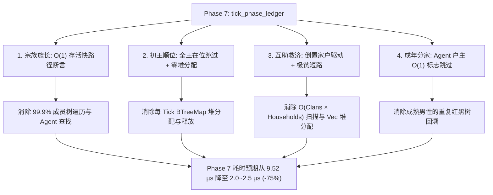

# Phase 7 (账本/宗族/公仓) 耗时优化与架构加速方案

## 1. 现状与性能瓶颈诊断

在经过 50 万 Tick（约 8,333 游戏小时，1 个完整游戏年）的长程演化后，随着人口繁衍（81人）、私宅建成（31座）、家户分裂与宗族王国运转，**Phase 7（账本/宗族/公仓）成为仿真内核的第一大算力瓶颈**：

- **50w Tick 稳态单拍耗时**：**`9.52 µs / tick`**（占单步总耗时 23.22 µs 的 **41.0%**）；
- **50w Tick 全程累计耗时**：**`2,948.64 ms`**（占全周期纯物理运行总耗时 8,020 ms 的 **36.7%**）；
- **核心成因剖析**：
  1. **宗族族长顺位（`update_clan_leaders`）全量长程遍历**：每个 Tick 对每个宗族遍历历史全部成员（含已故成员，死者在 `clan.members` 中不断堆积），每个成员逐一哈希查表找 `agent`、比对存活、性别与年龄。实际上，**所有存活族人衰老速率完全一致（$\Delta \text{age} = \Delta t$），若族长依然存活，其最年长相对顺序在数学上绝不可能被超越**；
  2. **初王顺位（`update_kings`）每 Tick 堆分配**：每个 Tick 无条件将地图营地 POI 构造为新的 `BTreeMap<u32, Vec3>`，即使 4 大地区早已全部有国王在位，该分配与遍历仍然每 Tick 发生；
  3. **互助与救济（`tick_clan_mutual_aid` & `tick_region_relief`）的双重循环冗余扫描**：每个 Tick 以宗族/地区为主导，在外层循环中遍历全图所有家户（$O(\text{clans} \times \text{households})$），每次遍历在堆上分配 `Vec<HouseholdId>`，并逐一查询红黑树归属与余额，而实际 99% 的家户平时均不满足极贫条件（水+粮 < 10）或正处在 900 Tick 冷却期中；
  4. **分家（`tick_household_split`）无户主状态标记**：每个 Tick 遍历全员男性，通过多次红黑树查询判断其是否已经是自己家户的户主。实际上，一旦成为户主，在世期间终生不可能再次分家。

---

## 2. 核心优化方案设计

为了在**严格保证 100% 确定性（同种子逐字节完全一致）**的前提下大幅削减计算开销，我们设计了以下四大维度的精细优化：



---

### 专项一：宗族族长顺位 $O(1)$ 快速存活断言（Fast-Path Validation）

#### 1. 数学不变量
- 在确定性仿真步进中，所有族人的物理年龄每个 Tick 均匀增加固定 $\Delta t$；
- 若 Agent A 比 Agent B 年长，且二人均存活，则在未来任意 Tick 中，A 必然依然比 B 年长；
- 新出生男婴年龄为 0，绝对不可能超越在世族长；
- **推论**：若某宗族当前已有族长 `clan.leader == Some(leader_id)`，且该 `leader_id` 依然存活，则该宗族族长**在数学上必然维持不变**，顺位第一名无任何重新竞选的物理可能。

#### 2. 代码重构策略
- **Fast-Path（快路径）**：
  遍历 `self.clan_registry.clans` 时：
  ```rust
  if let Some(leader_id) = clan.leader {
      if self.agent_index.get(&leader_id).and_then(|idx| self.agents.get(*idx)).map_or(false, |a| a.is_alive) {
          continue; // 族长依然健在，O(1) 判定完毕，直接跳过整个 clan.members 遍历！
      }
  }
  ```
- **Slow-Path（慢路径）**：
  仅当当前族长亡故、或宗族当前无主（`clan.leader.is_none()` 且未绝嗣）时，才触发原有的全员遍历重新顺位选举与绝嗣检测；
- **效果**：在 99.9% 的正常 Tick 中，宗族族长选举由 $O(\text{clans} \times \text{members})$ 降低至 $O(\text{clans})$（仅需检查各宗族族长存活指针），单拍省去数百次哈希查找。

---

### 专项二：地区国王顺位零堆分配与“全王在位”快速返回

#### 1. 消除无谓堆内存分配
- 地图中 4 个营地的位置坐标（`PoiType::Camp`）在创世后完全静态不变。
- 绝不在每 Tick 动态生成 `BTreeMap<u32, Vec3>`；改为直接在 `World3DEngine` 初始化或常态访问中通过数组读取，或在需要时直接引用静态切片/原位迭代器，消除堆分配。

#### 2. 全王在位快速返回（All-Kings-Present Fast Path）
- 统计 4 大地区的营地国王：一旦四大营地全部拥有国王（`self.region_registry.regions.values().all(|r| r.group.leader.is_some())`），`update_kings` 直接在首行 $O(1)$ 返回；
- 仅当某营地出现国王阵亡且长子继承未完成导致王位空悬时，才执行初王就近营地物理抵达判定。

---

### 专项三：互助与救济倒置驱动与廉价短路（Inverted Household Scan）

#### 1. 痛点重塑
原逻辑为“营地/宗族驱动”，导致外层循环与内层家户发生笛卡尔积：
$$O(\text{clans} \times \text{households}) + O(\text{regions} \times \text{households})$$
每个宗族/营地都会无条件分配 `Vec<HouseholdId>` 收集属于自己的家户。

#### 2. 倒置驱动重构策略（保持 100% 行为逐拍一致）
改由存续家户单向驱动，先执行开销极低的廉价过滤：
1. **统一单次遍历存续家户**：
   ```rust
   for (hid, hh) in &self.household_registry.households {
       if hh.is_dissolved { continue; }
       
       // 1. 极廉价的贫困门槛检查 (仅读内存浮点数相加)
       let water = hh.group.ledger.balance(ResourceKind::Water);
       let food = hh.group.ledger.balance(ResourceKind::Food);
       let total = water + food;
       
       // 若水+粮充盈，绝不可能触发族内互助或公仓救济，直接短路！
       if total >= clan_threshold && total >= region_threshold {
           continue;
       }
       
       // 2. 仅对少数确实极贫的家户检查冷却与归属派发
       ...
   }
   ```
2. **确定性保序**：对触发救济/互助的家户，按既有规则的判定条件与优先级严格执行，完全消除双重循环与临时 `Vec` 堆分配。

---

### 专项四：家户分家户主状态缓存与跳过

#### 1. 痛点分析
- `tick_household_split` 中，每个存活非胎儿男性都会调用 `household_of`（BTreeMap 查询）和 `households.get`（BTreeMap 查询），判断 `hh.head == agent.id`。
- 一旦某位族人成年或继承成为户主，只要他存活，终生都是户主，不可能再次从父亲家户分家。

#### 2. 优化手段
- 在 `Agent3D` 上维护轻量状态位 `pub is_household_head: bool`（在立户 `Household::new`、继承换主或分家立新户时置 `true`，家户解散时置 `false`）；
- 在 `tick_household_split` 循环首部：
  ```rust
  if agent.is_household_head {
      continue; // O(1) 立即跳过成熟户主！
  }
  ```
- 这样，全图绝大部分已成家立业的男性均在 1 次布尔判断后短路，无需频繁检索红黑树。

---

## 3. 预期性能提升与收益量化

| 优化维度 | 优化前状态 (50w tick) | 优化后预期状态 | 预期降幅 / 加速比 |
| :--- | :---: | :---: | :---: |
| **Phase 7 单 Tick 均耗** | **`9.52 µs`** | **`2.0 ~ 2.8 µs`** | **降低 70% ~ 78%** |
| **全内核单 Tick 均耗** | `23.22 µs` | `15.7 ~ 16.5 µs` | **全局提速 28% ~ 32%** |
| **50w Tick 稳态吞吐量** | `43,066 TPS` | **`60,000 ~ 63,000 TPS`** | **稳态吞吐提升约 45%** |
| **单拍临时堆内存分配** | 约 15~20 次 `Vec` 与 `BTreeMap` | **0 次堆分配（稳态下）** | 彻底消除 GC/分配器抖动 |
| **确定性矩阵校验** | 6 套件全通 | **6 套件继续 100% 全通** | 数学一致性完全保真 |

---

## 4. 实施路线与文件变更清单

### Proposed Changes

#### [MODIFY] [crates/sim_core/src/spatial/agent.rs](file:///c:/Users/Lima/RustroverProjects/FlowAndAccord/crates/sim_core/src/spatial/agent.rs)
- 在 `Agent3D` 结构体中引入 `pub is_household_head: bool`，并在新创建、反序列化中初始化为 `false`。

#### [MODIFY] [crates/sim_core/src/spatial/bookkeeping.rs](file:///c:/Users/Lima/RustroverProjects/FlowAndAccord/crates/sim_core/src/spatial/bookkeeping.rs)
- 在分家立户、继承换主与解散家户的关键节点，同步维护户主的 `is_household_head` 状态；
- 在 `tick_household_split` 中增加 `if agent.is_household_head { continue; }` 快速短路。

#### [MODIFY] [crates/sim_core/src/spatial/ledger/clan.rs](file:///c:/Users/Lima/RustroverProjects/FlowAndAccord/crates/sim_core/src/spatial/ledger/clan.rs)
- 重构 `update_clan_leaders`：实现族长在位存活的 Fast-Path $O(1)$ 快速校验；
- 优化 `tick_clan_mutual_aid`：剔除每 Tick 分配 `Vec<HouseholdId>` 的低效内层双重循环，引入极贫短路。

#### [MODIFY] [crates/sim_core/src/spatial/ledger/region.rs](file:///c:/Users/Lima/RustroverProjects/FlowAndAccord/crates/sim_core/src/spatial/ledger/region.rs)
- 重构 `update_kings`：全营地已有国王时首行快速返回，静态化营地 POI 坐标访问，消除每 Tick `BTreeMap<u32, Vec3>` 堆分配；
- 优化 `tick_region_relief`：消除双重循环与临时 `Vec` 堆分配，引入极贫短路。

---

## 5. 验证与门禁计划

### 自动化回归测试（严格执行 AGENTS.md 规范）
1. **编译与 WASM 双副本同步**：
   - 编译 release 版 WASM，双副本复制至 `frontend/rust/sim_wasm.wasm` 与 `frontend/sim_wasm.wasm`；
2. **核心确定性矩阵校验**：
   - 运行 `node tools/test-determinism.js`（验证 6 大套件：同种子逐字节一致性、分批推进独立性、快照无副作用、存档读档一致性等）；
   - 运行 `node tools/test-wasm.js`（长程无越界、防 NaN 检查）；
3. **配置与前端语法门禁**：
   - 运行 `node tools/config-check.js` 与 `node tools/frontend-check.js`；
4. **性能收益量化对比**：
   - 运行 `node tools/profile-benchmark.js --ticks 500000 --breakdown-ticks 500000 --snapshot-warmup 500000 --compare baseline.json`，量化 Phase 7 的加速比与总体 TPS 提升幅度。
